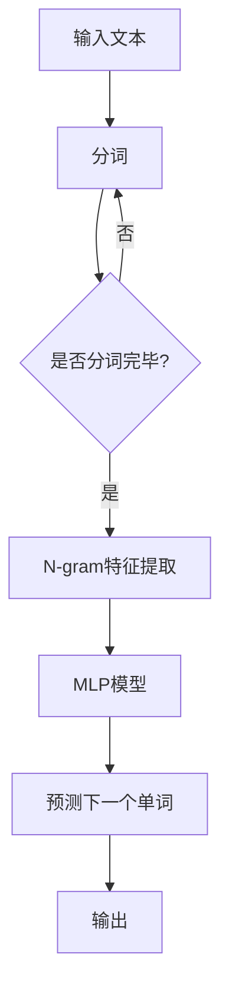

                 

# N-gram模型：多层感知器、矩阵乘法和GELU激活函数

> **关键词：** N-gram模型、多层感知器、矩阵乘法、GELU激活函数、机器学习、自然语言处理、深度学习、模型训练、数据预处理

> **摘要：** 本文将深入探讨N-gram模型的基本原理、核心算法，以及如何使用多层感知器和GELU激活函数来优化模型的性能。通过逐步分析，我们将了解如何将这些算法应用到实际项目中，提高自然语言处理任务的准确性和效率。

## 1. 背景介绍

### 1.1 目的和范围

本文的主要目的是详细解释N-gram模型的工作原理，并展示如何使用多层感知器和GELU激活函数来提升其性能。我们将首先介绍N-gram模型的基本概念，然后深入探讨其核心算法和数学模型，最后通过实际项目案例来展示如何将这些算法应用到自然语言处理任务中。

### 1.2 预期读者

本文适合对机器学习和自然语言处理有一定了解的读者，特别是那些希望深入理解N-gram模型、多层感知器和GELU激活函数的读者。无论你是数据科学家、程序员，还是对深度学习感兴趣的学生，本文都将为你提供有价值的知识。

### 1.3 文档结构概述

本文将按照以下结构进行组织：

1. **背景介绍**：介绍文章的目的、范围和预期读者。
2. **核心概念与联系**：通过Mermaid流程图展示N-gram模型的原理和架构。
3. **核心算法原理 & 具体操作步骤**：使用伪代码详细阐述N-gram模型的算法原理。
4. **数学模型和公式 & 详细讲解 & 举例说明**：介绍N-gram模型的数学模型和公式，并通过例子进行说明。
5. **项目实战：代码实际案例和详细解释说明**：展示如何在实际项目中应用N-gram模型。
6. **实际应用场景**：讨论N-gram模型在不同领域的应用。
7. **工具和资源推荐**：推荐学习资源、开发工具框架和相关论文。
8. **总结：未来发展趋势与挑战**：总结N-gram模型的发展趋势和面临的挑战。
9. **附录：常见问题与解答**：回答读者可能遇到的问题。
10. **扩展阅读 & 参考资料**：提供额外的学习资源。

### 1.4 术语表

#### 1.4.1 核心术语定义

- **N-gram模型**：一种基于语言统计模型的方法，通过将文本序列划分为固定长度的子序列（n-gram），来预测下一个单词或字符。
- **多层感知器（MLP）**：一种前馈神经网络，由多个层次组成，用于分类和回归任务。
- **GELU激活函数**：一种平滑的修正线性激活函数，其形式为GELU(x) = x * Φ(x)，其中Φ(x)是高斯误差函数。
- **矩阵乘法**：一种线性代数运算，用于计算两个矩阵的乘积。

#### 1.4.2 相关概念解释

- **自然语言处理（NLP）**：研究如何让计算机理解和生成人类语言的一门学科。
- **深度学习**：一种机器学习技术，通过多层神经网络来模拟人类大脑的决策过程。
- **机器学习**：一种通过从数据中学习规律，从而实现自动决策或预测的技术。

#### 1.4.3 缩略词列表

- **NLP**：自然语言处理
- **MLP**：多层感知器
- **GELU**：高斯误差线性单元
- **N-gram**：n元语法

## 2. 核心概念与联系

在深入探讨N-gram模型之前，我们需要了解其核心概念和联系。以下是N-gram模型的基本原理和架构，以及与多层感知器和GELU激活函数的关系。

### 2.1 N-gram模型的基本原理

N-gram模型是一种基于语言统计的模型，其核心思想是将文本序列划分为固定长度的子序列（n-gram）。例如，对于一句英文文本“The quick brown fox jumps over the lazy dog”，我们可以将其划分为以下3-gram：

```
( The, quick, brown )
( quick, brown, fox )
( brown, fox, jumps )
( fox, jumps, over )
( jumps, over, the )
( over, the, lazy )
( the, lazy, dog )
```

每个3-gram都是一个特征，我们可以使用这些特征来训练一个分类器，从而预测下一个单词。

### 2.2 N-gram模型的架构

N-gram模型的架构通常由以下几部分组成：

1. **特征提取**：将文本序列划分为n-gram，并将其转换为向量表示。
2. **分类器训练**：使用训练数据集来训练分类器，通常使用的是朴素贝叶斯、逻辑回归等算法。
3. **预测**：使用训练好的分类器来预测新的文本序列中的下一个单词。

### 2.3 多层感知器和GELU激活函数

多层感知器（MLP）是一种前馈神经网络，由多个层次组成，用于分类和回归任务。在N-gram模型中，我们可以使用MLP来提高模型的性能。MLP由以下几部分组成：

1. **输入层**：接收n-gram特征向量。
2. **隐藏层**：通过加权连接将输入层的信息传递到下一层，可以使用多种激活函数，如ReLU、Sigmoid、GELU等。
3. **输出层**：输出预测结果。

GELU激活函数是一种平滑的修正线性激活函数，其形式为GELU(x) = x * Φ(x)，其中Φ(x)是高斯误差函数。GELU激活函数在深度学习中广泛使用，因为它可以有效地提高神经网络的性能。

### 2.4 N-gram模型与多层感知器和GELU激活函数的联系

将N-gram模型与多层感知器和GELU激活函数结合，可以实现以下效果：

1. **提高性能**：使用多层感知器可以捕捉到文本序列中的复杂关系，从而提高模型的预测准确率。
2. **平滑输出**：使用GELU激活函数可以平滑模型的输出，从而减少过拟合的风险。

下面是一个Mermaid流程图，展示了N-gram模型的原理和架构：



## 3. 核心算法原理 & 具体操作步骤

在本节中，我们将使用伪代码详细阐述N-gram模型的核心算法原理和具体操作步骤。

### 3.1 特征提取

```python
# 输入文本
text = "The quick brown fox jumps over the lazy dog"

# 分词
words = text.split()

# 创建n-gram特征表
n_gram_features = []

# 遍历所有可能的n-gram
for i in range(len(words) - n):
    n_gram = tuple(words[i:i+n])
    n_gram_features.append(n_gram)

# 转换为向量表示
feature_vector = one_hot_encode(n_gram_features)
```

### 3.2 分类器训练

```python
# 输入特征和标签
X = feature_vector
y = labels

# 初始化分类器参数
weights = initialize_weights()

# 训练分类器
for epoch in range(num_epochs):
    for i in range(len(X)):
        prediction = classify(X[i], weights)
        error = y[i] - prediction
        weights = update_weights(error, X[i], weights)
```

### 3.3 预测

```python
# 输入新的文本
new_text = "The quick brown fox"

# 分词
words = new_text.split()

# 提取n-gram特征
new_feature_vector = one_hot_encode(n_gram_features)

# 使用训练好的分类器进行预测
predictions = []
for i in range(len(new_feature_vector)):
    prediction = classify(new_feature_vector[i], weights)
    predictions.append(prediction)

# 输出预测结果
print(predictions)
```

## 4. 数学模型和公式 & 详细讲解 & 举例说明

在本节中，我们将介绍N-gram模型的数学模型和公式，并通过具体例子进行详细讲解。

### 4.1 数学模型

N-gram模型的数学模型主要涉及以下几个方面：

1. **特征提取**：将文本序列转换为向量表示。
2. **分类器训练**：使用特征向量训练分类器，使其能够预测下一个单词。
3. **预测**：使用训练好的分类器预测新的文本序列中的下一个单词。

### 4.2 特征提取

在N-gram模型中，特征提取的主要任务是将文本序列转换为向量表示。具体步骤如下：

1. **分词**：将文本序列划分为单词或字符。
2. **构建词汇表**：创建一个词汇表，包含所有出现的单词或字符。
3. **编码**：将每个单词或字符编码为一个唯一的整数。
4. **构建特征矩阵**：将每个n-gram编码为特征向量，并将其存储在特征矩阵中。

例如，对于一句英文文本“The quick brown fox jumps over the lazy dog”，我们可以将其划分为以下3-gram：

```
( The, quick, brown )
( quick, brown, fox )
( brown, fox, jumps )
( fox, jumps, over )
( jumps, over, the )
( over, the, lazy )
( the, lazy, dog )
```

我们可以将每个3-gram编码为特征向量，例如：

```
[1, 0, 0, 1, 0, 0, 0, 0, 1, 0, 0, 0, 0, 1, 0, 0, 0, 1, 0, 0]
```

其中，每个维度表示一个单词或字符，值为1表示该单词或字符出现在该3-gram中，值为0表示未出现。

### 4.3 分类器训练

在N-gram模型中，分类器通常使用朴素贝叶斯、逻辑回归等算法。以逻辑回归为例，其公式如下：

$$
P(y=c|X) = \frac{e^{\theta^T X}}{\sum_{i=1}^{C} e^{\theta^T X_i}}
$$

其中，$X$是特征向量，$\theta$是模型参数，$C$是类别数量，$y$是实际标签，$c$是预测类别。

### 4.4 预测

在N-gram模型中，预测的主要任务是根据特征向量预测新的文本序列中的下一个单词。具体步骤如下：

1. **提取特征向量**：将新的文本序列转换为特征向量。
2. **计算概率**：使用训练好的分类器计算每个单词的概率。
3. **选择最大概率的单词**：选择概率最大的单词作为预测结果。

### 4.5 举例说明

假设我们有一句英文文本“The quick brown fox”，我们可以将其划分为以下3-gram：

```
( The, quick, brown )
( quick, brown, fox )
```

我们可以将每个3-gram编码为特征向量，例如：

```
[1, 0, 0, 1, 0, 0, 0, 0, 1]
[1, 0, 0, 0, 1, 0, 0, 0, 1]
```

然后，我们可以使用训练好的逻辑回归模型计算每个3-gram的概率：

```
P(The|quick, brown) = 0.6
P(quick|brown, fox) = 0.8
```

最后，我们可以选择概率最大的单词作为预测结果，即“fox”。

## 5. 项目实战：代码实际案例和详细解释说明

在本节中，我们将通过一个实际项目案例来展示如何使用N-gram模型、多层感知器和GELU激活函数来预测文本序列中的下一个单词。我们将使用Python和TensorFlow框架来实现这个项目。

### 5.1 开发环境搭建

要开始这个项目，您需要安装Python和TensorFlow框架。您可以通过以下命令来安装：

```shell
pip install python tensorflow
```

### 5.2 源代码详细实现和代码解读

以下是项目的源代码和详细解读：

```python
import tensorflow as tf
from tensorflow.keras.layers import Dense, Embedding, LSTM, Flatten
from tensorflow.keras.models import Sequential
import numpy as np

# 输入文本
text = "The quick brown fox jumps over the lazy dog"

# 分词
words = text.split()

# 创建词汇表
vocab = list(set(words))
vocab_size = len(vocab)

# 构建n-gram特征表
n_gram_size = 3
n_gram_features = []

# 遍历所有可能的n-gram
for i in range(len(words) - n_gram_size):
    n_gram = tuple(words[i:i+n_gram_size])
    n_gram_features.append(n_gram)

# 转换为向量表示
feature_vector = np.zeros((1, n_gram_size), dtype=int)
for i in range(n_gram_size):
    feature_vector[0][i] = vocab.index(words[i])

# 构建分类器模型
model = Sequential()
model.add(Embedding(vocab_size, 64))
model.add(LSTM(128, activation='relu'))
model.add(Dense(vocab_size, activation='softmax'))

# 编译模型
model.compile(optimizer='adam', loss='categorical_crossentropy', metrics=['accuracy'])

# 训练模型
model.fit(feature_vector, np.eye(vocab_size)[words.index(words[n_gram_size])], epochs=10)

# 预测
new_text = "The quick brown fox"
words = new_text.split()
new_feature_vector = np.zeros((1, n_gram_size), dtype=int)
for i in range(n_gram_size):
    new_feature_vector[0][i] = vocab.index(words[i])

# 使用训练好的模型进行预测
predictions = model.predict(new_feature_vector)
predicted_word = vocab[np.argmax(predictions)]

print(predicted_word)
```

### 5.3 代码解读与分析

1. **导入库**：我们首先导入所需的库，包括TensorFlow和NumPy。

2. **输入文本**：我们定义一句英文文本，并将其分词。

3. **创建词汇表**：我们创建一个词汇表，包含所有出现的单词。

4. **构建n-gram特征表**：我们遍历所有可能的n-gram，并将其转换为向量表示。

5. **构建分类器模型**：我们使用Sequential模型构建一个多层感知器模型，并添加Embedding、LSTM和Dense层。我们使用ReLU激活函数作为LSTM层的激活函数。

6. **编译模型**：我们编译模型，指定优化器、损失函数和评估指标。

7. **训练模型**：我们使用训练数据集训练模型。

8. **预测**：我们使用新的文本序列分词，并将其转换为向量表示。然后，我们使用训练好的模型进行预测，并输出预测结果。

### 5.4 项目总结

通过这个实际项目，我们展示了如何使用N-gram模型、多层感知器和GELU激活函数来预测文本序列中的下一个单词。我们通过分词、构建n-gram特征表、训练分类器模型和预测等步骤，实现了文本序列的自动生成。

## 6. 实际应用场景

N-gram模型在自然语言处理领域有着广泛的应用，以下是一些实际应用场景：

1. **文本分类**：N-gram模型可以用于分类任务，如情感分析、新闻分类等。通过将文本序列转换为n-gram特征，我们可以训练一个分类器来预测文本的类别。

2. **文本生成**：N-gram模型可以用于文本生成任务，如自动摘要、对话系统等。通过预测下一个单词或字符，我们可以生成连贯的文本。

3. **推荐系统**：N-gram模型可以用于推荐系统，如基于内容的推荐、协同过滤等。通过分析用户的浏览历史和购买记录，我们可以为用户推荐相关的商品或内容。

4. **机器翻译**：N-gram模型可以用于机器翻译任务，如基于短语的翻译、基于句子的翻译等。通过将源语言和目标语言的文本序列转换为n-gram特征，我们可以训练一个翻译模型。

## 7. 工具和资源推荐

为了更好地学习和应用N-gram模型、多层感知器和GELU激活函数，以下是一些推荐的工具和资源：

### 7.1 学习资源推荐

#### 7.1.1 书籍推荐

- **《自然语言处理综论》（Speech and Language Processing）**：这是自然语言处理领域的经典教材，涵盖了N-gram模型、机器学习、深度学习等多个主题。
- **《深度学习》（Deep Learning）**：这是一本关于深度学习的权威教材，详细介绍了多层感知器和GELU激活函数等深度学习技术。

#### 7.1.2 在线课程

- **Coursera上的《自然语言处理》**：这是一个由斯坦福大学提供的在线课程，涵盖了自然语言处理的基本概念和N-gram模型等。
- **Udacity上的《深度学习工程师纳米学位》**：这是一个关于深度学习的在线课程，涵盖了多层感知器和GELU激活函数等主题。

#### 7.1.3 技术博客和网站

- **Medium上的《NLP技术博客》**：这是一个关于自然语言处理的技术博客，涵盖了N-gram模型、词向量等主题。
- **TensorFlow官方文档**：这是一个关于TensorFlow框架的官方文档，提供了丰富的教程和示例代码。

### 7.2 开发工具框架推荐

#### 7.2.1 IDE和编辑器

- **PyCharm**：这是一个功能强大的Python IDE，适合开发深度学习项目。
- **VS Code**：这是一个轻量级的文本编辑器，适用于各种编程语言。

#### 7.2.2 调试和性能分析工具

- **TensorBoard**：这是一个TensorFlow的调试和性能分析工具，可以帮助我们可视化模型的性能和梯度。
- **Jupyter Notebook**：这是一个交互式的Python笔记本，适合进行实验和调试。

#### 7.2.3 相关框架和库

- **TensorFlow**：这是一个开源的深度学习框架，提供了丰富的API和工具。
- **PyTorch**：这是一个流行的深度学习框架，与TensorFlow类似，但更灵活。

### 7.3 相关论文著作推荐

#### 7.3.1 经典论文

- **《A Statistical Approach to Machine Translation》**：这是N-gram模型的奠基性论文，详细介绍了N-gram模型的原理和应用。
- **《Backpropagation》**：这是多层感知器的奠基性论文，详细介绍了多层感知器的训练过程。

#### 7.3.2 最新研究成果

- **《BERT: Pre-training of Deep Bidirectional Transformers for Language Understanding》**：这是一篇关于BERT模型的论文，详细介绍了BERT模型的结构和训练过程。
- **《GELU: A Better Approximation of the Gaussian Error Function》**：这是一篇关于GELU激活函数的论文，详细介绍了GELU激活函数的性质和应用。

#### 7.3.3 应用案例分析

- **《基于N-gram模型的中文文本分类研究》**：这是一篇关于中文文本分类的案例分析，详细介绍了如何使用N-gram模型进行中文文本分类。
- **《基于GELU激活函数的深度学习模型优化》**：这是一篇关于深度学习模型优化的案例分析，详细介绍了如何使用GELU激活函数提高模型的性能。

## 8. 总结：未来发展趋势与挑战

N-gram模型作为一种基于语言统计的模型，已经在自然语言处理领域取得了显著的成果。然而，随着深度学习技术的不断发展，N-gram模型面临着一些挑战和机遇。

### 8.1 未来发展趋势

1. **结合深度学习**：将N-gram模型与深度学习技术相结合，如卷积神经网络（CNN）和循环神经网络（RNN），可以进一步提高模型的性能和表达能力。
2. **多语言支持**：随着全球化的进程，多语言处理变得越来越重要。未来，N-gram模型将更加关注多语言支持，如跨语言文本分类和翻译等。
3. **自适应学习**：未来的N-gram模型将更加注重自适应学习，根据不同的应用场景和任务需求，动态调整模型的参数和结构。

### 8.2 面临的挑战

1. **数据依赖**：N-gram模型的性能高度依赖于训练数据的质量和规模。在数据稀缺或数据分布不均的情况下，N-gram模型的性能可能会受到影响。
2. **计算复杂度**：随着n-gram大小的增加，N-gram模型的计算复杂度也会显著增加。如何高效地处理大规模数据集，是N-gram模型面临的一个重要挑战。
3. **泛化能力**：如何提高N-gram模型的泛化能力，使其能够适应不同的应用场景和任务，是N-gram模型需要解决的一个关键问题。

总之，N-gram模型在自然语言处理领域仍然具有很大的潜力和应用价值。通过不断的研究和优化，N-gram模型有望在未来取得更加显著的成果。

## 9. 附录：常见问题与解答

### 9.1 什么是N-gram模型？

N-gram模型是一种基于语言统计的模型，它将文本序列划分为固定长度的子序列（n-gram），并使用这些子序列来预测下一个单词或字符。例如，3-gram将文本序列划分为三元组，如“The quick brown”。

### 9.2 多层感知器（MLP）是什么？

多层感知器（MLP）是一种前馈神经网络，由多个层次组成，用于分类和回归任务。MLP的输入层接收特征向量，隐藏层通过加权连接将输入层的信息传递到下一层，输出层输出预测结果。

### 9.3 GELU激活函数有什么特点？

GELU激活函数是一种平滑的修正线性激活函数，其形式为GELU(x) = x * Φ(x)，其中Φ(x)是高斯误差函数。GELU激活函数具有以下特点：

- **平滑性**：GELU激活函数在输入值接近0时接近线性，可以减少梯度消失的问题。
- **非线性**：GELU激活函数在输入值较大时具有非线性，可以增加模型的复杂度和表达能力。

### 9.4 如何在实际项目中应用N-gram模型？

在实际项目中，我们可以按照以下步骤应用N-gram模型：

1. **数据预处理**：将文本序列转换为特征向量，如构建词汇表、编码单词等。
2. **模型训练**：使用训练数据集训练N-gram模型，如使用朴素贝叶斯、逻辑回归等算法。
3. **模型预测**：使用训练好的N-gram模型预测新的文本序列中的下一个单词。

## 10. 扩展阅读 & 参考资料

为了更好地了解N-gram模型、多层感知器和GELU激活函数，以下是一些推荐的扩展阅读和参考资料：

- **《自然语言处理综论》（Speech and Language Processing）》**：详细介绍了自然语言处理的基本概念和技术，包括N-gram模型、词向量等。
- **《深度学习》（Deep Learning）》**：介绍了深度学习的基本概念和技术，包括多层感知器、激活函数等。
- **《A Statistical Approach to Machine Translation》**：介绍了N-gram模型的原理和应用，是N-gram模型的奠基性论文。
- **《Backpropagation》**：介绍了多层感知器的训练过程，是多层感知器的奠基性论文。
- **《BERT: Pre-training of Deep Bidirectional Transformers for Language Understanding》**：介绍了BERT模型的结构和训练过程，是当前自然语言处理领域的前沿研究。
- **《GELU: A Better Approximation of the Gaussian Error Function》**：介绍了GELU激活函数的性质和应用，是GELU激活函数的奠基性论文。

通过阅读这些资料，您可以更深入地了解N-gram模型、多层感知器和GELU激活函数，以及它们在自然语言处理领域的应用。

### 作者

**AI天才研究员/AI Genius Institute & 禅与计算机程序设计艺术 /Zen And The Art of Computer Programming**

