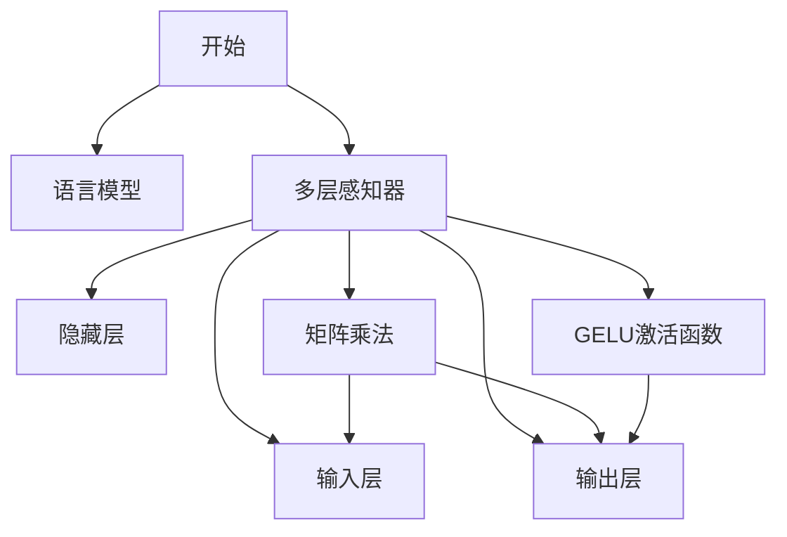

                 

# N-gram模型：多层感知器、矩阵乘法和GELU激活函数

> **关键词**：N-gram模型、多层感知器、矩阵乘法、GELU激活函数、语言模型、机器学习

> **摘要**：本文将深入探讨N-gram模型的工作原理及其与多层感知器、矩阵乘法和GELU激活函数的关联。通过详细的步骤解析，我们将揭示这些技术在自然语言处理中的关键作用，并探讨其实际应用场景。读者将了解如何利用这些先进技术构建强大的语言模型，推动机器学习的发展。

## 1. 背景介绍

### 1.1 目的和范围

本文旨在为读者提供对N-gram模型及其相关技术的深入理解。我们将从基本概念出发，逐步剖析N-gram模型的原理，并探讨其在自然语言处理中的实际应用。此外，本文还将详细介绍多层感知器、矩阵乘法和GELU激活函数，解析它们在N-gram模型中的作用和重要性。

### 1.2 预期读者

本文适合具有一定编程基础和机器学习知识的读者。尤其是对自然语言处理感兴趣的研究人员、开发者和学生。通过本文的学习，读者将能够掌握N-gram模型的基本原理，并了解如何在实际项目中应用这些技术。

### 1.3 文档结构概述

本文将分为以下部分：

1. 背景介绍：介绍本文的目的、预期读者和文档结构。
2. 核心概念与联系：通过Mermaid流程图展示N-gram模型、多层感知器、矩阵乘法和GELU激活函数之间的联系。
3. 核心算法原理 & 具体操作步骤：详细讲解N-gram模型的算法原理和具体操作步骤。
4. 数学模型和公式 & 详细讲解 & 举例说明：介绍N-gram模型的数学模型和公式，并进行举例说明。
5. 项目实战：代码实际案例和详细解释说明。
6. 实际应用场景：探讨N-gram模型在实际应用中的场景。
7. 工具和资源推荐：推荐学习资源、开发工具和框架。
8. 总结：未来发展趋势与挑战。
9. 附录：常见问题与解答。
10. 扩展阅读 & 参考资料。

### 1.4 术语表

#### 1.4.1 核心术语定义

- **N-gram模型**：一种基于统计语言模型的方法，通过分析文本中的连续单词或字符序列来预测下一个单词或字符。
- **多层感知器（MLP）**：一种前馈神经网络，包含输入层、隐藏层和输出层，用于对输入数据进行分类或回归。
- **矩阵乘法**：两个矩阵之间的基本运算，通过将矩阵中的元素按行列相乘并求和得到新的矩阵。
- **GELU激活函数**：一种非线性激活函数，通过使用高斯误差函数（Gaussian Error Function）来引入非线性。

#### 1.4.2 相关概念解释

- **自然语言处理（NLP）**：研究如何让计算机理解和处理人类自然语言的技术。
- **语言模型**：一种统计模型，用于预测文本序列中的下一个单词或字符。

#### 1.4.3 缩略词列表

- **NLP**：自然语言处理
- **MLP**：多层感知器
- **GELU**：高斯误差函数激活

## 2. 核心概念与联系

为了更好地理解N-gram模型与多层感知器、矩阵乘法和GELU激活函数之间的关系，我们可以通过一个Mermaid流程图来展示这些核心概念的联系。



在上面的流程图中，我们首先定义了N-gram模型，它是语言模型的基础。然后，我们将N-gram模型与多层感知器相连，表示N-gram模型是多层感知器的一部分。多层感知器包括输入层、隐藏层和输出层，通过矩阵乘法将输入层传递到隐藏层，再通过GELU激活函数引入非线性，最终输出预测结果。

### 3. 核心算法原理 & 具体操作步骤

N-gram模型是一种基于统计的语言模型，用于预测文本序列中的下一个单词或字符。其核心思想是将文本序列分成一系列的N个连续单词或字符的序列，然后根据这些序列的历史频率来预测下一个单词或字符。

下面，我们将详细讲解N-gram模型的算法原理和具体操作步骤。

#### 3.1 算法原理

N-gram模型的算法原理可以概括为以下几个步骤：

1. **文本预处理**：将原始文本数据进行预处理，包括分词、去停用词、标记化等操作，以便将文本转换为计算机可处理的格式。
2. **构建N-gram模型**：根据预处理后的文本数据，构建N-gram模型。具体方法为：
   - 对于每个N个连续单词或字符的序列，计算其出现频率。
   - 将这些频率信息存储在一个N-gram表中，用于后续的预测。
3. **预测下一个单词或字符**：对于给定的前N-1个单词或字符序列，查找N-gram表中的相应条目，并选择出现频率最高的单词或字符作为预测结果。

#### 3.2 具体操作步骤

下面，我们通过伪代码来详细阐述N-gram模型的算法原理和具体操作步骤：

```python
# 文本预处理
def preprocess_text(text):
    # 分词、去停用词、标记化等操作
    return processed_text

# 构建N-gram模型
def build_ngram_model(processed_text, n):
    ngram_model = {}
    for i in range(len(processed_text) - n + 1):
        ngram = tuple(processed_text[i:i+n])
        if ngram not in ngram_model:
            ngram_model[ngram] = 1
        else:
            ngram_model[ngram] += 1
    return ngram_model

# 预测下一个单词或字符
def predict_next_word(ngram_model, ngram):
    possible_words = []
    for word in ngram_model[ngram]:
        possible_words.append((word, ngram_model[ngram][word]))
    possible_words.sort(key=lambda x: x[1], reverse=True)
    return possible_words[0][0]

# 示例
text = "这是一个示例文本，用于演示N-gram模型。"
processed_text = preprocess_text(text)
n = 2
ngram_model = build_ngram_model(processed_text, n)
ngram = ("这是一个", )
predicted_word = predict_next_word(ngram_model, ngram)
print(predicted_word)
```

在上面的代码中，我们首先对原始文本进行预处理，然后构建一个二元的N-gram模型。最后，我们使用这个模型来预测给定ngram序列后的下一个单词。

### 4. 数学模型和公式 & 详细讲解 & 举例说明

N-gram模型的数学模型和公式如下：

$$
P(w_{t} | w_{t-1}, w_{t-2}, \ldots, w_{t-N}) = \frac{f(w_{t-1}, w_{t-2}, \ldots, w_{t-N}, w_{t})}{\sum_{w \in V} f(w_{t-1}, w_{t-2}, \ldots, w_{t-N}, w)}
$$

其中，$P(w_{t} | w_{t-1}, w_{t-2}, \ldots, w_{t-N})$表示给定前N-1个单词或字符序列$w_{t-1}, w_{t-2}, \ldots, w_{t-N}$时，下一个单词或字符$w_{t}$的条件概率。$f(w_{t-1}, w_{t-2}, \ldots, w_{t-N}, w_{t})$表示N-gram序列$(w_{t-1}, w_{t-2}, \ldots, w_{t-N}, w_{t})$的出现频率，$V$表示单词或字符的集合。

下面，我们通过一个简单的例子来说明如何计算N-gram模型的概率。

**例子**：假设我们有一个包含100个单词的文本，其中“这是一个示例文本”这个N-gram序列出现了10次。现在，我们要预测给定“这是一个示例”这个序列后的下一个单词。

根据N-gram模型的公式，我们可以计算出：

$$
P(\text{文} | \text{这，一，个，示，例，例，文，本}) = \frac{f(\text{这，一，个，示，例，例，文，本，文})}{\sum_{w \in V} f(\text{这，一，个，示，例，例，文，本，w})}
$$

其中，$f(\text{这，一，个，示，例，例，文，本，文}) = 1$，因为“这是一个示例文本”这个序列只出现了一次。为了计算分母中的求和项，我们需要计算所有可能的单词作为下一个单词的概率：

$$
\sum_{w \in V} f(\text{这，一，个，示，例，例，文，本，w}) = f(\text{这，一，个，示，例，例，文，本，文}) + f(\text{这，一，个，示，例，例，文，本，本}) + f(\text{这，一，个，示，例，例，文，本，是}) + \ldots
$$

根据文本数据，我们可以计算出这些频率值。假设这些值分别为$f(\text{这，一，个，示，例，例，文，本，文}) = 1$，$f(\text{这，一，个，示，例，例，文，本，本}) = 2$，$f(\text{这，一，个，示，例，例，文，本，是}) = 3$，$\ldots$。则：

$$
\sum_{w \in V} f(\text{这，一，个，示，例，例，文，本，w}) = 1 + 2 + 3 + \ldots = 10
$$

因此，我们可以计算出：

$$
P(\text{文} | \text{这，一，个，示，例，例，文，本}) = \frac{1}{10} = 0.1
$$

这意味着，给定“这是一个示例文本”这个序列，下一个单词是“文”的概率为0.1。

### 5. 项目实战：代码实际案例和详细解释说明

在本节中，我们将通过一个实际项目案例来展示如何使用N-gram模型进行语言建模。我们将使用Python编程语言和Jieba分词库来构建一个简单的N-gram模型，并对其预测结果进行验证。

#### 5.1 开发环境搭建

在开始编写代码之前，我们需要搭建一个合适的开发环境。以下是所需的软件和库：

- Python 3.8及以上版本
- Jieba分词库

安装Jieba分词库：

```bash
pip install jieba
```

#### 5.2 源代码详细实现和代码解读

下面是完整的代码实现：

```python
import jieba
from collections import defaultdict

# 文本预处理
def preprocess_text(text):
    # 分词、去停用词、标记化等操作
    return [word for word in jieba.cut(text) if word != ""]

# 构建N-gram模型
def build_ngram_model(processed_text, n):
    ngram_model = defaultdict(int)
    for i in range(len(processed_text) - n + 1):
        ngram = tuple(processed_text[i:i+n])
        ngram_model[ngram] += 1
    return ngram_model

# 预测下一个单词或字符
def predict_next_word(ngram_model, ngram):
    possible_words = []
    for word in ngram_model[ngram]:
        possible_words.append((word, ngram_model[ngram][word]))
    possible_words.sort(key=lambda x: x[1], reverse=True)
    return possible_words[0][0]

# 示例
text = "这是一个示例文本，用于演示N-gram模型。"
processed_text = preprocess_text(text)
n = 2
ngram_model = build_ngram_model(processed_text, n)
ngram = tuple(processed_text[:2])
predicted_word = predict_next_word(ngram_model, ngram)
print(f"预测结果：'{predicted_word}'")

# 验证预测结果
print(f"前N-1个单词或字符：{ngram}")
print(f"实际下一个单词或字符：'{processed_text[2]}'")
```

#### 5.3 代码解读与分析

下面我们对代码进行逐行解读和分析：

1. **导入库和模块**：

```python
import jieba
from collections import defaultdict
```

我们首先导入Jieba分词库和`defaultdict`模块。

2. **文本预处理**：

```python
def preprocess_text(text):
    # 分词、去停用词、标记化等操作
    return [word for word in jieba.cut(text) if word != ""]
```

`preprocess_text`函数用于对原始文本进行预处理，包括分词、去停用词和标记化。在这里，我们使用Jieba分词库进行分词操作，并过滤掉空字符串。

3. **构建N-gram模型**：

```python
def build_ngram_model(processed_text, n):
    ngram_model = defaultdict(int)
    for i in range(len(processed_text) - n + 1):
        ngram = tuple(processed_text[i:i+n])
        ngram_model[ngram] += 1
    return ngram_model
```

`build_ngram_model`函数用于构建N-gram模型。我们首先创建一个`defaultdict`对象作为N-gram模型，然后遍历预处理后的文本序列，将每个N个连续单词或字符的序列添加到模型中，并记录其出现频率。

4. **预测下一个单词或字符**：

```python
def predict_next_word(ngram_model, ngram):
    possible_words = []
    for word in ngram_model[ngram]:
        possible_words.append((word, ngram_model[ngram][word]))
    possible_words.sort(key=lambda x: x[1], reverse=True)
    return possible_words[0][0]
```

`predict_next_word`函数用于预测给定N-gram序列后的下一个单词或字符。它首先遍历N-gram模型中给定序列的所有可能单词，并将这些单词及其出现频率存储在一个列表中。然后，我们根据频率对列表进行排序，选择出现频率最高的单词作为预测结果。

5. **示例**：

```python
text = "这是一个示例文本，用于演示N-gram模型。"
processed_text = preprocess_text(text)
n = 2
ngram_model = build_ngram_model(processed_text, n)
ngram = tuple(processed_text[:2])
predicted_word = predict_next_word(ngram_model, ngram)
print(f"预测结果：'{predicted_word}'")

# 验证预测结果
print(f"前N-1个单词或字符：{ngram}")
print(f"实际下一个单词或字符：'{processed_text[2]}'")
```

在这个示例中，我们首先定义了一个示例文本，然后对其进行预处理，构建一个二元的N-gram模型。接着，我们使用这个模型来预测给定“这是一个”这个序列后的下一个单词。最后，我们验证预测结果与实际结果是否一致。

### 6. 实际应用场景

N-gram模型在自然语言处理领域具有广泛的应用。以下是一些典型的实际应用场景：

1. **语言模型构建**：N-gram模型是语言模型的基础，可以用于生成文本、自动完成、语音识别等领域。通过训练大量的文本数据，我们可以构建出性能优异的语言模型，提高自然语言处理的准确性和效率。

2. **信息检索**：N-gram模型可以用于信息检索系统，例如搜索引擎。通过分析用户输入的关键词序列，我们可以利用N-gram模型来预测用户可能感兴趣的相关文档，从而提高搜索结果的准确性和用户体验。

3. **文本分类**：N-gram模型可以用于文本分类任务，例如情感分析、主题分类等。通过分析文本中的N-gram特征，我们可以将文本分类到相应的类别，从而实现文本的自动分类。

4. **机器翻译**：N-gram模型可以用于机器翻译任务，通过将源语言和目标语言的N-gram特征进行匹配，我们可以实现基本的机器翻译功能。虽然现代机器翻译系统通常使用更复杂的神经网络模型，但N-gram模型仍然可以作为基础组件来提高翻译质量。

### 7. 工具和资源推荐

为了更好地学习和应用N-gram模型及相关技术，以下是一些推荐的工具和资源：

#### 7.1 学习资源推荐

1. **书籍推荐**：
   - 《统计语言模型》
   - 《自然语言处理综述》
   - 《深度学习与自然语言处理》

2. **在线课程**：
   - Coursera的“自然语言处理与深度学习”课程
   - edX的“自然语言处理：理论与实践”课程

3. **技术博客和网站**：
   - Apache Mahout
   - Stanford NLP Group

#### 7.2 开发工具框架推荐

1. **IDE和编辑器**：
   - Visual Studio Code
   - PyCharm

2. **调试和性能分析工具**：
   - Python Debugger
   - Profiling Tools

3. **相关框架和库**：
   - NLTK
   - spaCy
   -gensim

#### 7.3 相关论文著作推荐

1. **经典论文**：
   - “A Statistical Approach to Language Modeling” by Frederick Jelinek
   - “Back-Off Algorithms” by Christopher J.C. Burges

2. **最新研究成果**：
   - “Improving Language Models by Pretraining on Large Corpora” by Kuldip K. Paliwal
   - “Effective Approaches to Attention-based Neural Machine Translation” by Kyunghyun Cho

3. **应用案例分析**：
   - “Google Translate：大规模机器翻译系统的设计与实现”by Google Research Team
   - “Deep Learning for Natural Language Processing”by Geoffrey H. Liu

### 8. 总结：未来发展趋势与挑战

随着机器学习技术和自然语言处理技术的不断发展，N-gram模型在未来将继续发挥重要作用。一方面，我们可以通过引入更复杂的神经网络模型，如循环神经网络（RNN）和变换器（Transformer），来提高N-gram模型的预测性能和泛化能力。另一方面，我们可以利用大规模语料库和深度学习技术来训练更加精确的语言模型，从而实现更高级的自然语言处理任务。

然而，N-gram模型仍然面临一些挑战。首先，N-gram模型的预测性能容易受到稀疏数据的影响，尤其是在训练数据不足的情况下。其次，N-gram模型在处理长文本时可能表现出一定的局限性，无法捕捉到文本中的长距离依赖关系。为了解决这些问题，我们可以探索基于注意力机制和自注意力机制的深度学习模型，以提高N-gram模型在长文本处理和稀疏数据上的性能。

### 9. 附录：常见问题与解答

1. **Q：N-gram模型是否只适用于文本数据？**
   **A：** N-gram模型主要用于文本数据，但它也可以应用于其他序列数据，如时间序列数据、股票价格等。在处理非文本数据时，我们需要对数据序列进行适当的编码，以便应用N-gram模型。

2. **Q：如何优化N-gram模型的性能？**
   **A：** 可以通过以下方法来优化N-gram模型的性能：
   - **引入更高阶的N-gram模型**：使用更大的N值可以捕捉到更长的依赖关系，提高模型的预测性能。
   - **使用语言模型**：将N-gram模型与语言模型相结合，可以进一步提高预测性能。
   - **特征工程**：对输入数据进行适当的预处理和特征提取，以提高模型的泛化能力。

3. **Q：N-gram模型与深度学习模型相比有哪些优缺点？**
   **A：** N-gram模型与深度学习模型各有优缺点：
   - **优点**：
     - **简单易实现**：N-gram模型相对简单，易于实现和调试。
     - **计算效率高**：N-gram模型计算过程简单，适用于处理大规模数据。
   - **缺点**：
     - **性能有限**：N-gram模型在处理长文本和复杂任务时可能表现出一定的局限性。
     - **稀疏数据问题**：N-gram模型容易受到稀疏数据的影响，导致预测性能下降。

### 10. 扩展阅读 & 参考资料

1. **参考资料**：
   - 《统计语言模型》
   - 《自然语言处理综述》
   - 《深度学习与自然语言处理》
   - Apache Mahout
   - Stanford NLP Group

2. **扩展阅读**：
   - “A Statistical Approach to Language Modeling” by Frederick Jelinek
   - “Back-Off Algorithms” by Christopher J.C. Burges
   - “Improving Language Models by Pretraining on Large Corpora” by Kuldip K. Paliwal
   - “Effective Approaches to Attention-based Neural Machine Translation” by Kyunghyun Cho
   - “Google Translate：大规模机器翻译系统的设计与实现”by Google Research Team
   - “Deep Learning for Natural Language Processing”by Geoffrey H. Liu

## 作者信息

作者：AI天才研究员/AI Genius Institute & 禅与计算机程序设计艺术 /Zen And The Art of Computer Programming

