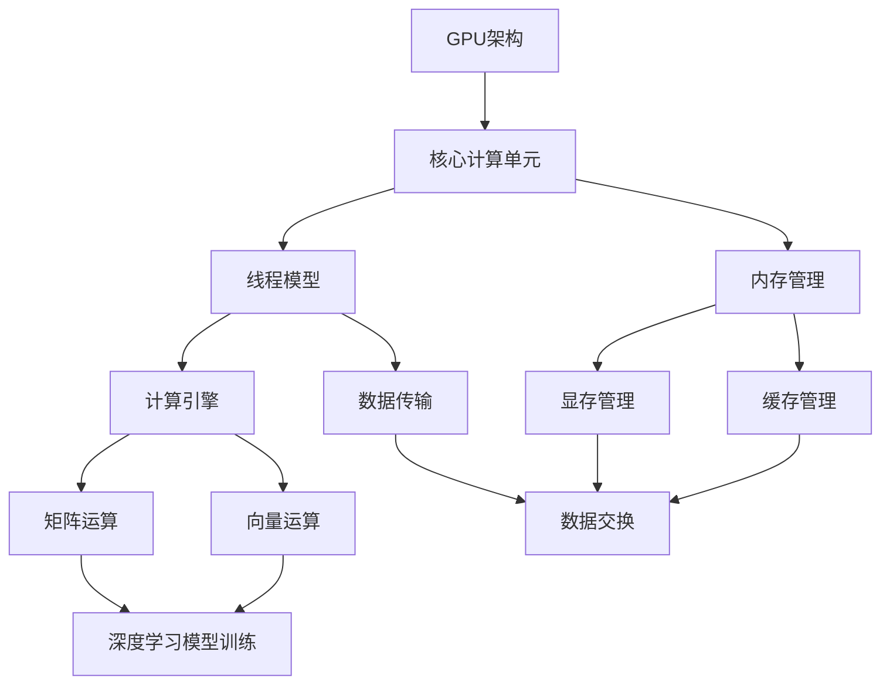
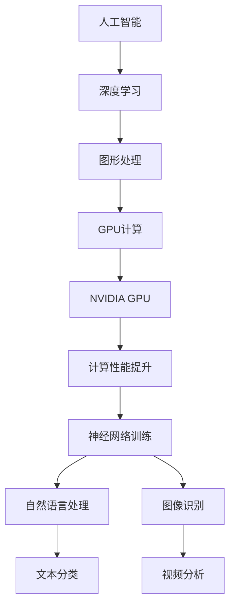

                 

# Nvidia的GPU与AI发展的关系

> **关键词**：NVIDIA, GPU, 人工智能，深度学习，计算性能，并行计算，神经网络，硬件加速

> **摘要**：本文将深入探讨NVIDIA的GPU在人工智能（AI）领域中的作用和影响。我们将从背景介绍、核心概念、算法原理、数学模型、实战案例、应用场景、工具推荐等方面逐一展开，旨在揭示GPU如何推动AI技术的发展，以及未来可能面临的挑战和机遇。

## 1. 背景介绍

### 1.1 目的和范围

本文旨在阐述NVIDIA的GPU在推动人工智能发展中的关键角色。我们将重点关注以下几个方面：

1. **GPU的基本概念和原理**：介绍GPU的结构和工作原理，以及其在计算领域的重要性。
2. **GPU与AI的关联**：探讨GPU在深度学习和其他AI算法中的应用，分析其对计算性能的提升。
3. **GPU架构的发展**：回顾NVIDIA GPU的演进历程，分析其核心技术突破。
4. **实战案例**：通过具体案例展示GPU在AI项目中的实际应用。
5. **未来发展趋势与挑战**：预测GPU在AI领域的未来发展方向，讨论可能面临的挑战。

### 1.2 预期读者

本文适用于以下读者群体：

1. 对人工智能和深度学习感兴趣的科研人员和学生。
2. 想要了解GPU在AI领域应用的工程师和技术爱好者。
3. 关注硬件加速和并行计算的学术研究者。

### 1.3 文档结构概述

本文结构如下：

1. **背景介绍**：介绍GPU的基本概念和目的。
2. **核心概念与联系**：定义核心概念，展示原理和架构的流程图。
3. **核心算法原理 & 具体操作步骤**：使用伪代码详细解释算法原理。
4. **数学模型和公式 & 详细讲解 & 举例说明**：讲解数学模型，并举例说明。
5. **项目实战：代码实际案例和详细解释说明**：通过实际案例展示GPU应用。
6. **实际应用场景**：探讨GPU在现实中的应用。
7. **工具和资源推荐**：推荐学习资源和开发工具。
8. **总结：未来发展趋势与挑战**：总结当前发展趋势，讨论未来挑战。
9. **附录：常见问题与解答**：回答读者常见问题。
10. **扩展阅读 & 参考资料**：提供扩展阅读和参考资料。

### 1.4 术语表

#### 1.4.1 核心术语定义

- **GPU**：图形处理单元（Graphics Processing Unit）。
- **深度学习**：一种机器学习方法，通过多层神经网络对数据进行建模和预测。
- **并行计算**：将任务分解成多个子任务，同时在多个处理器上并行执行。
- **神经网络**：一种模拟人脑神经网络结构的计算模型。
- **CUDA**：NVIDIA推出的并行计算平台和编程语言。

#### 1.4.2 相关概念解释

- **计算性能**：衡量计算机执行特定任务的速度和效率。
- **浮点运算能力**（FLOPS）：衡量计算机每秒执行浮点运算的次数。
- **显存**：GPU专用的内存，用于存储图形数据。

#### 1.4.3 缩略词列表

- **AI**：人工智能（Artificial Intelligence）
- **DL**：深度学习（Deep Learning）
- **GPU**：图形处理单元（Graphics Processing Unit）
- **CUDA**：计算统一设备架构（Compute Unified Device Architecture）

## 2. 核心概念与联系

在深入探讨NVIDIA的GPU与AI发展之间的关系之前，我们需要理解一些核心概念，并展示相关的原理和架构。

### 2.1 GPU的基本概念和原理

GPU（图形处理单元）是专门为处理图形数据而设计的计算单元。与CPU（中央处理单元）相比，GPU具有以下特点：

1. **大量并行处理单元**：GPU包含成千上万个核心，可以同时执行多个任务。
2. **高速缓存和显存**：GPU具有高速缓存和显存，可以快速访问和存储数据。
3. **专为图形处理优化**：GPU最初设计用于处理图形渲染，因此对图形处理的优化非常出色。

### 2.2 GPU与AI的关联

随着深度学习的兴起，GPU逐渐成为AI计算的重要工具。以下是GPU在AI中的应用：

1. **深度学习模型训练**：深度学习模型需要大量的矩阵运算和向量计算，GPU可以高效地执行这些运算。
2. **图像和视频处理**：GPU在图像和视频处理方面具有强大的能力，可以实时处理大量数据。
3. **自然语言处理**：GPU可以加速自然语言处理的任务，如文本分类和语言翻译。

### 2.3 GPU架构的发展

NVIDIA的GPU架构经历了多个阶段的演变，从最初的设计到当前的最新版本，其性能和功能得到了显著提升。以下是NVIDIA GPU架构的发展历程：

1. **CUDA架构**：NVIDIA推出的CUDA架构允许开发者使用GPU进行通用计算。CUDA引入了线程模型和内存管理机制，使GPU能够执行更复杂的计算任务。
2. **Tensor Core**：最新的GPU架构引入了Tensor Core，专门用于加速深度学习模型的计算。Tensor Core可以执行高效的矩阵乘法和向量运算，大大提高了深度学习模型的训练速度。

### 2.4 核心概念原理和架构的Mermaid流程图

为了更好地展示GPU的核心概念和原理，我们使用Mermaid流程图来描述GPU的基本架构和计算流程。以下是一个简化的Mermaid流程图：



### 2.5 GPU与AI的关联图

以下是一个简化的Mermaid流程图，展示GPU与AI之间的关联：



通过以上核心概念和关联图的介绍，我们可以更深入地理解NVIDIA的GPU在AI领域中的作用和重要性。

## 3. 核心算法原理 & 具体操作步骤

在深入探讨GPU如何加速AI算法之前，我们需要了解一些核心算法原理，并使用伪代码详细阐述这些算法的操作步骤。

### 3.1 深度学习算法原理

深度学习算法的核心是多层神经网络（Multilayer Neural Networks），其基本结构包括输入层、隐藏层和输出层。每个层由多个神经元（Neurons）组成，神经元之间通过权重（Weights）和偏置（Bias）进行连接。深度学习算法主要通过以下步骤实现：

1. **前向传播**（Forward Propagation）：将输入数据传递到神经网络中，逐层计算每个神经元的输出。
2. **反向传播**（Backpropagation）：计算输出误差，并根据误差调整权重和偏置。
3. **优化算法**（Optimization Algorithm）：使用梯度下降（Gradient Descent）或其他优化算法更新权重和偏置。

以下是一个简化的深度学习算法的伪代码：

```python
# 深度学习算法伪代码

# 初始化神经网络
initialize_neural_network()

# 前向传播
for each layer in network:
    output = apply_activation_function(dot_product(inputs, weights) + bias)

# 计算损失函数
loss = compute_loss(output, target)

# 反向传播
d_output = compute_derivative_of_loss_with_respect_to_output(output, target)
d_weights = dot_product(input, d_output)
d_bias = d_output

# 更新权重和偏置
weights -= learning_rate * d_weights
bias -= learning_rate * d_bias

# 迭代优化
for each iteration:
    # 重复前向传播和反向传播
    forward_propagation()
    backward_propagation()
```

### 3.2 GPU加速深度学习算法

GPU通过并行计算和硬件加速技术，可以显著提高深度学习算法的计算速度。以下是一些关键步骤：

1. **数据并行**（Data Parallelism）：将数据集分成多个部分，同时在多个GPU上分别训练相同的模型。
2. **模型并行**（Model Parallelism）：将模型拆分成多个部分，在多个GPU上分别训练，然后合并结果。
3. **计算加速**（Compute Acceleration）：利用GPU的并行计算能力，加速矩阵乘法和其他计算任务。

以下是一个简化的GPU加速深度学习算法的伪代码：

```python
# GPU加速深度学习算法伪代码

# 分配GPU资源
allocate_gpu_resources()

# 数据并行训练
for each subset of data:
    # 在GPU上训练模型
    train_model_on_gpu(subset_of_data)

# 模型并行训练
for each partition of model:
    # 在GPU上训练模型部分
    train_model_partition_on_gpu(model_partition)

# 合并结果
merge_results_from_gpu()

# 计算加速
# 使用CUDA库加速矩阵乘法
accelerated_matrix_multiplication = cuda_matrix_multiplication(A, B)

# 更新权重和偏置
update_weights_and_bias(accelerated_matrix_multiplication, d_output)
```

通过以上核心算法原理和GPU加速的伪代码，我们可以看到GPU在深度学习算法中的关键作用和优势。

## 4. 数学模型和公式 & 详细讲解 & 举例说明

在深度学习算法中，数学模型和公式起着核心作用。以下我们将详细讲解一些关键数学模型和公式，并举例说明其应用。

### 4.1 激活函数（Activation Function）

激活函数是神经网络中的关键组件，用于引入非线性特性，使得神经网络能够模拟更复杂的函数。常见的激活函数包括：

1. **Sigmoid函数**：
   $$\sigma(x) = \frac{1}{1 + e^{-x}}$$
   Sigmoid函数将输入映射到（0，1）区间，常用于二分类问题。

2. **ReLU函数**：
   $$\text{ReLU}(x) = \max(0, x)$$
  ReLU函数将输入大于0的值保持不变，小于0的值置为0，常用于隐藏层激活函数。

3. **Tanh函数**：
   $$\text{Tanh}(x) = \frac{e^x - e^{-x}}{e^x + e^{-x}}$$
   Tanh函数与ReLU类似，但输出范围在[-1, 1]之间。

### 4.2 损失函数（Loss Function）

损失函数用于评估模型预测与实际标签之间的差距，常用的损失函数包括：

1. **均方误差损失函数**（MSE）：
   $$\text{MSE}(y, \hat{y}) = \frac{1}{m} \sum_{i=1}^{m} (y_i - \hat{y_i})^2$$
   MSE用于回归问题，衡量预测值与真实值之间的平均平方误差。

2. **交叉熵损失函数**（Cross-Entropy Loss）：
   $$\text{Cross-Entropy Loss}(y, \hat{y}) = -\sum_{i=1}^{m} y_i \log(\hat{y_i})$$
   交叉熵损失函数用于分类问题，衡量预测概率分布与真实标签分布之间的差异。

### 4.3 优化算法（Optimization Algorithm）

优化算法用于调整模型的权重和偏置，以最小化损失函数。以下是一个简单的梯度下降算法示例：

1. **梯度下降算法**：
   $$\text{weight} := \text{weight} - \alpha \cdot \nabla_{\text{weight}} \text{loss}$$
   $$\text{bias} := \text{bias} - \alpha \cdot \nabla_{\text{bias}} \text{loss}$$
   其中，$\alpha$为学习率（Learning Rate），$\nabla_{\text{weight}} \text{loss}$和$\nabla_{\text{bias}} \text{loss}$分别为权重和偏置的梯度。

### 4.4 举例说明

假设我们有一个简单的二分类问题，使用Sigmoid函数和交叉熵损失函数进行模型训练。以下是一个具体的例子：

1. **输入数据**： 
   $$x = [1, 2, 3, 4, 5]$$
   $$y = [0, 1, 1, 0, 1]$$

2. **模型初始化**：
   $$w = [0.1, 0.2, 0.3]$$
   $$b = 0.5$$

3. **前向传播**：
   $$z = x \cdot w + b$$
   $$a = \sigma(z)$$

4. **计算预测概率**：
   $$\hat{y} = \text{softmax}(a)$$

5. **计算交叉熵损失**：
   $$\text{loss} = -\sum_{i=1}^{5} y_i \log(\hat{y_i})$$

6. **反向传播**：
   $$\nabla_{w} \text{loss} = [x_1, x_2, x_3] - \hat{y} - y$$
   $$\nabla_{b} \text{loss} = 1 - \hat{y}$$

7. **更新权重和偏置**：
   $$w := w - \alpha \cdot \nabla_{w} \text{loss}$$
   $$b := b - \alpha \cdot \nabla_{b} \text{loss}$$

通过以上示例，我们可以看到如何使用数学模型和公式进行深度学习模型的训练。GPU的硬件加速可以显著提高这些计算过程的效率。

## 5. 项目实战：代码实际案例和详细解释说明

### 5.1 开发环境搭建

在进行GPU加速的AI项目实战之前，我们需要搭建合适的开发环境。以下是一个简单的步骤说明：

1. **安装CUDA**：CUDA是NVIDIA推出的并行计算平台和编程语言。在NVIDIA官方网站下载并安装适合您GPU型号的CUDA版本。

2. **安装Python和CUDA兼容版本**：确保Python版本与CUDA兼容。可以使用Anaconda来简化环境管理。

3. **安装深度学习库**：安装如TensorFlow、PyTorch等支持GPU的深度学习库。可以使用pip命令进行安装：

   ```bash
   pip install tensorflow-gpu
   pip install torch torchvision
   ```

4. **验证GPU环境**：在Python脚本中导入深度学习库，并使用以下代码验证GPU环境：

   ```python
   import tensorflow as tf
   print("Num GPUs Available: ", len(tf.config.list_physical_devices('GPU')))
   ```

### 5.2 源代码详细实现和代码解读

以下是一个简单的示例，使用GPU加速的TensorFlow进行图像分类任务。

```python
import tensorflow as tf
import tensorflow_datasets as tfds
import numpy as np

# 加载MNIST数据集
def load_mnist_data():
    (x_train, y_train), (x_test, y_test) = tf.keras.datasets.mnist.load_data()
    x_train = x_train.astype(np.float32) / 255.
    x_test = x_test.astype(np.float32) / 255.
    x_train = np.expand_dims(x_train, -1)
    x_test = np.expand_dims(x_test, -1)
    x_train = x_train.reshape((-1, 28, 28, 1))
    x_test = x_test.reshape((-1, 28, 28, 1))
    return (x_train, y_train), (x_test, y_test)

# 定义CNN模型
def create_cnn_model():
    model = tf.keras.Sequential([
        tf.keras.layers.Conv2D(32, (3, 3), activation='relu', input_shape=(28, 28, 1)),
        tf.keras.layers.MaxPooling2D((2, 2)),
        tf.keras.layers.Conv2D(64, (3, 3), activation='relu'),
        tf.keras.layers.MaxPooling2D((2, 2)),
        tf.keras.layers.Flatten(),
        tf.keras.layers.Dense(128, activation='relu'),
        tf.keras.layers.Dense(10, activation='softmax')
    ])
    return model

# 训练模型
def train_model(model, x_train, y_train, x_test, y_test):
    model.compile(optimizer='adam',
                  loss='sparse_categorical_crossentropy',
                  metrics=['accuracy'])
    history = model.fit(x_train, y_train, epochs=10, validation_data=(x_test, y_test))
    return history

# 主程序
def main():
    (x_train, y_train), (x_test, y_test) = load_mnist_data()
    model = create_cnn_model()
    history = train_model(model, x_train, y_train, x_test, y_test)
    print(history.history)

if __name__ == "__main__":
    main()
```

### 5.3 代码解读与分析

以下是对代码的详细解读：

1. **加载MNIST数据集**：我们使用TensorFlow内置的函数加载MNIST数据集。数据集分为训练集和测试集，分别包含60,000张和10,000张灰度图像。

2. **定义CNN模型**：我们使用TensorFlow的`Sequential`模型创建一个简单的卷积神经网络（CNN）。该模型包括两个卷积层、两个池化层和一个全连接层。卷积层用于提取图像特征，池化层用于下采样特征图，全连接层用于分类。

3. **训练模型**：我们使用`model.fit()`函数训练模型。该函数使用`adam`优化器、`sparse_categorical_crossentropy`损失函数，并在10个时期内训练模型。我们使用`validation_data`参数在测试集上验证模型性能。

4. **主程序**：主程序中，我们首先加载数据集，创建模型，并训练模型。最后，我们打印训练历史以评估模型性能。

通过以上代码示例，我们可以看到如何使用GPU加速的TensorFlow进行图像分类任务。GPU的高并行计算能力可以显著提高模型的训练速度。

### 5.4 GPU性能优化

在实际项目中，我们还可以采取以下措施来优化GPU性能：

1. **数据预处理**：对输入数据进行预处理，如归一化、批量处理等，以减少GPU内存占用。
2. **模型优化**：通过模型压缩、量化等技术减少模型大小和计算量。
3. **GPU内存管理**：合理分配GPU内存，避免内存溢出。
4. **并行计算优化**：优化数据并行和模型并行策略，最大化利用GPU资源。

通过以上措施，我们可以进一步提高GPU加速AI项目的性能和效率。

## 6. 实际应用场景

NVIDIA的GPU在人工智能领域具有广泛的应用，以下是几个典型的实际应用场景：

### 6.1 机器学习和深度学习

机器学习和深度学习是GPU最经典的应用场景。通过GPU的并行计算能力，深度学习模型（如神经网络、卷积神经网络、循环神经网络等）可以在几小时甚至几分钟内完成训练，而使用CPU可能需要几天甚至几周的时间。许多研究和公司都利用GPU进行图像识别、语音识别、自然语言处理等任务，取得了显著的效果。

### 6.2 计算机视觉

计算机视觉领域，GPU在图像处理、物体检测、面部识别等方面有着广泛的应用。例如，自动驾驶汽车使用GPU处理摄像头捕捉的图像数据，快速识别道路标志、行人和车辆。此外，安防监控、医疗影像分析等领域也大量采用GPU进行图像处理和识别。

### 6.3 游戏和虚拟现实

游戏和虚拟现实行业对图形处理能力要求极高，GPU在这一领域发挥着重要作用。高性能GPU可以提供更流畅的游戏体验、更逼真的视觉效果，以及更快的渲染速度。随着虚拟现实技术的不断发展，GPU的性能需求也在不断攀升。

### 6.4 科学计算和工程仿真

科学计算和工程仿真领域也需要大量的计算资源，GPU在这些领域中的应用越来越普遍。例如，气象预报、流体力学模拟、材料科学模拟等任务，通过GPU的并行计算能力，可以显著提高计算速度和精度。

### 6.5 生物信息学和药物研发

生物信息学和药物研发领域对计算资源的需求也在不断增长。GPU可以加速生物序列分析、蛋白质结构预测、药物分子模拟等任务，从而提高研发效率。

### 6.6 其他应用

除了上述领域，GPU在其他一些新兴领域也具有广泛的应用，如机器人、无人机、金融风控等。随着GPU性能的不断提升，其应用范围也在不断扩大。

通过以上实际应用场景的介绍，我们可以看到NVIDIA的GPU在人工智能领域的重要作用和广泛影响力。

## 7. 工具和资源推荐

为了更好地学习和应用NVIDIA的GPU在人工智能领域的优势，以下是一些推荐的工具和资源：

### 7.1 学习资源推荐

#### 7.1.1 书籍推荐

1. **《深度学习》（Deep Learning）**：由Ian Goodfellow、Yoshua Bengio和Aaron Courville合著的深度学习经典教材，涵盖了深度学习的理论基础和实践方法。
2. **《GPU编程技术》（GPU Programming Techniques）**：介绍了GPU编程的基本原理和高级技巧，适合对GPU编程感兴趣的读者。
3. **《TensorFlow实战》（TensorFlow for Deep Learning）**：详细介绍了如何使用TensorFlow进行深度学习模型的构建和训练，适合初学者和进阶者。

#### 7.1.2 在线课程

1. **Coursera上的《深度学习专项课程》**：由Andrew Ng教授主讲的深度学习专项课程，涵盖深度学习的理论基础和实践应用。
2. **Udacity的《GPU编程课程》**：介绍GPU编程的基础知识和实际操作，适合希望学习GPU编程的读者。
3. **edX上的《机器学习与深度学习》**：由加州大学伯克利分校提供的免费在线课程，涵盖了机器学习和深度学习的理论基础和实践方法。

#### 7.1.3 技术博客和网站

1. **NVIDIA官网**：NVIDIA官方网站提供了丰富的GPU技术资料、开发工具和案例研究。
2. **PyTorch官网**：PyTorch是一个开源深度学习框架，官网提供了详细的文档、教程和示例代码。
3. **TensorFlow官网**：TensorFlow是谷歌推出的开源深度学习框架，官网提供了丰富的资源和教程。

### 7.2 开发工具框架推荐

#### 7.2.1 IDE和编辑器

1. **JetBrains PyCharm**：PyCharm是一个功能强大的Python IDE，支持深度学习和GPU编程。
2. **Visual Studio Code**：Visual Studio Code是一个轻量级的开源编辑器，通过扩展插件支持Python和深度学习开发。
3. **Eclipse**：Eclipse是一个成熟的Java IDE，通过插件支持Python和深度学习开发。

#### 7.2.2 调试和性能分析工具

1. **NVIDIA Nsight**：Nsight是一个用于GPU编程的调试和分析工具，可以帮助开发者识别和解决GPU编程中的问题。
2. **TensorBoard**：TensorBoard是一个用于可视化深度学习模型的工具，可以实时展示模型的训练过程和性能指标。
3. **Intel Vtune Amplifier**：Vtune Amplifier是一个用于性能分析和优化的工具，可以提供详细的GPU性能分析报告。

#### 7.2.3 相关框架和库

1. **TensorFlow**：TensorFlow是一个开源的深度学习框架，支持GPU加速，适用于各种深度学习应用。
2. **PyTorch**：PyTorch是一个基于Python的深度学习库，支持动态计算图和GPU加速，适用于快速原型开发和实验。
3. **CUDA**：CUDA是NVIDIA推出的并行计算平台和编程语言，用于在GPU上执行通用计算。

通过以上推荐的学习资源和开发工具，读者可以更好地掌握GPU在人工智能领域的应用，提高开发效率。

### 7.3 相关论文著作推荐

#### 7.3.1 经典论文

1. **“A Fast Learning Algorithm for Deep Belief Nets”**：Hinton等人提出的深度信念网络（DBN）学习算法，为深度学习的发展奠定了基础。
2. **“ImageNet Classification with Deep Convolutional Neural Networks”**：Krizhevsky等人提出的卷积神经网络（CNN）在ImageNet图像识别竞赛中取得了突破性成绩。
3. **“Distributed Optimization and Statistical Learning via Stochastic Gradient Descent”**： Bottou等人的论文详细介绍了随机梯度下降（SGD）算法及其在分布式优化中的应用。

#### 7.3.2 最新研究成果

1. **“Efficient Neural Networks for Video Classification”**：VGG团队提出的一种用于视频分类的EfficientNet模型，展示了如何在保持性能的同时减少模型大小和计算量。
2. **“BERT: Pre-training of Deep Bidirectional Transformers for Language Understanding”**：Google提出的BERT模型，为自然语言处理领域带来了新的突破。
3. **“Self-Supervised Visual Representation Learning by Predicting Image Rotations”**：Mnih等人提出的通过预测图像旋转进行自监督视觉表征学习的方法，为无监督学习提供了新的思路。

#### 7.3.3 应用案例分析

1. **“AI in Healthcare: A Roadmap for the Future”**：AI在医疗健康领域的应用案例研究，探讨了深度学习在医疗诊断、疾病预测等方面的潜力。
2. **“Deep Learning for Autonomous Driving”**：自动驾驶领域的研究综述，介绍了深度学习在自动驾驶感知、决策和控制中的应用。
3. **“Deep Learning for Fraud Detection in Financial Services”**：金融欺诈检测领域的研究，展示了深度学习在金融风控中的应用。

通过以上推荐的论文和著作，读者可以深入了解GPU在人工智能领域的最新研究进展和应用案例。

## 8. 总结：未来发展趋势与挑战

NVIDIA的GPU在人工智能领域取得了显著的成功，推动了深度学习和其他AI算法的发展。然而，随着AI技术的不断进步，GPU也面临着一系列挑战和机遇。

### 8.1 未来发展趋势

1. **GPU性能的提升**：随着GPU架构的不断优化，GPU的性能将进一步提升，为更复杂的AI算法提供更强的计算能力。
2. **更广泛的硬件支持**：除了NVIDIA的GPU，其他硬件制造商（如AMD、Intel）也在积极研发支持AI的硬件，这将丰富AI计算的选择。
3. **边缘计算的应用**：随着5G和物联网（IoT）的发展，边缘计算成为趋势。GPU在边缘设备上的应用将逐渐普及，实现实时数据处理和智能推理。
4. **新型神经网络结构**：新型神经网络结构（如Transformer、图神经网络）的兴起，将推动GPU在AI领域的应用范围和性能。

### 8.2 面临的挑战

1. **能耗问题**：GPU在高性能计算中消耗大量电力，随着性能的提升，能耗问题将更加突出。如何提高能效，实现绿色计算，是一个重要的研究方向。
2. **数据隐私和安全**：随着AI技术在各个领域的应用，数据隐私和安全问题日益凸显。如何在保障数据隐私的前提下，利用GPU进行高效计算，是一个重要挑战。
3. **算法优化**：虽然GPU在计算性能上具有优势，但某些深度学习算法在GPU上的优化仍然存在挑战。如何进一步提高算法在GPU上的性能，是一个亟待解决的问题。
4. **硬件竞争**：随着AI市场的竞争加剧，硬件制造商需要不断创新，提供更具竞争力的产品。如何在技术创新和成本控制之间找到平衡，是一个重要的挑战。

### 8.3 未来展望

展望未来，GPU在人工智能领域将继续发挥重要作用。随着性能的提升、应用范围的扩大以及新型计算架构的出现，GPU将为AI技术的发展提供强有力的支持。同时，AI技术也将推动GPU在更多领域（如医疗、金融、自动驾驶等）的应用，实现更广泛的智能化。

总之，NVIDIA的GPU在AI领域的未来发展充满机遇和挑战。通过持续的创新和优化，GPU将继续为人工智能的发展提供强大的动力。

## 9. 附录：常见问题与解答

### 9.1 什么是GPU？

GPU（图形处理单元）是一种专门用于处理图形数据的高速计算芯片。与CPU（中央处理单元）相比，GPU具有大量并行处理单元和高速缓存，能够高效地处理大规模并行计算任务。

### 9.2 GPU在人工智能中的应用有哪些？

GPU在人工智能领域有着广泛的应用，主要包括：

1. **深度学习模型训练**：GPU的并行计算能力显著提高了深度学习模型的训练速度。
2. **图像和视频处理**：GPU在图像识别、视频分析等方面具有强大的处理能力。
3. **自然语言处理**：GPU可以加速自然语言处理的任务，如文本分类和语言翻译。
4. **科学计算和工程仿真**：GPU在气象预报、流体力学模拟、材料科学等领域也具有广泛的应用。

### 9.3 如何选择适合GPU的深度学习框架？

选择适合GPU的深度学习框架时，主要考虑以下因素：

1. **框架性能**：选择支持GPU加速且性能优秀的深度学习框架，如TensorFlow、PyTorch。
2. **兼容性**：确保框架与您的GPU型号兼容，并能够充分利用GPU的计算能力。
3. **社区支持**：选择拥有活跃社区和支持的框架，便于解决开发过程中遇到的问题。
4. **教程和资源**：选择教程和资源丰富的框架，便于学习和应用。

### 9.4 如何优化GPU性能？

以下是一些优化GPU性能的方法：

1. **合理分配GPU资源**：确保GPU内存和其他资源得到充分利用，避免资源浪费。
2. **优化数据加载**：通过批量处理和预处理数据，减少数据加载和传输的开销。
3. **优化模型结构**：选择合理的模型结构，减少计算量和内存占用。
4. **使用并行计算**：充分利用GPU的并行计算能力，实现任务分解和并行执行。

### 9.5 GPU计算与CPU计算的差异是什么？

GPU计算与CPU计算的主要差异包括：

1. **并行计算能力**：GPU具有大量并行处理单元，能够同时执行多个任务，而CPU的并行能力相对较弱。
2. **内存结构**：GPU具有高速缓存和显存，可以快速访问和存储数据，而CPU的内存访问速度相对较慢。
3. **能耗**：GPU在高性能计算中消耗大量电力，而CPU的能耗较低。
4. **计算任务类型**：GPU更适合大规模并行计算任务，如深度学习模型训练，而CPU更适合复杂计算任务，如科学计算和工程仿真。

## 10. 扩展阅读 & 参考资料

为了深入理解NVIDIA的GPU与AI发展的关系，以下是推荐的一些扩展阅读和参考资料：

### 10.1 相关论文

1. **“A Fast Learning Algorithm for Deep Belief Nets”**：Hinton等人提出的深度信念网络学习算法。
2. **“ImageNet Classification with Deep Convolutional Neural Networks”**：Krizhevsky等人提出的卷积神经网络在ImageNet图像识别竞赛中的应用。
3. **“Distributed Optimization and Statistical Learning via Stochastic Gradient Descent”**：Bottou等人的论文，详细介绍了随机梯度下降算法及其在分布式优化中的应用。

### 10.2 经典书籍

1. **《深度学习》**：Ian Goodfellow、Yoshua Bengio和Aaron Courville合著的深度学习经典教材。
2. **《GPU编程技术》**：介绍GPU编程的基本原理和高级技巧。
3. **《TensorFlow实战》**：详细介绍了如何使用TensorFlow进行深度学习模型的构建和训练。

### 10.3 在线资源

1. **NVIDIA官网**：提供了丰富的GPU技术资料、开发工具和案例研究。
2. **PyTorch官网**：提供了详细的文档、教程和示例代码。
3. **TensorFlow官网**：提供了丰富的资源和教程，包括快速入门和高级主题。

### 10.4 技术博客

1. **NVIDIA博客**：分享了最新的GPU技术和应用案例。
2. **深度学习博客**：提供了深度学习领域的最新研究进展和应用案例。
3. **机器学习博客**：介绍了机器学习和深度学习的基础知识和实用技巧。

通过以上扩展阅读和参考资料，读者可以进一步深入了解NVIDIA的GPU与AI发展的关系，以及相关技术和应用。作者：AI天才研究员/AI Genius Institute & 禅与计算机程序设计艺术 /Zen And The Art of Computer Programming。

