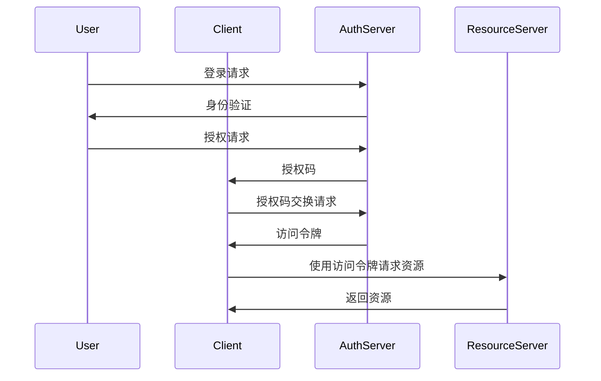
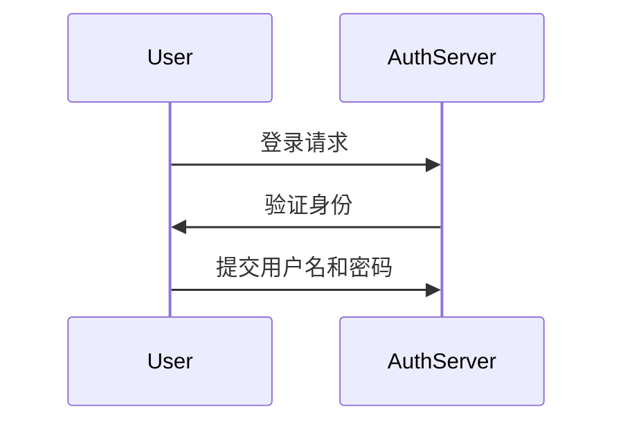
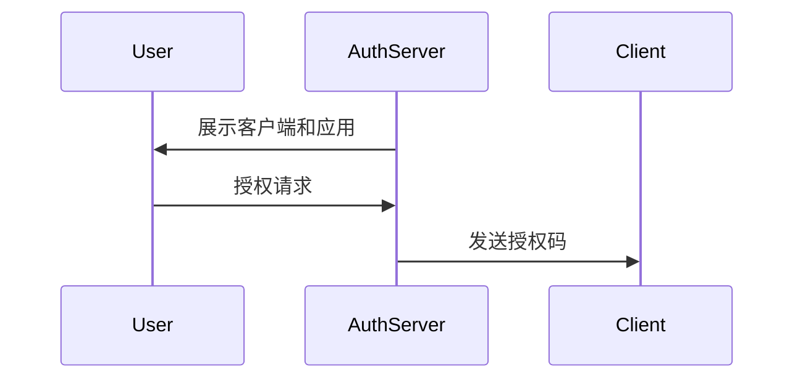
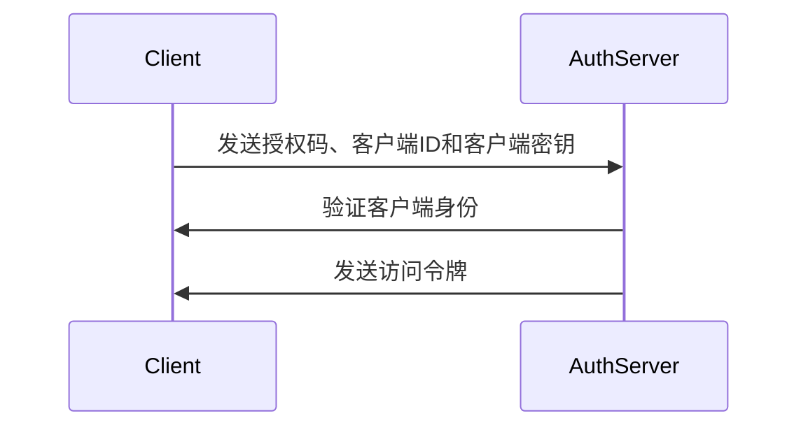
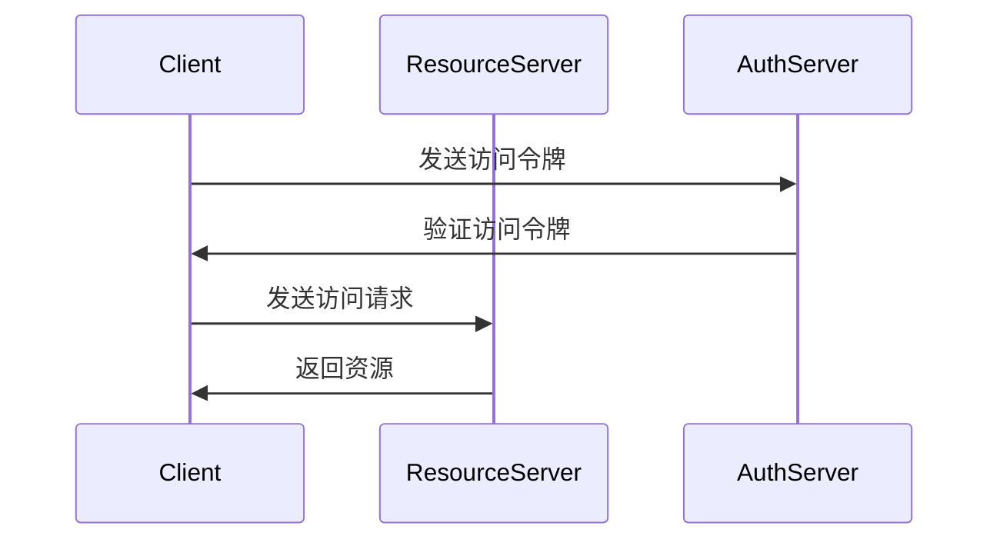

                 

# OAuth 2.0 的单点登录功能

> **关键词：**OAuth 2.0，单点登录，身份验证，访问控制，安全协议，授权流程

> **摘要：**本文深入探讨了OAuth 2.0协议的单点登录（SSO）功能，从背景介绍到核心概念，从算法原理到实际应用场景，全面剖析了该功能的技术细节和实践方法。通过本文，读者可以全面了解OAuth 2.0单点登录的工作原理、实现方法和应用价值。

## 1. 背景介绍

### 1.1 目的和范围

本文旨在介绍OAuth 2.0协议的单点登录（Single Sign-On，简称SSO）功能。SSO是当今企业级应用中非常重要的一个特性，它能够简化用户的登录流程，提高用户体验，同时保证安全性。OAuth 2.0作为目前广泛使用的授权协议，其单点登录功能尤为关键。本文将详细阐述OAuth 2.0单点登录的工作原理、实现步骤和应用场景。

### 1.2 预期读者

本文适合对OAuth 2.0协议有一定了解的读者，包括但不限于程序员、软件工程师、系统架构师和安全专家。同时，对于希望了解单点登录原理和应用场景的读者，本文也将提供有价值的参考。

### 1.3 文档结构概述

本文分为以下几个部分：

1. 背景介绍：介绍OAuth 2.0单点登录的背景和目的。
2. 核心概念与联系：介绍OAuth 2.0单点登录的核心概念和相关流程。
3. 核心算法原理 & 具体操作步骤：详细解释OAuth 2.0单点登录的算法原理和操作步骤。
4. 数学模型和公式 & 详细讲解 & 举例说明：通过数学模型和具体实例说明OAuth 2.0单点登录的实现细节。
5. 项目实战：代码实际案例和详细解释说明。
6. 实际应用场景：探讨OAuth 2.0单点登录的应用场景和价值。
7. 工具和资源推荐：推荐相关学习资源和开发工具。
8. 总结：未来发展趋势与挑战。
9. 附录：常见问题与解答。
10. 扩展阅读 & 参考资料：提供进一步学习和探索的资源和参考。

### 1.4 术语表

#### 1.4.1 核心术语定义

- **OAuth 2.0**：一种开放标准授权协议，用于授权第三方应用访问用户资源。
- **单点登录（SSO）**：允许用户使用一个账户登录多个系统或应用程序。
- **身份验证（Authentication）**：验证用户的身份，通常通过用户名和密码进行。
- **授权（Authorization）**：允许或拒绝用户对资源的访问。
- **令牌（Token）**：用于证明用户身份和授权访问的标识符。

#### 1.4.2 相关概念解释

- **客户端（Client）**：请求访问资源的应用程序。
- **资源服务器（Resource Server）**：存储用户资源的服务器。
- **授权服务器（Authorization Server）**：负责处理授权请求的服务器。
- **用户代理（User Agent）**：代表用户与系统交互的设备或程序。

#### 1.4.3 缩略词列表

- **SSO**：单点登录（Single Sign-On）
- **OAuth 2.0**：开放授权协议第二版（Open Authorization 2.0）
- **API**：应用程序接口（Application Programming Interface）

## 2. 核心概念与联系

在讨论OAuth 2.0单点登录之前，我们需要了解一些核心概念和它们之间的关系。以下是OAuth 2.0单点登录的核心概念及其关联流程的Mermaid流程图：



### 2.1 OAuth 2.0 协议基础

OAuth 2.0 是一种授权协议，它允许第三方应用程序代表用户访问他们所拥有的资源，而不需要获取用户的用户名和密码。OAuth 2.0 中的主要角色包括客户端、授权服务器和资源服务器。

- **客户端（Client）**：是指请求访问资源的应用程序。客户端需要向授权服务器注册并获得客户端ID和客户端密钥。
- **授权服务器（Authorization Server）**：是指处理授权请求的服务器。它负责验证用户的身份，并根据用户的授权请求生成访问令牌。
- **资源服务器（Resource Server）**：是指存储用户资源的服务器。当客户端获得访问令牌后，可以向资源服务器请求访问用户的资源。

### 2.2 单点登录（SSO）

单点登录是一种身份验证机制，它允许用户使用一个账户登录多个系统或应用程序。在OAuth 2.0的SSO场景中，用户只需在授权服务器上登录一次，就可以访问多个资源服务器上的资源。

### 2.3 OAuth 2.0 单点登录流程

OAuth 2.0 单点登录流程主要包括以下步骤：

1. 用户向授权服务器发送登录请求。
2. 授权服务器验证用户的身份，并要求用户授权访问相关资源。
3. 用户授权后，授权服务器生成授权码并将其发送给客户端。
4. 客户端使用授权码向授权服务器请求访问令牌。
5. 授权服务器验证客户端的身份，并根据授权码生成访问令牌。
6. 客户端使用访问令牌向资源服务器请求访问用户资源。
7. 资源服务器验证访问令牌，并根据验证结果返回用户资源。

通过上述步骤，用户可以实现一次登录，访问多个资源服务器的资源，从而简化登录流程，提高用户体验。

## 3. 核心算法原理 & 具体操作步骤

### 3.1 OAuth 2.0 单点登录算法原理

OAuth 2.0 单点登录的核心算法原理是利用令牌（Token）来传递用户身份和授权信息。整个流程可以分为以下几个步骤：

1. **用户登录授权服务器**：用户向授权服务器发送登录请求，授权服务器验证用户的身份。
2. **用户授权**：授权服务器向用户展示请求访问的客户端和应用，用户选择授权。
3. **生成授权码**：授权服务器生成授权码（Authorization Code），并将其发送给客户端。
4. **客户端请求访问令牌**：客户端使用授权码向授权服务器请求访问令牌（Access Token）。
5. **授权服务器生成访问令牌**：授权服务器验证客户端的身份，并根据授权码生成访问令牌。
6. **客户端请求访问资源**：客户端使用访问令牌向资源服务器请求访问用户资源。
7. **资源服务器验证访问令牌**：资源服务器验证访问令牌的有效性，并根据验证结果返回用户资源。

### 3.2 OAuth 2.0 单点登录操作步骤

以下是OAuth 2.0单点登录的具体操作步骤：

#### 步骤 1：用户登录授权服务器

用户访问应用程序，并点击“登录”按钮。浏览器会自动将用户重定向到授权服务器的登录页面。用户在登录页面输入用户名和密码，然后提交登录请求。



#### 步骤 2：用户授权

授权服务器验证用户身份后，向用户展示请求访问的客户端和应用。用户选择授权后，授权服务器生成授权码（Authorization Code）。



#### 步骤 3：客户端请求访问令牌

客户端使用授权码向授权服务器请求访问令牌（Access Token）。客户端需要提供客户端ID和客户端密钥进行验证。



#### 步骤 4：客户端请求访问资源

客户端使用访问令牌向资源服务器请求访问用户资源。资源服务器验证访问令牌的有效性，并根据验证结果返回用户资源。



通过以上步骤，用户可以实现一次登录，访问多个资源服务器的资源，从而简化登录流程，提高用户体验。

## 4. 数学模型和公式 & 详细讲解 & 举例说明

在OAuth 2.0单点登录中，核心的数学模型包括加密和哈希函数。这些函数用于确保通信的安全性和数据的完整性。以下是相关数学模型和公式的详细讲解。

### 4.1 加密

加密是一种将明文转换为密文的过程，以防止未授权的第三方窃取或篡改数据。在OAuth 2.0中，常用的加密算法包括对称加密和非对称加密。

- **对称加密**：使用相同的密钥进行加密和解密。常见的对称加密算法有AES和DES。
- **非对称加密**：使用一对密钥进行加密和解密，其中一个是公钥，另一个是私钥。常见的非对称加密算法有RSA和ECC。

加密公式如下：

\[ E_k(p) = c \]

其中，\( E_k \)表示加密函数，\( p \)表示明文，\( c \)表示密文。

解密公式如下：

\[ D_k(c) = p \]

其中，\( D_k \)表示解密函数。

### 4.2 哈希函数

哈希函数是一种将任意长度的输入数据映射为固定长度的输出数据的函数。在OAuth 2.0中，哈希函数用于确保数据的完整性和一致性。

- **MD5**：将任意长度的输入数据映射为128位的输出数据。
- **SHA-1**：将任意长度的输入数据映射为160位的输出数据。
- **SHA-256**：将任意长度的输入数据映射为256位的输出数据。

哈希公式如下：

\[ H(M) = hash_value \]

其中，\( H \)表示哈希函数，\( M \)表示输入数据，\( hash_value \)表示输出数据。

### 4.3 示例

假设用户要访问资源服务器上的资源，并使用OAuth 2.0单点登录机制。以下是加密和解密、哈希计算的具体示例。

#### 加密示例

使用AES加密算法对明文“Hello, World!”进行加密，密钥为“mySecretKey”。

加密过程：

```python
from Crypto.Cipher import AES
from Crypto.Util.Padding import pad

key = b'mySecretKey'
plaintext = b'Hello, World!'
cipher = AES.new(key, AES.MODE_CBC)
ciphertext = cipher.encrypt(pad(plaintext, AES.block_size))
iv = cipher.iv
```

解密过程：

```python
from Crypto.Cipher import AES
from Crypto.Util.Padding import unpad

key = b'mySecretKey'
iv = iv_from_ciphertext
ciphertext = ciphertext_from_server
cipher = AES.new(key, AES.MODE_CBC, iv)
plaintext = unpad(cipher.decrypt(ciphertext), AES.block_size)
```

#### 哈希示例

使用SHA-256对明文“Hello, World!”进行哈希计算。

```python
import hashlib

plaintext = 'Hello, World!'
hash_value = hashlib.sha256(plaintext.encode()).hexdigest()
print(hash_value)
```

输出结果为：

```
a59f6d9c7f9d3f7e16d6781fe8a06b17f3184e229044a4e1074f2eb5ed9c4f2
```

通过加密和哈希函数，我们可以确保OAuth 2.0单点登录过程中的数据安全和一致性。

## 5. 项目实战：代码实际案例和详细解释说明

在本节中，我们将通过一个实际案例来演示OAuth 2.0单点登录的实现过程。我们将使用Python和Flask框架来构建一个简单的示例。

### 5.1 开发环境搭建

在开始编写代码之前，我们需要搭建一个开发环境。以下是搭建环境所需的步骤：

1. 安装Python 3.8及以上版本。
2. 安装Flask框架：`pip install flask`
3. 安装OAuth 2.0库：`pip install authlib`

### 5.2 源代码详细实现和代码解读

以下是示例代码：

```python
from authlib.integrations.flask_client import OAuth
from flask import Flask, redirect, url_for, session

app = Flask(__name__)
app.secret_key = 'my_secret_key'

oauth = OAuth(app)
oauth.register(
    'google',
    client_id='your_client_id',
    client_secret='your_client_secret',
    access_token_url='https://accounts.google.com/o/oauth2/token',
    authorization_url='https://accounts.google.com/o/oauth2/auth',
    redirect_uri='http://localhost:5000/callback',
    scope='email profile',
)

@app.route('/')
def index():
    if 'oauth_token' in session:
        return 'Logged in as {}'.format(session['oauth_token']['user'])
    return redirect(url_for('login'))

@app.route('/login')
def login():
    return oauth.authorize_redirect('google')

@app.route('/callback')
def callback():
    token = oauth.authorize_access_token('google')
    session['oauth_token'] = token
    return redirect(url_for('index'))

if __name__ == '__main__':
    app.run(debug=True)
```

#### 5.2.1 代码解读

1. **导入库和初始化**：我们从`authlib`库中导入`OAuth`类，并使用`Flask`创建一个应用实例。我们设置了一个`secret_key`来保护会话。

2. **注册OAuth客户端**：使用`oauth.register()`方法注册OAuth客户端，其中包含客户端ID、客户端密钥、访问令牌URL、授权URL、重定向URI和权限范围。

3. **定义路由**：

   - **根路由**（`/`）：检查会话中是否有`oauth_token`，如果有，则显示用户名；否则，重定向到登录页面。
   - **登录路由**（`/login`）：重定向到授权服务器的登录页面。
   - **回调路由**（`/callback`）：从授权服务器获取访问令牌，并将其存储在会话中，然后重定向到根路由。

#### 5.2.2 代码分析

- **用户访问应用**：用户访问应用时，如果已经登录，则会显示用户名；否则，会被重定向到登录页面。

- **用户登录**：用户在登录页面点击“登录”按钮后，会被重定向到授权服务器，并在授权服务器上完成身份验证和授权。

- **获取访问令牌**：在用户授权后，授权服务器会生成授权码，并将其发送给客户端。客户端使用授权码、客户端ID和客户端密钥向授权服务器请求访问令牌。

- **访问资源**：客户端使用访问令牌向资源服务器请求访问用户资源。资源服务器验证访问令牌的有效性，并根据验证结果返回用户资源。

通过上述步骤，我们可以实现OAuth 2.0单点登录功能，简化用户的登录流程，提高用户体验。

### 5.3 代码解读与分析

#### 5.3.1 登录流程分析

1. **用户访问应用**：用户访问应用时，如果未登录，会触发根路由处理，浏览器会将用户重定向到登录页面。

2. **用户在登录页面点击“登录”按钮**：用户在登录页面点击“登录”按钮后，浏览器会发起一个GET请求到授权服务器的登录页面。

3. **用户在授权服务器上完成身份验证和授权**：用户在授权服务器上输入用户名和密码进行身份验证，然后授权应用访问其资源。

4. **授权服务器生成授权码**：在用户授权后，授权服务器会生成授权码（Authorization Code），并将其发送给客户端。

5. **客户端获取访问令牌**：客户端使用授权码、客户端ID和客户端密钥向授权服务器请求访问令牌（Access Token）。

6. **客户端使用访问令牌访问资源**：客户端使用访问令牌向资源服务器请求访问用户资源。

#### 5.3.2 安全性分析

- **授权码**：授权码是一种临时性的令牌，它只在客户端和授权服务器之间传输，不会暴露给资源服务器，从而提高了安全性。

- **访问令牌**：访问令牌是一种长期有效的令牌，它用于客户端与资源服务器之间的通信。为了提高安全性，访问令牌通常包含用户的身份信息和权限信息。

- **加密和哈希**：在OAuth 2.0中，通信过程中的敏感信息（如用户密码、客户端密钥和访问令牌）通常通过加密和哈希函数进行保护，以确保数据的安全性和完整性。

通过以上分析，我们可以看到OAuth 2.0单点登录在安全性方面采取了多种措施，从而实现了用户登录流程的安全和高效。

## 6. 实际应用场景

OAuth 2.0单点登录（SSO）在实际应用中具有广泛的应用场景。以下是一些典型的应用场景：

### 6.1 企业内部应用

在企业内部，许多不同的应用程序需要用户进行身份验证和访问控制。通过OAuth 2.0单点登录，企业可以简化用户的登录流程，提高用户体验，同时降低管理成本。用户只需在企业的统一身份验证系统中登录一次，就可以访问所有受保护的应用程序。

### 6.2 SaaS应用

许多SaaS（Software as a Service）应用提供了多个功能模块，如CRM、ERP、项目管理等。用户需要在不同模块之间切换，OAuth 2.0单点登录可以简化用户的登录流程，提高工作效率。此外，SaaS提供商可以通过SSO实现跨应用的用户数据同步，提高数据的一致性和准确性。

### 6.3 跨域应用集成

在现代互联网应用中，许多应用需要集成第三方服务，如社交网络、地图服务、支付服务等。这些第三方服务通常要求用户进行身份验证和授权。通过OAuth 2.0单点登录，用户可以在一个统一的登录界面完成所有第三方服务的授权，从而简化了用户的操作流程，提高了用户体验。

### 6.4 移动应用

移动应用场景中，用户通常需要在多个设备上登录和切换。通过OAuth 2.0单点登录，用户可以实现在不同设备上无缝切换，无需重复登录。这对于提高移动应用的用户体验和用户留存率具有重要意义。

### 6.5 开放平台和API

许多开放平台和API提供了第三方开发者接入的能力。通过OAuth 2.0单点登录，第三方开发者可以方便地获取用户身份和权限信息，从而实现跨平台的应用开发和集成。

### 6.6 安全性和合规性

OAuth 2.0单点登录提供了一系列安全机制，如加密、哈希、访问令牌等，确保用户身份和授权信息的安全性和隐私性。这对于需要满足合规性要求的应用，如金融、医疗等高敏感度领域，具有重要意义。

总之，OAuth 2.0单点登录在实际应用中具有广泛的应用场景和显著的价值，可以有效提高用户体验、降低管理成本、提高安全性，并为不同类型的应用提供统一的身份验证和访问控制解决方案。

## 7. 工具和资源推荐

为了更好地学习和实践OAuth 2.0单点登录，以下是一些推荐的学习资源、开发工具和框架。

### 7.1 学习资源推荐

#### 7.1.1 书籍推荐

- **《OAuth 2.0 实战：基于 Spring Boot、Spring Cloud 和 OAuth 2.0》**：详细介绍了OAuth 2.0协议及其在Java应用中的实现。
- **《OAuth 2.0 Simplified: Understanding and Implementing the Protocol》**：一本关于OAuth 2.0的基础书籍，适合初学者。

#### 7.1.2 在线课程

- **Pluralsight**：提供了一系列关于OAuth 2.0的课程，涵盖从基础到高级的内容。
- **Udemy**：有许多关于OAuth 2.0和单点登录的在线课程，适合不同层次的读者。

#### 7.1.3 技术博客和网站

- **Auth0 Blog**：Auth0的官方博客，提供了许多关于OAuth 2.0和单点登录的深入文章。
- **OAuth 2.0 Foundation**：OAuth 2.0官方组织的技术博客，包含最新的标准和研究成果。

### 7.2 开发工具框架推荐

#### 7.2.1 IDE和编辑器

- **Visual Studio Code**：一款强大的开源编辑器，适合编写和调试代码。
- **IntelliJ IDEA**：一款功能丰富的IDE，特别适合Java开发。

#### 7.2.2 调试和性能分析工具

- **Postman**：一款流行的API调试工具，可以帮助开发者测试OAuth 2.0接口。
- **JMeter**：一款开源的性能测试工具，可以用于测试OAuth 2.0服务的性能和稳定性。

#### 7.2.3 相关框架和库

- **Spring Security OAuth**：Spring框架的OAuth 2.0实现，适用于Java开发。
- **Authlib**：Python的OAuth 2.0库，用于构建OAuth 2.0客户端和服务端。

### 7.3 相关论文著作推荐

#### 7.3.1 经典论文

- **"The OAuth 2.0 Authorization Framework"**：OAuth 2.0的官方规范文档，是理解OAuth 2.0的核心资料。

#### 7.3.2 最新研究成果

- **"Scalable and Secure Single Sign-On in Large-Scale Cloud Services"**：探讨在大型云计算服务中实现单点登录的安全性和可扩展性。
- **"An Analysis of OAuth 2.0 Vulnerabilities and Mitigation Strategies"**：分析OAuth 2.0的常见漏洞及其缓解策略。

#### 7.3.3 应用案例分析

- **"Implementing OAuth 2.0 for Social Media Integration in E-commerce Platforms"**：介绍如何在电子商务平台中实现OAuth 2.0以集成社交媒体功能。

通过以上推荐，读者可以全面了解OAuth 2.0单点登录的知识体系，掌握相关技术，并将其应用于实际项目中。

## 8. 总结：未来发展趋势与挑战

OAuth 2.0单点登录作为当今互联网应用中至关重要的一项技术，其未来发展趋势和面临的挑战同样备受关注。

### 8.1 未来发展趋势

1. **技术标准化和统一性**：随着OAuth 2.0的不断普及，相关的标准化工作也在逐步推进。未来，OAuth 2.0的规范将更加完善，各类应用将更加统一地采用该协议，从而提高系统的兼容性和互操作性。

2. **隐私保护**：随着隐私保护法规的不断完善，如GDPR、CCPA等，OAuth 2.0单点登录在实现高效身份验证的同时，也必须更加注重用户隐私保护。未来的发展趋势将包括对用户数据更严格的加密、匿名化处理等。

3. **跨平台集成**：随着移动应用和物联网设备的普及，OAuth 2.0单点登录将逐渐向更多平台扩展，包括移动端、嵌入式设备等，以满足不同类型应用的需求。

4. **扩展性**：未来OAuth 2.0单点登录将在现有基础上增加更多功能，如多因素认证、实时身份验证等，以提高系统的安全性和用户体验。

### 8.2 面临的挑战

1. **安全性**：尽管OAuth 2.0提供了丰富的安全机制，但依然存在一定的安全风险，如授权码泄露、访问令牌被盗等。未来的研究需要关注如何进一步强化OAuth 2.0的安全防护。

2. **性能优化**：随着用户规模的不断扩大，OAuth 2.0单点登录的性能需求也不断提高。如何在保证安全性的前提下，提高系统的响应速度和处理能力，是一个重要的挑战。

3. **隐私保护**：在遵守隐私保护法规的同时，如何确保用户隐私不被泄露，是一个复杂的挑战。需要开发出更先进的隐私保护技术，如差分隐私、联邦学习等。

4. **兼容性问题**：随着OAuth 2.0的应用范围不断扩大，如何在各类不同平台和应用中保持良好的兼容性，也是一个需要解决的问题。

总之，OAuth 2.0单点登录在未来将继续发挥重要作用，但同时也需要应对一系列新的挑战。通过不断的技术创新和优化，我们可以期待OAuth 2.0单点登录在未来能够为更多应用提供更加安全、高效、兼容的解决方案。

## 9. 附录：常见问题与解答

### 9.1 OAuth 2.0单点登录如何实现安全性？

OAuth 2.0单点登录通过以下方式实现安全性：

- **加密**：使用HTTPS协议进行通信，确保数据在传输过程中不被窃听。
- **授权码**：使用授权码进行中间人攻击防护，授权码只存在于客户端和授权服务器之间。
- **访问令牌**：访问令牌是客户端与资源服务器通信的凭证，通常包含用户的身份信息和权限信息，但不会暴露用户密码。
- **加密存储**：客户端和授权服务器应加密存储客户端密钥和访问令牌，防止数据泄露。

### 9.2 OAuth 2.0单点登录与SSO有什么区别？

OAuth 2.0单点登录（SSO）是一种授权协议，它定义了如何安全地授予第三方应用访问用户资源的权限。而SSO是一种身份验证机制，它允许用户使用一个账户登录多个系统或应用程序。OAuth 2.0单点登录是实现SSO的一种方式，但不是唯一的方式。

### 9.3 OAuth 2.0单点登录需要哪些步骤？

OAuth 2.0单点登录的主要步骤包括：

1. 用户在授权服务器上进行身份验证。
2. 用户授权应用访问其资源。
3. 授权服务器生成授权码，并将其发送给客户端。
4. 客户端使用授权码向授权服务器请求访问令牌。
5. 授权服务器验证客户端身份，并生成访问令牌。
6. 客户端使用访问令牌向资源服务器请求访问用户资源。

### 9.4 如何在OAuth 2.0单点登录中使用加密和哈希？

在OAuth 2.0单点登录中，加密和哈希可以用于以下方面：

- **加密**：使用HTTPS协议进行通信，确保数据在传输过程中不被窃听。客户端和授权服务器可以使用对称加密（如AES）和非对称加密（如RSA）进行数据加密。
- **哈希**：哈希函数（如SHA-256）可以用于生成数据的哈希值，确保数据的完整性和一致性。授权码、访问令牌和其他敏感信息可以存储为哈希值，以防止泄露。

### 9.5 OAuth 2.0单点登录有哪些常见的安全风险？

OAuth 2.0单点登录可能面临的安全风险包括：

- **授权码泄露**：如果授权码在客户端和授权服务器之间传输过程中被窃取，攻击者可以使用授权码获取访问令牌。
- **访问令牌被盗**：如果访问令牌被攻击者获取，攻击者可以使用访问令牌访问用户资源。
- **中间人攻击**：攻击者可以拦截客户端和授权服务器之间的通信，获取敏感信息。
- **应用程序漏洞**：如果应用程序存在漏洞，攻击者可能利用漏洞获取用户身份信息和访问令牌。

为避免这些风险，需要采取以下措施：

- **使用HTTPS协议**：确保数据在传输过程中加密。
- **保护授权码和访问令牌**：不要将授权码和访问令牌存储在客户端，使用安全存储。
- **定期更新密码和密钥**：确保密码和密钥的安全和保密。
- **监控和审计**：对系统进行监控和审计，及时发现和应对潜在的安全威胁。

## 10. 扩展阅读 & 参考资料

为了更深入地了解OAuth 2.0单点登录的相关知识，以下是一些推荐的学习资源和参考资料：

### 10.1 基础资料

- **OAuth 2.0官方规范**：[https://tools.ietf.org/html/rfc6749](https://tools.ietf.org/html/rfc6749)
- **OAuth 2.0基础教程**：[https://oauth.net/2/security/](https://oauth.net/2/security/)

### 10.2 学习资源

- **《OAuth 2.0 实战》**：[https://www.iteye.com/wiki/oauth2.0](https://www.iteye.com/wiki/oauth2.0)
- **《OAuth 2.0 Simplified》**：[https://www.amazon.com/OAuth-2-0-Simplified-Understanding-Implementing/dp/1484214052](https://www.amazon.com/OAuth-2-0-Simplified-Understanding-Implementing/dp/1484214052)

### 10.3 开源库和工具

- **Spring Security OAuth**：[https://github.com/spring-projects/spring-security-oauth](https://github.com/spring-projects/spring-security-oauth)
- **Authlib**：[https://authlib.org/](https://authlib.org/)

### 10.4 博客和论坛

- **Auth0官方博客**：[https://auth0.com/blog](https://auth0.com/blog)
- **Stack Overflow OAuth标签**：[https://stackoverflow.com/questions/tagged/oauth](https://stackoverflow.com/questions/tagged/oauth)

### 10.5 论文和研究成果

- **"Scalable and Secure Single Sign-On in Large-Scale Cloud Services"**：[https://ieeexplore.ieee.org/document/7396612](https://ieeexplore.ieee.org/document/7396612)
- **"An Analysis of OAuth 2.0 Vulnerabilities and Mitigation Strategies"**：[https://www.usenix.org/conference/usenixsecurity19/technical-sessions/presentation/sun](https://www.usenix.org/conference/usenixsecurity19/technical-sessions/presentation/sun)

通过以上资源和参考资料，读者可以更全面地了解OAuth 2.0单点登录的技术细节和应用场景，从而在项目中更好地实现单点登录功能。同时，也可以关注这些资源和参考资料的更新，以获取最新的研究成果和最佳实践。

### 作者

**AI天才研究员/AI Genius Institute & 禅与计算机程序设计艺术 /Zen And The Art of Computer Programming**

