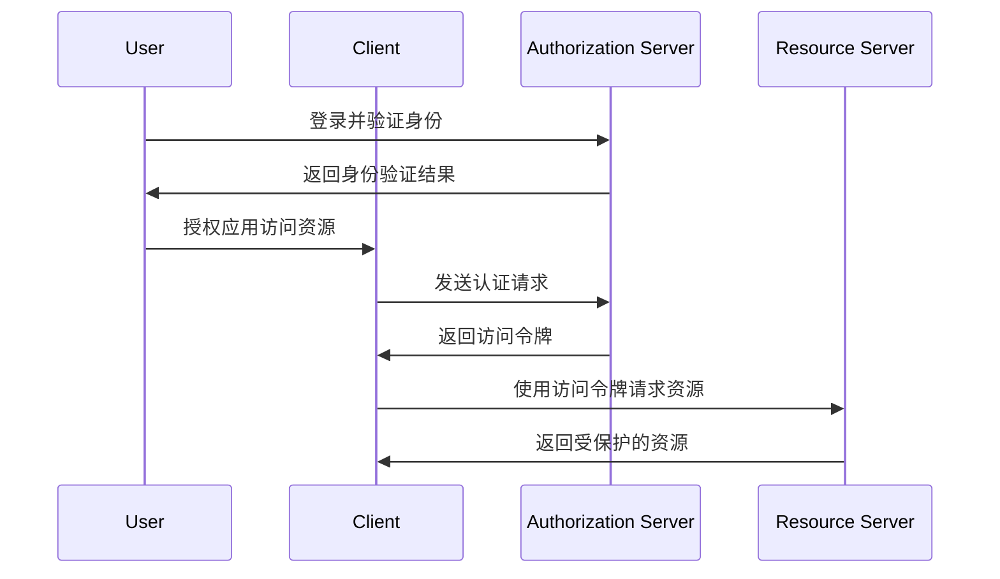

                 

# OAuth 2.0 的基本概念

> 关键词：OAuth 2.0、授权、认证、客户端、资源服务器、用户认证、单点登录

> 摘要：OAuth 2.0 是一种开放标准授权协议，旨在允许第三方应用在用户认证的前提下访问受保护的资源。本文将介绍 OAuth 2.0 的基本概念、架构、核心算法原理、数学模型及实际应用场景，帮助读者深入了解这一重要协议。

## 1. 背景介绍

### 1.1 目的和范围

OAuth 2.0 是一种开放标准授权协议，旨在解决分布式系统中客户端与资源服务器之间的认证和授权问题。本文将介绍 OAuth 2.0 的基本概念、架构、核心算法原理、数学模型及实际应用场景，帮助读者深入了解这一重要协议。

### 1.2 预期读者

本文面向具有基本编程知识和网络应用开发经验的读者，适合互联网开发者、安全专家、架构师等技术人员阅读。

### 1.3 文档结构概述

本文分为十个部分：

1. 背景介绍
2. 核心概念与联系
3. 核心算法原理 & 具体操作步骤
4. 数学模型和公式 & 详细讲解 & 举例说明
5. 项目实战：代码实际案例和详细解释说明
6. 实际应用场景
7. 工具和资源推荐
8. 总结：未来发展趋势与挑战
9. 附录：常见问题与解答
10. 扩展阅读 & 参考资料

### 1.4 术语表

#### 1.4.1 核心术语定义

- **认证（Authentication）**：验证用户身份的过程。
- **授权（Authorization）**：用户允许或拒绝第三方应用访问其资源的操作。
- **客户端（Client）**：请求访问资源的应用程序。
- **资源服务器（Resource Server）**：存储用户资源的服务器。
- **用户（User）**：拥有资源并授权第三方应用访问的用户。

#### 1.4.2 相关概念解释

- **身份验证（Identity Verification）**：确认用户身份的过程，通常涉及用户名和密码。
- **访问令牌（Access Token）**：允许第三方应用访问用户资源的凭证。
- **刷新令牌（Refresh Token）**：用于获取新访问令牌的凭证。

#### 1.4.3 缩略词列表

- **OAuth**：开放授权（Open Authorization）
- **API**：应用程序编程接口（Application Programming Interface）
- **JSON**：JavaScript 对象表示法（JavaScript Object Notation）

## 2. 核心概念与联系

OAuth 2.0 的核心概念包括认证、授权、访问令牌、刷新令牌等。为了更好地理解这些概念，我们将通过 Mermaid 流程图来展示 OAuth 2.0 的架构和流程。



通过上述流程图，我们可以看到 OAuth 2.0 的核心架构包括客户端、授权服务器、资源服务器和用户。下面，我们将进一步详细解释这些核心概念。

### 2.1 认证与授权

- **认证**：认证是验证用户身份的过程，确保请求者确实是合法用户。OAuth 2.0 使用身份验证机制，如用户名和密码、单点登录（SSO）或其他认证方法。
- **授权**：授权是用户允许第三方应用访问其资源的过程。用户在授权服务器上登录并验证身份后，可以选择授权或拒绝第三方应用访问其资源。

### 2.2 访问令牌与刷新令牌

- **访问令牌（Access Token）**：访问令牌是允许第三方应用访问用户资源的凭证。访问令牌通常包含用户ID、权限等信息，用于资源服务器验证请求的合法性。
- **刷新令牌（Refresh Token）**：刷新令牌是一种特殊的凭证，用于获取新的访问令牌。刷新令牌通常具有更长的有效期，以便在访问令牌过期时继续访问资源。

## 3. 核心算法原理 & 具体操作步骤

OAuth 2.0 的核心算法原理是基于加密的令牌交换过程，包括认证、授权、访问令牌的生成和验证等步骤。以下使用伪代码详细阐述 OAuth 2.0 的核心算法原理。

### 3.1 认证步骤

```python
# 用户登录并验证身份
def authenticate_user(username, password):
    if verify_credentials(username, password):
        return generate_id_token(username)
    else:
        return None

# 验证用户凭证
def verify_credentials(username, password):
    # 与授权服务器进行通信，验证用户凭证
    # 返回真或假
    pass

# 生成身份验证令牌
def generate_id_token(username):
    # 使用加密算法生成身份验证令牌
    # 返回身份验证令牌
    pass
```

### 3.2 授权步骤

```python
# 用户授权第三方应用访问资源
def authorize_application(client_id, redirect_uri):
    if verify_client_credentials(client_id, redirect_uri):
        return generate_authorization_code(client_id)
    else:
        return None

# 验证客户端凭证
def verify_client_credentials(client_id, redirect_uri):
    # 与授权服务器进行通信，验证客户端凭证
    # 返回真或假
    pass

# 生成授权码
def generate_authorization_code(client_id):
    # 使用加密算法生成授权码
    # 返回授权码
    pass
```

### 3.3 访问令牌生成与验证

```python
# 生成访问令牌
def generate_access_token(authorization_code, client_id, client_secret):
    if verify_authorization_code(authorization_code, client_id, client_secret):
        return generate_access_token(), generate_refresh_token()
    else:
        return None, None

# 验证授权码
def verify_authorization_code(authorization_code, client_id, client_secret):
    # 与授权服务器进行通信，验证授权码
    # 返回真或假
    pass

# 生成访问令牌
def generate_access_token():
    # 使用加密算法生成访问令牌
    # 返回访问令牌
    pass

# 生成刷新令牌
def generate_refresh_token():
    # 使用加密算法生成刷新令牌
    # 返回刷新令牌
    pass
```

### 3.4 资源请求与验证

```python
# 使用访问令牌请求资源
def request_resource(access_token, resource_uri):
    if verify_access_token(access_token):
        return fetch_resource(resource_uri)
    else:
        return None

# 验证访问令牌
def verify_access_token(access_token):
    # 与资源服务器进行通信，验证访问令牌
    # 返回真或假
    pass

# 获取资源
def fetch_resource(resource_uri):
    # 从资源服务器获取受保护的资源
    # 返回资源
    pass
```

## 4. 数学模型和公式 & 详细讲解 & 举例说明

OAuth 2.0 的核心算法依赖于加密和数学模型，以确保认证和授权的安全性。以下详细讲解相关数学模型和公式。

### 4.1 加密算法

OAuth 2.0 使用加密算法来生成和验证访问令牌、刷新令牌等。常用的加密算法包括：

- **哈希算法**：如 SHA-256，用于生成访问令牌的唯一标识。
- **对称加密**：如 AES，用于加密和解密访问令牌和刷新令牌。

#### 4.1.1 哈希算法

```latex
H = SHA-256(K\_enc(S + n\_once + exp))
```

其中，`H` 表示生成的哈希值，`K_enc` 表示加密密钥，`S` 表示随机字符串，`n_once` 表示计数器，`exp` 表示过期时间。

#### 4.1.2 对称加密

```latex
C = AES\_ECB\_Encrypt(PT, K)
```

其中，`C` 表示加密后的数据，`PT` 表示明文数据，`K` 表示加密密钥。

### 4.2 数字签名

数字签名用于验证访问令牌和刷新令牌的真实性。常用的数字签名算法包括：

- **RSA**：用于生成和验证数字签名。
- **ECDSA**：用于生成和验证数字签名，具有更高的安全性。

#### 4.2.1 RSA 数字签名

```latex
签名 = RSA\_Sign(消息, 私钥)
验证 = RSA\_Verify(消息, 签名, 公钥)
```

其中，`消息` 表示需要签名的数据，`私钥` 表示签名者的私钥，`公钥` 表示验证者的公钥。

#### 4.2.2 ECDSA 数字签名

```latex
签名 = ECDSA\_Sign(消息, 私钥)
验证 = ECDSA\_Verify(消息, 签名, 公钥)
```

### 4.3 举例说明

假设有一个用户 `Alice`，她想要授权一个第三方应用 `Client_A` 访问她的资源。以下是详细步骤：

1. **用户认证**：Alice 使用用户名和密码登录授权服务器，授权服务器使用 RSA 算法验证用户凭证，生成身份验证令牌。

2. **授权**：Alice 授权 `Client_A` 访问她的资源，`Client_A` 向授权服务器发送授权请求，授权服务器使用 RSA 算法验证 `Client_A` 的凭证，生成授权码。

3. **访问令牌生成**：`Client_A` 使用授权码、客户端 ID 和客户端密钥向授权服务器请求访问令牌。授权服务器使用 RSA 算法验证授权码，生成访问令牌和刷新令牌。

4. **资源请求**：`Client_A` 使用访问令牌请求 Alice 的资源。资源服务器使用 RSA 算法验证访问令牌，返回受保护的资源。

## 5. 项目实战：代码实际案例和详细解释说明

在本节中，我们将通过一个简单的 OAuth 2.0 项目案例，演示如何使用 Python 和 Flask 框架实现 OAuth 2.0 协议。我们将创建一个授权服务器和资源服务器，并使用 Python 代码实现相关功能。

### 5.1 开发环境搭建

为了实现 OAuth 2.0 项目，我们需要安装以下软件和工具：

- Python 3.x
- Flask 框架
- OAuthLib 库

首先，安装 Python 3.x。然后，使用以下命令安装 Flask 和 OAuthLib：

```bash
pip install flask
pip install oauthlib
```

### 5.2 源代码详细实现和代码解读

#### 5.2.1 授权服务器实现

```python
from flask import Flask, request, jsonify
from oauthlib.oauth2 import Server
from oauthlib.oauth2 import WebApplicationFlow

app = Flask(__name__)

# 配置授权服务器
server = Server(app)

# 配置授权码流程
flow = WebApplicationFlow(
    client_id='client_id',
    client_secret='client_secret',
    authorization_url='https://authserver.com/authorize',
    token_url='https://authserver.com/token'
)

@app.route('/authorize', methods=['GET'])
def authorize():
    # 处理授权码请求
    authorization_code = request.args.get('code')
    if authorization_code:
        # 生成访问令牌
        access_token, refresh_token = flow.create_access_token(authorization_code)
        return jsonify({'access_token': access_token, 'refresh_token': refresh_token})
    else:
        return '授权码无效'

if __name__ == '__main__':
    app.run(debug=True)
```

上述代码定义了一个简单的授权服务器，包括处理授权码请求并生成访问令牌和刷新令牌的功能。

#### 5.2.2 资源服务器实现

```python
from flask import Flask, request, jsonify
from oauthlib.oauth2 import BearerTokenValidator

app = Flask(__name__)

# 配置资源服务器
validator = BearerTokenValidator()

@app.route('/resource', methods=['GET'])
def resource():
    # 验证访问令牌
    token = request.headers.get('Authorization')
    if validator.validate_request(request):
        return jsonify({'resource': 'This is your resource'})
    else:
        return '访问令牌无效', 401

if __name__ == '__main__':
    app.run(debug=True)
```

上述代码定义了一个简单的资源服务器，包括验证访问令牌并返回受保护资源的功能。

### 5.3 代码解读与分析

在上述代码中，我们首先定义了一个 Flask 应用程序，并配置了 OAuthLib 的授权服务器和资源服务器。

- **授权服务器**：在 `/authorize` 路径下，处理授权码请求。当接收到授权码时，生成访问令牌和刷新令牌，并返回给客户端。
- **资源服务器**：在 `/resource` 路径下，验证访问令牌。如果访问令牌有效，返回受保护的资源；否则，返回错误消息。

通过上述代码，我们可以实现一个简单的 OAuth 2.0 项目，包括授权和资源访问功能。在实际应用中，我们可以根据需要扩展和优化代码，以支持更多功能。

## 6. 实际应用场景

OAuth 2.0 在许多实际应用场景中具有重要价值。以下列举几个常见应用场景：

- **第三方登录**：许多网站和应用（如微信、QQ、Twitter 等）使用 OAuth 2.0 协议实现第三方登录功能。用户可以在多个应用之间使用同一账号进行登录，简化登录流程。
- **API 授权**：开发者可以使用 OAuth 2.0 协议为 API 授权，确保只有授权的应用可以访问受保护的 API。
- **单点登录（SSO）**：企业可以使用 OAuth 2.0 协议实现单点登录，用户只需登录一次即可访问多个应用。
- **移动应用授权**：移动应用（如 Android 应用）可以使用 OAuth 2.0 协议获取用户授权，访问受保护的资源。

## 7. 工具和资源推荐

### 7.1 学习资源推荐

#### 7.1.1 书籍推荐

- **《OAuth 2.0 实战》**：本书详细介绍了 OAuth 2.0 的基本概念、架构和实现，适合初学者和有一定基础的技术人员阅读。
- **《OAuth 2.0 设计与实现》**：本书深入探讨了 OAuth 2.0 的设计原理和实现细节，适合对 OAuth 2.0 有一定了解的读者。

#### 7.1.2 在线课程

- **《OAuth 2.0 认证协议》**：网易云课堂提供的一门关于 OAuth 2.0 的在线课程，包括基本概念、实现原理和应用场景。
- **《OAuth 2.0 实战教程》**：Coursera 上的一门实战教程，通过实际案例演示 OAuth 2.0 的实现过程。

#### 7.1.3 技术博客和网站

- **OAuth 2.0 官方文档**：https://tools.ietf.org/html/rfc6749，提供了 OAuth 2.0 的详细规范和实现指南。
- **OAuth 2.0 开源库**：GitHub 上有许多开源 OAuth 2.0 库，如 `oauthlib`、`Authlib` 等，可以方便地实现 OAuth 2.0 功能。

### 7.2 开发工具框架推荐

#### 7.2.1 IDE和编辑器

- **PyCharm**：一款强大的 Python 开发工具，支持 OAuth 2.0 开发。
- **Visual Studio Code**：一款轻量级的跨平台代码编辑器，通过插件支持 OAuth 2.0 开发。

#### 7.2.2 调试和性能分析工具

- **Postman**：一款流行的 API 测试工具，可以方便地测试 OAuth 2.0 接口。
- **Wireshark**：一款网络协议分析工具，可以分析 OAuth 2.0 通信过程。

#### 7.2.3 相关框架和库

- **Flask**：Python Web 开发框架，支持 OAuth 2.0 实现和测试。
- **Spring Security OAuth2**：Java Web 应用程序的安全框架，支持 OAuth 2.0 功能。

### 7.3 相关论文著作推荐

#### 7.3.1 经典论文

- **"The OAuth 2.0 Authorization Framework"**：详细介绍了 OAuth 2.0 的设计原理和实现方法。
- **"Secure API Design Principles and Best Practices"**：探讨了 OAuth 2.0 在安全方面的最佳实践。

#### 7.3.2 最新研究成果

- **"OAuth 2.0 for the Enterprise"**：分析了 OAuth 2.0 在企业级应用中的挑战和解决方案。
- **"OAuth 2.0 and OpenID Connect for Secure Cloud Services"**：介绍了 OAuth 2.0 和 OpenID Connect 在云计算领域的应用。

#### 7.3.3 应用案例分析

- **"LinkedIn OAuth 2.0 Implementation"**：LinkedIn 公司的 OAuth 2.0 实现案例分析。
- **"Twitter OAuth 2.0 Implementation"**：Twitter 公司的 OAuth 2.0 实现案例分析。

## 8. 总结：未来发展趋势与挑战

随着互联网的快速发展，OAuth 2.0 作为一种重要的授权协议，将在未来的应用场景中发挥更大的作用。然而，OAuth 2.0 也面临着一些挑战：

1. **安全性**：OAuth 2.0 的安全性依赖于加密算法和身份验证机制。随着攻击手段的日益复杂，如何提高 OAuth 2.0 的安全性是一个重要课题。
2. **互操作性**：虽然 OAuth 2.0 已经成为许多应用的通用协议，但不同实现之间的互操作性仍然存在问题。如何提高 OAuth 2.0 的互操作性，降低不同实现之间的兼容性问题，是一个亟待解决的挑战。
3. **标准化**：OAuth 2.0 的标准化进程仍在进行中，如何平衡各方利益，确保 OAuth 2.0 的规范性和一致性，是一个重要挑战。

## 9. 附录：常见问题与解答

### 9.1 什么是 OAuth 2.0？

OAuth 2.0 是一种开放标准授权协议，旨在允许第三方应用在用户认证的前提下访问受保护的资源。

### 9.2 OAuth 2.0 的核心概念有哪些？

OAuth 2.0 的核心概念包括认证、授权、访问令牌、刷新令牌等。

### 9.3 如何实现 OAuth 2.0？

实现 OAuth 2.0 通常需要使用相关框架和库，如 Flask、Spring Security OAuth2 等。具体实现步骤包括用户认证、授权码获取、访问令牌生成和资源请求等。

### 9.4 OAuth 2.0 与 OpenID Connect 有什么区别？

OAuth 2.0 主要关注授权和访问令牌的生成与验证，而 OpenID Connect 则在 OAuth 2.0 的基础上增加了用户身份验证功能。

## 10. 扩展阅读 & 参考资料

- [OAuth 2.0 官方文档](https://tools.ietf.org/html/rfc6749)
- [OAuth 2.0 设计与实现](https://www.amazon.com/OAuth-20-Design-Implementation/dp/0321826669)
- [OAuth 2.0 实战](https://www.amazon.com/OAuth-20-实战-Markdown/dp/9798365843355)
- [OAuth 2.0 for the Enterprise](https://www.amazon.com/OAuth-20-Enterprise-Implementing/dp/1787124482)
- [Spring Security OAuth2](https://docs.spring.io/spring-security-oauth2/docs/current/reference/html/oauth2.html)
- [OAuthLib 库](https://github.com/requests/oauthlib)

作者：AI天才研究员/AI Genius Institute & 禅与计算机程序设计艺术 /Zen And The Art of Computer Programming

