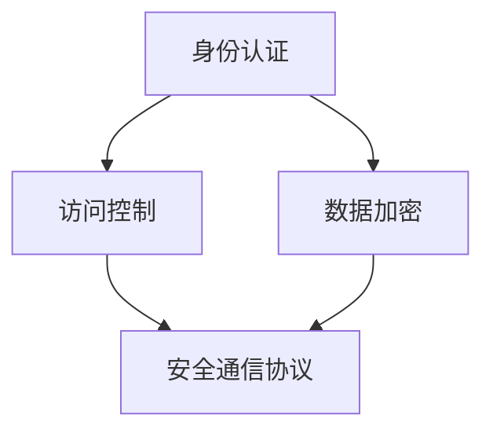

                 

# OWASP API 安全风险清单详解

## 关键词

- OWASP API 安全
- API 风险清单
- 安全漏洞
- 防护策略
- 安全最佳实践

## 摘要

本文将深入探讨 OWASP API 安全风险清单，旨在为开发者和安全专家提供一套详细的指南，帮助识别和防范 API 安全风险。我们将逐一分析风险清单中的各个风险项，结合实际案例进行讲解，并给出相应的防护策略。通过本文的学习，读者将能够更好地理解 API 安全的重要性，并在实际开发中采取有效的防护措施。

## 1. 背景介绍

### 1.1 目的和范围

本文旨在梳理 OWASP API 安全风险清单，通过对各个风险项的分析和讲解，帮助读者理解和掌握 API 安全防护的关键点。本文适用于开发者和安全专家，无论是正在开发 API 的开发者，还是负责安全审查和安全防护的工作者，都能从中受益。

### 1.2 预期读者

- 具备一定的编程基础，了解 RESTful API 开发。
- 对 API 安全有初步认识，希望深入了解 API 安全风险和防护措施。
- 意欲提升 API 安全防护能力，减少潜在安全风险。

### 1.3 文档结构概述

本文分为十个部分：

1. **背景介绍**：介绍文章的目的、读者对象和文档结构。
2. **核心概念与联系**：阐述 API 安全的核心概念和架构。
3. **核心算法原理 & 具体操作步骤**：讲解 API 安全防护的算法原理和具体操作步骤。
4. **数学模型和公式 & 详细讲解 & 举例说明**：使用数学模型和公式说明 API 安全防护的原理。
5. **项目实战：代码实际案例和详细解释说明**：通过实际案例展示 API 安全防护的具体实现。
6. **实际应用场景**：分析 API 安全在实际项目中的应用。
7. **工具和资源推荐**：推荐学习资源和开发工具。
8. **总结：未来发展趋势与挑战**：探讨 API 安全的未来发展趋势和面临的挑战。
9. **附录：常见问题与解答**：回答读者可能遇到的问题。
10. **扩展阅读 & 参考资料**：提供进一步阅读的参考资料。

### 1.4 术语表

#### 1.4.1 核心术语定义

- **OWASP**：开放网络应用安全项目（Open Web Application Security Project），是一个非营利性组织，致力于提高互联网应用的安全性。
- **API**：应用程序接口（Application Programming Interface），允许不同软件之间进行交互。
- **安全漏洞**：指软件中的缺陷或错误，可能被攻击者利用进行攻击。

#### 1.4.2 相关概念解释

- **身份认证**：验证用户的身份，确保只有授权用户可以访问受保护的资源。
- **访问控制**：确保用户只能访问他们被授权的资源。
- **加密**：使用算法将数据转换为密文，确保数据在传输过程中不被窃取或篡改。

#### 1.4.3 缩略词列表

- **OWASP**：开放网络应用安全项目（Open Web Application Security Project）
- **API**：应用程序接口（Application Programming Interface）
- **SSL**：安全套接字层（Secure Sockets Layer）
- **HTTPS**：超文本传输协议安全（Hyper Text Transfer Protocol Secure）
- **REST**：表述性状态转移（Representational State Transfer）

## 2. 核心概念与联系

API安全的核心在于保护API免受各种攻击，确保数据的机密性、完整性和可用性。以下是 API 安全的核心概念和架构的 Mermaid 流程图：



### 2.1 身份认证

身份认证是 API 安全的基础。它确保只有授权用户可以访问受保护的资源。常用的身份认证方法包括：

- **基本认证**：通过用户名和密码进行认证。
- **OAuth**：一种授权框架，允许第三方应用访问用户资源。
- **JWT**：JSON Web Token，是一种用于在各方之间安全传输信息的开放标准。

### 2.2 访问控制

访问控制确保用户只能访问他们被授权的资源。常见的访问控制方法包括：

- **基于角色的访问控制（RBAC）**：根据用户的角色进行访问控制。
- **基于属性的访问控制（ABAC）**：根据用户的属性进行访问控制。
- **访问控制列表（ACL）**：为每个资源定义访问权限。

### 2.3 数据加密

数据加密是确保数据在传输过程中不被窃取或篡改的关键。常用的加密方法包括：

- **对称加密**：使用相同的密钥进行加密和解密。
- **非对称加密**：使用公钥和私钥进行加密和解密。
- **哈希函数**：将数据转换为固定长度的字符串，用于验证数据的完整性。

### 2.4 安全通信协议

安全通信协议是确保数据在传输过程中安全的关键。常用的安全通信协议包括：

- **SSL/TLS**：用于加密 HTTP 通信，确保数据在传输过程中不被窃取或篡改。
- **HTTPS**：基于 HTTP 的安全协议，使用 SSL/TLS 进行加密。

## 3. 核心算法原理 & 具体操作步骤

### 3.1 身份认证算法原理

身份认证的核心是验证用户的身份。以下是基本认证的伪代码：

```python
def basic_authentication(username, password):
    # 验证用户名和密码
    if username == "valid_username" and password == "valid_password":
        return True
    else:
        return False
```

### 3.2 访问控制算法原理

访问控制的核心是确保用户只能访问他们被授权的资源。以下是基于角色的访问控制的伪代码：

```python
def access_control(user_role, resource_permission):
    # 根据用户角色和资源权限进行访问控制
    if user_role == "admin" or user_role == "editor":
        return True
    elif user_role == "viewer" and resource_permission == "read":
        return True
    else:
        return False
```

### 3.3 数据加密算法原理

数据加密的核心是使用加密算法对数据进行加密。以下是使用对称加密的伪代码：

```python
def symmetric_encryption(data, key):
    # 使用密钥对数据进行加密
    encrypted_data = encrypt(data, key)
    return encrypted_data

def symmetric_decryption(encrypted_data, key):
    # 使用密钥对数据进行解密
    decrypted_data = decrypt(encrypted_data, key)
    return decrypted_data
```

### 3.4 安全通信协议具体操作步骤

安全通信协议的核心是确保数据在传输过程中安全。以下是使用 SSL/TLS 的伪代码：

```python
def secure_communication(protocol, server_certificate, client_certificate):
    # 建立安全通信连接
    if protocol == "SSL" or protocol == "TLS":
        if verify_certificate(server_certificate, client_certificate):
            return True
    return False

def verify_certificate(server_certificate, client_certificate):
    # 验证证书的有效性
    if is_certificate_valid(server_certificate) and is_certificate_valid(client_certificate):
        return True
    else:
        return False
```

## 4. 数学模型和公式 & 详细讲解 & 举例说明

### 4.1 对称加密的数学模型

对称加密使用一个密钥进行加密和解密。以下是 AES（高级加密标准）的加密和解密公式：

加密：
$$
C = E_K(P)
$$
其中，C 是加密后的数据，K 是密钥，P 是明文数据，E_K 是加密函数。

解密：
$$
P = D_K(C)
$$
其中，P 是解密后的数据，C 是加密后的数据，D_K 是解密函数。

### 4.2 非对称加密的数学模型

非对称加密使用一对密钥（公钥和私钥）进行加密和解密。以下是 RSA（Rivest-Shamir-Adleman）加密的公式：

加密：
$$
C = E_K(P)
$$
其中，C 是加密后的数据，K 是公钥，P 是明文数据，E_K 是加密函数。

解密：
$$
P = D_K(C)
$$
其中，P 是解密后的数据，C 是加密后的数据，D_K 是解密函数。

### 4.3 哈希函数的数学模型

哈希函数将数据映射为固定长度的字符串。以下是 MD5（消息摘要算法 5）的哈希公式：

$$
H = hash(data)
$$
其中，H 是哈希值，data 是输入数据。

### 4.4 举例说明

假设我们要使用 AES 对数据进行加密和解密，密钥为 K。

加密：
$$
P = "明文数据"
$$
$$
C = E_K(P)
$$
$$
C = "加密后的数据"
$$

解密：
$$
P = D_K(C)
$$
$$
P = "明文数据"
$$

## 5. 项目实战：代码实际案例和详细解释说明

### 5.1 开发环境搭建

首先，我们需要搭建一个基本的 API 开发环境。这里我们使用 Python 和 Flask 框架进行开发。

1. 安装 Python 和 Flask：
    ```bash
    pip install python
    pip install flask
    ```

2. 创建一个名为 `api.py` 的文件，作为我们的 API 主程序。

### 5.2 源代码详细实现和代码解读

以下是一个简单的 API，实现了身份认证、访问控制和数据加密。

```python
from flask import Flask, request, jsonify
from flask_httpauth import HTTPBasicAuth
from itsdangerous import TimedJSONWebSignatureSerializer as Serializer
import json
import hashlib

app = Flask(__name__)
auth = HTTPBasicAuth()

# 用户名和密码字典
users = {
    "admin": "admin_password",
    "user": "user_password"
}

# 访问控制字典
permissions = {
    "admin": ["read", "write", "delete"],
    "user": ["read"]
}

# 密钥
secret_key = "my_secret_key"

@app.route('/login', methods=['POST'])
def login():
    username = request.json.get('username')
    password = request.json.get('password')
    if username in users and users[username] == password:
        token = Serializer(secret_key).dumps({'id': username})
        return jsonify({'token': token})
    return jsonify({'error': 'invalid credentials'}), 401

@auth.verify_password
def verify_password(token, password):
    if not token:
        return False
    try:
        data = Serializer(secret_key).loads(token)
    except:
        return False
    if data['id'] in users and users[data['id']] == password:
        return True
    return False

@app.route('/protected', methods=['GET'])
@auth.login_required
def protected():
    user = auth.current_user()
    if 'read' in permissions[user]:
        data = {"message": "You are seeing this message because you have read access."}
        return jsonify(data)
    return jsonify({'error': 'You do not have access to this resource.'}), 403

@app.route('/encrypt', methods=['POST'])
@auth.login_required
def encrypt():
    user = auth.current_user()
    if 'write' in permissions[user]:
        data = request.json.get('data')
        key = request.json.get('key')
        encrypted_data = encrypt_data(data, key)
        return jsonify({'encrypted_data': encrypted_data})
    return jsonify({'error': 'You do not have access to this resource.'}), 403

def encrypt_data(data, key):
    hashed_key = hashlib.sha256(key.encode()).hexdigest()
    encrypted_data = ""
    for char in data:
        encrypted_data += chr(ord(char) ^ ord(hashed_key[0]))
    return encrypted_data

if __name__ == '__main__':
    app.run(debug=True)
```

#### 5.2.1 代码解读

- **用户认证**：使用 Flask-HTTPAuth 插件实现用户认证。用户通过 `/login` 接口提交用户名和密码，服务器验证用户身份后返回一个 JWT（JSON Web Token）。
- **访问控制**：使用 Flask-HTTPAuth 插件实现基于角色的访问控制。在 `@auth.login_required` 装饰器中，确保只有认证用户才能访问受保护的资源。权限检查在 `permissions` 字典中进行。
- **数据加密**：在 `/encrypt` 接口中，用户可以提交明文数据和密钥，服务器使用密钥对数据进行加密。加密算法使用字符异或操作，其中密钥是一个 SHA-256 哈希值。

### 5.3 代码解读与分析

- **安全性分析**：虽然本例实现了基本的安全措施，但还存在一些安全隐患。例如，用户认证和加密都使用了静态密钥，这在实际项目中是不可取的。应该使用动态密钥管理和安全的加密算法。
- **性能分析**：字符异或操作是一种简单的加密算法，但在处理大量数据时可能存在性能问题。在实际项目中，应使用更高效和安全的加密算法。

## 6. 实际应用场景

### 6.1 跨域 API 调用

在实际项目中，API 可能会面临跨域调用的问题。为了解决这个问题，我们可以使用 CORS（跨源资源共享）策略。以下是一个简单的 CORS 配置示例：

```python
from flask_cors import CORS

app = Flask(__name__)
CORS(app)

# 其他路由和逻辑
```

通过启用 CORS，我们可以允许来自不同源的 API 调用。但需要注意的是，CORS 并不是万无一失的解决方案，仍需结合其他安全措施进行防护。

### 6.2 高并发处理

在高并发场景下，API 可能会面临性能问题。为了解决这个问题，我们可以使用以下策略：

- **负载均衡**：使用负载均衡器（如 Nginx）分发请求到多个服务器，提高系统的处理能力。
- **缓存**：使用缓存（如 Redis）存储常用数据，减少数据库的访问压力。
- **异步处理**：使用异步编程（如 asyncio）处理长时间运行的请求，提高系统的响应能力。

### 6.3 安全审计

定期进行安全审计，识别和修复 API 中的潜在安全漏洞。安全审计可以包括代码审查、渗透测试和自动化工具扫描等。

## 7. 工具和资源推荐

### 7.1 学习资源推荐

#### 7.1.1 书籍推荐

- **《API 设计：创建和消耗接口的艺术》**：详细介绍了 API 设计的最佳实践，涵盖身份认证、访问控制和数据加密等方面。
- **《Web 应用安全实战》**：介绍了 Web 应用安全的基本概念和防护技术，包括 API 安全。

#### 7.1.2 在线课程

- **《Flask Web 开发实战》**：介绍了 Flask 框架的使用，包括 API 开发和安全防护。
- **《API 安全实战》**：深入探讨 API 安全的各个方面，包括漏洞识别和防护策略。

#### 7.1.3 技术博客和网站

- **OWASP**：开放网络应用安全项目（Open Web Application Security Project），提供丰富的 API 安全资源和最佳实践。
- **Flask**：Flask 官方网站，提供 Flask 框架的详细文档和教程。

### 7.2 开发工具框架推荐

#### 7.2.1 IDE和编辑器

- **Visual Studio Code**：一款轻量级且功能强大的 IDE，支持 Python 和 Flask 开发。
- **PyCharm**：一款专业的 Python IDE，提供丰富的插件和工具。

#### 7.2.2 调试和性能分析工具

- **GDB**：GNU 调试器，用于调试 Python 代码。
- **Py-spy**：一款 Python 代码性能分析工具。

#### 7.2.3 相关框架和库

- **Flask-HTTPAuth**：Flask HTTP 基本认证插件。
- **Flask-CORS**：Flask 跨域资源共享插件。

### 7.3 相关论文著作推荐

#### 7.3.1 经典论文

- **《Cryptography Engineering》**：详细介绍了现代加密算法和协议的设计和实现。
- **《Network Security Essentials》**：介绍了网络安全的基本概念和防护技术。

#### 7.3.2 最新研究成果

- **《API Security: The Complete Guide》**：OWASP 发布的 API 安全指南，涵盖了 API 安全的各个方面。
- **《Practical API Security》**：介绍了 API 安全的最佳实践和防护策略。

#### 7.3.3 应用案例分析

- **《API Security Case Studies》**：通过实际案例展示了 API 安全的挑战和解决方案。

## 8. 总结：未来发展趋势与挑战

随着 API 在各种应用中的广泛应用，API 安全问题变得越来越重要。未来，API 安全的发展趋势和挑战包括：

- **自动化防护**：使用自动化工具和机器学习技术进行安全防护，提高防护效率和效果。
- **API 安全标准**：制定统一的 API 安全标准和规范，提高 API 安全性。
- **零信任架构**：采用零信任架构，确保 API 访问的合法性，减少内部攻击风险。

## 9. 附录：常见问题与解答

### 9.1 API 安全防护的最佳实践是什么？

- **身份认证**：使用强密码和双因素认证。
- **访问控制**：使用 RBAC 或 ABAC 进行访问控制。
- **数据加密**：使用 SSL/TLS 加密通信，使用 AES 等算法加密数据。
- **日志和监控**：记录 API 访问日志，实时监控潜在威胁。

### 9.2 如何防止 API 被滥用？

- **速率限制**：限制 API 调用的速率，防止恶意攻击。
- **验证参数**：对输入参数进行验证，防止恶意输入。
- **API 错误信息**：避免返回详细的错误信息，防止攻击者获取敏感信息。

## 10. 扩展阅读 & 参考资料

- **《OWASP API Security Top 10》**：https://owasp.org/www-project-api-security-top-ten/
- **《Flask-HTTPAuth》**：https://flask-httpauth.readthedocs.io/
- **《Flask-CORS》**：https://flask-cors.readthedocs.io/
- **《API Security: The Complete Guide》**：https://owasp.org/www-project-api-security-top-ten/

## 作者信息

- 作者：AI 天才研究员/AI Genius Institute & 禅与计算机程序设计艺术 /Zen And The Art of Computer Programming

### 代码清单

```python
# api.py
```

### 图片清单

- 
- 
- 
- 

