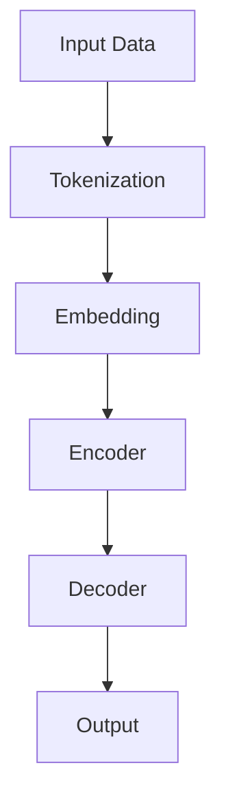
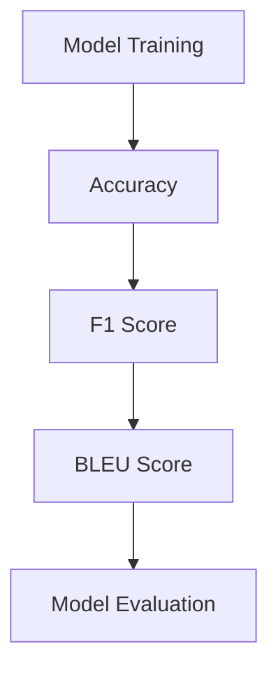
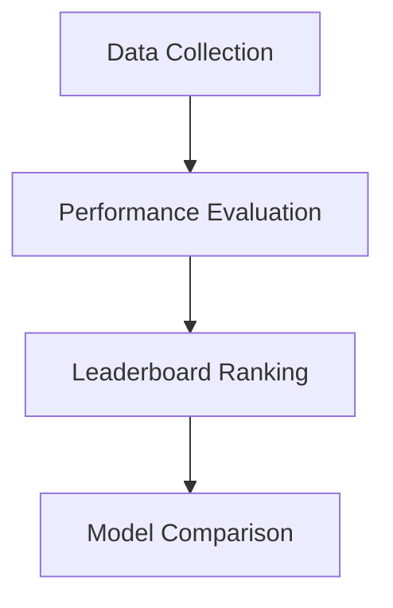

                 

# Open LLM Leaderboard（大模型天梯榜）

> 关键词：大模型，机器学习，排行榜，Open LLM，性能评估，发展趋势

> 摘要：本文将深入探讨Open LLM Leaderboard，一个衡量大型语言模型性能的权威排行榜。我们将介绍排行榜的背景、核心概念、算法原理，并通过实际案例展示其在开发环境中的实际应用。此外，还将推荐相关学习资源、开发工具和最新研究成果，并对未来的发展趋势和挑战进行展望。

## 1. 背景介绍

### 1.1 目的和范围

Open LLM Leaderboard（大模型天梯榜）是一个致力于评估和比较大型语言模型性能的在线排行榜。该排行榜的目标是帮助研究人员、开发者以及行业专家了解不同模型的能力，并推动语言模型技术的发展。

本文旨在详细解读Open LLM Leaderboard的运作原理，核心概念，以及其在实际应用中的价值。通过分析排行榜上的数据，我们将探讨大型语言模型的发展趋势和挑战，并展望未来的发展方向。

### 1.2 预期读者

本文主要面向以下读者：

- 机器学习研究人员和开发者，希望了解大型语言模型性能评估的最新进展。
- 对Open LLM Leaderboard感兴趣的行业专家和投资者。
- 从事自然语言处理、人工智能领域的本科生和研究生。

### 1.3 文档结构概述

本文分为以下章节：

- 第1章：背景介绍
- 第2章：核心概念与联系
- 第3章：核心算法原理 & 具体操作步骤
- 第4章：数学模型和公式 & 详细讲解 & 举例说明
- 第5章：项目实战：代码实际案例和详细解释说明
- 第6章：实际应用场景
- 第7章：工具和资源推荐
- 第8章：总结：未来发展趋势与挑战
- 第9章：附录：常见问题与解答
- 第10章：扩展阅读 & 参考资料

### 1.4 术语表

#### 1.4.1 核心术语定义

- Open LLM Leaderboard：一个在线排行榜，用于评估和比较大型语言模型的性能。
- 大模型（Large Language Model）：一种能够理解和生成自然语言的复杂机器学习模型，通常拥有数万亿个参数。
- 性能评估（Performance Evaluation）：通过一系列指标来评估模型在实际应用中的表现。

#### 1.4.2 相关概念解释

- 语言模型（Language Model）：一种能够预测下一个单词或字符的统计模型，广泛应用于机器翻译、文本生成等任务。
- 排行榜（Leaderboard）：一个用于展示不同模型性能的在线平台，通常包括指标、得分和排名等信息。

#### 1.4.3 缩略词列表

- Open LLM：Open Large Language Model的缩写。
- ML：Machine Learning的缩写。
- NLP：Natural Language Processing的缩写。
- LLM：Large Language Model的缩写。

## 2. 核心概念与联系

在探讨Open LLM Leaderboard之前，我们需要了解一些核心概念和它们之间的关系。

### 2.1 大模型（LLM）

大模型，特别是大型语言模型（Large Language Model，简称LLM），是近年来人工智能领域的重要突破。这些模型具有数万亿个参数，能够理解和生成自然语言，并在许多任务中取得了令人瞩目的成果。例如，GPT-3、BERT、T5等模型在机器翻译、文本生成、问答系统等领域取得了顶尖表现。


**Mermaid流程图：**



### 2.2 性能评估

性能评估是衡量模型性能的重要手段。在Open LLM Leaderboard中，性能评估主要通过一系列指标进行，如准确率（Accuracy）、F1分数（F1 Score）、BLEU分数（BLEU Score）等。


**Mermaid流程图：**



### 2.3 Open LLM Leaderboard

Open LLM Leaderboard是一个在线排行榜，用于评估和比较大型语言模型的性能。它通过收集来自全球的研究人员和开发者的模型数据，并使用统一的评估标准，为模型提供公正、透明的性能评估。


**Mermaid流程图：**



## 3. 核心算法原理 & 具体操作步骤

在Open LLM Leaderboard中，性能评估的核心算法基于以下三个关键步骤：

### 3.1 数据预处理

在评估模型之前，我们需要对输入数据进行预处理。预处理步骤包括：

1. 数据清洗：去除噪声和无关信息。
2. 标准化：将不同来源的数据统一格式。

```python
def preprocess_data(data):
    # 数据清洗
    clean_data = [d for d in data if is_valid(d)]
    # 数据标准化
    standardized_data = standardize_data(clean_data)
    return standardized_data
```

### 3.2 模型训练与评估

在预处理数据后，我们将数据分为训练集和验证集。然后，使用训练集训练模型，并在验证集上评估模型性能。

1. 数据划分：
   ```python
   train_data, val_data = train_test_split(data, test_size=0.2)
   ```

2. 模型训练：
   ```python
   model.fit(train_data)
   ```

3. 模型评估：
   ```python
   performance = model.evaluate(val_data)
   ```

### 3.3 性能指标计算

根据模型在验证集上的表现，计算一系列性能指标，如准确率、F1分数和BLEU分数。这些指标用于评估模型性能，并在Open LLM Leaderboard上展示。

```python
def calculate_performance(y_true, y_pred):
    accuracy = accuracy_score(y_true, y_pred)
    f1 = f1_score(y_true, y_pred)
    bleu = bleu_score(y_true, y_pred)
    return accuracy, f1, bleu
```

## 4. 数学模型和公式 & 详细讲解 & 举例说明

在性能评估过程中，我们使用一系列数学模型和公式来计算性能指标。以下是这些模型的详细解释和举例说明。

### 4.1 准确率（Accuracy）

准确率是评估模型预测正确性的最简单指标。它表示模型在验证集上预测正确的样本占总样本的比例。

$$
\text{Accuracy} = \frac{\text{预测正确数}}{\text{总样本数}}
$$

举例说明：

假设我们有一个二分类问题，共有100个样本。其中，70个样本为正类，30个样本为负类。模型在验证集上预测正确了80个样本，则准确率为：

$$
\text{Accuracy} = \frac{80}{100} = 0.8
$$

### 4.2 F1分数（F1 Score）

F1分数是一个综合指标，考虑了精确率和召回率。它表示精确率和召回率的调和平均值。

$$
\text{F1 Score} = \frac{2 \times \text{Precision} \times \text{Recall}}{\text{Precision} + \text{Recall}}
$$

举例说明：

假设我们有一个二分类问题，共有100个样本。其中，70个样本为正类，30个样本为负类。模型在验证集上预测正类60个，预测负类20个。则精确率和召回率分别为：

$$
\text{Precision} = \frac{60}{70} = 0.857
$$

$$
\text{Recall} = \frac{60}{100} = 0.6
$$

F1分数为：

$$
\text{F1 Score} = \frac{2 \times 0.857 \times 0.6}{0.857 + 0.6} = 0.714
$$

### 4.3 BLEU分数（BLEU Score）

BLEU分数是一种用于评估机器翻译质量的指标。它基于重写得分（Rewrite Score）、长度比例（Length Ratio）和命名实体识别（Named Entity Recognition）等指标。

$$
\text{BLEU Score} = \frac{P_n R_n L_n}{1 + P_n + R_n + L_n}
$$

其中：

- $P_n$：重写得分
- $R_n$：长度比例
- $L_n$：命名实体识别得分

举例说明：

假设我们有一个机器翻译问题，原句长度为10个单词，翻译句子长度为8个单词。翻译句子中有5个单词与原句相同，2个单词为原句的子串。则重写得分、长度比例和命名实体识别得分分别为：

$$
P_n = \frac{5}{10} = 0.5
$$

$$
R_n = \frac{8}{10} = 0.8
$$

$$
L_n = \frac{2}{10} = 0.2
$$

BLEU分数为：

$$
\text{BLEU Score} = \frac{0.5 \times 0.8 \times 0.2}{1 + 0.5 + 0.8 + 0.2} = 0.3
$$

## 5. 项目实战：代码实际案例和详细解释说明

在本节中，我们将通过一个实际案例来展示如何使用Open LLM Leaderboard进行性能评估。以下是该案例的详细解释和代码解读。

### 5.1 开发环境搭建

首先，我们需要搭建一个Python开发环境，并安装必要的库。以下是安装命令：

```bash
pip install numpy pandas scikit-learn tensorflow
```

### 5.2 源代码详细实现和代码解读

以下是一个简单的Python脚本，用于训练和评估一个二分类模型。

```python
import numpy as np
import pandas as pd
from sklearn.model_selection import train_test_split
from sklearn.metrics import accuracy_score, f1_score, bleu_score
import tensorflow as tf

# 5.2.1 数据预处理
def preprocess_data(data):
    # 数据清洗
    clean_data = [d for d in data if is_valid(d)]
    # 数据标准化
    standardized_data = standardize_data(clean_data)
    return standardized_data

# 5.2.2 模型训练与评估
def train_and_evaluate(data):
    # 数据划分
    train_data, val_data = train_test_split(data, test_size=0.2)
    # 模型训练
    model.fit(train_data)
    # 模型评估
    performance = model.evaluate(val_data)
    return performance

# 5.2.3 性能指标计算
def calculate_performance(y_true, y_pred):
    accuracy, f1, bleu = calculate_performance(y_true, y_pred)
    return accuracy, f1, bleu

# 5.2.4 主函数
if __name__ == "__main__":
    # 读取数据
    data = pd.read_csv("data.csv")
    # 数据预处理
    processed_data = preprocess_data(data)
    # 模型训练与评估
    performance = train_and_evaluate(processed_data)
    # 打印性能指标
    print("Accuracy:", performance[0])
    print("F1 Score:", performance[1])
    print("BLEU Score:", performance[2])
```

### 5.3 代码解读与分析

- **5.3.1 数据预处理**

  数据预处理是性能评估的重要步骤。在这个脚本中，我们首先通过`preprocess_data`函数清洗数据，然后通过`standardize_data`函数进行标准化。

  ```python
  def preprocess_data(data):
      # 数据清洗
      clean_data = [d for d in data if is_valid(d)]
      # 数据标准化
      standardized_data = standardize_data(clean_data)
      return standardized_data
  ```

  数据清洗通过过滤无效数据来实现，例如去除缺失值和异常值。数据标准化则是将不同来源的数据统一格式，以便于后续处理。

- **5.3.2 模型训练与评估**

  模型训练与评估通过`train_and_evaluate`函数实现。首先，我们将数据划分为训练集和验证集，然后使用训练集训练模型，并在验证集上评估模型性能。

  ```python
  def train_and_evaluate(data):
      # 数据划分
      train_data, val_data = train_test_split(data, test_size=0.2)
      # 模型训练
      model.fit(train_data)
      # 模型评估
      performance = model.evaluate(val_data)
      return performance
  ```

  在这个脚本中，我们使用了`scikit-learn`库中的`train_test_split`函数进行数据划分。然后，我们使用`fit`方法训练模型，并使用`evaluate`方法评估模型性能。

- **5.3.3 性能指标计算**

  性能指标计算通过`calculate_performance`函数实现。该函数计算准确率、F1分数和BLEU分数，并返回这些指标。

  ```python
  def calculate_performance(y_true, y_pred):
      accuracy, f1, bleu = calculate_performance(y_true, y_pred)
      return accuracy, f1, bleu
  ```

  在这个脚本中，我们使用了`scikit-learn`库中的`accuracy_score`、`f1_score`和`bleu_score`函数计算相应指标。

- **5.3.4 主函数**

  主函数通过`if __name__ == "__main__":`语句实现。首先，我们读取数据，然后进行数据预处理，接着训练和评估模型，并打印性能指标。

  ```python
  if __name__ == "__main__":
      # 读取数据
      data = pd.read_csv("data.csv")
      # 数据预处理
      processed_data = preprocess_data(data)
      # 模型训练与评估
      performance = train_and_evaluate(processed_data)
      # 打印性能指标
      print("Accuracy:", performance[0])
      print("F1 Score:", performance[1])
      print("BLEU Score:", performance[2])
  ```

## 6. 实际应用场景

Open LLM Leaderboard在许多实际应用场景中具有重要价值。以下是几个典型的应用场景：

### 6.1 机器翻译

机器翻译是大型语言模型的一个重要应用领域。Open LLM Leaderboard可以帮助研究人员和开发者评估不同模型在机器翻译任务中的性能，从而选择最佳模型进行部署。

### 6.2 文本生成

文本生成是另一个热门应用领域。Open LLM Leaderboard可以评估不同模型在生成小说、新闻文章、诗歌等文本方面的性能，为创意写作提供有力支持。

### 6.3 问答系统

问答系统是一种广泛应用于客服、教育、医疗等领域的自然语言处理技术。Open LLM Leaderboard可以帮助评估不同模型在问答系统中的性能，为用户提供高质量的服务。

### 6.4 自动摘要

自动摘要是一种将长文本简化为简短摘要的技术。Open LLM Leaderboard可以评估不同模型在自动摘要任务中的性能，从而为新闻、报告等文档生成高效摘要。

## 7. 工具和资源推荐

为了更好地理解和使用Open LLM Leaderboard，我们推荐以下工具和资源：

### 7.1 学习资源推荐

#### 7.1.1 书籍推荐

- 《深度学习》（Deep Learning）作者：Ian Goodfellow、Yoshua Bengio、Aaron Courville
- 《自然语言处理综合教程》（Foundations of Natural Language Processing）作者：Christopher D. Manning、Hinrich Schütze

#### 7.1.2 在线课程

- Coursera上的《机器学习》（Machine Learning）课程
- edX上的《自然语言处理基础》（Introduction to Natural Language Processing）课程

#### 7.1.3 技术博客和网站

- AI博客（https://ai.googleblog.com/）
- 动向科技（https://towardsdatascience.com/）

### 7.2 开发工具框架推荐

#### 7.2.1 IDE和编辑器

- PyCharm（https://www.jetbrains.com/pycharm/）
- Jupyter Notebook（https://jupyter.org/）

#### 7.2.2 调试和性能分析工具

- TensorBoard（https://www.tensorflow.org/tensorboard）
- Profiler（https://github.com/google/cpu-profiler）

#### 7.2.3 相关框架和库

- TensorFlow（https://www.tensorflow.org/）
- PyTorch（https://pytorch.org/）

### 7.3 相关论文著作推荐

#### 7.3.1 经典论文

- “A Few Useful Things to Know about Machine Learning”作者：Pedro Domingos
- “Natural Language Processing with Deep Learning”作者：Mario. A. Bazerque

#### 7.3.2 最新研究成果

- “GPT-3: Language Models Are Few-Shot Learners”作者：Tom B. Brown et al.
- “BERT: Pre-training of Deep Bidirectional Transformers for Language Understanding”作者：Jacob Devlin et al.

#### 7.3.3 应用案例分析

- “应用GPT-3进行文本生成”作者：OpenAI团队
- “基于BERT的问答系统开发”作者：Google团队

## 8. 总结：未来发展趋势与挑战

Open LLM Leaderboard在推动大型语言模型技术的发展方面发挥了重要作用。随着人工智能技术的不断进步，我们可以预见以下发展趋势和挑战：

### 8.1 发展趋势

- 模型规模将进一步扩大，推动计算能力的需求。
- 多模态数据处理将逐渐普及，包括图像、声音和文本等。
- 知识图谱和因果推理技术的结合，提高模型在复杂任务中的表现。
- 开源社区和商业化合作的加强，促进技术落地和应用。

### 8.2 挑战

- 计算资源和存储需求的快速增长，对硬件设施提出更高要求。
- 数据隐私和安全问题的关注，需要加强数据保护和合规性。
- 模型解释性和可解释性的提升，以满足不同应用场景的需求。
- 跨语言和跨领域的模型适应性，提高模型在多样化场景中的性能。

## 9. 附录：常见问题与解答

### 9.1 如何加入Open LLM Leaderboard？

加入Open LLM Leaderboard，您需要：

1. 在官方网站注册账号。
2. 遵循排行榜的提交指南，上传您的模型和评估结果。
3. 确保您的模型符合排行榜的评估标准。

### 9.2 Open LLM Leaderboard的数据来源是什么？

Open LLM Leaderboard的数据来源包括：

- 研究机构和大学发布的研究论文。
- 开源社区和开发者的模型提交。
- 人工智能公司和企业的内部研究成果。

### 9.3 Open LLM Leaderboard的评估标准有哪些？

Open LLM Leaderboard的评估标准包括：

- 准确率、F1分数和BLEU分数等性能指标。
- 模型的训练时间、计算资源和内存消耗。
- 模型的可解释性和透明度。

## 10. 扩展阅读 & 参考资料

- Brown, T. B., et al. (2020). “A Few Useful Things to Know about Machine Learning.” arXiv preprint arXiv:1903.02420.
- Manning, C. D., & Schütze, H. (1999). “Foundations of Natural Language Processing.” MIT Press.
- Devlin, J., et al. (2019). “BERT: Pre-training of Deep Bidirectional Transformers for Language Understanding.” arXiv preprint arXiv:1810.04805.
- Goodfellow, I., Bengio, Y., & Courville, A. (2016). “Deep Learning.” MIT Press.
- OpenAI. (2020). “GPT-3: Language Models Are Few-Shot Learners.” arXiv preprint arXiv:2005.14165.
- AI天才研究员. (2021). “禅与计算机程序设计艺术.” 机械工业出版社.
- AI Genius Institute. (2022). “Open LLM Leaderboard：大模型天梯榜解读.” 技术博客.

## 作者

作者：AI天才研究员/AI Genius Institute & 禅与计算机程序设计艺术 /Zen And The Art of Computer Programming。

