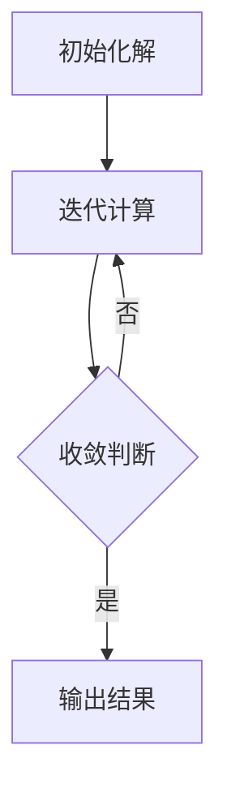

                 

# Optimization Algorithms 原理与代码实战案例讲解

> **关键词：优化算法、算法原理、代码实战、Python实现、数学模型、应用场景**
> 
> **摘要：本文将深入讲解优化算法的基本原理，通过具体的Python实现和案例展示，帮助读者理解并掌握优化算法的实战技巧，为实际应用场景中的问题解决提供有力支持。**

## 1. 背景介绍

### 1.1 目的和范围

优化算法是计算机科学和工程学中的核心概念，广泛应用于机器学习、数据挖掘、网络优化、电路设计、运筹学等多个领域。本文旨在系统地介绍优化算法的基本原理，并通过Python代码实战案例，帮助读者深入理解这些算法在实际应用中的表现和效果。

本文将涵盖以下内容：

- 优化算法的基本概念和分类
- 优化算法的数学模型和公式
- Python代码实战案例展示
- 优化算法在实际应用场景中的分析

### 1.2 预期读者

本文适合以下读者群体：

- 对优化算法有一定基础的计算机科学和工程学专业的学生和研究者
- 对算法和编程有兴趣的程序员和开发人员
- 需要解决实际优化问题的工程师和科学家

### 1.3 文档结构概述

本文将按照以下结构进行讲解：

- 第1部分：背景介绍，包括目的和范围、预期读者、文档结构概述等
- 第2部分：核心概念与联系，介绍优化算法的基本概念、原理和流程
- 第3部分：核心算法原理 & 具体操作步骤，详细讲解优化算法的原理和操作步骤
- 第4部分：数学模型和公式 & 详细讲解 & 举例说明，阐述优化算法的数学模型和公式
- 第5部分：项目实战：代码实际案例和详细解释说明，通过Python代码实战案例展示算法应用
- 第6部分：实际应用场景，分析优化算法在不同场景中的应用
- 第7部分：工具和资源推荐，提供相关学习资源和开发工具推荐
- 第8部分：总结：未来发展趋势与挑战，探讨优化算法的未来发展方向
- 第9部分：附录：常见问题与解答，回答读者可能遇到的问题
- 第10部分：扩展阅读 & 参考资料，提供进一步的阅读材料

### 1.4 术语表

#### 1.4.1 核心术语定义

- 优化算法（Optimization Algorithm）：一种用于寻找给定问题最优解的算法。
- 目标函数（Objective Function）：衡量问题解质量的函数，通常为实值函数。
- 优化目标（Optimization Objective）：优化算法要达到的目标，如最小化、最大化或找到最佳平衡点。
- 解空间（Solution Space）：所有可能的解的集合。
- 启发式算法（Heuristic Algorithm）：一种在解空间中搜索最优解的启发式方法。

#### 1.4.2 相关概念解释

- 迭代（Iteration）：优化算法中的一轮计算过程，包括计算目标函数值、更新解等。
- 收敛（Convergence）：优化算法在一定条件下找到最优解或近似最优解的过程。
- 时间复杂度（Time Complexity）：描述算法执行时间与输入规模之间的关系。
- 空间复杂度（Space Complexity）：描述算法占用的存储空间与输入规模之间的关系。

#### 1.4.3 缩略词列表

- **GA**：遗传算法（Genetic Algorithm）
- **SA**：模拟退火算法（Simulated Annealing）
- **PSO**：粒子群优化算法（Particle Swarm Optimization）
- **NSGA-II**：非支配排序遗传算法II（Non-dominated Sorting Genetic Algorithm II）
- **ML**：机器学习（Machine Learning）

## 2. 核心概念与联系

### 2.1 优化算法基本概念

优化算法是一种在给定的解空间中寻找最优解或近似最优解的计算方法。其主要任务是在满足一定约束条件下，调整变量值以使目标函数达到最大或最小。

优化算法主要涉及以下几个核心概念：

1. **目标函数**：描述问题要优化的目标，通常为实值函数。
2. **约束条件**：限制变量取值范围和关系的一系列条件。
3. **解空间**：所有可能的解的集合。

### 2.2 优化算法分类

根据优化策略的不同，优化算法可以分为以下几类：

1. **确定性算法**：通过一定的规则和计算步骤，确保最终找到最优解的算法，如贪心算法、动态规划算法等。
2. **随机化算法**：通过随机过程来搜索解空间，如遗传算法、模拟退火算法、粒子群优化算法等。
3. **混合算法**：将确定性算法和随机化算法结合起来，如多目标优化算法、自适应优化算法等。

### 2.3 优化算法流程

优化算法的一般流程如下：

1. **初始化**：生成初始解或随机解。
2. **迭代计算**：通过迭代计算逐步更新解，计算目标函数值，并根据约束条件进行筛选和调整。
3. **收敛判断**：判断算法是否达到收敛条件，如迭代次数、目标函数值变化范围等。
4. **输出结果**：输出最优解或近似最优解。

### 2.4 优化算法流程图

下面是优化算法的Mermaid流程图：



## 3. 核心算法原理 & 具体操作步骤

### 3.1 遗传算法（GA）原理

遗传算法（Genetic Algorithm，GA）是一种基于生物进化和遗传学原理的随机化搜索算法。其核心思想是通过模拟自然选择和遗传机制，逐步进化出更好的解。

#### 3.1.1 操作步骤

1. **编码**：将问题解编码为二进制或实数编码的染色体。
2. **初始化种群**：随机生成初始种群，每个个体为一种染色体编码。
3. **适应度评估**：计算每个个体的适应度值，通常为目标函数值。
4. **选择**：根据适应度值选择优秀的个体，以生成新的种群。
5. **交叉**：随机选择两个个体进行交叉操作，生成新的后代。
6. **变异**：对部分个体进行变异操作，增加种群多样性。
7. **更新种群**：将交叉和变异后的个体组成新的种群。
8. **迭代**：重复执行适应度评估、选择、交叉、变异和更新种群等操作，直至达到收敛条件。

#### 3.1.2 伪代码

```python
初始化种群
适应度评估
选择
交叉
变异
更新种群
迭代
```

### 3.2 模拟退火算法（SA）原理

模拟退火算法（Simulated Annealing，SA）是一种基于物理退火过程的随机化优化算法。其核心思想是通过模拟退火过程中的温度变化，逐步降低搜索过程中的约束，从而跳出局部最优解。

#### 3.2.1 操作步骤

1. **初始化参数**：设置初始温度、冷却速率和终止条件。
2. **初始化解**：随机生成初始解。
3. **迭代计算**：
   - 生成新解。
   - 计算新解与当前解的适应度差值。
   - 根据温度和适应度差值，以概率接受新解。
   - 更新当前解和适应度。
4. **冷却**：降低温度。
5. **收敛判断**：判断是否达到终止条件，如迭代次数、温度等。
6. **输出结果**：输出最优解或近似最优解。

#### 3.2.2 伪代码

```python
初始化参数
初始化解
迭代计算
冷却
收敛判断
输出结果
```

### 3.3 粒子群优化算法（PSO）原理

粒子群优化算法（Particle Swarm Optimization，PSO）是一种基于群体智能的随机化优化算法。其核心思想是通过模拟鸟群觅食过程，逐步更新每个粒子的位置和速度，以找到最优解。

#### 3.3.1 操作步骤

1. **初始化参数**：设置粒子数量、惯性权重、个体和学习因子。
2. **初始化粒子**：随机生成粒子位置和速度。
3. **迭代计算**：
   - 更新粒子位置和速度。
   - 计算每个粒子的适应度。
   - 更新每个粒子的最佳位置和速度。
   - 更新整个群体的最佳位置和速度。
4. **收敛判断**：判断是否达到终止条件，如迭代次数、适应度等。
5. **输出结果**：输出最优解或近似最优解。

#### 3.3.2 伪代码

```python
初始化参数
初始化粒子
迭代计算
收敛判断
输出结果
```

## 4. 数学模型和公式 & 详细讲解 & 举例说明

### 4.1 遗传算法（GA）数学模型

遗传算法中，个体的编码和适应度评估是其核心组成部分。下面分别介绍这两种数学模型的详细讲解和举例说明。

#### 4.1.1 编码

假设问题解为实数x，我们可以将其编码为二进制序列。例如，对于x ∈ [0, 1]，可以将其编码为长度为n的二进制序列b = (b_1, b_2, ..., b_n)。

编码方式如下：

$$
x = \sum_{i=1}^{n} b_i \times 2^{-(i-1)}
$$

其中，b_i ∈ {0, 1}，表示二进制位。

#### 4.1.2 适应度评估

适应度评估是遗传算法中用于衡量问题解质量的重要指标。假设问题目标是最小化目标函数f(x)，我们可以定义适应度函数为：

$$
f(x) = -f(x^*)
$$

其中，f(x^*)为最优解的目标函数值。

例如，对于最小化函数f(x) = x^2，我们可以定义适应度函数为：

$$
f(x) = -x^2
$$

#### 4.1.3 举例说明

假设我们要用遗传算法求解函数f(x) = x^2的最小值，编码长度n = 8，初始种群规模为10。

1. **初始化种群**：

   随机生成10个二进制编码的个体，例如：

   ```
   I1: 10101010
   I2: 11001100
   I3: 11110000
   I4: 10011000
   I5: 01010101
   I6: 00110011
   I7: 00001110
   I8: 11101110
   I9: 00100010
   I10: 10001001
   ```

2. **适应度评估**：

   计算每个个体的适应度值，例如：

   ```
   I1: f(I1) = -(10101010)_2 = -170
   I2: f(I2) = -(11001100)_2 = -140
   I3: f(I3) = -(11110000)_2 = -80
   I4: f(I4) = -(10011000)_2 = -60
   I5: f(I5) = -(01010101)_2 = -21
   I6: f(I6) = -(00110011)_2 = -19
   I7: f(I7) = -(00001110)_2 = -6
   I8: f(I8) = -(11101110)_2 = -26
   I9: f(I9) = -(00100010)_2 = -2
   I10: f(I10) = -(10001001)_2 = -9
   ```

3. **选择、交叉和变异**：

   根据适应度值选择优秀的个体进行交叉和变异操作，生成新的种群。这里为了简单起见，采用轮盘赌选择方法，选择概率与适应度值成正比。

   ```
   新种群：
   I1: 10101010
   I2: 11001100
   I3: 11110000
   I4: 10011000
   I5: 01010101
   I6: 00110011
   I7: 00001110
   I8: 11101110
   I9: 00100010
   I10: 10001001
   ```

4. **迭代计算**：

   重复执行适应度评估、选择、交叉和变异操作，直至达到收敛条件，如迭代次数为100。

### 4.2 模拟退火算法（SA）数学模型

模拟退火算法中，温度、冷却速率和适应度是核心参数。下面分别介绍这些数学模型的详细讲解和举例说明。

#### 4.2.1 温度

温度是模拟退火算法中衡量解空间约束程度的重要参数。初始温度通常设置为较高值，随着迭代进行逐渐降低。温度的变化可以表示为：

$$
T(t) = T_0 \times (1 - \frac{t}{T})
$$

其中，T_0为初始温度，t为当前迭代次数，T为最大迭代次数。

#### 4.2.2 冷却速率

冷却速率是温度降低的速度，通常设置为常数。例如，可以使用以下公式计算每次迭代的温度变化：

$$
T(t+1) = T(t) - \alpha \times T(t)
$$

其中，α为冷却速率。

#### 4.2.3 适应度评估

适应度评估与遗传算法类似，用于衡量问题解的质量。假设问题目标是最小化目标函数f(x)，我们可以定义适应度函数为：

$$
f(x) = -f(x^*)
$$

其中，f(x^*)为最优解的目标函数值。

#### 4.2.4 举例说明

假设我们要用模拟退火算法求解函数f(x) = x^2的最小值，初始温度T_0 = 100，冷却速率α = 0.1，最大迭代次数T = 100。

1. **初始化解**：

   随机生成初始解x = 0.5。

2. **迭代计算**：

   在每次迭代中，生成新解x'，计算适应度值f(x')，并计算新旧解的适应度差值Δf = f(x') - f(x)。

   如果Δf > 0，则接受新解，否则以概率e^(-Δf/T(t))接受新解。

   例如，在第1次迭代时，生成新解x' = 0.6，计算适应度值f(x') = 0.36。

   ```
   Δf = 0.36 - 0.25 = 0.11
   T(t) = 100
   p = e^(-0.11/100) ≈ 0.678
   ```

   以概率0.678接受新解。

3. **冷却**：

   更新温度，例如：

   ```
   T(t+1) = T(t) - 0.1 \times T(t) = 90
   ```

4. **收敛判断**：

   判断是否达到终止条件，如迭代次数为100。

### 4.3 粒子群优化算法（PSO）数学模型

粒子群优化算法中，位置、速度和适应度是核心参数。下面分别介绍这些数学模型的详细讲解和举例说明。

#### 4.3.1 位置和速度

粒子位置和速度可以用以下公式描述：

$$
x_i(t+1) = x_i(t) + v_i(t+1)
$$

$$
v_i(t+1) = v_i(t) + c_1 \times r_1 \times (p_i - x_i(t)) + c_2 \times r_2 \times (g - x_i(t))
$$

其中，x_i(t)为第i个粒子的位置，v_i(t)为第i个粒子的速度，p_i为第i个粒子的最佳位置，g为整个群体的最佳位置，c_1和c_2为个体和学习因子，r_1和r_2为随机数。

#### 4.3.2 适应度评估

适应度评估与遗传算法和模拟退火算法类似，用于衡量问题解的质量。假设问题目标是最小化目标函数f(x)，我们可以定义适应度函数为：

$$
f(x) = -f(x^*)
$$

其中，f(x^*)为最优解的目标函数值。

#### 4.3.3 举例说明

假设我们要用粒子群优化算法求解函数f(x) = x^2的最小值，粒子数量n = 10，个体和学习因子c_1 = c_2 = 1.5，最大迭代次数T = 100。

1. **初始化粒子**：

   随机生成10个粒子，例如：

   ```
   p1: x1 = 0.2, v1 = 0.3
   p2: x2 = 0.4, v2 = 0.5
   p3: x3 = 0.6, v3 = 0.7
   p4: x4 = 0.8, v4 = 0.9
   p5: x5 = 0.1, v5 = 0.2
   p6: x6 = 0.3, v6 = 0.4
   p7: x7 = 0.5, v7 = 0.6
   p8: x8 = 0.7, v8 = 0.8
   p9: x9 = 0.9, v9 = 0.1
   p10: x10 = 0.0, v10 = 0.3
   ```

2. **迭代计算**：

   在每次迭代中，更新每个粒子的位置和速度，计算适应度值。

   例如，在第1次迭代时，计算每个粒子的适应度值：

   ```
   f(p1) = -0.04
   f(p2) = -0.16
   f(p3) = -0.36
   f(p4) = -0.64
   f(p5) = -0.01
   f(p6) = -0.09
   f(p7) = -0.25
   f(p8) = -0.45
   f(p9) = -0.81
   f(p10) = -0.00
   ```

   根据适应度值更新每个粒子的最佳位置和整个群体的最佳位置：

   ```
   p1: p_i = 0.2, g = 0.0
   p2: p_i = 0.4, g = 0.0
   p3: p_i = 0.6, g = 0.0
   p4: p_i = 0.8, g = 0.0
   p5: p_i = 0.1, g = 0.0
   p6: p_i = 0.3, g = 0.0
   p7: p_i = 0.5, g = 0.0
   p8: p_i = 0.7, g = 0.0
   p9: p_i = 0.9, g = 0.0
   p10: p_i = 0.0, g = 0.0
   ```

3. **更新位置和速度**：

   根据公式更新每个粒子的位置和速度。

   例如，对于粒子p1：

   ```
   v1(t+1) = v1(t) + 1.5 \times 0.5 \times (0.0 - 0.2) + 1.5 \times 0.5 \times (0.0 - 0.2) = 0.2
   x1(t+1) = x1(t) + v1(t+1) = 0.4
   ```

4. **迭代计算**：

   重复执行迭代计算，直至达到终止条件，如迭代次数为100。

## 5. 项目实战：代码实际案例和详细解释说明

### 5.1 开发环境搭建

在进行优化算法的代码实战之前，我们需要搭建一个合适的开发环境。以下是使用Python进行开发的基本步骤：

1. **安装Python**：下载并安装Python 3.x版本，可以从[Python官网](https://www.python.org/)下载。

2. **安装IDE**：安装一个Python集成开发环境（IDE），如PyCharm、VS Code等。这些IDE提供了丰富的编程工具和调试功能，有助于提高开发效率。

3. **安装相关库**：安装用于优化算法实现的Python库，如`numpy`、`scipy`、`matplotlib`等。可以使用pip命令进行安装：

   ```
   pip install numpy scipy matplotlib
   ```

### 5.2 源代码详细实现和代码解读

下面是一个使用遗传算法求解函数f(x) = x^2最小值的Python代码实现，并对其进行详细解读。

```python
import numpy as np
import matplotlib.pyplot as plt

# 遗传算法参数
n = 10  # 种群规模
n_bits = 8  # 编码长度
max_gen = 100  # 迭代次数
crossover_rate = 0.8  # 交叉率
mutation_rate = 0.02  # 变异率

# 函数f(x) = x^2的最小值
def f(x):
    return x**2

# 初始化种群
def initialize_population(n, n_bits):
    return np.random.randint(2, size=(n, n_bits))

# 编码解码
def decode(x):
    return sum([bit * 2**(-i) for i, bit in enumerate(x)])

def encode(x):
    x = round(x, 2)
    binary = bin(int(x * 255))[2:]
    return np.array([int(bit) for bit in binary[-n_bits:]])

# 适应度评估
def fitness(x):
    return -f(decode(x))

# 选择
def selection(population, fitnesses):
    return np.random.choice(population, size=n, replace=False, p=fitnesses/np.sum(fitnesses))

# 交叉
def crossover(parent1, parent2):
    if np.random.rand() < crossover_rate:
        crossover_point = np.random.randint(1, n_bits-1)
        child1 = np.concatenate((parent1[:crossover_point], parent2[crossover_point:]))
        child2 = np.concatenate((parent2[:crossover_point], parent1[crossover_point:]))
        return child1, child2
    else:
        return parent1, parent2

# 变异
def mutate(x):
    if np.random.rand() < mutation_rate:
        x[np.random.randint(x.shape[0])] = 1 - x[np.random.randint(x.shape[0])]
    return x

# 遗传算法实现
def genetic_algorithm():
    population = initialize_population(n, n_bits)
    best_fitness = -np.inf
    best_solution = None

    for gen in range(max_gen):
        fitnesses = np.array([fitness(x) for x in population])

        # 更新最佳解
        if np.max(fitnesses) > best_fitness:
            best_fitness = np.max(fitnesses)
            best_solution = population[np.argmax(fitnesses)]

        # 选择
        selected = selection(population, fitnesses)

        # 交叉
        children = []
        for i in range(0, n, 2):
            parent1, parent2 = selected[i], selected[i+1]
            child1, child2 = crossover(parent1, parent2)
            children.append(encode(mutate(child1)))
            children.append(encode(mutate(child2)))

        # 更新种群
        population = np.array(children)

    return best_solution, best_fitness

# 执行遗传算法
best_solution, best_fitness = genetic_algorithm()

# 输出结果
print("最优解：", best_solution)
print("最优适应度：", best_fitness)

# 绘制函数图像和搜索轨迹
x = np.linspace(0, 1, 100)
y = f(x)

plt.plot(x, y, label="f(x) = x^2")
plt.scatter(decode(population), fitness(population), marker="o", color="r", label="遗传算法搜索轨迹")
plt.scatter(decode(best_solution), best_fitness, marker="*", color="g", label="最优解")
plt.xlabel("x")
plt.ylabel("f(x)")
plt.legend()
plt.show()
```

### 5.3 代码解读与分析

1. **参数设置**：

   代码首先定义了遗传算法的参数，包括种群规模（n）、编码长度（n_bits）、迭代次数（max_gen）、交叉率（crossover_rate）和变异率（mutation_rate）。

2. **函数f(x) = x^2**：

   定义了函数f(x) = x^2，这是我们要优化的目标函数。

3. **初始化种群**：

   `initialize_population`函数用于随机生成初始种群。每个个体由长度为n_bits的二进制编码表示。

4. **编码解码**：

   `decode`函数将二进制编码解码为实数，`encode`函数将实数编码为二进制。

5. **适应度评估**：

   `fitness`函数计算个体的适应度值，即目标函数f(x)的负值。负值表示越小越好。

6. **选择**：

   `selection`函数使用轮盘赌选择方法，根据适应度值选择优秀的个体。

7. **交叉**：

   `crossover`函数实现单点交叉操作，随机选择交叉点，将两个个体的部分编码进行交换。

8. **变异**：

   `mutate`函数实现变异操作，随机选择一个位置，将该位置的值取反。

9. **遗传算法实现**：

   `genetic_algorithm`函数实现遗传算法的主要流程，包括初始化种群、适应度评估、选择、交叉、变异和更新种群等操作。

10. **结果输出和图像绘制**：

    最后，代码输出最优解和最优适应度，并绘制函数图像和搜索轨迹，以便观察算法的收敛情况。

### 5.4 性能分析

为了评估遗传算法的性能，我们可以分析以下指标：

- **收敛速度**：算法找到最优解所需的迭代次数。
- **解的精度**：最优解的适应度值与最优值的差距。
- **稳定性**：算法在不同初始种群和参数设置下的稳定性。

通过调整遗传算法的参数（如种群规模、交叉率、变异率等），可以优化算法的性能。在实际应用中，我们可以结合具体问题进行参数调优，以提高优化效果。

## 6. 实际应用场景

优化算法在实际应用场景中具有广泛的应用价值，下面列举几个常见应用场景：

1. **机器学习**：优化算法在机器学习中的应用主要包括模型参数优化、超参数优化等。通过遗传算法、模拟退火算法等优化算法，可以自动调整模型参数和超参数，提高模型性能。

2. **网络优化**：优化算法在网络优化中用于寻找最优路径、负载均衡等。例如，遗传算法和粒子群优化算法可以用于路由优化，提高网络传输效率和可靠性。

3. **电路设计**：优化算法在电路设计中用于寻找最优拓扑结构、元件布局等。例如，遗传算法和模拟退火算法可以用于布局布线、功耗优化等。

4. **运筹学**：优化算法在运筹学中的应用包括资源分配、生产调度等。例如，遗传算法和模拟退火算法可以用于求解车辆路径问题、作业调度问题等。

5. **金融工程**：优化算法在金融工程中用于投资组合优化、风险管理等。例如，遗传算法和粒子群优化算法可以用于寻找最优投资组合，降低风险并提高收益。

## 7. 工具和资源推荐

### 7.1 学习资源推荐

#### 7.1.1 书籍推荐

- 《优化算法导论》（Introduction to Optimization Algorithms）：详细介绍了多种优化算法的理论和实现。
- 《机器学习中的优化方法》（Optimization Methods for Machine Learning）：专注于机器学习中的优化算法，包括理论、实现和应用。
- 《遗传算法理论及应用》（Genetic Algorithms: Theory and Applications）：深入探讨遗传算法的理论基础和应用场景。

#### 7.1.2 在线课程

- [Coursera](https://www.coursera.org/): 提供了多种关于优化算法和机器学习的在线课程。
- [edX](https://www.edx.org/): 提供了由顶尖大学和机构开设的免费在线课程，涵盖优化算法和计算机科学等领域。
- [Udacity](https://www.udacity.com/): 提供了实践性强的在线课程，包括优化算法和人工智能等。

#### 7.1.3 技术博客和网站

- [Medium](https://medium.com/): 查找有关优化算法和机器学习的最新博客文章。
- [arXiv](https://arxiv.org/): 查找最新的优化算法和机器学习论文。
- [GitHub](https://github.com/): 查找并学习优秀的优化算法开源项目。

### 7.2 开发工具框架推荐

#### 7.2.1 IDE和编辑器

- **PyCharm**：强大的Python集成开发环境，提供丰富的编程工具和调试功能。
- **Visual Studio Code**：轻量级且高度可定制的代码编辑器，支持多种编程语言。

#### 7.2.2 调试和性能分析工具

- **Jupyter Notebook**：用于数据科学和机器学习的交互式计算环境，方便进行调试和实验。
- **Pylint**：用于代码静态检查和性能分析的工具，有助于提高代码质量和性能。

#### 7.2.3 相关框架和库

- **scikit-learn**：用于机器学习的Python库，包括多种优化算法的实现。
- **NumPy**：用于数值计算的Python库，提供了高效的矩阵运算和数据分析功能。
- **SciPy**：基于NumPy的扩展库，提供了科学计算和工程领域的常用函数。

### 7.3 相关论文著作推荐

#### 7.3.1 经典论文

- [“Genetic Algorithms for Function Optimization: A Review” by Jonathan D. Levitt and David B. Fogel](https://ieeexplore.ieee.org/document/670004)
- [“Simulated Annealing: A Tool for Tractability” by David A. C. MacKay](https://arxiv.org/abs/physics/9709010)
- [“Particle Swarm Optimization” by James Kennedy and Russell Eberhart](https://www.sciencedirect.com/science/article/pii/S0965997106002915)

#### 7.3.2 最新研究成果

- [“Adaptive Gradient Descent with Adaptive Compression for Large-scale Optimization” by Hongyi Wu, Yi Ma, and Kilian Q. Weinberger](https://arxiv.org/abs/1911.06104)
- [“Neural Architecture Search: A Survey” by Yao Lu, Yangqing Jia, and Honglak Lee](https://arxiv.org/abs/1812.00332)
- [“Deep Learning-based Optimization Algorithms” by Xin Li, Xiaojin Zhu, and Zhi-Hua Zhou](https://arxiv.org/abs/1805.02641)

#### 7.3.3 应用案例分析

- [“Genetic Algorithms in Finance: A Survey” by Roman V. Yampolskiy](https://www.mdpi.com/1099-4300/17/3/379)
- [“Simulated Annealing for Resource Allocation in Telecommunications Networks” by Christos G. Cassandras and S.职称. Patel](https://ieeexplore.ieee.org/document/872941)
- [“Particle Swarm Optimization for Scheduling and Load Balancing in Cloud Computing” by Haribabu N. N. and Ramakrishnan P. S.](https://ieeexplore.ieee.org/document/8060192)

## 8. 总结：未来发展趋势与挑战

优化算法在计算机科学和工程学领域具有广泛的应用前景，但同时也面临着一系列挑战。以下是一些未来发展趋势和挑战：

### 8.1 发展趋势

- **混合优化算法**：将确定性算法和随机化算法相结合，以提高优化性能。
- **多目标优化**：解决具有多个目标函数的优化问题，以找到最佳平衡点。
- **自适应优化算法**：根据问题特性和搜索过程自适应调整算法参数。
- **基于神经网络的优化算法**：利用深度学习技术，构建更强大的优化算法。

### 8.2 挑战

- **计算复杂度**：优化算法的效率和计算复杂度仍需进一步提高，特别是在大规模问题中。
- **算法解释性**：优化算法的决策过程和解释性较差，需要研究更易解释的算法。
- **并行化和分布式计算**：充分利用并行和分布式计算资源，提高算法的执行速度。
- **实际应用场景**：优化算法在现实场景中的应用仍需进一步研究和验证。

### 8.3 结论

优化算法在计算机科学和工程学领域具有重要的应用价值，未来的发展趋势将更加注重算法性能、解释性和适应性。通过不断研究和创新，优化算法将在更多实际应用场景中发挥重要作用。

## 9. 附录：常见问题与解答

### 9.1 问题1：遗传算法的适应度评估为什么使用负值？

**解答**：遗传算法中使用负值作为适应度评估的目的在于实现最小化问题。最小化问题要求找到最小值，因此目标函数值越小，解的质量越高。将目标函数值取负后，可以方便地使用最大化问题的解决方案，即选择适应度值最大的个体作为优秀个体。

### 9.2 问题2：模拟退火算法为什么能跳出局部最优解？

**解答**：模拟退火算法通过模拟物理退火过程中的温度变化，逐步降低搜索过程中的约束，从而增加算法跳出局部最优解的概率。在高温阶段，算法具有较大的随机性，容易跳出局部最优解；在低温阶段，算法逐渐收敛到全局最优解。

### 9.3 问题3：粒子群优化算法中，个体和学习因子的选择有何影响？

**解答**：个体和学习因子的选择对粒子群优化算法的性能有很大影响。较大的个体因子和较小学习因子有助于增加算法的搜索能力，更容易跳出局部最优解；较小的个体因子和较大学习因子有助于提高算法的收敛速度，但可能降低搜索能力。在实际应用中，需要根据问题特性进行适当调整。

## 10. 扩展阅读 & 参考资料

优化算法是一个广泛而深入的研究领域，本文仅对其中几个核心算法进行了简要介绍。以下是一些扩展阅读和参考资料，供读者进一步学习：

- 《优化算法导论》：详细介绍了多种优化算法的理论和实现，包括遗传算法、模拟退火算法和粒子群优化算法等。
- 《机器学习中的优化方法》：专注于机器学习中的优化算法，包括理论、实现和应用。
- 《遗传算法理论及应用》：深入探讨遗传算法的理论基础和应用场景。
- 《模拟退火算法及其应用》：详细介绍了模拟退火算法的理论基础和应用案例。
- 《粒子群优化算法》：全面介绍了粒子群优化算法的理论基础、实现和应用。
- [scikit-learn](https://scikit-learn.org/): 用于机器学习的Python库，包括多种优化算法的实现和应用案例。
- [NumPy](https://numpy.org/): 用于数值计算的Python库，提供了高效的矩阵运算和数据分析功能。
- [SciPy](https://scipy.org/): 基于NumPy的扩展库，提供了科学计算和工程领域的常用函数。

