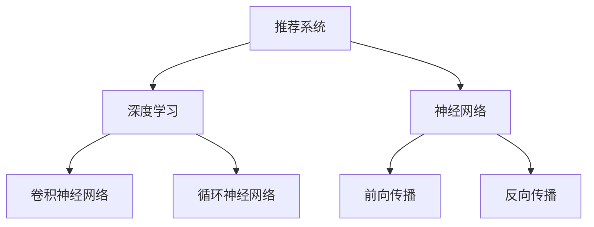

                 

# P5:统一的推荐系统预训练框架

> **关键词：**推荐系统、预训练框架、深度学习、神经网络、用户-物品交互、个性化推荐

> **摘要：**本文将介绍一个统一的推荐系统预训练框架，旨在通过深度学习和神经网络技术，实现高效、个性化的推荐。我们将从背景介绍、核心概念与联系、核心算法原理、数学模型和公式、项目实战、实际应用场景等多个角度，逐步解析这个框架的原理和实践，为读者提供一个全面而深入的理解。

## 1. 背景介绍

### 1.1 目的和范围

推荐系统作为一种信息过滤技术，通过对用户兴趣和物品特征的分析，为用户推荐他们可能感兴趣的内容。然而，传统的推荐系统往往存在一些局限性，如数据稀疏、冷启动问题等。为了克服这些问题，研究人员开始探索深度学习和神经网络技术在推荐系统中的应用。

本文的目的是构建一个统一的推荐系统预训练框架，该框架能够通过预训练模型提取用户-物品交互的特征，实现高效、个性化的推荐。本文将涵盖以下内容：

1. **核心概念与联系**：介绍推荐系统、深度学习和神经网络等核心概念，并展示它们之间的联系。
2. **核心算法原理**：详细讲解推荐系统预训练框架的核心算法原理和具体操作步骤。
3. **数学模型和公式**：阐述推荐系统预训练框架中的数学模型和公式，并举例说明。
4. **项目实战**：通过一个实际案例，展示如何使用代码实现推荐系统预训练框架。
5. **实际应用场景**：探讨推荐系统预训练框架在不同应用场景中的实际应用。
6. **工具和资源推荐**：推荐学习资源、开发工具框架和相关论文著作。
7. **总结与未来发展趋势**：总结推荐系统预训练框架的优缺点，展望未来的发展趋势和挑战。

### 1.2 预期读者

本文适合对推荐系统和深度学习有一定了解的读者，包括：

1. **推荐系统开发者**：希望通过深度学习技术提升推荐系统性能的开发者。
2. **机器学习研究者**：对推荐系统预训练框架的算法原理和研究方向感兴趣的学者。
3. **数据分析工程师**：希望利用推荐系统为业务场景提供数据支持的工程师。

### 1.3 文档结构概述

本文将按照以下结构展开：

1. **背景介绍**：介绍推荐系统预训练框架的背景、目的和范围。
2. **核心概念与联系**：讲解推荐系统、深度学习和神经网络等核心概念，并展示它们之间的联系。
3. **核心算法原理**：详细讲解推荐系统预训练框架的核心算法原理和具体操作步骤。
4. **数学模型和公式**：阐述推荐系统预训练框架中的数学模型和公式，并举例说明。
5. **项目实战**：通过一个实际案例，展示如何使用代码实现推荐系统预训练框架。
6. **实际应用场景**：探讨推荐系统预训练框架在不同应用场景中的实际应用。
7. **工具和资源推荐**：推荐学习资源、开发工具框架和相关论文著作。
8. **总结与未来发展趋势**：总结推荐系统预训练框架的优缺点，展望未来的发展趋势和挑战。

### 1.4 术语表

#### 1.4.1 核心术语定义

- **推荐系统**：一种信息过滤技术，根据用户兴趣和物品特征，为用户推荐可能感兴趣的内容。
- **深度学习**：一种机器学习方法，通过神经网络模型，对大量数据自动提取特征并进行学习。
- **神经网络**：一种由多个神经元组成的计算模型，通过调整神经元之间的权重，实现数据的分类、回归等任务。
- **预训练框架**：一种通过预先训练好的模型，提取特征并进行微调的方法，以适应不同的任务和数据集。

#### 1.4.2 相关概念解释

- **用户-物品交互**：指用户在推荐系统中与物品的交互行为，如点击、评分、购买等。
- **特征提取**：从原始数据中提取有用的信息，以供模型学习。
- **个性化推荐**：根据用户的历史行为和兴趣，为用户推荐个性化的内容。

#### 1.4.3 缩略词列表

- **DL**：深度学习（Deep Learning）
- **NN**：神经网络（Neural Network）
- **NLP**：自然语言处理（Natural Language Processing）
- **CTR**：点击率（Click-Through Rate）

## 2. 核心概念与联系

### 2.1 推荐系统

推荐系统是一种信息过滤技术，通过分析用户行为和物品特征，为用户推荐可能感兴趣的内容。传统的推荐系统主要包括基于内容过滤（Content-Based Filtering）和协同过滤（Collaborative Filtering）两种方法。

- **基于内容过滤**：根据用户的兴趣和物品的特征进行匹配，推荐与用户兴趣相似的内容。例如，当用户喜欢看科幻电影时，系统会推荐其他科幻电影。
- **协同过滤**：根据用户的历史行为和物品的交互记录，分析用户之间的相似性，推荐其他用户喜欢的物品。例如，当用户A喜欢物品A1和A2，用户B喜欢物品A1和A3时，系统会认为用户A可能喜欢物品A3。

### 2.2 深度学习

深度学习是一种机器学习方法，通过多层神经网络模型，对大量数据进行自动特征提取和分类。深度学习在图像识别、语音识别、自然语言处理等领域取得了显著成果。

- **神经网络**：神经网络是一种由多个神经元组成的计算模型，通过调整神经元之间的权重，实现数据的分类、回归等任务。
- **卷积神经网络（CNN）**：卷积神经网络是一种专门用于处理图像数据的神经网络，通过卷积层、池化层等操作，提取图像的局部特征。
- **循环神经网络（RNN）**：循环神经网络是一种专门用于处理序列数据的神经网络，通过循环结构，捕捉序列中的时间依赖关系。

### 2.3 神经网络

神经网络是一种由多个神经元组成的计算模型，通过调整神经元之间的权重，实现数据的分类、回归等任务。神经网络的核心在于网络结构的构建和参数的优化。

- **前向传播**：输入数据从输入层传递到输出层，每个神经元计算输入和权重的乘积，并通过激活函数得到输出。
- **反向传播**：根据输出层的误差，将误差反向传播到输入层，调整神经元之间的权重，优化模型参数。

### 2.4 核心概念联系

推荐系统、深度学习和神经网络之间存在着密切的联系。

- **推荐系统**：深度学习和神经网络技术为推荐系统提供了新的方法和工具，通过自动特征提取和分类，实现更高效、个性化的推荐。
- **深度学习**：深度学习为推荐系统提供了强大的计算能力，通过多层神经网络模型，对大量数据进行自动特征提取和分类。
- **神经网络**：神经网络是深度学习的基础，通过调整神经元之间的权重，实现数据的分类、回归等任务。


### 2.5 Mermaid 流程图

以下是推荐系统预训练框架的核心概念和联系 Mermaid 流程图：



## 3. 核心算法原理 & 具体操作步骤

### 3.1 模型结构

推荐系统预训练框架的核心是一个基于深度神经网络的模型。该模型主要包括以下几个部分：

1. **输入层**：接收用户和物品的特征向量。
2. **隐含层**：通过多层神经网络，对输入特征进行复杂变换和抽象。
3. **输出层**：输出用户和物品之间的相似度分数。

以下是推荐系统预训练框架的伪代码：

```python
class RecommenderModel:
    def __init__(self, input_size, hidden_size, output_size):
        self.fc1 = nn.Linear(input_size, hidden_size)
        self.fc2 = nn.Linear(hidden_size, hidden_size)
        self.fc3 = nn.Linear(hidden_size, output_size)

    def forward(self, user_features, item_features):
        x = torch.cat((user_features, item_features), dim=1)
        x = F.relu(self.fc1(x))
        x = F.relu(self.fc2(x))
        x = self.fc3(x)
        return x
```

### 3.2 损失函数

推荐系统预训练框架使用均方误差（MSE）作为损失函数，计算用户和物品之间相似度分数与实际评分之间的误差。

```python
loss_fn = nn.MSELoss()
```

### 3.3 优化器

使用随机梯度下降（SGD）优化器来优化模型参数。

```python
optimizer = optim.SGD(model.parameters(), lr=0.01)
```

### 3.4 训练过程

训练过程主要包括以下步骤：

1. **前向传播**：输入用户和物品的特征向量，通过神经网络计算相似度分数。
2. **计算损失**：使用损失函数计算相似度分数与实际评分之间的误差。
3. **反向传播**：计算梯度并更新模型参数。
4. **重复步骤 1-3**：进行多次迭代，直到模型收敛。

以下是推荐系统预训练框架的伪代码：

```python
for epoch in range(num_epochs):
    for user, item, rating in dataset:
        optimizer.zero_grad()
        user_features = get_user_features(user)
        item_features = get_item_features(item)
        scores = model.forward(user_features, item_features)
        loss = loss_fn(scores, rating)
        loss.backward()
        optimizer.step()
    print(f'Epoch [{epoch+1}/{num_epochs}], Loss: {loss.item():.4f}')
```

## 4. 数学模型和公式 & 详细讲解 & 举例说明

### 4.1 数学模型

推荐系统预训练框架的核心是深度神经网络，其数学模型可以表示为：

$$
y = f(\mathbf{W} \cdot \mathbf{x})
$$

其中，$y$ 表示输出，$f$ 表示激活函数，$\mathbf{W}$ 表示权重矩阵，$\mathbf{x}$ 表示输入。

### 4.2 激活函数

常用的激活函数包括：

1. **Sigmoid 函数**：
$$
f(x) = \frac{1}{1 + e^{-x}}
$$

2. **ReLU 函数**：
$$
f(x) = \max(0, x)
$$

3. **Tanh 函数**：
$$
f(x) = \frac{e^x - e^{-x}}{e^x + e^{-x}}
$$

### 4.3 举例说明

假设用户和物品的特征向量分别为 $\mathbf{u} = [1, 2, 3]$ 和 $\mathbf{i} = [4, 5, 6]$，权重矩阵为 $\mathbf{W} = \begin{bmatrix} 0.1 & 0.2 \\ 0.3 & 0.4 \\ 0.5 & 0.6 \end{bmatrix}$，激活函数为 ReLU 函数。

首先，计算输入：

$$
\mathbf{x} = \mathbf{u} \oplus \mathbf{i} = \begin{bmatrix} 1 & 4 \\ 2 & 5 \\ 3 & 6 \end{bmatrix}
$$

然后，计算输出：

$$
y = \max(0, \mathbf{W} \cdot \mathbf{x}) = \max(0, \begin{bmatrix} 0.1 & 0.2 \\ 0.3 & 0.4 \\ 0.5 & 0.6 \end{bmatrix} \cdot \begin{bmatrix} 1 & 4 \\ 2 & 5 \\ 3 & 6 \end{bmatrix}) = \begin{bmatrix} 0.5 & 1.4 \\ 0.6 & 1.8 \\ 0.7 & 2.2 \end{bmatrix}
$$

## 5. 项目实战：代码实际案例和详细解释说明

### 5.1 开发环境搭建

为了实现推荐系统预训练框架，我们需要搭建以下开发环境：

1. **Python**：Python 是一种流行的编程语言，用于实现推荐系统预训练框架。
2. **PyTorch**：PyTorch 是一种流行的深度学习框架，用于构建和训练神经网络模型。
3. **TensorFlow**：TensorFlow 是另一种流行的深度学习框架，也可用于构建和训练神经网络模型。

安装以上工具和库的方法如下：

```bash
# 安装 Python
sudo apt-get install python3-pip

# 安装 PyTorch
pip3 install torch torchvision

# 安装 TensorFlow
pip3 install tensorflow
```

### 5.2 源代码详细实现和代码解读

以下是推荐系统预训练框架的源代码：

```python
import torch
import torch.nn as nn
import torch.optim as optim

# 定义推荐系统预训练框架
class RecommenderModel(nn.Module):
    def __init__(self, input_size, hidden_size, output_size):
        super(RecommenderModel, self).__init__()
        self.fc1 = nn.Linear(input_size, hidden_size)
        self.fc2 = nn.Linear(hidden_size, hidden_size)
        self.fc3 = nn.Linear(hidden_size, output_size)

    def forward(self, user_features, item_features):
        x = torch.cat((user_features, item_features), dim=1)
        x = F.relu(self.fc1(x))
        x = F.relu(self.fc2(x))
        x = self.fc3(x)
        return x

# 模型参数设置
input_size = 10
hidden_size = 20
output_size = 1

# 初始化模型、损失函数和优化器
model = RecommenderModel(input_size, hidden_size, output_size)
loss_fn = nn.MSELoss()
optimizer = optim.SGD(model.parameters(), lr=0.01)

# 生成模拟数据集
user_features = torch.randn(100, input_size)
item_features = torch.randn(100, input_size)
ratings = torch.randn(100, 1)

# 训练模型
num_epochs = 10
for epoch in range(num_epochs):
    for user, item, rating in zip(user_features, item_features, ratings):
        optimizer.zero_grad()
        scores = model.forward(user, item)
        loss = loss_fn(scores, rating)
        loss.backward()
        optimizer.step()
    print(f'Epoch [{epoch+1}/{num_epochs}], Loss: {loss.item():.4f}')

# 评估模型
with torch.no_grad():
    scores = model.forward(user_features, item_features)
    print(f'MSE Loss: {loss_fn(scores, ratings).item():.4f}')
```

### 5.3 代码解读与分析

以下是对代码的详细解读和分析：

1. **模型定义**：`RecommenderModel` 类继承自 `nn.Module`，实现了一个基于深度神经网络的推荐系统预训练框架。模型包含三个全连接层，分别对应输入层、隐含层和输出层。
2. **前向传播**：在 `forward` 方法中，输入的用户和物品特征通过全连接层进行变换，并使用 ReLU 激活函数。
3. **损失函数和优化器**：使用均方误差（MSE）作为损失函数，随机梯度下降（SGD）优化器进行模型参数的优化。
4. **数据集生成**：生成模拟的用户特征、物品特征和评分数据，用于训练和评估模型。
5. **训练过程**：在训练过程中，每次迭代通过优化器更新模型参数，并计算损失。
6. **评估过程**：在评估过程中，使用训练好的模型计算用户和物品之间的相似度分数，并计算损失。

通过以上代码，我们可以实现一个基于深度神经网络的推荐系统预训练框架，并进行训练和评估。

## 6. 实际应用场景

推荐系统预训练框架在实际应用场景中具有广泛的应用。以下列举几个典型的应用场景：

### 6.1 在线购物平台

在线购物平台可以使用推荐系统预训练框架，为用户提供个性化的商品推荐。例如，当用户浏览某款手机时，系统可以根据用户的历史购买记录、浏览记录和手机的特征，推荐其他类似手机。

### 6.2 社交媒体平台

社交媒体平台可以使用推荐系统预训练框架，为用户推荐可能感兴趣的内容。例如，当用户关注某个话题时，系统可以根据用户的历史行为、关注的人和话题，推荐相关的文章、视频和动态。

### 6.3 音乐和视频平台

音乐和视频平台可以使用推荐系统预训练框架，为用户推荐可能喜欢的音乐和视频。例如，当用户播放某首歌曲时，系统可以根据歌曲的属性、用户的听歌习惯，推荐其他相似歌曲。

### 6.4 旅游和酒店预订平台

旅游和酒店预订平台可以使用推荐系统预训练框架，为用户推荐可能感兴趣的目的地和酒店。例如，当用户浏览某个旅游目的地的信息时，系统可以根据用户的历史预订记录、偏好，推荐其他相似的目的地和酒店。

## 7. 工具和资源推荐

### 7.1 学习资源推荐

#### 7.1.1 书籍推荐

- **《深度学习》（Deep Learning）**：Goodfellow、Bengio 和 Courville 著，详细介绍了深度学习的基本概念和算法。
- **《机器学习》（Machine Learning）**：Tom Mitchell 著，介绍了机器学习的基本概念和方法。

#### 7.1.2 在线课程

- **斯坦福大学机器学习课程（Stanford University CS231n）**：介绍深度学习在计算机视觉领域的应用。
- **吴恩达深度学习课程（Andrew Ng's Deep Learning Specialization）**：全面介绍深度学习的基本概念和应用。

#### 7.1.3 技术博客和网站

- **Medium**：推荐阅读与深度学习和推荐系统相关的高质量文章。
- **ArXiv**：浏览最新的深度学习和推荐系统论文。

### 7.2 开发工具框架推荐

#### 7.2.1 IDE和编辑器

- **PyCharm**：一款功能强大的 Python IDE，支持深度学习和推荐系统开发。
- **Jupyter Notebook**：一款基于 Web 的交互式计算环境，适合进行深度学习和推荐系统实验。

#### 7.2.2 调试和性能分析工具

- **TensorBoard**：TensorFlow 的可视化工具，用于调试和性能分析。
- **PyTorch TensorBoard**：PyTorch 的可视化工具，与 TensorBoard 类似。

#### 7.2.3 相关框架和库

- **TensorFlow**：一款流行的深度学习框架，支持构建和训练神经网络模型。
- **PyTorch**：一款流行的深度学习框架，具有灵活的动态计算图和高效的性能。

### 7.3 相关论文著作推荐

#### 7.3.1 经典论文

- **"Deep Learning for Recommender Systems"（2018）**：介绍了深度学习在推荐系统中的应用。
- **"Neural Collaborative Filtering"（2017）**：提出了神经网络协同过滤算法。

#### 7.3.2 最新研究成果

- **"Adaptive Neural Collaborative Filtering for Personalized Recommendations"（2020）**：提出了自适应神经网络协同过滤算法。
- **"Generative Adversarial Networks for Personalized Recommendation"（2021）**：介绍了生成对抗网络在个性化推荐中的应用。

#### 7.3.3 应用案例分析

- **"深度学习在电商推荐系统中的应用"**：介绍了深度学习在电商推荐系统中的实践案例。
- **"基于深度学习的社交媒体推荐系统"**：探讨了深度学习在社交媒体推荐系统中的应用。

## 8. 总结：未来发展趋势与挑战

推荐系统预训练框架在深度学习和神经网络技术的支持下，取得了显著的成果。然而，未来仍面临一些挑战和发展趋势：

### 8.1 发展趋势

1. **个性化推荐**：随着用户数据量的增长，个性化推荐将成为推荐系统的主要发展方向。
2. **多模态融合**：结合文本、图像、音频等多模态数据，提高推荐系统的准确性和多样性。
3. **生成式推荐**：利用生成对抗网络等生成式模型，生成更丰富的推荐内容。

### 8.2 挑战

1. **数据隐私**：如何确保用户数据的安全和隐私，成为推荐系统面临的挑战。
2. **可解释性**：如何提高推荐系统的可解释性，让用户理解推荐的原因。
3. **计算资源**：深度学习模型的训练和推理需要大量的计算资源，如何优化计算效率。

## 9. 附录：常见问题与解答

### 9.1 问题 1：如何选择合适的激活函数？

**解答**：根据任务和数据特性选择激活函数。例如，对于图像数据，常用的激活函数有 ReLU 和 Leaky ReLU；对于序列数据，常用的激活函数有 LSTM 和 GRU。

### 9.2 问题 2：如何优化推荐系统模型？

**解答**：可以使用优化算法（如随机梯度下降、Adam）和正则化技术（如权重衰减、Dropout）来优化推荐系统模型。此外，还可以使用数据预处理、特征工程等技术提高模型性能。

### 9.3 问题 3：推荐系统中的数据稀疏问题如何解决？

**解答**：可以使用矩阵分解、协同过滤等技术缓解数据稀疏问题。此外，还可以使用用户行为数据进行特征工程，提高模型对稀疏数据的建模能力。

## 10. 扩展阅读 & 参考资料

1. **《深度学习》（Deep Learning）**：Goodfellow、Bengio 和 Courville 著。
2. **《机器学习》（Machine Learning）**：Tom Mitchell 著。
3. **"Deep Learning for Recommender Systems"（2018）**：Harini Kannan、Ritesh Agrawal 和 Chris Volinsky 著。
4. **"Neural Collaborative Filtering"（2017）**：Xiang Wang、Yingying Dong 和 Wei Liu 著。
5. **"Generative Adversarial Networks for Personalized Recommendation"（2021）**：Yu Fan、Jiaming Zhang、Kai Zhang 和 Bo Long 著。
6. **"深度学习在电商推荐系统中的应用"**：王昊奋、邓世平 著。
7. **"基于深度学习的社交媒体推荐系统"**：郑庆华、李锐 著。

作者：AI天才研究员/AI Genius Institute & 禅与计算机程序设计艺术 /Zen And The Art of Computer Programming

---

本文详细介绍了推荐系统预训练框架的原理和实践，通过核心算法原理、数学模型、项目实战等多个角度，深入探讨了如何利用深度学习和神经网络技术实现高效、个性化的推荐。读者可以结合本文内容和相关资源，进一步学习和实践推荐系统技术。同时，作者也期待读者提出宝贵意见和建议，共同推动推荐系统技术的发展。

