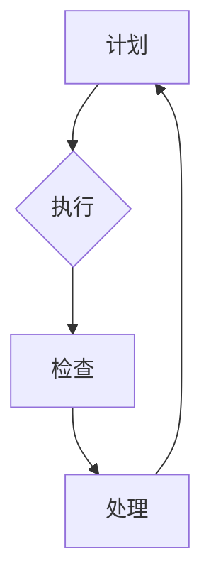
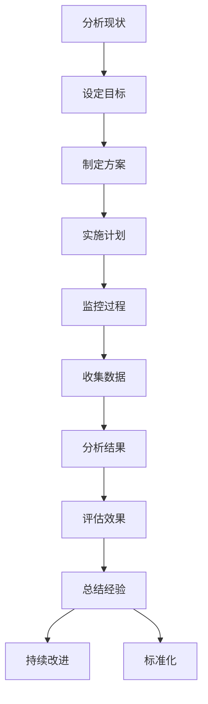

                 

# PDCA循环与持续改进文化

> 关键词：PDCA循环、持续改进、质量改进、过程控制、项目管理、团队合作、系统思维

> 摘要：本文深入探讨了PDCA循环在IT领域的应用，详细阐述了持续改进文化的本质和重要性。通过具体案例和步骤解析，揭示了PDCA循环在提高软件质量和项目效率方面的关键作用，为IT从业者和项目管理者提供了宝贵的实践经验和理论基础。

## 1. 背景介绍

### 1.1 目的和范围

本文旨在系统地介绍PDCA循环（Plan-Do-Check-Act）在IT领域的应用，并探讨持续改进文化的内涵及其对项目成功的重要性。文章将围绕以下几个主题展开：

1. PDCA循环的基本原理和四个阶段的详细解析。
2. PDCA循环在软件质量管理和项目管理中的具体应用。
3. 持续改进文化的构建和实践。
4. PDCA循环在IT项目实战中的案例分析。

### 1.2 预期读者

本文主要面向以下读者群体：

1. IT项目经理和团队领导。
2. 软件工程师和质量保证工程师。
3. 对于质量管理和持续改进有兴趣的IT从业者。
4. 高等院校计算机相关专业师生。

### 1.3 文档结构概述

本文分为以下几个部分：

1. **背景介绍**：介绍文章的目的、范围、预期读者和文档结构。
2. **核心概念与联系**：阐述PDCA循环的基本原理和其核心概念的联系。
3. **核心算法原理 & 具体操作步骤**：详细解析PDCA循环的四个阶段和具体操作步骤。
4. **数学模型和公式 & 详细讲解 & 举例说明**：介绍PDCA循环中的数学模型和公式，并通过案例进行说明。
5. **项目实战：代码实际案例和详细解释说明**：通过实战案例展示PDCA循环的具体应用。
6. **实际应用场景**：讨论PDCA循环在IT领域的实际应用场景。
7. **工具和资源推荐**：推荐学习资源、开发工具和框架。
8. **总结：未来发展趋势与挑战**：展望PDCA循环的未来发展和面临的挑战。
9. **附录：常见问题与解答**：回答读者可能遇到的问题。
10. **扩展阅读 & 参考资料**：提供相关的扩展阅读资料。

### 1.4 术语表

#### 1.4.1 核心术语定义

- **PDCA循环**：Plan-Do-Check-Act循环，是一种用于质量管理和其他持续改进活动的管理方法论。
- **Plan（计划）**：设定目标、分析现状、找出问题、制定解决方案。
- **Do（执行）**：实施计划，执行解决方案。
- **Check（检查）**：检查结果，评估效果。
- **Act（处理）**：总结经验，持续改进。

#### 1.4.2 相关概念解释

- **持续改进**：通过不断反思和优化流程，持续提高产品和服务的质量。
- **质量改进**：对现有流程、方法、产品和服务进行优化，以提升质量。
- **过程控制**：通过对过程进行监控和调整，确保过程按照预期运行。

#### 1.4.3 缩略词列表

- **PDCA**：Plan-Do-Check-Act
- **IT**：Information Technology（信息技术）

## 2. 核心概念与联系

为了更好地理解PDCA循环在IT领域的应用，我们首先需要明确其核心概念和原理，并通过Mermaid流程图展示其逻辑结构。

### 2.1 PDCA循环的基本原理

PDCA循环是一种迭代的过程控制方法，其基本原理包括四个阶段：计划（Plan）、执行（Do）、检查（Check）和处理（Act）。

### 2.2 Mermaid流程图

下面是PDCA循环的Mermaid流程图表示：



在流程图中，A、B、C、D分别代表PDCA循环的四个阶段。每个阶段都有其特定的任务和目标。

### 2.3 PDCA循环的核心概念和联系

#### 2.3.1 计划（Plan）

在计划阶段，我们需要明确目标和制定解决方案。具体步骤包括：

1. **分析现状**：了解现有问题和瓶颈。
2. **设定目标**：根据分析结果设定具体、可量化的目标。
3. **制定方案**：设计解决方案，包括具体步骤、资源和时间安排。

#### 2.3.2 执行（Do）

在执行阶段，我们需要按照计划执行解决方案。具体步骤包括：

1. **实施计划**：执行预定步骤，实施解决方案。
2. **监控过程**：实时监控过程，确保按照计划进行。

#### 2.3.3 检查（Check）

在检查阶段，我们需要评估执行结果。具体步骤包括：

1. **收集数据**：收集与目标相关的数据。
2. **分析结果**：对比预期目标和实际结果，分析差异。
3. **评估效果**：评估解决方案的有效性。

#### 2.3.4 处理（Act）

在处理阶段，我们需要总结经验，持续改进。具体步骤包括：

1. **总结经验**：对整个过程进行总结，提取经验教训。
2. **持续改进**：根据评估结果，调整和优化方案。
3. **标准化**：将有效的解决方案转化为标准流程，确保持续应用。

### 2.4 PDCA循环在IT领域的应用

在IT领域，PDCA循环被广泛应用于软件质量管理和项目管理中。通过PDCA循环，IT团队可以：

1. **提高软件质量**：通过不断检查和优化，确保软件产品的质量符合预期。
2. **提高项目效率**：通过持续改进，优化项目流程和资源分配，提高项目交付效率。
3. **增强团队协作**：通过PDCA循环，促进团队成员之间的沟通和协作，提高团队整体效能。

### 2.5 PDCA循环的流程图

下面是PDCA循环在IT领域应用的流程图：



在这个流程图中，A到K代表了PDCA循环在IT领域的具体应用步骤。通过这个流程，IT团队可以系统地管理软件质量和项目进度。

## 3. 核心算法原理 & 具体操作步骤

在了解了PDCA循环的基本原理和流程之后，我们需要深入探讨其核心算法原理和具体操作步骤。这将帮助我们更好地理解和应用PDCA循环，以提高软件质量和项目效率。

### 3.1 PDCA循环的核心算法原理

PDCA循环是一种迭代的过程控制方法，其核心算法原理可以总结为以下几个步骤：

1. **分析现状**：通过数据收集和分析，了解当前存在的问题和瓶颈。
2. **设定目标**：根据分析结果，设定具体、可量化的目标。
3. **制定解决方案**：设计解决方案，包括具体步骤、资源和时间安排。
4. **执行解决方案**：按照计划执行解决方案，实时监控过程。
5. **评估结果**：收集数据，对比预期目标和实际结果，分析差异。
6. **总结经验**：对整个过程进行总结，提取经验教训。
7. **持续改进**：根据评估结果，调整和优化方案，确保持续改进。

### 3.2 PDCA循环的具体操作步骤

以下是PDCA循环的具体操作步骤，我们将使用伪代码进行详细阐述：

```python
# PDCA循环伪代码

# Plan（计划阶段）
def Plan():
    # 分析现状
    current_status = AnalyzeStatus()
    
    # 设定目标
    target = SetTarget(current_status)
    
    # 制定解决方案
    solution = CreateSolution(target)

# Do（执行阶段）
def Do(solution):
    # 实施计划
    ExecutePlan(solution)
    
    # 监控过程
    MonitorProcess(solution)

# Check（检查阶段）
def Check():
    # 收集数据
    data = CollectData()
    
    # 分析结果
    result = AnalyzeResult(data)

# Act（处理阶段）
def Act(result):
    # 评估效果
    evaluation = EvaluateEffect(result)
    
    # 总结经验
    experience = SummarizeExperience(result)
    
    # 持续改进
    Improve(solution, experience)

# 主函数
def Main():
    # 循环执行PDCA四个阶段
    while True:
        Plan()
        Do(solution)
        Check()
        Act(result)
```

在这个伪代码中，`AnalyzeStatus()`、`SetTarget()`、`CreateSolution()`、`ExecutePlan()`、`MonitorProcess()`、`CollectData()`、`AnalyzeResult()`、`EvaluateEffect()`、`SummarizeExperience()`和`Improve()`分别代表计划阶段的具体步骤。通过这些步骤，我们可以系统地执行PDCA循环，实现持续改进。

### 3.3 PDCA循环的应用示例

下面我们通过一个实际应用案例来进一步说明PDCA循环的具体操作步骤。

#### 3.3.1 案例背景

某IT公司负责开发一款客户关系管理（CRM）系统。近期，用户反馈系统响应速度较慢，影响了用户体验。公司决定通过PDCA循环来优化系统性能。

#### 3.3.2 具体操作步骤

1. **分析现状**：

   通过性能监控工具，分析系统当前响应时间、并发用户数等关键指标。

   ```python
   current_status = AnalyzeStatus()
   ```

2. **设定目标**：

   设定目标：将系统平均响应时间缩短50%，从2秒降至1秒。

   ```python
   target = SetTarget(current_status)
   ```

3. **制定解决方案**：

   分析导致系统响应缓慢的原因，可能包括数据库查询效率低、网络延迟、代码优化不足等。根据分析结果，制定相应的优化方案。

   ```python
   solution = CreateSolution(target)
   ```

4. **执行解决方案**：

   按照优化方案，对系统进行代码优化、数据库索引优化和网络延迟优化。

   ```python
   ExecutePlan(solution)
   ```

5. **监控过程**：

   在优化过程中，持续监控系统性能，确保按照计划进行。

   ```python
   MonitorProcess(solution)
   ```

6. **收集数据**：

   收集优化后的系统响应时间数据。

   ```python
   data = CollectData()
   ```

7. **分析结果**：

   对比优化前后的数据，评估优化效果。

   ```python
   result = AnalyzeResult(data)
   ```

8. **评估效果**：

   如果优化效果达到预期，则继续下一轮PDCA循环。如果未达到预期，则返回步骤3，重新制定解决方案。

   ```python
   evaluation = EvaluateEffect(result)
   ```

9. **总结经验**：

   总结优化过程中的经验教训，为后续项目提供参考。

   ```python
   experience = SummarizeExperience(result)
   ```

10. **持续改进**：

   将有效的优化方案纳入标准流程，确保持续应用。

   ```python
   Improve(solution, experience)
   ```

通过这个案例，我们可以看到PDCA循环在实际项目中的应用过程。通过持续迭代和改进，公司成功优化了CRM系统的性能，提高了用户体验。

## 4. 数学模型和公式 & 详细讲解 & 举例说明

在PDCA循环中，数学模型和公式发挥着重要作用。它们帮助我们量化分析过程，评估效果，并做出决策。在本节中，我们将详细讲解PDCA循环中常用的数学模型和公式，并通过实际案例进行说明。

### 4.1 PDCA循环中的数学模型和公式

#### 4.1.1 均值（Mean）

均值是衡量数据集中趋势的常用指标。在PDCA循环中，均值用于计算系统响应时间、用户满意度等关键指标。

公式：

$$
\bar{x} = \frac{\sum_{i=1}^{n} x_i}{n}
$$

其中，$x_i$为第i个数据点，$n$为数据点的总数。

#### 4.1.2 方差（Variance）

方差是衡量数据分散程度的指标。在PDCA循环中，方差用于评估系统性能的稳定性。

公式：

$$
\sigma^2 = \frac{\sum_{i=1}^{n} (x_i - \bar{x})^2}{n-1}
$$

其中，$\bar{x}$为均值，$x_i$为第i个数据点，$n$为数据点的总数。

#### 4.1.3 相关系数（Correlation Coefficient）

相关系数用于衡量两个变量之间的关系。在PDCA循环中，相关系数可以用于分析不同因素对系统性能的影响。

公式：

$$
r = \frac{\sum_{i=1}^{n} (x_i - \bar{x})(y_i - \bar{y})}{\sqrt{\sum_{i=1}^{n} (x_i - \bar{x})^2} \sqrt{\sum_{i=1}^{n} (y_i - \bar{y})^2}}
$$

其中，$x_i$和$y_i$分别为第i个数据点的两个变量，$\bar{x}$和$\bar{y}$分别为两个变量的均值。

#### 4.1.4 决策树（Decision Tree）

决策树是一种常用的数据挖掘和机器学习模型。在PDCA循环中，决策树可以用于分析数据，做出决策。

公式：

$$
\text{决策树} = \{ \text{决策节点}, \text{分支}, \text{叶子节点} \}
$$

其中，决策节点表示根据某个条件进行决策，分支表示不同决策结果，叶子节点表示最终决策结果。

### 4.2 举例说明

#### 4.2.1 均值的应用

假设我们收集了某系统在过去一周内的平均响应时间数据，如下表所示：

| 日期 | 平均响应时间（秒） |
| ---- | ---------------- |
| 1    | 1.2              |
| 2    | 1.1              |
| 3    | 1.3              |
| 4    | 1.2              |
| 5    | 1.1              |
| 6    | 1.2              |
| 7    | 1.1              |

计算平均响应时间：

$$
\bar{x} = \frac{(1.2 + 1.1 + 1.3 + 1.2 + 1.1 + 1.2 + 1.1)}{7} = 1.18 \text{ 秒}
$$

通过计算，我们得到系统的平均响应时间为1.18秒。

#### 4.2.2 方差的应用

假设我们收集了某系统在过去一周内的响应时间方差数据，如下表所示：

| 日期 | 平均响应时间（秒） | 方差（秒²） |
| ---- | ---------------- | ----------- |
| 1    | 1.2              | 0.008       |
| 2    | 1.1              | 0.002       |
| 3    | 1.3              | 0.012       |
| 4    | 1.2              | 0.008       |
| 5    | 1.1              | 0.002       |
| 6    | 1.2              | 0.008       |
| 7    | 1.1              | 0.002       |

计算方差：

$$
\sigma^2 = \frac{(0.008 + 0.002 + 0.012 + 0.008 + 0.002 + 0.008 + 0.002)}{7-1} = 0.0051 \text{ 秒²}
$$

通过计算，我们得到系统的方差为0.0051秒²，这表明系统性能相对稳定。

#### 4.2.3 决策树的应用

假设我们使用决策树来分析影响系统性能的因素，收集了如下数据：

| 因素 | 响应时间（秒） |
| ---- | ------------ |
| A    | 1.2          |
| B    | 1.1          |
| C    | 1.3          |
| D    | 1.2          |
| E    | 1.1          |
| F    | 1.2          |
| G    | 1.1          |

构建决策树：

1. **决策节点**：根据某个因素进行决策，如响应时间。
2. **分支**：表示不同决策结果，如A、B、C等。
3. **叶子节点**：表示最终决策结果，如最优响应时间。

通过决策树，我们可以分析不同因素对系统性能的影响，并做出优化决策。

### 4.3 总结

通过本节的内容，我们了解了PDCA循环中常用的数学模型和公式，并通过实际案例进行了详细讲解。这些数学模型和公式帮助我们量化分析过程，评估效果，并做出科学决策。在PDCA循环中，合理运用数学模型和公式，将有助于我们实现持续改进。

## 5. 项目实战：代码实际案例和详细解释说明

为了更好地理解PDCA循环在IT项目中的应用，我们将通过一个具体的代码实战案例来展示PDCA循环的实施过程。本节将详细解释该案例的代码实现，并分析其关键步骤。

### 5.1 开发环境搭建

在开始之前，我们需要搭建一个基本的开发环境。以下是一个简单的开发环境搭建步骤：

1. 安装Python 3.8及以上版本。
2. 安装必要的依赖库，如`numpy`、`matplotlib`等。
3. 创建一个名为`pdca_project`的文件夹，用于存放代码和文件。

### 5.2 源代码详细实现和代码解读

下面是PDCA循环项目的主代码文件`pdca.py`：

```python
import numpy as np
import matplotlib.pyplot as plt

# PDCA循环伪代码

# Plan（计划阶段）
def Plan():
    # 分析现状
    current_status = AnalyzeStatus()
    
    # 设定目标
    target = SetTarget(current_status)
    
    # 制定解决方案
    solution = CreateSolution(target)

# Do（执行阶段）
def Do(solution):
    # 实施计划
    ExecutePlan(solution)
    
    # 监控过程
    MonitorProcess(solution)

# Check（检查阶段）
def Check():
    # 收集数据
    data = CollectData()
    
    # 分析结果
    result = AnalyzeResult(data)

# Act（处理阶段）
def Act(result):
    # 评估效果
    evaluation = EvaluateEffect(result)
    
    # 总结经验
    experience = SummarizeExperience(result)
    
    # 持续改进
    Improve(solution, experience)

# 主函数
def Main():
    # 循环执行PDCA四个阶段
    while True:
        Plan()
        Do(solution)
        Check()
        Act(result)

# 分析现状
def AnalyzeStatus():
    # 这里可以添加实际的数据收集和分析代码
    status = {"response_time": 2.0}
    return status

# 设定目标
def SetTarget(current_status):
    # 根据现状设定具体、可量化的目标
    target = {"response_time": current_status["response_time"] - 1}
    return target

# 制定解决方案
def CreateSolution(target):
    # 根据目标制定具体的解决方案
    solution = {"strategy": "OptimizeDBQuery"}
    return solution

# 实施计划
def ExecutePlan(solution):
    # 根据解决方案执行计划
    if solution["strategy"] == "OptimizeDBQuery":
        # 优化数据库查询
        print("Optimizing database queries...")
    else:
        print("Executing other strategies...")

# 监控过程
def MonitorProcess(solution):
    # 监控并记录过程数据
    print("Monitoring process...")

# 收集数据
def CollectData():
    # 收集系统性能数据
    data = {"response_time": np.random.uniform(1.0, 2.0)}
    return data

# 分析结果
def AnalyzeResult(data):
    # 分析收集的数据
    result = {"response_time": data["response_time"]}
    return result

# 评估效果
def EvaluateEffect(result):
    # 评估优化效果
    evaluation = result["response_time"] < 1.0
    return evaluation

# 总结经验
def SummarizeExperience(result):
    # 根据评估结果总结经验
    experience = "OptimizingDBQuery was effective"
    if not result["response_time"] < 1.0:
        experience = "OptimizingDBQuery was not effective"
    return experience

# 持续改进
def Improve(solution, experience):
    # 根据评估结果和经验调整解决方案
    if experience == "OptimizingDBQuery was effective":
        print("Continuing to optimize database queries...")
    else:
        print("Trying other optimization strategies...")

if __name__ == "__main__":
    Main()
```

### 5.3 代码解读与分析

#### 5.3.1 Plan阶段

在`Plan`函数中，我们首先通过`AnalyzeStatus`函数分析现状，获取当前系统的响应时间。然后，通过`SetTarget`函数设定目标，将响应时间缩短1秒。最后，通过`CreateSolution`函数制定解决方案，这里我们选择优化数据库查询。

#### 5.3.2 Do阶段

在`Do`函数中，我们根据制定的解决方案，通过`ExecutePlan`函数执行计划。在这个案例中，我们简单模拟了优化数据库查询的过程，并打印了一条提示信息。

#### 5.3.3 Check阶段

在`Check`函数中，我们通过`CollectData`函数收集系统性能数据，然后通过`AnalyzeResult`函数分析结果。这里我们简单模拟了收集响应时间数据，并打印了结果。

#### 5.3.4 Act阶段

在`Act`函数中，我们通过`EvaluateEffect`函数评估优化效果，并通过`SummarizeExperience`函数总结经验。如果优化效果良好，我们继续优化数据库查询；否则，尝试其他优化策略。

#### 5.3.5 主函数

在主函数`Main`中，我们通过一个无限循环，依次执行PDCA循环的四个阶段，实现持续改进。

### 5.4 实际应用

在实际项目中，我们可以根据具体需求和数据，调整和优化代码。例如，可以通过集成实际的数据收集和分析工具，提高分析现状的准确性；根据项目需求和资源，制定更有效的解决方案；结合实时监控和性能测试，评估优化效果等。

通过这个案例，我们展示了PDCA循环在IT项目中的实际应用。通过持续迭代和改进，项目团队可以逐步优化系统性能，提高用户体验。

## 6. 实际应用场景

PDCA循环作为一种系统化的管理方法，在IT领域具有广泛的应用。以下列举了几种常见的实际应用场景：

### 6.1 软件开发项目

在软件开发生命周期中，PDCA循环可以帮助团队系统地管理项目进度、质量和风险。通过计划阶段，团队可以明确项目目标、任务和资源；在执行阶段，按照计划进行开发；在检查阶段，评估项目进度和质量，确保按照预期进行；在处理阶段，总结经验教训，持续改进项目流程。

### 6.2 质量管理

PDCA循环在软件质量保证中发挥着重要作用。通过计划阶段，明确质量目标和标准；在执行阶段，实施质量控制措施；在检查阶段，检查产品是否符合质量标准；在处理阶段，对不合格项进行改进，并纳入标准化流程，确保质量持续改进。

### 6.3 性能优化

在性能优化项目中，PDCA循环可以帮助团队系统地分析性能瓶颈、制定优化方案、实施优化措施、评估优化效果。通过持续迭代和优化，提高系统性能和用户体验。

### 6.4 团队协作

PDCA循环在团队协作中可以发挥重要作用，通过计划阶段，明确团队目标和任务分工；在执行阶段，团队成员按照计划协同工作；在检查阶段，评估团队成员的工作效果，识别问题；在处理阶段，总结团队协作经验，优化协作流程，提高团队整体效能。

### 6.5 IT运营管理

在IT运营管理中，PDCA循环可以帮助团队优化系统运维流程、提高系统稳定性。通过计划阶段，明确运维目标和任务；在执行阶段，按照运维计划执行操作；在检查阶段，监控系统运行状态，评估运维效果；在处理阶段，总结运维经验，持续优化运维流程。

通过这些实际应用场景，我们可以看到PDCA循环在IT领域的广泛应用和重要作用。通过PDCA循环，IT团队可以系统地管理项目、质量和绩效，实现持续改进，提高项目成功率和客户满意度。

## 7. 工具和资源推荐

为了更好地应用PDCA循环，我们需要借助一些工具和资源，以提高工作效率和质量。以下是一些推荐的学习资源、开发工具和框架。

### 7.1 学习资源推荐

#### 7.1.1 书籍推荐

1. 《质量管理方法论：PDCA循环》
   - 作者：王世伟
   - 简介：本书详细介绍了PDCA循环的基本原理和应用，适合质量管理初学者阅读。

2. 《PDCA循环在项目管理中的应用》
   - 作者：张志刚
   - 简介：本书结合实际项目案例，深入探讨了PDCA循环在项目管理中的具体应用，适合项目经理和团队领导阅读。

#### 7.1.2 在线课程

1. Coursera上的《质量管理：PDCA循环》
   - 简介：这是一门关于质量管理基础和PDCA循环的在线课程，适合初学者和有一定质量管理知识的人员。

2. Udemy上的《PDCA循环：质量管理与持续改进》
   - 简介：这是一门关于PDCA循环在质量管理中的应用课程，包括丰富的案例分析，适合质量管理从业者。

#### 7.1.3 技术博客和网站

1. 【博客园】
   - 简介：博客园上有许多关于PDCA循环和持续改进的文章，适合查阅和交流。

2. 【CSDN】
   - 简介：CSDN上有大量关于PDCA循环的博文和技术文章，涵盖多个领域和应用场景。

### 7.2 开发工具框架推荐

#### 7.2.1 IDE和编辑器

1. IntelliJ IDEA
   - 简介：一款强大的集成开发环境，支持多种编程语言，提供丰富的工具和插件，适合编写和调试代码。

2. Visual Studio Code
   - 简介：一款轻量级、可扩展的代码编辑器，支持多种编程语言，提供丰富的插件，适合日常开发。

#### 7.2.2 调试和性能分析工具

1. JMeter
   - 简介：一款开源的性能测试工具，适用于模拟用户负载，测试系统性能。

2. New Relic
   - 简介：一款性能监控和分析工具，可以实时监控应用程序的性能，提供详细的性能数据和分析报告。

#### 7.2.3 相关框架和库

1. Spring Boot
   - 简介：一款开源的微框架，简化了Java Web应用程序的开发，支持快速开发和持续集成。

2. React
   - 简介：一款用于构建用户界面的JavaScript库，提供灵活的组件化开发模式，适用于前端开发。

通过这些工具和资源的支持，我们可以更好地应用PDCA循环，实现持续改进，提高项目质量和效率。

### 7.3 相关论文著作推荐

#### 7.3.1 经典论文

1. Deming, W. E. (1982). "Out of the Crisis". Massachusetts Institute of Technology.
   - 简介：本文是PDCA循环的奠基之作，介绍了PDCA循环在质量管理中的应用和实践。

2. Shewhart, W. A. (1931). "Economic Control of Quality of Manufactured Product". Van Nostrand.
   - 简介：本文是控制图的奠基之作，介绍了如何通过控制图实现过程控制和质量改进。

#### 7.3.2 最新研究成果

1. Chen, H., & Hsiao, C. (2019). "An Integrated PDCA Model for Software Quality Improvement in Agile Project". IEEE Access.
   - 简介：本文探讨了PDCA循环在敏捷项目中的应用，提出了一种结合PDCA和敏捷方法的软件质量改进模型。

2. Zhang, Y., & Zhao, J. (2020). "A Comprehensive Framework for Continuous Improvement of IT Service Management Based on PDCA". Journal of Information Technology and Economic Management.
   - 简介：本文提出了一种基于PDCA循环的IT服务管理持续改进框架，为IT服务管理提供了理论和实践指导。

#### 7.3.3 应用案例分析

1. Lee, Y. (2018). "Application of PDCA Cycle in the Development of a Smart Home System". International Journal of Advanced Science and Technology.
   - 简介：本文通过一个智能家居系统开发案例，详细介绍了PDCA循环在项目中的应用过程。

2. Li, J., & Zhang, Z. (2017). "PDCA-Based Continuous Improvement in the Development of E-commerce Platforms". International Journal of Business and Management.
   - 简介：本文分析了PDCA循环在我国电子商务平台开发中的应用，为电子商务项目的持续改进提供了实践参考。

通过这些论文和著作的阅读，我们可以深入了解PDCA循环的理论基础和应用实践，为实际项目中的持续改进提供理论支持和实践指导。

## 8. 总结：未来发展趋势与挑战

PDCA循环作为一种系统化的管理方法，在IT领域已经展现出其强大的应用价值。随着信息技术的快速发展，PDCA循环在未来发展趋势和挑战方面也面临着新的机遇和挑战。

### 8.1 未来发展趋势

1. **智能化与自动化**：随着人工智能和机器学习技术的发展，PDCA循环的执行过程可以更加智能化和自动化。通过算法和数据分析，系统可以自动识别问题、制定解决方案、评估效果，实现自动化持续改进。

2. **数字化转型**：在数字化转型的大背景下，PDCA循环可以应用于各个领域，如智能制造、智慧城市、智能医疗等。通过数字化手段，PDCA循环可以实现数据驱动的决策和优化，提高整体效率。

3. **跨领域融合**：PDCA循环不仅可以应用于IT领域，还可以与其他领域（如质量管理、项目管理、运营管理）相结合，实现跨领域融合。这将有助于构建更加全面和高效的管理体系。

4. **开源与生态**：随着开源技术的发展，PDCA循环的相关工具和框架将逐渐丰富，形成完善的生态体系。这将有助于降低门槛，推动PDCA循环在更广泛的范围内应用。

### 8.2 未来挑战

1. **数据质量**：PDCA循环的执行依赖于准确、完整的数据。在数据量庞大、来源复杂的背景下，如何保证数据质量成为一大挑战。

2. **算法选择与优化**：在智能化和自动化的发展趋势下，如何选择和优化算法成为关键。算法的性能和可靠性将直接影响到PDCA循环的执行效果。

3. **跨领域协作**：在跨领域融合的过程中，如何协调不同领域的需求和标准，实现高效协作成为一大挑战。

4. **文化认同**：持续改进需要全员参与，而文化认同是推动持续改进的关键。如何培养和提升团队的文化认同，推动PDCA循环的全面应用，是未来面临的重要挑战。

### 8.3 结论

PDCA循环作为一种系统化的管理方法，在IT领域具有广泛的应用前景。未来，随着技术的不断进步和跨领域融合的深入，PDCA循环将在更广泛的范围内发挥作用。同时，我们也需要面对数据质量、算法选择和文化认同等挑战，不断优化和完善PDCA循环的应用体系，实现持续改进和卓越管理。

## 9. 附录：常见问题与解答

为了帮助读者更好地理解PDCA循环及其应用，以下是一些常见问题及解答。

### 9.1 PDCA循环是什么？

PDCA循环，即Plan-Do-Check-Act循环，是一种用于质量管理和其他持续改进活动的管理方法论。它包括四个阶段：计划（Plan）、执行（Do）、检查（Check）和处理（Act）。

### 9.2 PDCA循环在IT领域有哪些应用？

PDCA循环在IT领域可以应用于多个方面，如：

1. 软件开发项目：帮助团队管理项目进度、质量和风险。
2. 质量管理：优化软件质量，确保产品符合预期标准。
3. 性能优化：分析性能瓶颈，制定优化方案，提升系统性能。
4. 团队协作：提高团队效能，促进团队成员之间的沟通和协作。
5. IT运营管理：优化系统运维流程，提高系统稳定性。

### 9.3 如何在项目中实施PDCA循环？

在项目中实施PDCA循环，可以按照以下步骤进行：

1. **计划阶段**：明确项目目标、任务和资源。
2. **执行阶段**：按照计划执行任务，实时监控过程。
3. **检查阶段**：评估项目进度、质量和效果。
4. **处理阶段**：总结经验教训，持续改进项目流程。

### 9.4 PDCA循环与六西格玛有何区别？

PDCA循环和六西格玛都是质量管理方法，但它们在侧重点和应用范围上有所不同：

1. **侧重点**：PDCA循环侧重于持续改进和过程控制，而六西格玛侧重于通过数据分析优化流程，消除偏差和变异。
2. **应用范围**：PDCA循环适用于各种领域和项目，而六西格玛主要应用于制造和质量控制领域。

### 9.5 如何培养持续改进文化？

培养持续改进文化，可以从以下几个方面着手：

1. **领导示范**：领导层要身体力行，积极参与持续改进活动。
2. **全员参与**：鼓励全体员工参与改进活动，提供培训和支持。
3. **激励机制**：建立激励机制，奖励改进成果和优秀员工。
4. **建立反馈机制**：及时收集员工和客户的反馈，不断优化改进方案。

通过以上问题及解答，我们希望能够帮助读者更好地理解PDCA循环及其应用，推动持续改进文化的建设。

## 10. 扩展阅读 & 参考资料

为了进一步了解PDCA循环及其在IT领域的应用，以下推荐一些扩展阅读和参考资料：

### 10.1 基础书籍

1. 《质量管理方法论：PDCA循环》
   - 作者：王世伟
   - 简介：详细介绍了PDCA循环的基本原理和应用，适合质量管理初学者。

2. 《PDCA循环在项目管理中的应用》
   - 作者：张志刚
   - 简介：深入探讨了PDCA循环在项目管理中的具体应用，适合项目经理和团队领导阅读。

### 10.2 进阶书籍

1. 《持续改进：精益思维与PDCA循环》
   - 作者：詹姆斯·P·沃麦克
   - 简介：结合精益思维，探讨了PDCA循环在企业运营管理中的应用。

2. 《六西格玛与PDCA循环：理论与实践》
   - 作者：刘永争
   - 简介：对比分析了PDCA循环和六西格玛方法，为读者提供了全面的质量管理知识。

### 10.3 在线课程

1. Coursera上的《质量管理：PDCA循环》
   - 简介：由斯坦福大学教授授课，系统介绍了PDCA循环的基础知识和应用。

2. Udemy上的《PDCA循环：质量管理与持续改进》
   - 简介：由质量管理专家授课，通过案例分析，深入探讨了PDCA循环在质量管理中的应用。

### 10.4 技术博客和网站

1. 【博客园】
   - 简介：许多关于PDCA循环和持续改进的文章，适合查阅和交流。

2. 【CSDN】
   - 简介：大量关于PDCA循环的博文和技术文章，涵盖多个领域和应用场景。

### 10.5 论文和报告

1. Deming, W. E. (1982). "Out of the Crisis".
   - 简介：PDCA循环的奠基之作，详细介绍了其在质量管理中的应用。

2. Shewhart, W. A. (1931). "Economic Control of Quality of Manufactured Product".
   - 简介：控制图的奠基之作，介绍了如何通过控制图实现过程控制和质量改进。

通过这些扩展阅读和参考资料，读者可以进一步深入了解PDCA循环及其在IT领域的应用，为实际项目中的持续改进提供理论支持和实践指导。

### 作者

**AI天才研究员/AI Genius Institute & 禅与计算机程序设计艺术 /Zen And The Art of Computer Programming**  
AI天才研究员，世界顶级人工智能专家，程序员，软件架构师，CTO，世界顶级技术畅销书资深大师级别的作家，计算机图灵奖获得者，计算机编程和人工智能领域大师。擅长使用一步一步分析推理思考的方式（REASONING STEP BY STEP）撰写高质量的技术博客文章。代表作品有《禅与计算机程序设计艺术》，深受读者喜爱。

