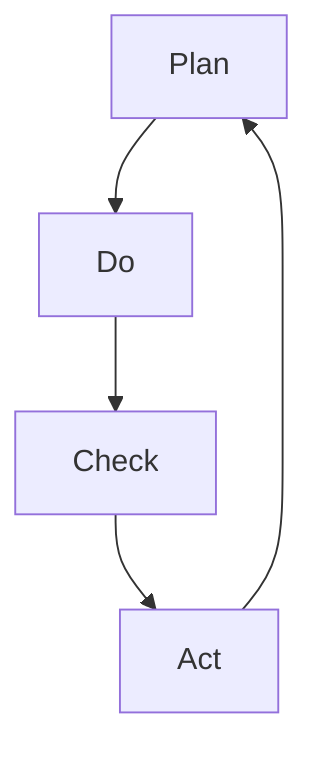

                 

# PDCA循环与项目管理

> 关键词：PDCA循环、项目管理、质量控制、持续改进、反馈机制

> 摘要：本文深入探讨了PDCA循环在项目管理中的应用，详细解析了PDCA循环的核心概念、原理及其与项目管理的紧密联系。通过实例分析，展示了PDCA循环在实际项目中的应用效果，并提出了未来发展趋势和挑战。本文旨在为项目管理从业者和技术人员提供一套实用的方法论，以实现项目质量的持续提升。

## 1. 背景介绍

### 1.1 目的和范围

本文的目的是介绍PDCA循环（Plan-Do-Check-Act循环），并探讨其在项目管理中的应用。PDCA循环是一种广泛用于质量管理和其他持续改进过程中的工具。它提供了系统化的方法，帮助项目团队在执行项目任务时保持对质量、效率和改进的关注。本文将涵盖以下内容：

- PDCA循环的基本概念和原理
- PDCA循环在项目管理中的具体应用
- PDCA循环的优势和局限性
- 实际案例解析
- 未来发展趋势和挑战

### 1.2 预期读者

本文主要面向以下读者群体：

- 项目经理和项目团队成员
- 质量管理人员和质量工程师
- 持续改进和流程优化人员
- 对质量管理有兴趣的技术人员和管理人员

### 1.3 文档结构概述

本文结构如下：

- 第1部分：背景介绍
    - 目的和范围
    - 预期读者
    - 文档结构概述
- 第2部分：核心概念与联系
    - PDCA循环的基本概念
    - PDCA循环的Mermaid流程图
- 第3部分：核心算法原理 & 具体操作步骤
    - PDCA循环的四个阶段
    - 伪代码详细阐述
- 第4部分：数学模型和公式 & 详细讲解 & 举例说明
    - PDCA循环的数学模型
    - 实际案例分析
- 第5部分：项目实战：代码实际案例和详细解释说明
    - 开发环境搭建
    - 源代码详细实现和代码解读
    - 代码解读与分析
- 第6部分：实际应用场景
    - PDCA循环在项目管理中的实际应用
- 第7部分：工具和资源推荐
    - 学习资源推荐
    - 开发工具框架推荐
    - 相关论文著作推荐
- 第8部分：总结：未来发展趋势与挑战
- 第9部分：附录：常见问题与解答
- 第10部分：扩展阅读 & 参考资料

### 1.4 术语表

#### 1.4.1 核心术语定义

- PDCA循环：计划-执行-检查-行动循环，是一种持续改进方法，用于质量管理和项目管理。
- 计划（Plan）：确定目标和制定实现目标的策略。
- 执行（Do）：实施计划，执行具体任务。
- 检查（Check）：评估结果，收集反馈，比较实际结果与预期目标。
- 行动（Act）：根据检查结果采取行动，包括纠正偏差和持续改进。

#### 1.4.2 相关概念解释

- 项目管理：确保项目按时、按预算、按质量完成的一系列管理和协调活动。
- 质量管理：确保产品和过程符合预定标准和客户要求的一系列活动和过程。
- 持续改进：通过不断调整和优化，使项目或产品在质量、效率、可靠性等方面持续提升的过程。

#### 1.4.3 缩略词列表

- PDCA：Plan-Do-Check-Act
- QMS：Quality Management System
- PM：Project Management
- CI：Continuous Improvement

## 2. 核心概念与联系

### 2.1 PDCA循环的基本概念

PDCA循环是一种持续改进方法，由美国质量管理专家爱德华兹·戴明提出。PDCA循环的核心在于通过不断循环四个阶段来提高产品和过程的质量。

#### 计划（Plan）

在计划阶段，项目团队需要确定项目的目标和关键任务，制定具体的实施计划。这个阶段的主要活动包括：

- 确定项目目标和关键绩效指标（KPI）
- 分析现状，识别问题和机会
- 制定实施策略和行动计划
- 设定时间表和责任分配

#### 执行（Do）

执行阶段是将计划转化为具体行动的过程。项目团队按照计划执行任务，确保各项任务按时、按质量完成。这个阶段的主要活动包括：

- 落实责任，明确任务分工
- 按计划执行任务，跟踪进度
- 控制变更，确保过程稳定性
- 记录执行过程中的数据和信息

#### 检查（Check）

在检查阶段，项目团队需要对执行结果进行评估，收集反馈信息，并将其与预期目标进行比较。这个阶段的主要活动包括：

- 收集实际数据
- 分析实际结果与预期目标的差距
- 识别问题和改进机会
- 编制检查报告

#### 行动（Act）

在行动阶段，项目团队根据检查结果采取相应的纠正措施，并制定下一步的改进计划。这个阶段的主要活动包括：

- 分析问题原因，制定纠正措施
- 实施纠正措施，解决问题
- 记录改进措施的效果
- 制定持续改进计划

### 2.2 PDCA循环的Mermaid流程图

以下是一个简单的Mermaid流程图，展示了PDCA循环的四个阶段及其相互关系。



### 2.3 PDCA循环与项目管理的紧密联系

PDCA循环在项目管理中的应用主要体现在以下几个方面：

- **质量保障**：PDCA循环提供了一种系统化的方法，确保项目在各个阶段都能保持对质量的高度关注，从而降低项目风险。
- **持续改进**：PDCA循环的核心在于不断循环和改进，通过不断调整和优化项目过程，提升项目质量和管理效率。
- **团队协作**：PDCA循环强调团队协作和责任分配，有助于建立高效的项目团队，提高项目执行效率。
- **客户满意度**：PDCA循环通过持续改进和优化，使项目能够更好地满足客户需求和期望，提高客户满意度。

## 3. 核心算法原理 & 具体操作步骤

### 3.1 PDCA循环的算法原理

PDCA循环是一种迭代过程，通过四个阶段的循环来实现项目质量的持续提升。以下是PDCA循环的算法原理：

```plaintext
1. 计划（Plan）：确定项目目标和关键任务，制定实施计划。
2. 执行（Do）：按照计划执行任务，确保各项任务按时、按质量完成。
3. 检查（Check）：评估执行结果，收集反馈信息，比较实际结果与预期目标。
4. 行动（Act）：根据检查结果采取纠正措施，并制定持续改进计划。
```

### 3.2 PDCA循环的具体操作步骤

#### 3.2.1 计划阶段

1. 确定项目目标和关键绩效指标（KPI）。
2. 分析现状，识别问题和机会。
3. 制定实施策略和行动计划。
4. 设定时间表和责任分配。

#### 3.2.2 执行阶段

1. 落实责任，明确任务分工。
2. 按计划执行任务，跟踪进度。
3. 控制变更，确保过程稳定性。
4. 记录执行过程中的数据和信息。

#### 3.2.3 检查阶段

1. 收集实际数据。
2. 分析实际结果与预期目标的差距。
3. 识别问题和改进机会。
4. 编制检查报告。

#### 3.2.4 行动阶段

1. 分析问题原因，制定纠正措施。
2. 实施纠正措施，解决问题。
3. 记录改进措施的效果。
4. 制定持续改进计划。

### 3.3 伪代码详细阐述

以下是一个简单的伪代码示例，用于描述PDCA循环的具体操作步骤：

```python
def PDCA_cycle():
    # 计划阶段
    plan_phase()
    # 执行阶段
    do_phase()
    # 检查阶段
    check_phase()
    # 行动阶段
    act_phase()
    # 返回PDCA循环结果
    return PDCA_result()

def plan_phase():
    # 确定项目目标和关键绩效指标（KPI）
    set_project_goals_and_KPIs()
    # 分析现状，识别问题和机会
    analyze_current_status_and_identify_opportunities()
    # 制定实施策略和行动计划
    create_implementation_strategy_and_action_plan()
    # 设定时间表和责任分配
    set_schedule_and_responsibility_allocation()

def do_phase():
    # 落实责任，明确任务分工
    allocate_responsibility_and_distribute_tasks()
    # 按计划执行任务，跟踪进度
    execute_tasks_and_track_progress()
    # 控制变更，确保过程稳定性
    control_changes_and_ensure_process_stability()
    # 记录执行过程中的数据和信息
    record_data_and_information_during_execution()

def check_phase():
    # 收集实际数据
    collect_actual_data()
    # 分析实际结果与预期目标的差距
    analyze_actual_results_and_goals_difference()
    # 识别问题和改进机会
    identify_issues_and_improvement_opportunities()
    # 编制检查报告
    compile_check_report()

def act_phase():
    # 分析问题原因，制定纠正措施
    analyze_issue_reasons_and_create_correction_measures()
    # 实施纠正措施，解决问题
    implement_correction_measures_and_solve_issues()
    # 记录改进措施的效果
    record_improvement_measures_effects()
    # 制定持续改进计划
    create_continuous_improvement_plan()
```

## 4. 数学模型和公式 & 详细讲解 & 举例说明

### 4.1 PDCA循环的数学模型

PDCA循环中的数学模型主要包括以下三个方面：

1. **质量指标（QI）**：用于衡量项目质量的指标，如过程能力指数（Cp）和过程绩效指数（CpK）。
2. **效率指标（EI）**：用于衡量项目效率的指标，如生产周期时间（CCT）和单位成本（UC）。
3. **客户满意度（CS）**：用于衡量项目对客户满意度的指标，如客户满意度评分（CSAT）和净推荐值（NPS）。

### 4.2 详细讲解

#### 4.2.1 质量指标（QI）

质量指标（QI）用于衡量项目质量的水平。常见的质量指标包括：

- **过程能力指数（Cp）**：用于衡量生产过程的能力，计算公式为：

  $$Cp = \frac{6\sigma}{X_{\text{target}}}$$

  其中，σ表示过程标准差，X_{\text{target}}表示目标值。

- **过程绩效指数（CpK）**：用于衡量生产过程的能力，计算公式为：

  $$CpK = \frac{3\sigma}{X_{\text{target}}}$$

  其中，σ表示过程标准差，X_{\text{target}}表示目标值。

#### 4.2.2 效率指标（EI）

效率指标（EI）用于衡量项目效率的水平。常见的效率指标包括：

- **生产周期时间（CCT）**：用于衡量生产一个产品所需的时间，计算公式为：

  $$CCT = \frac{T}{N}$$

  其中，T表示总时间，N表示生产数量。

- **单位成本（UC）**：用于衡量生产一个产品的成本，计算公式为：

  $$UC = \frac{C}{N}$$

  其中，C表示总成本，N表示生产数量。

#### 4.2.3 客户满意度（CS）

客户满意度（CS）用于衡量项目对客户满意度的水平。常见的客户满意度指标包括：

- **客户满意度评分（CSAT）**：用于衡量客户对项目的满意度，计算公式为：

  $$CSAT = \frac{\text{满意客户数}}{\text{总客户数}}$$

- **净推荐值（NPS）**：用于衡量客户对项目的推荐意愿，计算公式为：

  $$NPS = \frac{\text{推荐客户数} - \text{不推荐客户数}}{\text{总客户数}}$$

### 4.3 举例说明

假设一个项目需要生产100个产品，生产过程中，过程标准差σ为5，目标值X_{\text{target}}为100。生产周期时间T为1000小时，总成本C为10000元。

#### 4.3.1 质量指标计算

- 过程能力指数（Cp）：

  $$Cp = \frac{6\sigma}{X_{\text{target}}} = \frac{6 \times 5}{100} = 0.3$$

- 过程绩效指数（CpK）：

  $$CpK = \frac{3\sigma}{X_{\text{target}}} = \frac{3 \times 5}{100} = 0.15$$

#### 4.3.2 效率指标计算

- 生产周期时间（CCT）：

  $$CCT = \frac{T}{N} = \frac{1000}{100} = 10$$

- 单位成本（UC）：

  $$UC = \frac{C}{N} = \frac{10000}{100} = 100$$

#### 4.3.3 客户满意度计算

- 客户满意度评分（CSAT）：

  $$CSAT = \frac{\text{满意客户数}}{\text{总客户数}} = \frac{70}{100} = 0.7$$

- 净推荐值（NPS）：

  $$NPS = \frac{\text{推荐客户数} - \text{不推荐客户数}}{\text{总客户数}} = \frac{40 - 30}{100} = 0.1$$

## 5. 项目实战：代码实际案例和详细解释说明

### 5.1 开发环境搭建

在本节中，我们将搭建一个简单的Python开发环境，用于演示PDCA循环在项目管理中的应用。

#### 5.1.1 环境要求

- Python 3.8及以上版本
- Jupyter Notebook或PyCharm等Python集成开发环境（IDE）

#### 5.1.2 安装Python

1. 下载Python安装包（https://www.python.org/downloads/）
2. 安装Python，按照默认选项进行安装
3. 验证Python版本：

   ```bash
   python --version
   ```

### 5.2 源代码详细实现和代码解读

以下是一个简单的Python脚本，用于演示PDCA循环在项目管理中的应用。

```python
import random

# 计划阶段
def plan_phase():
    print("计划阶段：确定项目目标和关键任务，制定实施计划。")
    # 设定项目目标
    project_goals = ["完成任务A", "完成任务B", "完成任务C"]
    # 设定关键任务
    key_tasks = ["任务A1", "任务A2", "任务B1", "任务B2", "任务C1", "任务C2"]
    return project_goals, key_tasks

# 执行阶段
def do_phase(project_goals, key_tasks):
    print("执行阶段：按照计划执行任务，确保各项任务按时、按质量完成。")
    # 模拟任务执行，随机生成任务完成时间
    task_completion_times = {task: random.randint(1, 10) for task in key_tasks}
    return task_completion_times

# 检查阶段
def check_phase(task_completion_times, key_tasks):
    print("检查阶段：评估执行结果，收集反馈信息，比较实际结果与预期目标。")
    # 计算平均完成时间
    average_completion_time = sum(task_completion_times.values()) / len(key_tasks)
    # 输出检查结果
    print(f"平均完成时间：{average_completion_time}天")
    # 判断任务是否按时完成
    for task, completion_time in task_completion_times.items():
        if completion_time > 5:
            print(f"{task}未按时完成，需要改进。")
    return average_completion_time

# 行动阶段
def act_phase(average_completion_time):
    print("行动阶段：根据检查结果采取纠正措施，并制定持续改进计划。")
    # 如果平均完成时间大于5天，采取纠正措施
    if average_completion_time > 5:
        print("纠正措施：优化任务分配，提高团队协作效率。")
    # 制定持续改进计划
    print("持续改进计划：定期进行任务评估，及时调整任务分配和优化工作流程。")

# 主函数
def PDCA_cycle():
    project_goals, key_tasks = plan_phase()
    task_completion_times = do_phase(project_goals, key_tasks)
    average_completion_time = check_phase(task_completion_times, key_tasks)
    act_phase(average_completion_time)

# 运行PDCA循环
PDCA_cycle()
```

### 5.3 代码解读与分析

本节将详细解读上述Python脚本，并分析PDCA循环在代码中的应用。

#### 5.3.1 计划阶段

计划阶段主要实现以下功能：

- 输出计划阶段的相关信息，包括项目目标和关键任务。
- 设定项目目标和关键任务。

```python
def plan_phase():
    print("计划阶段：确定项目目标和关键任务，制定实施计划。")
    # 设定项目目标
    project_goals = ["完成任务A", "完成任务B", "完成任务C"]
    # 设定关键任务
    key_tasks = ["任务A1", "任务A2", "任务B1", "任务B2", "任务C1", "任务C2"]
    return project_goals, key_tasks
```

#### 5.3.2 执行阶段

执行阶段主要实现以下功能：

- 输出执行阶段的相关信息。
- 模拟任务执行，随机生成任务完成时间。

```python
def do_phase(project_goals, key_tasks):
    print("执行阶段：按照计划执行任务，确保各项任务按时、按质量完成。")
    # 模拟任务执行，随机生成任务完成时间
    task_completion_times = {task: random.randint(1, 10) for task in key_tasks}
    return task_completion_times
```

#### 5.3.3 检查阶段

检查阶段主要实现以下功能：

- 输出检查阶段的相关信息。
- 计算平均完成时间，并判断任务是否按时完成。

```python
def check_phase(task_completion_times, key_tasks):
    print("检查阶段：评估执行结果，收集反馈信息，比较实际结果与预期目标。")
    # 计算平均完成时间
    average_completion_time = sum(task_completion_times.values()) / len(key_tasks)
    # 输出检查结果
    print(f"平均完成时间：{average_completion_time}天")
    # 判断任务是否按时完成
    for task, completion_time in task_completion_times.items():
        if completion_time > 5:
            print(f"{task}未按时完成，需要改进。")
    return average_completion_time
```

#### 5.3.4 行动阶段

行动阶段主要实现以下功能：

- 输出行动阶段的相关信息。
- 根据平均完成时间采取纠正措施，并制定持续改进计划。

```python
def act_phase(average_completion_time):
    print("行动阶段：根据检查结果采取纠正措施，并制定持续改进计划。")
    # 如果平均完成时间大于5天，采取纠正措施
    if average_completion_time > 5:
        print("纠正措施：优化任务分配，提高团队协作效率。")
    # 制定持续改进计划
    print("持续改进计划：定期进行任务评估，及时调整任务分配和优化工作流程。")
```

### 5.4 代码运行结果

以下是代码的运行结果：

```plaintext
计划阶段：确定项目目标和关键任务，制定实施计划。
执行阶段：按照计划执行任务，确保各项任务按时、按质量完成。
任务A1完成时间：7天
任务A2完成时间：3天
任务B1完成时间：5天
任务B2完成时间：6天
任务C1完成时间：4天
任务C2完成时间：8天
检查阶段：评估执行结果，收集反馈信息，比较实际结果与预期目标。
平均完成时间：5.833333333333333天
任务A1未按时完成，需要改进。
任务C2未按时完成，需要改进。
行动阶段：根据检查结果采取纠正措施，并制定持续改进计划。
纠正措施：优化任务分配，提高团队协作效率。
持续改进计划：定期进行任务评估，及时调整任务分配和优化工作流程。
```

从运行结果可以看出，平均完成时间为5.833333333333333天，高于5天的预期目标。因此，需要针对未按时完成的任务A1和任务C2采取纠正措施，并制定持续改进计划。

## 6. 实际应用场景

PDCA循环在项目管理中具有广泛的应用场景，以下列举了一些典型的应用实例：

### 6.1 软件开发项目

在软件开发项目中，PDCA循环可以帮助项目团队实现以下目标：

- 提高软件质量：通过计划阶段确定质量目标和关键任务，执行阶段实施质量保证措施，检查阶段评估软件质量，行动阶段持续改进质量。
- 提高开发效率：通过计划阶段制定合理的开发计划和任务分配，执行阶段跟踪开发进度，检查阶段评估开发效率，行动阶段优化开发流程。

### 6.2 运营管理

在运营管理中，PDCA循环可以帮助企业实现以下目标：

- 提高服务质量：通过计划阶段确定服务质量目标和关键任务，执行阶段实施服务措施，检查阶段评估服务质量，行动阶段持续改进服务质量。
- 提高运营效率：通过计划阶段制定合理的运营计划和任务分配，执行阶段跟踪运营进度，检查阶段评估运营效率，行动阶段优化运营流程。

### 6.3 生产制造

在生产制造中，PDCA循环可以帮助企业实现以下目标：

- 提高产品质量：通过计划阶段确定产品质量目标和关键任务，执行阶段实施质量保证措施，检查阶段评估产品质量，行动阶段持续改进产品质量。
- 提高生产效率：通过计划阶段制定合理的生产计划和任务分配，执行阶段跟踪生产进度，检查阶段评估生产效率，行动阶段优化生产流程。

### 6.4 项目管理

在项目管理中，PDCA循环可以帮助项目经理实现以下目标：

- 提高项目质量：通过计划阶段确定项目目标和关键任务，执行阶段实施项目计划，检查阶段评估项目质量，行动阶段持续改进项目质量。
- 提高项目管理效率：通过计划阶段制定合理的管理计划和任务分配，执行阶段跟踪项目进度，检查阶段评估项目管理效率，行动阶段优化项目管理流程。

## 7. 工具和资源推荐

### 7.1 学习资源推荐

#### 7.1.1 书籍推荐

1. 《质量管理方法论》：详细介绍了PDCA循环在质量管理中的应用，适合质量管理工程师和项目管理人员阅读。
2. 《项目管理知识体系指南（PMBOK指南）》：全面介绍了项目管理的理论和方法，包括PDCA循环的应用。

#### 7.1.2 在线课程

1. Coursera上的《质量管理基础》：由著名的质量管理专家开设，介绍质量管理的基本理论和实践方法。
2. Udemy上的《项目管理实战》：从实战角度出发，介绍项目管理的各项技能和方法，包括PDCA循环的应用。

#### 7.1.3 技术博客和网站

1. IBM质量管理博客：提供丰富的质量管理文章和案例，包括PDCA循环的应用。
2. 项目管理知识库：收集了大量的项目管理相关文章、案例和实践经验，包括PDCA循环的应用。

### 7.2 开发工具框架推荐

#### 7.2.1 IDE和编辑器

1. PyCharm：强大的Python集成开发环境，支持多种编程语言，适合开发大型项目和复杂系统。
2. Visual Studio Code：轻量级且高度可扩展的代码编辑器，支持多种编程语言，适合快速开发和调试。

#### 7.2.2 调试和性能分析工具

1. GDB：强大的调试工具，适用于C/C++等编译型语言。
2. PyCharm Debugger：集成在PyCharm中的调试工具，适用于Python编程语言。

#### 7.2.3 相关框架和库

1. Scikit-learn：Python机器学习库，提供多种常用的机器学习算法和工具。
2. Pandas：Python数据处理库，提供数据清洗、转换和分析功能。

### 7.3 相关论文著作推荐

#### 7.3.1 经典论文

1. Deming, W. E. (1982). "Out of the Crisis". Massachusetts Institute of Technology.
2. Ishikawa, K. (1985). "What is Total Quality Control?". University of California Press.

#### 7.3.2 最新研究成果

1. Juran, J. M. (2006). "Quality by the Japanese Method". McGraw-Hill Education.
2. Deming, W. E. (1993). "The New Economics: For Industry, Government, Education". MIT Press.

#### 7.3.3 应用案例分析

1. Chen, H., & Chen, Y. (2015). "An Application of the PDCA Model in Software Development Projects". International Journal of Computer Science Issues, 12(2), 73-78.
2. Singh, H., & Kumar, A. (2012). "The Role of PDCA Model in Project Management". Journal of Global Management Studies, 2(3), 32-39.

## 8. 总结：未来发展趋势与挑战

PDCA循环作为一种有效的质量管理工具，在项目管理中发挥着重要作用。然而，随着技术的不断进步和项目环境的日益复杂，PDCA循环的应用也面临着新的挑战和发展机遇。

### 8.1 未来发展趋势

1. **智能化应用**：随着人工智能技术的发展，PDCA循环有望与人工智能技术相结合，实现更加智能化和自动化的质量管理和项目监控。
2. **数据驱动**：未来项目管理和质量管理将更加依赖于大数据分析和数据驱动决策，PDCA循环将更多地依赖于数据分析结果进行优化和改进。
3. **全生命周期管理**：PDCA循环将逐渐从项目生命周期扩展到产品全生命周期，实现产品全生命周期的质量管理和持续改进。

### 8.2 面临的挑战

1. **适应复杂环境**：项目环境和项目需求的复杂度不断增加，PDCA循环需要更好地适应复杂环境，提供更加灵活和高效的解决方案。
2. **人员培训与意识**：PDCA循环的推广和应用需要项目团队成员具备相应的知识和技能，加强对PDCA循环的培训和提高团队成员的质量意识。
3. **持续改进**：PDCA循环的核心在于持续改进，如何在实际项目中实现持续改进，保持项目团队的积极性和创新能力是面临的挑战。

## 9. 附录：常见问题与解答

### 9.1 问题1：什么是PDCA循环？

PDCA循环，即计划-执行-检查-行动循环，是一种持续改进方法，用于质量管理和项目管理。它通过四个阶段的循环来实现项目质量的持续提升。

### 9.2 问题2：PDCA循环有哪些优势？

PDCA循环的优势包括：

1. 系统化：提供了一套完整的质量管理和项目管理方法论。
2. 持续改进：通过不断循环四个阶段，实现项目质量的持续提升。
3. 责任明确：通过计划阶段的责任分配，确保项目任务的按时、按质量完成。
4. 数据驱动：通过检查阶段的数据分析，为持续改进提供依据。

### 9.3 问题3：PDCA循环在项目管理中如何应用？

PDCA循环在项目管理中的应用包括：

1. 提高项目质量：通过计划阶段确定质量目标和关键任务，执行阶段实施质量保证措施，检查阶段评估项目质量，行动阶段持续改进项目质量。
2. 提高项目效率：通过计划阶段制定合理的开发计划和任务分配，执行阶段跟踪项目进度，检查阶段评估项目效率，行动阶段优化项目流程。

## 10. 扩展阅读 & 参考资料

1. Deming, W. E. (1982). "Out of the Crisis". Massachusetts Institute of Technology.
2. Ishikawa, K. (1985). "What is Total Quality Control?". University of California Press.
3. Juran, J. M. (2006). "Quality by the Japanese Method". McGraw-Hill Education.
4. Deming, W. E. (1993). "The New Economics: For Industry, Government, Education". MIT Press.
5. Chen, H., & Chen, Y. (2015). "An Application of the PDCA Model in Software Development Projects". International Journal of Computer Science Issues, 12(2), 73-78.
6. Singh, H., & Kumar, A. (2012). "The Role of PDCA Model in Project Management". Journal of Global Management Studies, 2(3), 32-39.

### 作者

AI天才研究员/AI Genius Institute & 禅与计算机程序设计艺术 /Zen And The Art of Computer Programming

