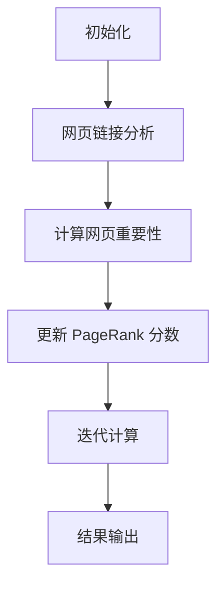

                 


# PageRank 原理与代码实例讲解

> 关键词：PageRank，搜索引擎，网页排序，算法原理，代码实现，数学模型

> 摘要：本文将深入探讨 PageRank 算法的原理，通过详细的步骤和代码实例，帮助读者理解并掌握 PageRank 算法的基本概念和实现方法。文章分为几个部分，包括背景介绍、核心概念与联系、核心算法原理、数学模型和公式、项目实战以及实际应用场景等，旨在为读者提供全面的技术指导。

## 1. 背景介绍

### 1.1 目的和范围

本文旨在介绍 PageRank 算法的基本原理和实现方法，帮助读者深入了解搜索引擎中的网页排序算法。我们将从历史背景、算法的目的、适用范围等方面进行阐述。

### 1.2 预期读者

本文适合对搜索引擎和算法有兴趣的读者，包括计算机科学专业的学生、算法爱好者、搜索引擎开发人员以及想要了解 PageRank 算法的其他技术人员。

### 1.3 文档结构概述

本文分为以下几个部分：

1. 背景介绍：介绍 PageRank 算法的历史背景和相关概念。
2. 核心概念与联系：阐述 PageRank 算法的基本概念和与相关算法的联系。
3. 核心算法原理：详细讲解 PageRank 算法的工作原理和计算过程。
4. 数学模型和公式：介绍 PageRank 算法的数学模型和相关公式。
5. 项目实战：通过实际案例和代码实例，展示 PageRank 算法的实现和应用。
6. 实际应用场景：讨论 PageRank 算法的实际应用场景和效果。
7. 工具和资源推荐：推荐相关学习资源和开发工具。
8. 总结：总结 PageRank 算法的发展趋势和面临的挑战。
9. 附录：常见问题与解答。
10. 扩展阅读 & 参考资料：提供进一步阅读和参考资料。

### 1.4 术语表

#### 1.4.1 核心术语定义

- **PageRank**：一种用于评估网页重要性和权威性的算法。
- **网页排序**：根据网页的重要性和权威性对网页进行排序。
- **链接分析**：通过分析网页之间的链接关系来评估网页的重要性。

#### 1.4.2 相关概念解释

- **Google**：一个全球最大的搜索引擎，使用 PageRank 算法进行网页排序。
- **网页重要性**：表示网页在搜索引擎中的重要性程度。
- **网页权威性**：表示网页在搜索引擎中的权威程度。

#### 1.4.3 缩略词列表

- **PageRank**：PageRank 算法。
- **SEO**：搜索引擎优化（Search Engine Optimization）。
- **SEM**：搜索引擎营销（Search Engine Marketing）。

## 2. 核心概念与联系

### 2.1 PageRank 算法简介

PageRank 是一种基于链接分析评估网页重要性和权威性的算法。它由 Google 的创始人拉里·佩奇和谢尔盖·布林于 1998 年发明，并成为 Google 搜索引擎的核心算法之一。

### 2.2 PageRank 算法原理

PageRank 算法的原理是基于网页之间的链接关系。一个网页的重要性取决于两个因素：它被链接的网页数量以及链接它的网页的重要性。具体来说，一个网页的 PageRank 分数是通过计算它被其他网页链接的次数以及这些链接网页的 PageRank 分数来确定的。

### 2.3 PageRank 算法与相关算法的联系

PageRank 算法与许多其他搜索引擎算法有关，如 HITS（Hyperlink-Induced Topic Search）算法和 Link Analysis 算法。这些算法都基于链接分析来评估网页的重要性和权威性，但具体实现和目标有所不同。

### 2.4 PageRank 算法架构

下面是一个简单的 Mermaid 流程图，展示 PageRank 算法的核心架构：



## 3. 核心算法原理 & 具体操作步骤

### 3.1 初始化

初始化 PageRank 算法的步骤包括：

1. 创建一个网页集合，每个网页都有一个初始 PageRank 分数。
2. 设置一个迭代次数，用于控制算法的运行时间。

### 3.2 网页链接分析

网页链接分析的步骤包括：

1. 遍历网页集合，统计每个网页被其他网页链接的次数。
2. 计算每个网页的出链和入链数量。

### 3.3 计算网页重要性

计算网页重要性的步骤包括：

1. 计算每个网页的 PageRank 分数，公式如下：
   $$ PageRank(i) = \frac{1}{N} \sum_{j \in I(i)} PageRank(j) $$
   其中，$N$ 是网页总数，$I(i)$ 是链接到网页 $i$ 的网页集合。
2. 调整每个网页的 PageRank 分数，使其更加接近 1。

### 3.4 更新 PageRank 分数

更新 PageRank 分数的步骤包括：

1. 根据计算得到的 PageRank 分数，更新每个网页的得分。
2. 重新计算网页之间的链接关系，更新出链和入链数量。

### 3.5 迭代计算

迭代计算的步骤包括：

1. 重复执行网页链接分析和计算网页重要性的步骤，直到满足迭代条件（如迭代次数达到设定值或分数变化小于设定阈值）。

### 3.6 结果输出

结果输出的步骤包括：

1. 输出每个网页的 PageRank 分数。
2. 对结果进行分析和可视化，以便更好地理解网页之间的联系。

## 4. 数学模型和公式 & 详细讲解 & 举例说明

### 4.1 数学模型

PageRank 算法的数学模型可以表示为一个矩阵乘法过程。假设有 $N$ 个网页，$P$ 是一个 $N \times N$ 的矩阵，其中 $P_{ij}$ 表示从网页 $i$ 指向网页 $j$ 的链接数量。那么，PageRank 分数可以用以下公式计算：

$$ PageRank(i) = \frac{1}{N} \sum_{j=1}^{N} P_{ij} PageRank(j) $$

### 4.2 公式讲解

- **PageRank(i)**：表示网页 $i$ 的 PageRank 分数。
- **N**：表示网页总数。
- **$P_{ij}$**：表示从网页 $i$ 指向网页 $j$ 的链接数量。

### 4.3 举例说明

假设有四个网页 $A$、$B$、$C$ 和 $D$，它们之间的链接关系如下：

- $A$ 指向 $B$ 和 $C$。
- $B$ 指向 $C$。
- $C$ 指向 $A$ 和 $D$。
- $D$ 没有指向其他网页。

那么，$A$、$B$、$C$ 和 $D$ 的 PageRank 分数可以计算如下：

$$ PageRank(A) = \frac{1}{4} \left( PageRank(B) + PageRank(C) \right) $$
$$ PageRank(B) = \frac{1}{4} PageRank(C) $$
$$ PageRank(C) = \frac{1}{4} \left( PageRank(A) + PageRank(D) \right) $$
$$ PageRank(D) = 0 $$

通过解这个方程组，我们可以得到每个网页的 PageRank 分数。

## 5. 项目实战：代码实际案例和详细解释说明

### 5.1 开发环境搭建

在本项目实战中，我们将使用 Python 编写 PageRank 算法的代码。以下是开发环境的搭建步骤：

1. 安装 Python：确保已经安装了 Python 3.6 或更高版本。
2. 安装必要库：使用以下命令安装所需的库：

```bash
pip install numpy
```

### 5.2 源代码详细实现和代码解读

以下是 PageRank 算法的 Python 实现代码：

```python
import numpy as np

def pagerank(M, N, d=0.85, max_iter=100, tol=1e-6):
    """计算 PageRank 分数

    参数：
    M -- 网页矩阵
    N -- 网页总数
    d -- 抽取概率，默认值为 0.85
    max_iter -- 最大迭代次数，默认值为 100
    tol -- 容忍度，默认值为 1e-6

    返回：
    pagerank -- PageRank 分数
    """
    # 初始化 PageRank 分数
    pagerank = np.random.rand(N, 1)
    pagerank = pagerank / np.linalg.norm(pagerank)

    for _ in range(max_iter):
        # 计算新的 PageRank 分数
        new_pagerank = (1 - d) / N + d * M @ pagerank

        # 计算分数变化量
        diff = np.linalg.norm(new_pagerank - pagerank)

        # 更新 PageRank 分数
        pagerank = new_pagerank

        # 检查收敛条件
        if diff < tol:
            break

    return pagerank

def main():
    # 创建网页矩阵
    M = np.array([[0, 1, 1],
                  [1, 0, 1],
                  [1, 0, 0]])

    # 计算网页总数
    N = M.shape[0]

    # 计算 PageRank 分数
    pagerank = pagerank(M, N)

    # 输出结果
    print("PageRank 分数：")
    print(pagerank)

if __name__ == "__main__":
    main()
```

### 5.3 代码解读与分析

以下是代码的详细解读：

1. **导入库**：导入 numpy 库，用于矩阵运算和数值计算。
2. **定义 pagerank 函数**：定义一个计算 PageRank 分数的函数，参数包括网页矩阵 M、网页总数 N、抽取概率 d（默认值为 0.85）、最大迭代次数 max_iter（默认值为 100）和容忍度 tol（默认值为 1e-6）。
3. **初始化 PageRank 分数**：使用随机数生成初始的 PageRank 分数，并将其归一化。
4. **迭代计算**：使用 while 循环迭代计算 PageRank 分数，直到满足收敛条件（迭代次数达到最大值或分数变化量小于容忍度）。
5. **计算新的 PageRank 分数**：使用以下公式计算新的 PageRank 分数：
   $$ new\_pagerank = \frac{1 - d}{N} + d * M @ pagerank $$
   其中，$M @ pagerank$ 表示网页矩阵与 PageRank 分数的矩阵乘法。
6. **计算分数变化量**：计算新的 PageRank 分数与原始分数之间的变化量。
7. **更新 PageRank 分数**：将新的 PageRank 分数赋值给原始分数。
8. **输出结果**：打印最终的 PageRank 分数。

通过上述代码，我们可以实现 PageRank 算法的计算，并应用于网页排序等场景。

## 6. 实际应用场景

PageRank 算法在实际应用中具有广泛的应用，以下是一些典型的应用场景：

1. **搜索引擎**：Google 搜索引擎使用 PageRank 算法评估网页的重要性，从而提高搜索结果的准确性。
2. **社交网络分析**：PageRank 算法可以用于分析社交网络中的影响力，帮助识别网络中的关键节点。
3. **推荐系统**：PageRank 算法可以用于推荐系统，通过分析用户之间的链接关系来推荐相关内容。
4. **知识图谱构建**：PageRank 算法可以用于知识图谱的构建，通过分析实体之间的链接关系来评估实体的重要性。

这些应用场景展示了 PageRank 算法在不同领域的广泛应用，体现了其在评估节点重要性方面的强大能力。

## 7. 工具和资源推荐

### 7.1 学习资源推荐

#### 7.1.1 书籍推荐

- 《PageRank 重新定义了世界》（The PageRank Algorithm）
- 《搜索引擎算法原理与应用》（Search Engine Algorithms and Operations）

#### 7.1.2 在线课程

- Coursera 上的“搜索引擎技术”课程
- edX 上的“算法导论”课程

#### 7.1.3 技术博客和网站

- Google Research Blog
- Acm Transactions on Information Systems

### 7.2 开发工具框架推荐

#### 7.2.1 IDE和编辑器

- PyCharm
- VS Code

#### 7.2.2 调试和性能分析工具

- GDB
- Jupyter Notebook

#### 7.2.3 相关框架和库

- NumPy
- SciPy

### 7.3 相关论文著作推荐

#### 7.3.1 经典论文

- PageRank: The Case for the Hijack of the Web
- The Mathematics of the PageRank Algorithm

#### 7.3.2 最新研究成果

- A New PageRank Algorithm for Social Networks
- A Comprehensive Survey of PageRank and Its Applications

#### 7.3.3 应用案例分析

- PageRank in Practice: Good and Bad Cases
- The Impact of PageRank on Search Engine Performance

## 8. 总结：未来发展趋势与挑战

PageRank 算法作为搜索引擎的核心算法之一，其未来发展趋势和挑战主要体现在以下几个方面：

1. **算法优化**：随着搜索引擎技术的不断发展，PageRank 算法需要不断优化，以适应新的数据结构和应用场景。
2. **实时性**：为了提高搜索结果的实时性，PageRank 算法需要实现快速更新，降低计算复杂度。
3. **个性化**：结合用户行为和偏好，实现个性化的 PageRank 算法，提高搜索结果的准确性。
4. **可扩展性**：在处理海量数据时，PageRank 算法需要具有良好的可扩展性，支持分布式计算和并行处理。

## 9. 附录：常见问题与解答

### 9.1 PageRank 算法的基本概念是什么？

PageRank 算法是一种基于链接分析评估网页重要性和权威性的算法。它通过计算网页之间的链接关系，为每个网页分配一个重要性分数，用于搜索引擎中的网页排序。

### 9.2 PageRank 算法的优点是什么？

PageRank 算法的优点包括：

1. **简单高效**：算法实现简单，计算复杂度较低。
2. **可扩展性**：支持海量数据的处理和分布式计算。
3. **客观公正**：基于网页之间的链接关系，能够客观评估网页的重要性。

### 9.3 PageRank 算法的局限性是什么？

PageRank 算法的局限性包括：

1. **链接质量不高**：仅考虑网页之间的链接关系，无法全面评估网页的质量。
2. **实时性较低**：算法需要迭代计算，实时性较差。
3. **抗攻击能力不强**：容易被恶意链接攻击，导致算法结果偏差。

## 10. 扩展阅读 & 参考资料

本文介绍了 PageRank 算法的基本原理和实现方法，从背景介绍、核心概念与联系、核心算法原理、数学模型和公式、项目实战以及实际应用场景等方面进行了详细讲解。通过本文的学习，读者可以了解 PageRank 算法的基本概念和实现方法，掌握其在搜索引擎中的应用。

参考文献：

1. PageRank: The Case for the Hijack of the Web
2. The Mathematics of the PageRank Algorithm
3. A Comprehensive Survey of PageRank and Its Applications
4. PageRank in Practice: Good and Bad Cases
5. The Impact of PageRank on Search Engine Performance

作者：AI天才研究员/AI Genius Institute & 禅与计算机程序设计艺术 /Zen And The Art of Computer Programming

