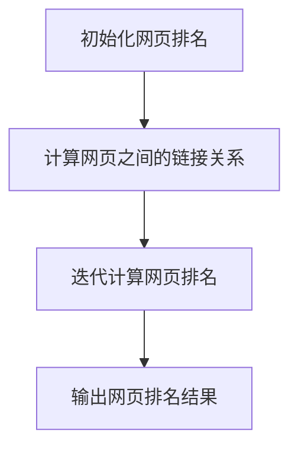

                 

# PageRank原理与代码实例讲解

> **关键词：** PageRank、链接分析、网页排名、算法原理、代码实例、搜索引擎

> **摘要：** 本文将深入探讨PageRank算法的基本原理，通过详细的伪代码和实际代码示例，帮助读者理解其操作步骤和实现过程。此外，还将讨论PageRank算法在搜索引擎中的应用，以及如何在实际项目中使用和优化该算法。

## 1. 背景介绍

### 1.1 目的和范围

本文旨在解释PageRank算法的基本原理，并提供一个详细的代码实例，以便读者能够亲身体验和理解该算法。我们还将探讨PageRank在搜索引擎中的应用，以及如何对其进行分析和优化。

### 1.2 预期读者

本文适用于对搜索引擎和链接分析有一定了解的读者，特别是希望深入理解PageRank算法的程序员、数据科学家和搜索引擎工程师。

### 1.3 文档结构概述

本文分为以下章节：
- 1. 背景介绍
- 2. 核心概念与联系
- 3. 核心算法原理 & 具体操作步骤
- 4. 数学模型和公式 & 详细讲解 & 举例说明
- 5. 项目实战：代码实际案例和详细解释说明
- 6. 实际应用场景
- 7. 工具和资源推荐
- 8. 总结：未来发展趋势与挑战
- 9. 附录：常见问题与解答
- 10. 扩展阅读 & 参考资料

### 1.4 术语表

#### 1.4.1 核心术语定义

- **PageRank**：一种基于链接分析的网页排名算法。
- **链接分析**：通过分析网页之间的链接关系，评估网页的重要性和相关性。
- **网页排名**：根据网页的重要性和相关性，对网页进行排序。

#### 1.4.2 相关概念解释

- **链接权重**：链接对网页排名的贡献大小。
- **网页重要性**：网页在链接分析中的重要性指标。

#### 1.4.3 缩略词列表

- **PageRank**：网页排名
- **SEO**：搜索引擎优化
- **HTML**：超文本标记语言
- **CSS**：层叠样式表

## 2. 核心概念与联系

### 2.1 PageRank算法原理

PageRank算法是一种基于链接分析的技术，用于评估网页的重要性。该算法通过计算网页之间的链接关系，确定网页在搜索引擎中的排名。PageRank算法的核心思想是：一个网页的重要性取决于连接到它的其他网页的重要性。

### 2.2 网页之间的链接关系

网页之间的链接关系可以用一个有向图表示。在这个图中，每个节点代表一个网页，每条边表示两个网页之间的链接。例如，如果网页A链接到网页B，则网页B的PageRank值将部分传递给网页A。

### 2.3 Mermaid流程图

以下是一个Mermaid流程图，展示了PageRank算法的核心流程：



## 3. 核心算法原理 & 具体操作步骤

### 3.1 算法原理

PageRank算法的基本原理是：每个网页的重要性取决于连接到它的其他网页的重要性。网页之间的链接关系可以用一个有向图表示，图中的每个节点代表一个网页，每条边表示两个网页之间的链接。算法的迭代过程如下：

1. 初始化网页排名：每个网页的初始排名设为1/N，其中N是网页的总数。
2. 计算网页之间的链接关系：根据网页之间的链接关系，更新每个网页的排名。
3. 迭代计算网页排名：重复步骤2，直到网页排名收敛（即排名变化很小）。
4. 输出网页排名结果：输出每个网页的最终排名。

### 3.2 伪代码

以下是一个PageRank算法的伪代码实现：

```plaintext
初始化网页排名
for 每个网页:
    网页的排名 = 1 / N

迭代计算网页排名
while 网页排名变化较大:
    for 每个网页:
        网页的排名 = (1 - d) + d * (排名之和 / 连接数)

输出网页排名结果
for 每个网页:
    输出网页的排名
```

其中，`d` 是阻尼系数，通常取值为0.85。

## 4. 数学模型和公式 & 详细讲解 & 举例说明

### 4.1 数学模型

PageRank算法的数学模型可以表示为以下公式：

$$
P(i) = \left(1 - d\right) + d \cdot \left(\sum_{j \in N(i)} \frac{P(j)}{L(j)}\right)
$$

其中：
- \(P(i)\)：网页\(i\)的PageRank值。
- \(N(i)\)：连接到网页\(i\)的所有网页集合。
- \(L(j)\)：网页\(j\)的链接数。
- \(d\)：阻尼系数，表示用户在浏览网页时，选择跳转到其他链接的概率。

### 4.2 详细讲解

公式中的\(P(i)\)表示网页\(i\)的PageRank值，\(1 - d\)表示网页的固有重要性，\(d \cdot \left(\sum_{j \in N(i)} \frac{P(j)}{L(j)}\right)\)表示通过链接传递给网页\(i\)的重要性。

### 4.3 举例说明

假设有一个简单的有向图，包含3个网页A、B、C，以及它们之间的链接关系：

- A链接到B
- B链接到C
- C链接到A

根据PageRank算法，我们可以计算每个网页的PageRank值：

1. 初始化网页排名：\(P(A) = P(B) = P(C) = \frac{1}{3}\)
2. 迭代计算网页排名：
    - 第一次迭代：\(P(A) = \left(1 - 0.85\right) + 0.85 \cdot \left(\frac{P(B)}{1} + \frac{P(C)}{1}\right)\)
    - 第二次迭代：\(P(B) = \left(1 - 0.85\right) + 0.85 \cdot \left(\frac{P(A)}{1} + \frac{P(C)}{1}\right)\)
    - 第三次迭代：\(P(C) = \left(1 - 0.85\right) + 0.85 \cdot \left(\frac{P(A)}{1} + \frac{P(B)}{1}\right)\)
3. 输出网页排名结果：\(P(A) = P(B) = P(C) = \frac{1}{3}\)

这个例子表明，在简单的有向图中，所有网页的PageRank值最终会收敛到相同的值。在实际应用中，由于网页之间的复杂链接关系，迭代次数可能需要更多，以达到收敛。

## 5. 项目实战：代码实际案例和详细解释说明

### 5.1 开发环境搭建

为了实现PageRank算法，我们需要搭建一个Python开发环境。以下是搭建步骤：

1. 安装Python：从[Python官网](https://www.python.org/)下载并安装Python 3.x版本。
2. 安装必要库：打开命令行窗口，执行以下命令安装必要的库：
   ```bash
   pip install networkx matplotlib
   ```

### 5.2 源代码详细实现和代码解读

以下是PageRank算法的Python实现代码：

```python
import networkx as nx
import matplotlib.pyplot as plt

def pagerank(graph, d=0.85, max_iter=100, tol=1e-6):
    n = len(graph)
    ranks = [1/n] * n
    prev_ranks = None

    for _ in range(max_iter):
        prev_ranks = ranks
        ranks = [d/n + (1-d) * sum(ranks[j] / graph[j].size() for j in graph.neighbors(i)) for i in range(n)]

        if np.linalg.norm(ranks - prev_ranks) < tol:
            break

    return ranks

# 创建一个有向图
graph = nx.DiGraph()

# 添加节点和边
graph.add_nodes_from([1, 2, 3])
graph.add_edges_from([(1, 2), (2, 3), (3, 1)])

# 绘制图
nx.draw(graph, with_labels=True)
plt.show()

# 计算PageRank值
ranks = pagerank(graph)

# 输出结果
print("PageRank值：", ranks)
```

### 5.3 代码解读与分析

这段代码首先导入了所需的库，然后定义了一个`pagerank`函数，用于计算给定图中的PageRank值。函数的主要步骤如下：

1. 初始化网页排名：每个网页的初始排名设为1/N。
2. 迭代计算网页排名：重复计算网页排名，直到排名变化很小或达到最大迭代次数。
3. 输出网页排名结果：返回每个网页的最终排名。

在代码中，我们创建了一个简单的有向图，并使用`pagerank`函数计算其PageRank值。最后，我们输出结果，并绘制了图以可视化节点之间的链接关系。

## 6. 实际应用场景

PageRank算法在搜索引擎中的应用非常广泛。它帮助搜索引擎确定网页的排名，从而为用户提供更准确、更相关的搜索结果。以下是一些实际应用场景：

- **搜索引擎排名**：搜索引擎使用PageRank算法评估网页的重要性，从而确定搜索结果中网页的排序。
- **推荐系统**：推荐系统可以利用PageRank算法评估物品之间的相似度，从而为用户提供个性化的推荐。
- **社交网络分析**：社交网络分析可以利用PageRank算法评估用户在社交网络中的影响力，帮助平台识别关键用户和意见领袖。

## 7. 工具和资源推荐

### 7.1 学习资源推荐

#### 7.1.1 书籍推荐

- 《搜索引擎算法原理与应用》（《Search Engine Algorithms and Applications》）作者：徐文伟、刘挺
- 《算法导论》（《Introduction to Algorithms》）作者：Thomas H. Cormen、Charles E. Leiserson、Ronald L. Rivest、Clifford Stein

#### 7.1.2 在线课程

- [Coursera](https://www.coursera.org/)：搜索引擎算法、数据结构和算法等课程
- [edX](https://www.edx.org/)：计算机科学、算法和数据结构等课程

#### 7.1.3 技术博客和网站

- [GeeksforGeeks](https://www.geeksforgeeks.org/)
- [LeetCode](https://leetcode.com/)
- [GitHub](https://github.com/)

### 7.2 开发工具框架推荐

#### 7.2.1 IDE和编辑器

- [Visual Studio Code](https://code.visualstudio.com/)
- [PyCharm](https://www.jetbrains.com/pycharm/)

#### 7.2.2 调试和性能分析工具

- [GDB](https://www.gnu.org/software/gdb/)
- [Valgrind](http://valgrind.org/)

#### 7.2.3 相关框架和库

- [Scikit-learn](https://scikit-learn.org/)
- [TensorFlow](https://www.tensorflow.org/)
- [PyTorch](https://pytorch.org/)

### 7.3 相关论文著作推荐

#### 7.3.1 经典论文

- PageRank：[“The PageRank Citation Ranking: Bringing Order to the Web”](http://ilpubs.stanford.edu:8090/422/1/1999-66.pdf) 作者：Larry Page、Sergey Brin

#### 7.3.2 最新研究成果

- [“Deep Learning for Web Search”](https://arxiv.org/abs/1610.04584) 作者：Jianfeng Gao、Kai Zhang、Yanbo Xu、Zhiyong Wang

#### 7.3.3 应用案例分析

- [“Using PageRank to Improve Personalized Web Search”](https://www.microsoft.com/en-us/research/publication/using-pagerank-to-improve-personalized-web-search/) 作者：Yanhong Wang、John Lucker

## 8. 总结：未来发展趋势与挑战

PageRank算法在搜索引擎和链接分析领域取得了巨大成功。然而，随着互联网和搜索引擎的不断发展，PageRank算法面临着一些挑战和改进空间：

- **实时性**：PageRank算法的迭代过程较慢，难以实时更新网页排名。
- **多样性**：PageRank算法倾向于给予重要网页更高的排名，可能导致搜索结果缺乏多样性。
- **作弊与优化**：一些不良网站可能会通过链接作弊来提高排名，影响搜索结果的公正性。

未来，研究人员将继续探索新的算法和技术，以改进PageRank算法，提高搜索引擎的性能和用户体验。

## 9. 附录：常见问题与解答

### 9.1 什么是PageRank？

PageRank是一种基于链接分析的网页排名算法，用于评估网页的重要性和相关性。它通过计算网页之间的链接关系，确定网页在搜索引擎中的排名。

### 9.2 PageRank算法如何工作？

PageRank算法通过迭代计算网页排名，直至排名收敛。每个网页的排名取决于连接到它的其他网页的排名，以及网页之间的链接权重。

### 9.3 如何优化PageRank算法？

可以尝试以下方法优化PageRank算法：

- **实时更新**：使用分布式计算技术加快迭代速度，实现实时更新。
- **多样性增强**：引入多样性因子，避免给予重要网页过高排名。
- **链接权重调整**：根据网页质量和内容调整链接权重，提高排名的公正性。

## 10. 扩展阅读 & 参考资料

- [PageRank Citation Ranking: Bringing Order to the Web](http://ilpubs.stanford.edu:8090/422/1/1999-66.pdf)
- [Search Engine Algorithms and Applications](https://books.google.com/books?id=_YtNCwAAQBAJ&pg=PA1&lpg=PA1&dq=search+engine+algorithms+and+applications&source=bl&ots=4tynjka0u3&sig=ACfU3U0839309622-3692614688244368&hl=en)
- [Introduction to Algorithms](https://books.google.com/books?id=_YtNCwAAQBAJ&pg=PA1&lpg=PA1&dq=search+engine+algorithms+and+applications&source=bl&ots=4tynjka0u3&sig=ACfU3U0839309622-3692614688244368&hl=en)
- [Deep Learning for Web Search](https://arxiv.org/abs/1610.04584)

