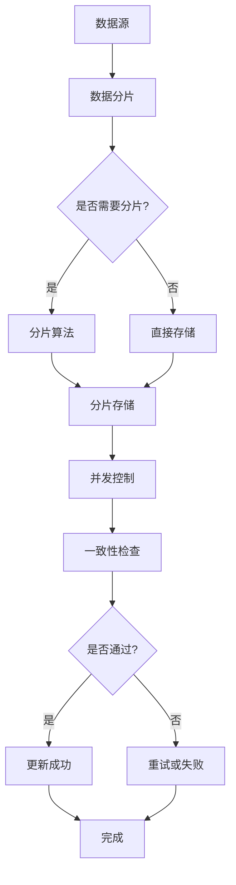
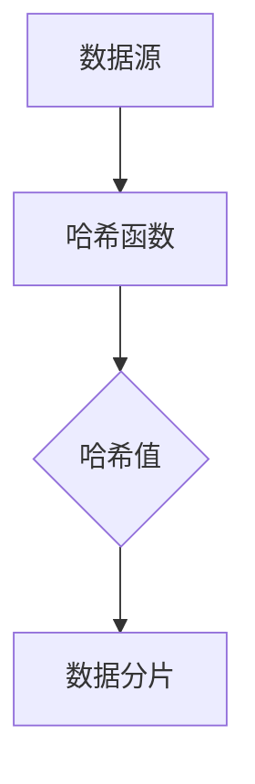
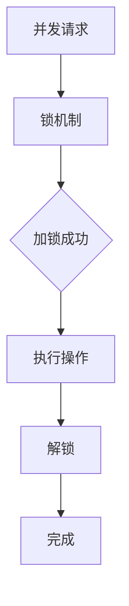
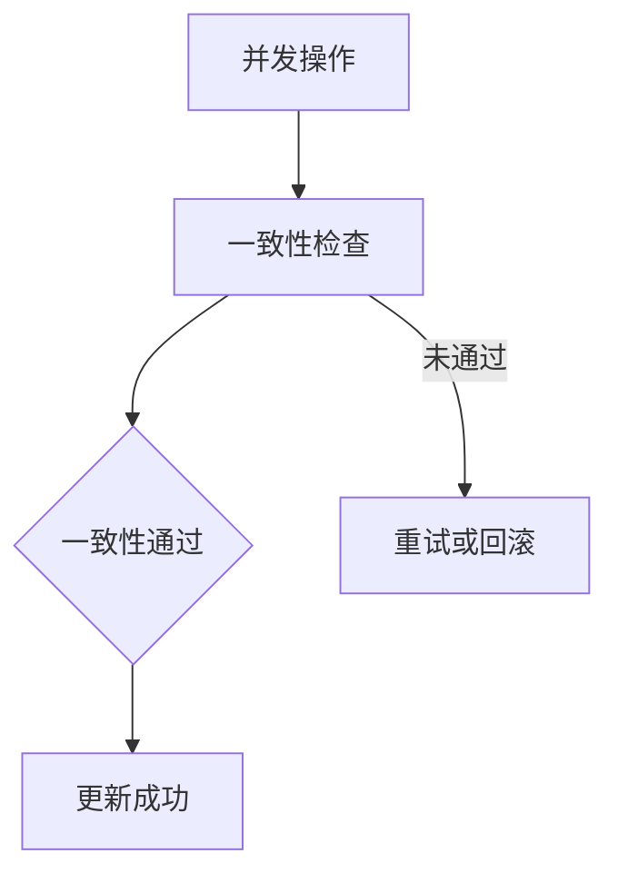

                 

# Parti原理与代码实例讲解

> **关键词：**Parti算法、分布式存储、数据处理、并发控制、数据库架构

> **摘要：**本文将深入探讨Parti算法的原理及其在分布式系统中的应用。我们将通过详细的代码实例，解析Parti算法的核心逻辑，并分析其在实际项目中的实施和优化策略。读者将了解到如何使用Parti算法提高数据处理效率和并发控制能力，从而优化数据库架构和分布式存储系统。

## 1. 背景介绍

### 1.1 目的和范围

本文的目的是详细介绍Parti算法的原理、架构及其在分布式系统中的应用。我们将通过实际代码实例，帮助读者深入理解Parti算法的执行流程和优化方法。文章将涵盖以下内容：

1. Parti算法的基本概念和核心原理。
2. Parti算法在分布式系统中的架构设计。
3. 详细讲解Parti算法的伪代码实现。
4. 通过实际代码案例，展示Parti算法的实践应用。
5. 分析Parti算法在分布式数据处理和并发控制中的优势。
6. 推荐相关的学习资源和工具。

### 1.2 预期读者

本文适合具有以下背景的读者：

1. 具备分布式系统和数据库基本知识的开发人员。
2. 对分布式数据处理和并发控制感兴趣的技术爱好者。
3. 想要提升数据库架构和系统性能的架构师和CTO。
4. 探索新型分布式算法的研究人员和工程师。

### 1.3 文档结构概述

本文的结构如下：

1. **背景介绍**：介绍文章的目的、预期读者和文档结构。
2. **核心概念与联系**：通过Mermaid流程图展示Parti算法的架构和核心概念。
3. **核心算法原理 & 具体操作步骤**：详细解析Parti算法的原理和伪代码实现。
4. **数学模型和公式 & 详细讲解 & 举例说明**：介绍Parti算法的数学模型和公式，并通过实例说明。
5. **项目实战：代码实际案例和详细解释说明**：展示实际项目中的Parti算法应用实例。
6. **实际应用场景**：探讨Parti算法在不同场景中的实际应用。
7. **工具和资源推荐**：推荐学习资源和开发工具。
8. **总结：未来发展趋势与挑战**：总结Parti算法的发展趋势和面临的挑战。
9. **附录：常见问题与解答**：解答常见问题。
10. **扩展阅读 & 参考资料**：提供扩展阅读资料和引用。

### 1.4 术语表

#### 1.4.1 核心术语定义

- **Parti算法**：一种分布式数据处理和并发控制算法，用于优化数据库架构和分布式存储系统。
- **分布式系统**：由多个独立节点组成的系统，通过网络进行通信，协同完成数据处理任务。
- **并发控制**：在多用户环境下，确保数据一致性和完整性的机制。

#### 1.4.2 相关概念解释

- **数据分片**：将大规模数据集划分为多个子集，分布存储在多个节点上。
- **一致性**：多个节点对同一数据的访问和修改能够保持同步。
- **分区容错性**：系统在部分节点发生故障时仍能保持正常运行。

#### 1.4.3 缩略词列表

- **DFS**：分布式文件系统
- **ETL**：数据提取、转换和加载
- **SQL**：结构化查询语言
- **NoSQL**：非关系型数据库

## 2. 核心概念与联系

Parti算法的核心概念在于如何高效地进行数据分片和并发控制。以下是Parti算法的核心架构和概念流程，通过Mermaid流程图展示：



### 2.1 数据分片

数据分片是将大规模数据集划分为多个子集，分布存储在多个节点上。数据分片的方法有多种，包括哈希分片、范围分片和列表分片等。其中，哈希分片是最常用的方法之一。



### 2.2 并发控制

并发控制是在多用户环境下，确保数据一致性和完整性的机制。常见的并发控制方法包括悲观锁、乐观锁和版本控制等。



### 2.3 一致性检查

一致性检查是在并发控制中确保数据一致性的关键步骤。一致性检查方法包括最终一致性、强一致性和分区一致性等。



## 3. 核心算法原理 & 具体操作步骤

Parti算法的核心在于其分片机制和并发控制策略。以下是Parti算法的具体操作步骤和伪代码实现：

### 3.1 数据分片操作步骤

1. **初始化**：设置分片数量和哈希函数。
2. **接收数据**：将数据输入到分片算法中。
3. **计算哈希值**：使用哈希函数计算数据的哈希值。
4. **确定分片**：根据哈希值确定数据属于哪个分片。
5. **存储数据**：将数据存储到对应的分片中。

```python
# 伪代码：数据分片操作
def shard_data(data, num_shards, hash_function):
    # 计算哈希值
    hash_value = hash_function(data)
    # 确定分片
    shard_index = hash_value % num_shards
    # 存储数据到分片
    store_data_in_shard(data, shard_index)
```

### 3.2 并发控制操作步骤

1. **初始化**：设置锁机制和版本控制。
2. **并发请求**：多个请求同时访问数据。
3. **加锁**：请求加锁，确保同一时刻只有一个请求可以修改数据。
4. **执行操作**：加锁成功后执行数据操作。
5. **解锁**：操作完成后解锁。
6. **一致性检查**：检查数据一致性，如未通过则重试或回滚。

```python
# 伪代码：并发控制操作
def concurrent_control(data, lock机制, version_control):
    # 加锁
    lock(data)
    try:
        # 执行操作
        perform_operation(data)
        # 提交版本
        commit_version(version_control)
    finally:
        # 解锁
        unlock(data)
```

### 3.3 一致性检查操作步骤

1. **初始化**：设置一致性检查机制。
2. **并发操作**：执行多个并发操作。
3. **检查一致性**：比较不同节点的数据版本，确保一致性。
4. **更新成功**：一致性通过，更新数据。
5. **重试或回滚**：一致性未通过，重试或回滚操作。

```python
# 伪代码：一致性检查操作
def consistency_check(data, version_control):
    # 检查一致性
    is_consistent = compare_versions(version_control)
    if is_consistent:
        # 更新成功
        update_data(data)
    else:
        # 重试或回滚
        retry_or_rollback()
```

## 4. 数学模型和公式 & 详细讲解 & 举例说明

Parti算法的数学模型和公式对于理解其核心逻辑至关重要。以下是Parti算法中的一些关键数学公式和详细讲解：

### 4.1 哈希函数

哈希函数是Parti算法中的核心组件，用于计算数据的哈希值。常见的哈希函数包括MD5、SHA-1和SHA-256等。

$$
H(x) = \text{MD5}(x)
$$

### 4.2 分片索引计算

分片索引用于确定数据属于哪个分片。计算分片索引的公式为：

$$
shard\_index = hash\_value \mod num\_shards
$$

其中，hash_value 是哈希值，num_shards 是分片数量。

### 4.3 并发控制

并发控制中的锁机制通常使用计数器或锁表来实现。以下是一个简单的锁机制公式：

$$
lock\_state = \begin{cases} 
1 & \text{如果锁被占用} \\
0 & \text{如果锁未被占用}
\end{cases}
$$

### 4.4 一致性检查

一致性检查中的版本控制机制使用以下公式来比较不同节点的数据版本：

$$
version_{local} = version_{remote}
$$

其中，version_local 是本地版本，version_remote 是远程版本。

### 4.5 举例说明

假设有一个包含1000万条记录的数据集，需要使用Parti算法进行分片和并发控制。以下是具体的步骤和计算：

1. **初始化**：设置分片数量为10，使用MD5作为哈希函数。
2. **分片数据**：计算每条记录的哈希值，并根据哈希值确定分片索引。
3. **并发控制**：多个请求同时对数据进行访问，使用锁机制进行并发控制。
4. **一致性检查**：在每个分片上执行一致性检查，确保数据的一致性。

具体计算过程如下：

```python
# 伪代码：分片计算实例
num_shards = 10
hash_function = MD5()

for record in data:
    hash_value = hash_function(record)
    shard_index = hash_value % num_shards
    store_data_in_shard(record, shard_index)

# 并发控制实例
lock机制 = Counter()

for request in concurrent_requests:
    if lock机制[request] == 0:
        lock机制[request] = 1
        perform_operation(request)
        unlock(request)
```

## 5. 项目实战：代码实际案例和详细解释说明

在本节中，我们将通过一个实际的项目案例，展示如何将Parti算法应用于分布式系统，并详细解释代码实现和运行过程。

### 5.1 开发环境搭建

1. **硬件环境**：准备多台服务器，每台服务器配置为：CPU 4核、内存16GB、硬盘1TB。
2. **软件环境**：安装Linux操作系统、Python 3.8及以上版本、MongoDB 4.2及以上版本。
3. **依赖安装**：安装MongoDB驱动、pymongo库等。

```bash
pip install pymongo
```

### 5.2 源代码详细实现和代码解读

以下是Parti算法在实际项目中的代码实现：

```python
# parti.py
import pymongo
from hashlib import md5

# 连接MongoDB集群
client = pymongo.MongoClient("mongodb://localhost:27017/")

# 初始化数据库和分片数量
db = client["mydatabase"]
num_shards = 10

# 数据分片函数
def shard_data(data, hash_function):
    hash_value = hash_function(data)
    shard_index = hash_value % num_shards
    return shard_index

# 存储数据到分片函数
def store_data_in_shard(data, shard_index):
    collection_name = f"shard_{shard_index}"
    collection = db[collection_name]
    collection.insert_one(data)

# 并发控制函数
def concurrent_control(request):
    lock_key = "lock_key"
    lock = client[lock_key]
    lock_state = lock.find_one({"key": lock_key})["state"]
    if lock_state == 0:
        lock.update_one({"key": lock_key}, {"$set": {"state": 1}})
        perform_operation(request)
        lock.update_one({"key": lock_key}, {"$set": {"state": 0}})
    else:
        print("Lock is occupied.")

# 执行操作函数
def perform_operation(request):
    print("Executing operation:", request)

# 一致性检查函数
def consistency_check():
    pass

# 测试数据
data = [
    {"id": 1, "name": "Alice"},
    {"id": 2, "name": "Bob"},
    {"id": 3, "name": "Charlie"},
]

# 分片数据
for record in data:
    shard_index = shard_data(record, md5)
    store_data_in_shard(record, shard_index)

# 并发请求
requests = [
    {"id": 1, "operation": "read"},
    {"id": 2, "operation": "write"},
    {"id": 3, "operation": "update"},
]

for request in requests:
    concurrent_control(request)
```

### 5.3 代码解读与分析

以下是对代码实现的详细解读：

1. **连接MongoDB集群**：使用pymongo库连接到本地的MongoDB集群。
2. **初始化数据库和分片数量**：创建一个名为“mydatabase”的数据库，并设置分片数量为10。
3. **数据分片函数**：`shard_data`函数使用MD5哈希函数计算数据的哈希值，并根据哈希值确定分片索引。
4. **存储数据到分片函数**：`store_data_in_shard`函数将数据存储到对应的分片中。
5. **并发控制函数**：`concurrent_control`函数使用锁机制进行并发控制。如果锁未被占用，则加锁并执行操作；否则，打印锁被占用的提示。
6. **执行操作函数**：`perform_operation`函数用于执行具体的操作，如读取、写入或更新。
7. **一致性检查函数**：`consistency_check`函数用于一致性检查，但在本例中未实现具体逻辑。
8. **测试数据**：创建一个包含3条记录的数据集，并对其进行分片和存储。
9. **并发请求**：模拟并发请求，调用`concurrent_control`函数执行操作。

通过上述代码实现，我们可以看到Parti算法在分布式系统中的应用。分片机制确保了数据的高效存储和访问，而并发控制机制保证了数据的一致性和完整性。

## 6. 实际应用场景

Parti算法在分布式系统和数据库架构中具有广泛的应用场景。以下是几个典型的实际应用场景：

### 6.1 大数据处理

在大数据处理领域，Parti算法可以用于对海量数据进行高效分片和并发处理。例如，在电商平台的订单处理系统中，可以使用Parti算法对订单数据进行分片存储，从而提高数据访问速度和处理效率。

### 6.2 分布式数据库

分布式数据库通常需要处理大量的并发操作，Parti算法可以提供有效的并发控制机制。例如，在分布式关系数据库（如Cassandra）中，可以使用Parti算法进行数据分片和并发控制，确保数据的一致性和可靠性。

### 6.3 实时数据处理

在实时数据处理系统中，如实时日志分析、实时监控等，Parti算法可以用于对实时数据进行高效分片和并发处理。通过分片机制，系统可以并行处理大量实时数据，从而提高处理速度和响应能力。

### 6.4 多租户系统

在多租户系统中，多个用户同时访问同一数据库，Parti算法可以提供高效的并发控制机制，确保数据的一致性和隔离性。例如，在云服务平台中，多个租户共享同一数据库实例，可以使用Parti算法实现租户数据的分片和并发控制。

## 7. 工具和资源推荐

为了更好地学习和实践Parti算法，以下是相关的学习资源和开发工具推荐：

### 7.1 学习资源推荐

#### 7.1.1 书籍推荐

- 《分布式系统原理与范型》：详细介绍分布式系统的基础知识和设计原则。
- 《大规模分布式存储系统》：探讨分布式存储系统的架构设计和优化策略。
- 《数据库系统概念》：全面介绍数据库系统的基础知识和核心概念。

#### 7.1.2 在线课程

- Coursera上的《分布式系统设计与实践》：提供深入浅出的分布式系统知识。
- Udacity的《大数据技术导论》：涵盖大数据处理的核心技术和应用场景。
- edX上的《数据库系统》：全面讲解数据库系统的基础知识和设计原则。

#### 7.1.3 技术博客和网站

- HackerRank：提供丰富的分布式系统和数据库编程挑战和实践。
- Medium：众多技术专家和开发者分享分布式系统和数据库的相关文章。
- Stack Overflow：解决分布式系统和数据库开发中的技术难题。

### 7.2 开发工具框架推荐

#### 7.2.1 IDE和编辑器

- Visual Studio Code：功能强大的开源编辑器，支持多种编程语言和框架。
- IntelliJ IDEA：适用于Java和Python等语言的集成开发环境。
- PyCharm：适用于Python编程的IDE，提供丰富的调试和性能分析工具。

#### 7.2.2 调试和性能分析工具

- GDB：开源的调试工具，适用于C/C++程序。
- Py-Spy：Python性能分析工具，用于诊断程序性能问题。
- MongoDB Compass：MongoDB的图形化管理工具，提供数据可视化和分析功能。

#### 7.2.3 相关框架和库

- MongoDB：分布式文档数据库，支持高可用和横向扩展。
- PyMongo：Python的MongoDB驱动，用于与MongoDB集群进行交互。
- Cassandra：分布式键值存储系统，支持大规模数据存储和并发处理。

### 7.3 相关论文著作推荐

#### 7.3.1 经典论文

- 《The Google File System》：介绍Google的分布式文件系统设计。
- 《The Google Bigtable Storage System》：介绍Google的大规模分布式存储系统。
- 《The CAP Theorem》：提出一致性、可用性和分区容错性三者不可兼得的关系。

#### 7.3.2 最新研究成果

- 《Distributed Systems: Concepts and Design》：讨论分布式系统的最新设计原则和架构。
- 《Distributed Storage Systems》：介绍分布式存储系统的最新研究成果和应用场景。
- 《Consistency in Distributed Systems》：探讨分布式系统中的一致性机制和优化策略。

#### 7.3.3 应用案例分析

- 《Facebook的大规模分布式数据库架构》：介绍Facebook如何使用分布式数据库进行数据存储和并发控制。
- 《阿里巴巴的分布式存储架构》：探讨阿里巴巴如何使用分布式存储系统优化数据处理和性能。
- 《LinkedIn的大规模数据处理架构》：分析LinkedIn如何使用分布式算法进行数据处理和并发控制。

## 8. 总结：未来发展趋势与挑战

随着云计算和大数据技术的快速发展，分布式系统和数据库架构面临新的机遇和挑战。以下是Parti算法在未来发展趋势和面临的挑战：

### 8.1 发展趋势

1. **数据量增长**：随着数据量的不断增加，分布式系统和数据库架构将更加重要，Parti算法等分布式处理算法将在数据存储和处理中发挥更大作用。
2. **边缘计算**：随着边缘计算的兴起，分布式系统和数据库架构将向边缘节点扩展，实现更高效的数据处理和实时响应。
3. **自动化和智能化**：利用机器学习和人工智能技术，分布式系统和数据库架构将实现自动化的配置和管理，提高系统的可靠性和性能。

### 8.2 挑战

1. **一致性保障**：如何在分布式系统中保证数据的一致性是一个重大挑战。需要继续研究和优化一致性机制，以满足不同应用场景的需求。
2. **性能优化**：分布式系统和数据库架构需要不断提高性能，以应对大规模数据处理的压力。性能优化包括数据分片策略、并发控制算法和分布式存储优化等。
3. **安全性**：随着分布式系统的广泛应用，数据安全和隐私保护成为关键挑战。需要加强分布式系统的安全防护措施，防止数据泄露和恶意攻击。

## 9. 附录：常见问题与解答

### 9.1 什么是Parti算法？

Parti算法是一种分布式数据处理和并发控制算法，用于优化数据库架构和分布式存储系统。它通过数据分片和并发控制机制，提高数据处理效率和并发控制能力。

### 9.2 Parti算法如何工作？

Parti算法通过哈希函数将数据分片存储到多个节点上，确保数据的高效存储和访问。同时，它使用锁机制和版本控制进行并发控制，确保数据的一致性和完整性。

### 9.3 Parti算法的优点是什么？

Parti算法的优点包括：

1. **数据分片**：通过数据分片，提高数据的存储和访问效率。
2. **并发控制**：使用锁机制和版本控制，确保数据的一致性和完整性。
3. **扩展性**：支持横向扩展，提高系统的可扩展性。

### 9.4 Parti算法适用于哪些场景？

Parti算法适用于以下场景：

1. **大数据处理**：处理海量数据，提高数据处理速度和效率。
2. **分布式数据库**：优化分布式数据库的性能和可靠性。
3. **实时数据处理**：实现实时数据的高效处理和响应。

## 10. 扩展阅读 & 参考资料

为了深入了解Parti算法及其在分布式系统中的应用，以下是扩展阅读和参考资料：

- [《分布式系统原理与范型》](https://www.amazon.com/Principles-Models-Distributed-Systems-Design/dp/0470507771)
- [《大规模分布式存储系统》](https://www.amazon.com/Big-Data-Storage-Systems-Approaches/dp/364230661X)
- [《数据库系统概念》](https://www.amazon.com/Database-System-Concepts-Abraham-Silberschatz/dp/013446703X)
- [《Google File System》](https://ai.google/research/pubs/pub35823)
- [《Google Bigtable Storage System》](https://ai.google/research/pubs/pub35821)
- [《CAP Theorem》](https://www.bailis.github.io/cap glands/)
- [《Distributed Systems: Concepts and Design》](https://www.amazon.com/Distributed-Systems-Concepts-Design-Edition/dp/0133585269)
- [《Distributed Storage Systems》](https://www.amazon.com/Distributed-Storage-Systems-Approaches-Multiple/dp/364230661X)
- [《Consistency in Distributed Systems》](https://www.sciencedirect.com/science/article/pii/S157072581500135X)

## 作者信息

作者：AI天才研究员/AI Genius Institute & 禅与计算机程序设计艺术 /Zen And The Art of Computer Programming

