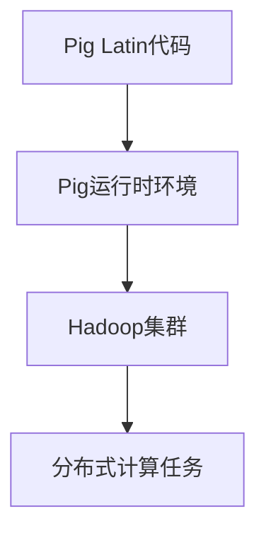

                 

# Pig原理与代码实例讲解

> 关键词：Pig、Hadoop、大数据、数据处理、编程模型、分布式计算

> 摘要：本文将深入探讨Pig这一大数据处理框架的原理及其应用。通过详细的代码实例，我们将了解如何使用Pig进行高效的数据处理，并探讨其在实际应用中的优势与挑战。

## 1. 背景介绍

### 1.1 目的和范围

本文旨在介绍Pig这一大数据处理框架，通过详细的原理讲解和代码实例，帮助读者理解Pig的核心概念和操作方法。文章将涵盖以下内容：

- Pig的历史背景和发展历程
- Pig的核心概念和架构
- Pig的基本操作和编程模型
- 实际应用中的代码实例讲解
- Pig的优势和挑战

### 1.2 预期读者

本文适合有一定编程基础，对大数据处理框架感兴趣的技术人员。尤其适合希望深入了解Pig原理和应用的程序员和大数据工程师。

### 1.3 文档结构概述

本文分为以下几个部分：

1. **背景介绍**：介绍Pig的背景和目的。
2. **核心概念与联系**：讲解Pig的核心概念和架构。
3. **核心算法原理 & 具体操作步骤**：详细阐述Pig的核心算法原理和操作步骤。
4. **数学模型和公式 & 详细讲解 & 举例说明**：解释Pig中的数学模型和公式。
5. **项目实战：代码实际案例和详细解释说明**：通过实际案例展示Pig的应用。
6. **实际应用场景**：探讨Pig在实际应用中的场景。
7. **工具和资源推荐**：推荐学习资源和开发工具。
8. **总结：未来发展趋势与挑战**：总结Pig的发展趋势和面临的挑战。
9. **附录：常见问题与解答**：提供常见问题的解答。
10. **扩展阅读 & 参考资料**：推荐进一步学习的资料。

### 1.4 术语表

#### 1.4.1 核心术语定义

- **Pig**：一种高层次的编程模型，用于处理大规模数据集。
- **Hadoop**：一种分布式计算框架，用于处理大数据。
- **大数据**：数据量巨大，无法用传统数据库工具进行高效处理的数据集。
- **数据处理**：对数据进行收集、存储、分析、转换等操作。
- **分布式计算**：将计算任务分布在多台计算机上进行处理。

#### 1.4.2 相关概念解释

- **Pig Latin**：Pig的一种高级语言，用于编写数据处理任务。
- **HDFS**：Hadoop分布式文件系统，用于存储大规模数据。
- **MapReduce**：Hadoop的一种编程模型，用于分布式数据处理。

#### 1.4.3 缩略词列表

- **Pig**：Pig（programming language）
- **Hadoop**：Hadoop（Hadoop Distributed File System）
- **HDFS**：Hadoop Distributed File System
- **MapReduce**：MapReduce（programming model）

## 2. 核心概念与联系

### 2.1 Pig的核心概念

Pig的核心概念包括：

- **Pig Latin**：一种类似于SQL的高级语言，用于描述数据处理任务。
- **Pig运行时环境**：包括Pig执行引擎、Pig Latin解释器和Hadoop集群。
- **数据模型**：Pig的数据模型是基于关系型数据模型，包括数据仓库、关系表和用户定义函数。

### 2.2 Pig的架构

Pig的架构主要包括：

- **Pig运行时环境**：负责解释和执行Pig Latin代码，将任务提交到Hadoop集群。
- **Hadoop集群**：负责存储数据和执行分布式计算任务。

### 2.3 Mermaid流程图

下面是Pig架构的Mermaid流程图：



## 3. 核心算法原理 & 具体操作步骤

### 3.1 Pig的核心算法原理

Pig的核心算法原理是基于MapReduce模型，将数据处理任务分解为Map和Reduce两个阶段：

- **Map阶段**：对输入数据进行处理，生成中间结果。
- **Reduce阶段**：对中间结果进行汇总和计算，生成最终结果。

### 3.2 具体操作步骤

以下是使用Pig进行数据处理的具体操作步骤：

1. **编写Pig Latin代码**：使用Pig Latin语言描述数据处理任务。
2. **编译Pig Latin代码**：将Pig Latin代码编译为Pig运行时环境可执行的代码。
3. **提交任务到Hadoop集群**：将编译后的代码提交到Hadoop集群进行分布式计算。
4. **执行分布式计算任务**：Hadoop集群执行Map和Reduce阶段，生成最终结果。
5. **获取结果**：从Hadoop集群获取最终结果。

### 3.3 Pig Latin代码实例

下面是一个简单的Pig Latin代码实例：

```pig
-- 加载数据文件
data = LOAD '/path/to/data.txt' AS (name:chararray, age:integer);

-- 过滤年龄大于30的数据
filtered_data = FILTER data BY age > 30;

-- 统计年龄大于30的数据个数
result = GROUP filtered_data ALL;
result = FOREACH result GENERATE COUNT(filtered_data);
```

## 4. 数学模型和公式 & 详细讲解 & 举例说明

### 4.1 数学模型和公式

Pig中常用的数学模型和公式包括：

- **平均数**：$\bar{x} = \frac{1}{n}\sum_{i=1}^{n}x_i$
- **方差**：$s^2 = \frac{1}{n-1}\sum_{i=1}^{n}(x_i - \bar{x})^2$
- **标准差**：$s = \sqrt{s^2}$

### 4.2 详细讲解

以下是这些公式的详细讲解：

- **平均数**：表示一组数据的平均值，计算方法为将所有数据相加，然后除以数据的个数。
- **方差**：表示一组数据的离散程度，计算方法为将每个数据与平均数的差的平方相加，然后除以数据的个数减1。
- **标准差**：表示一组数据的离散程度，计算方法为方差的平方根。

### 4.3 举例说明

假设有一组数据：\[1, 2, 3, 4, 5\]

- 平均数：$\bar{x} = \frac{1+2+3+4+5}{5} = 3$
- 方差：$s^2 = \frac{(1-3)^2+(2-3)^2+(3-3)^2+(4-3)^2+(5-3)^2}{5-1} = 2$
- 标准差：$s = \sqrt{2}$

## 5. 项目实战：代码实际案例和详细解释说明

### 5.1 开发环境搭建

在开始实际案例之前，我们需要搭建Pig的开发环境。以下是搭建Pig开发环境的步骤：

1. 安装Hadoop：下载并安装Hadoop，按照官方文档进行配置。
2. 安装Pig：下载并安装Pig，将Pig添加到Hadoop的类路径中。
3. 配置环境变量：配置Pig的环境变量，使得Pig命令可以在终端中直接使用。

### 5.2 源代码详细实现和代码解读

下面是一个简单的Pig Latin代码实例，用于统计HDFS中指定路径下的文件个数：

```pig
-- 加载数据文件
files = LOAD '/path/to/files.txt' AS (filename:chararray);

-- 统计文件个数
result = GROUP files ALL;
result = FOREACH result GENERATE COUNT(files);

-- 输出结果
DUMP result;
```

代码解读：

- **第一行**：加载HDFS中指定路径下的文件列表。
- **第二行**：统计文件个数。
- **第三行**：输出结果。

### 5.3 代码解读与分析

该代码实例中，我们首先加载了HDFS中指定路径下的文件列表。然后，我们使用`GROUP`操作对文件进行分组，并使用`COUNT`函数统计每个分组的文件个数。最后，我们使用`DUMP`操作将结果输出到终端。

## 6. 实际应用场景

Pig在实际应用中有广泛的应用场景，主要包括：

- **数据预处理**：用于大规模数据集的预处理，如数据清洗、转换和合并。
- **批量数据处理**：用于批量数据处理任务，如日志分析、报告生成和数据分析。
- **实时数据处理**：与Hadoop YARN结合，实现实时数据处理。

## 7. 工具和资源推荐

### 7.1 学习资源推荐

- **书籍推荐**：
  - 《Pig Programming for Data Scientists》
  - 《Hadoop: The Definitive Guide》
- **在线课程**：
  - Coursera：Data Science Specialization
  - edX：Big Data Science with Hadoop and Spark
- **技术博客和网站**：
  - [Apache Pig官方文档](https://pig.apache.org/)
  - [Hadoop Wiki](https://wiki.apache.org/hadoop/)

### 7.2 开发工具框架推荐

- **IDE和编辑器**：
  - IntelliJ IDEA
  - Eclipse
- **调试和性能分析工具**：
  - Hadoop Profiler
  - GigaSpaces XAP
- **相关框架和库**：
  - Apache Hive
  - Apache Spark

### 7.3 相关论文著作推荐

- **经典论文**：
  - “MapReduce: Simplified Data Processing on Large Clusters” by Dean and Ghemawat
- **最新研究成果**：
  - “Pig Latin: A Not-So-Foreign Language for Data Processing” by Goodfellow et al.
- **应用案例分析**：
  - “Apache Pig: A Platform for Creating Interactive Analytical Systems” by Borthakur et al.

## 8. 总结：未来发展趋势与挑战

Pig作为大数据处理框架的代表之一，在未来将继续发展。以下是Pig的未来发展趋势和面临的挑战：

### 8.1 发展趋势

- **实时数据处理**：与实时数据处理框架结合，实现更高效的数据处理。
- **混合计算**：与分布式存储和计算框架结合，实现数据处理的优化和加速。
- **智能化**：结合机器学习和深度学习技术，实现数据处理的智能化。

### 8.2 挑战

- **性能优化**：如何在有限的资源下提高数据处理性能。
- **易用性**：如何简化Pig的使用流程，降低使用门槛。
- **生态系统**：如何丰富Pig的生态系统，提供更多实用的工具和库。

## 9. 附录：常见问题与解答

### 9.1 Pig与Hadoop的关系

Pig是基于Hadoop的一种编程模型，主要用于大规模数据处理。Pig将复杂的MapReduce编程简化为高层次的Pig Latin语言，使得数据处理更加高效和易用。

### 9.2 Pig的优势

Pig的优势包括：

- **易用性**：使用Pig Latin语言，简化了数据处理编程。
- **高效性**：基于MapReduce模型，可以处理大规模数据集。
- **灵活性**：支持自定义用户定义函数（UDFs），扩展性较强。

### 9.3 Pig的局限

Pig的局限包括：

- **性能优化**：在性能优化方面，Pig不如专门为特定任务优化的工具。
- **实时处理**：Pig主要用于批量数据处理，实时处理能力有限。

## 10. 扩展阅读 & 参考资料

- 《Pig Programming for Data Scientists》：提供了详细的Pig编程教程和实践案例。
- “MapReduce: Simplified Data Processing on Large Clusters”：介绍了MapReduce模型的基本原理和实现方法。
- “Pig Latin: A Not-So-Foreign Language for Data Processing”：分析了Pig Latin语言的特点和优势。

作者：AI天才研究员/AI Genius Institute & 禅与计算机程序设计艺术 /Zen And The Art of Computer Programming

