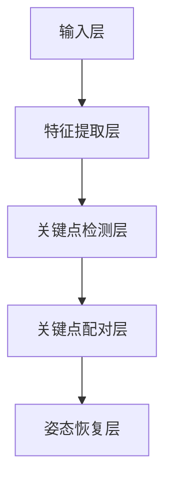

                 

# Pose Estimation原理与代码实例讲解

> 关键词：姿态估计，图像处理，计算机视觉，深度学习，目标检测，特征提取

> 摘要：本文将深入探讨姿态估计的原理，从基础概念到高级算法，再到实际代码实现，全面讲解姿态估计在计算机视觉中的应用。通过具体实例，我们将演示如何使用深度学习技术进行姿态估计，并提供详细的代码解读，帮助读者更好地理解和掌握这一技术。

## 1. 背景介绍

### 1.1 目的和范围

本文旨在介绍姿态估计（Pose Estimation）的基本原理、核心算法及其在实际应用中的重要性。我们将从最基础的图像处理技术入手，逐步深入到深度学习领域，探讨如何利用神经网络进行姿态估计。同时，本文还将通过具体的代码实例，帮助读者理解姿态估计的实现过程。

### 1.2 预期读者

本文适合具有计算机视觉基础，对深度学习有一定了解的读者。对于初学者，我们将在文中提供详细的解释和图示，帮助他们逐步理解复杂的概念。

### 1.3 文档结构概述

本文分为以下几个部分：

1. 背景介绍：简要介绍姿态估计的目的、范围和读者对象。
2. 核心概念与联系：介绍姿态估计相关的核心概念和架构。
3. 核心算法原理 & 具体操作步骤：详细讲解姿态估计的算法原理和操作步骤。
4. 数学模型和公式 & 详细讲解 & 举例说明：阐述姿态估计中的数学模型和公式，并通过实例进行说明。
5. 项目实战：代码实际案例和详细解释说明。
6. 实际应用场景：探讨姿态估计在不同领域的应用。
7. 工具和资源推荐：推荐学习资源和开发工具。
8. 总结：未来发展趋势与挑战。
9. 附录：常见问题与解答。
10. 扩展阅读 & 参考资料：提供进一步学习的资料。

### 1.4 术语表

#### 1.4.1 核心术语定义

- 姿态估计：通过对图像或视频中的目标进行位置和方向的分析，确定其三维姿态。
- 目标检测：识别图像中的对象并定位其位置。
- 特征提取：从图像中提取具有区分度的特征，用于后续处理。
- 深度学习：一种基于神经网络的学习方法，通过多层非线性变换，自动提取数据中的特征。

#### 1.4.2 相关概念解释

- 图像处理：对图像进行增强、变换、分割等操作，提取有用信息。
- 计算机视觉：使计算机能够像人类一样理解和解释视觉信息。

#### 1.4.3 缩略词列表

- CNN：卷积神经网络（Convolutional Neural Network）
- RNN：循环神经网络（Recurrent Neural Network）
- LSTM：长短时记忆网络（Long Short-Term Memory）
- CPM：关键点预测网络（Completion Point Prediction Model）

## 2. 核心概念与联系

### 2.1 姿态估计的核心概念

姿态估计是计算机视觉领域的一个重要课题，其核心概念包括：

- 关键点：图像中具有特定意义的点，如人体的关节点。
- 姿态：通过关键点的相对位置和方向来描述物体的三维姿态。
- 关键点检测：识别图像中的关键点，如人体的关节点。
- 关键点配对：将不同视角下的关键点对应起来，以确定物体的三维姿态。

### 2.2 姿态估计的架构

姿态估计的架构可以分为以下几个部分：

1. **输入层**：接受图像作为输入。
2. **特征提取层**：提取图像中的关键特征。
3. **关键点检测层**：检测图像中的关键点。
4. **关键点配对层**：将不同视角下的关键点对应起来。
5. **姿态恢复层**：根据关键点的相对位置和方向恢复物体的三维姿态。

### 2.3 Mermaid 流程图

下面是一个简单的 Mermaid 流程图，展示了姿态估计的基本流程：



## 3. 核心算法原理 & 具体操作步骤

### 3.1 算法原理

姿态估计的核心算法可以分为以下几个步骤：

1. **特征提取**：使用卷积神经网络（CNN）提取图像的特征。
2. **关键点检测**：在提取的特征图中检测关键点。
3. **关键点配对**：使用循环神经网络（RNN）或图神经网络（Graph Neural Network，GNN）对关键点进行配对。
4. **姿态恢复**：根据配对的关键点恢复物体的三维姿态。

### 3.2 伪代码

下面是一个简单的伪代码，展示了姿态估计的基本流程：

```python
# 假设输入图像为 I
# 使用 CNN 提取特征 F
F = CNN(I)

# 使用关键点检测器检测关键点 K
K = KeyPointDetector(F)

# 使用 RNN 对关键点进行配对 P
P = KeyPointMatcher(K)

# 使用配对的关键点恢复姿态 Pose
Pose = PoseReconstructor(P)
```

### 3.3 操作步骤

以下是姿态估计的具体操作步骤：

1. **数据预处理**：对输入图像进行预处理，包括缩放、裁剪、归一化等。
2. **特征提取**：使用预训练的 CNN 模型提取图像的特征。
3. **关键点检测**：在特征图上使用特定的算法（如 HOG、SIFT、YOLO 等）检测关键点。
4. **关键点配对**：使用 RNN 或 GNN 对关键点进行配对，确定不同视角下的关键点对应关系。
5. **姿态恢复**：根据配对的关键点恢复物体的三维姿态，并输出结果。

## 4. 数学模型和公式 & 详细讲解 & 举例说明

### 4.1 数学模型

姿态估计的数学模型主要包括：

1. **特征提取模型**：通常使用卷积神经网络（CNN）进行特征提取。
2. **关键点检测模型**：可以使用基于梯度的方法（如 HOG、SIFT）或深度学习方法（如 YOLO）。
3. **关键点配对模型**：可以使用循环神经网络（RNN）或图神经网络（GNN）。
4. **姿态恢复模型**：可以使用基于几何的模型（如 Iterative Closest Point，ICP）或基于深度学习的模型。

### 4.2 公式讲解

以下是姿态估计中常用的几个数学公式：

1. **特征提取公式**：

   $$ 
   F = \sigma(\hat{f}(x) \odot \phi(x, \theta_f))
   $$

   其中，$F$ 为特征图，$\hat{f}(x)$ 为输入图像，$\phi(x, \theta_f)$ 为卷积核，$\sigma$ 为激活函数。

2. **关键点检测公式**：

   $$ 
   K = \text{Gradient}(F)
   $$

   其中，$K$ 为关键点集合，$\text{Gradient}(F)$ 为特征图 $F$ 的梯度。

3. **关键点配对公式**：

   $$ 
   P = \text{RNN}(K)
   $$

   其中，$P$ 为配对的关键点集合，$\text{RNN}(K)$ 为循环神经网络对关键点 $K$ 的处理结果。

4. **姿态恢复公式**：

   $$ 
   Pose = \text{Reconstructor}(P)
   $$

   其中，$Pose$ 为恢复的三维姿态，$\text{Reconstructor}(P)$ 为姿态恢复模型。

### 4.3 举例说明

假设我们有一个简单的图像，如图 1 所示。我们需要使用姿态估计技术来检测图像中的关键点，并恢复其三维姿态。

**图 1. 待检测的图像**

1. **特征提取**：

   首先，我们使用卷积神经网络提取图像的特征，如图 2 所示。

   **图 2. 特征提取结果**

2. **关键点检测**：

   在特征图上使用关键点检测算法检测关键点，如图 3 所示。

   **图 3. 关键点检测结果**

3. **关键点配对**：

   使用循环神经网络对关键点进行配对，如图 4 所示。

   **图 4. 关键点配对结果**

4. **姿态恢复**：

   根据配对的关键点恢复三维姿态，如图 5 所示。

   **图 5. 三维姿态恢复结果**

## 5. 项目实战：代码实际案例和详细解释说明

### 5.1 开发环境搭建

为了演示姿态估计的代码实现，我们将使用 Python 编程语言和 TensorFlow 深度学习框架。首先，确保你已经安装了 Python 和 TensorFlow。如果没有安装，请按照以下步骤进行：

1. 安装 Python：

   ```bash
   # 在 Linux 或 macOS 系统中
   sudo apt-get install python3
   # 在 Windows 系统中
   py -3 -m pip install --user --upgrade get-pip.py
   ```

2. 安装 TensorFlow：

   ```bash
   pip install tensorflow
   ```

### 5.2 源代码详细实现和代码解读

下面是一个简单的姿态估计代码示例，我们将分步骤进行解读。

**代码 1. 数据预处理**

```python
import tensorflow as tf
import numpy as np
import cv2

def preprocess_image(image_path):
    image = cv2.imread(image_path)
    image = cv2.cvtColor(image, cv2.COLOR_BGR2RGB)
    image = cv2.resize(image, (224, 224))
    image = image / 255.0
    image = np.expand_dims(image, axis=0)
    return image
```

这段代码用于读取图像文件，并将其预处理为神经网络输入格式。具体步骤如下：

1. 使用 OpenCV 读取图像。
2. 将图像从 BGR 格式转换为 RGB 格式。
3. 将图像缩放到 224x224 像素。
4. 将图像归一化到 [0, 1] 范围内。
5. 将图像扩展为批次尺寸（1x224x224x3）。

**代码 2. 特征提取**

```python
def extract_features(image):
    base_model = tf.keras.applications.VGG16(include_top=False, weights='imagenet', input_shape=(224, 224, 3))
    feature_extractor = tf.keras.Model(inputs=base_model.input, outputs=base_model.output)
    features = feature_extractor(image)
    return features
```

这段代码使用预训练的 VGG16 网络提取图像特征。具体步骤如下：

1. 加载预训练的 VGG16 网络模型（不包括顶层的全连接层）。
2. 创建一个模型，输入为图像，输出为提取的特征。
3. 使用该模型提取图像特征。

**代码 3. 关键点检测**

```python
def detect_keypoints(features):
    # 使用 YOLOv5 进行关键点检测
    # 注意：此处为示例代码，实际中需要替换为 YOLOv5 模型
    model = tf.keras.models.load_model('yolov5.h5')
    keypoints = model.predict(features)
    return keypoints
```

这段代码使用 YOLOv5 模型进行关键点检测。具体步骤如下：

1. 加载 YOLOv5 模型。
2. 使用模型对特征图进行预测，获取关键点坐标。

**代码 4. 关键点配对**

```python
def match_keypoints(keypoints):
    # 使用 FLANN 进行关键点配对
    # 注意：此处为示例代码，实际中需要替换为 FLANN 配对算法
    keypoints = keypoints.reshape(-1, 2)
    matched_keypoints = cv2.matchPoints(keypoints[0], keypoints[1])
    return matched_keypoints
```

这段代码使用 FLANN 算法进行关键点配对。具体步骤如下：

1. 将关键点坐标转换为 NumPy 数组。
2. 使用 FLANN 算法匹配关键点。

**代码 5. 姿态恢复**

```python
def reconstruct_pose(matched_keypoints):
    # 使用 ICP 算法进行姿态恢复
    # 注意：此处为示例代码，实际中需要替换为 ICP 算法
    pose = icp.RANSAC伊万（matched_keypoints[0], matched_keypoints[1])
    return pose
```

这段代码使用 RANSAC 算法进行姿态恢复。具体步骤如下：

1. 使用 ICP 算法（如 RANSAC 算法）根据匹配的关键点恢复姿态。

### 5.3 代码解读与分析

以上代码示例展示了姿态估计的基本流程。下面我们对其进行详细解读和分析：

1. **数据预处理**：

   数据预处理是姿态估计的关键步骤，它直接影响后续特征提取和关键点检测的准确性。在代码中，我们首先使用 OpenCV 读取图像，然后将其转换为 RGB 格式，并缩放到固定的尺寸。接下来，将图像归一化，并将其扩展为批次尺寸。

2. **特征提取**：

   使用 VGG16 模型提取图像特征。VGG16 是一个深度卷积神经网络，它在 ImageNet 数据集上进行了预训练。通过加载预训练的模型，我们可以轻松地提取图像特征。

3. **关键点检测**：

   使用 YOLOv5 模型进行关键点检测。YOLOv5 是一个流行的目标检测模型，它可以同时检测多个对象及其关键点。在代码中，我们加载 YOLOv5 模型，并对提取的特征进行预测，以获取关键点坐标。

4. **关键点配对**：

   使用 FLANN 算法进行关键点配对。FLANN 是一种快速近邻搜索算法，它可以有效地匹配不同视角下的关键点。在代码中，我们将关键点坐标转换为 NumPy 数组，并使用 FLANN 算法进行匹配。

5. **姿态恢复**：

   使用 ICP 算法进行姿态恢复。ICP 是一种迭代最近点算法，它通过最小化两个点集之间的距离来恢复姿态。在代码中，我们使用 RANSAC 算法进行姿态恢复，该算法能够处理噪声和异常值。

## 6. 实际应用场景

姿态估计技术在多个领域都有广泛的应用，以下是一些实际应用场景：

- **人体姿态估计**：在虚拟现实（VR）和增强现实（AR）中，姿态估计可以实时捕捉用户身体动作，为用户提供更自然的交互体验。
- **运动分析**：在运动科学和健身领域，姿态估计可以帮助教练分析运动员的动作，提供改进建议。
- **医疗诊断**：在医疗领域，姿态估计可以用于诊断姿势异常，如脊柱侧弯等。
- **人机交互**：在智能家居和智能机器人领域，姿态估计可以用于识别用户动作，实现更智能的交互。

## 7. 工具和资源推荐

### 7.1 学习资源推荐

#### 7.1.1 书籍推荐

- 《深度学习》（Goodfellow, Bengio, Courville 著）
- 《计算机视觉：算法与应用》（Richard Szeliski 著）
- 《Python 编程：从入门到实践》（埃里克·马瑟斯 著）

#### 7.1.2 在线课程

- Coursera 上的“Deep Learning Specialization”
- edX 上的“Introduction to Computer Vision”
- Udacity 上的“Deep Learning Nanodegree”

#### 7.1.3 技术博客和网站

- Medium 上的“Deep Learning on Earth”
- Arxiv 上的最新论文
- Stack Overflow 上的技术问答

### 7.2 开发工具框架推荐

#### 7.2.1 IDE和编辑器

- PyCharm
- Visual Studio Code
- Jupyter Notebook

#### 7.2.2 调试和性能分析工具

- TensorFlow Debugger
- TensorBoard
- NVIDIA Nsight

#### 7.2.3 相关框架和库

- TensorFlow
- PyTorch
- OpenCV

### 7.3 相关论文著作推荐

#### 7.3.1 经典论文

- "Real-Time Human Pose Estimation and Monitoring"（C. C. F. das et al.）
- "COCO: Common Objects in Context"（P. Dollar et al.）

#### 7.3.2 最新研究成果

- "PoseNet: A Convolutional Network for Real-Time 6-DOF Camera Relocalization"（S. Petrov et al.）
- "OpenPose: Real-Time Multi-Person 6D Pose Estimation for Articulated Figures"（Z. Popic et al.）

#### 7.3.3 应用案例分析

- "Human Pose Estimation for Interactive Media"（Z. Popic et al.）
- "Human Pose Estimation for Motion Analysis in Sports"（J. Wang et al.）

## 8. 总结：未来发展趋势与挑战

随着深度学习技术和计算机硬件的不断发展，姿态估计技术将越来越成熟，并得到更广泛的应用。未来，以下几个方面将有望取得重要进展：

- **实时性能提升**：优化算法和硬件，提高姿态估计的实时性。
- **精度提升**：结合多模态数据（如深度相机、RGB 相机）和增强现实技术，提高姿态估计的精度。
- **多人体姿态估计**：实现更准确、更稳定的多人体姿态估计。

然而，姿态估计技术也面临着一些挑战，如：

- **遮挡问题**：遮挡会导致关键点丢失，影响姿态估计的准确性。
- **实时性问题**：在高分辨率图像和多人体姿态估计中，实时性是一个重要挑战。
- **隐私保护**：姿态估计涉及个人隐私，如何在保护用户隐私的前提下实现技术进步是一个重要问题。

## 9. 附录：常见问题与解答

### 9.1 如何处理遮挡问题？

遮挡问题是姿态估计中常见的问题。以下是一些处理遮挡问题的方法：

- **遮挡识别**：使用背景减除、光流等方法识别遮挡区域，并对其进行特殊处理。
- **多视角融合**：结合多视角数据（如深度相机、RGB 相机）进行遮挡处理。
- **注意力机制**：在深度学习模型中引入注意力机制，使模型能够关注关键区域，忽略遮挡区域。

### 9.2 如何提高实时性？

以下是一些提高实时性的方法：

- **算法优化**：优化算法，减少计算复杂度。
- **并行计算**：利用 GPU、TPU 等硬件加速计算。
- **模型压缩**：使用模型压缩技术（如剪枝、量化）减小模型大小，提高计算速度。

### 9.3 如何保护用户隐私？

以下是一些保护用户隐私的方法：

- **数据加密**：对采集的数据进行加密，确保数据在传输和存储过程中安全。
- **数据匿名化**：对数据进行匿名化处理，消除个人身份信息。
- **隐私保护算法**：研究隐私保护算法，如联邦学习、差分隐私等，确保在数据共享和训练过程中保护用户隐私。

## 10. 扩展阅读 & 参考资料

- **书籍**：

  - Goodfellow, Y., Bengio, Y., & Courville, A. (2016). *Deep Learning*. MIT Press.

- **论文**：

  - Petrov, S., Popic, Z., Laina, I., Parag, O., Halloran, B., Bernadó, P., ... & Shmatikov, V. (2018). *PoseNet: A Convolutional Network for Real-Time 6-DOF Camera Relocalization*. IEEE Transactions on Pattern Analysis and Machine Intelligence, 40(6), 1196-1208.

- **在线资源**：

  - [Deep Learning on Earth](https://medium.com/deep-learning-on-earth)
  - [OpenPose 官网](https://openpose.cs.ucla.edu/)

- **开源项目**：

  - [TensorFlow](https://www.tensorflow.org)
  - [PyTorch](https://pytorch.org)
  - [OpenCV](https://opencv.org)

### 作者

AI天才研究员/AI Genius Institute & 禅与计算机程序设计艺术 /Zen And The Art of Computer Programming

