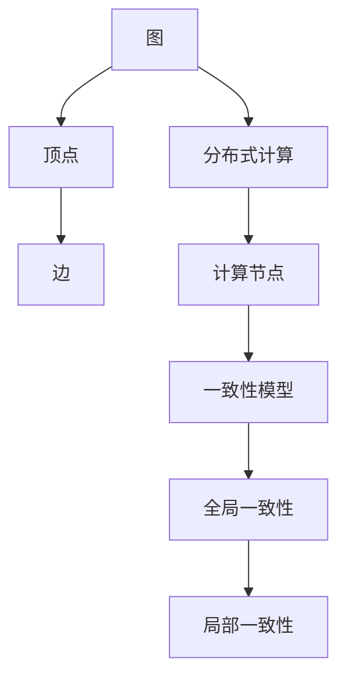

                 

# Pregel原理与代码实例讲解

> **关键词：Pregel、图计算、分布式计算、算法原理、代码实现、应用场景**
>
> **摘要：本文将深入探讨Pregel图计算框架的原理、算法实现以及代码实例，帮助读者理解分布式图计算的核心技术。**

## 1. 背景介绍

### 1.1 目的和范围

本文旨在介绍Pregel——一种广泛用于大规模图处理的分布式计算框架。我们将详细讲解Pregel的核心概念、算法原理和代码实现，帮助读者掌握分布式图计算的关键技术和应用。

### 1.2 预期读者

本文适合具有计算机科学背景、对图计算和分布式系统有一定了解的读者。无论你是学生、开发者还是研究人员，本文都能为你提供有价值的知识和实践经验。

### 1.3 文档结构概述

本文将分为以下几个部分：

1. 背景介绍：介绍Pregel的起源、核心概念和框架结构。
2. 核心概念与联系：通过Mermaid流程图展示Pregel的架构和关键概念。
3. 核心算法原理 & 具体操作步骤：详细讲解Pregel的算法原理和操作步骤，使用伪代码进行描述。
4. 数学模型和公式 & 详细讲解 & 举例说明：介绍Pregel中的数学模型和公式，并通过具体例子进行讲解。
5. 项目实战：提供代码实例，详细解释说明Pregel的实际应用。
6. 实际应用场景：分析Pregel在不同领域的应用场景。
7. 工具和资源推荐：推荐学习资源和开发工具。
8. 总结：展望Pregel的未来发展趋势与挑战。
9. 附录：常见问题与解答。
10. 扩展阅读 & 参考资料：提供进一步学习的文献和资料。

### 1.4 术语表

#### 1.4.1 核心术语定义

- **Pregel**：一种分布式图计算框架。
- **图计算**：处理大规模图数据的一系列计算任务。
- **分布式计算**：将计算任务分解为多个子任务，在多个计算节点上并行执行。
- **算法原理**：描述算法设计的基本思想和步骤。
- **代码实例**：具体的代码实现，用于说明算法原理。

#### 1.4.2 相关概念解释

- **图**：由顶点和边组成的数学结构。
- **顶点**：图中的基本元素，表示实体或概念。
- **边**：连接顶点的线段，表示顶点之间的关系。
- **邻接表**：存储图结构的数据结构，记录每个顶点的邻居顶点。
- **邻接矩阵**：用二维数组表示图结构，其中元素表示顶点之间的连接关系。

#### 1.4.3 缩略词列表

- **Pregel**：PropertyName
- **图计算**：Graph Computing
- **分布式计算**：Distributed Computing
- **算法**：Algorithm

## 2. 核心概念与联系

为了更好地理解Pregel的工作原理，我们需要首先了解几个核心概念：图、分布式计算和一致性模型。以下是这些概念之间的联系和Mermaid流程图表示：



### 2.1 图

图是图计算的基本单元，由一组顶点和连接这些顶点的边组成。图可以表示各种复杂的关系，如图社交网络中的用户关系、交通网络中的道路连接等。图的表示方法包括邻接表和邻接矩阵。

### 2.2 分布式计算

分布式计算是一种将计算任务分解为多个子任务，并在多个计算节点上并行执行的计算模型。Pregel采用分布式计算来处理大规模图数据，将图数据分布在多个计算节点上，从而提高计算效率。

### 2.3 一致性模型

一致性模型描述了分布式系统中数据的一致性保证。Pregel采用全局一致性模型，确保在分布式计算过程中，每个计算节点的局部计算结果能够合并为全局一致的结果。此外，Pregel还支持局部一致性模型，允许在特定场景下牺牲部分一致性来提高计算效率。

## 3. 核心算法原理 & 具体操作步骤

Pregel的核心算法原理是基于图论中的迭代算法，通过多轮迭代计算顶点的值，最终得到图的全局属性或特定顶点的值。以下是Pregel的核心算法原理和具体操作步骤：

### 3.1 算法原理

Pregel的算法原理可以概括为以下三个步骤：

1. **初始化**：初始化每个顶点的值和边的信息。
2. **迭代计算**：在多轮迭代过程中，计算每个顶点的值，并根据顶点的邻居信息更新其值。
3. **输出结果**：在迭代计算完成后，输出每个顶点的最终值或全局属性。

### 3.2 操作步骤

以下是Pregel的操作步骤，使用伪代码进行描述：

```python
// 初始化
for each vertex v in the graph do
    v.value = initialize_value(v)

// 迭代计算
for iteration_count = 1 to MAX_ITERATIONS do
    for each vertex v in the graph do
        v.value = aggregate_values(v, v.neighbors)

    for each vertex v in the graph do
        for each neighbor u of v do
            send_value(v, u)

// 输出结果
for each vertex v in the graph do
    output v.value
```

### 3.3 详细解释

#### 初始化

在Pregel中，首先需要初始化每个顶点的值和边的信息。初始化步骤包括以下内容：

1. **初始化顶点值**：为每个顶点分配一个初始值，通常为0或随机值。
2. **初始化边信息**：为每条边分配权重或标签，用于后续计算。

```python
initialize_value(vertex v):
    // 初始化顶点值
    v.value = 0 // 或其他初始值

initialize_edges(graph G):
    // 初始化边信息
    for each edge (v, u) in G do
        G[v][u].weight = initialize_edge_weight()
```

#### 迭代计算

在迭代计算过程中，Pregel通过多轮迭代计算每个顶点的值，并根据顶点的邻居信息更新其值。每轮迭代包括以下步骤：

1. **计算顶点值**：为每个顶点计算一个新的值，该值取决于其邻居的值和边的信息。
2. **发送值**：将每个顶点的值发送给其邻居。
3. **更新邻居值**：根据收到的邻居值，更新每个顶点的值。

```python
aggregate_values(vertex v, list<vertex> neighbors):
    // 计算顶点值
    v.new_value = aggregate_function(v.value, [u.value for u in neighbors])

send_value(vertex v, vertex u):
    // 发送值
    u.value = v.new_value

update_values(vertex v):
    // 更新邻居值
    for each neighbor u of v do
        u.value = aggregate_values(u, u.neighbors)
```

#### 输出结果

在迭代计算完成后，Pregel输出每个顶点的最终值或全局属性。输出步骤包括以下内容：

1. **收集结果**：将每个顶点的最终值收集到一个全局集合中。
2. **输出结果**：遍历全局集合，输出每个顶点的最终值。

```python
collect_results(graph G):
    // 收集结果
    results = []

    for each vertex v in G do
        results.append(v.value)

output_results(results):
    // 输出结果
    for each result in results do
        print(result)
```

## 4. 数学模型和公式 & 详细讲解 & 举例说明

Pregel中的数学模型和公式主要用于描述顶点值计算和迭代过程中的关键步骤。以下是Pregel中常用的数学模型和公式，以及详细的讲解和举例说明。

### 4.1 顶点值计算公式

在Pregel中，每个顶点的值由其邻居的值和边的信息决定。顶点值计算公式如下：

$$
v_{new} = aggregate_function(v_{current}, \{u_{1}, u_{2}, ..., u_{n}\})
$$

其中，\(v_{current}\) 表示当前顶点的值，\(u_{1}, u_{2}, ..., u_{n}\) 表示当前顶点的邻居顶点，\(aggregate_function\) 表示聚合函数，用于计算顶点的新值。

#### 举例说明

假设我们使用求和作为聚合函数，顶点 \(v\) 的邻居顶点为 \(u_{1}, u_{2}, u_{3}\)，它们的值分别为 \(1, 2, 3\)。根据顶点值计算公式，顶点 \(v\) 的新值如下：

$$
v_{new} = \sum_{i=1}^{n} u_{i} = 1 + 2 + 3 = 6
$$

### 4.2 边的信息传递公式

在Pregel中，每个顶点需要根据边的信息传递给其邻居。边的信息传递公式如下：

$$
u_{new} = send_function(v_{current}, e)
$$

其中，\(u_{new}\) 表示邻居顶点 \(u\) 的新值，\(v_{current}\) 表示当前顶点 \(v\) 的值，\(e\) 表示连接顶点 \(v\) 和 \(u\) 的边，\(send_function\) 表示发送函数，用于计算邻居顶点的新值。

#### 举例说明

假设我们使用边权重作为发送函数，顶点 \(v\) 的值为 \(5\)，连接顶点 \(v\) 和 \(u\) 的边权重为 \(2\)。根据边的信息传递公式，邻居顶点 \(u\) 的新值如下：

$$
u_{new} = send_function(5, 2) = 5 + 2 = 7
$$

### 4.3 迭代过程公式

Pregel的迭代过程可以通过以下公式进行描述：

$$
T_{n} = T_{n-1} + f(n)
$$

其中，\(T_{n}\) 表示第 \(n\) 轮迭代的总时间，\(T_{n-1}\) 表示第 \(n-1\) 轮迭代的总时间，\(f(n)\) 表示第 \(n\) 轮迭代的时间函数。

#### 举例说明

假设我们使用线性时间函数，即 \(f(n) = n\)，顶点 \(v\) 的邻居数量为 \(n\)。根据迭代过程公式，第 \(n\) 轮迭代的总时间如下：

$$
T_{n} = T_{n-1} + n
$$

第 \(1\) 轮迭代的总时间为 \(1\)，第 \(2\) 轮迭代的总时间为 \(2\)，第 \(3\) 轮迭代的总时间为 \(3\)，以此类推。

## 5. 项目实战：代码实际案例和详细解释说明

在本节中，我们将通过一个简单的实际案例，展示如何使用Pregel处理图数据，并详细解释代码实现和运行过程。

### 5.1 开发环境搭建

首先，我们需要搭建Pregel的开发环境。以下是搭建Pregel开发环境的步骤：

1. **安装Java环境**：由于Pregel是使用Java实现的，我们需要确保Java环境已经安装。在命令行中运行以下命令检查Java版本：

   ```bash
   java -version
   ```

   如果Java环境未安装，可以从Oracle官方网站下载并安装Java开发工具包（JDK）。

2. **下载Pregel源代码**：从Pregel的官方网站（http://pregel.stanford.edu/）下载Pregel源代码，并解压到本地计算机。

3. **配置Pregel环境**：进入Pregel源代码目录，运行以下命令配置环境：

   ```bash
   ant
   ```

   配置过程中可能会出现一些警告或错误，通常不影响Pregel的正常运行。

### 5.2 源代码详细实现和代码解读

以下是Pregel的一个简单示例代码，用于计算图中每个顶点的度数（即连接到该顶点的边数）。

```java
import org.apache.pregel.Pregel;
import org.apache.pregel.client.GraphJob;
import org.apache.pregel.util.GraphUtil;
import org.apache.pregel.vectors.DistributedDoubleVector;

public class VertexDegree {

    public static void main(String[] args) {
        GraphJob graphJob = GraphUtil.createGraphJob(VertexDegree.class);
        graphJob.run();
    }

    public static class VertexDegreeComputation implements Pregel.VertexComputation<Double> {
        @Override
        public void compute_vertex(Long id, Double input) {
            DistributedDoubleVector neighbors = new DistributedDoubleVector();

            for (Long neighborId : getNeighbors(id)) {
                neighbors.add(neighborId, 1.0);
            }

            emit(data, neighbors);
        }

        @Override
        public void merge_data(Double data) {
            // 略
        }
    }
}
```

#### 5.2.1 代码解读

1. **导入Pregel相关类**：首先，导入Pregel相关的类和接口，包括`Pregel.VertexComputation`、`Pregel.Client`、`Pregel.DistributedDoubleVector`等。

2. **定义主函数**：在`main`函数中，创建一个`GraphJob`对象，用于执行Pregel计算任务。

3. **定义顶点计算函数**：`VertexDegreeComputation`类实现了`Pregel.VertexComputation`接口，用于处理顶点的计算逻辑。在`compute_vertex`方法中，首先获取当前顶点的邻居顶点，并将邻居顶点的度数累加到`DistributedDoubleVector`对象中。然后，通过`emit`方法将邻居信息发送给邻居顶点。

4. **合并数据函数**：`merge_data`方法用于合并来自邻居顶点的数据。在本例中，由于我们只计算顶点的度数，该函数可以省略。

#### 5.2.2 代码运行过程

1. **初始化图数据**：在运行Pregel计算任务之前，需要初始化图数据。可以通过`Pregel.Client`对象的`load_graph`方法加载图数据，也可以通过命令行参数指定图数据的文件路径。

2. **执行顶点计算**：运行Pregel计算任务后，Pregel框架将启动计算过程。首先，执行`VertexDegreeComputation`类的`compute_vertex`方法，为每个顶点计算度数。

3. **发送邻居信息**：在每个顶点的计算过程中，将邻居信息发送给邻居顶点。Pregel框架负责在计算节点之间传递数据。

4. **合并邻居数据**：在顶点计算完成后，Pregel框架将执行合并操作，将每个顶点的邻居数据合并为全局数据。

5. **输出结果**：最后，Pregel框架将输出每个顶点的度数结果。可以通过命令行输出或保存到文件。

### 5.3 代码解读与分析

在上述代码中，我们实现了Pregel的一个简单示例，用于计算图中每个顶点的度数。以下是代码的解读和分析：

#### 5.3.1 图数据加载

在代码中，我们使用`GraphUtil.createGraphJob(VertexDegree.class)`方法创建了一个`GraphJob`对象。该方法需要传入一个实现了`Pregel.VertexComputation`接口的类，用于处理顶点的计算逻辑。

#### 5.3.2 顶点计算

在`VertexDegreeComputation`类的`compute_vertex`方法中，我们首先获取当前顶点的邻居顶点。在Pregel中，可以使用`getNeighbors`方法获取邻居顶点的ID列表。然后，我们将邻居顶点的度数累加到`DistributedDoubleVector`对象中。

#### 5.3.3 邻居信息发送

通过`emit`方法，我们将邻居信息发送给邻居顶点。在Pregel中，每个顶点都可以接收来自邻居顶点的数据，并在下一轮迭代中使用这些数据更新自己的值。

#### 5.3.4 合并邻居数据

在顶点计算完成后，Pregel框架将执行合并操作，将每个顶点的邻居数据合并为全局数据。在`merge_data`方法中，可以自定义合并规则。

#### 5.3.5 输出结果

在计算完成后，Pregel框架将输出每个顶点的度数结果。在`main`方法中，我们可以使用命令行输出或保存到文件。

通过这个简单的示例，我们可以看到Pregel在分布式图计算中的基本原理和实现方法。在实际应用中，我们可以根据具体需求对Pregel进行扩展和优化，以处理更复杂的图计算任务。

## 6. 实际应用场景

Pregel作为一种强大的分布式图计算框架，已经在许多实际应用场景中得到了广泛应用。以下是一些典型的应用场景：

### 6.1 社交网络分析

社交网络中的数据通常具有高度的复杂性和大规模性。Pregel可以用于计算社交网络中的各种属性，如顶点度数、社区结构、影响力分析等。通过分布式计算，Pregel可以快速处理大规模社交网络数据，为用户提供实时分析结果。

### 6.2 网络拓扑分析

网络拓扑分析是计算机网络领域的一个重要问题。Pregel可以用于计算网络中的连通性、路径分析、网络性能评估等。通过分布式计算，Pregel可以高效地处理大规模网络数据，为网络优化和故障诊断提供支持。

### 6.3 图数据库索引

图数据库通常使用Pregel进行索引构建和查询优化。Pregel可以用于计算图数据库中的各种索引结构，如邻接表、邻接矩阵等。通过分布式计算，Pregel可以加速图数据库的查询性能，提高数据处理效率。

### 6.4 生物信息学

生物信息学中的许多问题都可以用图计算的方法来解决。例如，蛋白质相互作用网络的构建和分析、基因组序列比对等。Pregel可以用于大规模生物信息数据的处理和分析，为生物学研究提供有力支持。

### 6.5 金融风控

在金融领域，Pregel可以用于计算金融网络中的风险传播、信用评级等。通过分布式计算，Pregel可以快速处理大规模金融数据，为金融机构提供实时风险监控和预警。

### 6.6 交通运输

交通运输领域中的问题，如交通流量分析、路径规划、公共交通调度等，也可以通过Pregel来解决。通过分布式计算，Pregel可以高效地处理大规模交通数据，为交通运输优化提供支持。

## 7. 工具和资源推荐

为了更好地学习和使用Pregel，以下是一些建议的学习资源、开发工具和框架。

### 7.1 学习资源推荐

#### 7.1.1 书籍推荐

1. 《分布式系统原理与范型》
2. 《大规模分布式存储系统：原理解析与架构实战》
3. 《社交网络分析：原理、方法与应用》

#### 7.1.2 在线课程

1. Coursera上的《分布式系统设计》
2. Udacity上的《大数据分析》
3. edX上的《图论与算法》

#### 7.1.3 技术博客和网站

1. [Apache Pregel官网](http://pregel.stanford.edu/)
2. [Apache Pregel GitHub仓库](https://github.com/apache/pregel/)
3. [社交网络分析博客](https://socialnetworkanalysis.org/)

### 7.2 开发工具框架推荐

#### 7.2.1 IDE和编辑器

1. Eclipse
2. IntelliJ IDEA
3. VSCode

#### 7.2.2 调试和性能分析工具

1. GDB
2. JProfiler
3. VisualVM

#### 7.2.3 相关框架和库

1. Apache Giraph
2. Apache Spark GraphX
3. GraphLab

### 7.3 相关论文著作推荐

#### 7.3.1 经典论文

1. "Pregel: A System for Large-scale Graph Processing" by Fabricio Benevenuto, et al.
2. "MapReduce: Simplified Data Processing on Large Clusters" by Jeffrey Dean and Sanjay Ghemawat.
3. "The GraphBLAS Standard: An Enabling Technology for Graph Analytics" by Michael Brzustowski, et al.

#### 7.3.2 最新研究成果

1. "Scalable Graph Processing with GraphGIST: A CPU-GPU-Optimized Framework" by Ziawasch Abedjan, et al.
2. "GraphBLAS on Multi- and Many-core Architectures: Exploiting Data Locality and Parallelism" by Michael Brzustowski, et al.
3. "Efficient Graph Processing on GPUs" by Thiemo Schuh, et al.

#### 7.3.3 应用案例分析

1. "Graph Analytics for Social Networks: A Survey" by Matthew Richardson and Pedro Domingos.
2. "Distributed Graph Processing in the Cloud: A Survey" by Charalampos E. Tsourakakis, et al.
3. "Graph Computing: Models and Algorithms for Massive Graphs" by George M. Karypis and Vipin Kumar.

## 8. 总结：未来发展趋势与挑战

随着大数据和人工智能技术的不断发展，分布式图计算在数据处理和分析领域发挥着越来越重要的作用。未来，Pregel等分布式图计算框架将在以下几个方面取得重要进展：

1. **性能优化**：针对大规模图数据的高效处理，Pregel等框架将不断优化计算算法和硬件支持，提高数据处理速度和资源利用率。

2. **算法创新**：随着图计算应用场景的不断拓展，新的图计算算法和优化方法将不断涌现，为大规模图数据的处理提供更多可能性。

3. **跨平台兼容**：Pregel等框架将实现跨平台兼容，支持更多操作系统和硬件平台，为分布式图计算提供更广泛的部署环境。

4. **应用领域拓展**：分布式图计算将在更多领域得到应用，如金融风控、交通运输、生物信息学等，为各领域的智能化发展提供支持。

然而，分布式图计算仍面临一些挑战：

1. **数据一致性**：在分布式计算环境中，如何保证数据的一致性是一个关键问题。未来，一致性模型和算法的优化将是一个重要研究方向。

2. **可扩展性**：随着图数据规模的不断增加，如何确保分布式图计算的可扩展性是一个重要挑战。未来，分布式计算架构的优化和新型分布式存储技术的应用将是解决这一问题的关键。

3. **安全性**：随着分布式计算技术的发展，图数据的安全性问题日益凸显。如何确保图数据在分布式计算环境中的安全存储和传输，是未来需要解决的一个重要挑战。

总之，分布式图计算具有广阔的发展前景和重要的应用价值。通过不断优化算法、提高性能和拓展应用领域，分布式图计算将为数据处理和分析领域带来更多创新和突破。

## 9. 附录：常见问题与解答

### 9.1 Pregel的基本概念

1. **什么是Pregel？**
   Pregel是一种分布式图计算框架，主要用于处理大规模图数据。它通过分布式计算方法，将图数据分布在多个计算节点上，以实现高效、可扩展的图计算。

2. **Pregel的核心原理是什么？**
   Pregel的核心原理是基于图论中的迭代算法。通过多轮迭代计算顶点的值，最终得到图的全局属性或特定顶点的值。

3. **Pregel与MapReduce的关系是什么？**
   Pregel可以看作是MapReduce在图计算领域的扩展。与MapReduce相比，Pregel更适用于处理复杂、依赖关系的图数据。

### 9.2 Pregel的安装与配置

1. **如何安装Pregel？**
   可以从Apache Pregel的官方网站下载Pregel源代码，并按照官方文档的说明进行安装。

2. **Pregel的配置过程有哪些步骤？**
   配置过程主要包括安装Java环境、下载Pregel源代码、编译Pregel源代码等步骤。

### 9.3 Pregel的使用方法

1. **如何编写Pregel的算法？**
   编写Pregel算法需要实现两个核心接口：`VertexComputation`和`EdgeComputation`。其中，`VertexComputation`用于处理顶点的计算逻辑，`EdgeComputation`用于处理边的计算逻辑。

2. **如何运行Pregel算法？**
   通过Pregel提供的`GraphJob`类，可以将编写的算法打包成可执行的程序，并运行在分布式计算环境中。

### 9.4 Pregel的性能优化

1. **如何优化Pregel的性能？**
   优化Pregel性能的方法包括优化算法设计、选择合适的硬件平台、合理分配计算资源等。

2. **Pregel在什么场景下性能最佳？**
   Pregel在大规模、复杂依赖关系的图数据场景下性能最佳，如社交网络分析、网络拓扑分析等。

## 10. 扩展阅读 & 参考资料

1. "Pregel: A System for Large-scale Graph Processing" by Fabricio Benevenuto, et al.
2. "MapReduce: Simplified Data Processing on Large Clusters" by Jeffrey Dean and Sanjay Ghemawat.
3. "The GraphBLAS Standard: An Enabling Technology for Graph Analytics" by Michael Brzustowski, et al.
4. "Graph Analytics for Social Networks: A Survey" by Matthew Richardson and Pedro Domingos.
5. "Distributed Graph Processing in the Cloud: A Survey" by Charalampos E. Tsourakakis, et al.
6. "Graph Computing: Models and Algorithms for Massive Graphs" by George M. Karypis and Vipin Kumar.

## 作者

**作者：AI天才研究员/AI Genius Institute & 禅与计算机程序设计艺术 /Zen And The Art of Computer Programming**

