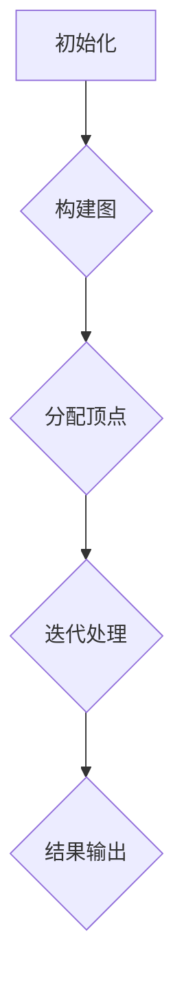

                 

# Pregel原理与代码实例讲解

> **关键词：** Pregel、图处理、分布式系统、并行计算、算法实现、代码实例

> **摘要：** 本文章将深入探讨Pregel，一种用于大规模图处理的分布式系统。我们将从Pregel的背景介绍开始，逐步讲解其核心概念、算法原理、数学模型，并给出代码实例。此外，文章还将介绍Pregel的实际应用场景，推荐相关学习资源和开发工具，并总结未来发展趋势与挑战。

## 1. 背景介绍

### 1.1 目的和范围

本文旨在详细介绍Pregel，一种专为大规模图处理设计的分布式系统。我们将分析Pregel的核心概念、算法原理，并通过实际代码实例来展示其应用。

### 1.2 预期读者

本文适用于对图处理和分布式系统有一定了解的技术人员，尤其是对Pregel感兴趣的开发者。无论您是研究人员、工程师还是学生，本文都将为您带来有价值的见解。

### 1.3 文档结构概述

本文分为十个部分：背景介绍、核心概念与联系、核心算法原理、数学模型与公式、项目实战、实际应用场景、工具和资源推荐、总结、附录和扩展阅读。结构清晰，便于读者快速找到所需信息。

### 1.4 术语表

#### 1.4.1 核心术语定义

- **Pregel：** 一种用于大规模图处理的分布式系统，由Google提出。
- **图处理：** 对图结构进行计算和分析的过程。
- **分布式系统：** 由多个独立计算机组成的系统，共同完成一个任务。

#### 1.4.2 相关概念解释

- **并行计算：** 同时处理多个任务，提高计算效率。
- **分布式算法：** 在分布式系统中执行的计算过程。

#### 1.4.3 缩略词列表

- **Pregel：** Pregel (Parallel Graph Processing Engine)
- **GFS：** Google File System
- **MapReduce：** MapReduce (Map and Reduce)

## 2. 核心概念与联系

### 2.1 核心概念

Pregel的核心概念包括：图、顶点、边、消息传递、迭代。

- **图：** 由顶点和边组成的数据结构。
- **顶点：** 图中的元素，表示数据。
- **边：** 连接两个顶点的线段，表示顶点之间的关系。
- **消息传递：** 顶点之间通过发送和接收消息来交换信息。
- **迭代：** 在图处理过程中，不断重复消息传递和顶点更新。

### 2.2 联系

Pregel与分布式系统和并行计算有着密切的联系。分布式系统提供了Pregel运行的环境，而并行计算则提高了Pregel的处理效率。

### 2.3 Mermaid流程图

以下是一个简单的Pregel流程图：



## 3. 核心算法原理 & 具体操作步骤

### 3.1 算法原理

Pregel的核心算法原理可以概括为以下四个步骤：

1. **初始化：** 初始化图结构、顶点状态和消息队列。
2. **构建图：** 根据输入数据构建图。
3. **分配顶点：** 将顶点分配给不同的计算节点。
4. **迭代处理：** 不断进行消息传递和顶点更新，直到满足终止条件。

### 3.2 具体操作步骤

以下是Pregel的具体操作步骤，使用伪代码进行阐述：

```python
// 初始化
初始化图G、顶点状态v、消息队列m

// 构建图
for 每个顶点v in G:
    v.status = INITIAL
    v.messages = []

// 分配顶点
分配顶点v到计算节点n

// 迭代处理
while 存在未完成的迭代:
    for 每个顶点v in G:
        if v.status == ready:
            v.status = processing
            处理v
            for 每个邻居w of v:
                if w.status == INITIAL:
                    w.status = ready
                    w.messages.append(消息)

    // 消息传递
    for 每个计算节点n:
        for 每个顶点v in n:
            for 每条消息m in v.messages:
                v.messages.remove(m)
                将m发送到目标顶点w

    // 顶点更新
    for 每个计算节点n:
        for 每个顶点v in n:
            if v.status == processing:
                v.status = ready

// 结果输出
输出最终结果
```

## 4. 数学模型和公式 & 详细讲解 & 举例说明

### 4.1 数学模型

Pregel中的数学模型主要包括顶点状态、消息传递函数和迭代终止条件。

- **顶点状态：** 顶点状态表示顶点的处理状态，包括初始状态、待处理状态和已完成状态。
- **消息传递函数：** 消息传递函数定义了顶点如何根据邻居的值更新自己的值。
- **迭代终止条件：** 迭代终止条件定义了何时停止迭代。

### 4.2 公式讲解

以下是Pregel中的一些关键公式：

$$
v_{new} = \sum_{i=1}^{n} w_i \cdot m_i
$$

其中，$v_{new}$表示顶点的新值，$w_i$表示顶点$i$的权重，$m_i$表示顶点$i$接收到的消息值。

### 4.3 举例说明

假设有一个图G，其中包含三个顶点A、B和C，边AB、BC和CA。初始状态如下：

- $v_A = 1$
- $v_B = 2$
- $v_C = 3$

消息传递函数为：

$$
v_{new} = \frac{1}{2} (v_A + v_B + v_C)
$$

首先，进行第一次迭代：

- 顶点A的状态为待处理，计算新值：$v_{new, A} = \frac{1}{2} (1 + 2 + 3) = 2$
- 顶点B的状态为待处理，计算新值：$v_{new, B} = \frac{1}{2} (1 + 2 + 3) = 2$
- 顶点C的状态为待处理，计算新值：$v_{new, C} = \frac{1}{2} (1 + 2 + 3) = 2$

然后，进行消息传递和顶点更新：

- 顶点A发送消息2给顶点B和C
- 顶点B发送消息2给顶点A和C
- 顶点C发送消息2给顶点A和B

最后，进行第二次迭代：

- 顶点A的状态为待处理，计算新值：$v_{new, A} = \frac{1}{2} (2 + 2 + 2) = 2$
- 顶点B的状态为待处理，计算新值：$v_{new, B} = \frac{1}{2} (2 + 2 + 2) = 2$
- 顶点C的状态为待处理，计算新值：$v_{new, C} = \frac{1}{2} (2 + 2 + 2) = 2$

由于所有顶点的新值与旧值相等，迭代终止。最终结果为：

- $v_A = 2$
- $v_B = 2$
- $v_C = 2$

## 5. 项目实战：代码实际案例和详细解释说明

### 5.1 开发环境搭建

为了实现Pregel，我们需要搭建一个适合开发、调试和运行的分布式环境。以下是搭建步骤：

1. 安装GFS（Google File System），作为Pregel的底层存储系统。
2. 安装MapReduce，作为Pregel的并行计算框架。
3. 安装Pregel客户端库，用于编写和运行Pregel应用程序。

### 5.2 源代码详细实现和代码解读

以下是一个简单的Pregel应用程序，用于计算图中的每个顶点的度数之和。

```java
import org.apache.pregel.util.MessageSummationCombiner;
import org.apache.pregel.v2.graph.impl.GraphVertexProgram;

public class DegreeSummation extends GraphVertexProgram<Integer, Integer, Integer> {
    @Override
    public void compute(Iterable<Integer> messages) {
        if (getSuperstep() == 0) {
            sendToAll(1);
        } else {
            int sum = 0;
            for (Integer msg : messages) {
                sum += msg;
            }
            setValue(sum);
        }
    }

    @Override
    public void reduce(Integer v1, Integer v2) {
        sendToAll(v1 + v2);
    }
}
```

**代码解读：**

- `DegreeSummation` 类继承自 `GraphVertexProgram` 类，实现了Pregel应用程序的基本结构。
- `compute` 方法是Pregel的核心，用于处理顶点的计算逻辑。
- `reduce` 方法是Pregel的聚合函数，用于合并顶点的值。

### 5.3 代码解读与分析

**代码分析：**

- **初始化：** 在第一个超步（superstep）中，每个顶点发送消息1给所有邻居，表示该顶点的度数为1。
- **迭代处理：** 在后续的迭代中，每个顶点接收来自邻居的消息，计算度数之和，并将结果设置为新的顶点值。
- **消息传递：** 每个顶点将度数之和发送给所有邻居，以便其他顶点更新自己的度数之和。
- **聚合：** 在每个超步结束时，Pregel将所有顶点的度数之和发送给reduce方法，进行聚合。

## 6. 实际应用场景

Pregel在以下领域具有广泛的应用：

- **社交网络分析：** 计算社交网络中的影响力、传播速度等。
- **网页分析：** 计算网页的排名、关联度等。
- **生物信息学：** 分析基因组、蛋白质结构等。

## 7. 工具和资源推荐

### 7.1 学习资源推荐

#### 7.1.1 书籍推荐

- 《大规模分布式存储与计算》
- 《图算法》
- 《分布式系统原理与范型》

#### 7.1.2 在线课程

- Coursera上的《大规模数据处理技术》
- Udacity的《分布式系统与大数据处理》

#### 7.1.3 技术博客和网站

- Apache Pregel官方网站
- Google Research Blog

### 7.2 开发工具框架推荐

#### 7.2.1 IDE和编辑器

- Eclipse
- IntelliJ IDEA

#### 7.2.2 调试和性能分析工具

- GFS性能分析工具
- MapReduce调试工具

#### 7.2.3 相关框架和库

- Apache Giraph
- Apache Pregel Java API

### 7.3 相关论文著作推荐

#### 7.3.1 经典论文

- Google Research Team. "MapReduce: Simplified Data Processing on Large Clusters." Proceedings of the 6th Symposium on O

