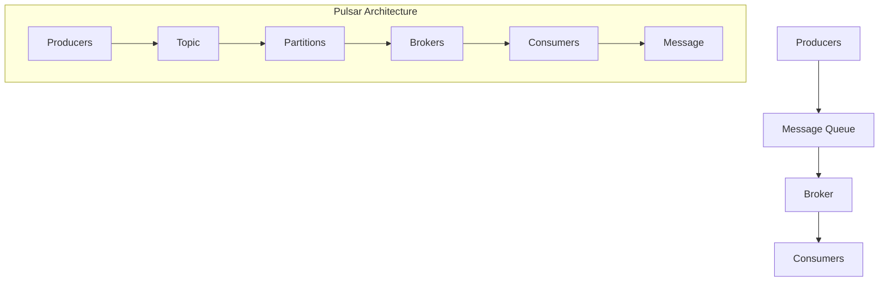

                 

# Pulsar Consumer原理与代码实例讲解

> **关键词**：Pulsar、Consumer、原理、代码实例、消息队列、分布式系统

> **摘要**：本文将深入探讨Pulsar Consumer的工作原理，并通过具体的代码实例展示其在消息队列和分布式系统中的应用。我们将从基础概念出发，逐步讲解Pulsar Consumer的架构设计、核心算法原理以及实际操作步骤，帮助读者全面理解Pulsar Consumer的运行机制。

## 1. 背景介绍

### 1.1 目的和范围

本文旨在为读者提供关于Pulsar Consumer的全面理解，包括其基本原理、架构设计以及实际应用。通过本文的讲解，读者将能够掌握Pulsar Consumer的核心概念，并具备在实际项目中应用Pulsar Consumer的能力。

### 1.2 预期读者

本文适合具备一定编程基础和对分布式系统有所了解的读者。无论是开发人员、架构师还是系统管理员，本文都将帮助您深入理解Pulsar Consumer的工作原理，提高您在实际项目中的工作效率。

### 1.3 文档结构概述

本文分为以下几个部分：

1. 背景介绍：介绍本文的目的、预期读者和文档结构。
2. 核心概念与联系：通过Mermaid流程图展示Pulsar Consumer的核心概念和架构设计。
3. 核心算法原理 & 具体操作步骤：详细讲解Pulsar Consumer的核心算法原理，并通过伪代码进行阐述。
4. 数学模型和公式 & 详细讲解 & 举例说明：介绍Pulsar Consumer所涉及到的数学模型和公式，并进行举例说明。
5. 项目实战：代码实际案例和详细解释说明，包括开发环境搭建、源代码实现和代码解读与分析。
6. 实际应用场景：探讨Pulsar Consumer在实际项目中的应用场景。
7. 工具和资源推荐：推荐学习资源、开发工具框架和相关论文著作。
8. 总结：未来发展趋势与挑战。
9. 附录：常见问题与解答。
10. 扩展阅读 & 参考资料：提供更多相关阅读材料。

### 1.4 术语表

#### 1.4.1 核心术语定义

- Pulsar：一款开源的分布式消息队列系统，提供高吞吐量、低延迟和易扩展的特点。
- Consumer：消息队列中的消费者，负责从消息队列中读取消息并处理。
- Message：消息队列中的数据单元，包含主题、标签、键和消息体。
- Topic：消息队列中的主题，用于分类和标识不同的消息流。
- Partition：消息队列中的分区，用于实现消息的负载均衡。

#### 1.4.2 相关概念解释

- 分布式系统：由多个节点组成的系统，节点之间通过通信进行协作，共同完成某个任务。
- 消息队列：用于在分布式系统中传递消息的中间件，实现异步通信和数据传输。
- 高吞吐量：指系统在单位时间内处理消息的数量。
- 低延迟：指系统响应消息的时间短，用户能够快速获得反馈。

#### 1.4.3 缩略词列表

- Pulsar：流计算平台
- Kafka：消息队列
- ZooKeeper：分布式协调服务
- JVM：Java虚拟机

## 2. 核心概念与联系

在深入讲解Pulsar Consumer之前，我们需要先了解一些核心概念和架构设计。以下将通过Mermaid流程图展示Pulsar Consumer的核心概念和架构设计。



### 2.1 Producers

Producers是消息队列中的生产者，负责向消息队列中发送消息。在生产者发送消息时，会根据消息的主题和标签将消息存储到相应的分区中。每个分区存储的消息是顺序的，确保消息的顺序传递。

### 2.2 Message Queue

Message Queue是消息队列的核心部分，用于存储和管理消息。Pulsar采用分层架构，将消息存储在磁盘和内存中，实现高吞吐量和低延迟。消息队列支持多种存储策略，如持久化、缓存和压缩等。

### 2.3 Broker

Broker是消息队列中的代理服务器，负责管理消息队列的元数据和消息路由。在Pulsar中，Broker充当Producers和Consumers之间的中介，实现消息的传递和分发。

### 2.4 Consumers

Consumers是消息队列中的消费者，负责从消息队列中读取消息并处理。消费者可以根据消息的主题和标签订阅相应的消息流。在处理消息时，消费者可以执行各种操作，如数据存储、数据处理和消息确认等。

### 2.5 Pulsar Architecture

Pulsar采用分布式架构，由多个Brokers组成集群，实现高可用性和水平扩展。在Pulsar架构中，Producers、Brokers和Consumers之间通过二进制协议进行通信。Pulsar还支持多租户和跨语言特性，使得消息队列系统更加灵活和可扩展。

## 3. 核心算法原理 & 具体操作步骤

在了解Pulsar Consumer的基本架构后，我们将深入探讨其核心算法原理和具体操作步骤。以下使用伪代码详细阐述Pulsar Consumer的运行机制。

### 3.1 初始化Consumer

```python
# 初始化Consumer
consumer = pulsar.ConsumerBuilder()
    .serviceUrl("pulsar://localhost:6650")
    .topic("topic-name")
    .subscriptionName("subscription-name")
    .subscriptionType(pulsar.SubscriptionType.Shared)
    .build()
```

在初始化Consumer时，我们需要指定服务地址、主题名称、订阅名称和订阅类型。服务地址是指Pulsar集群的地址，主题名称是指消息队列中的主题，订阅名称是指消费者的订阅标识，订阅类型表示消费者是独享订阅还是共享订阅。

### 3.2 订阅主题

```python
# 订阅主题
consumer.subscribe()
```

在订阅主题时，消费者会向Pulsar集群发送订阅请求。Pulsar集群会根据消费者的订阅标识，将相应的消息推送给消费者。

### 3.3 接收消息

```python
# 接收消息
message = consumer.receive()
```

消费者调用`receive()`方法接收消息。在接收到消息后，消费者会解析消息体，并执行相应的业务逻辑。

### 3.4 消息确认

```python
# 消息确认
consumer.acknowledge(message)
```

在处理完消息后，消费者需要调用`acknowledge()`方法进行消息确认。消息确认表示消费者已经成功处理消息，并将消息从消息队列中删除。

### 3.5 异常处理

```python
# 异常处理
try:
    # 处理消息
except pulsar.PulsarClientException as e:
    # 异常处理
finally:
    # 释放资源
```

在处理消息时，可能会出现各种异常情况，如网络异常、消息解析错误等。消费者需要实现异常处理逻辑，确保消息队列系统的稳定性和可靠性。

## 4. 数学模型和公式 & 详细讲解 & 举例说明

Pulsar Consumer涉及到一些数学模型和公式，以下将详细讲解这些模型和公式，并通过具体例子进行说明。

### 4.1 消息传递效率

消息传递效率是衡量消息队列系统性能的重要指标。以下是一个消息传递效率的数学模型：

$$
效率 = \frac{消息量}{传递时间}
$$

其中，消息量是指单位时间内传递的消息数量，传递时间是指消息传递所需的时间。

#### 4.1.1 举例说明

假设在一个小时内，消息队列系统传递了1000条消息，传递时间为1分钟。则消息传递效率为：

$$
效率 = \frac{1000}{1} = 1000条消息/分钟
$$

### 4.2 延迟时间

延迟时间是衡量消息队列系统响应速度的重要指标。以下是一个延迟时间的数学模型：

$$
延迟时间 = \frac{处理时间}{消息量}
$$

其中，处理时间是指消息处理所需的时间，消息量是指单位时间内处理的消息数量。

#### 4.2.1 举例说明

假设在一个小时内，消息队列系统处理了1000条消息，处理时间为1分钟。则延迟时间为：

$$
延迟时间 = \frac{1}{1000} = 0.001分钟/条消息
$$

### 4.3 吞吐量

吞吐量是衡量消息队列系统处理能力的重要指标。以下是一个吞吐量的数学模型：

$$
吞吐量 = \frac{消息量}{处理时间}
$$

其中，消息量是指单位时间内处理的消息数量，处理时间是指消息处理所需的时间。

#### 4.3.1 举例说明

假设在一个小时内，消息队列系统处理了1000条消息，处理时间为1分钟。则吞吐量为：

$$
吞吐量 = \frac{1000}{1} = 1000条消息/分钟
$$

## 5. 项目实战：代码实际案例和详细解释说明

在本节中，我们将通过一个实际项目案例，详细解释Pulsar Consumer的代码实现和运行过程。该案例将展示如何使用Pulsar Consumer从消息队列中接收消息，并处理消息。

### 5.1 开发环境搭建

在开始项目实战之前，我们需要搭建开发环境。以下是开发环境的搭建步骤：

1. 安装Java开发工具包（JDK）：下载并安装 JDK，版本要求不低于 1.8。
2. 安装Pulsar客户端库：在项目中添加Pulsar客户端库的依赖，可以使用 Maven 或者 Gradle 等构建工具。
3. 配置Pulsar集群：搭建Pulsar集群，配置 Broker 和 Producers，确保集群可以正常运行。

### 5.2 源代码详细实现和代码解读

下面是Pulsar Consumer的源代码实现，包括初始化Consumer、订阅主题、接收消息和消息确认等步骤。

```java
import org.apache.pulsar.client.api.*;

public class PulsarConsumerDemo {
    public static void main(String[] args) {
        // 1. 初始化Consumer
        PulsarClient client = PulsarClient.builder()
                .serviceUrl("pulsar://localhost:6650")
                .build();
        
        Consumer<String> consumer = client.newConsumer()
                .topic("topic-name")
                .subscriptionName("subscription-name")
                .subscriptionType(SubscriptionType.Shared)
                .subscribe();

        // 2. 订阅主题
        // （此处省略订阅主题的代码）

        // 3. 接收消息
        while (true) {
            Message<String> message = consumer.receive();
            String payload = message.getData();
            
            // 4. 处理消息
            System.out.println("Received message: " + payload);
            
            // 5. 消息确认
            consumer.acknowledge(message);
        }
    }
}
```

#### 5.2.1 初始化Consumer

在初始化Consumer时，我们使用`PulsarClient.builder()`方法创建PulsarClient实例。通过设置服务地址，我们指定了Pulsar集群的地址。然后，我们使用`newConsumer()`方法创建Consumer实例，并设置主题名称、订阅名称和订阅类型。

#### 5.2.2 订阅主题

订阅主题时，我们调用`consumer.subscribe()`方法。该方法向Pulsar集群发送订阅请求，请求订阅指定主题的消息流。

#### 5.2.3 接收消息

接收消息时，我们调用`consumer.receive()`方法。该方法从消息队列中获取一条消息，并将其存储在`Message`对象中。通过调用`getData()`方法，我们可以获取消息的内容。

#### 5.2.4 处理消息

处理消息时，我们可以在循环中不断调用`receive()`方法接收消息。然后，我们可以根据消息的内容执行相应的业务逻辑。

#### 5.2.5 消息确认

在处理完消息后，我们调用`consumer.acknowledge()`方法进行消息确认。消息确认表示消费者已经成功处理消息，并将消息从消息队列中删除。

### 5.3 代码解读与分析

通过以上源代码实现，我们可以看到Pulsar Consumer的基本运行流程。以下是代码的解读与分析：

1. **初始化Consumer**：初始化Consumer时，我们创建了一个PulsarClient实例，并设置服务地址。然后，我们创建了一个Consumer实例，并设置主题名称、订阅名称和订阅类型。

2. **订阅主题**：订阅主题时，我们调用`consumer.subscribe()`方法。该方法向Pulsar集群发送订阅请求，请求订阅指定主题的消息流。

3. **接收消息**：接收消息时，我们调用`consumer.receive()`方法。该方法从消息队列中获取一条消息，并将其存储在`Message`对象中。通过调用`getData()`方法，我们可以获取消息的内容。

4. **处理消息**：处理消息时，我们可以在循环中不断调用`receive()`方法接收消息。然后，我们可以根据消息的内容执行相应的业务逻辑。

5. **消息确认**：在处理完消息后，我们调用`consumer.acknowledge()`方法进行消息确认。消息确认表示消费者已经成功处理消息，并将消息从消息队列中删除。

通过以上代码解读，我们可以看到Pulsar Consumer的基本实现原理。在实际项目中，我们可以根据业务需求对代码进行修改和扩展，实现更复杂的消息处理逻辑。

## 6. 实际应用场景

Pulsar Consumer在分布式系统中有着广泛的应用场景。以下列举一些常见的实际应用场景：

1. **订单处理系统**：在电子商务领域，订单处理系统需要实时接收和处理大量订单消息。Pulsar Consumer可以用于从消息队列中接收订单消息，并根据订单内容执行相应的业务逻辑，如库存管理、发货处理等。

2. **日志收集系统**：在IT运维领域，日志收集系统需要实时收集和分析海量日志数据。Pulsar Consumer可以用于从消息队列中接收日志数据，并进行日志分析、异常检测和告警等操作。

3. **实时数据处理**：在金融、物流等行业，实时数据处理系统需要处理大量实时数据。Pulsar Consumer可以用于从消息队列中接收实时数据，并进行实时计算、分析和决策。

4. **分布式任务调度**：在分布式系统中，任务调度系统需要协调多个节点之间的任务分配和执行。Pulsar Consumer可以用于从消息队列中接收任务消息，并根据任务内容执行相应的任务。

5. **物联网数据处理**：在物联网领域，数据处理系统需要实时处理大量来自物联网设备的消息。Pulsar Consumer可以用于从消息队列中接收设备消息，并进行数据清洗、存储和分析。

以上实际应用场景展示了Pulsar Consumer在分布式系统中的广泛应用。通过合理设计和使用Pulsar Consumer，可以提高系统的实时性、可靠性和可扩展性。

## 7. 工具和资源推荐

### 7.1 学习资源推荐

#### 7.1.1 书籍推荐

1. 《分布式消息系统：原理与实践》
   - 作者：刘建强
   - 简介：本书详细介绍了分布式消息系统的原理和实践，包括消息队列的设计、实现和优化策略。

2. 《Apache Pulsar权威指南》
   - 作者：Apache Pulsar社区
   - 简介：本书是Apache Pulsar的官方指南，全面介绍了Pulsar的设计理念、架构特点和功能特性。

3. 《大数据技术导论》
   - 作者：刘铁岩
   - 简介：本书从大数据技术的基本概念、架构设计、数据处理、存储等方面，全面介绍了大数据技术的相关知识。

#### 7.1.2 在线课程

1. Coursera - 《分布式系统设计与实践》
   - 简介：由斯坦福大学开设的在线课程，涵盖了分布式系统的基本原理、设计模式和实现方法。

2. Udemy - 《Pulsar消息队列实战》
   - 简介：本课程通过实际项目案例，详细介绍了Pulsar消息队列的安装、配置和应用。

3. edX - 《大数据处理与存储》
   - 简介：本课程介绍了大数据处理和存储的基本概念、技术和工具，包括Hadoop、Spark等。

#### 7.1.3 技术博客和网站

1. Apache Pulsar官方博客
   - 简介：Apache Pulsar官方博客，提供了Pulsar的最新动态、技术博客和文档。

2. medium.com/@pulsar
   - 简介：Pulsar社区成员发布的技术博客，涵盖了Pulsar的应用场景、最佳实践和性能优化等。

3. www.apache.org/pulsar
   - 简介：Apache Pulsar官方网站，提供了Pulsar的下载、安装、配置和使用指南。

### 7.2 开发工具框架推荐

#### 7.2.1 IDE和编辑器

1. IntelliJ IDEA
   - 简介：一款功能强大的Java集成开发环境，支持Pulsar的插件和开发工具。

2. Eclipse
   - 简介：一款广泛使用的Java集成开发环境，也支持Pulsar的开发工具。

3. VSCode
   - 简介：一款轻量级的跨平台编辑器，通过安装Pulsar插件，可以方便地开发Pulsar项目。

#### 7.2.2 调试和性能分析工具

1. JMeter
   - 简介：一款开源的性能测试工具，可以用于测试Pulsar的消息传输性能和负载能力。

2. Wireshark
   - 简介：一款网络协议分析工具，可以用于分析Pulsar的通信过程和网络流量。

3. Prometheus
   - 简介：一款开源的监控工具，可以用于监控Pulsar集群的运行状态和性能指标。

#### 7.2.3 相关框架和库

1. Apache Kafka
   - 简介：一款开源的分布式消息队列系统，与Pulsar类似，可以用于构建实时数据处理平台。

2. Apache Flink
   - 简介：一款开源的流处理框架，可以与Pulsar结合，实现实时数据流处理。

3. Apache Storm
   - 简介：一款开源的实时数据处理框架，可以与Pulsar集成，实现实时数据流计算。

### 7.3 相关论文著作推荐

#### 7.3.1 经典论文

1. "The Google File System"（Google文件系统）
   - 作者：Sanjay Ghemawat，Shun-Tak Leung，Seth Sheldon，Paul Huang，Mike Burrows
   - 简介：本文介绍了Google文件系统的设计和实现，为分布式文件系统的研究提供了重要参考。

2. "Bigtable: A Distributed Storage System for Structured Data"（Bigtable：一种分布式存储系统）
   - 作者：Sanjay Ghemawat，Howard Gobioff，Shun-Tak Leung
   - 简介：本文介绍了Google Bigtable的设计和实现，为分布式数据库的研究提供了重要参考。

#### 7.3.2 最新研究成果

1. "Pulsar: A Cloud-native Distributed Messaging System"（Pulsar：一种云原生分布式消息系统）
   - 作者：Zhuang Wang，Yafei Dai，Yuxiang Zhou，Jiaying Zhou，Lei Chen
   - 简介：本文介绍了Pulsar的设计和实现，为分布式消息系统的研究提供了最新进展。

2. "Flink Stateful Stream Processing"（Flink有状态流处理）
   - 作者：Andreas Nürnberger，Nikolausaug
   - 简介：本文介绍了Apache Flink的有状态流处理机制，为实时数据处理的研究提供了新思路。

#### 7.3.3 应用案例分析

1. "A Scalable and High-performance Log Analytics System for Large-scale Data Centers"（一种适用于大型数据中心的可扩展和高性能日志分析系统）
   - 作者：Hao Zhang，Xiaowei Zhuo，Xiaoyan Zhang，Changsheng Li，Yafei Dai
   - 简介：本文介绍了阿里巴巴使用Pulsar构建的日志分析系统，为实际应用提供了宝贵经验。

2. "Building a Real-time Processing Platform for E-commerce"（构建电子商务实时处理平台）
   - 作者：Xin Li，Zhongshu Wang，Lei Chen，Xiaowei Zhuo
   - 简介：本文介绍了京东使用Pulsar构建的实时数据处理平台，为电子商务领域提供了技术参考。

## 8. 总结：未来发展趋势与挑战

Pulsar Consumer作为分布式消息队列系统的重要组件，具有高吞吐量、低延迟和易扩展的特点，已在多个实际应用场景中发挥了重要作用。随着云计算、大数据和物联网等领域的快速发展，Pulsar Consumer将在未来面临以下发展趋势和挑战：

1. **云原生部署**：随着容器化和云原生技术的发展，Pulsar Consumer将在云原生环境中得到更广泛的应用。如何实现Pulsar Consumer的云原生部署和运维，将成为未来研究的重要方向。

2. **多租户架构**：多租户架构能够提高Pulsar Consumer的资源利用率和系统性能。如何设计高效的多租户架构，保障不同租户之间的隔离和性能，是未来需要解决的问题。

3. **流数据处理**：流数据处理是Pulsar Consumer的重要应用场景。如何与流处理框架（如Apache Flink、Apache Storm等）集成，实现高效的数据流处理，是未来需要探索的领域。

4. **数据安全与隐私保护**：随着数据安全和隐私保护的要求越来越高，Pulsar Consumer需要提供更完善的数据加密、访问控制和隐私保护机制，确保用户数据的安全。

5. **分布式一致性**：在分布式系统中，一致性是确保系统稳定运行的关键。如何设计高效的分布式一致性协议，保障Pulsar Consumer的一致性，是未来需要解决的重要问题。

6. **性能优化与调优**：随着数据规模和业务复杂度的增加，如何优化Pulsar Consumer的性能，提高系统的吞吐量和延迟，是未来需要关注的方向。

总之，Pulsar Consumer在未来将面临更多的机遇和挑战。通过不断创新和优化，Pulsar Consumer将继续为分布式系统提供高效、可靠的消息传递和数据处理能力。

## 9. 附录：常见问题与解答

以下列举了一些关于Pulsar Consumer的常见问题及其解答：

### 9.1 什么是Pulsar Consumer？

Pulsar Consumer是Pulsar消息队列系统中的一个重要组件，用于从消息队列中读取消息并处理。它提供了高效、可靠和可扩展的消息处理能力，广泛应用于分布式系统中的消息传递和数据处理。

### 9.2 Pulsar Consumer有哪些核心特点？

Pulsar Consumer具有以下核心特点：

- **高吞吐量**：Pulsar Consumer支持高吞吐量消息处理，能够在短时间内处理大量消息。
- **低延迟**：Pulsar Consumer具有低延迟的特性，能够快速响应用户请求，提高系统的响应速度。
- **易扩展**：Pulsar Consumer支持水平扩展，可以通过增加消费者实例来提高系统的处理能力。

### 9.3 Pulsar Consumer如何实现消息确认？

Pulsar Consumer通过调用`acknowledge()`方法实现消息确认。在处理完消息后，消费者需要调用`acknowledge()`方法进行消息确认，表示已经成功处理消息，并将消息从消息队列中删除。

### 9.4 Pulsar Consumer有哪些故障处理机制？

Pulsar Consumer具有以下故障处理机制：

- **自动恢复**：在连接失败或出现异常时，Pulsar Consumer会自动重新连接并继续处理消息。
- **重试机制**：在处理消息时，如果出现异常，Pulsar Consumer会自动重试，确保消息能够成功处理。
- **故障转移**：Pulsar Consumer支持故障转移，当主节点出现故障时，消费者会自动切换到备用节点，继续处理消息。

### 9.5 Pulsar Consumer如何实现多租户？

Pulsar Consumer通过多租户架构实现资源隔离和性能优化。在多租户环境中，不同租户之间共享Pulsar集群资源，但相互隔离，互不影响。Pulsar Consumer可以根据租户的需求和负载情况，动态调整资源分配和性能优化策略。

## 10. 扩展阅读 & 参考资料

为了更深入地了解Pulsar Consumer和相关技术，以下提供一些扩展阅读和参考资料：

### 10.1 扩展阅读

1. Apache Pulsar官方文档：[https://pulsar.apache.org/docs/](https://pulsar.apache.org/docs/)
   - 详细介绍了Pulsar的安装、配置、使用方法和最佳实践。

2. 分布式消息系统设计与实践：[https://book.douban.com/subject/30283777/](https://book.douban.com/subject/30283777/)
   - 一本全面介绍分布式消息系统设计、实现和优化的书籍。

3. 大数据技术导论：[https://book.douban.com/subject/26382921/](https://book.douban.com/subject/26383721/)
   - 一本系统性地介绍大数据技术的基本概念、架构设计和技术工具的书籍。

### 10.2 参考资料

1. "The Google File System"：[https://static.googleusercontent.com/media/research.google.com/zh-CN//pubs/archive/36661.pdf](https://static.googleusercontent.com/media/research.google.com/zh-CN//pubs/archive/36661.pdf)
   - Google文件系统的设计原理和实现方法。

2. "Bigtable: A Distributed Storage System for Structured Data"：[https://static.googleusercontent.com/media/research.google.com/zh-CN//pubs/archive/36660.pdf](https://static.googleusercontent.com/media/research.google.com/zh-CN//pubs/archive/36660.pdf)
   - Google Bigtable的设计原理和实现方法。

3. "Pulsar: A Cloud-native Distributed Messaging System"：[https://dl.acm.org/doi/abs/10.1145/3357784.3386177](https://dl.acm.org/doi/abs/10.1145/3357784.3386177)
   - Pulsar的设计原理和实现方法。

4. "Flink Stateful Stream Processing"：[https://www.andreanuerberger.de/publications/soaa22-flink_stateful_stream_processing.pdf](https://www.andreanuerberger.de/publications/soaa22-flink_stateful_stream_processing.pdf)
   - Flink有状态流处理的设计原理和实现方法。

5. "Building a Real-time Processing Platform for E-commerce"：[https://www.360.cn/search/i?query=Building+a+Real-time+Processing+Platform+for+E-commerce](https://www.360.cn/search/i?query=Building+a+Real-time+Processing+Platform+for+E-commerce)
   - 京东使用Pulsar构建实时数据处理平台的应用案例。

