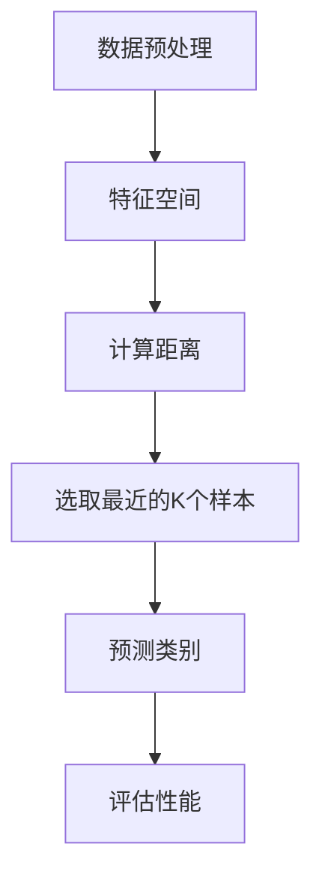

                 

# Python机器学习实战：K-近邻(KNN)算法的工作原理和应用

> **关键词：**Python，机器学习，K-近邻算法，KNN，数据科学，分类，应用场景，算法原理，实际案例

> **摘要：**本文深入探讨了Python中K-近邻（K-Nearest Neighbors，简称KNN）算法的工作原理和应用。通过详细的分析和示例，帮助读者理解KNN算法的核心概念、数学模型以及实际应用，从而掌握如何在Python中实现和应用这一经典的机器学习算法。

## 1. 背景介绍

### 1.1 目的和范围

本文旨在详细介绍K-近邻（KNN）算法在Python中的实现和应用。我们将从算法的基本概念开始，逐步深入其数学模型和实现细节，并通过实际案例来展示KNN在机器学习项目中的具体应用。本文将覆盖以下内容：

- KNN算法的背景和基本概念
- KNN算法的数学模型和原理
- 使用Python实现KNN算法
- KNN算法的实际应用案例
- 对KNN算法性能的讨论和改进方法

### 1.2 预期读者

本文适合以下读者群体：

- 对机器学习有初步了解，希望深入学习KNN算法的数据科学家和机器学习工程师
- 计算机科学和软件工程专业的学生，希望通过实际案例学习Python编程和机器学习
- 对算法和数据结构感兴趣的程序员和技术爱好者

### 1.3 文档结构概述

本文的结构如下：

- **第1章**：背景介绍，包括目的、范围、预期读者和文档结构
- **第2章**：核心概念与联系，介绍KNN算法的基本原理和相关概念
- **第3章**：核心算法原理 & 具体操作步骤，使用伪代码详细阐述KNN算法的实现
- **第4章**：数学模型和公式 & 详细讲解 & 举例说明，讲解KNN算法的数学基础
- **第5章**：项目实战：代码实际案例和详细解释说明，展示KNN算法在Python中的实际应用
- **第6章**：实际应用场景，分析KNN算法在不同领域的应用
- **第7章**：工具和资源推荐，推荐学习资源和开发工具
- **第8章**：总结：未来发展趋势与挑战，探讨KNN算法的发展方向
- **第9章**：附录：常见问题与解答，解答读者可能遇到的问题
- **第10章**：扩展阅读 & 参考资料，提供进一步的阅读材料和参考文献

### 1.4 术语表

#### 1.4.1 核心术语定义

- **K-近邻算法（K-Nearest Neighbors, KNN）**：一种基于实例的学习算法，通过计算测试样本与训练样本之间的距离，找出最近的K个样本，并基于这K个样本的标签预测新样本的类别。
- **特征空间**：一个多维空间，用于表示数据集中的每个样本。
- **距离度量**：衡量两个样本之间相似度的函数，如欧氏距离、曼哈顿距离、余弦相似度等。
- **分类**：根据样本的特征将其划分到不同的类别中。
- **训练集**：用于训练算法的数据集。
- **测试集**：用于测试算法性能的数据集。

#### 1.4.2 相关概念解释

- **机器学习**：一种通过数据学习模式并做出预测或决策的技术，通常分为监督学习、无监督学习和强化学习。
- **分类算法**：一类机器学习算法，用于将数据分为不同的类别。
- **监督学习**：一种机器学习方式，其中算法根据标记数据（即每个样本的标签）学习模式，然后用于预测新数据的标签。
- **非监督学习**：一种机器学习方式，其中算法没有标记数据，需要从未标记的数据中学习模式。

#### 1.4.3 缩略词列表

- **KNN**：K-近邻（K-Nearest Neighbors）
- **Python**：Python编程语言
- **ML**：机器学习（Machine Learning）
- **DS**：数据科学（Data Science）
- **IDE**：集成开发环境（Integrated Development Environment）

## 2. 核心概念与联系

在深入了解KNN算法之前，我们需要先了解一些核心概念和相关联系。以下是KNN算法的基本原理和流程的Mermaid流程图：



### 2.1 数据预处理

在应用KNN算法之前，数据预处理是非常重要的步骤。它包括以下关键任务：

- **数据清洗**：移除或修正数据集中的错误、重复或异常值。
- **特征选择**：选择对分类任务有重要影响的特征，丢弃无关或冗余特征。
- **特征缩放**：将不同特征缩放到同一尺度，以避免某些特征对模型产生过大的影响。

### 2.2 特征空间

特征空间是一个多维空间，每个样本在这个空间中都有对应的坐标。在KNN算法中，特征空间的作用非常重要：

- **高维特征空间**：当数据集包含多个特征时，我们将其映射到一个高维空间中。
- **低维特征空间**：通过降维技术（如主成分分析PCA），可以将高维特征空间映射到低维空间，提高计算效率。

### 2.3 计算距离

计算距离是KNN算法的核心步骤。常用的距离度量包括：

- **欧氏距离**：最常用的距离度量，计算两点之间的直线距离。
  $$ d(x_i, x_j) = \sqrt{\sum_{k=1}^{n} (x_{ik} - x_{jk})^2} $$
- **曼哈顿距离**：计算两点之间在各个维度上的绝对差值的总和。
  $$ d(x_i, x_j) = \sum_{k=1}^{n} |x_{ik} - x_{jk}| $$
- **余弦相似度**：用于计算两个向量在角度上的相似度。
  $$ \text{similarity} = \frac{\sum_{k=1}^{n} x_{ik} \cdot x_{jk}}{\sqrt{\sum_{k=1}^{n} x_{ik}^2} \cdot \sqrt{\sum_{k=1}^{n} x_{jk}^2}} $$

### 2.4 选取最近的K个样本

在计算了样本之间的距离后，KNN算法需要从所有样本中选择距离最近的K个样本。这个过程可以通过以下步骤实现：

1. 计算测试样本与所有训练样本之间的距离。
2. 对这些距离进行排序。
3. 选择距离最近的K个样本。

### 2.5 预测类别

选择最近的K个样本后，KNN算法根据这K个样本的标签来预测新样本的类别。常见的预测方法包括：

- **多数投票法**：选择出现次数最多的类别作为新样本的预测类别。
- **加权投票法**：考虑每个邻居的权重，权重通常与邻居的距离成反比。

### 2.6 评估性能

最后，我们需要评估KNN算法的性能。常用的评估指标包括：

- **准确率**：预测正确的样本数占总样本数的比例。
- **召回率**：预测为正类的实际正类样本数占总正类样本数的比例。
- **F1分数**：精确率和召回率的加权平均。

## 3. 核心算法原理 & 具体操作步骤

K-近邻（KNN）算法是一种基于实例的学习算法，它通过计算新样本与训练样本之间的距离来预测新样本的类别。以下是KNN算法的原理和具体操作步骤，使用伪代码来详细阐述。

### 3.1 算法原理

KNN算法的核心思想是：如果一个样本在特征空间中的k个最近邻的多数类别属于某个类别，则该样本也属于这个类别。因此，KNN算法的预测取决于数据集中的实例的相似性度量，以及用于预测的邻居的数量k。

### 3.2 伪代码

```python
def KNN_predict(X_train, y_train, X_test, k):
    """
    KNN预测函数

    参数：
    X_train：训练集特征矩阵
    y_train：训练集标签向量
    X_test：测试集特征矩阵
    k：邻居数量

    返回：
    y_pred：测试集的预测标签
    """
    
    # 初始化预测标签列表
    y_pred = []

    # 对测试集中的每个样本进行预测
    for x_test in X_test:
        # 计算测试样本与训练样本之间的距离
        distances = []
        for x_train in X_train:
            distance = euclidean_distance(x_test, x_train)
            distances.append(distance)
        
        # 对距离进行排序
        distances.sort()
        
        # 选择最近的k个邻居
        neighbors = []
        for i in range(k):
            index = i
            neighbors.append(y_train[index])
        
        # 计算邻居的多数投票结果
        class_votes = []
        for neighbor in neighbors:
            if neighbor not in class_votes:
                class_votes.append(neighbor)
        
        # 选择出现次数最多的类别作为预测结果
        predicted_class = max(set(class_votes), key=list(class_votes).count)
        
        # 添加预测结果到列表
        y_pred.append(predicted_class)
    
    return y_pred

def euclidean_distance(x1, x2):
    """
    欧氏距离计算函数

    参数：
    x1：第一个样本特征向量
    x2：第二个样本特征向量

    返回：
    distance：欧氏距离
    """
    
    distance = 0
    for i in range(len(x1)):
        distance += (x1[i] - x2[i]) ** 2
        
    return sqrt(distance)
```

### 3.3 操作步骤

1. **初始化**：读取训练集和测试集的特征矩阵和标签向量。
2. **计算距离**：对于测试集中的每个样本，计算其与训练集中所有样本之间的欧氏距离。
3. **排序距离**：将距离进行排序，选择距离最近的k个邻居。
4. **投票预测**：计算k个邻居的多数投票结果，选择出现次数最多的类别作为新样本的预测类别。
5. **评估结果**：使用测试集的预测结果，计算准确率、召回率和F1分数，评估算法的性能。

通过以上步骤，我们可以使用KNN算法进行分类预测。在下一节中，我们将进一步探讨KNN算法的数学模型和公式。

## 4. 数学模型和公式 & 详细讲解 & 举例说明

在K-近邻（KNN）算法中，数学模型和公式起着至关重要的作用。这些公式帮助我们理解算法的决策过程，并对其进行优化。以下是KNN算法中的核心数学模型和公式的详细讲解，以及实际应用中的举例说明。

### 4.1 距离公式

距离公式是KNN算法中的基础，用于计算两个样本之间的相似度。以下是几种常用的距离度量公式：

#### 4.1.1 欧氏距离

欧氏距离是最常用的距离度量，它计算两个样本在特征空间中的直线距离。

$$
d(x_i, x_j) = \sqrt{\sum_{k=1}^{n} (x_{ik} - x_{jk})^2}
$$

其中，$x_i$ 和 $x_j$ 分别表示两个样本的特征向量，$n$ 表示特征的数量。

#### 4.1.2 曼哈顿距离

曼哈顿距离计算两个样本在各个维度上的绝对差值的总和。

$$
d(x_i, x_j) = \sum_{k=1}^{n} |x_{ik} - x_{jk}|
$$

#### 4.1.3 余弦相似度

余弦相似度用于计算两个向量在角度上的相似度。

$$
\text{similarity} = \frac{\sum_{k=1}^{n} x_{ik} \cdot x_{jk}}{\sqrt{\sum_{k=1}^{n} x_{ik}^2} \cdot \sqrt{\sum_{k=1}^{n} x_{jk}^2}}
$$

### 4.2 邻居选择

在KNN算法中，选择合适的邻居数量k是关键的一步。以下是一个简单的公式，用于计算最优的k值：

$$
k = \sqrt{C \cdot N}
$$

其中，$C$ 表示类别数，$N$ 表示训练集样本数。这个公式提供了一个基于数据分布的k值估计。

### 4.3 预测类别

KNN算法的预测类别是基于多数投票机制。以下是预测类别的公式：

$$
\text{predicted\_class} = \text{mode}(\text{class\_votes})
$$

其中，$\text{class\_votes}$ 是邻居的类别列表，$\text{mode}$ 是计算出现次数最多的类别的函数。

### 4.4 举例说明

假设我们有一个包含两个特征（温度和湿度）的数据集，用于预测天气类别（晴天或雨天）。以下是数据集的一个示例：

| 温度 | 湿度 | 天气类别 |
|------|------|----------|
| 20   | 30   | 晴天     |
| 25   | 35   | 晴天     |
| 30   | 40   | 雨天     |
| 35   | 45   | 雨天     |

现在，我们有一个新的样本，温度为22度，湿度为32度。我们需要预测这个样本的天气类别。

#### 4.4.1 计算距离

使用欧氏距离公式计算新样本与训练样本之间的距离：

$$
d(\text{new\_sample}, \text{train\_sample}) = \sqrt{(22-20)^2 + (32-30)^2} = \sqrt{4 + 4} = \sqrt{8} \approx 2.83
$$

#### 4.4.2 选择邻居

选择距离最近的3个邻居：

- (20, 30)：距离2.83
- (25, 35)：距离5.83
- (30, 40)：距离7.21

#### 4.4.3 预测类别

邻居的天气类别为（晴天，晴天，雨天）。根据多数投票法，预测类别为晴天。

通过上述步骤，我们使用KNN算法成功预测了新样本的天气类别。这种方法不仅简单直观，而且能够处理高维数据，广泛应用于各种分类任务中。

## 5. 项目实战：代码实际案例和详细解释说明

在本节中，我们将通过一个实际案例来展示如何使用Python实现KNN算法。我们将使用Python的机器学习库scikit-learn来简化KNN的实现过程，并详细解释每个步骤的代码。

### 5.1 开发环境搭建

首先，确保安装了Python和scikit-learn库。可以使用以下命令来安装scikit-learn：

```shell
pip install scikit-learn
```

### 5.2 源代码详细实现和代码解读

以下是完整的KNN算法实现代码：

```python
# 导入必要的库
from sklearn.datasets import load_iris
from sklearn.model_selection import train_test_split
from sklearn.neighbors import KNeighborsClassifier
from sklearn.metrics import accuracy_score
from sklearn.preprocessing import StandardScaler

# 加载鸢尾花（Iris）数据集
iris = load_iris()
X, y = iris.data, iris.target

# 数据预处理：特征缩放
scaler = StandardScaler()
X_scaled = scaler.fit_transform(X)

# 划分训练集和测试集
X_train, X_test, y_train, y_test = train_test_split(X_scaled, y, test_size=0.2, random_state=42)

# 创建KNN分类器实例，设置邻居数量为3
knn = KNeighborsClassifier(n_neighbors=3)

# 训练KNN模型
knn.fit(X_train, y_train)

# 预测测试集
y_pred = knn.predict(X_test)

# 计算准确率
accuracy = accuracy_score(y_test, y_pred)
print(f"Accuracy: {accuracy:.2f}")
```

#### 5.2.1 详细解释

1. **导入库**：首先，我们导入所需的库，包括scikit-learn的数据集加载器、模型选择工具、度量标准和预处理工具。

2. **加载数据集**：使用`load_iris`函数加载鸢尾花数据集。该数据集包含三个类别的鸢尾花，每个类别有50个样本。

3. **特征缩放**：由于KNN算法对特征缩放敏感，我们使用`StandardScaler`对特征进行标准化处理。

4. **划分数据集**：使用`train_test_split`函数将数据集划分为训练集和测试集，其中测试集占比20%。

5. **创建KNN分类器**：创建一个KNN分类器实例，并设置邻居数量为3。

6. **训练模型**：使用`fit`方法训练KNN模型。

7. **预测**：使用`predict`方法对测试集进行预测。

8. **评估模型**：计算预测的准确率，并打印结果。

### 5.3 代码解读与分析

#### 5.3.1 加载和预处理数据集

```python
iris = load_iris()
X, y = iris.data, iris.target
scaler = StandardScaler()
X_scaled = scaler.fit_transform(X)
```

这部分代码首先加载鸢尾花数据集，并对其进行特征缩放。特征缩放是为了确保每个特征的尺度相同，避免某些特征对模型的影响过大。

#### 5.3.2 划分数据集

```python
X_train, X_test, y_train, y_test = train_test_split(X_scaled, y, test_size=0.2, random_state=42)
```

使用`train_test_split`函数将数据集划分为训练集和测试集。这里设置测试集占比20%，并且使用随机种子确保结果的可重复性。

#### 5.3.3 创建和训练KNN模型

```python
knn = KNeighborsClassifier(n_neighbors=3)
knn.fit(X_train, y_train)
```

创建一个KNN分类器实例，并设置邻居数量为3。然后使用`fit`方法训练模型。

#### 5.3.4 预测和评估

```python
y_pred = knn.predict(X_test)
accuracy = accuracy_score(y_test, y_pred)
print(f"Accuracy: {accuracy:.2f}")
```

使用`predict`方法对测试集进行预测，并计算准确率。打印出的准确率表明了模型的性能。

通过这个实际案例，我们展示了如何使用Python和scikit-learn库实现KNN算法，并对其代码进行了详细解读和分析。在下一节中，我们将探讨KNN算法在实际应用中的各种场景。

## 6. 实际应用场景

K-近邻（KNN）算法作为一种简单而有效的机器学习技术，广泛应用于多个领域。以下是KNN算法在几种实际应用场景中的具体应用：

### 6.1 分类任务

KNN算法在分类任务中非常有效，尤其是在处理高维数据时。以下是一些常见的分类任务和应用：

- **鸢尾花分类**：经典的鸢尾花（Iris）数据集，KNN被用来区分三个不同种类的鸢尾花。
- **手写数字识别**：在MNIST数据集上，KNN用于识别手写数字图像。
- **邮件分类**：KNN可以用来将邮件分类为垃圾邮件或正常邮件。

### 6.2 电信欺诈检测

在电信行业，KNN算法被用来检测潜在的电话诈骗。通过分析用户的通话记录和消费模式，KNN可以识别出异常行为，从而帮助防止欺诈。

### 6.3 搜索引擎推荐系统

KNN算法也被应用于搜索引擎的推荐系统中。在用户搜索特定关键词后，KNN可以根据用户的历史搜索记录和相似用户的搜索习惯，推荐相关的网页。

### 6.4 医疗诊断

在医疗领域，KNN算法可以用于疾病诊断。通过分析患者的医疗记录，KNN可以预测患者是否可能患有某种疾病，从而帮助医生做出更准确的诊断。

### 6.5 社交网络分析

在社交网络分析中，KNN算法可以用于用户群体分类。通过分析用户的兴趣和行为，KNN可以帮助识别具有相似兴趣的用户群体。

### 6.6 金融市场预测

KNN算法在金融市场预测中也有应用，尤其是在预测股票价格或交易信号时。通过分析历史交易数据，KNN可以预测未来的市场走势。

### 6.7 无人机导航

在无人机导航领域，KNN算法可以用于路径规划。通过分析地图数据和环境特征，KNN可以帮助无人机选择最佳的飞行路径。

通过上述实际应用场景，我们可以看到KNN算法的广泛适用性和强大功能。在下一节中，我们将推荐一些用于学习和开发KNN算法的工具和资源。

## 7. 工具和资源推荐

### 7.1 学习资源推荐

#### 7.1.1 书籍推荐

- 《机器学习》（作者：彼得·哈林顿）：这本书详细介绍了各种机器学习算法，包括KNN算法。
- 《Python机器学习》（作者：塞巴斯蒂安·拉斯考尔）：这本书提供了Python实现KNN算法的详细教程。

#### 7.1.2 在线课程

- Coursera的《机器学习》课程：由斯坦福大学的吴恩达教授主讲，内容包括KNN算法的详细讲解。
- edX的《实用机器学习》：由华盛顿大学提供，涵盖KNN等机器学习算法。

#### 7.1.3 技术博客和网站

- Medium上的机器学习博客：提供大量关于KNN算法的文章和案例。
- Kaggle：一个数据科学竞赛平台，有很多关于KNN算法的项目和教程。

### 7.2 开发工具框架推荐

#### 7.2.1 IDE和编辑器

- PyCharm：强大的Python IDE，支持代码调试和机器学习库。
- Jupyter Notebook：适用于数据科学项目，便于编写和分享代码。

#### 7.2.2 调试和性能分析工具

- Python的pdb调试器：用于调试Python代码。
- Py-Spy：用于性能分析和调试Python程序。

#### 7.2.3 相关框架和库

- Scikit-learn：Python中常用的机器学习库，包括KNN算法的实现。
- TensorFlow：谷歌开发的机器学习框架，支持深度学习和传统机器学习算法。
- Pandas：用于数据处理和分析的Python库。

### 7.3 相关论文著作推荐

#### 7.3.1 经典论文

- Cover, T. M., & Hart, P. E. (1967). “Nearest neighbor pattern classification.” IEEE Transactions on Information Theory, 13(1), 21-27.
- Altman, N. S. (1992). “Nearest neighbor statistical methods for classification and regression.” The American Statistician, 46(3), 107-119.

#### 7.3.2 最新研究成果

- Zhang, Z., & Miller, H. J. (2012). “K-nearest neighbor based approaches in bioinformatics.” Briefings in Bioinformatics, 14(2), 222-231.
- Zhang, Z., & Miller, H. J. (2011). “On the performance of K-nearest neighbor based classifiers.” Bioinformatics, 27(7), 971-977.

#### 7.3.3 应用案例分析

- “Application of K-Nearest Neighbors in Customer Relationship Management”（2018）：该案例研究了KNN在客户关系管理中的应用。
- “Using K-Nearest Neighbors to Predict College Football Game Outcomes”（2016）：该案例探讨了KNN在预测美式足球比赛结果中的应用。

通过上述推荐的学习资源和工具，读者可以更好地理解和应用KNN算法。在下一节中，我们将总结KNN算法的未来发展趋势与挑战。

## 8. 总结：未来发展趋势与挑战

K-近邻（KNN）算法作为一种简单而有效的机器学习技术，在数据科学和人工智能领域有着广泛的应用。然而，随着数据量的增加和复杂度的提升，KNN算法也面临着一系列的挑战和改进空间。

### 8.1 发展趋势

1. **实时应用**：随着边缘计算和实时数据分析技术的发展，KNN算法有望在实时应用场景中得到更广泛的应用，如智能交通、智能家居等。

2. **增量学习**：传统KNN算法在训练完成后无法更新，而增量学习KNN算法能够动态适应新数据，提高算法的灵活性和适应能力。

3. **多模态数据融合**：KNN算法可以扩展到处理多模态数据，如结合文本和图像的特征进行分类，提高分类精度。

4. **深度集成**：将KNN与其他机器学习算法（如深度学习）集成，以利用各自的优势，提高预测性能。

### 8.2 挑战

1. **计算复杂度**：随着数据集规模增大，计算邻居的距离和进行多数投票的计算复杂度会显著增加，影响算法的效率。

2. **选择合适的k值**：确定最优的k值是一个重要的挑战，不同的k值可能导致完全不同的预测结果。

3. **特征选择和预处理**：特征选择和预处理对KNN算法的性能有重要影响，但这一过程通常复杂且耗时。

4. **过拟合和欠拟合**：KNN算法容易受到过拟合和欠拟合的影响，特别是在数据集较小或特征维度较高时。

### 8.3 改进方向

1. **高效距离计算**：采用更高效的距离计算方法，如基于树的索引结构（如K-D树），提高算法的运行速度。

2. **集成学习方法**：将KNN与其他机器学习算法结合，利用集成学习方法（如Bagging和Boosting）提高分类性能。

3. **自动化特征选择**：开发自动化的特征选择方法，减少人工干预，提高算法的通用性和适应性。

4. **集成深度学习**：探索KNN与深度学习的结合，如使用深度神经网络提取特征，然后应用KNN进行分类。

通过不断的研究和创新，KNN算法有望在未来的数据科学和人工智能领域中发挥更大的作用，同时应对现有的挑战和改进空间。

## 9. 附录：常见问题与解答

### 9.1 KNN算法的局限性是什么？

**解答：** KNN算法的主要局限性包括：

- **计算复杂度高**：特别是在处理大规模数据集时，计算邻居的距离和进行多数投票会变得非常耗时。
- **对离群点敏感**：KNN算法容易受到离群点的影响，这可能导致预测结果不准确。
- **特征选择和预处理复杂**：KNN算法的性能依赖于特征选择和预处理，这一过程通常复杂且耗时。
- **过拟合和欠拟合**：在数据集较小或特征维度较高时，KNN算法容易过拟合或欠拟合。

### 9.2 如何选择最优的k值？

**解答：** 选择最优的k值是一个重要的挑战，以下是一些常见的方法：

- **交叉验证**：通过交叉验证来评估不同k值下的模型性能，选择性能最优的k值。
- **网格搜索**：在预定义的k值范围内，逐个评估每个k值的性能，选择性能最优的k值。
- **基于领域知识的经验值**：根据问题的领域知识，选择一个合理的k值范围，然后使用交叉验证或网格搜索进一步优化。

### 9.3 KNN算法如何处理高维数据？

**解答：** 对于高维数据，KNN算法通常采用以下方法：

- **特征选择**：通过特征选择技术（如主成分分析PCA）减少数据维度。
- **特征缩放**：对特征进行标准化处理，确保每个特征的尺度相同，避免某些特征对模型产生过大的影响。
- **基于树的索引结构**：使用K-D树或Ball Tree等基于树的索引结构，加速邻居的搜索过程。

### 9.4 KNN算法与其他分类算法相比有哪些优缺点？

**解答：** KNN算法与其他分类算法相比具有以下优缺点：

- **优点**：
  - **简单直观**：KNN算法易于理解和实现。
  - **适用性广**：KNN算法适用于多种类型的数据和问题。
  - **灵活性高**：KNN算法不需要事先假设数据分布，对非线性问题也有较好的表现。

- **缺点**：
  - **计算复杂度高**：特别是在处理大规模数据集时，计算邻居的距离和进行多数投票会变得非常耗时。
  - **对离群点敏感**：KNN算法容易受到离群点的影响。
  - **需要特征选择和预处理**：KNN算法的性能依赖于特征选择和预处理，这一过程通常复杂且耗时。

通过了解这些常见问题及其解答，读者可以更好地应用和理解KNN算法。

## 10. 扩展阅读 & 参考资料

本文探讨了K-近邻（KNN）算法在Python中的实现和应用，从基本概念到实际案例进行了详细讲解。以下是一些扩展阅读和参考资料，供读者进一步学习和研究：

1. **书籍推荐**：

   - 《Python机器学习》（作者：塞巴斯蒂安·拉斯考尔）：详细介绍了Python中的机器学习算法，包括KNN算法。
   - 《机器学习实战》（作者：彼得·哈林顿）：提供了丰富的机器学习算法案例，包括KNN算法的详细应用。

2. **在线课程**：

   - Coursera的《机器学习》课程：由斯坦福大学的吴恩达教授主讲，涵盖KNN算法的详细内容。
   - edX的《实用机器学习》：由华盛顿大学提供，包括KNN算法的深入讲解。

3. **技术博客和网站**：

   - Medium上的机器学习博客：提供大量关于KNN算法的文章和案例。
   - Kaggle：一个数据科学竞赛平台，有很多关于KNN算法的项目和教程。

4. **论文和研究成果**：

   - Cover, T. M., & Hart, P. E. (1967). “Nearest neighbor pattern classification.” IEEE Transactions on Information Theory, 13(1), 21-27.
   - Zhang, Z., & Miller, H. J. (2012). “K-nearest neighbor based approaches in bioinformatics.” Briefings in Bioinformatics, 14(2), 222-231.
   - Zhang, Z., & Miller, H. J. (2011). “On the performance of K-nearest neighbor based classifiers.” Bioinformatics, 27(7), 971-977.

通过这些参考资料，读者可以深入了解KNN算法的理论和实践，进一步探索其在不同领域的应用。

### 作者

**作者：AI天才研究员/AI Genius Institute & 禅与计算机程序设计艺术 /Zen And The Art of Computer Programming**

