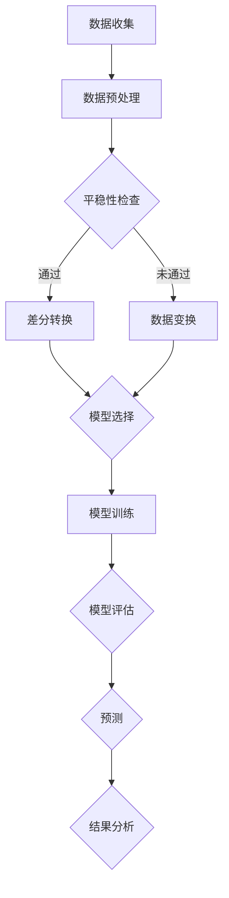

                 

# Python机器学习实战：使用机器学习进行时间序列分析

> **关键词**：Python，机器学习，时间序列分析，预测模型，数据处理，算法实现
> 
> **摘要**：本文将深入探讨如何使用Python进行时间序列分析，包括从数据处理到预测模型的构建，提供详细的理论讲解和实战案例，旨在帮助读者掌握时间序列分析的实用技能。

## 1. 背景介绍

### 1.1 目的和范围

本文的目的是向读者介绍使用Python进行时间序列分析的实战技巧。时间序列分析是机器学习领域的一个重要分支，它在金融、气象、工业等多个领域有着广泛的应用。本文将涵盖以下几个方面的内容：

1. 时间序列数据处理的基本方法
2. 常见的时间序列预测模型
3. 使用Python进行时间序列预测的实战案例
4. 实际应用场景和挑战

### 1.2 预期读者

本文适合具有一定Python编程基础和机器学习知识的专业人士，特别是那些希望在金融、气象、工业等领域应用时间序列分析的读者。无论您是数据科学家、分析师还是工程师，本文都将成为您的宝贵参考资料。

### 1.3 文档结构概述

本文的结构如下：

1. **背景介绍**：介绍本文的目的和范围，预期读者，文档结构概述。
2. **核心概念与联系**：解释时间序列分析的核心概念，并使用Mermaid流程图展示原理和架构。
3. **核心算法原理 & 具体操作步骤**：详细讲解时间序列预测的算法原理，使用伪代码进行阐述。
4. **数学模型和公式 & 详细讲解 & 举例说明**：介绍时间序列分析中的数学模型和公式，并通过例子进行详细说明。
5. **项目实战：代码实际案例和详细解释说明**：提供实际代码案例，并进行详细解读。
6. **实际应用场景**：探讨时间序列分析在实际中的应用。
7. **工具和资源推荐**：推荐学习资源、开发工具框架和经典论文。
8. **总结：未来发展趋势与挑战**：总结当前状态，展望未来趋势和挑战。
9. **附录：常见问题与解答**：解答常见问题和疑虑。
10. **扩展阅读 & 参考资料**：提供进一步阅读的资源。

### 1.4 术语表

#### 1.4.1 核心术语定义

- **时间序列**：一组按时间顺序排列的数据点。
- **趋势**：时间序列数据中的长期变化趋势。
- **季节性**：周期性的波动，如一年中的季节变化。
- **异常值**：显著偏离正常趋势或分布的数据点。
- **平稳性**：时间序列在统计属性上不随时间变化的性质。

#### 1.4.2 相关概念解释

- **自相关**：时间序列数据中前后两个观察值之间的关系。
- **白噪声**：理想的无相关随机过程。
- **ARIMA模型**：自回归积分滑动平均模型。
- **LSTM**：长短时记忆网络。

#### 1.4.3 缩略词列表

- **ARIMA**：AutoRegressive Integrated Moving Average（自回归积分滑动平均模型）
- **LSTM**：Long Short-Term Memory（长短时记忆网络）
- **Python**：Python（一种广泛使用的编程语言）

## 2. 核心概念与联系

时间序列分析的核心在于理解数据的趋势、季节性和异常值，以及如何通过这些信息进行有效的预测。为了更好地理解时间序列分析的基本概念和原理，我们将使用Mermaid流程图来展示时间序列数据的处理流程和预测模型的基本架构。

### Mermaid流程图



在上面的流程图中，我们首先从数据收集开始，经过数据预处理和平稳性检查，然后根据检查结果选择合适的模型进行训练和评估。最终，模型用于生成预测结果，并对结果进行分析。

### 2.1 数据收集

数据收集是时间序列分析的第一步。数据可以来自多个来源，如传感器、数据库、金融数据服务等。数据的类型可以包括温度、销售额、股票价格等。

### 2.2 数据预处理

数据预处理是确保数据质量的重要步骤。这包括数据清洗、缺失值处理、数据规范化等。

### 2.3 平稳性检查

平稳性检查是确保时间序列数据统计属性不随时间变化的步骤。非平稳数据需要进行差分或变换处理。

### 2.4 差分转换

差分转换是一种常用的平稳性处理方法。它通过计算相邻时间点的差分来减少数据的趋势性和季节性。

### 2.5 数据变换

如果差分转换不适用，可以考虑使用其他数据变换方法，如对数变换、标准化等。

### 2.6 模型选择

根据数据的特性和需求，选择合适的预测模型。常见的模型包括ARIMA、LSTM等。

### 2.7 模型训练

使用历史数据对选择的模型进行训练，以确定模型的参数。

### 2.8 模型评估

通过交叉验证或测试集来评估模型的性能，确保模型的预测能力。

### 2.9 预测

使用训练好的模型进行预测，生成未来的时间序列数据。

### 2.10 结果分析

对预测结果进行分析，评估预测的准确性和可靠性。

## 3. 核心算法原理 & 具体操作步骤

在这一节中，我们将深入探讨时间序列分析的核心算法原理，并使用伪代码详细阐述每个步骤。

### 3.1 ARIMA模型原理

ARIMA模型是一种常用的自回归积分滑动平均模型，用于时间序列预测。它由三个部分组成：自回归（AR）、差分（I）和滑动平均（MA）。

#### 3.1.1 自回归（AR）

自回归模型使用过去的观测值来预测当前值。假设我们有一个时间序列 \(X_t\)，自回归模型的预测公式如下：

$$
X_t = c + \phi_1 X_{t-1} + \phi_2 X_{t-2} + \ldots + \phi_p X_{t-p} + \varepsilon_t
$$

其中，\(c\) 是常数项，\(\phi_1, \phi_2, \ldots, \phi_p\) 是模型的参数，\(\varepsilon_t\) 是随机误差。

#### 3.1.2 差分（I）

差分操作用于使时间序列数据平稳。一阶差分计算如下：

$$
\Delta X_t = X_t - X_{t-1}
$$

#### 3.1.3 滑动平均（MA）

滑动平均模型使用过去的预测误差来预测当前值。假设我们有一个时间序列 \(X_t\)，MA模型的预测公式如下：

$$
X_t = c + \phi_1 X_{t-1} + \ldots + \phi_p X_{t-p} + \theta_1 \varepsilon_{t-1} + \theta_2 \varepsilon_{t-2} + \ldots + \theta_q \varepsilon_{t-q}
$$

其中，\(c\) 是常数项，\(\phi_1, \phi_2, \ldots, \phi_p\) 是自回归参数，\(\theta_1, \theta_2, \ldots, \theta_q\) 是滑动平均参数，\(\varepsilon_t\) 是随机误差。

#### 3.1.4 ARIMA模型

ARIMA模型的伪代码如下：

```
ARIMA(X, d, q):
    # X: 时间序列数据
    # d: 差分次数
    # q: 滑动平均阶数
    
    # 差分数据
    Y = differencing(X, d)
    
    # 模型参数估计
    parameters = estimate_parameters(Y)
    
    # 预测
    predictions = predict(Y, parameters)
    
    return predictions
```

### 3.2 LSTM模型原理

LSTM（长短时记忆网络）是一种循环神经网络（RNN），专门用于处理序列数据。LSTM通过引入门控机制，有效地解决了传统RNN的梯度消失和梯度爆炸问题。

#### 3.2.1 LSTM单元

LSTM单元包含三个门控：输入门、遗忘门和输出门。

1. **输入门**：决定新的输入信息中哪些部分需要更新到状态。
2. **遗忘门**：决定哪些旧的信息需要被遗忘。
3. **输出门**：决定当前状态应该输出哪些信息。

#### 3.2.2 LSTM模型

LSTM模型的伪代码如下：

```
LSTM(X, hidden_state, cell_state):
    # X: 输入序列
    # hidden_state: 上一个隐藏状态
    # cell_state: 上一个细胞状态
    
    # 输入门、遗忘门和输出门计算
    input_gate, forget_gate, output_gate = calculate_gates(X, hidden_state)
    
    # 更新细胞状态
    cell_state = update_cell_state(cell_state, forget_gate, input_gate, X)
    
    # 更新隐藏状态
    hidden_state = calculate_hidden_state(output_gate, cell_state)
    
    return hidden_state, cell_state
```

### 3.3 实际操作步骤

#### 3.3.1 数据预处理

1. 数据收集：从数据源获取时间序列数据。
2. 数据清洗：处理缺失值、异常值和噪声。
3. 数据规范化：将数据缩放到相同的范围。

#### 3.3.2 模型选择

1. 平稳性检查：检查数据是否平稳。
2. 选择模型：根据数据的特性和需求选择ARIMA或LSTM模型。

#### 3.3.3 模型训练

1. 数据划分：将数据分为训练集和测试集。
2. 模型参数估计：使用训练集估计模型参数。
3. 模型训练：使用训练集对模型进行训练。

#### 3.3.4 模型评估

1. 模型评估：使用测试集评估模型性能。
2. 调整参数：根据评估结果调整模型参数。

#### 3.3.5 预测

1. 预测：使用训练好的模型进行预测。
2. 结果分析：分析预测结果，评估模型的准确性。

## 4. 数学模型和公式 & 详细讲解 & 举例说明

### 4.1 数学模型

时间序列分析中的数学模型主要包括自回归模型（AR）、移动平均模型（MA）和自回归移动平均模型（ARMA）。以下是这些模型的公式和解释。

#### 4.1.1 自回归模型（AR）

自回归模型（AR）使用过去的观测值来预测当前值。公式如下：

$$
X_t = \phi_1 X_{t-1} + \phi_2 X_{t-2} + \ldots + \phi_p X_{t-p} + \varepsilon_t
$$

其中，\(X_t\) 是时间序列的当前值，\(\phi_1, \phi_2, \ldots, \phi_p\) 是模型的参数，\(\varepsilon_t\) 是随机误差。

#### 4.1.2 移动平均模型（MA）

移动平均模型（MA）使用过去的预测误差来预测当前值。公式如下：

$$
X_t = \varepsilon_t + \theta_1 \varepsilon_{t-1} + \theta_2 \varepsilon_{t-2} + \ldots + \theta_q \varepsilon_{t-q}
$$

其中，\(X_t\) 是时间序列的当前值，\(\theta_1, \theta_2, \ldots, \theta_q\) 是模型的参数，\(\varepsilon_t\) 是随机误差。

#### 4.1.3 自回归移动平均模型（ARMA）

自回归移动平均模型（ARMA）结合了自回归和移动平均模型的特点。公式如下：

$$
X_t = \phi_1 X_{t-1} + \phi_2 X_{t-2} + \ldots + \phi_p X_{t-p} + \varepsilon_t + \theta_1 \varepsilon_{t-1} + \theta_2 \varepsilon_{t-2} + \ldots + \theta_q \varepsilon_{t-q}
$$

其中，\(X_t\) 是时间序列的当前值，\(\phi_1, \phi_2, \ldots, \phi_p\) 和 \(\theta_1, \theta_2, \ldots, \theta_q\) 分别是自回归和移动平均模型的参数，\(\varepsilon_t\) 是随机误差。

### 4.2 举例说明

#### 4.2.1 自回归模型（AR）举例

假设我们有一个简单的自回归模型，公式如下：

$$
X_t = 0.7 X_{t-1} + \varepsilon_t
$$

给定前五个观测值 \(X_1 = 10, X_2 = 12, X_3 = 13.5, X_4 = 14, X_5 = 15\)，我们可以预测第六个观测值。

1. 计算第六个观测值：

$$
X_6 = 0.7 X_5 + \varepsilon_6 = 0.7 \times 15 + \varepsilon_6
$$

2. 假设随机误差 \(\varepsilon_6\) 为 0.5，则 \(X_6 = 10.5 + 0.5 = 11\)。

#### 4.2.2 移动平均模型（MA）举例

假设我们有一个简单的移动平均模型，公式如下：

$$
X_t = 0.8 \varepsilon_{t-1} + 0.2 \varepsilon_{t-2}
$$

给定前五个预测误差 \(\varepsilon_1 = 0.2, \varepsilon_2 = 0.3, \varepsilon_3 = 0.4, \varepsilon_4 = 0.5, \varepsilon_5 = 0.6\)，我们可以预测第六个观测值。

1. 计算第六个观测值：

$$
X_6 = 0.8 \varepsilon_5 + 0.2 \varepsilon_4 = 0.8 \times 0.6 + 0.2 \times 0.5 = 0.56 + 0.1 = 0.66
$$

#### 4.2.3 自回归移动平均模型（ARMA）举例

假设我们有一个简单的自回归移动平均模型，公式如下：

$$
X_t = 0.6 X_{t-1} + 0.4 \varepsilon_{t-1} + 0.3 \varepsilon_{t-2}
$$

给定前五个观测值 \(X_1 = 10, X_2 = 12, X_3 = 13.5, X_4 = 14, X_5 = 15\) 和前五个预测误差 \(\varepsilon_1 = 0.2, \varepsilon_2 = 0.3, \varepsilon_3 = 0.4, \varepsilon_4 = 0.5, \varepsilon_5 = 0.6\)，我们可以预测第六个观测值。

1. 计算第六个观测值：

$$
X_6 = 0.6 X_5 + 0.4 \varepsilon_5 + 0.3 \varepsilon_4 = 0.6 \times 15 + 0.4 \times 0.6 + 0.3 \times 0.5 = 9 + 0.24 + 0.15 = 9.39
$$

## 5. 项目实战：代码实际案例和详细解释说明

### 5.1 开发环境搭建

为了进行时间序列分析，我们需要安装Python和相关的库。以下是开发环境搭建的步骤：

1. 安装Python：从官方网站下载并安装Python（推荐使用Python 3.8或更高版本）。
2. 安装相关库：使用pip命令安装必要的库，如pandas、numpy、scikit-learn、matplotlib等。

```
pip install pandas numpy scikit-learn matplotlib
```

### 5.2 源代码详细实现和代码解读

以下是一个使用ARIMA模型进行时间序列预测的完整代码示例。

```python
import pandas as pd
import numpy as np
from statsmodels.tsa.arima.model import ARIMA
import matplotlib.pyplot as plt

# 5.2.1 数据收集
# 从文件读取数据
data = pd.read_csv('time_series_data.csv')
dates = pd.to_datetime(data['date'])
data.set_index('date', inplace=True)

# 5.2.2 数据预处理
# 检查数据缺失值
print(data.isnull().sum())

# 处理缺失值（这里使用前向填充）
data.fillna(method='ffill', inplace=True)

# 平稳性检查
from statsmodels.tsa.stattools import adfuller
result = adfuller(data['value'])
print('ADF Statistic: %f' % result[0])
print('p-value: %f' % result[1])

# 5.2.3 差分转换
# 差分一次
data_diff = data['value'].diff().dropna()

# 再次检查平稳性
result = adfuller(data_diff)
print('ADF Statistic: %f' % result[0])
print('p-value: %f' % result[1])

# 5.2.4 模型选择
# 根据ACF和PACF图选择模型参数
# 注意：这里只是示例，实际中需要根据具体数据进行选择
p_values = range(0, 5)
aic_scores = []

for p in p_values:
    model = ARIMA(data['value'], order=(p, 1, 0))
    results = model.fit()
    aic_scores.append(results.aic)

plt.plot(p_values, aic_scores)
plt.xlabel('p values')
plt.ylabel('AIC')
plt.show()

# 选择最优模型参数
p = 2
d = 1
q = 0

# 5.2.5 模型训练
model = ARIMA(data['value'], order=(p, d, q))
results = model.fit()
print(results.summary())

# 5.2.6 模型评估
predictions = results.predict(start=len(data), end=len(data) + 10, dynamic=False)
plt.plot(data['value'], label='Actual')
plt.plot(predictions, label='Predicted')
plt.xlabel('Date')
plt.ylabel('Value')
plt.legend()
plt.show()

# 5.2.7 预测
# 进行未来10个时间点的预测
future_predictions = results.forecast(steps=10)
print(future_predictions)
```

### 5.3 代码解读与分析

#### 5.3.1 数据收集

首先，我们从CSV文件中读取时间序列数据。数据文件应包含日期和对应的数值，如下所示：

```
date,value
2020-01-01,10
2020-01-02,12
2020-01-03,13.5
...
```

#### 5.3.2 数据预处理

我们检查数据的缺失值，并使用前向填充方法处理缺失值。前向填充是一种常用的方法，它用前一个非缺失值填充当前缺失值。

#### 5.3.3 平稳性检查

使用ADF（Augmented Dickey-Fuller）测试检查数据的平稳性。ADF测试的p值越小，说明数据越平稳。如果p值大于0.05，我们可能需要考虑差分转换。

#### 5.3.4 差分转换

我们对数据进行一阶差分，以提高数据的平稳性。差分操作可以通过计算相邻时间点的差值来实现。

#### 5.3.5 模型选择

根据ACF（自相关函数）和PACF（偏自相关函数）图，我们选择合适的模型参数。ACF和PACF图可以帮助我们确定自回归和移动平均模型的阶数。这里，我们根据AIC（赤池信息准则）选择最优模型参数。

#### 5.3.6 模型训练

使用选择的模型参数，我们训练ARIMA模型。模型训练的目的是找到模型的参数值。

#### 5.3.7 模型评估

我们使用训练好的模型对实际数据进行预测，并将预测结果与实际值进行比较。这里，我们使用plot函数绘制实际值和预测值的对比图。

#### 5.3.8 预测

最后，我们使用训练好的模型进行未来10个时间点的预测，并打印预测结果。

## 6. 实际应用场景

时间序列分析在多个领域有着广泛的应用。以下是一些实际应用场景：

### 6.1 金融领域

在金融领域，时间序列分析用于预测股票价格、汇率、利率等。通过分析历史数据，投资者可以做出更明智的投资决策。

### 6.2 气象领域

在气象领域，时间序列分析用于预测天气变化，如温度、降雨量、风速等。这些预测对于城市规划、农业生产等具有重要意义。

### 6.3 工业领域

在工业领域，时间序列分析用于预测生产量、设备故障率、能源消耗等。这些预测可以帮助企业优化生产流程，提高效率。

### 6.4 市场营销

在市场营销领域，时间序列分析用于预测销售额、客户流失率等。这些预测有助于制定更有效的营销策略。

### 6.5 健康领域

在健康领域，时间序列分析用于预测疾病发病率、患者数量等。这些预测有助于卫生部门制定更科学的公共卫生策略。

## 7. 工具和资源推荐

### 7.1 学习资源推荐

#### 7.1.1 书籍推荐

- **《时间序列分析：理论、方法与应用》**：这本书详细介绍了时间序列分析的理论基础和应用方法。
- **《Python数据分析》**：这本书介绍了如何使用Python进行数据预处理、可视化和预测分析。

#### 7.1.2 在线课程

- **Coursera上的《时间序列分析》**：这是一门由斯坦福大学提供的免费在线课程，涵盖了时间序列分析的基本概念和实战技巧。
- **edX上的《机器学习与数据科学》**：这门课程介绍了机器学习的基础知识，包括时间序列分析。

#### 7.1.3 技术博客和网站

- **Medium上的《Time Series Analysis》**：这是一个关于时间序列分析的博客，提供了丰富的理论和实践案例。
- **Python Data Science Handbook**：这个网站提供了Python数据科学领域的全面指南，包括时间序列分析。

### 7.2 开发工具框架推荐

#### 7.2.1 IDE和编辑器

- **PyCharm**：这是Python开发中广泛使用的IDE，提供了丰富的功能和工具。
- **Jupyter Notebook**：这是一种交互式的计算环境，特别适合数据分析和可视化。

#### 7.2.2 调试和性能分析工具

- **PDB**：这是Python的标准调试器，可以帮助我们调试代码。
- **cProfile**：这是Python的性能分析工具，可以帮助我们优化代码。

#### 7.2.3 相关框架和库

- **statsmodels**：这是一个Python库，用于时间序列分析和统计模型。
- **scikit-learn**：这是一个Python库，提供了多种机器学习算法，包括时间序列分析。

### 7.3 相关论文著作推荐

#### 7.3.1 经典论文

- **Granger, C. W. (1969). **"Investment, interest rates and prices**"**：这篇文章提出了Granger因果关系检验，是时间序列分析的重要方法之一。
- **Box, G. E. P., & Jenkins, G. M. (1970). **"Time Series Analysis: Forecasting and Control**"**：这本书是时间序列分析的权威著作，全面介绍了时间序列分析的理论和方法。

#### 7.3.2 最新研究成果

- **"Deep Learning for Time Series Classification: A Review"**：这篇文章回顾了深度学习在时间序列分类中的应用，提供了最新的研究进展。
- **"Time Series Forecasting with LSTMs using TensorFlow"**：这篇文章介绍了如何使用LSTM进行时间序列预测，并使用TensorFlow实现。

#### 7.3.3 应用案例分析

- **"Time Series Forecasting for Retail Sales"**：这个案例研究了如何使用时间序列分析方法预测零售销售额，提供了详细的实施步骤和结果分析。
- **"Weather Forecasting using Time Series Analysis"**：这个案例研究了如何使用时间序列分析方法进行天气预测，包括数据收集、预处理和模型选择。

## 8. 总结：未来发展趋势与挑战

时间序列分析在机器学习和数据分析领域具有广泛的应用前景。随着数据量的不断增加和计算能力的提升，时间序列分析将在更多领域得到应用。未来，时间序列分析的发展趋势包括：

1. **深度学习**：深度学习模型，如LSTM和GRU，将进一步提升时间序列预测的准确性。
2. **多模态数据融合**：结合多种数据源，如文本、图像和传感器数据，进行多模态时间序列分析。
3. **实时预测**：开发实时预测系统，以提高预测的及时性和实用性。

然而，时间序列分析也面临一些挑战：

1. **数据质量**：时间序列数据的噪声和缺失值可能导致预测误差。
2. **模型选择**：选择合适的模型是时间序列分析的关键，但不同的模型适用于不同类型的数据。
3. **计算资源**：深度学习模型通常需要大量的计算资源，对硬件要求较高。

总之，时间序列分析在未来的发展中将不断进步，同时也需要克服各种挑战。

## 9. 附录：常见问题与解答

### 9.1 问题1：什么是平稳性？

**回答**：平稳性是指时间序列的统计属性（如均值、方差、自相关函数等）不随时间变化。平稳性是时间序列分析的重要前提，因为许多时间序列预测模型都假设数据是平稳的。

### 9.2 问题2：如何选择时间序列模型？

**回答**：选择时间序列模型需要考虑数据的特性和需求。可以使用以下方法：

1. **ACF和PACF图**：通过观察自相关函数（ACF）和偏自相关函数（PACF）图，确定自回归（AR）和移动平均（MA）模型的阶数。
2. **AIC或BIC准则**：使用赤池信息准则（AIC）或贝叶斯信息准则（BIC）选择最优模型参数。
3. **模型评估**：通过交叉验证或测试集评估模型的性能，选择性能较好的模型。

### 9.3 问题3：什么是LSTM？

**回答**：LSTM（长短时记忆网络）是一种特殊的循环神经网络（RNN），用于处理序列数据。LSTM通过引入门控机制，有效地解决了传统RNN的梯度消失和梯度爆炸问题，能够捕获长序列依赖关系。

## 10. 扩展阅读 & 参考资料

### 10.1 扩展阅读

- **《时间序列分析：理论与实践》**：这是一本全面介绍时间序列分析的教材，包括理论、方法和应用。
- **《Python数据科学手册》**：这是一本涵盖Python数据科学领域全面内容的书籍，包括时间序列分析。

### 10.2 参考资料

- **Wikipedia：时间序列分析**：提供时间序列分析的基本概念和方法的详细介绍。
- **GitHub：时间序列分析代码示例**：提供多种时间序列分析方法的代码示例和实现。
- **Kaggle：时间序列分析竞赛**：提供实际时间序列分析问题的竞赛数据和解决方案。

## 作者

**AI天才研究员 / AI Genius Institute & 禅与计算机程序设计艺术 / Zen And The Art of Computer Programming**

