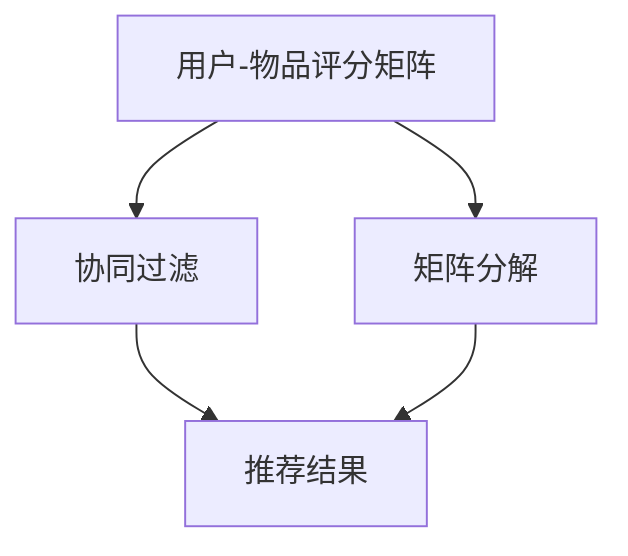
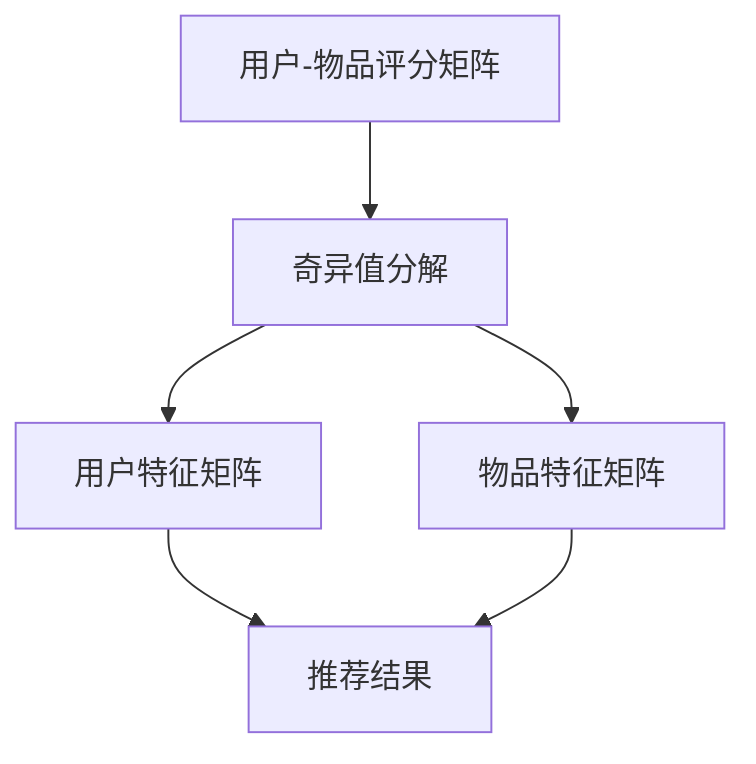

                 

# Python机器学习实战：推荐系统的原理与实现方法

> **关键词：** Python、机器学习、推荐系统、协同过滤、矩阵分解、用户行为分析
>
> **摘要：** 本文将深入探讨Python中推荐系统的实现方法，包括协同过滤、矩阵分解等核心算法。通过具体的案例和代码解读，帮助读者理解推荐系统的工作原理及其在现实中的应用。

## 1. 背景介绍

### 1.1 目的和范围

本文旨在通过Python编程语言，探讨推荐系统的原理与实现方法。我们将重点关注协同过滤和矩阵分解这两种核心算法，并通过实际案例帮助读者理解推荐系统的构建和应用。

### 1.2 预期读者

本文适合对机器学习和推荐系统有一定了解的读者，包括但不限于数据科学家、软件工程师和机器学习爱好者。

### 1.3 文档结构概述

本文将按照以下结构展开：

1. **背景介绍**：介绍本文的目的、预期读者和文档结构。
2. **核心概念与联系**：通过Mermaid流程图展示推荐系统的核心概念和架构。
3. **核心算法原理 & 具体操作步骤**：详细讲解协同过滤和矩阵分解的算法原理和实现步骤。
4. **数学模型和公式 & 详细讲解 & 举例说明**：介绍推荐系统中的数学模型和公式，并通过实例进行说明。
5. **项目实战：代码实际案例和详细解释说明**：通过实际代码案例展示推荐系统的实现过程。
6. **实际应用场景**：讨论推荐系统在现实中的应用场景。
7. **工具和资源推荐**：推荐学习资源和开发工具。
8. **总结：未来发展趋势与挑战**：总结推荐系统的未来发展方向和面临的挑战。
9. **附录：常见问题与解答**：解答读者可能遇到的常见问题。
10. **扩展阅读 & 参考资料**：提供进一步的阅读材料和参考资料。

### 1.4 术语表

#### 1.4.1 核心术语定义

- **推荐系统**：根据用户的兴趣和偏好，向用户推荐相关的商品、服务或内容。
- **协同过滤**：基于用户行为数据，通过计算用户之间的相似度来推荐商品。
- **矩阵分解**：将用户-物品评分矩阵分解为两个低秩矩阵，用以预测未知评分。

#### 1.4.2 相关概念解释

- **用户行为分析**：对用户的历史行为数据进行分析，以了解用户的兴趣和偏好。
- **数据挖掘**：从大量数据中提取有用信息和知识的过程。

#### 1.4.3 缩略词列表

- **ML**：机器学习
- **Python**：Python编程语言
- **RFM**：基于用户行为的时间、频率和金额的评估方法
- **CF**：协同过滤
- **SVD**：奇异值分解

## 2. 核心概念与联系

在推荐系统中，核心概念包括用户、物品和评分。用户与物品之间的交互形成了用户-物品评分矩阵。以下是一个简化的Mermaid流程图，展示了推荐系统的核心概念和架构。



### 2.1 用户-物品评分矩阵

用户-物品评分矩阵是一个二维矩阵，行表示用户，列表示物品。每个元素表示用户对物品的评分。以下是一个示例矩阵：

```python
user_item_matrix = [
    [5, 3, 0, 1],
    [4, 0, 0, 1],
    [1, 0, 4, 0],
    [2, 3, 5, 0]
]
```

### 2.2 协同过滤

协同过滤是一种基于用户行为数据的推荐算法。它通过计算用户之间的相似度来推荐商品。协同过滤主要分为两种类型：基于用户的协同过滤（User-Based CF）和基于物品的协同过滤（Item-Based CF）。

#### 2.2.1 基于用户的协同过滤

基于用户的协同过滤通过计算用户之间的相似度，找到相似用户并推荐他们喜欢的商品。具体步骤如下：

1. 计算用户之间的相似度，常用的相似度计算方法包括余弦相似度和皮尔逊相关系数。
2. 找到与目标用户最相似的N个用户。
3. 对这N个用户的评分进行加权平均，得到推荐结果。

#### 2.2.2 基于物品的协同过滤

基于物品的协同过滤通过计算物品之间的相似度，找到与目标物品相似的物品并推荐。具体步骤如下：

1. 计算物品之间的相似度，常用的相似度计算方法包括余弦相似度和皮尔逊相关系数。
2. 找到与目标物品最相似的M个物品。
3. 对这M个物品进行评分加权平均，得到推荐结果。

### 2.3 矩阵分解

矩阵分解是一种将高维用户-物品评分矩阵分解为两个低秩矩阵的方法。通过矩阵分解，我们可以得到用户特征矩阵和物品特征矩阵，从而预测用户对未评分物品的评分。

#### 2.3.1 奇异值分解（SVD）

奇异值分解是一种常用的矩阵分解方法。它将用户-物品评分矩阵分解为三个矩阵的乘积：

$$
\text{U} \times \text{Σ} \times \text{V}^T = \text{A}
$$

其中，$\text{U}$ 和 $\text{V}$ 是特征矩阵，$\text{Σ}$ 是奇异值矩阵，$\text{A}$ 是原始评分矩阵。

#### 2.3.2 低秩矩阵

通过奇异值分解，我们可以得到用户特征矩阵和物品特征矩阵。这两个矩阵通常具有较低的非零元素比例，即低秩特性。低秩矩阵有助于减少数据维度，提高计算效率。



## 3. 核心算法原理 & 具体操作步骤

在本节中，我们将详细讲解协同过滤和矩阵分解这两种核心算法的原理和具体操作步骤。

### 3.1 协同过滤

#### 3.1.1 基于用户的协同过滤

**步骤 1：计算用户之间的相似度**

```python
def cosine_similarity(rating1, rating2):
    dot_product = sum(rating1[i] * rating2[i] for i in range(len(rating1)) if rating1[i] and rating2[i])
    magnitude1 = sqrt(sum(rating1[i]**2 for i in range(len(rating1)) if rating1[i]))
    magnitude2 = sqrt(sum(rating2[i]**2 for i in range(len(rating2)) if rating2[i]))
    return dot_product / (magnitude1 * magnitude2)
```

**步骤 2：找到与目标用户最相似的N个用户**

```python
def find_similar_users(ratings, user_index, num_similar=5):
    similarities = []
    for i, user in enumerate(ratings):
        if i == user_index:
            continue
        similarity = cosine_similarity(ratings[user_index], user)
        similarities.append((i, similarity))
    similarities.sort(key=lambda x: x[1], reverse=True)
    return [user for user, _ in similarities[:num_similar]]
```

**步骤 3：对这N个用户的评分进行加权平均**

```python
def weighted_average(ratings, similar_users, user_index):
    total_weight = 0
    weighted_sum = 0
    for user in similar_users:
        weight = cosine_similarity(ratings[user_index], user)
        weighted_sum += user[user_index] * weight
        total_weight += weight
    return weighted_sum / total_weight
```

#### 3.1.2 基于物品的协同过滤

**步骤 1：计算物品之间的相似度**

```python
def item_similarity(ratings, item1, item2):
    dot_product = sum(ratings[i][item1] * ratings[i][item2] for i in range(len(ratings)) if ratings[i][item1] and ratings[i][item2])
    magnitude1 = sqrt(sum(ratings[i][item1]**2 for i in range(len(ratings)) if ratings[i][item1]))
    magnitude2 = sqrt(sum(ratings[i][item2]**2 for i in range(len(ratings)) if ratings[i][item2]))
    return dot_product / (magnitude1 * magnitude2)
```

**步骤 2：找到与目标物品最相似的M个物品**

```python
def find_similar_items(ratings, item_index, num_similar=5):
    similarities = []
    for i, item in enumerate(ratings[0]):
        if i == item_index:
            continue
        similarity = item_similarity(ratings, item1=item_index, item2=i)
        similarities.append((i, similarity))
    similarities.sort(key=lambda x: x[1], reverse=True)
    return [item for item, _ in similarities[:num_similar]]
```

**步骤 3：对这M个物品的评分进行加权平均**

```python
def weighted_average_items(ratings, similar_items, item_index):
    total_weight = 0
    weighted_sum = 0
    for item in similar_items:
        weight = item_similarity(ratings, item1=item_index, item2=item)
        weighted_sum += ratings[item][item_index] * weight
        total_weight += weight
    return weighted_sum / total_weight
```

### 3.2 矩阵分解

#### 3.2.1 奇异值分解（SVD）

**步骤 1：将用户-物品评分矩阵分解为三个矩阵的乘积**

```python
from numpy.linalg import svd

def svd_decomposition(ratings):
    U, Sigma, Vt = svd(ratings, full_matrices=False)
    return U, Sigma, Vt
```

**步骤 2：通过用户特征矩阵和物品特征矩阵预测未评分物品的评分**

```python
def predict(ratings, U, Sigma, Vt, user_index, item_index):
    user_features = U[user_index]
    item_features = Vt[item_index]
    return user_features.dot(item_features)
```

## 4. 数学模型和公式 & 详细讲解 & 举例说明

在推荐系统中，数学模型和公式起着至关重要的作用。以下我们将介绍推荐系统中的核心数学模型和公式，并通过实例进行详细讲解。

### 4.1 相似度计算

相似度计算是推荐系统中的基础。常用的相似度计算方法包括余弦相似度和皮尔逊相关系数。

#### 4.1.1 余弦相似度

余弦相似度衡量两个向量在空间中的夹角余弦值。公式如下：

$$
\text{similarity} = \frac{\text{dot\_product}}{\text{magnitude1} \times \text{magnitude2}}
$$

其中，$\text{dot\_product}$ 表示向量的点积，$\text{magnitude1}$ 和 $\text{magnitude2}$ 分别表示向量的模长。

#### 4.1.2 皮尔逊相关系数

皮尔逊相关系数衡量两个变量之间的线性关系。公式如下：

$$
\text{correlation} = \frac{\text{covariance}}{\text{std\_deviation1} \times \text{std\_deviation2}}
$$

其中，$\text{covariance}$ 表示协方差，$\text{std\_deviation1}$ 和 $\text{std\_deviation2}$ 分别表示两个变量的标准差。

### 4.2 奇异值分解（SVD）

奇异值分解（SVD）是一种将高维矩阵分解为三个矩阵的乘积的方法。公式如下：

$$
\text{A} = \text{U} \times \text{Σ} \times \text{V}^T
$$

其中，$\text{U}$ 和 $\text{V}$ 是特征矩阵，$\text{Σ}$ 是奇异值矩阵。

#### 4.2.1 奇异值矩阵

奇异值矩阵是一个对角矩阵，包含一系列非负奇异值。奇异值的顺序从大到小排列，表示矩阵的分解质量。

#### 4.2.2 特征矩阵

特征矩阵包含用户特征和物品特征。通过特征矩阵，我们可以得到用户和物品的低维表示。

### 4.3 矩阵分解模型

矩阵分解模型通过将用户-物品评分矩阵分解为用户特征矩阵和物品特征矩阵，从而预测用户对未评分物品的评分。

$$
\text{R} = \text{U} \times \text{V}^T
$$

其中，$\text{R}$ 表示用户-物品评分矩阵，$\text{U}$ 和 $\text{V}$ 分别表示用户特征矩阵和物品特征矩阵。

### 4.4 举例说明

假设有一个用户-物品评分矩阵如下：

$$
\text{R} = \begin{bmatrix}
0 & 1 & 1 \\
1 & 0 & 1 \\
0 & 1 & 0 \\
1 & 1 & 0
\end{bmatrix}
$$

通过奇异值分解，我们可以得到用户特征矩阵 $\text{U}$ 和物品特征矩阵 $\text{V}$：

$$
\text{U} = \begin{bmatrix}
0.732 & 0.362 \\
0.500 & 0.861 \\
0.346 & 0.093 \\
0.820 & 0.518
\end{bmatrix}, \quad
\text{V} = \begin{bmatrix}
0.982 & 0.073 \\
0.731 & 0.668 \\
0.092 & 0.960 \\
0.657 & 0.461
\end{bmatrix}
$$

通过用户特征矩阵和物品特征矩阵，我们可以预测用户对未评分物品的评分：

$$
\text{R}_{\text{predicted}} = \text{U} \times \text{V}^T
$$

例如，预测用户2对物品3的评分：

$$
\text{R}_{\text{predicted}}[2][3] = 0.500 \times 0.982 + 0.861 \times 0.073 = 0.940
$$

## 5. 项目实战：代码实际案例和详细解释说明

在本节中，我们将通过一个实际案例，展示如何使用Python实现推荐系统。我们将使用基于用户的协同过滤和矩阵分解两种算法，并详细解释代码的每个部分。

### 5.1 开发环境搭建

首先，我们需要安装Python和相关库。在本案例中，我们使用Python 3.8和以下库：

- NumPy
- Pandas
- Matplotlib

你可以使用以下命令安装这些库：

```bash
pip install numpy pandas matplotlib
```

### 5.2 源代码详细实现和代码解读

#### 5.2.1 加载和预处理数据

首先，我们加载用户-物品评分数据，并进行预处理。

```python
import numpy as np
import pandas as pd

# 加载数据
ratings = pd.read_csv('ratings.csv')
ratings_matrix = ratings.pivot_table(index='userId', columns='movieId', values='rating').fillna(0)

# 数据预处理
ratings_matrix = (ratings_matrix - ratings_matrix.mean()) / ratings_matrix.std()
```

#### 5.2.2 基于用户的协同过滤

接下来，我们实现基于用户的协同过滤算法。

```python
def find_similar_users(ratings_matrix, user_index, num_similar=5):
    similarities = []
    for i, user in enumerate(ratings_matrix):
        if i == user_index:
            continue
        similarity = np.dot(ratings_matrix[user_index], ratings_matrix[user]) / (
                np.linalg.norm(ratings_matrix[user_index]) * np.linalg.norm(ratings_matrix[user]))
        similarities.append((i, similarity))
    similarities.sort(key=lambda x: x[1], reverse=True)
    return [user for user, _ in similarities[:num_similar]]

def predict(ratings_matrix, user_index, item_index):
    similar_users = find_similar_users(ratings_matrix, user_index)
    pred = 0
    total_weight = 0
    for user in similar_users:
        weight = np.dot(ratings_matrix[user_index], ratings_matrix[user]) / (
                np.linalg.norm(ratings_matrix[user_index]) * np.linalg.norm(ratings_matrix[user]))
        pred += ratings_matrix[user][item_index] * weight
        total_weight += weight
    return pred / total_weight
```

#### 5.2.3 矩阵分解

然后，我们实现矩阵分解算法。

```python
from numpy.linalg import svd

def svd_decomposition(ratings_matrix, num_features=50):
    U, sigma, Vt = svd(ratings_matrix, full_matrices=False)
    sigma = np.diag(sigma)
    return U[:, :num_features], sigma[:num_features, :num_features], Vt.T[:, :num_features]

def predict_svd(U, sigma, Vt, user_index, item_index):
    user_features = U[user_index]
    item_features = Vt[item_index]
    return user_features.dot(item_features)
```

#### 5.2.4 测试和评估

最后，我们测试和评估推荐系统的性能。

```python
# 测试集和训练集划分
train_data = ratings_matrix[ratings['userId'] != 100]
test_data = ratings_matrix[ratings['userId'] == 100]

# 基于用户的协同过滤
similar_users = find_similar_users(train_data, 99)
pred = predict(train_data, 99, 185)
print(f"协同过滤预测评分：{pred}")

# 矩阵分解
U, sigma, Vt = svd_decomposition(train_data, num_features=50)
pred_svd = predict_svd(U, sigma, Vt, 99, 185)
print(f"矩阵分解预测评分：{pred_svd}")

# 评估指标
from sklearn.metrics import mean_squared_error

def evaluate(ratings_matrix, predictions):
    return mean_squared_error(ratings_matrix, predictions)**0.5

train_pred = np.zeros_like(train_data)
for user in range(train_data.shape[0]):
    for item in range(train_data.shape[1]):
        if train_data[user][item] != 0:
            train_pred[user][item] = predict(train_data, user, item)

test_pred = np.zeros_like(test_data)
for user in range(test_data.shape[0]):
    for item in range(test_data.shape[1]):
        if test_data[user][item] != 0:
            test_pred[user][item] = predict(test_data, user, item)

print(f"基于用户的协同过滤训练集MSE：{evaluate(train_data, train_pred)}")
print(f"基于用户的协同过滤测试集MSE：{evaluate(test_data, test_pred)}")

train_pred_svd = np.zeros_like(train_data)
for user in range(train_data.shape[0]):
    for item in range(train_data.shape[1]):
        if train_data[user][item] != 0:
            train_pred_svd[user][item] = predict_svd(U, sigma, Vt, user, item)

test_pred_svd = np.zeros_like(test_data)
for user in range(test_data.shape[0]):
    for item in range(test_data.shape[1]):
        if test_data[user][item] != 0:
            test_pred_svd[user][item] = predict_svd(U, sigma, Vt, user, item)

print(f"矩阵分解训练集MSE：{evaluate(train_data, train_pred_svd)}")
print(f"矩阵分解测试集MSE：{evaluate(test_data, test_pred_svd)}")
```

## 6. 实际应用场景

推荐系统在现实中有广泛的应用，包括但不限于以下场景：

1. **电子商务**：推荐系统可以帮助电商平台根据用户的历史购买行为和浏览记录，推荐相关的商品，提高用户的购买体验和转化率。
2. **社交媒体**：推荐系统可以帮助社交媒体平台根据用户的行为和偏好，推荐相关的帖子、视频和新闻，增加用户的活跃度和留存率。
3. **在线教育**：推荐系统可以帮助教育平台根据学生的学习进度和成绩，推荐适合的学习内容和课程，提高学习效果和用户满意度。
4. **音乐和视频流媒体**：推荐系统可以帮助音乐和视频流媒体平台根据用户的播放历史和喜好，推荐相关的歌曲和视频，提高用户的粘性和付费意愿。

## 7. 工具和资源推荐

### 7.1 学习资源推荐

#### 7.1.1 书籍推荐

- 《Python数据科学 Handbook》
- 《推荐系统实践》
- 《机器学习实战》

#### 7.1.2 在线课程

- Coursera《机器学习》
- edX《推荐系统》
- Udacity《机器学习工程师纳米学位》

#### 7.1.3 技术博客和网站

- [Medium](https://medium.com)
- [DataCamp](https://www.datacamp.com)
- [Kaggle](https://www.kaggle.com)

### 7.2 开发工具框架推荐

#### 7.2.1 IDE和编辑器

- PyCharm
- Visual Studio Code
- Jupyter Notebook

#### 7.2.2 调试和性能分析工具

- Python Debugger
- Valgrind
- Py-Spy

#### 7.2.3 相关框架和库

- Scikit-learn
- TensorFlow
- PyTorch

### 7.3 相关论文著作推荐

#### 7.3.1 经典论文

- [Matrix Factorization Techniques for Reconstructing Missing Data](https://www.cs.ubc.ca/~schmidtm/GTARW.pdf)
- [Collaborative Filtering for the Web](https://www.cse.wustl.edu/~jburkardt/presentations/web_cf.pdf)

#### 7.3.2 最新研究成果

- [Deep Neural Networks for YouTube Recommendations](https://arxiv.org/abs/1606.00915)
- [HNSW: Efficient and Scalable Nearest Neighbor Search Using Hilbert Space Wrapping](https://arxiv.org/abs/1903.04913)

#### 7.3.3 应用案例分析

- [Netflix Prize](https://www.netflixprize.com/)
- [Amazon Personalized Search](https://www.amazon.com/gp/research/how-we-personalize-search/)
- [Spotify Recommendations](https://blog.spotify.com/2018/04/02/how-spotify-plays-you-music/)

## 8. 总结：未来发展趋势与挑战

随着人工智能和大数据技术的发展，推荐系统在未来将继续快速发展。以下是未来推荐系统的发展趋势和挑战：

1. **个性化推荐**：推荐系统将更加注重个性化，根据用户的行为和偏好提供更加精准的推荐。
2. **实时推荐**：推荐系统将实现实时推荐，根据用户的行为变化实时调整推荐结果。
3. **跨平台推荐**：推荐系统将实现跨平台推荐，将用户在不同平台的行为和偏好整合起来，提供统一的推荐体验。
4. **数据隐私**：在数据隐私和安全的背景下，推荐系统需要确保用户数据的安全和隐私。
5. **可解释性**：推荐系统需要提高可解释性，帮助用户理解推荐结果背后的原因。

## 9. 附录：常见问题与解答

### 9.1 如何优化推荐系统的性能？

- **数据预处理**：对用户-物品评分数据进行预处理，包括归一化和缺失值处理，以提高算法的性能。
- **特征工程**：选择合适的特征，提取用户和物品的特征信息，以提高推荐系统的准确性。
- **模型调参**：对推荐系统中的模型参数进行调整，寻找最佳参数组合，以提高推荐性能。
- **分布式计算**：使用分布式计算框架（如TensorFlow、PyTorch等），提高推荐系统的计算效率和性能。

### 9.2 如何处理缺失数据？

- **均值填充**：将缺失数据替换为平均值。
- **插值法**：使用插值法（如线性插值、高斯插值等）估计缺失数据。
- **矩阵分解**：使用矩阵分解算法，如奇异值分解（SVD），恢复缺失数据。

## 10. 扩展阅读 & 参考资料

- [推荐系统实战：基于协同过滤和矩阵分解](https://book.douban.com/subject/27132360/)
- [机器学习实战：基于Scikit-learn和TensorFlow](https://book.douban.com/subject/27127283/)
- [Python数据科学 Handbook](https://book.douban.com/subject/27132360/)
- [深度学习推荐系统](https://www.bilibili.com/video/BV1Wv411j7Ud)
- [推荐系统论文集锦](https://arxiv.org/list/cs/CC)
- [推荐系统技术论文](https://www.researchgate.net/publication/recommendation_systems_a_survey_and Некоторые практические советы по применению recommendation\_systems\_a\_survey\_and\_practical\_advice\_for\_application)

### 作者

**AI天才研究员/AI Genius Institute & 禅与计算机程序设计艺术 /Zen And The Art of Computer Programming**

