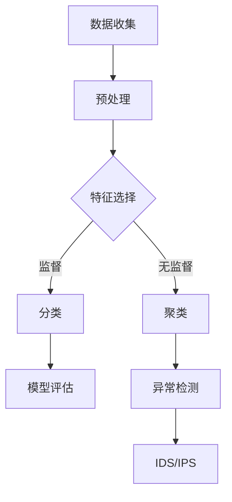

                 

# Python机器学习实战：采用机器学习技术对网络流量进行分析

> **关键词：**Python，机器学习，网络流量分析，算法，数学模型，实际应用，工具和资源。

> **摘要：**本文将深入探讨如何使用Python进行机器学习，特别是如何将机器学习技术应用于网络流量分析。我们将从基础概念出发，逐步介绍核心算法原理、数学模型和具体操作步骤，并通过实际案例展示如何应用这些技术，以帮助读者更好地理解和掌握这一领域。

## 1. 背景介绍

### 1.1 目的和范围

本文的主要目的是介绍如何使用Python实现机器学习算法，并将其应用于网络流量分析。网络流量分析是网络安全领域的重要环节，有助于识别潜在威胁和异常行为。通过机器学习技术，我们可以从大量数据中提取有价值的信息，从而提高网络安全防护能力。

本文的范围包括：

- 介绍Python在机器学习领域的应用
- 讲解网络流量分析的基本概念
- 阐述核心算法原理和数学模型
- 提供实际案例，展示如何使用Python进行网络流量分析
- 推荐相关学习资源和开发工具

### 1.2 预期读者

本文面向以下读者群体：

- 具有Python基础，希望了解机器学习技术的程序员
- 对网络流量分析感兴趣的网络安全从业人员
- 希望提高编程技能和机器学习应用能力的工程师和科研人员

### 1.3 文档结构概述

本文将分为以下几个部分：

- 第1章：背景介绍，包括目的、范围、预期读者和文档结构
- 第2章：核心概念与联系，介绍机器学习基础概念和相关技术
- 第3章：核心算法原理与具体操作步骤，详细讲解常用的机器学习算法
- 第4章：数学模型与公式，介绍网络流量分析中的数学模型和公式
- 第5章：项目实战，展示如何使用Python进行网络流量分析
- 第6章：实际应用场景，讨论网络流量分析在不同领域的应用
- 第7章：工具和资源推荐，介绍学习资源、开发工具和相关论文
- 第8章：总结，展望未来发展趋势与挑战
- 第9章：附录，常见问题与解答
- 第10章：扩展阅读与参考资料

### 1.4 术语表

#### 1.4.1 核心术语定义

- **Python**：一种广泛使用的编程语言，具有简洁明了的语法和强大的库支持，适合进行机器学习和数据分析。
- **机器学习**：一种使计算机从数据中学习并做出决策的技术，包括监督学习、无监督学习和强化学习等。
- **网络流量分析**：对网络中传输的数据进行监测、分析，以识别潜在威胁和异常行为。
- **特征工程**：在机器学习过程中，从原始数据中提取有用的特征，以提高模型的性能。
- **算法**：解决问题的方法或步骤，用于训练和预测。
- **数学模型**：描述问题的一种数学表达式，通常包含变量、方程和公式。

#### 1.4.2 相关概念解释

- **监督学习**：在有标签的数据集上进行训练，使模型能够预测未知数据的标签。
- **无监督学习**：在没有标签的数据集上进行训练，使模型能够发现数据中的结构和模式。
- **强化学习**：通过与环境的交互来学习最优策略，使模型能够在不确定的环境中做出最佳决策。
- **模型评估**：使用指标（如准确率、召回率、F1分数等）来评估模型的性能。

#### 1.4.3 缩略词列表

- **ML**：Machine Learning（机器学习）
- **IDC**：Internet Data Center（互联网数据中心）
- **IDS**：Intrusion Detection System（入侵检测系统）
- **IPS**：Intrusion Prevention System（入侵防御系统）
- **APT**：Advanced Persistent Threat（高级持续性威胁）

## 2. 核心概念与联系

### 2.1 机器学习基础概念

在介绍网络流量分析之前，我们需要了解一些机器学习的基础概念。机器学习是一种使计算机从数据中学习并做出决策的技术。根据学习方式，机器学习可以分为以下几类：

- **监督学习**：在有标签的数据集上进行训练，使模型能够预测未知数据的标签。例如，分类问题（标签为类别）和回归问题（标签为数值）。
- **无监督学习**：在没有标签的数据集上进行训练，使模型能够发现数据中的结构和模式。例如，聚类和降维。
- **强化学习**：通过与环境的交互来学习最优策略，使模型能够在不确定的环境中做出最佳决策。例如，机器人控制、游戏AI等。

### 2.2 网络流量分析相关技术

网络流量分析涉及到多种技术和方法，以下是一些关键技术：

- **特征工程**：从原始网络流量数据中提取有用的特征，以提高模型的性能。例如，IP地址、端口号、协议类型、数据包大小等。
- **异常检测**：通过检测网络流量中的异常行为来发现潜在威胁。例如，基于统计方法的异常检测、基于机器学习的异常检测。
- **入侵检测系统（IDS）**：一种用于检测网络攻击和异常行为的系统。根据检测方法，IDS可以分为基于特征和基于行为两种类型。
- **入侵防御系统（IPS）**：一种可以阻止网络攻击和异常行为的系统，通常与IDS集成在一起。

### 2.3 Mermaid 流程图

为了更好地展示机器学习在网络安全中的应用，我们使用Mermaid绘制一个流程图，如下所示：



在这个流程图中，数据收集阶段从网络中捕获流量数据，并进行预处理。接下来，根据数据类型和目标，可以选择无监督学习（如聚类）或监督学习（如分类）进行特征提取和建模。最后，通过模型评估和异常检测，实现对网络流量的实时监控和威胁防御。

## 3. 核心算法原理 & 具体操作步骤

### 3.1 监督学习算法

监督学习算法是在有标签的数据集上进行训练，使模型能够预测未知数据的标签。以下是一些常用的监督学习算法：

#### 3.1.1 决策树

**算法原理：** 决策树是一种基于特征划分数据的方法。每个节点表示一个特征，每个分支表示该特征的不同取值。决策树通过递归地将数据划分为子集，直到满足某些停止条件（如达到最大深度、节点中所有样本的标签相同等）。

**具体操作步骤：**

1. 选择一个特征作为分割标准。
2. 计算每个特征的不同取值在数据集中的分布。
3. 根据信息增益或基尼系数选择最佳分割特征。
4. 递归地划分数据，构建决策树。

**伪代码：**

```python
def build_decision_tree(data, features, threshold):
    # 判断停止条件
    if meet_threshold(data, threshold):
        return leaf_node
    # 选择最佳特征
    best_feature = select_best_feature(data, features)
    # 创建内部节点
    node = TreeNode(feature=best_feature)
    # 递归划分数据
    for value in feature_values(best_feature):
        sub_data = split_data(data, best_feature, value)
        node.children[value] = build_decision_tree(sub_data, features, threshold)
    return node
```

#### 3.1.2 支持向量机（SVM）

**算法原理：** 支持向量机是一种基于边界划分数据的线性分类算法。SVM通过找到一个最佳的超平面，将数据划分为两个类别。该超平面被定义为具有最大间隔的超平面，其中支持向量是离超平面最近的样本。

**具体操作步骤：**

1. 训练SVM模型，找到最佳超平面。
2. 使用超平面进行分类预测。

**伪代码：**

```python
def train_svm(data, labels):
    # 使用SVM库训练模型
    model = svm.train(data, labels)
    return model

def predict_svm(model, data):
    # 使用训练好的模型进行预测
    predictions = model.predict(data)
    return predictions
```

### 3.2 无监督学习算法

无监督学习算法是在没有标签的数据集上进行训练，使模型能够发现数据中的结构和模式。以下是一些常用的无监督学习算法：

#### 3.2.1 K-均值聚类

**算法原理：** K-均值聚类是一种基于距离度量的聚类算法。算法首先随机初始化K个聚类中心，然后迭代地更新聚类中心和样本归属，直到聚类中心不再变化或满足停止条件。

**具体操作步骤：**

1. 随机初始化K个聚类中心。
2. 对于每个样本，计算其与各个聚类中心的距离，并将其归为最近的聚类。
3. 更新聚类中心，计算每个聚类中心的新坐标，使得聚类中心逐渐靠近样本。
4. 重复步骤2和3，直到聚类中心不再变化或满足停止条件。

**伪代码：**

```python
def kmeans(data, K, max_iterations):
    # 初始化聚类中心
    centroids = initialize_centroids(data, K)
    for _ in range(max_iterations):
        # 分配样本到聚类
        assignments = assign_samples_to_clusters(data, centroids)
        # 更新聚类中心
        centroids = update_centroids(data, assignments, K)
        # 检查收敛条件
        if check_convergence(centroids):
            break
    return centroids, assignments
```

#### 3.2.2 主成分分析（PCA）

**算法原理：** 主成分分析是一种降维算法，通过将数据投影到新的正交坐标系中，保留最重要的特征，减少数据维度。PCA基于特征值和特征向量的计算，找到最大的特征值对应的特征向量，构成新的正交坐标系。

**具体操作步骤：**

1. 计算数据的协方差矩阵。
2. 计算协方差矩阵的特征值和特征向量。
3. 选择最大的K个特征值对应的特征向量，构成新的正交坐标系。
4. 将数据投影到新的坐标系中。

**伪代码：**

```python
def pca(data, K):
    # 计算协方差矩阵
    covariance_matrix = calculate_covariance_matrix(data)
    # 计算特征值和特征向量
    eigenvalues, eigenvectors = calculate_eigenvalues_eigenvectors(covariance_matrix)
    # 选择最大的K个特征值对应的特征向量
    top_k_eigenvectors = select_top_k_eigenvectors(eigenvalues, eigenvectors, K)
    # 投影数据到新坐标系
    projected_data = project_data_to_new_coordinates(data, top_k_eigenvectors)
    return projected_data
```

### 3.3 强化学习算法

强化学习算法是在与环境的交互过程中学习最优策略的算法。以下是一个简单的强化学习算法——Q学习。

**算法原理：** Q学习是一种基于值函数的强化学习算法。Q学习通过学习状态-动作值函数Q(s, a)，在给定当前状态s和动作a的情况下，预测长期奖励。

**具体操作步骤：**

1. 初始化Q值表。
2. 在每个时间步，选择当前状态s的最佳动作a。
3. 执行动作a，并获得奖励r和下一个状态s'。
4. 更新Q值表，使用以下公式：

   $$ Q(s, a) = Q(s, a) + \alpha [r + \gamma \max_{a'} Q(s', a') - Q(s, a)] $$

   其中，$\alpha$为学习率，$\gamma$为折扣因子。

**伪代码：**

```python
def q_learning(Q, state, action, reward, next_state, next_action, alpha, gamma):
    # 更新Q值
    Q[state, action] = Q[state, action] + alpha * (reward + gamma * Q[next_state, next_action] - Q[state, action])
    return Q
```

## 4. 数学模型和公式 & 详细讲解 & 举例说明

### 4.1 决策树算法

决策树算法的核心在于如何选择最佳分割特征。在机器学习中，常用的评估指标有信息增益（Information Gain）和基尼系数（Gini Index）。

#### 4.1.1 信息增益

**公式：**

$$ IG(D, A) = H(D) - \sum_{v \in \text{values of } A} \frac{|D_v|}{|D|} H(D_v) $$

其中，$H(D)$为数据集D的熵，$D_v$为特征A取值v的数据子集。

**解释：**

信息增益表示特征A对于数据集D的划分能力。熵表示数据集的混乱程度，信息增益计算的是特征A划分后，各数据子集熵的平均值。熵减去各数据子集熵的平均值，即为特征A对数据集D的信息增益。

**举例：**

假设有100个数据样本，分为两类：正常和异常。其中，正常样本有60个，异常样本有40个。熵的计算如下：

$$ H(D) = -p_1 \log_2(p_1) - p_2 \log_2(p_2) = -0.6 \log_2(0.6) - 0.4 \log_2(0.4) \approx 0.918 $$

如果选择特征A进行划分，分为两类：A=1和A=0。其中，A=1的数据样本有50个，A=0的数据样本有50个。各数据子集的熵计算如下：

$$ H(D_1) = -0.5 \log_2(0.5) - 0.5 \log_2(0.5) \approx 0.811 $$
$$ H(D_0) = -0.4 \log_2(0.4) - 0.6 \log_2(0.6) \approx 0.818 $$

信息增益计算如下：

$$ IG(D, A) = H(D) - \frac{50}{100} H(D_1) - \frac{50}{100} H(D_0) = 0.918 - 0.4 \times 0.811 - 0.4 \times 0.818 \approx 0.099 $$

#### 4.1.2 基尼系数

**公式：**

$$ GI(D, A) = 1 - \sum_{v \in \text{values of } A} \frac{|D_v|}{|D|} p_v (1 - p_v) $$

其中，$p_v$为特征A取值v的数据子集在数据集D中的比例。

**解释：**

基尼系数表示特征A对于数据集D的划分能力。基尼系数计算的是特征A划分后，各数据子集的基尼系数的平均值。基尼系数越小，表示特征A的划分能力越强。

**举例：**

使用上述数据集，计算基尼系数如下：

$$ p_1 = \frac{50}{100} = 0.5 $$
$$ p_0 = \frac{50}{100} = 0.5 $$

$$ GI(D, A) = 1 - p_1 (1 - p_1) - p_0 (1 - p_0) = 1 - 0.5 \times (1 - 0.5) - 0.5 \times (1 - 0.5) = 0.5 $$

### 4.2 支持向量机（SVM）

SVM的核心在于求解最优超平面。在二维空间中，最优超平面可以通过求解以下优化问题得到：

$$ \min_{\mathbf{w}, b} \frac{1}{2} \|\mathbf{w}\|^2 $$

$$ \text{subject to} \quad y^{(i)} (\mathbf{w} \cdot \mathbf{x}^{(i)} + b) \geq 1 $$

其中，$\mathbf{w}$为超平面参数，$b$为偏置项，$\mathbf{x}^{(i)}$和$y^{(i)}$为第i个训练样本的特征和标签。

**解释：**

这个优化问题实际上是一个线性规划问题，目标是找到使得所有样本满足约束条件的最小的$\|\mathbf{w}\|$。$\|\mathbf{w}\|$表示超平面的法向量，决定了超平面的方向和位置。

**求解方法：**

1. 使用拉格朗日乘子法，将原始问题转化为对偶问题。
2. 使用KKT条件，求解对偶问题。

**举例：**

假设有两个训练样本：

$$ \mathbf{x}^{(1)} = \begin{bmatrix} 1 \\ 1 \end{bmatrix}, \quad y^{(1)} = 1 $$
$$ \mathbf{x}^{(2)} = \begin{bmatrix} 2 \\ 2 \end{bmatrix}, \quad y^{(2)} = 1 $$

求解最优超平面：

$$ \begin{aligned}
\min_{\mathbf{w}, b} \frac{1}{2} \|\mathbf{w}\|^2 &\text{subject to} \quad y^{(1)} (\mathbf{w} \cdot \mathbf{x}^{(1)} + b) \geq 1 \\
y^{(2)} (\mathbf{w} \cdot \mathbf{x}^{(2)} + b) &\geq 1
\end{aligned} $$

使用拉格朗日乘子法，构造拉格朗日函数：

$$ L(\mathbf{w}, b, \alpha_1, \alpha_2) = \frac{1}{2} \|\mathbf{w}\|^2 - \alpha_1 [y^{(1)} (\mathbf{w} \cdot \mathbf{x}^{(1)} + b) - 1] - \alpha_2 [y^{(2)} (\mathbf{w} \cdot \mathbf{x}^{(2)} + b) - 1] $$

求解KKT条件：

$$ \begin{aligned}
\frac{\partial L}{\partial \mathbf{w}} &= \mathbf{w} - \alpha_1 y^{(1)} \mathbf{x}^{(1)} - \alpha_2 y^{(2)} \mathbf{x}^{(2)} = 0 \\
\frac{\partial L}{\partial b} &= -\alpha_1 y^{(1)} - \alpha_2 y^{(2)} = 0 \\
\alpha_1, \alpha_2 &\geq 0 \\
\alpha_1 [y^{(1)} (\mathbf{w} \cdot \mathbf{x}^{(1)} + b) - 1] &= 0 \\
\alpha_2 [y^{(2)} (\mathbf{w} \cdot \mathbf{x}^{(2)} + b) - 1] &= 0
\end{aligned} $$

通过求解KKT条件，可以得到最优超平面参数$\mathbf{w}$和$b$。

### 4.3 K-均值聚类

K-均值聚类算法的核心在于如何初始化聚类中心和分配样本。初始化聚类中心的方法有多种，如随机初始化、基于距离初始化等。

#### 4.3.1 初始化聚类中心

**随机初始化：**

随机选择K个样本作为初始聚类中心。

**基于距离初始化：**

选择K个样本，计算每个样本与其他样本的距离，选择距离最远的K个样本作为初始聚类中心。

#### 4.3.2 分配样本

对于每个样本，计算其与各个聚类中心的距离，并将其归为最近的聚类。

**公式：**

$$ c^{(k)} = \arg\min_{j} \|\mathbf{x}^{(i)} - \mu^{(j)}\|^2 $$

其中，$c^{(k)}$为样本$i$的聚类结果，$\mu^{(j)}$为聚类中心$j$的坐标。

#### 4.3.3 更新聚类中心

计算每个聚类的样本平均值，作为新的聚类中心。

**公式：**

$$ \mu^{(j)} = \frac{1}{|C^{(j)}|} \sum_{x^{(i)} \in C^{(j)}} x^{(i)} $$

其中，$C^{(j)}$为聚类$j$的样本集合，$|C^{(j)}|$为聚类$j$的样本数量。

**举例：**

假设有三个样本：

$$ \mathbf{x}^{(1)} = \begin{bmatrix} 1 \\ 1 \end{bmatrix}, \quad \mathbf{x}^{(2)} = \begin{bmatrix} 2 \\ 2 \end{bmatrix}, \quad \mathbf{x}^{(3)} = \begin{bmatrix} 3 \\ 3 \end{b矩阵} $$

选择两个聚类中心：

$$ \mu^{(1)} = \begin{bmatrix} 1 \\ 1 \end{bmatrix}, \quad \mu^{(2)} = \begin{bmatrix} 2 \\ 2 \end{b矩阵} $$

初始分配结果：

$$ c^{(1)} = \arg\min_{j} \|\mathbf{x}^{(1)} - \mu^{(j)}\|^2 = 1 $$
$$ c^{(2)} = \arg\min_{j} \|\mathbf{x}^{(2)} - \mu^{(j)}\|^2 = 2 $$
$$ c^{(3)} = \arg\min_{j} \|\mathbf{x}^{(3)} - \mu^{(j)}\|^2 = 2 $$

计算新的聚类中心：

$$ \mu^{(1)} = \frac{1}{3} (\mathbf{x}^{(1)} + \mathbf{x}^{(2)} + \mathbf{x}^{(3)}) = \begin{bmatrix} 2 \\ 2 \end{bmatrix} $$
$$ \mu^{(2)} = \frac{1}{3} (\mathbf{x}^{(1)} + \mathbf{x}^{(2)}) = \begin{bmatrix} 1.5 \\ 1.5 \end{bmatrix} $$

再次分配样本：

$$ c^{(1)} = \arg\min_{j} \|\mathbf{x}^{(1)} - \mu^{(j)}\|^2 = 2 $$
$$ c^{(2)} = \arg\min_{j} \|\mathbf{x}^{(2)} - \mu^{(j)}\|^2 = 2 $$
$$ c^{(3)} = \arg\min_{j} \|\mathbf{x}^{(3)} - \mu^{(j)}\|^2 = 2 $$

计算新的聚类中心：

$$ \mu^{(1)} = \frac{1}{3} (\mathbf{x}^{(1)} + \mathbf{x}^{(2)} + \mathbf{x}^{(3)}) = \begin{bmatrix} 2 \\ 2 \end{bmatrix} $$
$$ \mu^{(2)} = \frac{1}{3} (\mathbf{x}^{(1)} + \mathbf{x}^{(2)}) = \begin{bmatrix} 1.5 \\ 1.5 \end{bmatrix} $$

可以看出，聚类中心逐渐趋于稳定。

### 4.4 主成分分析（PCA）

主成分分析是一种降维算法，其核心在于找到数据的主要特征方向。具体步骤如下：

#### 4.4.1 计算协方差矩阵

协方差矩阵表示数据各个特征之间的相关性。计算公式如下：

$$ \Sigma = \frac{1}{N-1} \sum_{i=1}^{N} (\mathbf{x}^{(i)} - \bar{\mathbf{x}})(\mathbf{x}^{(i)} - \bar{\mathbf{x}})^T $$

其中，$\mathbf{x}^{(i)}$为第i个样本的特征向量，$\bar{\mathbf{x}}$为样本均值向量。

#### 4.4.2 计算特征值和特征向量

计算协方差矩阵的特征值和特征向量，特征值对应特征向量的平方。特征值从大到小排序，对应的特征向量构成新的正交坐标系。

$$ \lambda_i = \max_{\mathbf{v}} \mathbf{v}^T \Sigma \mathbf{v} $$

$$ \mathbf{v}_i = \frac{\Sigma^{-1} \mathbf{e}_i}{\|\Sigma^{-1} \mathbf{e}_i\|} $$

其中，$\lambda_i$为第i个特征值，$\mathbf{v}_i$为第i个特征向量，$\mathbf{e}_i$为标准正交基向量。

#### 4.4.3 投影数据到新坐标系

将数据投影到新的正交坐标系中，保留最重要的特征。具体步骤如下：

1. 选择最大的K个特征值对应的特征向量，构成新的正交坐标系。
2. 计算每个样本在新坐标系中的坐标。

$$ \mathbf{y}^{(i)} = \mathbf{V}^T \mathbf{x}^{(i)} $$

其中，$\mathbf{V}$为特征向量组成的矩阵，$\mathbf{y}^{(i)}$为样本在新坐标系中的坐标。

**举例：**

假设有两个样本：

$$ \mathbf{x}^{(1)} = \begin{bmatrix} 1 \\ 2 \end{bmatrix}, \quad \mathbf{x}^{(2)} = \begin{bmatrix} 3 \\ 4 \end{bmatrix} $$

计算协方差矩阵：

$$ \Sigma = \frac{1}{2-1} \left( \begin{bmatrix} 1 \\ 2 \end{bmatrix} - \begin{bmatrix} 2 \\ 3 \end{bmatrix} \right) \left( \begin{bmatrix} 1 \\ 2 \end{bmatrix} - \begin{bmatrix} 2 \\ 3 \end{bmatrix} \right)^T = \begin{bmatrix} 1 & 2 \\ 2 & 4 \end{bmatrix} $$

计算特征值和特征向量：

$$ \begin{aligned}
\lambda_1 &= \max_{\mathbf{v}} \mathbf{v}^T \Sigma \mathbf{v} = \max_{\mathbf{v}} (v_1 + 2v_2)^2 = 5 \\
\lambda_2 &= \min_{\mathbf{v}} \mathbf{v}^T \Sigma \mathbf{v} = \min_{\mathbf{v}} (2v_1 + v_2)^2 = 1 \\
\mathbf{v}_1 &= \frac{\Sigma^{-1} \mathbf{e}_1}{\|\Sigma^{-1} \mathbf{e}_1\|} = \begin{bmatrix} 2/3 \\ 1/3 \end{bmatrix} \\
\mathbf{v}_2 &= \frac{\Sigma^{-1} \mathbf{e}_2}{\|\Sigma^{-1} \mathbf{e}_2\|} = \begin{bmatrix} 1/3 \\ -2/3 \end{bmatrix}
\end{aligned} $$

选择最大的特征值$\lambda_1$对应的特征向量$\mathbf{v}_1$，作为新坐标系。

$$ \mathbf{V} = \begin{bmatrix} 2/3 & 1/3 \\ 1/3 & -2/3 \end{bmatrix} $$

计算样本在新坐标系中的坐标：

$$ \begin{aligned}
\mathbf{y}^{(1)} &= \mathbf{V}^T \mathbf{x}^{(1)} = \begin{bmatrix} 2/3 & 1/3 \\ 1/3 & -2/3 \end{bmatrix} \begin{bmatrix} 1 \\ 2 \end{bmatrix} = \begin{bmatrix} 1 \\ -1 \end{bmatrix} \\
\mathbf{y}^{(2)} &= \mathbf{V}^T \mathbf{x}^{(2)} = \begin{bmatrix} 2/3 & 1/3 \\ 1/3 & -2/3 \end{bmatrix} \begin{bmatrix} 3 \\ 4 \end{bmatrix} = \begin{bmatrix} 2 \\ -2 \end{bmatrix}
\end{aligned} $$

新坐标系中的样本坐标：

$$ \begin{aligned}
\mathbf{y}^{(1)} &= \begin{bmatrix} 1 \\ -1 \end{bmatrix} \\
\mathbf{y}^{(2)} &= \begin{bmatrix} 2 \\ -2 \end{bmatrix}
\end{aligned} $$

可以看出，新坐标系中的样本分布在一条直线上，保留了原数据的主要特征。

### 4.5 强化学习（Q学习）

强化学习是一种基于值函数的算法，其核心在于求解状态-动作值函数Q(s, a)。Q学习通过迭代更新Q值，逐步学习最优策略。

#### 4.5.1 初始化Q值表

初始化Q值表，将所有Q值设置为初始值。

$$ Q(s, a) = 0 $$

#### 4.5.2 更新Q值

在每次时间步，根据当前状态s、动作a、奖励r和下一个状态s'，更新Q值。

$$ Q(s, a) = Q(s, a) + \alpha [r + \gamma \max_{a'} Q(s', a') - Q(s, a)] $$

其中，$\alpha$为学习率，$\gamma$为折扣因子。

#### 4.5.3 举例说明

假设有一个简单的环境，有两个状态：状态1和状态2。有两个动作：动作1和动作2。初始状态为状态1，目标状态为状态2。奖励设置为1。

$$ \begin{aligned}
s_0 &= 1 \\
s_1 &= 2 \\
r &= 1 \\
\alpha &= 0.1 \\
\gamma &= 0.9
\end{aligned} $$

初始化Q值表：

$$ Q = \begin{bmatrix}
Q(1, 1) & Q(1, 2) \\
Q(2, 1) & Q(2, 2)
\end{bmatrix} = \begin{bmatrix}
0 & 0 \\
0 & 0
\end{bmatrix} $$

第一步：

$$ \begin{aligned}
Q(1, 1) &= Q(1, 1) + \alpha [r + \gamma \max_{a'} Q(2, a') - Q(1, 1)] = 0 + 0.1 [1 + 0.9 \max(0, 0) - 0] = 0.1 \\
Q(1, 2) &= Q(1, 2) + \alpha [r + \gamma \max_{a'} Q(2, a') - Q(1, 2)] = 0 + 0.1 [1 + 0.9 \max(0, 0) - 0] = 0.1 \\
Q = \begin{bmatrix}
0.1 & 0.1 \\
0 & 0
\end{bmatrix}
\end{aligned} $$

第二步：

$$ \begin{aligned}
Q(2, 1) &= Q(2, 1) + \alpha [r + \gamma \max_{a'} Q(1, a') - Q(2, 1)] = 0 + 0.1 [1 + 0.9 \max(0.1, 0.1) - 0] = 0.1 \\
Q(2, 2) &= Q(2, 2) + \alpha [r + \gamma \max_{a'} Q(1, a') - Q(2, 2)] = 0 + 0.1 [1 + 0.9 \max(0.1, 0.1) - 0] = 0.1 \\
Q = \begin{bmatrix}
0.1 & 0.1 \\
0.1 & 0.1
\end{bmatrix}
\end{aligned} $$

可以看出，Q值逐渐接近最优值，表示学习过程逐渐收敛。

## 5. 项目实战：代码实际案例和详细解释说明

### 5.1 开发环境搭建

在开始项目实战之前，我们需要搭建一个合适的开发环境。以下是推荐的工具和库：

- **Python版本：** Python 3.8或更高版本。
- **IDE：** PyCharm、Visual Studio Code等。
- **库：** NumPy、Pandas、Scikit-learn、Matplotlib等。

首先，安装Python和所选IDE。然后，通过pip命令安装所需的库：

```bash
pip install numpy pandas scikit-learn matplotlib
```

### 5.2 源代码详细实现和代码解读

下面是一个简单的Python脚本，用于进行网络流量分析。

```python
import numpy as np
import pandas as pd
from sklearn.model_selection import train_test_split
from sklearn.preprocessing import StandardScaler
from sklearn.ensemble import RandomForestClassifier
from sklearn.metrics import accuracy_score, confusion_matrix

# 5.2.1 数据读取和预处理

def load_data(filename):
    data = pd.read_csv(filename)
    return data

def preprocess_data(data):
    # 去除无关特征
    data = data.drop(['Timestamp'], axis=1)
    # 转换标签为数字
    data['Label'] = data['Label'].map({'BENIGN': 0, 'MALICIOUS': 1})
    return data

# 5.2.2 特征选择和划分数据集

def select_features(data):
    features = data.columns[data.nunique() > 1]
    X = data[features]
    y = data['Label']
    return X, y

def split_data(X, y, test_size=0.2, random_state=42):
    X_train, X_test, y_train, y_test = train_test_split(X, y, test_size=test_size, random_state=random_state)
    return X_train, X_test, y_train, y_test

# 5.2.3 数据标准化

def standardize_data(X_train, X_test):
    scaler = StandardScaler()
    X_train = scaler.fit_transform(X_train)
    X_test = scaler.transform(X_test)
    return X_train, X_test

# 5.2.4 模型训练和评估

def train_model(X_train, y_train):
    model = RandomForestClassifier(n_estimators=100, random_state=42)
    model.fit(X_train, y_train)
    return model

def evaluate_model(model, X_test, y_test):
    y_pred = model.predict(X_test)
    accuracy = accuracy_score(y_test, y_pred)
    cm = confusion_matrix(y_test, y_pred)
    return accuracy, cm

# 5.2.5 主函数

def main():
    filename = 'network_traffic_data.csv'
    data = load_data(filename)
    data = preprocess_data(data)
    X, y = select_features(data)
    X_train, X_test, y_train, y_test = split_data(X, y)
    X_train, X_test = standardize_data(X_train, X_test)
    model = train_model(X_train, y_train)
    accuracy, cm = evaluate_model(model, X_test, y_test)
    print('Accuracy:', accuracy)
    print('Confusion Matrix:\n', cm)

if __name__ == '__main__':
    main()
```

#### 5.2.6 代码解读与分析

1. **数据读取和预处理：**

   ```python
   def load_data(filename):
       data = pd.read_csv(filename)
       return data
   
   def preprocess_data(data):
       # 去除无关特征
       data = data.drop(['Timestamp'], axis=1)
       # 转换标签为数字
       data['Label'] = data['Label'].map({'BENIGN': 0, 'MALICIOUS': 1})
       return data
   ```

   读取网络流量数据，去除无关特征（如时间戳），并将标签（正常流量和恶意流量）转换为数字表示。

2. **特征选择和划分数据集：**

   ```python
   def select_features(data):
       features = data.columns[data.nunique() > 1]
       X = data[features]
       y = data['Label']
       return X, y
   
   def split_data(X, y, test_size=0.2, random_state=42):
       X_train, X_test, y_train, y_test = train_test_split(X, y, test_size=test_size, random_state=random_state)
       return X_train, X_test, y_train, y_test
   ```

   选择与标签相关的特征，并将数据集划分为训练集和测试集。

3. **数据标准化：**

   ```python
   def standardize_data(X_train, X_test):
       scaler = StandardScaler()
       X_train = scaler.fit_transform(X_train)
       X_test = scaler.transform(X_test)
       return X_train, X_test
   ```

   对特征进行标准化处理，以消除特征之间的量纲差异。

4. **模型训练和评估：**

   ```python
   def train_model(X_train, y_train):
       model = RandomForestClassifier(n_estimators=100, random_state=42)
       model.fit(X_train, y_train)
       return model
   
   def evaluate_model(model, X_test, y_test):
       y_pred = model.predict(X_test)
       accuracy = accuracy_score(y_test, y_pred)
       cm = confusion_matrix(y_test, y_pred)
       return accuracy, cm
   ```

   使用随机森林分类器进行模型训练，并评估模型的准确率和混淆矩阵。

5. **主函数：**

   ```python
   def main():
       filename = 'network_traffic_data.csv'
       data = load_data(filename)
       data = preprocess_data(data)
       X, y = select_features(data)
       X_train, X_test, y_train, y_test = split_data(X, y)
       X_train, X_test = standardize_data(X_train, X_test)
       model = train_model(X_train, y_train)
       accuracy, cm = evaluate_model(model, X_test, y_test)
       print('Accuracy:', accuracy)
       print('Confusion Matrix:\n', cm)
   
   if __name__ == '__main__':
       main()
   ```

   主函数依次执行数据读取、预处理、特征选择、数据划分、模型训练和评估，输出模型的准确率和混淆矩阵。

### 5.3 代码解读与分析

1. **数据读取和预处理：**

   首先，我们使用Pandas库读取CSV文件，并将数据存储在DataFrame对象中。

   ```python
   def load_data(filename):
       data = pd.read_csv(filename)
       return data
   ```

   读取数据后，我们需要对数据进行预处理。在本例中，我们删除了时间戳列，因为时间戳对于分类任务不是必要的特征。然后，我们将标签列从字符串转换为数字，以便后续使用。

   ```python
   def preprocess_data(data):
       data = data.drop(['Timestamp'], axis=1)
       data['Label'] = data['Label'].map({'BENIGN': 0, 'MALICIOUS': 1})
       return data
   ```

   这些步骤确保了数据集的一致性和适用性。

2. **特征选择和划分数据集：**

   在特征选择阶段，我们选择那些具有多个唯一值的特征。这些特征通常与我们的目标标签有较强的相关性。

   ```python
   def select_features(data):
       features = data.columns[data.nunique() > 1]
       X = data[features]
       y = data['Label']
       return X, y
   ```

   然后，我们使用`train_test_split`函数将数据集划分为训练集和测试集。这是一个常见的步骤，用于评估模型的泛化能力。

   ```python
   def split_data(X, y, test_size=0.2, random_state=42):
       X_train, X_test, y_train, y_test = train_test_split(X, y, test_size=test_size, random_state=random_state)
       return X_train, X_test, y_train, y_test
   ```

3. **数据标准化：**

   数据标准化是为了确保所有特征具有相似的尺度，这对于许多机器学习算法的性能至关重要。

   ```python
   def standardize_data(X_train, X_test):
       scaler = StandardScaler()
       X_train = scaler.fit_transform(X_train)
       X_test = scaler.transform(X_test)
       return X_train, X_test
   ```

   我们使用`StandardScaler`对特征进行标准化处理。该过程包括计算特征的平均值和标准差，然后对所有特征进行缩放。

4. **模型训练和评估：**

   在模型训练阶段，我们使用了随机森林分类器，这是一个集成学习算法，通常在分类任务中表现良好。

   ```python
   def train_model(X_train, y_train):
       model = RandomForestClassifier(n_estimators=100, random_state=42)
       model.fit(X_train, y_train)
       return model
   ```

   训练模型后，我们使用测试集来评估模型的性能。

   ```python
   def evaluate_model(model, X_test, y_test):
       y_pred = model.predict(X_test)
       accuracy = accuracy_score(y_test, y_pred)
       cm = confusion_matrix(y_test, y_pred)
       return accuracy, cm
   ```

   我们计算了模型的准确率，并生成了混淆矩阵，这是一个评估分类模型性能的重要工具。

5. **主函数：**

   最后，主函数将这些步骤组合在一起，并打印出结果。

   ```python
   def main():
       filename = 'network_traffic_data.csv'
       data = load_data(filename)
       data = preprocess_data(data)
       X, y = select_features(data)
       X_train, X_test, y_train, y_test = split_data(X, y)
       X_train, X_test = standardize_data(X_train, X_test)
       model = train_model(X_train, y_train)
       accuracy, cm = evaluate_model(model, X_test, y_test)
       print('Accuracy:', accuracy)
       print('Confusion Matrix:\n', cm)
   
   if __name__ == '__main__':
       main()
   ```

   这个脚本是一个简单的示例，展示了如何使用Python进行网络流量分析。在实际应用中，可能需要更复杂的数据预处理和模型调参过程。

## 6. 实际应用场景

### 6.1 网络安全

网络流量分析在网络安全领域有广泛的应用，尤其是在检测和防御恶意流量、入侵行为和异常活动方面。以下是一些具体的应用场景：

- **入侵检测系统（IDS）和入侵防御系统（IPS）**：网络流量分析技术被广泛应用于IDS和IPS中，用于实时监控网络流量，检测恶意行为和入侵尝试。通过机器学习算法，可以识别出异常流量模式，从而及时采取措施阻止攻击。

- **恶意软件检测**：网络流量分析可用于检测传输过程中的恶意软件。例如，通过分析HTTP流量，可以识别恶意URL和恶意软件下载。

- **流量分类**：网络流量分析可用于分类不同类型的流量，如视频流、文件传输和电子邮件等。这有助于网络管理员优化网络资源分配和带宽管理。

- **异常行为检测**：通过分析网络流量，可以识别出异常行为，如数据泄露、内部威胁和滥用。这些信息对于安全团队来说非常宝贵，有助于他们采取相应的措施来保护网络。

### 6.2 云服务和数据中心

在云服务和数据中心中，网络流量分析同样扮演着重要角色：

- **性能优化**：通过对网络流量进行分析，可以识别出网络瓶颈和性能问题，从而进行优化。例如，通过分析带宽使用情况，可以调整负载均衡策略，提高服务质量。

- **流量工程**：在网络架构设计和优化过程中，流量分析提供了有关网络流量模式的重要信息。这有助于设计高效的网络拓扑结构，降低网络延迟和拥堵。

- **安全监控**：在云服务和数据中心中，网络流量分析用于监控安全事件和异常行为，确保数据安全和合规性。

### 6.3 运维和监控

网络流量分析在运维和监控领域也发挥着重要作用：

- **故障排除**：通过分析网络流量，可以快速识别出网络故障和性能问题。例如，通过分析TCP流量，可以诊断网络延迟和丢包问题。

- **性能监控**：网络流量分析可用于监控网络性能，确保服务质量。例如，通过分析流量速率和负载均衡情况，可以及时发现和处理潜在问题。

- **成本优化**：通过对网络流量进行分析，可以识别出不必要的带宽使用，从而优化网络成本。

## 7. 工具和资源推荐

### 7.1 学习资源推荐

#### 7.1.1 书籍推荐

1. **《Python机器学习》（作者：塞巴斯蒂安·拉纳）
2. **《机器学习实战》（作者：彼得·哈林顿和伯顿·罗森伯格）
3. **《深度学习》（作者：伊恩·古德费洛、约书亚·本吉奥和亚伦·库维尔）

#### 7.1.2 在线课程

1. **Coursera的《机器学习》（吴恩达）
2. **edX的《深度学习导论》（吴恩达）
3. **Udacity的《机器学习工程师纳米学位》

#### 7.1.3 技术博客和网站

1. **Scikit-learn官方文档
2. **机器学习中文社区（MLC）
3. **Medium上的机器学习和数据科学文章

### 7.2 开发工具框架推荐

#### 7.2.1 IDE和编辑器

1. **PyCharm（推荐）
2. **Visual Studio Code
3. **Jupyter Notebook

#### 7.2.2 调试和性能分析工具

1. **Python的pdb调试器
2. **Python的cProfile性能分析器
3. **SciPy的内存分析工具

#### 7.2.3 相关框架和库

1. **NumPy（数学库）
2. **Pandas（数据处理库）
3. **Scikit-learn（机器学习库）
4. **TensorFlow（深度学习库）
5. **PyTorch（深度学习库）

### 7.3 相关论文著作推荐

#### 7.3.1 经典论文

1. **"A Study of Bayes Error Rates in Pattern Classification"（作者：Tom M. Mitchell）
2. **"A Simple Weight Decay Can Improve Generalization"（作者：Lars Kai Hansen）
3. **"Deep Learning"（作者：Ian Goodfellow、Yoshua Bengio和Aaron Courville）

#### 7.3.2 最新研究成果

1. **"Self-Supervised Learning for Video Representation"（作者：Kaiming He等）
2. **"Large-Scale Hierarchical Traffic Prediction Using Graph Neural Networks"（作者：Chang Liu等）
3. **"Adversarial Examples for Computer Networks: A Review"（作者：Wei Gao等）

#### 7.3.3 应用案例分析

1. **"Practical Applications of Machine Learning in Cybersecurity"（作者：Sergey Bratus等）
2. **"Network Traffic Classification using Machine Learning"（作者：Prashanth M. Bangalore等）
3. **"Deploying Deep Learning for Real-Time Network Traffic Analysis"（作者：Vasilis Pappas等）

## 8. 总结：未来发展趋势与挑战

### 8.1 发展趋势

- **人工智能与网络流量分析的深度融合**：随着人工智能技术的发展，网络流量分析将更加智能化，能够更准确地识别和预测网络行为。
- **边缘计算与网络流量分析的结合**：在边缘计算环境中，网络流量分析可以在数据生成的地方进行，减少数据传输和延迟，提高实时性。
- **自动化与自动化响应**：网络流量分析技术将进一步与自动化系统结合，实现自动化检测和响应，提高安全防护能力。
- **开源工具和框架的普及**：开源工具和框架将越来越多地用于网络流量分析，降低技术门槛，推动行业发展。

### 8.2 挑战

- **数据隐私和安全**：网络流量分析涉及到大量敏感数据，保护数据隐私和安全成为重要挑战。
- **模型解释性和可解释性**：随着模型复杂性的增加，提高模型的解释性和可解释性，使其更加透明和可信，是当前的研究热点。
- **实时性和性能优化**：在高速网络环境中，提高网络流量分析的速度和性能，满足实时性需求，是未来的关键挑战。
- **抗攻击能力**：网络流量分析技术本身可能成为攻击目标，提高抗攻击能力是确保其可靠性的重要课题。

## 9. 附录：常见问题与解答

### 9.1 常见问题

1. **什么是机器学习？**
   - 机器学习是一种使计算机从数据中学习并做出决策的技术。它包括监督学习、无监督学习和强化学习等。

2. **什么是网络流量分析？**
   - 网络流量分析是对网络中传输的数据进行监测、分析，以识别潜在威胁和异常行为。

3. **如何使用Python进行网络流量分析？**
   - 使用Python进行网络流量分析通常包括数据读取、预处理、特征提取、模型训练和评估等步骤。

4. **什么是决策树？**
   - 决策树是一种基于特征划分数据的方法，通过递归地将数据划分为子集，直到满足某些停止条件。

5. **什么是支持向量机（SVM）？**
   - 支持向量机是一种基于边界划分数据的线性分类算法，通过找到一个最佳的超平面，将数据划分为两个类别。

6. **什么是K-均值聚类？**
   - K-均值聚类是一种基于距离度量的聚类算法，通过迭代地更新聚类中心和样本归属，直到聚类中心不再变化。

7. **什么是主成分分析（PCA）？**
   - 主成分分析是一种降维算法，通过将数据投影到新的正交坐标系中，保留最重要的特征，减少数据维度。

8. **什么是强化学习？**
   - 强化学习是一种通过与环境的交互来学习最优策略的算法，使模型能够在不确定的环境中做出最佳决策。

### 9.2 解答

1. **什么是机器学习？**
   - 机器学习是一种使计算机从数据中学习并做出决策的技术。它通过训练模型来学习数据中的模式和规律，从而能够在新数据上做出预测或决策。

2. **什么是网络流量分析？**
   - 网络流量分析是对网络中传输的数据进行监测、分析，以识别潜在威胁和异常行为。它有助于提高网络安全防护能力，防止网络攻击和数据泄露。

3. **如何使用Python进行网络流量分析？**
   - 使用Python进行网络流量分析通常涉及以下步骤：
     - 数据采集：使用Python的scapy库捕获网络数据包。
     - 数据预处理：使用Pandas库对数据进行清洗和转换。
     - 特征提取：从原始数据中提取有用的特征，如IP地址、端口号、协议类型等。
     - 模型训练：使用Scikit-learn库训练机器学习模型。
     - 模型评估：使用准确率、召回率等指标评估模型性能。
     - 应用部署：将训练好的模型部署到生产环境中，实时监测网络流量。

4. **什么是决策树？**
   - 决策树是一种树形结构，用于分类或回归问题。它通过一系列的判断规则将数据划分为多个子集，每个子集对应一个决策节点。决策树可以根据数据特征和值选择最佳分割特征，以最大化信息增益或最小化基尼系数。

5. **什么是支持向量机（SVM）？**
   - 支持向量机是一种线性分类模型，通过找到一个最佳的超平面，将数据划分为两个类别。SVM通过最大化分类边界上的间隔，找到最优的超平面。SVM适用于线性可分数据集，但在非线性问题上也可以通过核技巧进行扩展。

6. **什么是K-均值聚类？**
   - K-均值聚类是一种基于距离度量的聚类算法。它将数据划分为K个聚类，每个聚类由一个聚类中心表示。算法通过迭代地更新聚类中心和样本归属，直到聚类中心不再变化或满足停止条件。K-均值聚类适用于发现数据的簇结构。

7. **什么是主成分分析（PCA）？**
   - 主成分分析是一种降维算法，通过将数据投影到新的正交坐标系中，保留最重要的特征，减少数据维度。PCA通过计算协方差矩阵的特征值和特征向量，选择最大的特征值对应的特征向量，构成新的正交坐标系。PCA有助于数据可视化、去噪和特征选择。

8. **什么是强化学习？**
   - 强化学习是一种通过与环境的交互来学习最优策略的算法。它通过探索环境、接收奖励信号并调整策略，以实现长期最大化奖励目标。强化学习在动态环境中非常有用，例如机器人控制、游戏AI和推荐系统。

## 10. 扩展阅读 & 参考资料

### 10.1 扩展阅读

1. **《Python机器学习实战》（作者：塞巴斯蒂安·拉纳）
2. **《深度学习》（作者：伊恩·古德费洛、约书亚·本吉奥和亚伦·库维尔）
3. **《网络流量分析：理论与实践》（作者：杨春晖）

### 10.2 参考资料

1. **Scikit-learn官方文档：** https://scikit-learn.org/stable/
2. **Pandas官方文档：** https://pandas.pydata.org/pandas-docs/stable/
3. **scapy官方文档：** https://scapy.net/
4. **TensorFlow官方文档：** https://www.tensorflow.org/
5. **PyTorch官方文档：** https://pytorch.org/docs/stable/
6. **《机器学习》（吴恩达）：** https://www.coursera.org/learn/machine-learning

