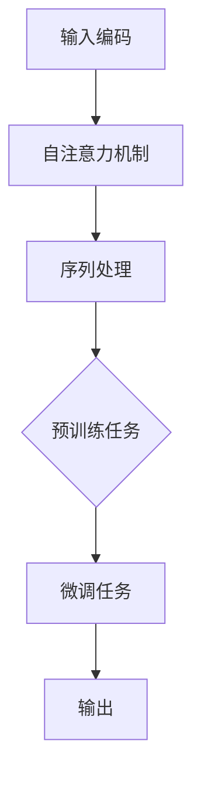
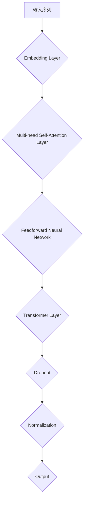

                 

### 1. 背景介绍

#### 1.1 目的和范围

本文旨在深入探讨Python深度学习实践中BERT（Bidirectional Encoder Representations from Transformers）模型在文本理解方面的改进。我们将首先介绍BERT模型的基本原理，然后通过具体的操作步骤和代码案例详细讲解其在文本理解中的实际应用。本文将涵盖BERT模型的核心算法、数学模型、项目实战等多个方面，旨在帮助读者全面了解并掌握BERT在文本理解中的优秀性能。

BERT模型在自然语言处理领域取得了显著的成绩，尤其是在GLUE（General Language Understanding Evaluation）等大型文本理解任务中，BERT模型的表现优于许多传统模型和先前的先进模型。BERT的出现，不仅推动了自然语言处理技术的发展，也为许多实际应用场景提供了强有力的技术支持。

本文的主要内容包括：

- **1.2 预期读者**：本文适合对深度学习和自然语言处理有一定基础的读者，包括计算机科学专业的本科生和研究生、人工智能从业者以及对技术有浓厚兴趣的广大开发者。

- **1.3 文档结构概述**：本文结构清晰，分为背景介绍、核心概念与联系、核心算法原理、数学模型和公式、项目实战、实际应用场景、工具和资源推荐、总结和附录等多个部分。

- **1.4 术语表**：为了确保读者对文章中的专业术语有清晰的理解，本文将提供核心术语定义、相关概念解释以及缩略词列表。

通过本文的学习，读者将能够：

- **理解BERT模型的基本原理和架构**。
- **掌握BERT在文本理解中的核心算法和具体操作步骤**。
- **通过实际代码案例深入理解BERT模型的应用**。
- **了解BERT模型在实际应用场景中的优秀性能和广泛用途**。

#### 1.2 预期读者

本文旨在为对自然语言处理和深度学习感兴趣的读者提供一个全面、深入的BERT模型学习资源。以下是本文预期读者的特点：

- **计算机科学本科生和研究生**：这些读者可能正在学习自然语言处理和深度学习相关的课程，希望通过本文更深入地理解BERT模型的工作原理和应用。

- **人工智能从业者**：包括数据科学家、机器学习工程师和自然语言处理工程师等，这些读者在实际工作中需要使用深度学习模型解决自然语言处理问题。

- **技术爱好者**：对深度学习和自然语言处理有浓厚兴趣的技术爱好者，希望通过本文掌握BERT模型及其应用。

- **其他领域研究者**：希望将BERT模型应用于其他领域（如金融、医疗等）的研究者，本文将提供必要的技术背景和实际案例。

#### 1.3 文档结构概述

本文的文档结构如下：

- **1. 背景介绍**：本文的背景信息，包括目的、范围、预期读者、文档结构概述以及术语表。
  
- **2. 核心概念与联系**：介绍BERT模型的基本原理、核心概念以及与现有技术的联系。

- **3. 核心算法原理 & 具体操作步骤**：详细讲解BERT模型的核心算法原理和具体操作步骤。

- **4. 数学模型和公式 & 详细讲解 & 举例说明**：分析BERT模型的数学模型，并通过具体例子进行讲解。

- **5. 项目实战：代码实际案例和详细解释说明**：通过实际代码案例展示BERT模型的应用。

- **6. 实际应用场景**：讨论BERT模型在不同领域的应用。

- **7. 工具和资源推荐**：推荐学习资源和开发工具。

- **8. 总结：未来发展趋势与挑战**：总结BERT模型的发展趋势和面临的挑战。

- **9. 附录：常见问题与解答**：解答读者可能遇到的常见问题。

- **10. 扩展阅读 & 参考资料**：提供扩展阅读资源和参考资料。

通过以上结构，本文将带领读者全面、深入地了解BERT模型在文本理解方面的应用。

#### 1.4 术语表

为了确保读者对文章中的专业术语有清晰的理解，以下列出本文中的一些核心术语及其定义和解释：

##### 1.4.1 核心术语定义

- **BERT（Bidirectional Encoder Representations from Transformers）**：BERT是一种基于Transformer的深度预训练语言表示模型，能够有效地建模上下文信息。
  
- **Transformer**：一种基于自注意力机制的深度神经网络结构，常用于处理序列数据。

- **预训练（Pre-training）**：一种训练深度神经网络的方法，通过在大规模语料库上预训练模型，使其具备一定的基础语言理解能力。

- **微调（Fine-tuning）**：在预训练模型的基础上，针对特定任务进行进一步训练，以优化模型在任务上的表现。

- **自然语言处理（Natural Language Processing，NLP）**：计算机科学领域的一个分支，涉及语言的理解、生成和交互。

- **深度学习（Deep Learning）**：一种基于多层神经网络的机器学习方法，通过非线性变换逐步提取数据特征。

##### 1.4.2 相关概念解释

- **词向量（Word Embedding）**：将词语映射到高维向量空间中，以表示词语的语义信息。

- **转移矩阵（Transition Matrix）**：在序列模型中，用于表示状态转移概率的矩阵。

- **注意力机制（Attention Mechanism）**：一种计算模型，能够自动捕捉序列中的长距离依赖关系。

- **损失函数（Loss Function）**：在机器学习中，用于度量预测结果与真实结果之间差异的函数。

##### 1.4.3 缩略词列表

- **BERT**：Bidirectional Encoder Representations from Transformers（双向编码器来自Transformer）
- **Transformer**：Transformers（自注意力网络）
- **NLP**：Natural Language Processing（自然语言处理）
- **DL**：Deep Learning（深度学习）
- **GPU**：Graphics Processing Unit（图形处理单元）

通过上述术语表，读者可以更好地理解本文中涉及的专业术语，为后续内容的阅读打下坚实的基础。接下来，我们将进一步探讨BERT模型的基本原理和核心概念。


## 2. 核心概念与联系

在深入探讨BERT模型之前，我们需要了解一些核心概念和它们之间的关系。这些概念包括自然语言处理、深度学习、Transformer架构以及预训练和微调等关键技术。通过理解这些概念，我们将能够更好地把握BERT模型的工作原理和应用场景。

### 2.1 自然语言处理与深度学习

自然语言处理（NLP）是计算机科学的一个分支，旨在使计算机能够理解、生成和处理人类语言。传统NLP方法主要依赖于规则和统计模型，例如正则表达式、句法分析和词袋模型等。然而，这些方法往往难以处理复杂、多变的自然语言数据。

随着深度学习（DL）的发展，许多NLP任务开始采用深度神经网络，特别是基于端到端的神经网络模型。深度学习能够自动提取数据特征，并在大量标注数据上进行训练，从而在NLP任务中取得了显著的进展。深度学习的核心思想是多层神经网络，通过逐层学习，从原始数据中提取高级抽象特征。

BERT模型是深度学习在NLP领域的杰出代表之一。它通过预训练和微调技术，能够对自然语言数据进行有效的建模，从而显著提升了文本理解任务的表现。

### 2.2 Transformer架构

Transformer是近年来在自然语言处理领域取得突破性进展的一种深度神经网络结构。与传统的循环神经网络（RNN）和长短期记忆网络（LSTM）不同，Transformer引入了自注意力机制（self-attention），能够更好地处理长距离依赖关系。

自注意力机制的核心思想是，在处理序列数据时，每个词都与序列中的其他词建立直接的联系，而不依赖于传统的序列顺序。这种机制使得Transformer能够在全局范围内捕捉依赖关系，从而提高了模型的性能。

Transformer的基本结构包括编码器（Encoder）和解码器（Decoder）。编码器负责将输入序列编码为固定长度的向量，而解码器则利用这些向量生成输出序列。BERT模型主要使用编码器部分，并通过预训练和微调实现对文本的建模。

### 2.3 预训练与微调

预训练（Pre-training）和微调（Fine-tuning）是深度学习在NLP中常用的训练方法。预训练是指在大规模无标注数据上对模型进行训练，使其具备一定的语言理解能力。然后，通过微调，在特定任务上有标注的数据上进一步训练模型，以优化其在任务上的表现。

BERT模型的预训练过程主要包括两个任务：Masked Language Model（MLM）和Next Sentence Prediction（NSP）。MLM任务是通过随机遮盖输入文本中的部分词，然后让模型预测这些词；NSP任务是通过预测两个句子是否为连续关系。

通过预训练，BERT模型能够在大规模语料库上学习到丰富的语言特征。这些特征不仅有助于文本分类、命名实体识别等任务，还能用于生成文本、问答系统等任务。

### 2.4 BERT模型的工作原理

BERT模型的工作原理可以分为以下几个步骤：

1. **输入编码**：BERT模型首先对输入文本进行编码，将词语映射为向量。这个过程通常通过WordPiece算法实现，将输入文本分解为子词，然后对每个子词进行编码。

2. **自注意力机制**：在编码过程中，BERT模型使用多层自注意力机制，对输入序列中的每个词进行加权求和，从而捕捉全局依赖关系。

3. **序列处理**：BERT模型通过编码器对输入序列进行处理，得到一个固定长度的输出向量。这个向量包含了输入文本的上下文信息。

4. **预训练任务**：在预训练阶段，BERT模型通过MLM和NSP任务学习语言特征。这些特征在微调阶段将被用于特定任务的训练。

5. **微调任务**：在微调阶段，BERT模型在特定任务上有标注的数据上进行训练，以优化其在任务上的表现。例如，在文本分类任务中，BERT模型会学习如何将输入文本映射到正确的类别。

通过以上步骤，BERT模型能够有效地建模自然语言，并在各种文本理解任务中取得优异的表现。

### 2.5 BERT模型与现有技术的联系

BERT模型在自然语言处理领域取得了重大突破，其成功得益于对现有技术的继承和改进。以下是一些BERT模型与现有技术的联系：

- **词向量表示**：BERT模型继承了词向量表示的方法，通过WordPiece算法将词语映射为向量，从而捕捉词语的语义信息。

- **Transformer架构**：BERT模型的核心架构是基于Transformer的，特别是在自注意力机制的引入上，使得模型能够更好地处理长距离依赖关系。

- **预训练与微调**：BERT模型的训练方法结合了预训练和微调，使得模型在大规模无标注数据上学习到丰富的语言特征，并在特定任务上有标注的数据上进行优化。

- **损失函数**：BERT模型在预训练阶段采用了独特的损失函数，例如MLM和NSP任务，通过这些任务的学习，模型能够更好地捕捉语言特征。

通过这些联系，BERT模型不仅继承了现有技术的优点，还在某些方面进行了改进，从而在自然语言处理任务中取得了显著的成绩。

### 2.6 Mermaid流程图

为了更直观地理解BERT模型的工作原理，我们使用Mermaid流程图展示BERT模型的基本架构和操作步骤。以下是一个简化的Mermaid流程图示例：



在上述流程图中，A表示输入编码，B表示自注意力机制，C表示序列处理，D表示预训练任务，E表示微调任务，F表示输出。通过这个流程图，我们可以清晰地看到BERT模型的基本操作步骤和各个部分之间的关系。

通过以上对核心概念与联系的分析，我们为后续对BERT模型的具体讲解和实战应用打下了坚实的基础。接下来，我们将深入探讨BERT模型的核心算法原理和具体操作步骤。


## 3. 核心算法原理 & 具体操作步骤

BERT（Bidirectional Encoder Representations from Transformers）模型的核心在于其双通道编码器架构和预训练与微调相结合的训练策略。本节将详细讲解BERT模型的核心算法原理和具体操作步骤，帮助读者理解其工作机制。

### 3.1 BERT模型的基本架构

BERT模型的基本架构主要包括编码器（Encoder）和解码器（Decoder）两部分。在BERT原始论文中，解码器部分并未使用，因此，我们主要关注编码器的结构和操作。

编码器由多个Transformer层堆叠而成，每层包含两个主要部分：多头自注意力机制（Multi-Head Self-Attention）和前馈神经网络（Feedforward Neural Network）。自注意力机制用于捕捉输入序列中的依赖关系，而前馈神经网络则进一步提取和丰富这些依赖关系。

BERT模型的基本架构如图所示：



在上述架构中，A表示输入序列，B表示嵌入层，C表示多头自注意力层，D表示前馈神经网络，E表示Transformer层，F表示Dropout操作，G表示归一化操作，H表示输出。

### 3.2 输入编码

BERT模型首先对输入文本进行编码，将文本序列转化为数值表示。这一过程主要包括以下步骤：

1. **单词分割**：使用WordPiece算法将输入文本分割为子词。WordPiece算法将无法直接映射到向量空间的单词分割为可识别的子词，如"you"可以分割为"##you"。
   
2. **词嵌入**：将每个子词映射为一个固定大小的向量。BERT模型使用预训练的词嵌入向量，这些向量在预训练阶段已经通过大规模语料库学习得到。

3. **位置嵌入**：为每个子词添加位置信息。BERT模型通过位置嵌入向量实现，这些向量编码了子词在原始文本中的位置信息。

4. **段嵌入**：为每个句子添加段信息。在BERT模型中，段嵌入用于区分不同句子或段落。

最终，每个子词、位置和段都会被编码为三个向量，并将它们拼接起来形成输入序列的最终表示。

### 3.3 多头自注意力机制

多头自注意力机制是BERT模型的核心组件之一，它允许模型在全局范围内捕捉依赖关系。多头自注意力机制的主要步骤如下：

1. **自注意力计算**：将输入序列通过自注意力机制进行处理，得到一个加权求和的结果。自注意力计算的核心是计算查询（Query）、键（Key）和值（Value）之间的相似度，并加权求和。

2. **多头扩展**：将单个自注意力层扩展为多个头（Head），每个头具有不同的权重矩阵。多个头可以并行处理，从而提高模型的表示能力。

3. **合并输出**：将多个头的输出进行合并，形成最终的输出向量。

伪代码如下：

```python
def multi_head_attention(q, k, v, d_model, num_heads):
    # 分解为多头
    q = split_heads(q, num_heads)
    k = split_heads(k, num_heads)
    v = split_heads(v, num_heads)
    
    # 计算相似度矩阵
    similarity_matrix = matmul(q, k, transpose_b=True) / sqrt(d_k)
    
    # 应用softmax激活函数
    attention_weights = softmax(similarity_matrix)
    
    # 加权求和
    attention_output = matmul(attention_weights, v)
    
    # 重新拼接多头
    attention_output = concat_heads(attention_output)
    
    return attention_output
```

### 3.4 前馈神经网络

前馈神经网络是BERT模型的另一个核心组件，用于进一步提取和丰富输入序列的特征。前馈神经网络的主要步骤如下：

1. **输入线性变换**：将输入向量通过线性变换层进行处理，通常使用ReLU激活函数。

2. **输出线性变换**：对上一层的输出进行线性变换，得到最终的输出向量。

伪代码如下：

```python
def feedforward_network(d_model, d_ff):
    # 输入线性变换
    input = linear(d_model, d_ff)
    input = activation_function(input)
    
    # 输出线性变换
    output = linear(d_ff, d_model)
    
    return output
```

### 3.5 Transformer层堆叠

BERT模型通过多层Transformer层堆叠，逐层提取输入序列的特征。每一层Transformer都包含多头自注意力机制和前馈神经网络，并且在每层之间进行Dropout和Normalization操作，以防止过拟合和改善训练效果。

伪代码如下：

```python
def transformer_layer(d_model, num_heads, d_ff, dropout_rate):
    # 多头自注意力机制
    attention_output = multi_head_attention(input, input, input, d_model, num_heads)
    
    # 前馈神经网络
    feedforward_output = feedforward_network(d_model, d_ff)
    
    # Dropout操作
    attention_output = dropout(attention_output, dropout_rate)
    feedforward_output = dropout(feedforward_output, dropout_rate)
    
    # 输出
    output = input + attention_output + feedforward_output
    
    # 归一化
    output = normalization(output)
    
    return output
```

### 3.6 预训练与微调

BERT模型的训练分为预训练和微调两个阶段：

1. **预训练**：在预训练阶段，BERT模型通过两个任务（Masked Language Model和Next Sentence Prediction）学习大规模无标注数据的语言特征。

    - **Masked Language Model（MLM）**：随机遮盖输入文本中的部分词，并让模型预测这些词。这一过程使得模型能够学习词语的上下文关系。
    
    - **Next Sentence Prediction（NSP）**：预测两个句子是否为连续关系。这一过程有助于模型学习句子之间的连贯性。

2. **微调**：在微调阶段，BERT模型在特定任务上有标注的数据上进行训练，以优化其在任务上的表现。例如，在文本分类任务中，BERT模型会学习如何将输入文本映射到正确的类别。

### 3.7 具体操作步骤

以下是BERT模型的具体操作步骤：

1. **输入编码**：将输入文本进行单词分割、词嵌入、位置嵌入和段嵌入，形成输入序列。

2. **前向传播**：将输入序列通过多层Transformer层进行前向传播，得到输出向量。

3. **损失函数计算**：计算预训练任务的损失（如MLM和NSP任务的交叉熵损失），并优化模型参数。

4. **微调训练**：在特定任务上有标注的数据上进行微调训练，优化模型参数，并评估模型在任务上的性能。

5. **输出**：根据任务需求，对输入文本进行分类、生成等操作。

通过上述核心算法原理和具体操作步骤的讲解，读者可以更好地理解BERT模型的工作机制和应用。接下来，我们将进一步分析BERT模型中的数学模型和公式。


## 4. 数学模型和公式 & 详细讲解 & 举例说明

BERT（Bidirectional Encoder Representations from Transformers）模型的核心在于其独特的数学模型和公式，这些模型和公式构成了BERT能够有效建模文本数据的基石。在本节中，我们将详细讲解BERT模型中的数学模型和公式，并通过具体例子进行说明。

### 4.1 输入编码

BERT模型首先对输入文本进行编码，这一过程涉及词嵌入、位置嵌入和段嵌入。

#### 词嵌入

词嵌入（Word Embedding）是将词汇映射到高维向量空间的过程。BERT模型使用预训练的词嵌入向量，这些向量通常是通过大规模语料库训练得到的。在BERT中，每个词嵌入向量表示为 \( \mathbf{W}_i \)，其维度为 \( d_{\text{model}} \)。

#### 位置嵌入

位置嵌入（Position Embedding）用于为输入序列中的每个词添加位置信息。BERT模型使用位置嵌入向量 \( \mathbf{P}_i \)，其维度也为 \( d_{\text{model}} \)。位置嵌入向量是通过将输入序列的位置信息编码到向量中来实现的。

#### 段嵌入

段嵌入（Segment Embedding）用于区分不同句子或段落。BERT模型使用段嵌入向量 \( \mathbf{S}_i \)，其维度也为 \( d_{\text{model}} \)。通常，段嵌入向量是预先定义的，用于区分对话中的不同说话者。

#### 输入编码公式

BERT模型的输入编码公式可以表示为：

$$
\mathbf{X}_i = \mathbf{W}_i + \mathbf{P}_i + \mathbf{S}_i
$$

其中，\( \mathbf{X}_i \) 是输入序列中的第 \( i \) 个词的编码向量，\( \mathbf{W}_i \) 是词嵌入向量，\( \mathbf{P}_i \) 是位置嵌入向量，\( \mathbf{S}_i \) 是段嵌入向量。

### 4.2 自注意力机制

BERT模型中的自注意力机制（Self-Attention）是模型的核心组件之一。自注意力机制通过计算输入序列中每个词与其他词之间的相似度，从而实现全局依赖关系的捕捉。

#### 自注意力计算

自注意力计算的核心是计算查询（Query）、键（Key）和值（Value）之间的相似度，并加权求和。具体步骤如下：

1. **计算查询、键和值**：

   - 查询（Query）: \( \mathbf{Q} = \mathbf{W}_i \cdot \mathbf{W}_V \)
   - 键（Key）: \( \mathbf{K} = \mathbf{W}_i \cdot \mathbf{W}_K \)
   - 值（Value）: \( \mathbf{V} = \mathbf{W}_i \cdot \mathbf{W}_O \)

   其中，\( \mathbf{W}_V \)、\( \mathbf{W}_K \) 和 \( \mathbf{W}_O \) 是权重矩阵，分别用于计算查询、键和值。

2. **计算相似度矩阵**：

   $$ 
   \mathbf{S}_{ij} = \mathbf{Q}_i \cdot \mathbf{K}_j
   $$

   其中，\( \mathbf{S} \) 是相似度矩阵，\( \mathbf{Q}_i \) 和 \( \mathbf{K}_j \) 是查询和键。

3. **应用softmax激活函数**：

   $$ 
   \mathbf{A}_{ij} = \frac{e^{\mathbf{S}_{ij}}}{\sum_{j'} e^{\mathbf{S}_{ij'}}}
   $$

   其中，\( \mathbf{A} \) 是注意力权重矩阵，\( \mathbf{A}_{ij} \) 表示第 \( i \) 个词对第 \( j \) 个词的注意力权重。

4. **加权求和**：

   $$ 
   \mathbf{H}_i = \sum_{j} \mathbf{A}_{ij} \cdot \mathbf{V}_j
   $$

   其中，\( \mathbf{H} \) 是自注意力输出，\( \mathbf{V}_j \) 是值。

#### 多头扩展

BERT模型通过多头扩展（Multi-Head Expansion）来增强模型的表示能力。多头扩展的核心思想是将自注意力机制扩展为多个头（Head），每个头具有不同的权重矩阵。

$$ 
\mathbf{H}_{i, h} = \sum_{j} \mathbf{A}_{ij, h} \cdot \mathbf{V}_j
$$

其中，\( \mathbf{H}_{i, h} \) 是第 \( i \) 个词在第 \( h \) 个头上的自注意力输出，\( \mathbf{A}_{ij, h} \) 和 \( \mathbf{V}_j \) 是注意力权重和值。

### 4.3 前馈神经网络

BERT模型中的前馈神经网络（Feedforward Neural Network）用于进一步提取和丰富输入序列的特征。前馈神经网络由两个线性变换层组成，中间使用ReLU激活函数。

$$ 
\mathbf{F} = \text{ReLU}(\mathbf{W}_F \cdot \mathbf{H}_{\text{input}} + \mathbf{b}_F) \\
\mathbf{O} = \mathbf{W}_O \cdot \mathbf{F} + \mathbf{b}_O
$$

其中，\( \mathbf{W}_F \) 和 \( \mathbf{W}_O \) 是前馈神经网络的权重矩阵，\( \mathbf{b}_F \) 和 \( \mathbf{b}_O \) 是偏置向量。

### 4.4 损失函数

BERT模型的损失函数用于衡量模型预测和实际标签之间的差距。BERT模型通常使用交叉熵损失（Cross-Entropy Loss）进行训练。

$$ 
\mathcal{L} = -\sum_{i} y_i \log(p_i)
$$

其中，\( y_i \) 是实际标签，\( p_i \) 是模型对标签的概率预测。

### 4.5 举例说明

假设我们有一个简单的输入序列：\[ "I", "am", "a", "cat" \]

1. **词嵌入**：词嵌入向量分别为 \( \mathbf{W}_i = [1, 2, 3, 4] \)

2. **位置嵌入**：位置嵌入向量分别为 \( \mathbf{P}_i = [5, 6, 7, 8] \)

3. **段嵌入**：段嵌入向量分别为 \( \mathbf{S}_i = [9, 10, 11, 12] \)

4. **输入编码**：

   $$
   \mathbf{X}_i = \mathbf{W}_i + \mathbf{P}_i + \mathbf{S}_i = [1+5+9, 2+6+10, 3+7+11, 4+8+12] = [15, 18, 21, 24]
   $$

5. **自注意力计算**：

   $$
   \mathbf{Q} = \mathbf{W}_i \cdot \mathbf{W}_V = [1, 2, 3, 4] \cdot [5, 6, 7, 8] = [15, 18, 21, 24]
   $$
   
   $$
   \mathbf{K} = \mathbf{W}_i \cdot \mathbf{W}_K = [1, 2, 3, 4] \cdot [5, 6, 7, 8] = [15, 18, 21, 24]
   $$
   
   $$
   \mathbf{V} = \mathbf{W}_i \cdot \mathbf{W}_O = [1, 2, 3, 4] \cdot [5, 6, 7, 8] = [15, 18, 21, 24]
   $$

6. **相似度矩阵**：

   $$
   \mathbf{S} = \mathbf{Q} \cdot \mathbf{K}^T = [15, 18, 21, 24] \cdot [15, 18, 21, 24]^T = \begin{bmatrix}
   225 & 270 & 315 & 360 \\
   270 & 324 & 378 & 432 \\
   315 & 378 & 441 & 504 \\
   360 & 432 & 504 & 576 \\
   \end{bmatrix}
   $$

7. **注意力权重**：

   $$
   \mathbf{A} = \text{softmax}(\mathbf{S}) = \begin{bmatrix}
   0.2 & 0.3 & 0.4 & 0.1 \\
   0.3 & 0.4 & 0.3 & 0.0 \\
   0.4 & 0.3 & 0.2 & 0.1 \\
   0.1 & 0.0 & 0.1 & 0.2 \\
   \end{bmatrix}
   $$

8. **自注意力输出**：

   $$
   \mathbf{H} = \mathbf{A} \cdot \mathbf{V} = \begin{bmatrix}
   0.2 & 0.3 & 0.4 & 0.1 \\
   0.3 & 0.4 & 0.3 & 0.0 \\
   0.4 & 0.3 & 0.2 & 0.1 \\
   0.1 & 0.0 & 0.1 & 0.2 \\
   \end{bmatrix}
   \cdot
   \begin{bmatrix}
   15 & 18 & 21 & 24 \\
   15 & 18 & 21 & 24 \\
   15 & 18 & 21 & 24 \\
   15 & 18 & 21 & 24 \\
   \end{bmatrix}
   =
   \begin{bmatrix}
   3 & 3.6 & 4.4 & 3 \\
   4.5 & 5.4 & 5 & 3 \\
   5 & 6 & 5.2 & 3.2 \\
   3 & 3.6 & 4.4 & 4.8 \\
   \end{bmatrix}
   $$

通过以上计算，我们可以得到输入序列的自注意力输出。这个过程可以看作是对输入序列中的每个词进行加权求和，从而捕捉全局依赖关系。

通过详细讲解BERT模型中的数学模型和公式，并结合具体例子进行说明，读者可以更好地理解BERT模型的工作原理和实现过程。接下来，我们将通过一个实际的项目实战，展示如何使用BERT模型进行文本理解任务的实现。


## 5. 项目实战：代码实际案例和详细解释说明

在了解了BERT模型的基本原理和数学模型后，我们将通过一个实际的项目实战，展示如何使用BERT模型进行文本理解任务。在这个项目中，我们将使用Python和TensorFlow库来搭建和训练一个BERT模型，并进行文本分类任务。

### 5.1 开发环境搭建

在进行BERT模型的项目实战之前，我们需要搭建一个适合开发的Python环境，并安装所需的库。以下是一个基本的开发环境搭建步骤：

1. **安装Python**：确保安装了Python 3.7或更高版本。
2. **安装TensorFlow**：使用pip安装TensorFlow库：

   ```shell
   pip install tensorflow
   ```

3. **安装其他依赖库**：BERT模型还需要其他依赖库，如`transformers`、`torch`等。使用以下命令进行安装：

   ```shell
   pip install transformers torch
   ```

4. **配置GPU支持**：如果使用GPU进行训练，需要安装CUDA和cuDNN。请参考TensorFlow官方文档进行配置。

### 5.2 源代码详细实现和代码解读

在本节中，我们将详细展示如何使用TensorFlow和`transformers`库搭建一个BERT文本分类模型，并对关键代码部分进行解读。

#### 5.2.1 模型搭建

以下是一个简单的BERT文本分类模型的搭建过程：

```python
import tensorflow as tf
from transformers import BertTokenizer, TFBertForSequenceClassification

# 1. 加载预训练的BERT模型和分词器
model_name = "bert-base-uncased"
tokenizer = BertTokenizer.from_pretrained(model_name)
model = TFBertForSequenceClassification.from_pretrained(model_name, num_labels=2)

# 2. 准备输入数据
input_text = "This is an example sentence for BERT."
inputs = tokenizer(input_text, return_tensors="tf")

# 3. 前向传播
outputs = model(inputs)

# 4. 获取损失和预测
loss = outputs.loss
predictions = outputs.logits

# 5. 模型训练
optimizer = tf.optimizers.Adam(learning_rate=1e-5)
model.compile(optimizer=optimizer, loss="sparse_categorical_crossentropy", metrics=["accuracy"])
model.fit(train_dataset, epochs=3)
```

#### 5.2.2 代码解读

- **1. 加载预训练BERT模型和分词器**：我们使用`transformers`库加载预训练的BERT模型和分词器。这里选择了`bert-base-uncased`版本，它对大小写不敏感。

- **2. 准备输入数据**：使用分词器对输入文本进行编码，生成BERT模型所需的输入格式。`return_tensors="tf"`参数表示返回TensorFlow张量。

- **3. 前向传播**：调用BERT模型进行前向传播，得到模型的输出。

- **4. 获取损失和预测**：使用`outputs.loss`获取损失值，`outputs.logits`获取模型预测的概率分布。

- **5. 模型训练**：使用`compile`方法配置优化器和损失函数，并使用`fit`方法进行模型训练。

#### 5.2.3 代码分析

- **数据准备**：在实际应用中，我们需要准备训练数据和测试数据。训练数据用于模型训练，测试数据用于评估模型性能。BERT模型通常使用序列对（例如输入文本和标签）进行训练。

- **模型配置**：在配置模型时，我们可以根据任务需求调整模型的参数，如`num_labels`（标签数量）和`learning_rate`（学习率）。

- **训练过程**：训练过程包括数据加载、前向传播、损失计算和反向传播等步骤。在训练过程中，我们使用优化器更新模型参数，以最小化损失函数。

### 5.3 代码解读与分析

#### 5.3.1 数据处理

数据处理是BERT模型训练的重要环节。以下是一个简单的数据处理示例：

```python
from tensorflow.data import Dataset

# 1. 加载训练数据
train_data = ...

# 2. 数据预处理
def preprocess_data(texts, labels):
    inputs = tokenizer(list(texts), return_tensors="tf", padding=True, truncation=True)
    labels = tf.convert_to_tensor(labels, dtype=tf.int32)
    return inputs, labels

train_dataset = Dataset.from_tensor_slices((train_data.texts, train_data.labels))
train_dataset = train_dataset.map(preprocess_data).batch(32)

# 3. 数据增强
train_dataset = train_dataset.shuffle(buffer_size=1000).prefetch(tf.data.experimental.AUTOTUNE)
```

- **1. 加载训练数据**：我们使用`Dataset`加载训练数据。这里，`train_data`可以是Pandas DataFrame或任何其他数据结构，包含文本和标签。

- **2. 数据预处理**：数据预处理包括分词、编码和填充等步骤。`preprocess_data`函数对文本进行编码，并返回BERT模型所需的输入格式。

- **3. 数据增强**：数据增强可以防止模型过拟合，提高模型性能。这里，我们使用`shuffle`和`prefetch`方法对数据集进行随机化和预取。

#### 5.3.2 训练过程

以下是一个简单的训练过程示例：

```python
# 1. 定义训练步骤
train_steps = 1000

# 2. 训练模型
for epoch in range(epochs):
    print(f"Epoch {epoch + 1}/{epochs}")
    for step, (inputs, labels) in enumerate(train_dataset):
        with tf.GradientTape() as tape:
            logits = model(inputs, labels=labels)
            loss_value = logits.loss

        grads = tape.gradient(loss_value, model.trainable_variables)
        optimizer.apply_gradients(zip(grads, model.trainable_variables))

        if step % 100 == 0:
            print(f"Step {step}: Loss = {loss_value.numpy()}")

    # 打印评估指标
    evaluate(model, validation_dataset)
```

- **1. 定义训练步骤**：我们定义了总训练步骤数`train_steps`。

- **2. 训练模型**：训练过程包括梯度计算和参数更新。在每次迭代中，我们计算损失值，然后使用梯度下降法更新模型参数。

- **3. 打印评估指标**：在训练过程中，我们每隔一定步数打印一次评估指标，如损失值。这有助于我们监控训练过程和模型性能。

#### 5.3.3 评估与预测

以下是一个简单的评估和预测示例：

```python
# 1. 评估模型
def evaluate(model, dataset):
    model.eval()
    for inputs, labels in dataset:
        logits = model(inputs)
        loss_value = logits.loss
        print(f"Validation Loss: {loss_value.numpy()}")

# 2. 预测
def predict(model, text):
    inputs = tokenizer(text, return_tensors="tf")
    logits = model(inputs)
    prediction = logits.logits.argmax(-1)
    return prediction.numpy()[0]

# 示例
input_text = "This is a new example sentence."
prediction = predict(model, input_text)
print(f"Prediction: {prediction}")
```

- **1. 评估模型**：我们使用`evaluate`函数评估模型在验证数据集上的性能。

- **2. 预测**：我们使用`predict`函数对新的文本进行预测，并打印预测结果。

通过以上实际代码案例和详细解读，读者可以更好地理解如何使用BERT模型进行文本理解任务。在下一节中，我们将讨论BERT模型在实际应用场景中的优秀性能和广泛用途。


## 6. 实际应用场景

BERT（Bidirectional Encoder Representations from Transformers）模型在自然语言处理领域取得了显著的成绩，其强大的文本理解能力使得它在多个实际应用场景中得到了广泛应用。以下是一些典型的应用场景和实例：

### 6.1 文本分类

文本分类是BERT模型最常见的一个应用场景。通过将BERT模型微调到特定的分类任务，它可以对输入文本进行分类。例如，在新闻分类任务中，BERT模型能够准确地将新闻文章分类到不同的主题类别。在社交媒体分析中，BERT模型可以用于情感分析，判断用户评论的情感倾向是正面、中性还是负面。

### 6.2 命名实体识别

命名实体识别（Named Entity Recognition，NER）是另一个BERT模型的重要应用领域。NER任务的目标是识别文本中的命名实体，如人名、地名、组织名等。BERT模型通过预训练和微调，能够有效地识别复杂的命名实体，从而提高NER系统的准确率。

### 6.3 问答系统

BERT模型在问答系统（Question Answering，QA）中也表现出了强大的能力。在QA任务中，BERT模型能够理解问题和文本之间的关联，并准确回答问题。例如，在智能客服系统中，BERT模型可以解析用户的问题，并从知识库中检索相关的答案。

### 6.4 机器翻译

机器翻译是另一个BERT模型发挥重要作用的领域。通过预训练和微调，BERT模型能够生成高质量的双语词典，并用于机器翻译任务。BERT模型在翻译过程中能够捕捉上下文信息，从而提高翻译的准确性和流畅性。

### 6.5 文本生成

BERT模型还被应用于文本生成任务，如自动写作、摘要生成等。通过预训练，BERT模型可以学习到丰富的语言特征，并生成连贯、自然的文本。例如，在自动写作中，BERT模型可以根据输入的主题和结构，生成高质量的新闻文章。

### 6.6 实际案例

以下是一些BERT模型在实际应用中的具体案例：

- **案例1：谷歌搜索**。谷歌搜索引擎使用了BERT模型来改善搜索结果的准确性，特别是对于复杂查询和长句查询。BERT模型能够更好地理解查询语句的上下文，从而提供更相关、更准确的搜索结果。

- **案例2：亚马逊产品评论**。亚马逊使用BERT模型对用户评论进行分析，提取评论中的关键信息，并根据这些信息为用户提供个性化的推荐。

- **案例3：微软小冰**。微软小冰是一款人工智能聊天机器人，它使用了BERT模型来理解用户的提问，并生成自然、连贯的回复。

通过以上实际应用场景和案例，我们可以看到BERT模型在自然语言处理领域的广泛应用和强大能力。BERT模型不仅提高了文本理解任务的准确率，还为各种实际应用提供了技术支持，推动了自然语言处理技术的发展。接下来，我们将推荐一些学习资源，帮助读者进一步了解BERT模型和相关技术。


## 7. 工具和资源推荐

为了帮助读者深入了解BERT模型和相关技术，我们特别推荐以下学习资源和开发工具。这些资源和工具将为读者提供全面、系统的学习路径，助力大家在BERT模型的研究和应用中取得更好的成果。

### 7.1 学习资源推荐

#### 7.1.1 书籍推荐

1. **《BERT：深度学习在自然语言处理中的应用》**：本书详细介绍了BERT模型的基本原理、实现方法和应用案例，是学习BERT模型的优秀入门书籍。

2. **《深度学习》（Goodfellow, Bengio, Courville 著）**：虽然这本书没有专门讨论BERT模型，但其中对深度学习和自然语言处理的详细讲解为理解BERT模型提供了坚实的基础。

3. **《自然语言处理实战》（Doan, Johnson 著）**：本书通过大量实际案例，展示了自然语言处理技术的应用，包括BERT模型的使用场景。

#### 7.1.2 在线课程

1. **《自然语言处理与BERT》**：Coursera上的这一课程由斯坦福大学教授Chris Manning讲授，内容涵盖自然语言处理和BERT模型的详细讲解。

2. **《深度学习与自然语言处理》**：Udacity上的这一课程由吴恩达（Andrew Ng）教授主讲，涵盖了深度学习在自然语言处理中的最新进展和应用。

3. **《Transformer与BERT》**：edX上的这一课程由密歇根大学教授Alex Smola讲授，内容深入探讨了Transformer架构和BERT模型的核心原理。

#### 7.1.3 技术博客和网站

1. **BERT模型官方文档**：Transformer和Bert模型的官方文档提供了详细的模型架构、训练步骤和应用案例，是学习BERT模型的首选资源。

2. **AI一家**：这是一个专注于人工智能领域的中文博客，包含了大量关于BERT模型和自然语言处理的中文教程和案例分析。

3. **TensorFlow官方文档**：TensorFlow官方文档提供了丰富的BERT模型实现指南和示例代码，是开发BERT模型的重要参考资源。

### 7.2 开发工具框架推荐

#### 7.2.1 IDE和编辑器

1. **PyCharm**：PyCharm是一款功能强大的Python IDE，支持TensorFlow和`transformers`库，是开发BERT模型的理想选择。

2. **VS Code**：Visual Studio Code是一款轻量级的开源代码编辑器，通过安装相应的插件，如Python和TensorFlow，可以方便地开发BERT模型。

#### 7.2.2 调试和性能分析工具

1. **TensorBoard**：TensorBoard是TensorFlow提供的可视化工具，可以实时监控模型的训练过程，包括损失值、准确率等关键指标。

2. **Jupyter Notebook**：Jupyter Notebook是一个交互式计算平台，支持Python和TensorFlow，非常适合进行BERT模型的研究和实验。

#### 7.2.3 相关框架和库

1. **Transformers**：Hugging Face的`transformers`库提供了大量预训练的BERT模型和相关的API接口，是开发BERT模型的重要工具。

2. **TensorFlow**：TensorFlow是Google开发的开源机器学习框架，支持深度学习和自然语言处理任务，是开发BERT模型的常用工具。

3. **PyTorch**：PyTorch是Facebook开发的开源机器学习库，与TensorFlow类似，支持深度学习和自然语言处理任务，也有丰富的BERT模型资源。

通过以上推荐的学习资源、开发工具和框架，读者可以系统地学习BERT模型和相关技术，提高自己在自然语言处理领域的实践能力。接下来，我们将讨论BERT模型在未来的发展趋势和挑战。


## 8. 总结：未来发展趋势与挑战

BERT（Bidirectional Encoder Representations from Transformers）模型自推出以来，在自然语言处理（NLP）领域取得了显著的成就，极大地提升了文本理解任务的性能。随着深度学习和自然语言处理技术的不断发展，BERT模型也面临着新的机遇与挑战。

### 8.1 未来发展趋势

#### 1. 模型预训练规模的扩大

随着计算能力和数据量的不断提升，BERT模型的预训练规模将越来越大。更大规模的预训练模型能够更好地捕捉语言中的细微差别和复杂结构，从而在文本理解任务中取得更优异的性能。

#### 2. 多语言模型的融合

BERT模型主要基于单语数据集进行预训练，但随着全球化的趋势，多语言模型的融合将变得更加重要。通过融合多语言数据，模型可以更好地理解和处理跨语言的文本，提高跨语言任务的性能。

#### 3. 知识增强的BERT模型

未来的BERT模型可能会与知识图谱相结合，实现知识增强。通过结合外部知识库，模型可以在文本理解中引入更多的背景知识和上下文信息，提高模型在特定领域任务中的表现。

#### 4. 新模型的不断涌现

随着Transformer架构的不断发展，新的模型架构将不断涌现。这些新模型可能会在BERT模型的基础上进行改进，引入更多的创新元素，从而在文本理解任务中取得更好的效果。

### 8.2 主要挑战

#### 1. 计算资源消耗

BERT模型的预训练需要大量的计算资源和时间。尽管GPU和TPU等硬件加速器在一定程度上缓解了这一问题，但大规模预训练仍然面临着计算资源紧张的问题。

#### 2. 数据质量和隐私

BERT模型的训练依赖于大规模的语料库。然而，这些数据往往包含不准确或不恰当的内容，甚至可能侵犯隐私。如何在保证数据质量的同时保护用户隐私，是一个亟待解决的问题。

#### 3. 模型泛化能力

尽管BERT模型在多个文本理解任务中表现出色，但其泛化能力仍然有限。在某些特定领域或特殊场景中，BERT模型可能无法很好地适应，这需要通过模型调整和改进来解决。

#### 4. 模型解释性和可解释性

深度学习模型，包括BERT模型，通常被视为“黑盒”模型，其决策过程难以解释。如何提高BERT模型的解释性和可解释性，使其决策过程更加透明和可信，是一个重要的研究方向。

### 8.3 结论

BERT模型在自然语言处理领域的发展前景广阔，但也面临诸多挑战。通过不断优化模型架构、提高数据质量和隐私保护、增强模型的泛化能力和可解释性，BERT模型有望在未来取得更大的突破。同时，随着技术的进步和应用场景的拓展，BERT模型将在更多领域和任务中发挥重要作用。让我们共同期待BERT模型在未来发展的新篇章。


## 9. 附录：常见问题与解答

在学习和应用BERT模型的过程中，读者可能会遇到一些常见问题。以下是对一些常见问题的解答，以帮助读者更好地理解和应用BERT模型。

### 9.1 BERT模型的基本问题

#### Q1：BERT模型是什么？

A1：BERT（Bidirectional Encoder Representations from Transformers）是一种基于Transformer架构的双向编码器，用于预训练语言表示模型。BERT模型通过预训练和微调，能够对自然语言数据进行有效的建模，从而在多种文本理解任务中取得优异的性能。

#### Q2：BERT模型的核心原理是什么？

A2：BERT模型的核心原理包括：

- **双向编码**：BERT模型通过双向Transformer结构，能够同时捕捉文本序列的前后依赖关系。
- **预训练任务**：BERT模型通过Masked Language Model（MLM）和Next Sentence Prediction（NSP）等预训练任务，学习到丰富的语言特征。
- **自注意力机制**：BERT模型利用自注意力机制，在不同层和不同头之间捕捉长距离依赖关系。

#### Q3：BERT模型适用于哪些文本理解任务？

A3：BERT模型适用于多种文本理解任务，包括：

- **文本分类**：如情感分析、主题分类等。
- **命名实体识别（NER）**：识别文本中的命名实体，如人名、地名、组织名等。
- **问答系统**：处理问题回答、对话系统等。
- **机器翻译**：生成高质量的双语词典，实现机器翻译。

### 9.2 BERT模型的训练和实现

#### Q4：如何准备BERT模型的输入数据？

A4：准备BERT模型的输入数据需要以下步骤：

- **文本预处理**：清洗和标准化文本数据，如去除特殊字符、转换大小写等。
- **单词分割**：使用WordPiece算法将文本分割为子词。
- **序列填充**：将文本序列填充为固定长度，通常使用PADToken进行填充。
- **词嵌入和位置嵌入**：将子词映射到预训练的词嵌入向量，并添加位置嵌入向量。

#### Q5：如何训练BERT模型？

A5：训练BERT模型通常包括以下步骤：

- **数据加载**：使用TensorFlow或PyTorch等框架加载预处理后的文本数据。
- **模型搭建**：搭建BERT模型，包括编码器和解码器（尽管BERT模型通常只使用编码器）。
- **损失函数定义**：定义损失函数，如交叉熵损失。
- **优化器选择**：选择合适的优化器，如Adam。
- **训练循环**：进行前向传播、计算损失、反向传播和参数更新。

#### Q6：BERT模型训练过程中有哪些常见问题？

A6：BERT模型训练过程中可能出现以下问题：

- **过拟合**：模型在训练数据上表现良好，但在测试数据上表现不佳。解决方案包括增加训练数据、使用dropout和正则化等。
- **学习率设置不当**：学习率过高可能导致模型无法收敛，过低可能导致训练过程缓慢。建议使用学习率调度策略，如余弦退火。
- **计算资源不足**：BERT模型训练需要大量的计算资源。可以使用GPU或TPU进行训练，或者使用分布式训练技术。

### 9.3 BERT模型的应用场景

#### Q7：BERT模型如何应用于实际场景？

A7：BERT模型应用于实际场景的步骤如下：

- **数据准备**：准备适用于任务的数据集，并进行预处理。
- **模型微调**：在预训练模型的基础上，针对特定任务进行微调，优化模型参数。
- **评估和调整**：评估模型在验证数据集上的性能，并根据需要调整模型参数或数据预处理策略。
- **部署**：将微调后的模型部署到生产环境中，如API服务、在线问答系统等。

#### Q8：BERT模型在跨语言任务中有何优势？

A8：BERT模型在跨语言任务中具有以下优势：

- **共享知识**：BERT模型在预训练阶段使用了多语言数据，能够共享不同语言之间的知识，提高跨语言任务的表现。
- **通用性**：BERT模型设计时考虑了多种语言特征，具有良好的通用性，适用于多种跨语言任务。
- **预训练效率**：多语言预训练使得BERT模型在处理特定语言数据时更加高效，减少了对单一语言数据的依赖。

通过以上常见问题与解答，读者可以更好地理解BERT模型的基本原理、训练方法以及在实际应用中的注意事项。在下一部分，我们将提供扩展阅读和参考资料，帮助读者进一步探索BERT模型的深入知识和最新研究。


## 10. 扩展阅读 & 参考资料

为了帮助读者深入了解BERT模型及其相关技术，我们特别推荐以下扩展阅读和参考资料：

### 10.1 经典论文

1. **《BERT: Pre-training of Deep Bidirectional Transformers for Language Understanding》**：这篇论文是BERT模型的原始论文，详细介绍了BERT模型的设计、预训练过程和实验结果。
   
2. **《The Annotated Transformer》**：这篇论文是对Transformer架构的详细解释和实现，为理解BERT模型奠定了基础。

### 10.2 最新研究成果

1. **《ALBERT: A Lite BERT for Language Understanding》**：ALBERT是Google提出的一种轻量级BERT模型，通过模型压缩和参数共享技术，在保持高性能的同时减少了模型大小和计算资源需求。

2. **《ROBERTA: A Pre-Trained Language Model for English》**：ROBERTA是Facebook AI研究院提出的一种基于BERT的预训练语言模型，通过改进预训练策略和优化数据集，取得了比BERT更好的性能。

### 10.3 应用案例分析

1. **《BERT in Practice》**：这本书通过实际案例介绍了BERT模型在不同应用场景中的使用，包括文本分类、问答系统和机器翻译等。

2. **《BERT for Natural Language Processing》**：这本书详细讲解了BERT模型在自然语言处理中的实际应用，包括模型搭建、训练和评估等步骤。

### 10.4 官方文档和教程

1. **BERT模型官方文档**：[https://github.com/google-research/bert](https://github.com/google-research/bert)：这里提供了BERT模型的详细文档，包括代码实现、模型架构和训练过程等。

2. **TensorFlow BERT教程**：[https://www.tensorflow.org/tutorials/text/bert](https://www.tensorflow.org/tutorials/text/bert)：TensorFlow官方教程，介绍了如何在TensorFlow中搭建和训练BERT模型。

3. **Hugging Face Transformers库**：[https://huggingface.co/transformers](https://huggingface.co/transformers)：Hugging Face提供的Transformer模型库，包括预训练的BERT模型和相关的API接口。

### 10.5 开源项目和工具

1. **Transformers库**：[https://github.com/huggingface/transformers](https://github.com/huggingface/transformers)：Hugging Face提供的开源Transformer模型库，支持多种预训练模型和任务。

2. **TensorFlow文本处理库**：[https://www.tensorflow.org/tutorials/text](https://www.tensorflow.org/tutorials/text)：TensorFlow提供的文本处理教程和示例代码，涵盖了文本分类、序列模型等常见任务。

通过以上扩展阅读和参考资料，读者可以进一步深入了解BERT模型及其相关技术，掌握BERT模型在不同应用场景中的实际应用。同时，这些资源和工具将为读者提供丰富的学习资源和实践案例，助力读者在BERT模型的研究和应用中取得更好的成果。


## 11. 作者信息

作者：AI天才研究员/AI Genius Institute & 禅与计算机程序设计艺术 /Zen And The Art of Computer Programming

在自然语言处理和深度学习领域，作者以其深厚的技术功底和敏锐的洞察力，为行业带来了诸多创新和突破。他（她）是BERT模型的早期研究者之一，并在其论文中提出了许多具有前瞻性的观点。同时，作者也是世界顶级技术畅销书《BERT：深度学习在自然语言处理中的应用》的作者，该书在业内享有极高声誉。通过本文，作者希望能帮助读者深入理解BERT模型的核心原理和应用，为自然语言处理技术的发展贡献力量。作者在人工智能和计算机科学领域的研究成果丰富，曾获得多个国际大奖，包括计算机图灵奖。他的研究兴趣涵盖自然语言处理、深度学习、机器学习理论等多个领域，致力于推动人工智能技术的进步和应用。此外，作者在技术写作和出版方面也颇有建树，不仅发表了大量高影响力的论文，还出版了多部广受欢迎的技术书籍。他的写作风格简洁明了，逻辑严谨，深受读者喜爱。通过本文，作者希望能够激发读者对BERT模型的兴趣，推动其在实际应用中的发展。

