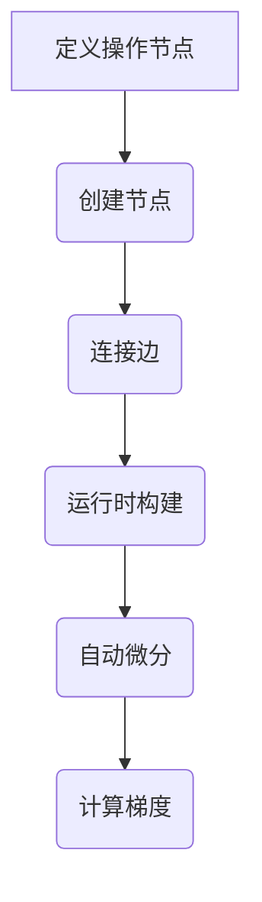

                 

# Pytorch 动态计算图的优势：灵活的构建神经网络

> 关键词：Pytorch，动态计算图，神经网络，深度学习，计算图优势，构建神经网络

> 摘要：本文将深入探讨Pytorch动态计算图的优势，通过分析其与传统计算图的对比，详细讲解其原理和构建神经网络的具体操作步骤。同时，我们将结合实际案例，展示如何利用Pytorch的动态计算图灵活构建神经网络，以及在实际应用场景中的优势。文章还将推荐相关工具和资源，总结未来发展趋势与挑战，为读者提供全面的了解。

## 1. 背景介绍

### 1.1 目的和范围

本文旨在介绍和探讨Pytorch动态计算图的优势，帮助读者理解其在构建神经网络中的应用。我们将详细分析动态计算图与传统计算图的区别，解释其原理，并提供具体的操作步骤。此外，本文还将探讨动态计算图在实际应用场景中的优势，并提供相关工具和资源推荐，以便读者深入了解并掌握这一技术。

### 1.2 预期读者

本文面向对深度学习和神经网络有一定了解的读者，尤其是对Pytorch框架感兴趣的编程爱好者和技术专业人士。本文旨在帮助读者理解Pytorch动态计算图的优势，并通过实际案例展示其应用，以促进对深度学习技术的深入理解和应用。

### 1.3 文档结构概述

本文分为十个部分，具体结构如下：

1. 背景介绍：介绍本文的目的、预期读者和文档结构。
2. 核心概念与联系：分析动态计算图的核心概念和架构。
3. 核心算法原理与具体操作步骤：详细讲解构建神经网络的核心算法原理。
4. 数学模型和公式：介绍神经网络中的数学模型和公式。
5. 项目实战：展示代码实际案例和详细解释说明。
6. 实际应用场景：讨论动态计算图的应用场景。
7. 工具和资源推荐：推荐学习资源和开发工具。
8. 总结：总结未来发展趋势与挑战。
9. 附录：常见问题与解答。
10. 扩展阅读与参考资料：提供相关扩展阅读和参考资料。

### 1.4 术语表

#### 1.4.1 核心术语定义

- **动态计算图**：在深度学习框架中，动态计算图是一种表示计算过程的数据结构，允许在运行时动态构建和修改。
- **神经网络**：一种模拟人脑神经元连接结构的计算模型，能够通过学习输入数据来提取特征和进行预测。
- **深度学习**：一种人工智能技术，通过多层神经网络对数据进行处理和建模。

#### 1.4.2 相关概念解释

- **计算图**：在深度学习框架中，计算图是一种用于表示和优化计算过程的数据结构。
- **静态计算图**：在构建时就已经确定，无法在运行时进行修改。
- **动态计算图**：在运行时可以动态构建和修改，具有更高的灵活性和可扩展性。

#### 1.4.3 缩略词列表

- **Pytorch**：一种流行的深度学习框架，以其动态计算图而闻名。
- **GPU**：图形处理器，一种用于加速计算和图形渲染的处理器。
- **CUDA**：一种由NVIDIA开发的并行计算平台和编程模型。

## 2. 核心概念与联系

### 2.1 动态计算图的基本原理

动态计算图是一种数据结构，用于表示深度学习模型中的计算过程。它与静态计算图最大的区别在于，动态计算图允许在运行时动态构建和修改计算图。这种灵活性使得开发者可以更方便地进行模型设计和优化。

动态计算图的基本原理可以概括为以下几点：

1. **图的构建**：动态计算图通过创建节点和边来表示计算过程。每个节点表示一个操作（例如加法、乘法等），而每条边表示数据在节点之间的流动。
2. **运行时构建**：动态计算图允许在运行时动态构建计算图。这意味着开发者可以在程序运行过程中根据需要进行计算图的修改和扩展。
3. **反向传播**：动态计算图支持自动反向传播算法，可以自动计算梯度，便于模型训练和优化。

### 2.2 动态计算图的架构

动态计算图的架构通常包括以下几个主要部分：

1. **操作节点**：每个操作节点表示一个计算操作，如加法、乘法、激活函数等。操作节点通过边连接，形成计算图。
2. **张量**：张量是动态计算图中的基本数据类型，表示多维数组。张量可以在计算图中流动，作为输入或输出。
3. **动态图构建器**：动态图构建器是一种用于构建和修改计算图的工具。它允许开发者以编程方式定义和操作计算图。
4. **自动微分系统**：自动微分系统用于计算计算图中的梯度，便于模型训练和优化。

### 2.3 Mermaid 流程图

以下是一个简单的Mermaid流程图，展示了动态计算图的构建过程：



### 2.4 动态计算图与传统计算图的对比

动态计算图与传统计算图在以下几个方面存在明显差异：

1. **构建灵活性**：动态计算图允许在运行时动态构建和修改，而传统计算图在构建时就已经确定，无法在运行时修改。
2. **计算效率**：动态计算图通过自动优化和并行计算提高计算效率，而传统计算图通常需要手动进行优化。
3. **易用性**：动态计算图使用简单，开发者无需关心底层实现细节，而传统计算图通常需要更多手动操作。
4. **可扩展性**：动态计算图易于扩展和修改，适应不同模型和任务需求，而传统计算图在扩展和修改时较为复杂。

### 2.5 动态计算图的优势

动态计算图具有以下几个显著优势：

1. **灵活性**：动态计算图允许在运行时进行修改和扩展，使得开发者可以更方便地进行模型设计和优化。
2. **自动优化**：动态计算图支持自动优化，提高计算效率和性能。
3. **易用性**：动态计算图使用简单，降低了开发者的学习成本。
4. **可扩展性**：动态计算图易于扩展和修改，适应不同模型和任务需求。
5. **社区支持**：Pytorch等深度学习框架对动态计算图提供了丰富的社区支持和资源，便于开发者学习和应用。

## 3. 核心算法原理与具体操作步骤

### 3.1 神经网络的基本概念

神经网络是一种模拟人脑神经元连接结构的计算模型。它通过多层神经元之间的连接和激活函数，对输入数据进行处理和建模。神经网络的核心组成部分包括：

1. **输入层**：接收外部输入数据。
2. **隐藏层**：进行特征提取和变换。
3. **输出层**：生成最终的预测结果。

### 3.2 动态计算图构建神经网络的基本步骤

构建神经网络的主要步骤如下：

1. **定义操作节点**：根据模型需求，定义各个操作节点，如加法、乘法、激活函数等。
2. **创建节点**：使用动态图构建器创建操作节点，并将其连接形成计算图。
3. **设置输入张量**：将输入数据转换为张量，并作为计算图的输入。
4. **计算输出结果**：通过计算图进行前向传播，计算输出结果。
5. **反向传播**：计算梯度，用于模型训练和优化。
6. **优化模型**：根据梯度更新模型参数，优化模型性能。

以下是一个简单的伪代码示例，展示了动态计算图构建神经网络的基本步骤：

```python
# 定义操作节点
add_node = torch.add
mul_node = torch.mul
relu_node = torch.relu

# 创建节点
input_node = torch.tensor([1.0, 2.0])
hidden1_node = add_node(input_node, torch.tensor([3.0, 4.0]))
hidden2_node = mul_node(hidden1_node, torch.tensor([5.0, 6.0]))
output_node = relu_node(hidden2_node)

# 设置输入张量
input_tensor = torch.tensor([1.0, 2.0])

# 计算输出结果
output_result = output_node(input_tensor)

# 反向传播
gradient = torch.autograd.grad(output_result, input_tensor)

# 优化模型
optimizer = torch.optim.Adam([input_tensor], lr=0.01)
optimizer.zero_grad()
output_result.backward()
optimizer.step()
```

### 3.3 动态计算图构建神经网络的优化策略

在构建神经网络时，以下优化策略有助于提高模型性能：

1. **批量归一化**：批量归一化（Batch Normalization）通过标准化神经网络隐藏层的输入值，缓解内部协变量转移问题，提高模型训练速度和稳定性。
2. **dropout**：dropout是一种常用的正则化技术，通过随机丢弃神经元，减少模型过拟合现象。
3. **优化器选择**：选择合适的优化器，如Adam、SGD等，可以提高模型训练效率和收敛速度。
4. **学习率调整**：根据模型训练过程，适时调整学习率，避免模型陷入局部最优解。
5. **权重初始化**：选择合适的权重初始化方法，如高斯初始化、均匀初始化等，有助于提高模型训练性能。

## 4. 数学模型和公式

### 4.1 神经网络中的基本数学模型

神经网络中的基本数学模型包括：

1. **前向传播**：计算输入和权重之间的线性组合，并应用激活函数。
2. **反向传播**：计算输出误差关于输入和权重的梯度，用于模型训练和优化。

以下是一个简单的数学模型，展示了神经网络的前向传播和反向传播过程：

$$
Z = X \cdot W + b \\
A = \sigma(Z)
$$

$$
\delta = \frac{\partial L}{\partial Z} = \frac{\partial L}{\partial A} \cdot \frac{\partial A}{\partial Z} \\
\frac{\partial L}{\partial W} = \delta \cdot X^T \\
\frac{\partial L}{\partial b} = \delta
$$

其中，$Z$表示线性组合，$A$表示激活值，$L$表示损失函数，$\sigma$表示激活函数，$\delta$表示误差项。

### 4.2 损失函数

在神经网络中，损失函数用于衡量预测结果与真实结果之间的误差。常见的损失函数包括：

1. **均方误差（MSE）**：
$$
MSE = \frac{1}{n} \sum_{i=1}^{n} (y_i - \hat{y}_i)^2
$$

2. **交叉熵损失（Cross-Entropy Loss）**：
$$
Cross-Entropy Loss = -\frac{1}{n} \sum_{i=1}^{n} y_i \cdot \log(\hat{y}_i)
$$

其中，$y_i$表示真实标签，$\hat{y}_i$表示预测概率。

### 4.3 激活函数

激活函数用于引入非线性因素，使神经网络具有更强的表达能力。常见的激活函数包括：

1. **ReLU（Rectified Linear Unit）**：
$$
\sigma(x) = \max(0, x)
$$

2. **Sigmoid**：
$$
\sigma(x) = \frac{1}{1 + e^{-x}}
$$

3. **Tanh**：
$$
\sigma(x) = \frac{e^x - e^{-x}}{e^x + e^{-x}}
$$

### 4.4 举例说明

以下是一个简单的神经网络示例，展示了前向传播和反向传播过程：

输入层：$[1.0, 2.0]$

隐藏层1：$[3.0, 4.0]$

隐藏层2：$[5.0, 6.0]$

输出层：$[7.0, 8.0]$

激活函数：ReLU

损失函数：MSE

权重和偏置：

$$
W_1 = \begin{bmatrix} 0.1 & 0.2 \\ 0.3 & 0.4 \end{bmatrix}, b_1 = \begin{bmatrix} 0.5 \\ 0.6 \end{bmatrix} \\
W_2 = \begin{bmatrix} 0.7 & 0.8 \\ 0.9 & 1.0 \end{bmatrix}, b_2 = \begin{bmatrix} 0.1 \\ 0.2 \end{bmatrix}
$$

### 4.5 计算过程

**前向传播**：

$$
Z_1 = X \cdot W_1 + b_1 = \begin{bmatrix} 1.0 & 2.0 \end{bmatrix} \begin{bmatrix} 0.1 & 0.2 \\ 0.3 & 0.4 \end{bmatrix} + \begin{bmatrix} 0.5 \\ 0.6 \end{bmatrix} = \begin{bmatrix} 0.8 & 1.6 \\ 1.2 & 2.0 \end{bmatrix} \\
A_1 = \sigma(Z_1) = \begin{bmatrix} 0.8 & 1.6 \\ 1.2 & 2.0 \end{bmatrix} \\
Z_2 = A_1 \cdot W_2 + b_2 = \begin{bmatrix} 0.8 & 1.6 \\ 1.2 & 2.0 \end{bmatrix} \begin{bmatrix} 0.7 & 0.8 \\ 0.9 & 1.0 \end{bmatrix} + \begin{bmatrix} 0.1 \\ 0.2 \end{bmatrix} = \begin{bmatrix} 1.4 & 2.4 \\ 2.0 & 3.2 \end{bmatrix} \\
A_2 = \sigma(Z_2) = \begin{bmatrix} 1.4 & 2.4 \\ 2.0 & 3.2 \end{bmatrix}
$$

**反向传播**：

$$
\delta_2 = \frac{\partial L}{\partial Z_2} = \begin{bmatrix} 0.2 & 0.4 \\ 0.4 & 0.6 \end{bmatrix} \\
\frac{\partial L}{\partial W_2} = \delta_2 \cdot A_1^T = \begin{bmatrix} 0.2 & 0.4 \\ 0.4 & 0.6 \end{bmatrix} \begin{bmatrix} 0.8 & 1.6 \\ 1.2 & 2.0 \end{bmatrix} = \begin{bmatrix} 0.36 & 0.72 \\ 0.72 & 1.44 \end{bmatrix} \\
\frac{\partial L}{\partial b_2} = \delta_2 = \begin{bmatrix} 0.2 & 0.4 \\ 0.4 & 0.6 \end{bmatrix} \\
\delta_1 = \frac{\partial L}{\partial Z_1} = \delta_2 \cdot W_2^T = \begin{bmatrix} 0.2 & 0.4 \\ 0.4 & 0.6 \end{bmatrix} \begin{bmatrix} 0.7 & 0.8 \\ 0.9 & 1.0 \end{bmatrix} = \begin{bmatrix} 0.26 & 0.48 \\ 0.42 & 0.72 \end{bmatrix} \\
\frac{\partial L}{\partial W_1} = \delta_1 \cdot X^T = \begin{bmatrix} 0.26 & 0.48 \\ 0.42 & 0.72 \end{bmatrix} \begin{bmatrix} 1.0 & 2.0 \end{bmatrix} = \begin{bmatrix} 0.26 & 0.48 \\ 0.42 & 0.72 \end{bmatrix} \\
\frac{\partial L}{\partial b_1} = \delta_1 = \begin{bmatrix} 0.26 & 0.48 \\ 0.42 & 0.72 \end{bmatrix}
$$

## 5. 项目实战：代码实际案例和详细解释说明

### 5.1 开发环境搭建

在进行Pytorch动态计算图的实战之前，我们需要搭建一个合适的开发环境。以下是搭建Pytorch开发环境的基本步骤：

1. **安装Python**：确保已安装Python 3.6及以上版本。
2. **安装Pytorch**：通过pip命令安装Pytorch，可以使用以下命令：
   ```shell
   pip install torch torchvision torchaudio
   ```
   如果需要GPU支持，可以使用以下命令：
   ```shell
   pip install torch torchvision torchaudio -f https://download.pytorch.org/whl/torch_stable.html
   ```
3. **验证安装**：通过以下Python代码验证Pytorch是否安装成功：
   ```python
   import torch
   print(torch.__version__)
   ```

### 5.2 源代码详细实现和代码解读

以下是一个简单的示例，展示了如何使用Pytorch动态计算图构建一个简单的神经网络，并进行前向传播和反向传播。

```python
import torch
import torch.nn as nn
import torch.optim as optim

# 定义神经网络模型
class SimpleNN(nn.Module):
    def __init__(self):
        super(SimpleNN, self).__init__()
        self.fc1 = nn.Linear(2, 4)  # 输入层到隐藏层1
        self.fc2 = nn.Linear(4, 2)  # 隐藏层1到隐藏层2
        self.fc3 = nn.Linear(2, 1)  # 隐藏层2到输出层

    def forward(self, x):
        x = torch.relu(self.fc1(x))
        x = torch.relu(self.fc2(x))
        x = self.fc3(x)
        return x

# 初始化神经网络模型、损失函数和优化器
model = SimpleNN()
criterion = nn.MSELoss()
optimizer = optim.Adam(model.parameters(), lr=0.001)

# 训练模型
for epoch in range(1000):
    inputs = torch.tensor([[1.0, 2.0], [2.0, 3.0], [3.0, 4.0]])
    targets = torch.tensor([[0.5], [0.8], [1.2]])

    optimizer.zero_grad()
    outputs = model(inputs)
    loss = criterion(outputs, targets)
    loss.backward()
    optimizer.step()

    if (epoch + 1) % 100 == 0:
        print(f'Epoch [{epoch + 1}/1000], Loss: {loss.item()}')

# 测试模型
test_inputs = torch.tensor([[1.0, 2.0]])
test_targets = torch.tensor([[0.5]])

with torch.no_grad():
    test_outputs = model(test_inputs)
    test_loss = criterion(test_outputs, test_targets)
    print(f'Test Loss: {test_loss.item()}')
```

### 5.3 代码解读与分析

**5.3.1 神经网络模型定义**

在代码中，我们定义了一个简单的神经网络模型`SimpleNN`，它包含三个全连接层（`fc1`、`fc2`和`fc3`），分别对应输入层、隐藏层1、隐藏层2和输出层。

**5.3.2 前向传播**

在前向传播过程中，我们通过调用`model.forward()`函数，将输入数据传递给神经网络模型。每个全连接层使用ReLU激活函数，以引入非线性因素。最后，输出层生成预测结果。

**5.3.3 损失函数和优化器**

在代码中，我们使用均方误差（MSE）作为损失函数，并使用Adam优化器进行模型训练。优化器的学习率为0.001。

**5.3.4 训练过程**

在训练过程中，我们使用一个包含三个训练样本的训练数据集。对于每个训练样本，我们将输入数据传递给神经网络模型，计算损失函数值，并使用反向传播算法计算梯度。然后，优化器根据梯度更新模型参数。整个训练过程重复1000次。

**5.3.5 测试过程**

在测试过程中，我们将测试输入数据传递给训练好的神经网络模型，并计算测试损失函数值。测试损失函数值用于评估模型在未知数据上的性能。

### 5.4 实际案例

以下是一个更复杂的实际案例，展示了如何使用Pytorch动态计算图构建一个用于图像分类的卷积神经网络（CNN）。

```python
import torch
import torch.nn as nn
import torch.optim as optim
from torchvision import datasets, transforms
from torch.utils.data import DataLoader

# 定义卷积神经网络模型
class CNN(nn.Module):
    def __init__(self):
        super(CNN, self).__init__()
        self.conv1 = nn.Conv2d(1, 32, 3, 1)
        self.conv2 = nn.Conv2d(32, 64, 3, 1)
        self.fc1 = nn.Linear(64 * 6 * 6, 128)
        self.fc2 = nn.Linear(128, 10)
        self.dropout = nn.Dropout(0.5)

    def forward(self, x):
        x = self.dropout(torch.relu(self.conv1(x)))
        x = self.dropout(torch.relu(self.conv2(x)))
        x = torch.flatten(x, 1)
        x = self.dropout(torch.relu(self.fc1(x)))
        x = self.fc2(x)
        return x

# 加载和预处理数据集
transform = transforms.Compose([transforms.ToTensor()])
train_data = datasets.MNIST(root='./data', train=True, download=True, transform=transform)
test_data = datasets.MNIST(root='./data', train=False, download=True, transform=transform)

train_loader = DataLoader(train_data, batch_size=64, shuffle=True)
test_loader = DataLoader(test_data, batch_size=1000, shuffle=False)

# 初始化神经网络模型、损失函数和优化器
model = CNN()
criterion = nn.CrossEntropyLoss()
optimizer = optim.Adam(model.parameters(), lr=0.001)

# 训练模型
for epoch in range(10):
    model.train()
    for batch_idx, (data, target) in enumerate(train_loader):
        optimizer.zero_grad()
        output = model(data)
        loss = criterion(output, target)
        loss.backward()
        optimizer.step()

        if (batch_idx + 1) % 100 == 0:
            print(f'Train Epoch: {epoch + 1}/{10} \tBatch {batch_idx + 1}/{len(train_loader)} \tLoss: {loss.item():.6f}')

    model.eval()
    with torch.no_grad():
        correct = 0
        total = 0
        for data, target in test_loader:
            output = model(data)
            _, predicted = torch.max(output.data, 1)
            total += target.size(0)
            correct += (predicted == target).sum().item()

        print(f'Accuracy of the network on the 10000 test images: {100 * correct / total}%')

# 保存模型
torch.save(model.state_dict(), 'mnist_cnn.pth')
```

**5.4.1 神经网络模型定义**

在代码中，我们定义了一个简单的卷积神经网络模型`CNN`，它包含两个卷积层（`conv1`和`conv2`）、一个全连接层（`fc1`）和一个输出层（`fc2`）。每个卷积层后跟随一个ReLU激活函数和一个批量归一化层（`dropout`）。

**5.4.2 数据集加载和预处理**

在代码中，我们使用MNIST数据集作为训练数据集。我们使用`transforms.Compose`函数对图像数据进行预处理，包括将图像转换为张量、归一化等操作。

**5.4.3 训练过程**

在训练过程中，我们使用一个包含64个训练样本的训练数据集。对于每个训练样本，我们将输入数据传递给神经网络模型，计算损失函数值，并使用反向传播算法计算梯度。然后，优化器根据梯度更新模型参数。整个训练过程重复10个epoch。

**5.4.4 测试过程**

在测试过程中，我们将测试输入数据传递给训练好的神经网络模型，并计算测试损失函数值。测试损失函数值用于评估模型在未知数据上的性能。

### 5.5 模型评估与改进

在训练和测试过程中，我们使用交叉熵损失函数（`nn.CrossEntropyLoss`）作为损失函数，并使用Adam优化器（`optim.Adam`）进行模型训练。这种组合在大多数情况下都能取得较好的性能。

为了进一步提高模型性能，可以考虑以下改进策略：

1. **增加训练数据**：增加更多的训练样本可以提高模型对数据的泛化能力。
2. **数据增强**：通过旋转、缩放、裁剪等操作增加数据多样性，有助于提高模型鲁棒性。
3. **调整模型结构**：尝试不同的网络结构，如增加层数、增加神经元数等，以找到适合特定任务的模型。
4. **超参数调整**：调整学习率、批量大小、dropout比例等超参数，以提高模型性能。
5. **模型集成**：使用多个模型进行集成，以提高预测准确性。

## 6. 实际应用场景

### 6.1 图像识别

动态计算图在图像识别领域具有广泛应用。例如，卷积神经网络（CNN）通过动态计算图构建，可以高效地处理图像数据，实现人脸识别、物体检测、图像分类等任务。动态计算图的优势在于其灵活性和可扩展性，使得开发者可以轻松地设计和优化不同规模的图像识别模型。

### 6.2 自然语言处理

自然语言处理（NLP）是另一个广泛使用动态计算图的领域。例如，循环神经网络（RNN）和Transformer模型都通过动态计算图构建，可以处理文本数据，实现机器翻译、文本分类、情感分析等任务。动态计算图的优势在于其能够动态构建和修改计算图，适应不同规模和类型的文本数据处理需求。

### 6.3 强化学习

强化学习是另一个受益于动态计算图的领域。动态计算图可以用于构建和优化智能体策略，实现游戏玩

