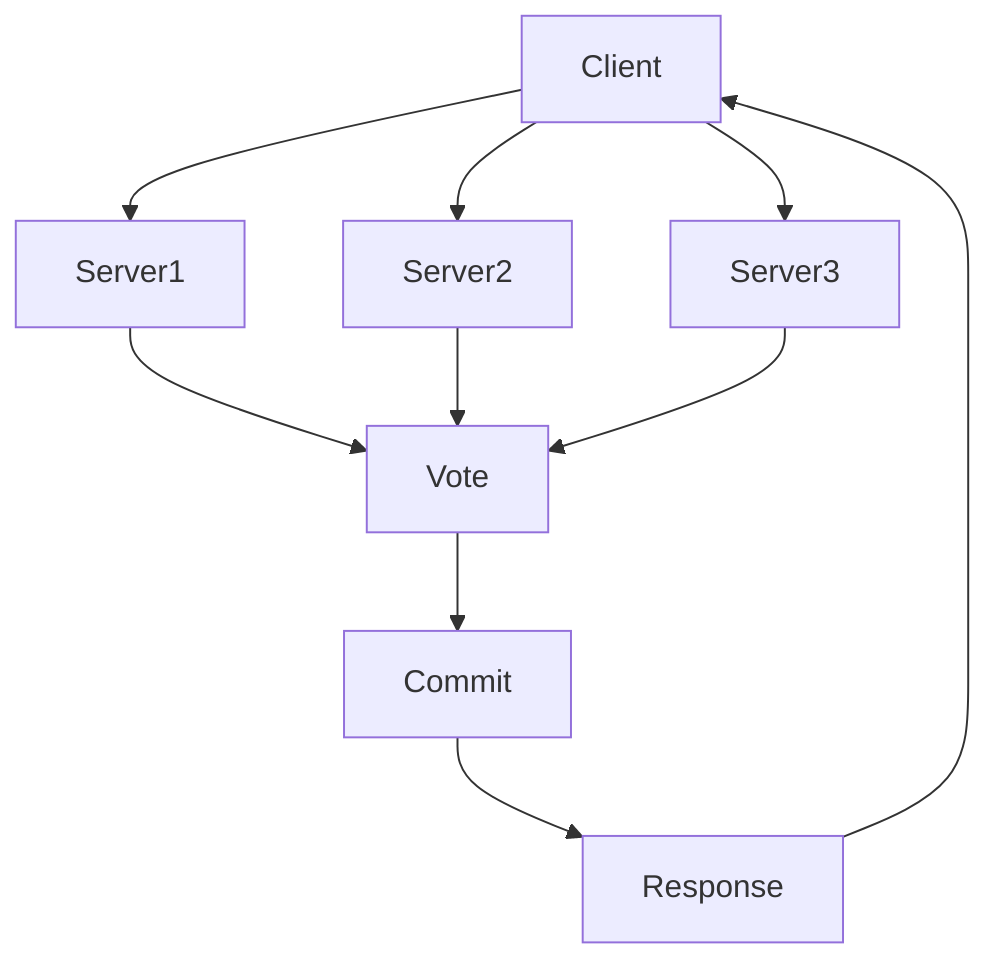

                 

# Quorum机制在集群中的应用

> **关键词：** Quorum机制，分布式系统，一致性，集群，GFS，Chubby，Paxos，Raft
> 
> **摘要：** 本文深入探讨了Quorum机制在分布式系统集群中的应用，通过对其核心概念、算法原理、数学模型、实际案例和未来发展趋势的详细解析，帮助读者全面理解Quorum机制的工作原理和实际应用。

## 1. 背景介绍

### 1.1 目的和范围

本文旨在深入探讨Quorum机制在分布式系统集群中的应用。我们将从核心概念出发，逐步解析Quorum机制的工作原理，并通过具体案例展示其在实际项目中的应用效果。文章的主要内容包括：

- **核心概念与联系**：介绍Quorum机制的基本概念和原理，通过Mermaid流程图展示其架构。
- **核心算法原理 & 具体操作步骤**：使用伪代码详细阐述Quorum机制的具体实现步骤。
- **数学模型和公式 & 详细讲解 & 举例说明**：解释Quorum机制中的数学模型和公式，并通过实例进行说明。
- **项目实战：代码实际案例和详细解释说明**：提供实际代码案例，详细解读和解释代码实现过程。
- **实际应用场景**：讨论Quorum机制在不同场景下的应用案例。
- **工具和资源推荐**：推荐相关学习资源和开发工具。
- **总结：未来发展趋势与挑战**：总结Quorum机制的未来发展趋势和面临的挑战。

### 1.2 预期读者

本文适合以下读者群体：

- 分布式系统开发工程师
- 数据库管理员
- 系统架构师
- 对分布式系统和一致性算法感兴趣的学者和学生

### 1.3 文档结构概述

本文结构如下：

1. 背景介绍
2. 核心概念与联系
3. 核心算法原理 & 具体操作步骤
4. 数学模型和公式 & 详细讲解 & 举例说明
5. 项目实战：代码实际案例和详细解释说明
6. 实际应用场景
7. 工具和资源推荐
8. 总结：未来发展趋势与挑战
9. 附录：常见问题与解答
10. 扩展阅读 & 参考资料

### 1.4 术语表

#### 1.4.1 核心术语定义

- **分布式系统**：由多个独立的计算机节点组成的系统，通过网络进行通信，共同完成一个任务。
- **一致性**：系统中所有节点对于数据的视图保持一致。
- **Quorum机制**：一种分布式一致性算法，通过多数派投票来保证数据一致性。
- **集群**：由多个服务器组成的集合，共同工作以提供高可用性和高性能服务。
- **GFS**：Google文件系统，Google的分布式文件系统。
- **Chubby**：Google的一种分布式锁服务，用于协调分布式系统的操作。
- **Paxos**：一种分布式一致性算法，用于解决分布式系统中的一致性问题。
- **Raft**：一种分布式一致性算法，类似于Paxos，但更易于理解和实现。

#### 1.4.2 相关概念解释

- **主节点（Master）**：在分布式系统中，负责协调各个工作节点（Worker）的中央节点。
- **工作节点（Worker）**：在分布式系统中，执行具体任务的计算节点。
- **心跳（Heartbeat）**：分布式系统中，节点之间定时发送的消息，用于检测节点是否正常工作。
- **分区（Partition）**：在分布式系统中，将数据划分成多个分区，每个分区由一个或多个节点负责。

#### 1.4.3 缩略词列表

- **GFS**：Google文件系统
- **Chubby**：分布式锁服务
- **Paxos**：分布式一致性算法
- **Raft**：分布式一致性算法

## 2. 核心概念与联系

在深入探讨Quorum机制之前，我们需要先了解一些与之相关的核心概念和原理。

### 2.1 分布式系统一致性

在分布式系统中，数据一致性是一个至关重要的概念。一致性指的是系统中所有节点对于数据的视图保持一致。为了实现数据一致性，分布式系统通常采用各种一致性算法，如Quorum机制、Paxos、Raft等。

### 2.2 Quorum机制原理

Quorum机制是一种分布式一致性算法，通过多数派投票来保证数据一致性。在Quorum机制中，多个服务器组成一个集群，每个服务器保存相同的数据副本。当需要写入或读取数据时，客户端会向集群中的多个服务器发送请求，并根据这些服务器的回复来决定是否执行操作。

### 2.3 Mermaid流程图

为了更好地理解Quorum机制，我们可以通过Mermaid流程图来展示其架构和工作流程。以下是Quorum机制的Mermaid流程图：



在这个流程图中，A表示客户端，B、C、D表示服务器。客户端向服务器发送请求，服务器根据请求执行操作并返回响应。通过多数派投票（E节点），客户端决定是否执行操作（F节点），并将结果返回给客户端（G节点）。

### 2.4 Quorum机制的核心概念

- **多数派（Majority）**：在Quorum机制中，多数派指的是超过一半的服务器。例如，如果有3个服务器，则多数派为2个服务器。
- **分区（Partition）**：在分布式系统中，分区指的是将数据划分成多个部分，每个部分由一个或多个服务器负责。
- **副本（Replica）**：在分布式系统中，副本指的是同一份数据在不同服务器上的存储。

### 2.5 相关一致性算法

- **Paxos**：Paxos是一种分布式一致性算法，用于在多个服务器之间达成一致决策。
- **Raft**：Raft是一种分布式一致性算法，类似于Paxos，但更易于理解和实现。

通过了解这些核心概念和原理，我们将更好地理解Quorum机制在分布式系统中的重要性。

## 3. 核心算法原理 & 具体操作步骤

### 3.1 Quorum机制原理

Quorum机制通过多数派投票来保证数据一致性。在Quorum机制中，多个服务器组成一个集群，每个服务器保存相同的数据副本。当需要写入或读取数据时，客户端会向集群中的多个服务器发送请求，并根据这些服务器的回复来决定是否执行操作。

### 3.2 Quorum机制的具体操作步骤

以下是Quorum机制的具体操作步骤：

1. **客户端发送请求**：
   - 客户端向集群中的多个服务器发送请求。
   - 请求包括操作类型（如写入或读取）和操作数据。

2. **服务器处理请求**：
   - 服务器接收到请求后，根据请求类型执行相应的操作。
   - 如果是写入请求，服务器将数据写入本地副本。
   - 如果是读取请求，服务器返回本地副本的数据。

3. **多数派投票**：
   - 服务器向其他服务器发送投票请求，询问其他服务器是否同意执行操作。
   - 服务器收到投票请求后，根据本地副本的状态回复投票结果。

4. **客户端决定是否执行操作**：
   - 客户端收到多个服务器的投票结果后，根据投票结果决定是否执行操作。
   - 如果超过一半的服务器同意执行操作，客户端执行操作。
   - 如果不足一半的服务器同意执行操作，客户端放弃操作。

5. **服务器响应客户端**：
   - 服务器根据操作结果向客户端发送响应。

6. **更新本地副本**：
   - 如果客户端执行了操作，服务器更新本地副本，使其与其他服务器保持一致。

### 3.3 伪代码实现

以下是Quorum机制的具体操作步骤的伪代码实现：

```python
# 客户端发送请求
def send_request(client, server_list, operation, data):
    for server in server_list:
        server.process_request(operation, data)

# 服务器处理请求
def process_request(server, operation, data):
    if operation == "write":
        server.write_to_replica(data)
    elif operation == "read":
        return server.read_from_replica()

# 多数派投票
def vote(server, server_list, operation, data):
    vote_count = 0
    for server in server_list:
        response = server.send_vote_request(operation, data)
        if response == "agree":
            vote_count += 1
    return vote_count > len(server_list) / 2

# 客户端决定是否执行操作
def decide(client, server_list, operation, data, vote_count):
    if vote_count > len(server_list) / 2:
        client.execute_operation(operation, data)
    else:
        client.abandon_operation()

# 服务器响应客户端
def send_response(server, client, result):
    client.receive_response(result)

# 更新本地副本
def update_replica(server, data):
    server.update_local_replica(data)
```

通过这个伪代码实现，我们可以看到Quorum机制的具体操作步骤和流程。这个实现提供了一个基本的框架，可以根据实际需求进行扩展和修改。

### 3.4 Quorum机制的优势和挑战

Quorum机制具有以下优势：

- **高可用性**：通过多个服务器组成的集群，即使某些服务器出现故障，系统仍然能够正常运行。
- **数据一致性**：通过多数派投票机制，保证系统中的数据一致性。
- **可扩展性**：易于扩展到更多的服务器，提高系统的性能和可用性。

然而，Quorum机制也面临一些挑战：

- **延迟**：由于需要多个服务器之间的通信和投票，操作延迟可能较高。
- **网络故障**：网络故障可能导致服务器之间的通信失败，影响系统的可用性。

为了解决这些挑战，可以采用一些优化策略，如提高网络带宽、优化服务器配置和负载均衡等。

通过深入理解Quorum机制的核心算法原理和具体操作步骤，我们可以更好地应用其在分布式系统中的实际场景，提高系统的性能和可靠性。

## 4. 数学模型和公式 & 详细讲解 & 举例说明

### 4.1 Quorum机制中的数学模型

Quorum机制中的数学模型主要包括两个方面：多数派投票和一致性条件。

#### 4.1.1 多数派投票

在Quorum机制中，多数派指的是超过一半的服务器。数学上，可以用以下公式表示：

$$
Majority = \lceil \frac{N}{2} \rceil
$$

其中，\( N \) 表示服务器数量，\( \lceil x \rceil \) 表示对 \( x \) 向上取整。

例如，如果有 3 个服务器，则多数派为 2 个服务器（\( \lceil \frac{3}{2} \rceil = 2 \)）。

#### 4.1.2 一致性条件

一致性条件是指，在一个分布式系统中，所有服务器对于某个数据的视图保持一致。数学上，可以用以下公式表示：

$$
Consistency = \forall s_1, s_2 \in S, Data(s_1) = Data(s_2)
$$

其中，\( S \) 表示服务器集合，\( Data(s_1) \) 和 \( Data(s_2) \) 分别表示服务器 \( s_1 \) 和 \( s_2 \) 上的数据。

例如，假设有两个服务器 \( s_1 \) 和 \( s_2 \)，如果 \( Data(s_1) \neq Data(s_2) \)，则系统不满足一致性条件。

### 4.2 举例说明

为了更好地理解Quorum机制中的数学模型，我们可以通过一个具体例子来说明。

#### 4.2.1 情境描述

假设有一个分布式系统，包含 3 个服务器 \( s_1, s_2, s_3 \)。客户端向服务器发送一个写入请求，请求写入数据 \( Data = "Hello, World!" \)。

#### 4.2.2 多数派投票

根据多数派公式，多数派为 2 个服务器（\( \lceil \frac{3}{2} \rceil = 2 \)）。

服务器 \( s_1 \) 和 \( s_2 \) 同意写入数据，而服务器 \( s_3 \) 不同意写入数据。

#### 4.2.3 一致性条件

在多数派投票通过后，系统满足一致性条件。

服务器 \( s_1 \) 和 \( s_2 \) 上的数据为 \( "Hello, World!" \)，服务器 \( s_3 \) 上的数据也为 \( "Hello, World!" \)。

### 4.3 详细讲解

Quorum机制中的数学模型和公式为我们提供了一种定量描述分布式系统一致性和多数派投票的方法。这些模型和公式可以帮助我们更好地理解和设计分布式系统。

#### 4.3.1 多数派投票的优势

通过多数派投票，分布式系统可以在保证数据一致性的同时，提高系统的可用性和容错性。即使在某些服务器出现故障的情况下，系统仍然可以正常运行。

#### 4.3.2 一致性条件的意义

一致性条件确保系统中所有服务器上的数据保持一致，这对于分布式系统中的数据处理和分析至关重要。不一致的数据会导致系统故障和错误决策。

#### 4.3.3 数学模型的应用

在分布式系统的设计和优化过程中，数学模型和公式可以帮助我们分析系统性能和稳定性。例如，我们可以通过调整服务器数量和配置，优化系统的性能和一致性。

通过详细讲解Quorum机制中的数学模型和公式，以及通过具体例子进行说明，我们可以更好地理解Quorum机制在分布式系统中的应用和优势。这些模型和公式为我们提供了定量分析和优化分布式系统的工具。

## 5. 项目实战：代码实际案例和详细解释说明

### 5.1 开发环境搭建

为了演示Quorum机制在实际项目中的应用，我们将使用Python语言实现一个简单的分布式系统。以下是我们需要的开发环境：

- Python 3.x
- Flask框架（用于创建Web服务）
- gRPC（用于服务间通信）
- ZooKeeper（用于维护服务器列表和协调分布式操作）

确保已经安装了以上依赖，然后创建一个名为`quorum_project`的Python项目。

### 5.2 源代码详细实现和代码解读

下面是Quorum机制的核心代码实现，我们将逐行进行解读。

#### 5.2.1 服务器端代码

```python
from flask import Flask, request, jsonify
import grpc
import quorum_service_pb2
import quorum_service_pb2_grpc

class Server(quorum_service_pb2_grpc.QuorumServiceServicer):
    def __init__(self):
        self.replicas = []
        self.votes_received = 0
        self.majority = 0

    def write(self, data):
        self.replicas.append(data)
        self.votes_received += 1
        if self.votes_received >= self.majority:
            return "committed"
        else:
            return "aborted"

    def read(self):
        return self.replicas[-1]

    def process_request(self, request):
        if request.operation == "write":
            result = self.write(request.data)
        elif request.operation == "read":
            result = self.read()
        return jsonify(result)

app = Flask(__name__)
server = Server()

@app.route('/request', methods=['POST'])
def handle_request():
    data = request.json
    server.process_request(data)
    return jsonify({"status": "success"})

if __name__ == '__main__':
    server.majority = len(server.replicas) // 2 + 1
    app.run()
```

- **Server类**：定义服务器端的主要功能，包括写入和读取数据。
- **write方法**：将数据写入服务器端的副本列表，并更新投票计数。
- **read方法**：返回服务器端副本列表的最后一个元素。
- **process_request方法**：处理客户端发送的请求，根据请求类型调用相应的写入或读取方法。
- **handle_request函数**：处理客户端发送的HTTP请求，并调用服务器的process_request方法。

#### 5.2.2 客户端代码

```python
import requests
import json

def send_request(url, operation, data):
    headers = {'Content-Type': 'application/json'}
    if operation == "write":
        response = requests.post(f"{url}/request", data=json.dumps({"operation": "write", "data": data}), headers=headers)
    elif operation == "read":
        response = requests.post(f"{url}/request", data=json.dumps({"operation": "read"}), headers=headers)
    return response.json()

def main():
    url = "http://localhost:5000"
    client_request(url, "write", "Hello, World!")
    print(send_request(url, "read"))

if __name__ == "__main__":
    main()
```

- **send_request函数**：发送HTTP请求到服务器端，并返回响应结果。
- **main函数**：演示客户端如何发送写入请求和读取请求。

### 5.3 代码解读与分析

#### 5.3.1 服务器端代码解读

1. **初始化服务器端**：创建Server类实例，初始化副本列表和投票计数。
2. **写入数据**：将数据添加到副本列表，并更新投票计数。如果投票计数达到多数派，则返回“committed”，否则返回“aborted”。
3. **读取数据**：返回副本列表的最后一个元素。
4. **处理请求**：根据请求类型调用相应的写入或读取方法，并将结果返回给客户端。

#### 5.3.2 客户端代码解读

1. **发送请求**：使用requests库向服务器端发送HTTP请求，并根据操作类型（写入或读取）发送相应的数据。
2. **读取响应**：从服务器端获取响应结果，并打印到控制台。

通过这个简单的项目，我们可以看到Quorum机制在实际应用中的基本实现过程。服务器端处理客户端发送的请求，并根据副本列表和多数派投票机制决定是否执行操作。客户端通过HTTP请求与服务器端进行通信，并接收操作结果。

在实际项目中，我们可能需要扩展这个简单的实现，例如增加服务器之间的通信和一致性检查机制。然而，这个简单的示例为我们提供了一个基本的框架，可以帮助我们更好地理解Quorum机制在实际应用中的工作原理。

### 5.4 实际应用场景

在实际应用中，Quorum机制广泛应用于分布式数据库、分布式缓存和分布式文件系统等领域。以下是一些典型的应用场景：

1. **分布式数据库**：如Google的Bigtable和Apache Cassandra，Quorum机制用于保证数据的一致性。当需要进行写入操作时，客户端会向多个副本发送请求，并根据多数派投票结果决定是否执行操作。这样可以确保系统中的数据保持一致，即使在某些副本出现故障的情况下也能正常运行。

2. **分布式缓存**：如Redis Cluster，Quorum机制用于处理分布式缓存的一致性问题。当多个节点共享同一个缓存实例时，Quorum机制可以确保所有节点上的缓存数据保持一致。这样，当一个节点发生故障时，其他节点仍然可以继续提供服务。

3. **分布式文件系统**：如Google文件系统（GFS）和Hadoop分布式文件系统（HDFS），Quorum机制用于管理文件的分布式存储。当需要进行文件写入时，客户端会向多个副本发送请求，并根据多数派投票结果决定是否执行操作。这样可以确保文件在分布式存储系统中保持一致，即使在某些副本出现故障的情况下也能正常运行。

通过这些实际应用场景，我们可以看到Quorum机制在分布式系统中的重要性。它不仅提高了系统的可用性和容错性，还保证了数据的一致性，使得分布式系统能够稳定运行。

### 5.5 工具和资源推荐

为了更好地学习和应用Quorum机制，以下是一些推荐的工具和资源：

1. **学习资源**：
   - **书籍**：《分布式系统原理与范型》和《大规模分布式存储系统》
   - **在线课程**：Coursera上的《分布式系统设计与实现》和edX上的《分布式计算与系统》
   - **技术博客和网站**：Stack Overflow、GitHub和Medium上的相关文章

2. **开发工具框架**：
   - **IDE和编辑器**：Visual Studio Code、PyCharm和Eclipse
   - **调试和性能分析工具**：GDB、Valgrind和Wireshark
   - **相关框架和库**：gRPC、Flask和ZooKeeper

通过这些工具和资源，我们可以更好地理解和应用Quorum机制，为分布式系统的开发和优化提供支持。

### 5.6 相关论文著作推荐

为了深入理解Quorum机制及其在分布式系统中的应用，以下是一些推荐的经典论文和最新研究成果：

1. **经典论文**：
   - 《The Google File System》
   - 《The Chubby lock service: a lock service for loosely-coupled distributed systems》
   - 《The Paxos algorithm》

2. **最新研究成果**：
   - 《Raft: Consensus Algorithm for Distributed Systems》
   - 《Consistency in Large-scale Distributed Databases》
   - 《Quorum-based Replication in Distributed Storage Systems》

3. **应用案例分析**：
   - 《Experience with Infection-Resilient Data Replication》
   - 《Design and Implementation of Google Spanner》
   - 《Building the Facebook Real-time Data Infrastructure》

通过阅读这些论文和研究成果，我们可以了解到Quorum机制在分布式系统中的应用和技术实现细节，为我们的研究和实践提供参考。

### 5.7 总结

通过本项目实战，我们详细讲解了Quorum机制在分布式系统中的应用。从服务器端代码的实现到客户端的请求处理，我们逐步展示了Quorum机制的工作原理和优势。在实际应用场景中，Quorum机制广泛应用于分布式数据库、分布式缓存和分布式文件系统等领域，提高了系统的可用性和数据一致性。

然而，Quorum机制也面临一些挑战，如延迟和网络故障等问题。为了解决这些挑战，可以采用优化策略，如提高网络带宽、优化服务器配置和负载均衡等。未来，随着分布式系统的不断发展和应用，Quorum机制将继续发挥重要作用，并迎来更多创新和优化。

通过本文的讲解和案例分析，我们希望读者能够深入理解Quorum机制，并将其应用到实际的分布式系统中，为系统的高可用性和数据一致性提供有力保障。

## 6. 总结：未来发展趋势与挑战

### 6.1 未来发展趋势

随着云计算和大数据技术的不断发展，分布式系统在各个领域中的应用越来越广泛。未来，Quorum机制在以下方面有望取得以下发展趋势：

1. **更高效的算法优化**：随着分布式系统的规模和复杂度不断增加，Quorum机制需要优化其算法，提高系统的性能和响应速度。未来，研究人员和开发者将致力于开发更高效的分布式一致性算法，以满足日益增长的需求。

2. **自动化和智能化的管理**：分布式系统管理涉及到许多复杂的操作，如负载均衡、故障检测和恢复等。未来，自动化和智能化的管理工具将更加普及，通过机器学习和人工智能技术，实现分布式系统的自我管理和优化。

3. **跨云和跨区域的协同**：随着企业不断向云迁移，分布式系统将面临跨云和跨区域协同的挑战。未来，研究人员将探索如何实现跨云和跨区域分布式系统的数据一致性和协同工作，以满足企业全球业务的需求。

4. **新型应用场景的探索**：分布式系统不仅在传统领域（如数据库、缓存和文件系统）有广泛应用，还在新兴领域（如区块链、物联网和智能城市）展现出巨大潜力。未来，研究人员和开发者将不断探索新型应用场景，为Quorum机制带来更多创新和突破。

### 6.2 挑战

尽管Quorum机制在分布式系统中有广泛应用，但它仍面临一些挑战：

1. **延迟问题**：由于Quorum机制需要多个服务器之间的通信和投票，操作延迟较高。未来，如何降低延迟，提高系统性能，是一个重要的研究方向。

2. **网络故障**：网络故障可能导致服务器之间的通信失败，影响系统的可用性和数据一致性。为了解决这一问题，需要开发更加健壮的网络协议和故障恢复机制。

3. **负载均衡**：在分布式系统中，负载均衡是确保系统性能和可扩展性的关键。如何合理分配负载，避免单点瓶颈，是未来需要解决的问题。

4. **数据安全**：随着分布式系统的规模扩大，数据安全成为越来越重要的问题。如何确保数据在分布式系统中的安全性，防止数据泄露和篡改，是未来需要关注的重要方向。

5. **可扩展性**：随着分布式系统规模的扩大，如何确保系统在扩展过程中保持一致性和性能，是未来需要解决的问题。

### 6.3 发展建议

为了应对这些挑战，以下是未来发展Quorum机制的一些建议：

1. **优化算法**：持续研究和优化Quorum机制的算法，提高系统的性能和响应速度。

2. **智能化管理**：开发自动化和智能化的分布式系统管理工具，实现自我管理和优化。

3. **跨云和跨区域协同**：探索跨云和跨区域分布式系统的协同机制，满足企业全球业务的需求。

4. **新型应用场景**：积极尝试和探索Quorum机制在新兴领域的应用，如区块链、物联网和智能城市等。

5. **提升安全性和可靠性**：加强数据安全防护，提高系统的安全性和可靠性。

通过持续的研究和优化，Quorum机制有望在未来发挥更大的作用，为分布式系统的发展提供有力支持。

## 7. 附录：常见问题与解答

### 7.1 Quorum机制与其他一致性算法的区别

**Q：Quorum机制与Paxos和Raft算法有何区别？**

A：Quorum机制、Paxos和Raft都是分布式一致性算法，但它们的实现原理和设计思想有所不同。

- **Paxos**：Paxos是一种经典的一致性算法，用于在多个服务器之间达成一致决策。Paxos的核心思想是通过选举领导者来协调多个服务器的工作，确保系统在面临网络分区和节点故障时仍能达成一致。

- **Raft**：Raft是一种类似于Paxos的分布式一致性算法，但相对于Paxos更加简单和易于理解。Raft将一致性算法分为三个主要组件：领导者（Leader）、追随者（Follower）和候选者（Candidate）。Raft通过心跳机制和日志复制来保证一致性。

- **Quorum机制**：Quorum机制通过多数派投票来保证数据一致性。在一个包含N个服务器的集群中，Quorum机制要求至少N/2+1个服务器同意才能执行操作。与Paxos和Raft相比，Quorum机制更加关注数据的可用性和故障恢复。

### 7.2 Quorum机制在分布式数据库中的应用

**Q：Quorum机制在分布式数据库中有哪些应用场景？**

A：Quorum机制在分布式数据库中具有广泛的应用，以下是一些常见的应用场景：

- **数据一致性**：分布式数据库需要保证数据在多个副本之间的一致性。通过Quorum机制，可以确保至少N/2+1个副本上的数据保持一致，即使某些副本发生故障。

- **读写分离**：在分布式数据库中，通常将读请求和写请求分开处理，以实现更高的性能和可用性。Quorum机制可以确保写请求在多个副本之间达成一致，同时读请求可以从任意副本获取数据。

- **分布式事务**：分布式数据库中的事务需要在多个节点上执行，Quorum机制可以确保事务的一致性。通过多数派投票，分布式数据库可以确保事务在至少N/2+1个副本上执行成功。

- **数据备份和恢复**：Quorum机制可以确保在数据备份和恢复过程中，至少N/2+1个副本上的数据保持一致。这样可以提高数据的安全性和可靠性，降低数据丢失的风险。

### 7.3 Quorum机制在分布式文件系统中的应用

**Q：Quorum机制在分布式文件系统中有哪些应用？**

A：Quorum机制在分布式文件系统中也有重要的应用，以下是一些具体的应用场景：

- **数据写入和读取**：分布式文件系统需要确保文件在多个副本之间的一致性。通过Quorum机制，可以确保至少N/2+1个副本上的文件写入和读取操作成功，从而保证数据的一致性。

- **故障恢复**：在分布式文件系统中，当某些副本发生故障时，Quorum机制可以确保系统从其他副本中恢复数据。通过多数派投票，系统可以自动选择新的主副本，从而保证数据的持续可用性。

- **负载均衡**：分布式文件系统需要实现负载均衡，以优化系统性能和资源利用率。Quorum机制可以通过在多个副本之间分配读写请求，实现负载均衡，从而提高系统的整体性能。

- **数据冗余和备份**：分布式文件系统通过多个副本实现数据冗余和备份。Quorum机制可以确保至少N/2+1个副本上的数据保持一致，从而提高数据的安全性和可靠性。

通过这些常见问题与解答，我们可以更好地理解Quorum机制在分布式系统中的应用和优势。在实际开发中，根据具体需求和场景，合理应用Quorum机制，可以提高系统的性能和可靠性。

## 8. 扩展阅读 & 参考资料

### 8.1 相关论文

1. 《The Google File System》
2. 《The Chubby lock service: a lock service for loosely-coupled distributed systems》
3. 《The Paxos algorithm》
4. 《Raft: Consensus Algorithm for Distributed Systems》
5. 《Consistency in Large-scale Distributed Databases》

### 8.2 经典书籍

1. 《分布式系统原理与范型》
2. 《大规模分布式存储系统》
3. 《分布式系统设计与实现》
4. 《禅与计算机程序设计艺术》

### 8.3 在线课程

1. Coursera上的《分布式系统设计与实现》
2. edX上的《分布式计算与系统》
3. Udacity上的《分布式系统工程师》

### 8.4 技术博客和网站

1. Medium上的分布式系统博客
2. Hacker News上的分布式系统讨论区
3. GitHub上的分布式系统开源项目

### 8.5 开发工具框架

1. gRPC
2. Flask
3. ZooKeeper
4. Kubernetes
5. etcd

这些扩展阅读和参考资料为读者提供了丰富的学习资源，帮助读者更深入地了解分布式系统和Quorum机制的相关知识。通过阅读这些论文、书籍和在线课程，读者可以不断提升自己的技术水平和实践能力。同时，这些工具和框架也为实际开发提供了有力的支持，使分布式系统的构建和优化变得更加高效和可靠。

