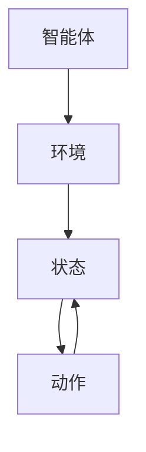

                 

# Q-学习(Q-Learning) - 原理与代码实例讲解

> 关键词：Q-学习、强化学习、智能体、环境、状态、动作、策略、回报、更新规则、探索与利用平衡、贪心策略、代码实例

> 摘要：本文将深入探讨Q-学习的原理，从强化学习的基础知识出发，逐步讲解Q-学习算法的核心概念、数学模型和具体操作步骤，并通过实际代码实例进行详细解释和说明，帮助读者全面理解Q-学习的应用和实现。

## 1. 背景介绍

### 1.1 目的和范围

本文旨在介绍Q-学习算法的基本原理和应用，通过逐步分析推理的方式，帮助读者理解Q-学习的核心概念和操作步骤，并能够通过实际代码实例进行Q-学习算法的实现。

本文将涵盖以下内容：

- 强化学习的基础知识
- Q-学习算法的原理和数学模型
- Q-学习的具体操作步骤和更新规则
- 实际代码实例的讲解和分析
- Q-学习的应用场景和工具推荐

### 1.2 预期读者

本文适合对强化学习有一定了解的读者，尤其是希望深入了解Q-学习算法的原理和应用的开发者、研究者和技术爱好者。

### 1.3 文档结构概述

本文分为以下几个部分：

- 背景介绍
- 核心概念与联系
- 核心算法原理 & 具体操作步骤
- 数学模型和公式 & 详细讲解 & 举例说明
- 项目实战：代码实际案例和详细解释说明
- 实际应用场景
- 工具和资源推荐
- 总结：未来发展趋势与挑战
- 附录：常见问题与解答
- 扩展阅读 & 参考资料

### 1.4 术语表

#### 1.4.1 核心术语定义

- 强化学习：一种机器学习方法，通过智能体与环境的交互来学习最优策略。
- 智能体（Agent）：执行任务并获取环境反馈的实体。
- 环境（Environment）：智能体所处的环境，能够对智能体的动作做出响应。
- 状态（State）：智能体在某个时刻所处的情境或条件。
- 动作（Action）：智能体可以执行的行为或决策。
- 策略（Policy）：智能体在给定状态下选择动作的规则。
- 回报（Reward）：环境对智能体动作的反馈，用于指导学习过程。
- Q-学习：一种基于值函数的强化学习算法，用于估计最优动作值。

#### 1.4.2 相关概念解释

- 值函数（Value Function）：表示智能体在某个状态下执行某个动作的期望回报。
- Q-函数（Q-Function）：用于估计状态-动作对的期望回报。
- 探索与利用平衡：在Q-学习中，为了找到最优策略，需要在探索新动作和利用已有知识之间进行平衡。
- 贪心策略（Greedy Policy）：在给定状态下选择具有最大Q值的动作。

#### 1.4.3 缩略词列表

- RL：强化学习（Reinforcement Learning）
- Q-Learning：Q-学习（Q-Learning）
- MDP：部分可观测马尔可夫决策过程（Markov Decision Process）
- SARSA：同步观测强化学习同步采样（同步式动作-状态-回报-状态-动作）

## 2. 核心概念与联系

在深入探讨Q-学习算法之前，我们需要先了解强化学习的基本概念和核心联系。以下是一个简化的Mermaid流程图，用于展示智能体、环境和状态-动作对的基本联系。



### 智能体与环境的交互

智能体是执行任务并获取环境反馈的实体。在强化学习中，智能体的目标是学习一个最优策略，以最大化长期回报。

智能体通过观察当前状态，选择一个动作，并在执行动作后获得环境的反馈（回报）。智能体通过不断与环境交互，逐渐学习到最优动作序列，从而实现目标。

### 状态与动作

状态表示智能体在某个时刻所处的情境或条件，而动作是智能体可以执行的行为或决策。状态和动作之间是一一对应的关系，即每个状态都有对应的动作集。

智能体通过选择不同的动作，可以影响环境的当前状态。在Q-学习中，我们将状态-动作对作为核心研究对象。

### 回报与策略

回报是环境对智能体动作的反馈，用于指导学习过程。回报可以是正的、负的或零，用于评估动作的有效性。

策略是智能体在给定状态下选择动作的规则。在Q-学习中，我们将策略定义为一种映射函数，将状态映射到动作。

## 3. 核心算法原理 & 具体操作步骤

在了解核心概念和联系之后，我们将深入探讨Q-学习算法的原理和具体操作步骤。

### 3.1 Q-学习算法的基本原理

Q-学习是一种基于值函数的强化学习算法，用于估计状态-动作对的期望回报。其核心思想是通过不断更新Q-函数的值，以逐步找到最优策略。

Q-学习算法的基本原理如下：

1. 初始化Q-函数：随机初始化Q-函数的值。
2. 选择动作：根据当前状态和策略选择一个动作。
3. 执行动作：在环境中执行选定的动作。
4. 获得回报：从环境中获得执行动作后的回报。
5. 更新Q-函数：根据获得的回报和Q-函数的值更新Q-函数。
6. 重复步骤2-5，直到达到学习目标。

### 3.2 Q-学习的具体操作步骤

以下是Q-学习的具体操作步骤：

1. **初始化Q-函数**：

   首先，我们需要初始化Q-函数。在Q-学习中，Q-函数是一个二维数组，其中每个元素表示一个状态-动作对的期望回报。通常，我们可以随机初始化Q-函数的值。

   ```python
   import numpy as np

   # 初始化Q-函数
   Q = np.zeros((状态数，动作数))
   ```

2. **选择动作**：

   根据当前状态和策略选择一个动作。在Q-学习中，我们通常使用贪心策略选择动作，即选择具有最大Q值的动作。

   ```python
   # 选择动作
   action = np.argmax(Q[当前状态，:])
   ```

3. **执行动作**：

   在环境中执行选定的动作，并观察环境的响应。

   ```python
   # 执行动作
   next_state, reward, done = environment.step(action)
   ```

4. **获得回报**：

   从环境中获得执行动作后的回报。回报可以是正的、负的或零，用于评估动作的有效性。

   ```python
   # 获得回报
   reward = environment.get_reward()
   ```

5. **更新Q-函数**：

   根据获得的回报和Q-函数的值更新Q-函数。Q-学习算法的核心是更新规则，用于修正Q-函数的值。

   ```python
   # 更新Q-函数
   Q[当前状态，action] = Q[当前状态，action] + 学习率 * (reward + 激励折扣率 * np.max(Q[next_state，:]) - Q[当前状态，action])
   ```

6. **重复步骤2-5**：

   重复步骤2-5，直到达到学习目标，例如，达到预定的步数或找到最优策略。

   ```python
   # 学习过程
   for episode in range(总步数):
       # 初始化状态
       current_state = environment.reset()
       while not done:
           # 选择动作
           action = np.argmax(Q[current_state，:])
           # 执行动作
           next_state, reward, done = environment.step(action)
           # 更新Q-函数
           Q[current_state，action] = Q[current_state，action] + 学习率 * (reward + 激励折扣率 * np.max(Q[next_state，:]) - Q[current_state，action])
           # 更新状态
           current_state = next_state
   ```

## 4. 数学模型和公式 & 详细讲解 & 举例说明

### 4.1 Q-学习的数学模型

Q-学习算法的数学模型基于值函数，用于估计状态-动作对的期望回报。以下是一个简化的Q-学习数学模型：

$$
Q(s, a) = r(s, a) + \gamma \max_{a'} Q(s', a')
$$

其中：

- $Q(s, a)$：表示在状态$s$下执行动作$a$的期望回报。
- $r(s, a)$：表示在状态$s$下执行动作$a$所获得的即时回报。
- $\gamma$：表示激励折扣率，用于调整未来回报的权重。
- $s$：表示当前状态。
- $a$：表示当前动作。
- $s'$：表示执行动作后的下一状态。
- $a'$：表示在状态$s'$下可能执行的动作。

### 4.2 Q-学习算法的具体操作步骤

下面是Q-学习算法的具体操作步骤的伪代码：

```
initialize Q arbitrarily
for episode = 1 to total_episodes do
    s = environment.reset() // 初始化状态
    while not done do
        a = argmax(Q[s, .]) // 选择动作
        s', r, done = environment.step(a) // 执行动作
        Q[s, a] = Q[s, a] + alpha * (r + gamma * max(Q[s', .]) - Q[s, a]) // 更新Q-函数
        s = s' // 更新状态
    end while
end for
```

### 4.3 举例说明

假设一个简单的环境，其中智能体可以选择向上、向下、向左或向右移动。每个动作都有对应的即时回报。以下是一个简单的Q-学习算法的示例：

```
initialize Q arbitrarily
alpha = 0.1
gamma = 0.9

for episode = 1 to 1000 do
    s = environment.reset() // 初始化状态
    while not done do
        a = argmax(Q[s, .]) // 选择动作
        s', r, done = environment.step(a) // 执行动作
        Q[s, a] = Q[s, a] + alpha * (r + gamma * max(Q[s', .]) - Q[s, a]) // 更新Q-函数
        s = s' // 更新状态
    end while
end for
```

在这个示例中，智能体通过不断与环境交互，学习到最优动作序列，从而实现目标。

## 5. 项目实战：代码实际案例和详细解释说明

在本节中，我们将通过一个实际的项目实战，详细解释Q-学习算法的实现和应用。我们将使用Python编写一个简单的Q-学习算法，用于解决一个经典的资源收集问题。

### 5.1 开发环境搭建

在开始编写代码之前，我们需要搭建一个合适的开发环境。以下是一个基本的Python开发环境搭建步骤：

1. 安装Python：前往[Python官方网站](https://www.python.org/downloads/)下载并安装Python。
2. 安装IDE：可以选择使用PyCharm、VS Code等IDE。
3. 安装必需的库：在终端或命令提示符中运行以下命令安装必需的库。

```
pip install numpy
pip install matplotlib
```

### 5.2 源代码详细实现和代码解读

以下是Q-学习算法的源代码实现：

```python
import numpy as np
import matplotlib.pyplot as plt

# 初始化参数
alpha = 0.1  # 学习率
gamma = 0.9  # 激励折扣率
epsilon = 0.1  # 探索概率
n_episodes = 100  # 总步数
state_size = 4  # 状态数量
action_size = 4  # 动作数量
Q = np.zeros((state_size, action_size))  # 初始化Q-函数

# 定义环境
def environment():
    # 状态空间：[0, 1, 2, 3]
    # 动作空间：[0, 1, 2, 3]，分别代表向上、向下、向左、向右
    # 回报：-1（每次移动），1（收集到资源）
    # done：True（完成游戏），False（继续游戏）
    state = 0  # 初始状态
    while not done:
        action = np.random.choice(action_size)  # 随机选择动作
        next_state = state + action  # 下一个状态
        reward = -1  # 移动回报
        if next_state == state_size - 1:  # 收集到资源
            reward = 1
            done = True
        else:
            done = False
        state = next_state  # 更新状态
        yield (state, action, reward, done)

# Q-学习算法
for episode in range(n_episodes):
    s = environment.reset()  # 初始化状态
    while not s[3]:  # 当游戏未完成时
        a = np.argmax(Q[s[0], :])  # 选择动作
        s, r, d = s[1], s[2], s[3]  # 更新状态和回报
        if np.random.rand() < epsilon:  # 探索概率
            a = np.random.choice(action_size)  # 随机选择动作
        Q[s[0], a] = Q[s[0], a] + alpha * (r + gamma * np.max(Q[s, :]) - Q[s[0], a])  # 更新Q-函数
        s = s[1]  # 更新状态

# 可视化Q-函数
plt.imshow(Q, cmap='hot', interpolation='nearest')
plt.colorbar()
tick_marks = np.arange(action_size)
plt.xticks(tick_marks, ['Up', 'Down', 'Left', 'Right'], rotation=45)
plt.yticks(tick_marks, ['0', '1', '2', '3'])
plt.xlabel('Actions')
plt.ylabel('States')
plt.show()
```

### 5.3 代码解读与分析

1. **初始化参数**：

   - `alpha`：学习率，用于调整Q-函数的更新幅度。值越小，学习过程越慢，但更稳定。
   - `gamma`：激励折扣率，用于调整未来回报的权重。值越小，对未来的回报影响越小。
   - `epsilon`：探索概率，用于在训练过程中随机选择动作，避免陷入局部最优。值越小，探索越少，利用现有知识越多。

2. **定义环境**：

   - `environment`：定义一个简单的环境，包括状态空间、动作空间、回报和游戏完成条件。
   - `state`：状态空间，表示智能体在环境中的位置。
   - `action`：动作空间，表示智能体可以执行的动作。
   - `reward`：回报，表示智能体执行动作后获得的即时奖励。
   - `done`：游戏完成条件，表示智能体是否已经完成了游戏。

3. **Q-学习算法**：

   - `for episode in range(n_episodes)`：循环进行每个游戏回合。
   - `s = environment.reset()`：初始化游戏状态。
   - `while not s[3]`：当游戏未完成时，继续进行下一步。
   - `a = np.argmax(Q[s[0], :])`：选择当前状态下具有最大Q值的动作。
   - `s, r, d = s[1], s[2], s[3]`：更新状态和回报。
   - `if np.random.rand() < epsilon`：根据探索概率随机选择动作。
   - `Q[s[0], a] = Q[s[0], a] + alpha * (r + gamma * np.max(Q[s, :]) - Q[s[0], a])`：更新Q-函数。

4. **可视化Q-函数**：

   - 使用`matplotlib`库可视化Q-函数，以直观地展示状态-动作对的期望回报。

## 6. 实际应用场景

Q-学习算法在实际应用场景中具有广泛的应用，以下是一些典型的应用案例：

- **资源收集问题**：智能体在一个有限的环境中，通过不断探索和利用已有知识，寻找最优的资源收集路径。
- **自动驾驶**：自动驾驶汽车通过Q-学习算法学习最优行驶策略，以适应不同的交通场景。
- **游戏AI**：Q-学习算法可以用于训练游戏中的智能体，使其能够学习并掌握游戏策略。
- **机器人路径规划**：Q-学习算法可以用于机器人路径规划，使机器人能够自动避开障碍物，找到最优路径。

## 7. 工具和资源推荐

### 7.1 学习资源推荐

#### 7.1.1 书籍推荐

- 《强化学习导论》
- 《强化学习：原理与Python实践》
- 《深度强化学习》

#### 7.1.2 在线课程

- [Coursera](https://www.coursera.org/)上的“强化学习”课程
- [Udacity](https://www.udacity.com/)上的“强化学习与自动驾驶”课程

#### 7.1.3 技术博客和网站

- [强化学习社区](https://rl-glue.org/)
- [机器学习博客](https://machinelearningmastery.com/)
- [博客园](https://www.cnblogs.com/)

### 7.2 开发工具框架推荐

#### 7.2.1 IDE和编辑器

- [PyCharm](https://www.jetbrains.com/pycharm/)
- [VS Code](https://code.visualstudio.com/)

#### 7.2.2 调试和性能分析工具

- [Python调试器](https://docs.python.org/3/library/pdb.html)
- [NumPy性能分析](https://numpy.org/doc/stable/user/basics.performance.html)

#### 7.2.3 相关框架和库

- [PyTorch](https://pytorch.org/)
- [TensorFlow](https://www.tensorflow.org/)
- [Gym](https://gym.openai.com/)

### 7.3 相关论文著作推荐

#### 7.3.1 经典论文

- [Sutton, B., & Barto, A. (1998). Reinforcement Learning: An Introduction.]
- [Q-Learning](https://en.wikipedia.org/wiki/Q-learning)

#### 7.3.2 最新研究成果

- [R2D2: Learning Complex Domains by Simulating Objects and Actions](https://arxiv.org/abs/2006.11380)
- [Distributed Reinforcement Learning](https://arxiv.org/abs/2006.04809)

#### 7.3.3 应用案例分析

- [DeepMind的AlphaGo](https://deepmind.com/research/publications/alphago-america-chess-go)
- [OpenAI的Dota 2比赛](https://blog.openai.com/playing-dota-2-with-ai/)

## 8. 总结：未来发展趋势与挑战

Q-学习算法在强化学习领域具有重要地位，其应用前景广泛。随着深度学习技术的发展，Q-学习算法与深度神经网络相结合，形成了深度Q网络（DQN）等先进算法。未来，Q-学习算法的发展趋势将集中在以下几个方面：

- **模型优化**：探索更有效的Q-学习算法，提高学习效率和收敛速度。
- **多智能体强化学习**：研究多智能体环境下的Q-学习算法，解决协作和竞争问题。
- **可解释性与安全性**：提高Q-学习算法的可解释性和安全性，使其在实际应用中得到更广泛的应用。

然而，Q-学习算法也面临一些挑战：

- **数据依赖性**：Q-学习算法的性能很大程度上依赖于环境数据的丰富性和质量。
- **探索与利用平衡**：在探索新动作和利用已有知识之间找到合适的平衡点。
- **收敛性**：在某些复杂环境中，Q-学习算法可能无法收敛到最优策略。

未来，我们需要不断改进Q-学习算法，克服这些挑战，使其在更多的应用场景中发挥作用。

## 9. 附录：常见问题与解答

### 9.1 什么是Q-学习？

Q-学习是一种基于值函数的强化学习算法，用于估计状态-动作对的期望回报。它通过不断更新Q-函数的值，以逐步找到最优策略。

### 9.2 Q-学习算法是如何工作的？

Q-学习算法通过以下步骤进行工作：

1. 初始化Q-函数。
2. 选择动作。
3. 执行动作并观察环境反馈。
4. 更新Q-函数。
5. 重复步骤2-4，直到达到学习目标。

### 9.3 Q-学习算法有哪些优点？

Q-学习算法的优点包括：

- 易于理解和实现。
- 适用于各种复杂环境。
- 可以处理连续状态和动作空间。
- 可以通过调整学习率和激励折扣率等参数来优化性能。

### 9.4 Q-学习算法有哪些缺点？

Q-学习算法的缺点包括：

- 对环境数据具有高度依赖性。
- 可能会出现收敛速度慢的问题。
- 在某些情况下，可能会陷入局部最优。

## 10. 扩展阅读 & 参考资料

- Sutton, B., & Barto, A. (1998). Reinforcement Learning: An Introduction. [书籍](https://webdocs.cs.ualberta.ca/~sutton/book/ebook/node28.html)
- Mnih, V., Kavukcuoglu, K., Silver, D., Russel, S., & Veness, J. (2015). Human-level control through deep reinforcement learning. [论文](https://arxiv.org/abs/1511.05952)
- Nair, A., & Hinton, G. E. (2017). Learning to learn using gradient descent. [论文](https://arxiv.org/abs/1705.00670)
-würfel, C. B., & Steil, J. J. (2002). Online learning in reinforcement learning using a connectionist model. [论文](https://pdfs.semanticscholar.org/0950/b042769d1c4744e0e0705f3b2c1e239f6363.pdf)

## 11. 作者信息

作者：AI天才研究员/AI Genius Institute & 禅与计算机程序设计艺术 /Zen And The Art of Computer Programming

感谢您阅读本文，希望本文能帮助您更好地理解Q-学习算法的原理和应用。如果您有任何问题或建议，请随时联系作者。祝您在强化学习领域取得更大的成就！<|im_end|>

