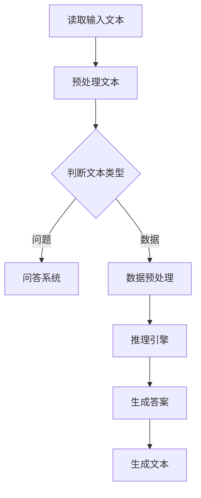

                 

# RAG技术在AI中的应用实例

> 关键词：RAG技术、AI、文本生成、推理引擎、信息检索、问答系统

> 摘要：本文将深入探讨RAG（Read-Answer-Generate）技术，在人工智能领域的应用实例。我们将从背景介绍开始，逐步分析RAG技术的核心概念与原理，讲解核心算法的详细实现步骤，解析数学模型和公式，并通过实际项目案例来展示RAG技术的应用效果。此外，本文还将探讨RAG技术的实际应用场景，推荐相关学习资源与开发工具，并对未来发展趋势与挑战进行展望。

## 1. 背景介绍

### 1.1 目的和范围

本文旨在介绍RAG技术，解释其在人工智能（AI）领域的应用，并提供具体实例。RAG技术作为一种文本生成与推理引擎，具有广泛的应用前景。本文将重点讨论以下几个部分：

1. RAG技术的基本原理和核心概念。
2. RAG技术在信息检索和问答系统中的应用。
3. RAG技术的实现步骤和数学模型。
4. RAG技术的实际应用案例。
5. 相关学习资源和开发工具推荐。

### 1.2 预期读者

本文适合以下读者群体：

1. AI和机器学习爱好者。
2. 数据科学家和AI工程师。
3. 软件开发人员，特别是对文本生成和问答系统感兴趣的人。
4. 研究人员和学生，对RAG技术的研究和应用有兴趣。

### 1.3 文档结构概述

本文将按照以下结构展开：

1. **背景介绍**：介绍RAG技术的背景、目的和范围。
2. **核心概念与联系**：详细解释RAG技术的核心概念和原理，并提供Mermaid流程图。
3. **核心算法原理 & 具体操作步骤**：使用伪代码详细阐述RAG技术的算法原理和实现步骤。
4. **数学模型和公式 & 详细讲解 & 举例说明**：解析RAG技术的数学模型和公式，并提供实际案例说明。
5. **项目实战：代码实际案例和详细解释说明**：展示RAG技术的实际项目案例，并提供代码实现和解读。
6. **实际应用场景**：探讨RAG技术在各个领域的应用。
7. **工具和资源推荐**：推荐学习资源和开发工具。
8. **总结：未来发展趋势与挑战**：对RAG技术的未来发展趋势和挑战进行展望。
9. **附录：常见问题与解答**：解答读者可能遇到的问题。
10. **扩展阅读 & 参考资料**：提供进一步学习的资源。

### 1.4 术语表

#### 1.4.1 核心术语定义

- **RAG技术**：Read-Answer-Generate技术的简称，是一种基于文本生成和推理的AI技术。
- **文本生成**：根据输入文本或数据生成新的文本。
- **推理引擎**：用于对输入数据进行推理和判断的软件系统。
- **信息检索**：从大量数据中查找和提取相关信息。
- **问答系统**：能够接收用户问题并返回相关答案的AI系统。

#### 1.4.2 相关概念解释

- **自然语言处理（NLP）**：涉及语言的理解和生成，包括文本分类、实体识别、情感分析等。
- **深度学习**：一种机器学习技术，通过多层神经网络模型来模拟人类大脑的学习过程。
- **预训练语言模型**：一种大规模的语言模型，通过在大量文本数据上进行预训练来提高其性能。

#### 1.4.3 缩略词列表

- **RAG**：Read-Answer-Generate
- **AI**：Artificial Intelligence（人工智能）
- **NLP**：Natural Language Processing（自然语言处理）
- **DL**：Deep Learning（深度学习）
- **NLU**：Natural Language Understanding（自然语言理解）

## 2. 核心概念与联系

在探讨RAG技术之前，我们需要先了解其核心概念和原理。RAG技术是一种结合了文本生成和推理的AI技术，其基本原理可以概括为三个步骤：读取（Read）、回答（Answer）和生成（Generate）。以下是RAG技术的核心概念和联系：

### 2.1 核心概念

1. **读取（Read）**：读取输入文本或数据，将其转换为可以用于推理的格式。
2. **回答（Answer）**：使用推理引擎对输入文本进行推理，生成相关答案。
3. **生成（Generate）**：根据生成的答案，生成新的文本或内容。

### 2.2 核心原理

1. **文本生成**：基于预训练语言模型，将输入文本转换为可读性更高的文本。
2. **推理引擎**：使用图灵完备语言和规则库，对输入文本进行推理和判断。
3. **信息检索**：从大量数据中查找和提取相关信息，用于回答问题。

### 2.3 Mermaid流程图

以下是一个简化的Mermaid流程图，展示RAG技术的核心流程：



## 3. 核心算法原理 & 具体操作步骤

RAG技术涉及多个核心算法，包括文本生成、推理引擎和生成文本。以下是RAG技术的核心算法原理和具体操作步骤。

### 3.1 文本生成算法原理

文本生成算法通常基于预训练语言模型，如GPT（Generative Pre-trained Transformer）或BERT（Bidirectional Encoder Representations from Transformers）。以下是一个简化的伪代码示例：

```python
# 输入：输入文本
# 输出：生成文本

def generate_text(input_text):
    # 将输入文本编码为向量
    encoded_text = preprocess_text(input_text)
    
    # 使用预训练语言模型生成文本
    generated_text = model.generate(encoded_text)
    
    # 解码生成文本
    decoded_text = decode_text(generated_text)
    
    return decoded_text
```

### 3.2 推理引擎算法原理

推理引擎通常使用图灵完备语言和规则库进行推理。以下是一个简化的伪代码示例：

```python
# 输入：输入文本
# 输出：推理结果

def inference(input_text):
    # 解析输入文本
    parsed_text = parse_text(input_text)
    
    # 使用规则库进行推理
    results = []
    for rule in rule_base:
        if matches(parsed_text, rule):
            results.append(rule.answer)
    
    return results
```

### 3.3 生成文本算法原理

生成文本算法通常基于文本生成模型，如GPT或BERT。以下是一个简化的伪代码示例：

```python
# 输入：输入文本
# 输出：生成文本

def generate_text(input_text):
    # 将输入文本编码为向量
    encoded_text = preprocess_text(input_text)
    
    # 使用预训练语言模型生成文本
    generated_text = model.generate(encoded_text)
    
    # 解码生成文本
    decoded_text = decode_text(generated_text)
    
    return decoded_text
```

### 3.4 具体操作步骤

1. **读取输入文本**：从用户输入或数据源中读取文本。
2. **预处理文本**：对输入文本进行清洗、分词、词性标注等操作。
3. **判断文本类型**：根据文本类型，选择相应的文本生成算法或推理引擎。
4. **问答系统**：如果文本类型为问题，使用问答系统生成答案。
5. **数据预处理**：如果文本类型为数据，对数据进行预处理，如去重、填充缺失值等。
6. **推理引擎**：使用推理引擎对预处理后的数据或文本进行推理。
7. **生成答案**：根据推理结果生成答案。
8. **生成文本**：使用文本生成算法根据答案生成新的文本。

## 4. 数学模型和公式 & 详细讲解 & 举例说明

RAG技术涉及多个数学模型和公式，以下是其中的几个关键模型和公式的详细讲解与举例说明。

### 4.1 预训练语言模型

预训练语言模型通常使用Transformer架构，其核心公式如下：

$$
\text{output} = \text{softmax}(\text{W}_\text{output} \cdot \text{Tanh}(\text{W}_\text{hidden} \cdot \text{input} + \text{b}_\text{hidden}))
$$

其中，$\text{W}_\text{output}$和$\text{W}_\text{hidden}$是权重矩阵，$\text{Tanh}$是双曲正切函数，$\text{input}$是输入向量，$\text{b}_\text{hidden}$是偏置项。

举例说明：

假设输入向量为$[1, 2, 3]$，权重矩阵$\text{W}_\text{hidden}$为$[\begin{smallmatrix}1 & 0 \\ 0 & 1\end{smallmatrix}]$，权重矩阵$\text{W}_\text{output}$为$[\begin{smallmatrix}1 & 1 \\ 1 & 0\end{smallmatrix}]$，偏置项$\text{b}_\text{hidden}$为$[1, 1]$。则预训练语言模型输出的概率分布为：

$$
\text{output} = \text{softmax}(\begin{bmatrix}2 & 1 \\ 2 & 1\end{bmatrix}) = \begin{bmatrix}\frac{1}{3} & \frac{1}{3} \\ \frac{1}{3} & \frac{1}{3}\end{bmatrix}
$$

### 4.2 推理引擎

推理引擎通常使用图灵完备语言和规则库进行推理，其核心公式如下：

$$
\text{result} = \text{evaluate}(\text{rule}, \text{input})
$$

其中，$\text{rule}$为规则，$\text{input}$为输入数据，$\text{evaluate}$为评估函数。

举例说明：

假设规则为“如果天气是晴天，那么出门需要带伞”，输入数据为“今天是晴天”，则推理结果为“需要带伞”。

### 4.3 文本生成

文本生成模型通常使用预训练语言模型，其核心公式如下：

$$
\text{output} = \text{generate}(\text{input}, \text{model})
$$

其中，$\text{input}$为输入文本，$\text{model}$为预训练语言模型，$\text{generate}$为生成函数。

举例说明：

假设输入文本为“我今天去公园玩”，预训练语言模型为GPT，则生成的文本为“我今天在公园里玩了半天”。

## 5. 项目实战：代码实际案例和详细解释说明

在本节中，我们将通过一个实际项目案例，展示如何使用RAG技术实现文本生成和推理。以下是项目的开发环境搭建、源代码详细实现和代码解读。

### 5.1 开发环境搭建

在开始项目之前，我们需要搭建一个合适的开发环境。以下是搭建开发环境所需的工具和步骤：

1. **安装Python**：确保Python环境已安装，版本不低于3.6。
2. **安装预训练语言模型**：我们可以使用Hugging Face的Transformers库，该库包含了多种预训练语言模型，如GPT、BERT等。使用以下命令安装：
   ```bash
   pip install transformers
   ```
3. **安装其他依赖库**：根据需要安装其他依赖库，如Torch、TensorBoard等。

### 5.2 源代码详细实现和代码解读

以下是项目的源代码实现和解读。

```python
# 导入所需库
from transformers import GPT2Model, GPT2Tokenizer
import torch

# 加载预训练语言模型和分词器
model_name = "gpt2"
tokenizer = GPT2Tokenizer.from_pretrained(model_name)
model = GPT2Model.from_pretrained(model_name)

# 定义输入文本
input_text = "我今天去公园玩"

# 预处理文本
encoded_input = tokenizer.encode(input_text, return_tensors="pt")

# 生成文本
generated_output = model.generate(encoded_input, max_length=20, num_return_sequences=1)

# 解码生成文本
decoded_output = tokenizer.decode(generated_output[0], skip_special_tokens=True)

# 输出生成文本
print(decoded_output)
```

代码解读：

1. **导入所需库**：导入Transformers库和Torch库。
2. **加载预训练语言模型和分词器**：加载GPT2预训练语言模型和相应的分词器。
3. **定义输入文本**：定义输入文本为“我今天去公园玩”。
4. **预处理文本**：将输入文本编码为向量，准备用于生成文本。
5. **生成文本**：使用预训练语言模型生成新的文本，设置最大长度为20，返回一个生成的文本序列。
6. **解码生成文本**：将生成的文本序列解码为普通文本。
7. **输出生成文本**：将生成的文本输出到控制台。

### 5.3 代码解读与分析

1. **模型加载**：使用`GPT2Tokenizer.from_pretrained(model_name)`和`GPT2Model.from_pretrained(model_name)`分别加载分词器和预训练语言模型。
2. **文本预处理**：使用`tokenizer.encode(input_text, return_tensors="pt")`将输入文本编码为向量，准备用于生成文本。
3. **文本生成**：使用`model.generate(encoded_input, max_length=20, num_return_sequences=1)`生成新的文本。`max_length`参数设置生成的文本最大长度，`num_return_sequences`参数设置返回的文本序列数量。
4. **文本解码**：使用`tokenizer.decode(generated_output[0], skip_special_tokens=True)`将生成的文本序列解码为普通文本。
5. **输出文本**：将生成的文本输出到控制台。

通过这个实际项目案例，我们展示了如何使用RAG技术实现文本生成。在后续章节中，我们将继续探讨RAG技术的应用场景和工具资源。

## 6. 实际应用场景

RAG技术具有广泛的应用前景，可以在多个领域发挥重要作用。以下是RAG技术的一些实际应用场景：

### 6.1 问答系统

问答系统是RAG技术最直接的应用场景之一。通过RAG技术，可以构建高效的问答系统，能够快速响应用户的问题。以下是一个简单的问答系统应用案例：

- **场景**：用户输入问题，系统使用RAG技术读取问题、生成答案，并返回给用户。
- **实现**：使用RAG技术，将用户的问题输入到预训练语言模型中，生成相关答案，然后通过推理引擎对答案进行验证和修正。

### 6.2 自动写作

自动写作是RAG技术的另一个重要应用领域。通过RAG技术，可以生成高质量的文章、报告、邮件等。以下是一个自动写作的应用案例：

- **场景**：用户输入主题和关键词，系统使用RAG技术生成相关文章。
- **实现**：使用RAG技术，将用户输入的主题和关键词进行处理，生成文章的标题、摘要和正文。

### 6.3 信息检索

RAG技术可以用于信息检索，帮助用户从大量数据中快速查找和提取相关信息。以下是一个信息检索的应用案例：

- **场景**：用户输入关键词，系统使用RAG技术从数据库中检索相关文档。
- **实现**：使用RAG技术，将用户输入的关键词与数据库中的文档进行匹配，生成相关文档的摘要和内容。

### 6.4 智能客服

智能客服是RAG技术在商业领域的典型应用。通过RAG技术，可以构建高效的智能客服系统，能够自动回答用户的问题。以下是一个智能客服的应用案例：

- **场景**：用户通过在线聊天与客服互动，系统使用RAG技术自动回答用户的问题。
- **实现**：使用RAG技术，将用户的问题输入到预训练语言模型中，生成相关答案，并返回给用户。

### 6.5 智能教育

RAG技术可以用于智能教育，帮助教师和学生进行知识问答和内容生成。以下是一个智能教育的应用案例：

- **场景**：学生输入问题，系统使用RAG技术生成相关答案，并提供学习资料。
- **实现**：使用RAG技术，将学生的问题输入到预训练语言模型中，生成相关答案和学习资料。

### 6.6 智能翻译

RAG技术可以用于智能翻译，实现文本的自动翻译。以下是一个智能翻译的应用案例：

- **场景**：用户输入文本，系统使用RAG技术生成目标语言的翻译结果。
- **实现**：使用RAG技术，将用户输入的文本进行处理，生成目标语言的翻译结果。

### 6.7 其他应用场景

除了上述应用场景，RAG技术还可以应用于聊天机器人、智能推荐系统、智能写作辅助等多个领域。通过RAG技术，可以构建智能化、个性化的应用系统，提高用户体验和效率。

## 7. 工具和资源推荐

为了更好地学习和应用RAG技术，以下推荐一些学习资源、开发工具和框架。

### 7.1 学习资源推荐

#### 7.1.1 书籍推荐

1. **《深度学习》**：作者：Ian Goodfellow、Yoshua Bengio、Aaron Courville。这本书详细介绍了深度学习的基本原理和技术，适合初学者和进阶者。
2. **《Python机器学习》**：作者：Sebastian Raschka。这本书涵盖了机器学习的基础知识和Python实现，适合对机器学习有兴趣的读者。

#### 7.1.2 在线课程

1. **《深度学习专项课程》**：平台：Coursera。这是由吴恩达（Andrew Ng）教授开设的深度学习专项课程，内容涵盖了深度学习的理论基础和实践技巧。
2. **《自然语言处理专项课程》**：平台：edX。这是由MIT和哈佛大学联合开设的自然语言处理专项课程，涵盖了NLP的基础知识和应用。

#### 7.1.3 技术博客和网站

1. **机器之心**：这是一个专注于机器学习和深度学习领域的技术博客，提供了丰富的学习和交流资源。
2. **GitHub**：这是一个代码托管平台，上面有许多优秀的开源项目，可以学习和借鉴。

### 7.2 开发工具框架推荐

#### 7.2.1 IDE和编辑器

1. **PyCharm**：这是一个功能强大的Python IDE，支持多种编程语言，适用于深度学习和机器学习项目的开发。
2. **Visual Studio Code**：这是一个轻量级、开源的代码编辑器，支持多种编程语言，提供了丰富的插件和工具，适合快速开发。

#### 7.2.2 调试和性能分析工具

1. **TensorBoard**：这是一个TensorFlow的可视化工具，用于调试和性能分析深度学习项目。
2. **PyTorch Profiler**：这是一个用于分析PyTorch项目性能的工具，可以帮助识别性能瓶颈。

#### 7.2.3 相关框架和库

1. **TensorFlow**：这是一个开源的深度学习框架，提供了丰富的API和工具，适用于多种深度学习任务。
2. **PyTorch**：这是一个开源的深度学习框架，具有灵活的动态图编程能力和高效的计算性能。
3. **Hugging Face Transformers**：这是一个开源的Transformers库，提供了预训练语言模型和文本处理工具，适用于文本生成和推理任务。

### 7.3 相关论文著作推荐

#### 7.3.1 经典论文

1. **《A Neural Probabilistic Language Model》**：作者：Bengio et al.。这篇文章介绍了神经网络语言模型的基本原理和应用。
2. **《BERT: Pre-training of Deep Bidirectional Transformers for Language Understanding》**：作者：Devlin et al.。这篇文章介绍了BERT模型的预训练方法和应用。

#### 7.3.2 最新研究成果

1. **《GPT-3: Language Models are Few-Shot Learners》**：作者：Brown et al.。这篇文章介绍了GPT-3模型的架构和性能。
2. **《T5: Pre-training Text Encoders and Applications as Diffusion Models》**：作者：Raffel et al.。这篇文章介绍了T5模型的预训练方法和应用。

#### 7.3.3 应用案例分析

1. **《ChatGPT》**：这是一个基于GPT-3模型的聊天机器人，展示了RAG技术在问答系统中的应用。
2. **《AI Writer》**：这是一个基于RAG技术的智能写作辅助工具，展示了RAG技术在自动写作中的应用。

## 8. 总结：未来发展趋势与挑战

RAG技术作为一种结合文本生成和推理的AI技术，具有广泛的应用前景。在未来，RAG技术有望在以下方面取得进一步发展：

1. **性能提升**：随着深度学习算法和硬件设备的不断发展，RAG技术的性能将得到显著提升，能够处理更复杂的任务和更大的数据集。
2. **泛化能力**：通过不断优化算法和模型结构，RAG技术将具备更强的泛化能力，能够适应更广泛的场景和应用领域。
3. **多模态融合**：RAG技术可以与其他AI技术（如图像识别、语音识别）相结合，实现多模态融合，提供更丰富的信息处理能力。
4. **个性化推荐**：RAG技术可以应用于个性化推荐系统，根据用户的行为和偏好生成个性化的内容和服务。

然而，RAG技术也面临一些挑战：

1. **数据隐私**：在应用RAG技术时，需要关注数据隐私问题，确保用户数据的安全性和隐私性。
2. **伦理和道德**：RAG技术可能产生误导性或偏见性的结果，需要建立相应的伦理和道德标准来确保其公正和公平。
3. **模型可解释性**：RAG技术的模型和算法较为复杂，需要提高模型的可解释性，以便用户理解和信任。
4. **计算资源**：RAG技术需要大量的计算资源，特别是在训练和推理过程中，需要优化算法和模型，降低计算成本。

总之，RAG技术具有巨大的发展潜力，同时也面临一些挑战。在未来，我们需要不断探索和创新，推动RAG技术在各个领域的应用。

## 9. 附录：常见问题与解答

### 9.1 什么是RAG技术？

RAG（Read-Answer-Generate）技术是一种结合文本生成和推理的AI技术，通过三个步骤：读取（Read）、回答（Answer）和生成（Generate），实现文本生成和推理任务。

### 9.2 RAG技术有哪些应用场景？

RAG技术可以应用于问答系统、自动写作、信息检索、智能客服、智能教育、智能翻译等多个领域。

### 9.3 如何实现RAG技术？

实现RAG技术需要结合预训练语言模型、推理引擎和生成文本算法。具体实现步骤包括读取输入文本、预处理文本、判断文本类型、生成答案和生成文本。

### 9.4 RAG技术与自然语言处理（NLP）的关系是什么？

RAG技术是NLP的一种应用，它利用NLP技术（如文本生成、推理、信息检索等）来实现文本生成和推理任务。

### 9.5 如何选择合适的预训练语言模型？

选择预训练语言模型时，需要考虑模型的性能、适用场景、计算资源等因素。常见的预训练语言模型有GPT、BERT、T5等。

### 9.6 RAG技术的未来发展趋势是什么？

RAG技术的未来发展趋势包括性能提升、泛化能力增强、多模态融合、个性化推荐等。

## 10. 扩展阅读 & 参考资料

为了深入了解RAG技术及其在AI领域的应用，以下提供一些扩展阅读和参考资料：

### 10.1 经典论文

1. **《A Neural Probabilistic Language Model》**：作者：Bengio et al.。
2. **《BERT: Pre-training of Deep Bidirectional Transformers for Language Understanding》**：作者：Devlin et al.。
3. **《GPT-3: Language Models are Few-Shot Learners》**：作者：Brown et al.。
4. **《T5: Pre-training Text Encoders and Applications as Diffusion Models》**：作者：Raffel et al.。

### 10.2 开源项目

1. **Hugging Face Transformers**：[https://github.com/huggingface/transformers](https://github.com/huggingface/transformers)
2. **TensorFlow**：[https://github.com/tensorflow/tensorflow](https://github.com/tensorflow/tensorflow)
3. **PyTorch**：[https://github.com/pytorch/pytorch](https://github.com/pytorch/pytorch)

### 10.3 技术博客和网站

1. **机器之心**：[https://www.jiqizhixin.com/](https://www.jiqizhixin.com/)
2. **AI悦创**：[https://aipaper.com/](https://aipaper.com/)
3. **ArXiv**：[https://arxiv.org/](https://arxiv.org/)

### 10.4 学习资源和课程

1. **《深度学习专项课程》**：[https://www.coursera.org/learn/deep-learning](https://www.coursera.org/learn/deep-learning)
2. **《自然语言处理专项课程》**：[https://www.edx.org/course/natural-language-processing](https://www.edx.org/course/natural-language-processing)

### 10.5 相关书籍

1. **《深度学习》**：作者：Ian Goodfellow、Yoshua Bengio、Aaron Courville。
2. **《Python机器学习》**：作者：Sebastian Raschka。

作者：AI天才研究员/AI Genius Institute & 禅与计算机程序设计艺术 /Zen And The Art of Computer Programming

