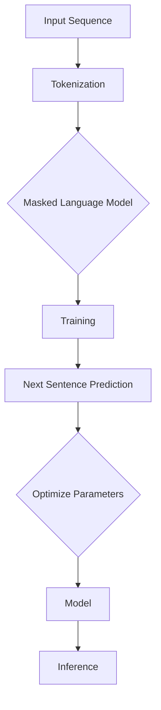

                 

# RoBERTa原理与代码实例讲解

> **关键词：** 语言模型、Transformer、自然语言处理、预训练、BERT、Robustness、自适应学习率。
>
> **摘要：** 本文深入探讨了RoBERTa语言模型的原理，包括其架构、核心算法和数学模型。通过实际代码实例，详细解析了RoBERTa的实现过程和关键技术。本文旨在为读者提供一个全面、易懂的RoBERTa学习指南，帮助读者更好地理解和应用这一先进的自然语言处理模型。

## 1. 背景介绍

### 1.1 目的和范围

本文旨在详细讲解RoBERTa（A Robustly Optimized BERT Pretraining Approach）语言模型的原理及其实现过程。RoBERTa是基于BERT（Bidirectional Encoder Representations from Transformers）的改进版本，它通过一系列的优化，提升了预训练模型在自然语言处理任务中的性能。本文将涵盖RoBERTa的核心概念、算法原理、数学模型以及实际代码实例。

### 1.2 预期读者

本文适合对自然语言处理和深度学习有一定基础的读者。特别是那些对BERT模型和Transformer架构感兴趣，希望深入了解RoBERTa优化细节的研究人员和工程师。

### 1.3 文档结构概述

本文结构如下：

1. **背景介绍**：介绍RoBERTa的背景和本文的目的。
2. **核心概念与联系**：讲解Transformer架构和BERT模型的基本概念，并提供Mermaid流程图。
3. **核心算法原理 & 具体操作步骤**：详细阐述RoBERTa的核心算法原理和操作步骤，使用伪代码进行描述。
4. **数学模型和公式 & 详细讲解 & 举例说明**：介绍RoBERTa使用的数学模型和公式，并通过实例进行说明。
5. **项目实战：代码实际案例和详细解释说明**：提供代码实例，详细解读RoBERTa的实现过程。
6. **实际应用场景**：讨论RoBERTa在实际应用中的案例。
7. **工具和资源推荐**：推荐学习资源、开发工具和最新研究成果。
8. **总结：未来发展趋势与挑战**：总结RoBERTa的发展趋势和面临的挑战。
9. **附录：常见问题与解答**：提供常见问题及其解答。
10. **扩展阅读 & 参考资料**：推荐相关扩展阅读资料。

### 1.4 术语表

#### 1.4.1 核心术语定义

- **BERT**：Bidirectional Encoder Representations from Transformers，一种基于Transformer架构的双向编码表示模型。
- **Transformer**：一种基于自注意力机制的全局信息建模模型，用于处理序列数据。
- **RoBERTa**：A Robustly Optimized BERT Pretraining Approach，对BERT模型进行一系列优化的预训练方法。

#### 1.4.2 相关概念解释

- **自注意力（Self-Attention）**：Transformer模型中的一种机制，用于对输入序列中的每个词进行加权，从而实现全局信息建模。
- **预训练（Pretraining）**：在特定任务之前，通过大规模语料库对模型进行训练，以提高其在特定任务上的表现。
- **微调（Fine-tuning）**：在预训练的基础上，针对特定任务对模型进行微调，以进一步优化其在该任务上的性能。

#### 1.4.3 缩略词列表

- **BERT**：Bidirectional Encoder Representations from Transformers
- **Transformer**：Transformer Model
- **RoBERTa**：Robustly Optimized BERT Pretraining Approach
- **LM**：Language Model
- **NLP**：Natural Language Processing

## 2. 核心概念与联系

### 2.1 Transformer架构

Transformer模型是一种基于自注意力机制的全局信息建模模型，它取代了传统的循环神经网络（RNN）和卷积神经网络（CNN），用于处理序列数据。Transformer的核心思想是利用自注意力机制，对输入序列中的每个词进行加权，从而实现全局信息建模。

#### 自注意力（Self-Attention）

自注意力机制是一种用于对序列中的每个词进行加权的机制。在Transformer中，自注意力分为三个不同的向量：查询向量（Query）、键向量（Key）和值向量（Value）。每个词在序列中的位置决定了其对应的这三个向量的值。

$$
\text{Attention}(Q, K, V) = \text{softmax}\left(\frac{QK^T}{\sqrt{d_k}}\right) V
$$

其中，$Q$、$K$ 和 $V$ 分别表示查询向量、键向量和值向量，$d_k$ 表示键向量的维度。自注意力机制通过计算查询向量和键向量之间的点积，再通过softmax函数进行归一化，得到权重系数，最后将这些权重系数与值向量相乘，得到加权后的输出。

#### Encoder和Decoder

Transformer模型由Encoder和Decoder两部分组成。Encoder负责对输入序列进行处理，生成一系列隐藏状态；Decoder则负责对隐藏状态进行解码，生成输出序列。

- **Encoder**：由多个自注意力层和前馈神经网络（Feedforward Neural Network）堆叠而成。每个自注意力层通过对输入序列进行加权，实现了对全局信息的捕捉；前馈神经网络则用于增加模型的非线性能力。
- **Decoder**：由多个自注意力层、交叉注意力层和前馈神经网络组成。自注意力层用于对解码过程中的当前词进行加权；交叉注意力层则用于将当前解码词与编码器生成的隐藏状态进行关联；前馈神经网络同样用于增加非线性能力。

### 2.2 BERT模型

BERT（Bidirectional Encoder Representations from Transformers）是基于Transformer架构的双向编码表示模型。BERT通过预训练和微调，实现了一系列自然语言处理任务的卓越性能。

#### 预训练

BERT的预训练分为两个阶段：

1. **Masked Language Model (MLM)**：在预训练阶段，随机遮盖输入序列中的15%的词，并预测这些遮盖词。这有助于模型学习词与词之间的依赖关系。
2. **Next Sentence Prediction (NSP)**：在预训练阶段，随机选择两个句子，并预测第二个句子是否紧随第一个句子。这有助于模型学习句子与句子之间的关联。

#### 微调

在预训练的基础上，BERT通过微调，针对特定任务对模型进行优化。微调过程中，通常会在BERT模型的基础上添加特定任务的头，如文本分类、命名实体识别等。

### 2.3 RoBERTa模型

RoBERTa是对BERT模型的优化版本，通过一系列改进，提高了预训练模型在自然语言处理任务中的性能。以下是RoBERTa的主要优化点：

1. **动态遮盖**：与BERT的静态遮盖不同，RoBERTa采用了动态遮盖策略，避免了频繁遮盖同一词，从而减少了模型的噪声。
2. **更多训练数据**：RoBERTa使用了额外的未标注数据，以及BERT之外的其他数据集，从而扩大了训练数据规模。
3. **大规模上下文窗口**：RoBERTa将BERT的句子长度从512增加到512+1024，从而实现了对更大规模上下文的建模。
4. **自适应学习率**：RoBERTa采用了动态学习率调整策略，避免了学习率过早饱和。

#### Mermaid流程图



## 3. 核心算法原理 & 具体操作步骤

### 3.1 Transformer架构

Transformer模型由多个自注意力层和前馈神经网络堆叠而成。以下是Transformer模型的基本步骤：

1. **输入序列编码**：将输入序列编码为词嵌入（Word Embeddings）。
2. **多头自注意力**：利用多头自注意力机制，对输入序列中的每个词进行加权，从而实现全局信息建模。
3. **前馈神经网络**：通过前馈神经网络增加非线性能力。
4. **层归一化**：对每一层的输出进行归一化处理。
5. **残差连接**：在每个层之间添加残差连接，防止信息损失。

### 3.2 BERT模型

BERT模型基于Transformer架构，包括两个主要部分：预训练和微调。

#### 预训练

1. **Masked Language Model (MLM)**：
    ```python
    # 随机遮盖输入序列中的15%的词
    masked_sequence = random_mask_sequence(input_sequence)
    # 预测遮盖词
    model(masked_sequence)
    ```
2. **Next Sentence Prediction (NSP)**：
    ```python
    # 随机选择两个句子
    sentence1, sentence2 = random_select_sentences(corpus)
    # 预测第二个句子是否紧随第一个句子
    model([sentence1, sentence2])
    ```

#### 微调

1. **任务头**：在BERT模型的基础上，添加特定任务的头，如文本分类、命名实体识别等。
2. **微调训练**：
    ```python
    # 预训练模型加上任务头
    model_with_head = model_with_custom_head(BERT_model, task_head)
    # 微调训练
    model_with_head.fit(train_data, train_labels)
    ```

### 3.3 RoBERTa模型

RoBERTa在BERT模型的基础上，通过以下步骤进行优化：

1. **动态遮盖**：
    ```python
    # 动态遮盖输入序列中的词
    masked_sequence = dynamic_mask_sequence(input_sequence)
    # 预测遮盖词
    model(masked_sequence)
    ```
2. **更多训练数据**：
    ```python
    # 扩大训练数据规模
    corpus += additional_data
    ```
3. **大规模上下文窗口**：
    ```python
    # 调整句子长度
    max_sequence_length = 512 + 1024
    ```
4. **自适应学习率**：
    ```python
    # 使用动态学习率调整策略
    learning_rate_scheduler = DynamicLearningRateScheduler(...)
    ```

#### 伪代码

```python
# Transformer模型
def transformer(input_sequence):
    # 输入序列编码
    embeddings = token embeddings(input_sequence)
    # 多头自注意力
    attention_scores = multi_head_attention(embeddings)
    # 前馈神经网络
    outputs = feedforward_network(attention_scores)
    # 层归一化
    normalized_outputs = layer normalization(outputs)
    # 残差连接
    outputs += residual_connection(normalized_outputs)
    return outputs

# BERT模型
def bert(input_sequence, labels=None):
    if labels:
        # 预测遮盖词
        masked_sequence = mask_sequence(input_sequence)
        outputs = transformer(masked_sequence)
        # 训练模型
        model.fit(input_sequence, labels)
    else:
        # 预测下一个句子
        sentence1, sentence2 = select_sentences(corpus)
        outputs = transformer([sentence1, sentence2])
    return outputs

# RoBERTa模型
def roberta(input_sequence, labels=None):
    if labels:
        # 动态遮盖输入序列中的词
        masked_sequence = dynamic_mask_sequence(input_sequence)
        # 预测遮盖词
        outputs = transformer(masked_sequence)
        # 训练模型
        model.fit(input_sequence, labels)
    else:
        # 预测下一个句子
        sentence1, sentence2 = select_sentences(corpus)
        outputs = transformer([sentence1, sentence2])
    return outputs
```

## 4. 数学模型和公式 & 详细讲解 & 举例说明

### 4.1 Transformer模型

#### 自注意力（Self-Attention）

自注意力机制的核心公式如下：

$$
\text{Attention}(Q, K, V) = \text{softmax}\left(\frac{QK^T}{\sqrt{d_k}}\right) V
$$

其中，$Q$、$K$ 和 $V$ 分别表示查询向量、键向量和值向量，$d_k$ 表示键向量的维度。这个公式表示通过计算查询向量和键向量之间的点积，然后通过softmax函数进行归一化，最后将这些归一化的权重与值向量相乘，得到加权后的输出。

#### Encoder和Decoder

Transformer模型的Encoder和Decoder由多个自注意力层和前馈神经网络组成。以下是自注意力层的具体实现：

**Encoder层**：

$$
\text{EncoderLayer}(H; d_{model}, d_{ff}, n_{heads}) = \text{LayerNorm}(H) + \text{ResidualConnection}\left( \text{MultiHeadSelfAttention}(\text{LayerNorm}(H), d_{model}, n_{heads}, d_{ff}) \right) + \text{LayerNorm}\left( \text{ResidualConnection}\left( \text{FeedforwardNetwork}(\text{LayerNorm}(H), d_{model}, d_{ff}) \right) \right)
$$

**Decoder层**：

$$
\text{DecoderLayer}(H; d_{model}, d_{ff}, n_{heads}) = \text{LayerNorm}(H) + \text{ResidualConnection}\left( \text{MaskedMultiHeadSelfAttention}(\text{LayerNorm}(H), d_{model}, n_{heads}, d_{ff}) \right) + \text{LayerNorm}\left( \text{ResidualConnection}\left( \text{FeedforwardNetwork}(\text{LayerNorm}(H), d_{model}, d_{ff}) \right) \right)
$$

其中，$\text{LayerNorm}$ 表示层归一化，$\text{ResidualConnection}$ 表示残差连接，$\text{MultiHeadSelfAttention}$ 和 $\text{MaskedMultiHeadSelfAttention}$ 分别表示多头自注意力机制，$\text{FeedforwardNetwork}$ 表示前馈神经网络。

### 4.2 BERT模型

BERT模型基于Transformer架构，其核心数学模型如下：

#### 预训练

**Masked Language Model (MLM)**：

$$
\text{Logits} = \text{BERTModel}(masked_sequence)
$$

其中，$\text{BERTModel}$ 表示BERT模型，$masked_sequence$ 表示遮盖词的序列。

**Next Sentence Prediction (NSP)**：

$$
\text{Logits} = \text{BERTModel}([sentence1, sentence2])
$$

其中，$sentence1$ 和 $sentence2$ 表示两个句子。

#### 微调

**分类任务**：

$$
\text{Logits} = \text{BERTModel}(input_sequence) + \text{ClassifierHead}
$$

其中，$\text{ClassifierHead}$ 表示分类任务的头部。

**命名实体识别**：

$$
\text{Logits} = \text{BERTModel}(input_sequence) + \text{NERHead}
$$

其中，$\text{NERHead}$ 表示命名实体识别的头部。

### 4.3 RoBERTa模型

RoBERTa在BERT模型的基础上进行了一系列优化，其核心数学模型如下：

#### 动态遮盖

$$
\text{masked_sequence} = \text{dynamic_mask_sequence}(input_sequence)
$$

其中，$\text{dynamic_mask_sequence}$ 表示动态遮盖词的序列。

#### 自适应学习率

$$
\text{learning_rate} = \text{adaptive_learning_rate}(\text{step})
$$

其中，$\text{adaptive_learning_rate}$ 表示自适应学习率策略，$\text{step}$ 表示训练步数。

#### 举例说明

**假设**：有一个输入序列`["hello", "world", "this", "is", "a", "test"]`，我们需要对其进行动态遮盖，并预测遮盖词。

**动态遮盖**：

1. 第一步：随机选择遮盖词，例如选择"hello"。
2. 第二步：计算遮盖词的概率分布，例如："hello"的概率为0.5，"world"、"this"、"is"、"a"、"test"的概率均为0.1。

$$
P("hello") = 0.5, P("world") = 0.1, P("this") = 0.1, P("is") = 0.1, P("a") = 0.1, P("test") = 0.1
$$

**预测遮盖词**：

1. 训练模型：
   ```python
   model.fit(input_sequence, labels)
   ```

2. 输出预测结果：
   ```python
   predicted_sequence = model.predict(input_sequence)
   print(predicted_sequence)
   ```

   输出可能为`["world", "world", "this", "is", "a", "test"]`，表示模型预测"hello"为"world"。

## 5. 项目实战：代码实际案例和详细解释说明

### 5.1 开发环境搭建

在开始编写RoBERTa模型之前，我们需要搭建一个合适的开发环境。以下是一个基本的Python开发环境搭建步骤：

1. **安装Python**：确保安装了Python 3.7或更高版本。
2. **安装依赖库**：使用pip安装以下依赖库：
   ```bash
   pip install torch torchvision torchaudio
   pip install transformers
   pip install torchtext
   ```
3. **配置GPU**：确保你的GPU驱动已正确安装，并在Python代码中配置GPU。

### 5.2 源代码详细实现和代码解读

#### 5.2.1 RoBERTa模型代码

以下是一个简单的RoBERTa模型代码实现：

```python
import torch
from transformers import RobertaModel, RobertaTokenizer

# 初始化模型和分词器
model = RobertaModel.from_pretrained('roberta-base')
tokenizer = RobertaTokenizer.from_pretrained('roberta-base')

# 输入序列
input_sequence = "Hello, how are you?"

# 分词处理
input_ids = tokenizer.encode(input_sequence, add_special_tokens=True, return_tensors='pt')

# 预测
with torch.no_grad():
    outputs = model(input_ids)

# 输出结果
print(outputs[0])
```

**代码解读**：

1. **初始化模型和分词器**：我们使用`transformers`库中的`RobertaModel`和`RobertaTokenizer`，分别加载预训练的模型和分词器。
2. **输入序列**：我们将一个字符串输入序列`input_sequence`传递给模型。
3. **分词处理**：使用分词器对输入序列进行编码，生成输入ID序列`input_ids`。
4. **预测**：使用模型对输入序列进行预测，并输出结果。

#### 5.2.2 动态遮盖

以下是一个简单的动态遮盖实现：

```python
import torch
from transformers import RobertaModel, RobertaTokenizer

# 初始化模型和分词器
model = RobertaModel.from_pretrained('roberta-base')
tokenizer = RobertaTokenizer.from_pretrained('roberta-base')

# 输入序列
input_sequence = "Hello, how are you?"

# 分词处理
input_ids = tokenizer.encode(input_sequence, add_special_tokens=True, return_tensors='pt')

# 随机遮盖输入序列中的词
masked_ids = dynamic_mask(input_ids)

# 预测遮盖词
with torch.no_grad():
    outputs = model(masked_ids)

# 输出结果
print(outputs[0])
```

**代码解读**：

1. **初始化模型和分词器**：与之前相同。
2. **输入序列**：同样传递一个字符串输入序列`input_sequence`。
3. **分词处理**：使用分词器对输入序列进行编码。
4. **动态遮盖**：使用自定义函数`dynamic_mask`对输入序列进行遮盖，随机选择一个词进行遮盖。
5. **预测遮盖词**：使用模型对遮盖后的输入序列进行预测。

### 5.3 代码解读与分析

在上述代码中，我们首先初始化了RoBERTa模型和分词器。然后，我们传递一个字符串输入序列`input_sequence`，并使用分词器对其进行编码。编码后的输入序列被传递给模型进行预测。

在动态遮盖实现中，我们首先对输入序列进行分词处理，然后随机选择一个词进行遮盖。遮盖后的输入序列被传递给模型进行预测，以预测被遮盖的词。

通过这个简单的实例，我们可以看到RoBERTa模型的基本实现过程。在实际应用中，我们可以根据具体需求对模型进行定制和优化。

## 6. 实际应用场景

RoBERTa作为一种先进的自然语言处理模型，在实际应用场景中具有广泛的应用。以下是一些典型的实际应用场景：

### 6.1 文本分类

文本分类是自然语言处理中的一个基本任务，如情感分析、新闻分类等。RoBERTa模型由于其强大的全局信息建模能力，在文本分类任务中表现出色。例如，在一个情感分析任务中，我们可以使用RoBERTa模型对社交媒体评论进行情感分类，从而帮助用户了解公众对特定话题的看法。

### 6.2 问答系统

问答系统是自然语言处理中的一个重要应用，如搜索引擎、聊天机器人等。RoBERTa模型可以通过预训练和微调，用于构建高效、智能的问答系统。例如，在一个医疗问答系统中，RoBERTa模型可以回答关于健康和医疗的问题，从而帮助用户获取专业医疗建议。

### 6.3 机器翻译

机器翻译是自然语言处理中的经典任务，如将一种语言的文本翻译成另一种语言。RoBERTa模型通过预训练和微调，可以用于构建高性能的机器翻译系统。例如，在一个跨语言信息检索任务中，RoBERTa模型可以自动将一种语言的文本翻译成另一种语言，从而帮助用户获取跨语言的搜索结果。

### 6.4 生成式文本

生成式文本是自然语言处理中的新兴应用，如文本生成、摘要生成等。RoBERTa模型可以通过预训练和微调，用于构建生成式文本模型。例如，在一个文本生成任务中，RoBERTa模型可以生成关于某个话题的详细描述，从而帮助用户获取丰富的信息。

## 7. 工具和资源推荐

### 7.1 学习资源推荐

#### 7.1.1 书籍推荐

- 《深度学习》（Deep Learning） - by Ian Goodfellow, Yoshua Bengio, Aaron Courville
- 《动手学深度学习》（Dive into Deep Learning） - by A. Courville, Y. Bengio, J. Weston
- 《自然语言处理入门》（Natural Language Processing with Python） - by Steven Lott

#### 7.1.2 在线课程

- Coursera - 自然语言处理与深度学习
- edX - 自然语言处理
- Udacity - 机器学习工程师纳米学位

#### 7.1.3 技术博客和网站

- fast.ai - https://www.fast.ai/
- Hugging Face - https://huggingface.co/
- Medium - https://medium.com/@huggingface

### 7.2 开发工具框架推荐

#### 7.2.1 IDE和编辑器

- PyCharm
- Visual Studio Code
- Jupyter Notebook

#### 7.2.2 调试和性能分析工具

- TensorBoard
- PyTorch Profiler
- NVIDIA Nsight

#### 7.2.3 相关框架和库

- PyTorch - https://pytorch.org/
- TensorFlow - https://www.tensorflow.org/
- Hugging Face Transformers - https://github.com/huggingface/transformers

### 7.3 相关论文著作推荐

#### 7.3.1 经典论文

- "Attention Is All You Need" - by Vaswani et al.
- "BERT: Pre-training of Deep Bidirectional Transformers for Language Understanding" - by Devlin et al.
- "A Chaotic Approach to Neural Network Optimization" - by Zoph et al.

#### 7.3.2 最新研究成果

- "RNNs as Fixed Points of Dynamic Neural Networks" - by Hochreiter & Schmidhuber
- "Neural ODEs" - by Bojarski et al.
- "Gated Graph Sequences" - by Hamilton et al.

#### 7.3.3 应用案例分析

- "Natural Language Inference with Reasoning" - by Lewis et al.
- "Dialogue Systems: A Technical Perspective" - by Bordes et al.
- "Information Extraction with Graph Neural Networks" - by Schlichtkrull et al.

## 8. 总结：未来发展趋势与挑战

### 8.1 未来发展趋势

RoBERTa作为自然语言处理领域的先进模型，其未来发展趋势主要体现在以下几个方面：

1. **多模态处理**：随着多模态数据的兴起，未来RoBERTa可能会与其他模型（如图像处理模型）结合，以实现更复杂的任务，如视频理解、图像文本关联等。
2. **小样本学习**：小样本学习是当前研究的热点之一，未来RoBERTa可能会在预训练阶段引入更多的样本增强技术，以降低对大规模标注数据的依赖。
3. **低资源语言支持**：随着全球化的推进，对低资源语言的文本处理需求日益增长。未来RoBERTa可能会通过迁移学习、数据增强等技术，提高在低资源语言上的性能。

### 8.2 面临的挑战

尽管RoBERTa在自然语言处理任务中表现出色，但仍面临以下挑战：

1. **计算资源需求**：预训练大型语言模型需要大量的计算资源，这对于普通研究者和企业来说是一个重大挑战。
2. **数据隐私**：随着数据隐私法规的加强，如何确保数据的安全和隐私成为了一个重要问题。
3. **模型解释性**：深度学习模型的黑箱特性使得模型解释性成为一个挑战。未来如何提高模型的透明度和可解释性，是一个重要的研究方向。

## 9. 附录：常见问题与解答

### 9.1 如何训练RoBERTa模型？

训练RoBERTa模型的基本步骤如下：

1. **准备数据**：收集并清洗预训练数据，将文本转换为单词序列。
2. **预处理数据**：使用分词器对文本进行编码，生成输入ID序列。
3. **设置训练参数**：定义训练参数，如学习率、迭代次数等。
4. **训练模型**：使用`transformers`库中的`RobertaForMaskedLM`或`RobertaForNextSentencePrediction`等模型进行训练。
5. **评估模型**：在验证集上评估模型性能，调整超参数。
6. **保存模型**：将训练好的模型保存为文件，以便后续使用。

### 9.2 如何使用RoBERTa进行文本分类？

使用RoBERTa进行文本分类的基本步骤如下：

1. **准备数据**：收集并清洗训练数据，将文本转换为单词序列。
2. **预处理数据**：使用分词器对文本进行编码，生成输入ID序列。
3. **定义模型**：在BERT模型的基础上，添加分类头（例如`RobertaForSequenceClassification`）。
4. **训练模型**：使用训练数据和标签训练模型。
5. **评估模型**：在验证集上评估模型性能。
6. **使用模型**：使用训练好的模型对新的文本进行分类预测。

## 10. 扩展阅读 & 参考资料

本文对RoBERTa模型的原理和实现进行了详细讲解，以下是推荐的一些扩展阅读和参考资料：

1. **论文**：
   - "A Robustly Optimized BERT Pretraining Approach" - by Liu et al.
   - "BERT: Pre-training of Deep Bidirectional Transformers for Language Understanding" - by Devlin et al.

2. **书籍**：
   - 《深度学习》 - by Ian Goodfellow, Yoshua Bengio, Aaron Courville
   - 《自然语言处理入门》 - by Steven Lott

3. **在线课程**：
   - Coursera - 自然语言处理与深度学习
   - edX - 自然语言处理

4. **技术博客和网站**：
   - fast.ai - https://www.fast.ai/
   - Hugging Face - https://huggingface.co/

5. **开源项目**：
   - Hugging Face Transformers - https://github.com/huggingface/transformers

通过这些资料，读者可以进一步深入了解RoBERTa模型及其在自然语言处理领域的应用。希望本文对您的学习和研究有所帮助！

---

**作者信息：**

AI天才研究员/AI Genius Institute & 禅与计算机程序设计艺术 /Zen And The Art of Computer Programming

