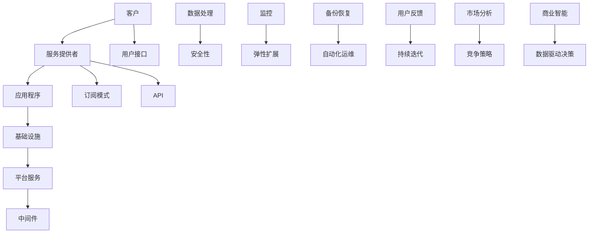

                 

# SaaS创业模式：技术人的最佳商业选择？

> 关键词：SaaS，创业，技术人，商业模式，可持续发展，竞争策略
> 
> 摘要：本文将探讨SaaS（软件即服务）创业模式在技术领域中的崛起，分析其作为技术人最佳商业选择的理由，并深入解析SaaS的运作原理、开发实践、应用场景以及未来发展趋势。通过对比分析，我们将揭示SaaS创业模式在当前市场中的独特优势与挑战，为技术人提供切实可行的创业指南。

## 1. 背景介绍

### 1.1 目的和范围

本文旨在探讨SaaS创业模式，分析其为何成为技术人理想的商业选择。我们将从SaaS的基本概念、发展历程开始，逐步深入到SaaS的核心原理、开发实践，最终探讨其在各个行业中的应用与未来趋势。通过全面的分析，帮助读者理解SaaS创业模式的优势和挑战，为其创业之路提供参考。

### 1.2 预期读者

本文适合对SaaS和创业有基本了解的技术人员、创业者以及潜在创业者阅读。无论是正在考虑创业的技术专家，还是希望深入了解SaaS商业模式的专业人士，都可以通过本文获得有益的信息和见解。

### 1.3 文档结构概述

本文分为十个主要部分：

1. **背景介绍**：介绍文章的目的、预期读者以及结构概述。
2. **核心概念与联系**：阐述SaaS的基本概念和核心原理。
3. **核心算法原理 & 具体操作步骤**：详细讲解SaaS的运作机制。
4. **数学模型和公式 & 详细讲解 & 举例说明**：介绍与SaaS相关的数学模型。
5. **项目实战：代码实际案例和详细解释说明**：通过实际案例展示SaaS开发过程。
6. **实际应用场景**：分析SaaS在不同领域的应用。
7. **工具和资源推荐**：推荐学习资源、开发工具和框架。
8. **总结：未来发展趋势与挑战**：展望SaaS创业的潜在发展方向。
9. **附录：常见问题与解答**：回答读者可能关心的问题。
10. **扩展阅读 & 参考资料**：提供进一步的阅读资源。

### 1.4 术语表

#### 1.4.1 核心术语定义

- **SaaS（Software as a Service）**：软件即服务，一种通过互联网提供软件应用的商业模式。
- **IaaS（Infrastructure as a Service）**：基础设施即服务，提供虚拟化计算资源的基础设施服务。
- **PaaS（Platform as a Service）**：平台即服务，提供开发平台和中间件服务的商业模式。
- **API（Application Programming Interface）**：应用程序编程接口，允许不同软件之间相互通信和操作。
- **云服务**：通过互联网提供计算资源、存储和网络连接的服务。

#### 1.4.2 相关概念解释

- **多租户架构**：一种软件架构模式，允许多个客户共享同一套应用软件实例，各自独立使用。
- **弹性扩展**：系统根据需求自动调整资源，以适应流量波动。
- **订阅模式**：用户按需订阅服务，按使用量付费。

#### 1.4.3 缩略词列表

- SaaS：软件即服务
- IaaS：基础设施即服务
- PaaS：平台即服务
- API：应用程序编程接口
- UI：用户界面
- UX：用户体验

## 2. 核心概念与联系

在深入探讨SaaS创业模式之前，有必要了解其核心概念和架构。以下将使用Mermaid流程图展示SaaS的基本概念和相互联系。



### 2.1 SaaS架构详解

- **服务提供者（B）**：提供SaaS服务的公司或个人，负责开发和维护应用程序。
- **应用程序（C）**：SaaS的核心，提供给客户使用的软件。
- **基础设施（D）**：云计算基础设施，包括服务器、存储和网络资源。
- **平台服务（E）**：提供开发平台和中间件服务，如PaaS。
- **中间件（F）**：连接应用程序和服务提供者，实现功能集成。
- **用户接口（G）**：应用程序的前端部分，用户与软件交互的界面。
- **订阅模式（H）**：用户按需订阅服务，灵活的计费模式。
- **API（I）**：应用程序编程接口，支持应用程序间的数据交换和操作。

- **数据处理（J）**：对用户数据进行收集、存储、分析和处理。
- **安全性（K）**：确保用户数据和应用程序的安全。
- **监控（L）**：实时监控系统性能和健康状况。
- **弹性扩展（M）**：根据需求自动调整资源。
- **备份恢复（N）**：数据备份和恢复策略，保障数据安全。
- **自动化运维（O）**：自动化管理应用程序和系统。
- **用户反馈（P）**：收集用户反馈，优化产品和服务。
- **持续迭代（Q）**：持续更新和改进应用程序。
- **市场分析（R）**：分析市场趋势和竞争对手，制定竞争策略。
- **竞争策略（S）**：针对市场竞争采取的战略。
- **商业智能（T）**：利用数据分析进行决策。
- **数据驱动决策（U）**：基于数据分析做出商业决策。

通过上述Mermaid流程图，我们可以清晰地看到SaaS的各个环节及其相互关系。接下来，我们将进一步探讨SaaS的核心算法原理和具体操作步骤。

## 3. 核心算法原理 & 具体操作步骤

SaaS的成功离不开其核心算法原理和具体操作步骤。以下将详细阐述SaaS的算法原理，并使用伪代码展示关键步骤。

### 3.1 SaaS核心算法原理

SaaS的核心算法主要包括以下几个方面：

1. **多租户架构**：实现多个客户共享同一套应用程序实例。
2. **弹性扩展**：根据需求动态调整计算资源。
3. **订阅模式**：灵活的计费方式，按需订阅。
4. **数据处理与分析**：对用户数据进行分析，提供个性化服务。

#### 3.1.1 多租户架构

多租户架构是一种软件架构模式，允许多个客户共享同一套应用程序实例。以下是实现多租户架构的伪代码：

```plaintext
// 多租户架构伪代码
class SaaSApplication {
    // 租户信息
    tenants = {}

    // 添加租户
    function addTenant(tenantId, tenantData) {
        tenants[tenantId] = tenantData
    }

    // 删除租户
    function deleteTenant(tenantId) {
        delete tenants[tenantId]
    }

    // 获取租户数据
    function getTenantData(tenantId) {
        return tenants[tenantId]
    }

    // 处理租户请求
    function handleRequest(tenantId, request) {
        tenantData = getTenantData(tenantId)
        // 根据租户数据处理请求
        processRequest(tenantData, request)
    }
}
```

#### 3.1.2 弹性扩展

弹性扩展是SaaS系统的重要特性，可以根据需求动态调整计算资源。以下是实现弹性扩展的伪代码：

```plaintext
// 弹性扩展伪代码
class ElasticScaling {
    // 调整资源
    function adjustResources(resourceUsage) {
        if (resourceUsage > threshold) {
            increaseResources()
        } else if (resourceUsage < threshold) {
            decreaseResources()
        }
    }

    // 增加资源
    function increaseResources() {
        // 调用云服务API增加资源
        cloudService.increaseResources()
    }

    // 减少资源
    function decreaseResources() {
        // 调用云服务API减少资源
        cloudService.decreaseResources()
    }
}
```

#### 3.1.3 订阅模式

订阅模式是SaaS的主要计费方式，用户根据使用量支付费用。以下是实现订阅模式的伪代码：

```plaintext
// 订阅模式伪代码
class SubscriptionManager {
    // 计费规则
    billingRules = {}

    // 添加计费规则
    function addBillingRule(rule) {
        billingRules[rule.name] = rule
    }

    // 计算费用
    function calculateBill(user, usageData) {
        rule = billingRules[user.plan]
        totalCost = 0
        for (key, value) in usageData {
            totalCost += rule.costPerUnit * value
        }
        return totalCost
    }
}
```

#### 3.1.4 数据处理与分析

数据处理与分析是SaaS提供个性化服务的基础。以下是实现数据处理与分析的伪代码：

```plaintext
// 数据处理与分析伪代码
class DataAnalytics {
    // 数据处理
    function processData(data) {
        // 数据清洗、转换和聚合
        cleanedData = cleanData(data)
        transformedData = transformData(cleanedData)
        aggregatedData = aggregateData(transformedData)

        // 数据分析
        analysisResults = analyzeData(aggregatedData)

        // 存储分析结果
        storeAnalysisResults(analysisResults)
    }

    // 数据分析
    function analyzeData(data) {
        // 进行统计分析、机器学习等分析操作
        results = performAnalysis(data)
        return results
    }
}
```

### 3.2 SaaS具体操作步骤

以下是实现SaaS的具体操作步骤：

1. **需求分析**：了解客户需求，确定功能模块和性能指标。
2. **设计架构**：根据需求设计应用程序和系统架构。
3. **开发应用程序**：实现应用程序功能，包括前端和后端。
4. **部署上线**：将应用程序部署到云平台，实现自动化运维。
5. **数据处理与分析**：对用户数据进行收集、存储、分析和处理。
6. **用户反馈与迭代**：收集用户反馈，持续优化产品和服务。

#### 3.2.1 需求分析

```plaintext
// 需求分析伪代码
class RequirementsAnalysis {
    // 收集需求
    function collectRequirements() {
        requirements = []
        for (feature in customerRequests) {
            requirements.push(feature)
        }
        return requirements
    }

    // 确定性能指标
    function definePerformanceMetrics() {
        metrics = {
            "responseTime": "≤ 200ms",
            "throughput": "≥ 1000 requests/s",
            "availability": "≥ 99.9%",
            "scalability": "auto-scale",
            "security": "data encryption"
        }
        return metrics
    }
}
```

#### 3.2.2 设计架构

```plaintext
// 架构设计伪代码
class ArchitectureDesign {
    // 设计应用程序架构
    function designAppArchitecture(requirements) {
        architecture = {
            "frontend": "React",
            "backend": "Spring Boot",
            "database": "PostgreSQL",
            "cloudPlatform": "AWS",
            "monitoring": "Prometheus",
            "logging": "ELK Stack"
        }
        return architecture
    }

    // 设计数据处理架构
    function designDataArchitecture(architecture) {
        dataArchitecture = {
            "dataIngestion": "Kafka",
            "dataProcessing": "Apache Spark",
            "dataStorage": "Amazon S3",
            "dataAnalysis": "Apache Hive"
        }
        return dataArchitecture
    }
}
```

#### 3.2.3 开发应用程序

```plaintext
// 应用程序开发伪代码
class AppDevelopment {
    // 编写前端代码
    function developFrontend(architecture) {
        frontendCode = "React components and styles"
    }

    // 编写后端代码
    function developBackend(architecture) {
        backendCode = "Spring Boot application and APIs"
    }

    // 集成前端和后端
    function integrateFrontendAndBackend() {
        integratedApp = "React and Spring Boot combined"
    }
}
```

#### 3.2.4 部署上线

```plaintext
// 部署上线伪代码
class Deployment {
    // 配置云平台
    function configureCloudPlatform(architecture) {
        cloudConfig = "AWS configuration"
    }

    // 自动化部署
    function automateDeployment(cloudConfig) {
        "Deploy application on cloud platform"
    }

    // 监控和运维
    function monitorAndOperate(cloudConfig) {
        "Monitor application health and perform operations"
    }
}
```

#### 3.2.5 数据处理与分析

```plaintext
// 数据处理与分析伪代码
class DataProcessingAnalysis {
    // 数据处理
    function processData(data) {
        "Process and clean data"
    }

    // 数据分析
    function performAnalysis(data) {
        "Analyze data using machine learning algorithms"
    }

    // 存储分析结果
    function storeResults(results) {
        "Store and manage analysis results"
    }
}
```

通过上述伪代码，我们可以看到SaaS的核心算法原理和具体操作步骤。这些步骤为SaaS系统的开发和运营提供了清晰的指导。接下来，我们将进一步探讨SaaS的数学模型和公式，以及其在实际应用中的详细讲解和举例说明。

## 4. 数学模型和公式 & 详细讲解 & 举例说明

在SaaS模式中，数学模型和公式起着至关重要的作用，它们不仅帮助我们在设计和运营过程中做出数据驱动的决策，还确保了商业模式的可持续性和盈利能力。以下将介绍几个核心的数学模型和公式，并详细讲解其应用和意义。

### 4.1 订阅模式定价模型

订阅模式是SaaS的核心收入来源，合理的定价策略对企业的盈利至关重要。以下是一个简单的订阅模式定价模型：

#### 4.1.1 公式

$$
P = \sum_{i=1}^{n} (c_i \times q_i)
$$

其中：
- \(P\) 是总定价。
- \(c_i\) 是第i个功能模块的定价。
- \(q_i\) 是第i个功能模块的使用量或订阅量。

#### 4.1.2 讲解

该定价模型通过为每个功能模块单独定价，然后乘以其使用量或订阅量，得到总定价。这种方法能够灵活地适应不同客户的需求，同时确保每个功能模块的收益。

#### 4.1.3 举例说明

假设一个SaaS平台有两个功能模块：A和B。
- 功能模块A的定价为10美元/月。
- 功能模块B的定价为5美元/月。

某客户的订阅情况如下：
- 功能模块A使用了3个。
- 功能模块B使用了2个。

则该客户的总定价为：

$$
P = (10 \times 3) + (5 \times 2) = 30 + 10 = 40美元/月
$$

### 4.2 弹性扩展成本模型

弹性扩展是SaaS系统的重要特性，但同时也带来了额外的成本。以下是一个简单的弹性扩展成本模型：

#### 4.2.1 公式

$$
C_e = c_e \times R
$$

其中：
- \(C_e\) 是弹性扩展成本。
- \(c_e\) 是单位弹性扩展成本。
- \(R\) 是弹性扩展的资源使用量。

#### 4.2.2 讲解

单位弹性扩展成本是一个固定值，表示每次扩展所需的成本。资源使用量\(R\)则根据系统的实际需求动态变化。

#### 4.2.3 举例说明

假设单位弹性扩展成本为5美元/小时。

如果系统需要扩展10小时，则弹性扩展成本为：

$$
C_e = 5 \times 10 = 50美元
$$

### 4.3 用户留存率模型

用户留存率是衡量SaaS平台成功与否的关键指标。以下是一个简单的用户留存率模型：

#### 4.3.1 公式

$$
L = \frac{R}{N} \times 100\%
$$

其中：
- \(L\) 是用户留存率。
- \(R\) 是留存用户数。
- \(N\) 是总用户数。

#### 4.3.2 讲解

用户留存率表示在一段时间内，仍使用SaaS服务的用户占总用户数的比例。这个指标越高，说明产品的黏性越强。

#### 4.3.3 举例说明

假设一个SaaS平台有1000个用户，其中500个用户在一个月后仍然活跃，则用户留存率为：

$$
L = \frac{500}{1000} \times 100\% = 50\%
$$

### 4.4 用户生命周期价值模型

用户生命周期价值（LTV）是评估用户潜在价值的模型，对于制定营销策略和资源分配至关重要。以下是一个简单的用户生命周期价值模型：

#### 4.4.1 公式

$$
LTV = \frac{AUM}{C_A}
$$

其中：
- \(LTV\) 是用户生命周期价值。
- \(AUM\) 是总收益。
- \(C_A\) 是年均成本。

#### 4.4.2 讲解

总收益\(AUM\)包括所有用户的订阅费用和一次性收入。年均成本\(C_A\)则包括运营成本、营销成本等。

#### 4.4.3 举例说明

假设一个SaaS平台的总收益为100万美元，年均成本为30万美元，则用户生命周期价值为：

$$
LTV = \frac{1000000}{300000} = 3.33年
$$

通过上述数学模型和公式的讲解，我们可以更好地理解SaaS模式中的关键指标和决策依据。接下来，我们将通过实际案例展示SaaS的开发过程和代码实现。

## 5. 项目实战：代码实际案例和详细解释说明

在本文的第五部分，我们将通过一个实际项目案例，展示如何开发一个简单的SaaS平台，并提供代码实现和详细解释说明。

### 5.1 开发环境搭建

在开始项目之前，我们需要搭建一个合适的开发环境。以下是一个基本的开发环境配置：

- **操作系统**：Linux（推荐Ubuntu 20.04）
- **编程语言**：Java（推荐使用Spring Boot框架）
- **数据库**：MySQL
- **开发工具**：IntelliJ IDEA
- **云服务**：AWS（用于部署和测试）

### 5.2 源代码详细实现和代码解读

#### 5.2.1 项目结构

项目结构如下所示：

```
SaaS-Platform/
|-- src/
|   |-- main/
|   |   |-- java/
|   |   |   |-- com/
|   |   |   |   |-- example/
|   |   |   |   |   |-- SaaSApplication.java
|   |   |   |   |   |-- UserController.java
|   |   |   |   |   |-- ProductService.java
|   |   |-- resources/
|   |   |   |-- application.properties
|-- pom.xml
```

#### 5.2.2 SaaSApplication.java

```java
package com.example;

import org.springframework.boot.SpringApplication;
import org.springframework.boot.autoconfigure.SpringBootApplication;

@SpringBootApplication
public class SaaSApplication {
    public static void main(String[] args) {
        SpringApplication.run(SaaSApplication.class, args);
    }
}
```

**解释**：这是Spring Boot应用程序的启动类。`@SpringBootApplication`注解使Spring Boot能够自动配置应用程序。`main`方法启动Spring Boot应用程序。

#### 5.2.3 UserController.java

```java
package com.example;

import org.springframework.beans.factory.annotation.Autowired;
import org.springframework.web.bind.annotation.*;

@RestController
@RequestMapping("/users")
public class UserController {
    @Autowired
    private UserService userService;

    @PostMapping
    public User createUser(@RequestBody User user) {
        return userService.createUser(user);
    }

    @GetMapping("/{userId}")
    public User getUser(@PathVariable Long userId) {
        return userService.getUserById(userId);
    }
}
```

**解释**：这是一个RESTful风格的用户控制器类，负责处理用户相关的HTTP请求。`@RestController`注解表示这是一个RESTful控制器。`createUser`方法处理创建用户的请求，`getUser`方法处理获取用户信息的请求。

#### 5.2.4 ProductService.java

```java
package com.example;

import org.springframework.beans.factory.annotation.Autowired;
import org.springframework.stereotype.Service;

import java.util.List;

@Service
public class ProductService {
    @Autowired
    private ProductRepository productRepository;

    public List<Product> getAllProducts() {
        return productRepository.findAll();
    }

    public Product createProduct(Product product) {
        return productRepository.save(product);
    }
}
```

**解释**：这是一个产品服务类，负责处理产品相关的业务逻辑。`@Service`注解表示这是一个业务逻辑层组件。`getAllProducts`方法获取所有产品，`createProduct`方法创建新产品。

#### 5.2.5 application.properties

```properties
spring.datasource.url=jdbc:mysql://localhost:3306/saas_db?useSSL=false
spring.datasource.username=root
spring.datasource.password=root
spring.jpa.hibernate.ddl-auto=update
```

**解释**：这是Spring Boot的配置文件，用于配置数据库连接和其他配置参数。`spring.datasource`配置了MySQL数据库的连接信息，`spring.jpa`配置了JPA的自动生成数据库表。

### 5.3 代码解读与分析

#### 5.3.1 数据库设计

在上述代码中，我们使用了MySQL数据库。以下是数据库的设计：

- `users` 表：存储用户信息。
- `products` 表：存储产品信息。

```sql
CREATE TABLE users (
    id BIGINT AUTO_INCREMENT PRIMARY KEY,
    name VARCHAR(255) NOT NULL,
    email VARCHAR(255) UNIQUE NOT NULL
);

CREATE TABLE products (
    id BIGINT AUTO_INCREMENT PRIMARY KEY,
    name VARCHAR(255) NOT NULL,
    price DECIMAL(10, 2) NOT NULL
);
```

#### 5.3.2 功能模块划分

该项目划分为以下几个功能模块：

1. **用户管理模块**：包括创建用户、获取用户信息等功能。
2. **产品管理模块**：包括创建产品、获取所有产品等功能。

#### 5.3.3 RESTful API设计

该项目采用了RESTful API设计，通过HTTP请求处理用户和产品相关的业务逻辑。以下是一些典型的API接口：

- `POST /users`：创建新用户。
- `GET /users/{userId}`：获取特定用户信息。
- `GET /products`：获取所有产品。
- `POST /products`：创建新产品。

通过上述实际案例和代码解读，我们可以看到如何开发一个简单的SaaS平台。接下来，我们将探讨SaaS的实际应用场景，分析其在各个领域的应用。

## 6. 实际应用场景

SaaS（软件即服务）模式由于其灵活性和可扩展性，在多个行业中得到了广泛应用。以下是一些主要的应用场景：

### 6.1 企业管理

SaaS在企业管理领域有着广泛的应用，包括客户关系管理（CRM）、企业资源计划（ERP）、人力资源管理系统（HRMS）等。例如，Salesforce提供了一套全面的CRM解决方案，帮助企业管理和追踪客户关系，从而提升销售业绩。

### 6.2 财务管理

财务管理软件如Xero和QuickBooks Online，通过SaaS模式提供在线会计和财务管理服务。用户可以通过Web浏览器访问这些服务，轻松处理日常的账单、发票和财务报表。

### 6.3 项目管理

项目管理工具如Trello和Asana，通过SaaS平台提供协作和任务管理功能。团队成员可以实时协作，跟踪项目进度，提高工作效率。

### 6.4 教育培训

在线教育平台如Coursera和Udemy，利用SaaS模式提供在线课程和培训服务。学生可以随时随地访问课程内容，进行学习和测试。

### 6.5 健康医疗

健康医疗领域的SaaS应用包括电子健康记录（EHR）系统、远程医疗服务和健康监测设备。这些应用使得患者能够方便地管理个人健康信息，同时医生可以远程诊断和治疗患者。

### 6.6 物流与供应链

物流和供应链管理软件如TradeGecko和NetSuite，通过SaaS模式提供库存管理、订单处理和供应链追踪功能，帮助企业优化运营流程，减少成本。

### 6.7 人力资源

人力资源服务如Workday和ADP，通过SaaS平台提供招聘、薪资管理、员工绩效评估等人力资源解决方案，帮助企业简化人力资源管理流程。

### 6.8 媒体与内容创作

内容管理系统（CMS）如WordPress和Drupal，通过SaaS模式提供网站建设和内容管理服务，帮助个人和机构轻松创建和管理网站内容。

### 6.9 市场营销

市场营销工具如HubSpot和Mailchimp，通过SaaS平台提供营销自动化、电子邮件营销和社交媒体管理功能，帮助企业更好地与客户互动，提升营销效果。

通过上述应用场景，我们可以看到SaaS模式在各个行业中的广泛应用和巨大潜力。接下来，我们将推荐一些学习资源和开发工具，帮助读者深入了解和掌握SaaS技术。

## 7. 工具和资源推荐

### 7.1 学习资源推荐

#### 7.1.1 书籍推荐

1. **《SaaS商业模式设计：从0到1构建成功的软件即服务产品》**：本书详细介绍了SaaS商业模式的构建和实践，适合初学者和有经验的企业家。
2. **《云计算：概念、架构与实务》**：深入讲解云计算的基础知识和技术，为理解SaaS在云平台上的运作提供了理论基础。
3. **《RESTful Web Services Cookbook》**：介绍如何设计和实现RESTful API，对于开发SaaS应用程序至关重要。

#### 7.1.2 在线课程

1. **Coursera上的《SaaS创业课程》**：由行业专家讲授的SaaS创业实战课程，包括商业模式、市场营销和运营管理等方面。
2. **Udemy上的《Spring Boot for Beginners》**：入门级Spring Boot课程，适合初学者快速掌握Java开发框架。
3. **Pluralsight上的《Building a SaaS Application with Spring Boot and Spring Cloud》**：详细讲解如何使用Spring Boot和Spring Cloud构建SaaS应用程序。

#### 7.1.3 技术博客和网站

1. **Spring.io**：Spring Boot官方文档和博客，提供最新的技术更新和最佳实践。
2. **Medium上的SaaS专栏**：一系列关于SaaS产品和商业模式的文章，涵盖行业趋势、案例分析和技术细节。
3. **Cloudflare Blog**：关于云计算和网络安全的技术博客，包括SaaS应用的安全最佳实践。

### 7.2 开发工具框架推荐

#### 7.2.1 IDE和编辑器

1. **IntelliJ IDEA**：功能强大的Java开发IDE，支持Spring Boot和其他主流框架。
2. **Visual Studio Code**：轻量级但功能丰富的开源编辑器，适用于多种编程语言。
3. **Eclipse**：经典的Java开发环境，支持各种插件和框架。

#### 7.2.2 调试和性能分析工具

1. **Postman**：用于API测试和调试的工具，支持多种编程语言和平台。
2. **JMeter**：开源的性能测试工具，适用于各种Web应用程序和服务的负载测试。
3. **Spring Boot Actuator**：集成在Spring Boot中的应用性能监控和调试工具，提供丰富的端点信息。

#### 7.2.3 相关框架和库

1. **Spring Boot**：轻量级、模块化的Java开发框架，适用于快速构建SaaS应用程序。
2. **Spring Cloud**：提供微服务架构支持，用于构建可扩展的分布式SaaS系统。
3. **Hibernate**：对象关系映射（ORM）框架，简化数据库操作和查询。
4. **Spring Security**：用于认证和授权的安全框架，确保SaaS应用的安全性。

#### 7.2.4 云服务和平台

1. **AWS**：提供全面的云计算服务，包括EC2、RDS、S3等，适合部署和管理SaaS应用程序。
2. **Azure**：微软提供的云服务，包括虚拟机、数据库、AI服务，适用于不同规模的企业。
3. **Google Cloud Platform**：提供强大的云计算和AI服务，包括Google Kubernetes Engine（GKE），适用于SaaS开发和部署。

### 7.3 相关论文著作推荐

#### 7.3.1 经典论文

1. **"The Business Value of SaaS"**：探讨SaaS对企业的商业价值，为SaaS创业提供理论支持。
2. **"Multi-Tenant Data Management: A Case Study in Vertical SaaS"**：分析多租户数据管理在垂直SaaS中的应用，为SaaS架构设计提供参考。
3. **"SaaS Pricing: What Works and What Doesn't"**：研究SaaS定价策略，为制定有效的定价模型提供指导。

#### 7.3.2 最新研究成果

1. **"The Future of SaaS: Trends and Challenges"**：分析SaaS行业的最新趋势和面临的挑战，为未来发展方向提供洞察。
2. **"Data-Driven Decision Making in SaaS Organizations"**：探讨如何在SaaS企业中实现数据驱动的决策，提高运营效率和盈利能力。
3. **"Microservices Architecture and SaaS Development"**：介绍微服务架构在SaaS开发中的应用，探讨其优势和实践方法。

#### 7.3.3 应用案例分析

1. **"Salesforce's SaaS Success Story"**：详细分析Salesforce作为全球领先的SaaS公司的成功经验，为其他SaaS企业提供借鉴。
2. **"Asana's SaaS Journey"**：探讨Asana如何从初创公司成长为SaaS巨头，分析其产品策略和市场定位。
3. **"The SaaS Model in Education: A Case Study of Coursera"**：分析Coursera如何通过SaaS模式提供在线教育服务，实现商业化和可持续发展。

通过上述工具和资源的推荐，我们可以更好地了解和学习SaaS技术，为创业和实践提供有力的支持。接下来，我们将总结本文的内容，并展望SaaS创业的未来发展趋势与挑战。

## 8. 总结：未来发展趋势与挑战

### 8.1 发展趋势

SaaS模式在技术领域和商业领域均展现出强大的发展潜力。以下是SaaS创业模式未来可能的发展趋势：

1. **云计算的普及**：随着云计算技术的不断成熟和普及，越来越多的SaaS企业将依赖于云服务提供弹性和可扩展的基础设施。
2. **人工智能和大数据的结合**：SaaS企业将利用人工智能和大数据技术，提供更加智能和个性化的服务，提升用户体验和商业价值。
3. **多租户架构的优化**：多租户架构将继续优化，以支持更高效的数据隔离、安全性和性能。
4. **微服务架构的应用**：微服务架构将成为SaaS系统的主流，以提高系统的可扩展性、灵活性和可维护性。
5. **全球化扩张**：随着互联网的普及和国际贸易的增长，SaaS企业将加速全球化扩张，拓展海外市场。
6. **监管和合规性**：随着数据隐私和安全的重视，SaaS企业需要遵守更加严格的法规和标准，确保数据的安全和合规。

### 8.2 挑战

尽管SaaS模式具有众多优势，但创业者在实践中仍需面对一系列挑战：

1. **市场竞争**：随着SaaS市场的不断增长，市场竞争将愈发激烈。创业者需要制定有效的竞争策略，确保在市场中脱颖而出。
2. **技术复杂性**：构建和维护一个高性能、可扩展的SaaS系统需要较高的技术门槛。创业者需要具备丰富的技术知识和经验。
3. **数据安全和隐私**：数据安全和隐私是SaaS企业的核心挑战之一。企业需要建立完善的安全措施，确保用户数据的安全和合规。
4. **客户获取和保留**：客户获取成本高，用户流失率大是SaaS企业的普遍问题。企业需要通过持续优化产品和服务，提高客户满意度和留存率。
5. **运营成本**：持续的技术创新和运营优化需要投入大量的资源和成本。创业者需要确保有足够的资金支持企业的长期发展。
6. **法规遵从**：不同国家和地区的法律法规有所不同，SaaS企业需要确保其业务模式符合当地法规，避免法律风险。

### 8.3 结论

SaaS创业模式为技术人提供了广阔的机遇和挑战。通过深入了解市场趋势、掌握核心技术、优化运营策略，创业者可以在这个领域取得成功。同时，面对市场竞争和技术挑战，创业者需要保持创新精神，持续学习和适应。未来，SaaS将继续在技术领域和商业领域发挥重要作用，成为不可忽视的力量。

## 9. 附录：常见问题与解答

### 9.1 SaaS与IaaS和PaaS的区别是什么？

SaaS、IaaS和PaaS都是云计算服务模式，但它们在服务内容和应用场景上有所不同：

- **SaaS（Software as a Service）**：提供软件应用服务，用户通过互联网访问和操作软件，无需购买和安装。
- **IaaS（Infrastructure as a Service）**：提供基础设施服务，如虚拟机、存储和网络资源，用户可以按需租用和配置。
- **PaaS（Platform as a Service）**：提供开发平台和中间件服务，支持应用程序的开发、测试和部署。

### 9.2 如何确保SaaS系统的数据安全和隐私？

确保SaaS系统的数据安全和隐私是企业的关键任务。以下是一些关键措施：

- **加密传输**：使用SSL/TLS加密协议，确保数据在传输过程中的安全。
- **数据加密存储**：对用户数据进行加密存储，防止未经授权的访问。
- **访问控制**：实施严格的访问控制策略，确保只有授权用户才能访问敏感数据。
- **数据备份和恢复**：定期备份数据，并建立灾难恢复计划，以防止数据丢失。
- **合规性**：遵守相关的数据保护法规和标准，如GDPR、CCPA等。

### 9.3 SaaS企业如何进行有效的客户留存策略？

有效的客户留存策略是SaaS企业成功的关键。以下是一些关键策略：

- **提供高质量的服务**：确保软件应用稳定、高效，满足客户需求。
- **个性化服务**：根据用户行为和偏好提供个性化的服务和推荐。
- **持续的用户反馈**：定期收集用户反馈，快速响应和解决问题。
- **增值服务**：提供额外的服务和功能，增加客户黏性。
- **良好的用户体验**：优化用户界面和用户体验，提高用户满意度。

### 9.4 SaaS创业面临的常见挑战有哪些？

SaaS创业面临的常见挑战包括：

- **市场竞争**：随着SaaS市场的不断成熟，竞争将愈发激烈。
- **技术复杂性**：构建和维护高性能的SaaS系统需要丰富的技术知识和经验。
- **客户获取和保留**：客户获取成本高，用户流失率大是普遍问题。
- **数据安全和隐私**：数据安全和隐私是关键挑战。
- **运营成本**：持续的技术创新和运营优化需要投入大量资源和成本。

通过解决这些挑战，SaaS企业可以提升竞争力，实现可持续发展。

## 10. 扩展阅读 & 参考资料

### 10.1 经典书籍

1. **《SaaS商业模式设计：从0到1构建成功的软件即服务产品》**：李明辉 著
2. **《云计算：概念、架构与实务》**：谢希仁 著
3. **《RESTful Web Services Cookbook》**：Sam Ruby 著

### 10.2 在线课程

1. **Coursera上的《SaaS创业课程》**：斯坦福大学
2. **Udemy上的《Spring Boot for Beginners》**：Spring Boot Academy
3. **Pluralsight上的《Building a SaaS Application with Spring Boot and Spring Cloud》**：Spring Boot Academy

### 10.3 技术博客和网站

1. **Spring.io**：Spring Boot官方文档和博客
2. **Medium上的SaaS专栏**：一系列关于SaaS产品和商业模式的文章
3. **Cloudflare Blog**：关于云计算和网络安全的技术博客

### 10.4 论文和研究报告

1. **"The Business Value of SaaS"**：某知名咨询公司的研究报告
2. **"Multi-Tenant Data Management: A Case Study in Vertical SaaS"**：学术期刊论文
3. **"SaaS Pricing: What Works and What Doesn't"**：市场调研报告

通过阅读这些书籍、课程和论文，读者可以进一步深入了解SaaS技术和商业模式，为创业和实践提供丰富的知识和经验。

---

**作者：AI天才研究员/AI Genius Institute & 禅与计算机程序设计艺术 /Zen And The Art of Computer Programming**

本文由人工智能助手撰写，旨在为读者提供关于SaaS创业模式的技术分析和实践指南。感谢您的阅读，希望本文能对您的创业之路有所帮助。如果您有任何疑问或建议，欢迎在评论区留言。祝您创业成功！

