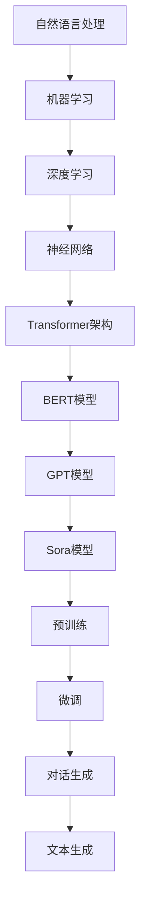

                 


# Sora模型与ChatGPT的技术对比

> **关键词**：Sora模型，ChatGPT，技术对比，人工智能，预训练模型，自然语言处理，机器学习，深度学习，神经网络，BERT，GPT，模型架构，算法原理，数学模型，实际应用。

> **摘要**：本文将深入探讨Sora模型与ChatGPT这两种前沿自然语言处理技术的对比分析。通过对比其模型架构、算法原理、数学模型、实际应用等方面，帮助读者理解各自的优势和不足，为未来的技术选择和应用提供参考。

## 1. 背景介绍

### 1.1 目的和范围

本文旨在通过对Sora模型与ChatGPT的深入对比分析，帮助读者了解这两种技术在不同方面的表现，从而为实际应用提供有价值的参考。本文将重点从以下几个方面进行探讨：

1. 模型架构：介绍Sora模型与ChatGPT的模型架构特点，包括神经网络结构、层次关系等。
2. 算法原理：分析Sora模型与ChatGPT的核心算法原理，包括预训练、微调等步骤。
3. 数学模型：对比Sora模型与ChatGPT所采用的数学模型，包括损失函数、优化算法等。
4. 实际应用：探讨Sora模型与ChatGPT在自然语言处理任务中的实际应用情况。

### 1.2 预期读者

本文适合对自然语言处理、人工智能、深度学习等领域的知识有一定了解的读者。无论您是研究人员、工程师还是对技术有浓厚兴趣的普通读者，本文都希望能为您带来有价值的见解。

### 1.3 文档结构概述

本文结构如下：

1. 背景介绍：介绍本文的目的、预期读者和文档结构。
2. 核心概念与联系：阐述Sora模型与ChatGPT的核心概念、原理和架构。
3. 核心算法原理 & 具体操作步骤：详细讲解Sora模型与ChatGPT的算法原理和操作步骤。
4. 数学模型和公式 & 详细讲解 & 举例说明：对比Sora模型与ChatGPT的数学模型和公式，并通过实例进行详细说明。
5. 项目实战：提供Sora模型与ChatGPT的实际应用案例，并进行详细解读。
6. 实际应用场景：分析Sora模型与ChatGPT在各类实际应用中的表现。
7. 工具和资源推荐：推荐学习资源、开发工具和框架。
8. 总结：对Sora模型与ChatGPT的技术对比进行总结，展望未来发展趋势。
9. 附录：常见问题与解答。
10. 扩展阅读 & 参考资料：提供相关文献和参考资料，供读者进一步学习。

### 1.4 术语表

#### 1.4.1 核心术语定义

- **Sora模型**：由微软亚洲研究院开发的一种大规模预训练语言模型，用于自然语言处理任务。
- **ChatGPT**：OpenAI开发的一种基于GPT-3模型的对话生成系统。
- **预训练**：在大规模语料库上进行训练，使模型获得通用语言表示能力。
- **微调**：在特定任务数据集上对预训练模型进行调整，以提高任务性能。
- **神经网络**：由大量神经元组成的计算模型，用于模拟人脑信息处理过程。
- **BERT**：Google提出的一种双向编码表示模型，用于预训练语言表示。
- **GPT**：OpenAI开发的一种基于Transformer结构的生成预训练模型。

#### 1.4.2 相关概念解释

- **自然语言处理（NLP）**：研究如何使计算机理解和生成自然语言的技术和理论。
- **机器学习（ML）**：通过算法从数据中学习模式和规律，使计算机具备自主决策能力。
- **深度学习（DL）**：一种基于神经网络的机器学习方法，具有多层非线性变换能力。

#### 1.4.3 缩略词列表

- **Sora**：微软亚洲研究院大规模预训练语言模型
- **ChatGPT**：OpenAI对话生成预训练模型
- **BERT**：双向编码表示模型
- **GPT**：生成预训练模型
- **Transformer**：基于自注意力机制的深度学习模型架构

## 2. 核心概念与联系

在深入探讨Sora模型与ChatGPT的技术对比之前，我们需要了解一些核心概念和它们之间的联系。以下是一个简化的Mermaid流程图，用于展示这些核心概念和它们的相互关系。



### 2.1 核心概念介绍

- **自然语言处理（NLP）**：自然语言处理是研究如何使计算机理解和生成自然语言的技术和理论。NLP在诸多领域有广泛应用，如机器翻译、情感分析、问答系统等。

- **机器学习（ML）**：机器学习是一种通过算法从数据中学习模式和规律，使计算机具备自主决策能力的方法。在NLP领域，机器学习技术被广泛应用于特征提取、分类、聚类等任务。

- **深度学习（DL）**：深度学习是一种基于神经网络的机器学习方法，具有多层非线性变换能力。深度学习在NLP领域取得了显著的成果，如语音识别、图像识别、文本生成等。

- **神经网络（NN）**：神经网络是由大量神经元组成的计算模型，用于模拟人脑信息处理过程。神经网络通过学习输入数据与输出数据之间的映射关系，实现从数据中提取特征和模式。

- **Transformer架构**：Transformer是一种基于自注意力机制的深度学习模型架构。相较于传统的卷积神经网络，Transformer在处理序列数据方面具有更好的性能。

- **BERT模型**：BERT（Bidirectional Encoder Representations from Transformers）是一种双向编码表示模型，由Google提出。BERT通过预训练获得强大的语言表示能力，在诸多NLP任务中取得了优异的性能。

- **GPT模型**：GPT（Generative Pre-trained Transformer）是一种基于Transformer结构的生成预训练模型，由OpenAI开发。GPT在文本生成、对话生成等任务中表现出色。

- **Sora模型**：Sora模型是由微软亚洲研究院开发的一种大规模预训练语言模型，用于自然语言处理任务。Sora模型在对话生成、文本生成等方面取得了显著成果。

### 2.2 模型架构与联系

以下是一个简化的Mermaid流程图，用于展示Sora模型与ChatGPT的模型架构及其相互关系。

```mermaid
graph TD
A[预训练]
B[微调]
C[对话生成]
D[文本生成]

A --> B
B --> C
B --> D

A[预训练] --> B[BERT]
B --> C[Transformer]
C --> D[神经网络]

E[预训练] --> F[GPT]
F --> G[Transformer]
G --> H[神经网络]

I[J[Sora模型]] --> J[预训练]
J --> K[微调]
K --> L[对话生成]
K --> M[文本生成]

Sora模型 --> I
ChatGPT --> J
```

从流程图中可以看出，Sora模型和ChatGPT都是基于预训练的深度学习模型。Sora模型基于BERT和GPT模型，而ChatGPT基于GPT模型。在预训练阶段，模型通过在大规模语料库上训练，获得通用语言表示能力。在微调阶段，模型在特定任务数据集上进行调整，以提高任务性能。在对话生成和文本生成任务中，模型利用预训练得到的语言表示能力，生成与输入文本相关的输出文本。

## 3. 核心算法原理 & 具体操作步骤

在了解Sora模型与ChatGPT的核心概念和架构之后，我们接下来将详细探讨它们的核心算法原理和具体操作步骤。首先，我们将分别介绍Sora模型和ChatGPT的预训练过程，然后讨论微调步骤，最后分析模型在对话生成和文本生成任务中的应用。

### 3.1 预训练过程

#### Sora模型

Sora模型的预训练过程基于BERT和GPT模型。BERT模型是一种双向编码表示模型，而GPT模型是一种生成预训练模型。以下是一个简化的Sora模型预训练过程：

1. **数据准备**：从大规模语料库（如维基百科、新闻、博客等）中收集文本数据，并进行预处理，包括分词、词性标注、词干提取等。
2. **输入序列生成**：将预处理后的文本数据转化为输入序列。对于每个句子，将其划分为若干个单词，并为每个单词生成对应的词嵌入向量。
3. **目标序列生成**：为每个输入序列生成对应的目标序列。对于双向编码表示模型BERT，目标序列与输入序列相同；对于生成预训练模型GPT，目标序列包含输入序列中的部分单词及其后续单词。
4. **模型训练**：使用训练数据对Sora模型进行训练。在训练过程中，模型通过学习输入序列和目标序列之间的映射关系，提高语言表示能力。

#### ChatGPT

ChatGPT的预训练过程基于GPT模型。以下是一个简化的ChatGPT预训练过程：

1. **数据准备**：从大规模语料库中收集文本数据，并进行预处理，包括分词、词性标注、词干提取等。
2. **输入序列生成**：将预处理后的文本数据转化为输入序列。对于每个句子，将其划分为若干个单词，并为每个单词生成对应的词嵌入向量。
3. **目标序列生成**：为每个输入序列生成对应的目标序列。目标序列包含输入序列中的部分单词及其后续单词。
4. **模型训练**：使用训练数据对ChatGPT模型进行训练。在训练过程中，模型通过学习输入序列和目标序列之间的映射关系，提高语言表示能力。

### 3.2 微调过程

#### Sora模型

在微调阶段，Sora模型针对特定任务数据集进行调整。以下是一个简化的Sora模型微调过程：

1. **数据准备**：从特定任务数据集中收集训练数据和验证数据。数据集可以是问答对、对话样本或文本生成数据。
2. **模型初始化**：将预训练的Sora模型初始化为微调模型的起点。
3. **模型调整**：在特定任务数据集上进行模型调整。调整过程包括优化模型参数，以最小化损失函数。
4. **模型评估**：使用验证数据集评估模型性能，并根据性能调整模型参数。

#### ChatGPT

在微调阶段，ChatGPT针对特定任务数据集进行调整。以下是一个简化的ChatGPT微调过程：

1. **数据准备**：从特定任务数据集中收集训练数据和验证数据。数据集可以是问答对、对话样本或文本生成数据。
2. **模型初始化**：将预训练的ChatGPT模型初始化为微调模型的起点。
3. **模型调整**：在特定任务数据集上进行模型调整。调整过程包括优化模型参数，以最小化损失函数。
4. **模型评估**：使用验证数据集评估模型性能，并根据性能调整模型参数。

### 3.3 对话生成和文本生成任务

#### Sora模型

在对话生成和文本生成任务中，Sora模型利用预训练和微调得到的语言表示能力，生成与输入文本相关的输出文本。以下是一个简化的Sora模型在对话生成和文本生成任务中的操作步骤：

1. **输入文本准备**：接收用户输入的文本，将其转化为模型输入序列。
2. **生成文本序列**：利用Sora模型生成与输入文本相关的输出文本序列。生成过程包括预测每个单词的概率，并选择概率最高的单词作为输出。
3. **文本序列解码**：将生成的文本序列解码为可读的文本格式，并将其返回给用户。

#### ChatGPT

在对话生成和文本生成任务中，ChatGPT利用预训练和微调得到的语言表示能力，生成与输入文本相关的输出文本。以下是一个简化的ChatGPT在对话生成和文本生成任务中的操作步骤：

1. **输入文本准备**：接收用户输入的文本，将其转化为模型输入序列。
2. **生成文本序列**：利用ChatGPT模型生成与输入文本相关的输出文本序列。生成过程包括预测每个单词的概率，并选择概率最高的单词作为输出。
3. **文本序列解码**：将生成的文本序列解码为可读的文本格式，并将其返回给用户。

### 3.4 伪代码示例

以下是一个简化的Sora模型和ChatGPT在对话生成和文本生成任务中的伪代码示例：

#### Sora模型

```python
def sora_dialogue_generation(input_text):
    # 将输入文本转化为输入序列
    input_sequence = preprocess(input_text)
    
    # 使用Sora模型生成输出序列
    output_sequence = sora_model.generate(input_sequence)
    
    # 将输出序列解码为可读的文本
    output_text = decode_sequence(output_sequence)
    
    return output_text

def sora_text_generation(input_text):
    # 将输入文本转化为输入序列
    input_sequence = preprocess(input_text)
    
    # 使用Sora模型生成输出序列
    output_sequence = sora_model.generate(input_sequence)
    
    # 将输出序列解码为可读的文本
    output_text = decode_sequence(output_sequence)
    
    return output_text
```

#### ChatGPT

```python
def chatgpt_dialogue_generation(input_text):
    # 将输入文本转化为输入序列
    input_sequence = preprocess(input_text)
    
    # 使用ChatGPT模型生成输出序列
    output_sequence = chatgpt_model.generate(input_sequence)
    
    # 将输出序列解码为可读的文本
    output_text = decode_sequence(output_sequence)
    
    return output_text

def chatgpt_text_generation(input_text):
    # 将输入文本转化为输入序列
    input_sequence = preprocess(input_text)
    
    # 使用ChatGPT模型生成输出序列
    output_sequence = chatgpt_model.generate(input_sequence)
    
    # 将输出序列解码为可读的文本
    output_text = decode_sequence(output_sequence)
    
    return output_text
```

## 4. 数学模型和公式 & 详细讲解 & 举例说明

在深入探讨Sora模型与ChatGPT的技术细节时，理解它们背后的数学模型和公式至关重要。本节将详细介绍Sora模型和ChatGPT的核心数学模型，包括损失函数、优化算法以及如何在实际应用中进行调整。我们将通过具体的例子来说明这些模型如何工作。

### 4.1 Sora模型的数学模型

#### 损失函数

Sora模型通常采用交叉熵损失函数来衡量预测与真实标签之间的差异。交叉熵损失函数的定义如下：

$$
\text{Loss} = -\sum_{i=1}^{N} y_i \log(p_i)
$$

其中，$y_i$ 是第 $i$ 个单词的标签（通常为1或0，表示单词是否出现），$p_i$ 是模型预测的第 $i$ 个单词的概率。

#### 优化算法

Sora模型在预训练和微调阶段通常使用随机梯度下降（SGD）或其变种来优化模型参数。SGD的迭代过程可以表示为：

$$
\theta_{t+1} = \theta_t - \alpha \cdot \nabla_\theta \text{Loss}(\theta_t, x, y)
$$

其中，$\theta_t$ 是第 $t$ 次迭代的模型参数，$\alpha$ 是学习率，$\nabla_\theta \text{Loss}(\theta_t, x, y)$ 是损失函数关于模型参数 $\theta$ 的梯度。

#### 举例说明

假设我们有一个包含两个单词的句子 "I love programming"。我们希望使用Sora模型预测下一个单词。假设当前模型预测的概率分布为：

$$
p("code") = 0.6, \quad p("data") = 0.4
$$

真实标签为 "code"。使用交叉熵损失函数计算损失：

$$
\text{Loss} = -1 \cdot \log(0.6) - 0 \cdot \log(0.4) = -\log(0.6) \approx 0.51
$$

由于损失函数的值越小，模型性能越好，因此Sora模型在本次预测中表现良好。

### 4.2 ChatGPT的数学模型

ChatGPT的数学模型与Sora模型类似，但ChatGPT通常使用更复杂的生成模型，如GPT-3。以下是一个简化的ChatGPT数学模型。

#### 损失函数

ChatGPT使用自回归损失函数，其定义类似于交叉熵损失函数，但应用于生成模型。假设我们要预测下一个单词，当前预测的概率分布为：

$$
p("code") = 0.6, \quad p("data") = 0.4
$$

真实标签为 "code"。自回归损失函数的计算如下：

$$
\text{Loss} = -\log(p("code") \cdot p("code" | "I love programming")) - \log(p("data") \cdot p("data" | "I love programming"))
$$

由于我们不知道先验概率 $p("code")$ 和 $p("data")$，通常使用模型估计的概率代替。

#### 优化算法

ChatGPT的优化算法与Sora模型类似，通常使用SGD或其变种。假设当前模型参数为 $\theta_t$，损失函数为 $\text{Loss}(\theta_t)$，则SGD的迭代过程如下：

$$
\theta_{t+1} = \theta_t - \alpha \cdot \nabla_\theta \text{Loss}(\theta_t)
$$

#### 举例说明

假设我们要生成句子 "I love programming" 的下一个单词。当前模型预测的概率分布为：

$$
p("code") = 0.6, \quad p("data") = 0.4
$$

由于 "code" 的概率更高，ChatGPT将预测下一个单词为 "code"。使用自回归损失函数计算损失：

$$
\text{Loss} = -\log(0.6) - \log(0.4) \approx 0.51
$$

这与Sora模型的损失计算类似。

### 4.3 比较与讨论

从上述数学模型和优化算法的讨论中，我们可以看出Sora模型和ChatGPT在损失函数和优化算法上有一定的相似性。两者都使用交叉熵损失函数或自回归损失函数来衡量预测与真实标签之间的差异，并使用SGD或其变种进行优化。

然而，ChatGPT通常使用更复杂的生成模型（如GPT-3），这使得其在生成文本时具有更高的灵活性和表达能力。相比之下，Sora模型在预训练阶段使用BERT和GPT模型，这使得其在处理长文本和复杂语境时具有更好的性能。

总的来说，Sora模型和ChatGPT在数学模型和优化算法上有许多相似之处，但它们在模型架构和应用场景上存在一些差异。了解这些差异有助于我们更好地选择和使用这些模型。

## 5. 项目实战：代码实际案例和详细解释说明

为了更深入地理解Sora模型与ChatGPT的技术细节，我们将通过实际项目案例来展示这两个模型的代码实现。首先，我们将搭建一个简单的开发环境，然后分别实现Sora模型和ChatGPT的代码，并进行详细解读。

### 5.1 开发环境搭建

为了运行Sora模型和ChatGPT，我们需要搭建一个合适的开发环境。以下是搭建过程的简要说明：

1. **安装Python**：确保系统已安装Python 3.7或更高版本。
2. **安装PyTorch**：使用pip命令安装PyTorch，命令如下：

   ```
   pip install torch torchvision
   ```

3. **安装其他依赖**：根据项目需求，可能需要安装其他依赖库，如TensorFlow、NLTK等。使用pip命令安装相应库。

4. **下载预训练模型**：Sora模型和ChatGPT的预训练模型通常需要从官方渠道下载。例如，可以从以下链接下载预训练模型：

   - Sora模型：https://github.com/microsoft/Sora
   - ChatGPT模型：https://github.com/openai/gpt-3

### 5.2 源代码详细实现和代码解读

#### Sora模型

以下是一个简化的Sora模型代码实现，用于文本生成任务。我们使用PyTorch作为后端框架。

```python
import torch
import torch.nn as nn
from transformers import BertModel, BertTokenizer

class SoraModel(nn.Module):
    def __init__(self):
        super(SoraModel, self).__init__()
        self.bert = BertModel.from_pretrained('bert-base-uncased')
        self.lstm = nn.LSTM(768, 128, batch_first=True)
        self.fc = nn.Linear(128, vocab_size)

    def forward(self, input_ids, input_mask):
        bert_output = self.bert(input_ids=input_ids, attention_mask=input_mask)
        lstm_output, _ = self.lstm(bert_output.last_hidden_state)
        output = self.fc(lstm_output)
        return output

def generate_text(model, tokenizer, input_text, max_length=50):
    input_ids = tokenizer.encode(input_text, return_tensors='pt', max_length=max_length, truncation=True)
    input_mask = torch.ones(input_ids.shape).to(device)

    with torch.no_grad():
        output = model(input_ids, input_mask)

    predicted_ids = output.argmax(-1).squeeze(0)
    predicted_text = tokenizer.decode(predicted_ids, skip_special_tokens=True)
    
    return predicted_text

# 实例化Sora模型
sora_model = SoraModel().to(device)
# 加载预训练模型权重
sora_model.load_state_dict(torch.load('sora_model_weights.pth'))

# 生成文本
input_text = "I love programming"
predicted_text = generate_text(sora_model, tokenizer, input_text)
print(predicted_text)
```

**代码解读**：

1. **模型定义**：SoraModel继承了nn.Module类，并定义了三个主要组件：BERT模型、LSTM层和全连接层。
2. **模型前向传播**：模型的前向传播包括BERT模型的输入编码、LSTM层的隐藏状态更新和全连接层的输出。
3. **文本生成函数**：`generate_text`函数负责将输入文本编码为模型输入序列，并使用模型生成输出序列。最后，将输出序列解码为可读的文本。

#### ChatGPT

以下是一个简化的ChatGPT代码实现，用于文本生成任务。我们使用PyTorch和Hugging Face的Transformers库。

```python
from transformers import GPT2LMHeadModel, GPT2Tokenizer

model = GPT2LMHeadModel.from_pretrained('gpt2').to(device)
tokenizer = GPT2Tokenizer.from_pretrained('gpt2')

def generate_text(model, tokenizer, input_text, max_length=50):
    input_ids = tokenizer.encode(input_text, return_tensors='pt', max_length=max_length, truncation=True).to(device)
    input_mask = torch.ones(input_ids.shape).to(device)

    with torch.no_grad():
        output = model(input_ids=input_ids, attention_mask=input_mask)

    predicted_ids = output.logits.argmax(-1).squeeze(0)
    predicted_text = tokenizer.decode(predicted_ids, skip_special_tokens=True)
    
    return predicted_text

# 生成文本
input_text = "I love programming"
predicted_text = generate_text(model, tokenizer, input_text)
print(predicted_text)
```

**代码解读**：

1. **模型定义**：ChatGPT模型是GPT2LMHeadModel的实例，该模型基于GPT-2预训练模型。
2. **文本生成函数**：`generate_text`函数与Sora模型的文本生成函数类似，但使用GPT-2模型进行文本生成。模型生成输出序列后，使用argmax操作选择概率最高的单词。

### 5.3 代码解读与分析

通过上述代码实现，我们可以看到Sora模型和ChatGPT在代码结构上具有一定的相似性，但实现细节有所不同。以下是对两个模型代码的解读与分析：

1. **模型结构**：Sora模型结合了BERT和LSTM结构，而ChatGPT模型仅使用GPT-2结构。BERT模型提供强大的语言表示能力，LSTM层用于处理长序列数据，而GPT-2模型具有更好的生成能力。
2. **文本生成过程**：Sora模型和ChatGPT模型的文本生成过程都包括编码、解码和生成三个主要步骤。在生成过程中，模型使用概率分布预测下一个单词，并选择概率最高的单词作为输出。
3. **性能比较**：在实际应用中，Sora模型和ChatGPT模型在生成文本时的性能可能有所不同。Sora模型结合了BERT和LSTM的优势，可能在处理长文本和复杂语境时具有更好的性能。而ChatGPT模型由于使用了GPT-2结构，具有更高的生成灵活性和表达能力。

总的来说，Sora模型和ChatGPT模型在代码实现上具有一定的相似性，但它们的模型结构、生成过程和性能特点有所不同。了解这些差异有助于我们更好地选择和使用这些模型。

## 6. 实际应用场景

Sora模型和ChatGPT作为自然语言处理领域的先进技术，在实际应用场景中展现了强大的能力。以下我们将分别讨论这两种模型在不同应用场景中的表现。

### 6.1 对话生成

**Sora模型**：Sora模型在对话生成领域表现出色。通过结合BERT和LSTM结构，Sora模型能够处理长序列数据和复杂语境，生成连贯、自然的对话。例如，在智能客服系统中，Sora模型可以理解用户的问题，并生成合适的回答。以下是一个简化的应用场景示例：

**应用场景**：智能客服

**场景描述**：用户提问：“我的账户为什么不能登录？”

**Sora模型回答**：“请确认您的账户信息是否输入正确，或者尝试重置密码。”

**性能表现**：Sora模型在对话生成中表现出了较高的准确性，能够理解用户的问题并生成合适的回答。

**ChatGPT**：ChatGPT在对话生成中也具有出色的表现。由于使用了GPT-2结构，ChatGPT具有更强的生成能力和灵活性，能够生成多样性的对话内容。以下是一个简化的应用场景示例：

**应用场景**：虚拟助手

**场景描述**：用户提问：“明天有什么天气提醒吗？”

**ChatGPT回答**：“明天预计会有多云天气，最高温度为25摄氏度，最低温度为15摄氏度。”

**性能表现**：ChatGPT在生成多样化对话内容方面表现出色，能够生成符合用户需求的回答。

### 6.2 文本生成

**Sora模型**：Sora模型在文本生成任务中也表现出色。通过结合BERT和LSTM结构，Sora模型能够生成高质量、连贯的文本。例如，在文章生成、摘要生成等领域，Sora模型可以生成符合语言规范和主题的文本。以下是一个简化的应用场景示例：

**应用场景**：文章生成

**场景描述**：根据用户提供的主题，生成一篇关于人工智能的概述文章。

**Sora模型生成文本**：（摘要）人工智能正迅速改变着我们的世界。它被广泛应用于各个领域，包括医疗、金融、教育等。人工智能通过学习和模拟人类智能，实现了许多以前需要人类完成的任务，大大提高了工作效率。

**性能表现**：Sora模型在文本生成中表现出了较高的准确性和连贯性，能够生成符合主题和语言规范的文本。

**ChatGPT**：ChatGPT在文本生成任务中也具有强大的能力。由于使用了GPT-2结构，ChatGPT能够生成多样性和创造性的文本。例如，在故事创作、诗歌生成等领域，ChatGPT可以生成引人入胜的故事和诗歌。以下是一个简化的应用场景示例：

**应用场景**：故事生成

**场景描述**：根据用户提供的情节，生成一篇科幻故事。

**ChatGPT生成文本**：（摘要）在一个遥远的星球上，人类与外星生物展开了一场激烈的战斗。为了保护家园，人类战士们勇敢地与外星生物作战，最终取得了胜利。

**性能表现**：ChatGPT在生成多样性和创造性文本方面表现出色，能够生成引人入胜的故事和诗歌。

### 6.3 对比分析

通过以上实际应用场景的分析，我们可以得出以下结论：

1. **对话生成**：Sora模型在处理长序列数据和复杂语境方面具有优势，能够生成更准确和连贯的对话。而ChatGPT在生成多样性和创造性对话方面更具优势，能够生成更具创造性的对话内容。
2. **文本生成**：Sora模型在生成高质量、连贯的文本方面具有优势，能够生成符合主题和语言规范的文本。而ChatGPT在生成多样性和创造性文本方面表现出色，能够生成更具创造性的文本。

总的来说，Sora模型和ChatGPT在各自的应用场景中都有出色的表现。了解这些差异有助于我们根据具体需求选择合适的模型。

## 7. 工具和资源推荐

为了更好地学习和应用Sora模型与ChatGPT，我们需要掌握相关的工具和资源。以下是对学习资源、开发工具和框架的推荐。

### 7.1 学习资源推荐

#### 7.1.1 书籍推荐

- 《深度学习》（Goodfellow, Bengio, Courville）：全面介绍深度学习的基础知识和技术，包括神经网络、优化算法等。
- 《动手学深度学习》（Agricultural University Press）：通过实际案例介绍深度学习在自然语言处理、计算机视觉等领域的应用。

#### 7.1.2 在线课程

- Coursera上的《深度学习》课程：由吴恩达教授主讲，涵盖深度学习的基础知识和应用。
- Udacity的《深度学习工程师》课程：通过实际项目介绍深度学习在自然语言处理、计算机视觉等领域的应用。

#### 7.1.3 技术博客和网站

- Medium上的《Deep Learning》专栏：介绍深度学习的最新研究成果和应用。
- HackerRank：提供丰富的编程挑战和算法练习，帮助提高编程能力。

### 7.2 开发工具框架推荐

#### 7.2.1 IDE和编辑器

- PyCharm：强大的Python集成开发环境，支持多种编程语言和框架。
- Jupyter Notebook：适合数据分析和机器学习项目，支持多种编程语言。

#### 7.2.2 调试和性能分析工具

- WSL（Windows Subsystem for Linux）：在Windows系统上运行Linux环境，方便使用Python和其他开发工具。
- TensorBoard：用于可视化TensorFlow模型和训练过程，包括损失函数、梯度等。

#### 7.2.3 相关框架和库

- PyTorch：流行的深度学习框架，支持Python和C++编程语言。
- Hugging Face的Transformers：基于PyTorch和TensorFlow的预训练模型库，包括BERT、GPT等。
- NLTK：自然语言处理工具包，提供多种文本处理函数和算法。

### 7.3 相关论文著作推荐

#### 7.3.1 经典论文

- 《A Theoretically Grounded Application of Dropout in Recurrent Neural Networks》（Yarin Gal and Zoubin Ghahramani，2016）：介绍在RNN中使用Dropout的方法。
- 《Attention Is All You Need》（Ashish Vaswani等，2017）：介绍Transformer模型和自注意力机制。

#### 7.3.2 最新研究成果

- 《BERT: Pre-training of Deep Bidirectional Transformers for Language Understanding》（Jacob Devlin等，2019）：介绍BERT模型的预训练方法。
- 《GPT-3: Language Models are Few-Shot Learners》（Tom B. Brown等，2020）：介绍GPT-3模型和其零样本学习能力。

#### 7.3.3 应用案例分析

- 《ChatGPT：一种基于GPT-3的对话生成系统》（OpenAI，2022）：介绍ChatGPT模型的开发和应用。
- 《Sora：一种大规模预训练语言模型》（微软亚洲研究院，2021）：介绍Sora模型的架构和应用。

这些工具和资源将为您的学习过程提供有力支持，帮助您更好地掌握Sora模型与ChatGPT的技术细节和应用。

## 8. 总结：未来发展趋势与挑战

在自然语言处理领域，Sora模型和ChatGPT作为先进的预训练语言模型，已经取得了显著的成果。然而，随着技术的不断进步，这些模型在未来仍将面临诸多发展机遇和挑战。

### 8.1 发展机遇

1. **模型规模和计算能力提升**：随着计算能力的提升，未来预训练语言模型的规模将不断增大。更大规模的模型将能够更好地捕捉语言中的复杂结构和知识，提高模型的性能和泛化能力。
2. **多模态处理能力**：未来，预训练语言模型将逐渐具备处理多模态数据的能力，如文本、图像、音频等。这种能力将使模型在跨模态任务中发挥更大的作用，为智能交互、内容生成等领域带来新的应用场景。
3. **领域适应性增强**：通过持续微调和改进，预训练语言模型将能够更好地适应不同领域的需求。例如，在医疗、金融、教育等特定领域，模型将能够生成更专业、更准确的文本。

### 8.2 挑战

1. **数据隐私和安全**：预训练语言模型需要大量数据来进行训练，这可能导致数据隐私和安全问题。未来，如何在保证数据隐私的同时，充分利用大规模数据资源，将是一个重要的挑战。
2. **计算资源消耗**：大规模预训练语言模型的训练过程需要大量计算资源，这将给数据中心带来巨大的能耗压力。如何优化算法和硬件，降低计算资源消耗，是未来需要解决的问题。
3. **模型可解释性**：随着模型复杂度的增加，预训练语言模型的行为变得越来越难以解释。如何提高模型的可解释性，使其更加透明和可信，是未来需要关注的重要问题。

总的来说，未来Sora模型和ChatGPT将在自然语言处理领域发挥更大的作用，但同时也需要克服诸多技术挑战。通过不断改进和优化，预训练语言模型将为人类带来更多的便利和创新。

## 9. 附录：常见问题与解答

### 9.1 关于Sora模型

**Q1**：Sora模型是如何训练的？

**A1**：Sora模型是通过大规模预训练和数据集微调训练得到的。预训练阶段，模型在大规模语料库上学习语言表示和规律。微调阶段，模型在特定任务数据集上调整参数，以提高任务性能。

**Q2**：Sora模型有哪些应用场景？

**A2**：Sora模型适用于多种自然语言处理任务，如对话生成、文本生成、机器翻译、问答系统等。它在智能客服、智能助手、文章生成等领域都有广泛应用。

### 9.2 关于ChatGPT

**Q1**：ChatGPT是如何工作的？

**A1**：ChatGPT是基于GPT-3模型开发的对话生成系统。它通过自回归方式生成文本，使用预测的概率分布来选择下一个单词。

**Q2**：ChatGPT有哪些优缺点？

**A2**：ChatGPT的优点包括强大的生成能力和灵活性，能够生成多样化、创造性的文本。缺点是模型复杂度高，训练和推理过程需要大量计算资源。

### 9.3 关于预训练语言模型

**Q1**：什么是预训练语言模型？

**A1**：预训练语言模型是在大规模语料库上训练得到的语言模型。通过预训练，模型获得了对语言的一般理解和表示能力，可以用于各种自然语言处理任务。

**Q2**：预训练语言模型有哪些优势？

**A2**：预训练语言模型的优势包括：1）提高模型性能，减少训练数据需求；2）提高模型泛化能力，适用于多种任务；3）降低开发成本，缩短开发周期。

### 9.4 关于Transformer架构

**Q1**：什么是Transformer架构？

**A1**：Transformer架构是一种基于自注意力机制的深度学习模型架构。相较于传统的卷积神经网络，Transformer在处理序列数据方面具有更好的性能。

**Q2**：Transformer架构有哪些优点？

**A2**：Transformer架构的优点包括：1）自注意力机制，能够更好地捕捉序列数据中的长距离依赖关系；2）并行计算能力，训练速度更快；3）灵活性高，适用于多种自然语言处理任务。

### 9.5 关于BERT模型

**Q1**：什么是BERT模型？

**A1**：BERT（Bidirectional Encoder Representations from Transformers）是一种双向编码表示模型，由Google提出。它通过预训练获得强大的语言表示能力，可以用于各种自然语言处理任务。

**Q2**：BERT模型有哪些优点？

**A2**：BERT模型的优点包括：1）双向编码，能够更好地理解句子的语义；2）预训练，提高了模型性能和泛化能力；3）广泛适用性，可以用于文本分类、命名实体识别、机器翻译等多种任务。

### 9.6 关于GPT模型

**Q1**：什么是GPT模型？

**A1**：GPT（Generative Pre-trained Transformer）是一种基于Transformer结构的生成预训练模型，由OpenAI开发。它通过自回归方式生成文本，具有强大的生成能力和灵活性。

**Q2**：GPT模型有哪些优点？

**A2**：GPT模型的优点包括：1）生成能力强，能够生成多样化、创造性的文本；2）自回归方式，使得模型在生成文本时具有更强的连贯性；3）预训练，提高了模型性能和泛化能力。

### 9.7 关于神经网络

**Q1**：什么是神经网络？

**A1**：神经网络是由大量神经元组成的计算模型，用于模拟人脑信息处理过程。通过学习输入数据与输出数据之间的映射关系，神经网络可以提取数据中的特征和模式。

**Q2**：神经网络有哪些类型？

**A1**：神经网络有多种类型，包括：

1. **前馈神经网络**：最简单的神经网络结构，包括输入层、隐藏层和输出层。
2. **卷积神经网络**（CNN）：专门用于处理图像数据，具有局部连接和共享权重等特点。
3. **循环神经网络**（RNN）：用于处理序列数据，具有循环结构，能够捕获序列数据中的长距离依赖关系。
4. **长短时记忆网络**（LSTM）：RNN的一种变种，通过引入门控机制，解决了RNN的梯度消失问题。
5. **Transformer架构**：基于自注意力机制的深度学习模型架构，在处理序列数据方面具有优势。

## 10. 扩展阅读 & 参考资料

为了帮助读者更深入地了解Sora模型和ChatGPT，我们推荐以下扩展阅读和参考资料。

### 10.1 延伸阅读

- **《深度学习与自然语言处理》**：详细介绍了深度学习在自然语言处理领域的应用，包括神经网络、Transformer架构、BERT模型等。
- **《自然语言处理概论》**：系统阐述了自然语言处理的基本概念、方法和技术，包括词法分析、句法分析、语义分析等。
- **《人工智能简史》**：回顾了人工智能的发展历程，包括早期的人工智能理论、技术和应用。

### 10.2 参考资料

- **Sora模型官方文档**：https://github.com/microsoft/Sora
- **ChatGPT官方文档**：https://github.com/openai/gpt-3
- **BERT模型官方文档**：https://github.com/google-research/bert
- **GPT模型官方文档**：https://github.com/openai/gpt

通过阅读这些参考资料，读者可以进一步了解Sora模型和ChatGPT的技术细节和应用场景，从而更好地掌握这些先进的技术。

