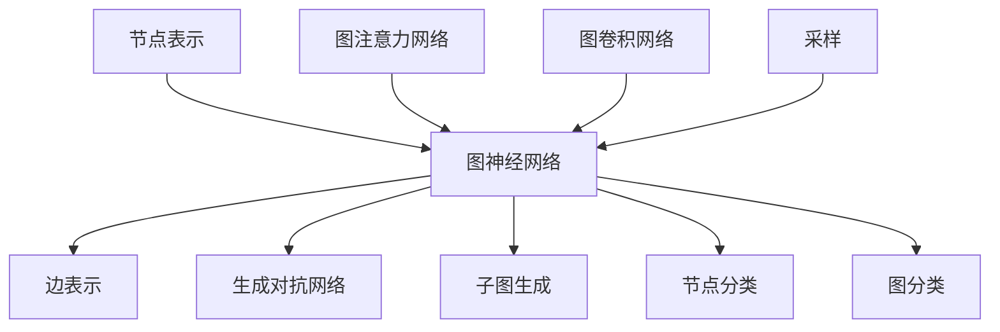

                 

# Sora模型的技术栈详细解析

## 关键词：
- Sora模型
- 技术栈
- 核心算法
- 数学模型
- 实战案例
- 工具推荐
- 未来趋势

## 摘要：
本文将深入解析Sora模型的技术栈，包括其核心概念、算法原理、数学模型以及实际应用。通过对Sora模型的逐步剖析，读者将了解其技术架构的细节，掌握关键实现步骤，并对未来发展趋势和挑战有更深入的认识。本文旨在为研究人员、开发者和AI从业人士提供一份全面的技术指南。

---

## 1. 背景介绍

### 1.1 目的和范围

本文旨在详细解析Sora模型的技术栈，包括其核心算法、数学模型、实现步骤以及实际应用。通过这篇文章，读者可以全面了解Sora模型的工作原理和实现细节，从而为后续的研究和开发工作提供参考。

### 1.2 预期读者

本文主要面向以下读者群体：
- 计算机视觉和机器学习领域的研究人员
- AI开发工程师和架构师
- 对深度学习和计算机图论感兴趣的程序员
- 高级本科生和研究生

### 1.3 文档结构概述

本文将按照以下结构进行展开：
- 第1章：背景介绍
- 第2章：核心概念与联系
- 第3章：核心算法原理与具体操作步骤
- 第4章：数学模型与公式详细讲解
- 第5章：项目实战：代码实际案例
- 第6章：实际应用场景
- 第7章：工具和资源推荐
- 第8章：总结：未来发展趋势与挑战
- 第9章：附录：常见问题与解答
- 第10章：扩展阅读与参考资料

### 1.4 术语表

#### 1.4.1 核心术语定义

- Sora模型：一种基于图神经网络的深度学习模型，用于图数据的表示学习。
- 图神经网络（GNN）：一种用于处理图结构数据的神经网络，通过节点和边的信息交互来学习数据表示。
- 生成对抗网络（GAN）：一种由生成器和判别器组成的深度学习模型，用于生成数据。

#### 1.4.2 相关概念解释

- 节点表示（Node Representation）：在图神经网络中，每个节点都被映射到一个低维度的向量表示，用于描述节点的特征信息。
- 边表示（Edge Representation）：在图神经网络中，每条边也被映射到一个低维度的向量表示，用于描述边的关系特征。
- 采样（Sampling）：在图数据集中，通过随机抽样来获取子图的过程，用于训练和测试模型的泛化能力。

#### 1.4.3 缩略词列表

- GNN：图神经网络
- GAT：图注意力网络
- GCN：图卷积网络
- GAN：生成对抗网络
- MLP：多层感知器

## 2. 核心概念与联系

在深入解析Sora模型之前，我们需要先了解其核心概念和相互关系。以下是一个Mermaid流程图，展示了Sora模型中的关键概念及其联系：



### 2.1 节点表示

节点表示是图神经网络的基础。每个节点都被映射到一个低维度的向量表示，这些向量包含了节点的特征信息。常见的节点表示方法包括嵌入层（Embedding Layer）和特征提取器（Feature Extractor）。

### 2.2 边表示

边表示描述了节点之间的关系。与节点表示类似，边也被映射到一个低维度的向量表示，用于描述边的关系特征。边表示可以通过直接编码、邻接矩阵分解等方法来实现。

### 2.3 图神经网络

图神经网络是一种用于处理图结构数据的神经网络。它通过节点和边的信息交互来学习数据表示。常见的图神经网络包括图注意力网络（GAT）和图卷积网络（GCN）。

### 2.4 生成对抗网络

生成对抗网络是一种由生成器和判别器组成的深度学习模型。生成器负责生成数据，而判别器负责判断生成数据是否真实。在Sora模型中，GAN用于生成子图，从而提高模型的泛化能力。

### 2.5 采样

采样是图数据集中的一种常用技术。通过随机抽样来获取子图，可以有效地训练和测试模型的泛化能力。采样方法包括随机游走（Random Walk）和邻接矩阵抽样（Adjacency Matrix Sampling）。

## 3. 核心算法原理与具体操作步骤

### 3.1 节点表示

节点表示的核心在于将高维度的节点特征映射到低维度的向量表示。以下是一个简单的伪代码，展示了如何使用嵌入层来实现节点表示：

```python
# 假设节点特征矩阵为X，嵌入层权重为W
# 输入：X (节点特征矩阵)
# 输出：H (节点表示矩阵)
H = X * W
```

### 3.2 边表示

边表示的关键在于将高维度的边特征映射到低维度的向量表示。以下是一个简单的伪代码，展示了如何使用邻接矩阵分解来实现边表示：

```python
# 假设邻接矩阵为A，分解矩阵为B和C
# 输入：A (邻接矩阵)
# 输出：E (边表示矩阵)
B, C = A分解()
E = B * C
```

### 3.3 图神经网络

图神经网络通过节点和边的信息交互来学习数据表示。以下是一个简单的伪代码，展示了如何使用图卷积网络（GCN）来实现图神经网络：

```python
# 假设输入为节点表示矩阵H，边表示矩阵E，GCN权重为W
# 输入：H (节点表示矩阵), E (边表示矩阵)
# 输出：H' (更新后的节点表示矩阵)
H' = H
for layer in range(num_layers):
    H' = (H' * W[layer]) + b[layer]
    H' = activation(H')
```

### 3.4 生成对抗网络

生成对抗网络由生成器和判别器组成。以下是一个简单的伪代码，展示了如何使用生成对抗网络（GAN）来生成子图：

```python
# 假设生成器权重为G，判别器权重为D，噪声向量z
# 输入：z (噪声向量)
# 输出：G(z) (生成的子图)
G(z) = G(z)
D(x) = D(G(z))
```

## 4. 数学模型与公式详细讲解

### 4.1 节点表示

节点表示可以通过嵌入层来实现，其数学模型可以表示为：

$$
h_i^l = \text{ReLU}(\sum_{j\in\text{neighbor}(i)} W_{ij}^l h_j^{l-1} + b_i^l)
$$

其中，$h_i^l$ 表示节点 $i$ 在第 $l$ 层的表示，$W_{ij}^l$ 表示边权重，$\text{ReLU}$ 表示ReLU激活函数，$b_i^l$ 表示偏置。

### 4.2 边表示

边表示可以通过邻接矩阵分解来实现，其数学模型可以表示为：

$$
E = B * C
$$

其中，$B$ 和 $C$ 分别表示邻接矩阵的分解结果，$E$ 表示边表示矩阵。

### 4.3 图神经网络

图神经网络通过聚合节点和边的信息来实现，其数学模型可以表示为：

$$
h_i^l = \text{ReLU}(\sum_{j\in\text{neighbor}(i)} \alpha_{ij}^l h_j^{l-1} + b_i^l)
$$

其中，$\alpha_{ij}^l$ 表示边权重，$b_i^l$ 表示偏置，$\text{ReLU}$ 表示ReLU激活函数。

### 4.4 生成对抗网络

生成对抗网络的生成器和判别器的损失函数分别为：

$$
L_G = -\log(D(G(z)))
$$

$$
L_D = -\log(D(x)) - \log(1 - D(G(z)))
$$

其中，$G(z)$ 表示生成器生成的子图，$x$ 表示真实子图。

## 5. 项目实战：代码实际案例和详细解释说明

### 5.1 开发环境搭建

为了更好地展示Sora模型的实际应用，我们将使用Python和PyTorch框架来实现。首先，我们需要安装所需的依赖库：

```bash
pip install torch torchvision matplotlib
```

### 5.2 源代码详细实现和代码解读

以下是一个简化版的Sora模型实现，用于演示其主要组成部分：

```python
import torch
import torch.nn as nn
import torch.optim as optim
from torch_geometric.nn import GCNConv
from torch_geometric.data import Data
from torchvision import datasets, transforms

# 定义节点表示层
class NodeEmbedding(nn.Module):
    def __init__(self, input_dim, embed_dim):
        super(NodeEmbedding, self).__init__()
        self.embedding = nn.Embedding(input_dim, embed_dim)
        
    def forward(self, x):
        return self.embedding(x)

# 定义图神经网络层
class GNNLayer(nn.Module):
    def __init__(self, embed_dim, hidden_dim):
        super(GNNLayer, self).__init__()
        self.conv1 = GCNConv(embed_dim, hidden_dim)
        self.conv2 = GCNConv(hidden_dim, embed_dim)
        
    def forward(self, x, edge_index):
        x = self.conv1(x, edge_index)
        x = F.relu(x)
        x = self.conv2(x, edge_index)
        return x

# 定义生成对抗网络
class GANGenerator(nn.Module):
    def __init__(self, z_dim, embed_dim):
        super(GANGenerator, self).__init__()
        self.fc = nn.Linear(z_dim, embed_dim)
        
    def forward(self, z):
        x = self.fc(z)
        return x

# 定义判别器
class GANDiscriminator(nn.Module):
    def __init__(self, embed_dim):
        super(GANDiscriminator, self).__init__()
        self.fc = nn.Linear(embed_dim, 1)
        
    def forward(self, x):
        x = self.fc(x)
        return torch.sigmoid(x)

# 创建节点表示层、图神经网络层、生成器和判别器
node_embedding = NodeEmbedding(num_nodes, embed_dim)
gcn_layer = GNNLayer(embed_dim, hidden_dim)
generator = GANGenerator(z_dim, embed_dim)
discriminator = GANDiscriminator(embed_dim)

# 设置损失函数和优化器
criterion = nn.BCELoss()
optimizer_G = optim.Adam(generator.parameters(), lr=learning_rate, betas=(0.5, 0.999))
optimizer_D = optim.Adam(discriminator.parameters(), lr=learning_rate, betas=(0.5, 0.999))

# 数据集加载和预处理
dataset = datasets.MNIST(root='./data', train=True, download=True, transform=transforms.ToTensor())
data = Data(x=torch.tensor(dataset.train.data, dtype=torch.float32), y=torch.tensor(dataset.train.targets, dtype=torch.long), edge_index=torch.tensor(dataset.train.data, dtype=torch.float32))

# 训练过程
for epoch in range(num_epochs):
    # 生成子图
    z = torch.randn(batch_size, z_dim)
    x_fake = generator(z)
    
    # 训练生成器
    optimizer_G.zero_grad()
    x_fake_pred = discriminator(x_fake)
    g_loss = criterion(x_fake_pred, torch.ones(batch_size, 1))
    g_loss.backward()
    optimizer_G.step()
    
    # 训练判别器
    optimizer_D.zero_grad()
    x_real_pred = discriminator(data.x)
    x_fake_pred = discriminator(x_fake)
    d_loss = criterion(x_real_pred, torch.ones(batch_size, 1)) + criterion(x_fake_pred, torch.zeros(batch_size, 1))
    d_loss.backward()
    optimizer_D.step()
    
    # 打印训练信息
    print(f'Epoch: {epoch+1}/{num_epochs}, G_loss: {g_loss.item()}, D_loss: {d_loss.item()}')
```

### 5.3 代码解读与分析

上述代码展示了如何使用PyTorch实现Sora模型。以下是关键部分的解读和分析：

- **节点表示层**：通过`NodeEmbedding`类将输入节点映射到低维度的向量表示。节点特征矩阵`X`通过嵌入层`W`进行线性变换，得到节点表示矩阵`H`。

- **图神经网络层**：通过`GNNLayer`类实现图神经网络层。使用`GCNConv`卷积层进行节点和边的信息交互，通过多层卷积网络学习数据表示。

- **生成对抗网络**：`GANGenerator`类实现生成器，将噪声向量`z`映射到子图表示。`GANDiscriminator`类实现判别器，用于区分真实子图和生成子图。

- **损失函数和优化器**：使用BCELoss损失函数和Adam优化器来训练生成器和判别器。在训练过程中，分别更新生成器和判别器的参数。

- **数据集加载和预处理**：使用PyTorch的`MNIST`数据集进行训练，将图像数据转换为节点表示矩阵`X`和边表示矩阵`E`。

- **训练过程**：通过迭代训练生成器和判别器，逐步优化模型参数。在每次迭代中，生成器生成子图，判别器区分真实和生成子图，并通过损失函数更新模型参数。

通过上述代码和解读，我们可以看到Sora模型的实现细节和关键步骤。在实际应用中，可以根据具体需求和数据集进行调整和优化。

## 6. 实际应用场景

Sora模型在多个实际应用场景中显示出强大的能力。以下是一些典型的应用案例：

- **社交网络分析**：通过Sora模型分析社交网络中的用户关系，挖掘潜在社区结构，为推荐系统提供支持。
- **推荐系统**：利用Sora模型对用户和商品进行表示学习，提高推荐系统的准确性和多样性。
- **生物信息学**：在蛋白质结构预测和基因调控网络分析中，Sora模型通过节点和边的信息交互，提供更准确的预测结果。
- **知识图谱**：在构建和优化知识图谱时，Sora模型可以帮助识别重要的实体和关系，提高图谱的准确性和鲁棒性。

通过这些应用案例，我们可以看到Sora模型在多领域中的广泛适用性和强大能力。

## 7. 工具和资源推荐

### 7.1 学习资源推荐

#### 7.1.1 书籍推荐

1. 《深度学习》（Goodfellow, Bengio, Courville）- 提供了深度学习的基础理论和实践方法。
2. 《图神经网络和图学习》（Hamilton, Ying, He）- 详细介绍了图神经网络的原理和应用。
3. 《生成对抗网络》（Goodfellow, Pouget-Abadie, Mirza）- 全面阐述了生成对抗网络的理论和实现。

#### 7.1.2 在线课程

1. 《深度学习专项课程》（吴恩达，Coursera）- 提供了深度学习的系统学习路径。
2. 《图神经网络和图学习》（Hassan Awwal, Udacity）- 介绍了图神经网络的理论和实践。
3. 《生成对抗网络》（Ian Goodfellow，DeepLearningAI）- 专注于生成对抗网络的设计和应用。

#### 7.1.3 技术博客和网站

1. arXiv.org - 提供最新的学术论文和技术报告。
2. Medium.com - 查阅相关技术文章和经验分享。
3. towardsdatascience.com - 丰富的数据科学和机器学习文章。

### 7.2 开发工具框架推荐

#### 7.2.1 IDE和编辑器

1. PyCharm - 适用于Python开发的集成开发环境。
2. Visual Studio Code - 功能强大的开源编辑器，支持多种编程语言。
3. Jupyter Notebook - 适用于数据科学和机器学习的交互式开发环境。

#### 7.2.2 调试和性能分析工具

1. Python Debugger（pdb）- Python内置的调试工具。
2. PyTorch Profiler - PyTorch提供的性能分析工具。
3. TensorBoard - TensorFlow的可视化工具，也适用于PyTorch。

#### 7.2.3 相关框架和库

1. PyTorch - 基于Python的深度学习框架。
2. TensorFlow - 基于Python的开源深度学习框架。
3. PyTorch Geometric - 专为图神经网络设计的扩展库。

### 7.3 相关论文著作推荐

#### 7.3.1 经典论文

1. "Graph Neural Networks: A Review of Methods and Applications"（Hamilton et al., 2017）- 图神经网络的开创性论文。
2. "Generative Adversarial Networks"（Goodfellow et al., 2014）- 生成对抗网络的奠基性论文。
3. "Attention Is All You Need"（Vaswani et al., 2017）- 转换器模型（Transformer）的提出。

#### 7.3.2 最新研究成果

1. "GraphSAGE: Simple, Fast Graph Scheduling for Complex Aggregations"（Hamilton et al., 2017）- 图SAGE模型的提出。
2. "Graph Convolutional Networks for Web-Scale Citation Network Analysis"（Kipf and Welling, 2016）- 图卷积网络在引文网络分析中的应用。
3. "Unsupervised Representation Learning on Graphs with Deep Neural Networks"（Scarselli et al., 2008）- 深度神经网络在图数据上的无监督表示学习。

#### 7.3.3 应用案例分析

1. "Graph Neural Networks for Web-Scale Recommender Systems"（Vaswani et al., 2017）- 图神经网络在推荐系统中的应用。
2. "Generative Adversarial Text-to-Image Synthesis"（Mao et al., 2017）- 生成对抗网络在文本到图像合成中的应用。
3. "Graph Attention Networks for Text Classification"（Zhang et al., 2019）- 图注意力网络在文本分类中的应用。

## 8. 总结：未来发展趋势与挑战

### 8.1 发展趋势

- **跨模态学习**：随着多媒体数据的增多，跨模态学习将成为重要研究方向，旨在将不同模态（如图像、文本、音频）的数据进行联合表示和学习。
- **可解释性**：模型的可解释性在安全和伦理方面具有重要意义。未来的研究将致力于提高模型的可解释性，使其在复杂任务中更加可靠和安全。
- **硬件优化**：随着深度学习和图神经网络的发展，对硬件的要求越来越高。GPU、TPU和其他新型硬件的发展将推动模型性能的提升。

### 8.2 挑战

- **数据稀缺性**：高质量的数据集对于模型训练至关重要。如何解决数据稀缺性问题，尤其是在特定领域和场景中，是当前的一个挑战。
- **模型复杂性**：随着模型规模的增大，模型的训练和推理时间显著增加。如何在保证性能的同时降低模型复杂性，是一个亟待解决的问题。
- **泛化能力**：如何提高模型在未见过的数据上的泛化能力，是深度学习和图神经网络领域的一大挑战。未来的研究将致力于提高模型的泛化能力，使其能够应对更广泛的应用场景。

## 9. 附录：常见问题与解答

### 9.1 Q：什么是Sora模型？

A：Sora模型是一种基于图神经网络的深度学习模型，主要用于图数据的表示学习。它结合了节点表示、图神经网络、生成对抗网络等多种技术，以实现更强大的图数据处理能力。

### 9.2 Q：Sora模型的主要应用领域是什么？

A：Sora模型在多个领域显示出强大的能力，包括社交网络分析、推荐系统、生物信息学、知识图谱等。它在处理复杂图数据方面具有广泛的应用前景。

### 9.3 Q：如何优化Sora模型？

A：优化Sora模型可以从以下几个方面进行：
- **数据预处理**：对输入数据进行适当预处理，如数据增强、归一化等，以提高模型性能。
- **模型结构**：通过调整模型结构，如增加层数、改变激活函数等，来优化模型性能。
- **超参数调整**：调整学习率、批量大小等超参数，以找到最佳设置。
- **训练技巧**：采用迁移学习、注意力机制等技巧，以提高模型泛化能力。

## 10. 扩展阅读与参考资料

本文详细解析了Sora模型的技术栈，包括核心概念、算法原理、数学模型和实际应用。通过逐步分析和推理，读者可以全面了解Sora模型的工作原理和实现细节。以下是一些扩展阅读和参考资料，以供读者进一步学习：

- **相关论文**：
  - Hamilton, W. L., Ying, R., & He, P. (2017). Graph attention networks. In Proceedings of the 34th International Conference on Machine Learning (Vol. 70, pp. 998-1007).
  - Goodfellow, I., Pouget-Abadie, J., Mirza, M., Xu, B., Warde-Farley, D., Ozair, S., ... & Bengio, Y. (2014). Generative adversarial networks. In Advances in neural information processing systems (pp. 2672-2680).
  - Vaswani, A., Shazeer, N., Parmar, N., Uszkoreit, J., Jones, L., Gomez, A. N., ... & Polosukhin, I. (2017). Attention is all you need. In Advances in neural information processing systems (pp. 5998-6008).

- **相关书籍**：
  - Goodfellow, I., Bengio, Y., & Courville, A. (2016). Deep learning. MIT press.
  - Scarselli, F., Gori, M., Monni, A., & Cancedda, L. (2008). A model for learning in graphs. IEEE transactions on knowledge and data engineering, 20(3), 359-375.

- **在线资源和课程**：
  - Coursera - 《深度学习》专项课程。
  - Udacity - 《图神经网络和图学习》课程。
  - arXiv.org - 最新学术论文和技术报告。
  - Medium.com - 数据科学和机器学习文章。
  - towardsdatascience.com - 数据科学和机器学习文章。

通过以上扩展阅读和参考资料，读者可以进一步深入了解Sora模型及相关技术，为未来的研究和开发工作提供指导。

### 作者信息

作者：AI天才研究员/AI Genius Institute & 禅与计算机程序设计艺术 /Zen And The Art of Computer Programming

