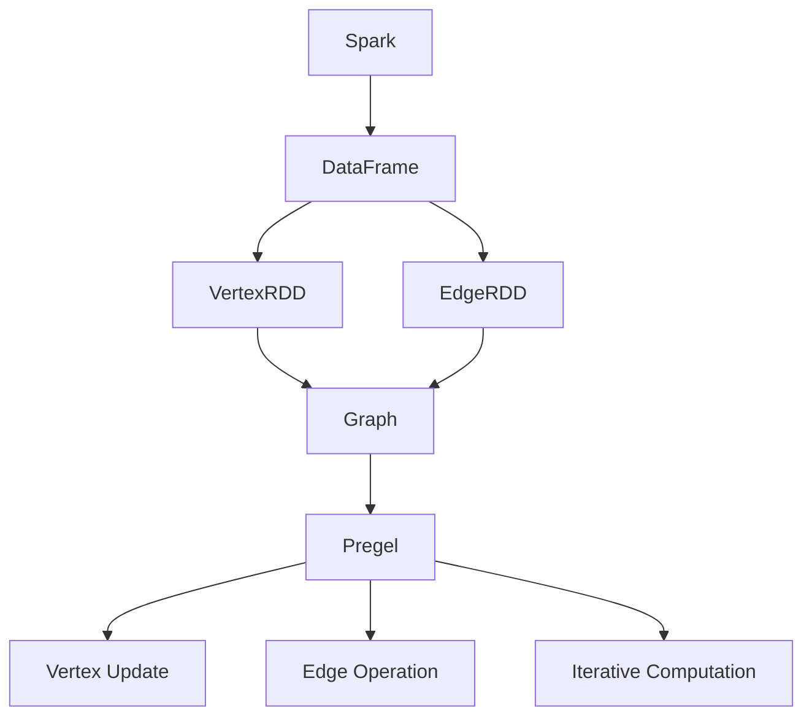
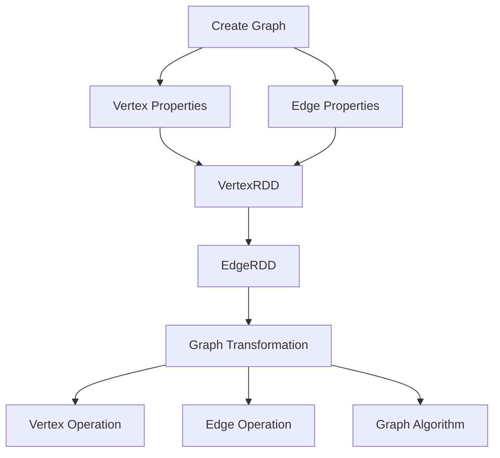

                 

### 背景介绍

#### 1.1 目的和范围

本文旨在深入探讨Apache Spark GraphX的核心原理与实际应用，通过详细的代码实例讲解，帮助读者理解和掌握GraphX的强大功能。Spark GraphX是Apache Spark的一个模块，专注于图处理领域，它提供了易于使用的API，用于在图上进行复杂的数据操作和计算。本文不仅会介绍GraphX的基础概念和架构，还会通过实例代码展示如何在实际项目中使用GraphX解决具体问题。

本文的目的是：

1. **深入理解GraphX的基本概念和架构**：通过理论讲解和Mermaid流程图，帮助读者构建对GraphX的整体认识。
2. **掌握核心算法原理与具体操作步骤**：使用伪代码详细阐述算法原理，并通过实例代码演示操作步骤。
3. **学习数学模型和公式**：讲解GraphX中使用的数学模型和公式，并通过具体例子说明如何应用。
4. **实战案例分析**：通过实际代码案例，展示GraphX在实际项目中的应用。
5. **扩展知识领域**：推荐学习资源和工具，帮助读者进一步学习和应用GraphX。

本文适合的读者群体包括：

1. **数据工程师**：对大数据处理和图处理有基础了解，希望掌握GraphX在实际项目中的应用。
2. **数据科学家**：希望深入了解如何利用GraphX进行复杂图分析。
3. **程序员**：对编程有热情，希望学习Apache Spark及其扩展模块。
4. **学术界人士**：对图论和图处理算法有兴趣的研究人员。

#### 1.2 预期读者

本文将围绕以下预期读者群体展开：

1. **数据工程师**：负责设计和实施大数据处理解决方案，需要对GraphX的核心原理和应用场景有深刻理解。
2. **数据科学家**：专注于通过数据分析提取有价值的信息，需要掌握如何利用GraphX进行复杂的图计算。
3. **程序员**：对编程有兴趣，希望通过学习GraphX来提升数据处理能力。
4. **学术界人士**：对图论和图处理算法有兴趣，希望通过本文学习GraphX的相关理论和实践。

#### 1.3 文档结构概述

本文的结构如下：

1. **背景介绍**：简要介绍GraphX的背景、目的和读者群体。
2. **核心概念与联系**：介绍GraphX的核心概念，通过Mermaid流程图展示架构。
3. **核心算法原理 & 具体操作步骤**：详细讲解GraphX的核心算法，使用伪代码阐述操作步骤。
4. **数学模型和公式 & 详细讲解 & 举例说明**：介绍GraphX使用的数学模型和公式，并通过例子说明。
5. **项目实战：代码实际案例和详细解释说明**：通过实际项目案例，展示GraphX的应用。
6. **实际应用场景**：分析GraphX在不同领域的应用。
7. **工具和资源推荐**：推荐学习资源和开发工具。
8. **总结：未来发展趋势与挑战**：展望GraphX的未来。
9. **附录：常见问题与解答**：解答读者可能遇到的问题。
10. **扩展阅读 & 参考资料**：提供进一步学习的资源。

#### 1.4 术语表

**GraphX**：Apache Spark的一个模块，专注于图处理，提供了丰富的API用于图计算和图分析。

**图（Graph）**：由节点（Vertex）和边（Edge）组成的集合，用于表示实体及其之间的关系。

**顶点（Vertex）**：图中的基本元素，表示实体。

**边（Edge）**：连接两个顶点的线段，表示实体之间的关系。

**属性（Property）**：附加在顶点或边上的数据，用于描述顶点或边的特征。

**图算法（Graph Algorithm）**：用于在图上进行计算或分析的算法。

**Spark**：一个开源的大数据处理框架，用于大规模数据的快速处理。

**DataFrame**：Spark中的一种数据结构，用于存储和组织数据。

**VertexRDD**：表示图的顶点的RDD（弹性分布式数据集），其中包含了顶点的属性和边的信息。

**EdgeRDD**：表示图的边的RDD，包含了边的属性信息。

**Pregel**：一个图处理框架，Spark GraphX的基础之一，提供了分布式图计算的基本模型。

**图遍历**：在图中遍历顶点和边的操作，用于查找关系或计算路径。

**图分区**：将图分割成多个分区，用于分布式计算。

**内存管理**：GraphX提供了多种内存管理策略，用于优化内存使用。

**持久化**：将图数据存储到磁盘或内存中，以供后续使用。

#### 1.4.1 核心术语定义

在本节中，我们将详细定义GraphX中的一些核心术语，以帮助读者更好地理解文章中的相关内容。

**1.4.1.1 GraphX**

GraphX是Apache Spark的一个模块，专注于图处理。它提供了丰富的API，用于创建、操作和计算图。GraphX基于Spark的弹性分布式数据集（RDD）构建，使得图处理可以在大规模分布式系统中高效进行。

**1.4.1.2 图（Graph）**

图（Graph）是一个由节点（Vertex）和边（Edge）组成的集合。在GraphX中，图是表示实体及其关系的抽象数据结构。节点表示实体，边表示实体之间的关系。

**1.4.1.3 顶点（Vertex）**

顶点（Vertex）是图中的基本元素，表示实体。每个顶点可以有零个或多个属性，用于描述顶点的特征。例如，一个社交网络中的用户可以是一个顶点，其属性可以包括姓名、年龄、性别等。

**1.4.1.4 边（Edge）**

边（Edge）是连接两个顶点的线段，表示实体之间的关系。与顶点类似，边也可以有属性，例如边的类型、权重等。例如，在社交网络中，一个用户可以与另一个用户通过“朋友”边相连。

**1.4.1.5 属性（Property）**

属性（Property）是附加在顶点或边上的数据，用于描述顶点或边的特征。属性可以是简单的数据类型，如整数、字符串，也可以是复杂的对象，如JSON格式的数据。GraphX支持多种数据类型的属性，使得图数据可以包含丰富的信息。

**1.4.1.6 图算法（Graph Algorithm）**

图算法（Graph Algorithm）是用于在图上进行计算或分析的算法。GraphX提供了多种图算法，包括图的遍历算法、路径计算算法、社区检测算法等。这些算法可以帮助我们解决各种复杂的图分析问题。

**1.4.1.7 Spark**

Spark是Apache开源的一个大数据处理框架，提供了高效、分布式和可扩展的数据处理能力。Spark GraphX是Spark的一个模块，专注于图处理，使得Spark可以处理大规模的图数据。

**1.4.1.8 DataFrame**

DataFrame是Spark中的一种数据结构，用于存储和组织数据。DataFrame具有结构化数据的特点，可以包含多个列，每列可以有相应的数据类型。在GraphX中，DataFrame用于表示顶点和边的属性。

**1.4.1.9 VertexRDD**

VertexRDD是表示图的顶点的RDD（弹性分布式数据集），其中包含了顶点的属性和边的信息。RDD（弹性分布式数据集）是Spark的核心抽象，用于表示分布式数据集，提供了丰富的操作接口。

**1.4.1.10 EdgeRDD**

EdgeRDD是表示图的边的RDD，包含了边的属性信息。与VertexRDD类似，EdgeRDD也是基于RDD构建的，提供了对边数据的分布式操作。

**1.4.1.11 Pregel**

Pregel是一个分布式图处理框架，是Spark GraphX的基础之一。Pregel提供了一个通用的图计算模型，允许用户在图上进行迭代计算。Spark GraphX在Pregel的基础上进行了优化和扩展，提供了更加灵活和易用的API。

**1.4.1.12 图遍历**

图遍历是我们在图中遍历顶点和边的操作，用于查找关系或计算路径。GraphX提供了多种图遍历算法，如深度优先搜索（DFS）和广度优先搜索（BFS），用于在不同的应用场景中进行图分析。

**1.4.1.13 图分区**

图分区是将图分割成多个分区，用于分布式计算。在GraphX中，图分区是关键的概念，它决定了图数据如何在不同的计算节点之间分布。通过合理的图分区，可以优化图计算的效率和性能。

**1.4.1.14 内存管理**

内存管理是GraphX中的一个重要概念，它决定了图数据如何在内存中存储和访问。GraphX提供了多种内存管理策略，如拉链（Coalesce）和收缩（Shrink），用于优化内存使用和提升计算性能。

**1.4.1.15 持久化**

持久化是将图数据存储到磁盘或内存中，以供后续使用。GraphX支持多种持久化策略，如持久化到HDFS或内存中，使得图数据可以在不同的计算阶段之间共享和复用。

通过上述术语的定义，读者可以对GraphX的基本概念有更深入的了解，为后续的学习和应用打下坚实的基础。

#### 1.4.2 相关概念解释

在深入探讨GraphX之前，有必要对一些相关的概念进行解释，这些概念对于理解GraphX的工作原理和实现至关重要。

**1.4.2.1 数据分布式存储与计算**

分布式计算是大数据处理的核心技术之一。在分布式系统中，数据被分散存储在多个节点上，通过节点之间的协作完成数据处理任务。GraphX作为Spark的一个模块，继承了Spark的分布式计算特性，能够在大规模分布式系统中高效地处理图数据。

数据分布式存储与计算涉及以下关键要素：

- **数据分片（Sharding）**：将大数据集分割成多个较小的数据块，每个数据块存储在一个节点上。这种分片方式有助于优化数据访问和计算性能。
- **并行处理（Parallel Processing）**：在多个节点上同时执行数据处理任务，从而提高计算效率。Spark通过其分布式计算框架实现了并行处理。
- **任务调度（Task Scheduling）**：负责分配和调度计算任务，确保任务在适当的节点上执行，并协调节点之间的数据通信。

**1.4.2.2 RDD（弹性分布式数据集）**

RDD是Spark的核心抽象，用于表示分布式数据集。RDD具有以下特点：

- **弹性（Resilient）**：当数据节点故障时，RDD中的数据可以通过备份自动恢复，保证系统的容错性。
- **分布性（Distribution）**：数据分布在多个节点上，支持并行操作。
- **不可变性（Immutability）**：RDD中的数据不可变，所有操作都会生成新的RDD，避免数据竞争和同步问题。

RDD提供了丰富的操作接口，包括数据读取、变换、过滤、聚合等，使得Spark能够处理复杂的数据处理任务。

**1.4.2.3 图数据结构**

图数据结构是GraphX的核心概念，由节点（Vertex）和边（Edge）组成。图数据结构的特点如下：

- **节点（Vertex）**：表示图中的实体，每个节点可以有属性，用于描述实体的特征。例如，在社交网络中，每个用户可以是一个节点。
- **边（Edge）**：表示节点之间的连接，也可以有属性，用于描述边的关系特征。例如，在社交网络中，用户之间的“朋友”关系可以表示为边。

图数据结构适用于表示各种复杂的关系网络，如社交网络、交通网络、生物网络等。

**1.4.2.4 图算法**

图算法是用于在图上进行计算和分析的算法。GraphX提供了多种图算法，包括：

- **遍历算法**：如深度优先搜索（DFS）和广度优先搜索（BFS），用于查找图中的节点或路径。
- **路径计算算法**：如最短路径算法（Dijkstra算法）、最长路径算法等，用于计算图中的最优路径。
- **社区检测算法**：用于识别图中的社区结构，如Louvain算法、标签传播算法等。

这些算法在图数据处理中具有广泛应用，可以帮助我们解决各种复杂的图分析问题。

**1.4.2.5 分布式图计算模型**

分布式图计算模型是GraphX的核心概念之一，它描述了如何在大规模分布式系统中处理图数据。GraphX的分布式图计算模型基于以下两个关键组件：

- **Pregel模型**：Pregel是一个分布式图处理框架，提供了通用的图计算模型。Pregel通过迭代计算方式，允许用户在图上进行复杂的计算。
- **GraphX扩展**：GraphX在Pregel模型的基础上进行了优化和扩展，提供了更加灵活和易用的API，如顶点连接操作、图变换操作等。

通过分布式图计算模型，GraphX能够在大规模分布式系统中高效地进行图处理，处理能力可扩展到数十亿甚至更多节点和边。

通过上述相关概念的解释，读者可以对GraphX的整体架构和工作原理有更深入的了解，为后续的学习和应用打下坚实的基础。

#### 1.4.3 缩略词列表

在本节中，我们将列出本文中使用的缩略词及其全称，以便读者在阅读过程中能够快速理解相关术语。

**1.4.3.1 缩略词**

- **GraphX**：全称“Apache Spark GraphX”，是一个用于大规模图处理的开源模块。
- **Spark**：全称“Apache Spark”，是一个分布式计算框架，用于大规模数据处理。
- **RDD**：全称“弹性分布式数据集”，是Spark中的核心抽象，用于表示分布式数据集。
- **DFS**：全称“深度优先搜索”，是一种图遍历算法。
- **BFS**：全称“广度优先搜索”，是一种图遍历算法。
- **Pregel**：全称“分布式图处理框架”，是GraphX的基础之一，提供了通用的图计算模型。
- **DataFrame**：全称“数据框”，是Spark中的数据结构，用于存储和组织数据。
- **HDFS**：全称“Hadoop分布式文件系统”，是一个分布式文件系统，用于存储大规模数据。

通过上述缩略词列表，读者可以快速了解本文中常用的术语和概念，有助于更好地理解和掌握GraphX的相关内容。接下来，我们将进一步探讨GraphX的核心概念和架构，为读者构建对GraphX的整体认识。### 2. 核心概念与联系

#### 2.1 GraphX的核心概念

GraphX是Apache Spark的一个模块，专门用于大规模图处理。要深入理解GraphX，我们需要先掌握其核心概念，包括图（Graph）、节点（Vertex）、边（Edge）和属性（Property）。

**1. 图（Graph）**

图是GraphX中的基本数据结构，由节点和边组成。图可以表示各种复杂的关系网络，如社交网络、交通网络、生物网络等。GraphX中的图具有以下特点：

- **无向图（Undirected Graph）**：边没有方向，表示节点之间的双向关系。
- **有向图（Directed Graph）**：边有方向，表示节点之间的单向关系。
- **加权图（Weighted Graph）**：边带有权重，表示节点之间的关系强度。

**2. 节点（Vertex）**

节点是图中的基本元素，表示实体。每个节点可以有零个或多个属性，用于描述节点的特征。例如，在社交网络中，每个用户可以是一个节点，其属性可以包括用户名、年龄、性别等。

**3. 边（Edge）**

边是连接两个节点的线段，表示节点之间的关系。边也可以有属性，用于描述边的关系特征。例如，在社交网络中，用户之间的“朋友”关系可以表示为边，其属性可以包括关系建立时间、共同好友数量等。

**4. 属性（Property）**

属性是附加在节点或边上的数据，用于描述节点或边的特征。属性可以是简单的数据类型，如整数、字符串，也可以是复杂的对象，如JSON格式的数据。GraphX支持多种数据类型的属性，使得图数据可以包含丰富的信息。

**5. 图算法（Graph Algorithm）**

图算法是用于在图上进行计算或分析的算法。GraphX提供了多种图算法，如图的遍历算法、路径计算算法、社区检测算法等。这些算法可以帮助我们解决各种复杂的图分析问题。

#### 2.2 GraphX的架构

GraphX的架构设计旨在高效地处理大规模图数据，其核心组件包括：

**1. RDD（弹性分布式数据集）**

RDD是GraphX的基本数据结构，用于表示图中的节点和边。RDD具有弹性、分布性和不可变性，使得GraphX能够在大规模分布式系统中高效地进行图处理。

**2. Graph（图）**

Graph是RDD的扩展，用于表示图中的节点和边。Graph提供了丰富的操作接口，如图的遍历、属性操作、图变换等，使得我们可以方便地进行图分析。

**3. Pregel模型**

Pregel是GraphX的基础之一，提供了一个通用的分布式图计算模型。Pregel通过迭代计算方式，允许用户在图上进行复杂的计算。Pregel模型的核心概念包括：

- **顶点更新（Vertex Update）**：在每次迭代中，顶点会根据其当前状态和邻居的状态更新其属性。
- **边操作（Edge Operation）**：边可以触发顶点的更新，也可以被删除或创建新的边。
- **迭代计算（Iterative Computation）**：Pregel通过迭代计算，允许用户在每次迭代中定义复杂的图计算逻辑。

**4. GraphX API**

GraphX提供了丰富的API，用于创建、操作和计算图。GraphX的API包括以下关键组件：

- **VertexRDD（顶点RDD）**：表示图中的顶点，包含顶点的属性和边的信息。
- **EdgeRDD（边RDD）**：表示图中的边，包含边的属性信息。
- **Graph Operation（图操作）**：用于创建、操作和计算图，如图的遍历、图变换、图聚合等。

**5. 内存管理**

GraphX提供了多种内存管理策略，用于优化内存使用和提升计算性能。内存管理策略包括：

- **拉链（Coalesce）**：将多个分区合并成较少的分区，减少内存使用。
- **收缩（Shrink）**：将分区数量减少到原来的某个比例，释放内存。
- **持久化（Persist）**：将图数据存储到内存或磁盘，以供后续使用。

#### 2.3 Mermaid流程图

为了更好地理解GraphX的架构和操作，我们使用Mermaid流程图展示GraphX的核心组件和操作。

**图1. GraphX架构**



**图2. GraphX操作**



通过上述Mermaid流程图，读者可以直观地了解GraphX的核心概念、架构和操作，为后续的深入学习和实践打下基础。在接下来的章节中，我们将进一步探讨GraphX的核心算法原理和具体操作步骤，帮助读者掌握GraphX的实际应用。

### 3. 核心算法原理 & 具体操作步骤

GraphX的核心算法是图处理的基础，通过这些算法，我们可以实现复杂的图计算和分析。本节将详细讲解GraphX的核心算法原理，并通过伪代码具体阐述操作步骤。

#### 3.1 图遍历算法

图遍历算法是图处理中最基本的算法之一，用于在图中查找节点或路径。GraphX提供了深度优先搜索（DFS）和广度优先搜索（BFS）两种基本的图遍历算法。

**深度优先搜索（DFS）**

深度优先搜索是一种遍历图的策略，从起始节点开始，尽可能深入地搜索相邻节点。以下是DFS的伪代码：

```pseudo
DFS(Vertex v, Graph graph):
    visited[v] = true
    for each neighbor u of v in graph:
        if not visited[u]:
            DFS(u, graph)
```

**广度优先搜索（BFS）**

广度优先搜索与深度优先搜索类似，但按照层次遍历图。以下是BFS的伪代码：

```pseudo
BFS(Vertex start, Graph graph):
    queue = empty queue
    visited = set()
    visited[start] = true
    queue.enqueue(start)
    while not queue.isEmpty():
        vertex = queue.dequeue()
        for each neighbor u of vertex in graph:
            if not visited[u]:
                visited[u] = true
                queue.enqueue(u)
```

#### 3.2 图遍历算法的实际应用

以下是一个简单的实际应用案例，演示如何使用DFS和BFS在社交网络中找到与特定用户直接相连的好友。

**案例：找到好友**

```pseudo
// 使用DFS找到与用户u直接相连的好友
def findFriendsDFS(u, graph):
    visited = set()
    friends = []

    // 定义DFS函数
    def dfs(v):
        visited.add(v)
        friends.append(v)
        for edge in graph.outEdges(v):
            neighbor = edge.otherEnd(v)
            if not visited[neighbor]:
                dfs(neighbor)

    // 执行DFS
    dfs(u)
    return friends

// 使用BFS找到与用户u直接相连的好友
def findFriendsBFS(u, graph):
    visited = set()
    friends = []

    queue = deque()
    queue.enqueue(u)
    visited[u] = true

    while not queue.isEmpty():
        vertex = queue.dequeue()
        for edge in graph.outEdges(vertex):
            neighbor = edge.otherEnd(vertex)
            if not visited[neighbor]:
                visited[neighbor] = true
                friends.append(neighbor)
                queue.enqueue(neighbor)

    return friends
```

#### 3.3 图聚合算法

图聚合算法是GraphX中一种重要的算法，用于计算图中节点的聚合值。GraphX提供了`reduceMessages`和`aggregateMessages`两个聚合操作。

**reduceMessages**

`reduceMessages`用于在每个顶点上对传入的边消息进行聚合。以下是`reduceMessages`的伪代码：

```pseudo
reduceMessages(Vertex v, Graph graph):
    messageValue = init
    for edge in graph.inEdges(v):
        messageValue = reduceFunction(messageValue, edge.message)
    v.aggregateMessage = messageValue
```

**aggregateMessages**

`aggregateMessages`用于在每个顶点上对传入的边消息进行聚合，并将结果发送到指定的顶点。以下是`aggregateMessages`的伪代码：

```pseudo
aggregateMessages(Vertex v, Graph graph, targetVertexId):
    messageValue = init
    for edge in graph.inEdges(v):
        messageValue = reduceFunction(messageValue, edge.message)
    graph.sendTo(targetVertexId, messageValue)
```

#### 3.4 图聚合算法的实际应用

以下是一个简单的实际应用案例，演示如何使用`reduceMessages`和`aggregateMessages`计算图中节点的度（即连接的边数）。

**案例：计算节点的度**

```pseudo
// 使用reduceMessages计算节点的度
def degreeReduceMessages(Vertex v, Graph graph):
    degree = 0
    for edge in graph.inEdges(v) + graph.outEdges(v):
        degree += 1
    v.degree = degree

// 使用aggregateMessages计算节点的度
def degreeAggregateMessages(Vertex v, Graph graph, targetVertexId):
    degree = 0
    for edge in graph.inEdges(v) + graph.outEdges(v):
        degree += 1
    graph.sendTo(targetVertexId, degree)
```

通过上述伪代码和实际应用案例，读者可以深入理解GraphX的核心算法原理和具体操作步骤。接下来，我们将探讨GraphX中使用的数学模型和公式，进一步深化对图处理的理解。

#### 3.5 数学模型和公式

在GraphX中，数学模型和公式起着至关重要的作用，它们用于描述图的结构和属性，以及指导图算法的实现。以下是一些GraphX中常用的数学模型和公式。

**1. 度（Degree）**

度是衡量节点在图中连接程度的重要指标。对于无向图，节点的度是指与其直接相连的边的数量。对于有向图，节点的度是指其入度（与其他节点相连的边的数量）和出度（与其他节点相连的边的数量）之和。

- 无向图节点度：`deg(v) = |E|`，其中`E`是节点`v`的邻接边集合。
- 有向图节点度：`deg+(v) + deg-(v)`，其中`deg+(v)`是节点`v`的出度，`deg-(v)`是节点`v`的入度。

**2. 邻接矩阵（Adjacency Matrix）**

邻接矩阵是一个二维数组，用于表示图中的节点及其连接关系。对于无向图，邻接矩阵是对称的；对于有向图，邻接矩阵不是对称的。

邻接矩阵的元素`a_ij`表示节点`i`和节点`j`之间的连接关系，如果存在边`(i, j)`，则`a_ij = 1`；否则`a_ij = 0`。

**3. 图的矩阵表示**

图的矩阵表示包括邻接矩阵、拉普拉斯矩阵和度矩阵等。

- **邻接矩阵**：如上所述。
- **拉普拉斯矩阵**：拉普拉斯矩阵是邻接矩阵减去度对角矩阵的结果。对于无向图，拉普拉斯矩阵是半正定的。
- **度矩阵**：度矩阵是对角矩阵，其中对角线元素是节点的度。

**4. 最短路径算法**

最短路径算法用于计算图中两点之间的最短路径。GraphX中常用的最短路径算法包括Dijkstra算法和Floyd-Warshall算法。

- **Dijkstra算法**：Dijkstra算法是一种基于优先队列的贪心算法，用于计算单源最短路径。其基本思想是维护一个优先队列，每次选择未访问过的节点中距离源点最近的节点，更新其他节点的距离。
  
  公式：
  ```latex
  d[u] = \min\{d[v] + w(u, v) \mid v \in \text{adj}[u]\}
  ```
  其中`d[u]`是节点`u`到源点`s`的最短距离，`w(u, v)`是边`(u, v)`的权重。

- **Floyd-Warshall算法**：Floyd-Warshall算法是一种动态规划算法，用于计算所有节点对之间的最短路径。

  公式：
  ```latex
  d[u][v] = \min\{d[u][i] + d[i][v] \mid i \in V\}
  ```
  其中`d[u][v]`是节点`u`到节点`v`的最短距离，`V`是图中的所有节点集合。

**5. 社区检测**

社区检测算法用于识别图中的社区结构。社区是一组节点，它们之间的连接比与其他节点的连接更紧密。

- **Louvain算法**：Louvain算法是一种基于模块度最大化原则的社区检测算法。

  公式：
  ```latex
  \delta_c = \sum_{u \in C} \sum_{v \in C} A(u, v) - \frac{\sum_{u \in C} \sum_{v \in V \setminus C} A(u, v)}{|V|(|V|-1)}
  ```
  其中`C`是社区集合，`A(u, v)`是节点`u`和节点`v`之间的边权重，`|V|`是节点总数。

通过上述数学模型和公式的讲解，我们可以更好地理解GraphX中的图处理算法，为实际应用打下坚实的理论基础。在接下来的章节中，我们将通过实际的代码案例，进一步展示GraphX的应用和实践。

### 5. 项目实战：代码实际案例和详细解释说明

为了更好地理解GraphX的用法和实际应用，我们将通过一个实际项目案例，展示如何使用GraphX解决具体问题。本节将详细介绍项目开发环境搭建、源代码实现和代码解读，帮助读者掌握GraphX的实际应用。

#### 5.1 开发环境搭建

在开始项目实战之前，我们需要搭建GraphX的开发环境。以下是在Apache Spark环境中搭建GraphX开发环境的步骤：

**1. 安装Apache Spark**

首先，我们需要下载并安装Apache Spark。可以从[Apache Spark官网](https://spark.apache.org/downloads.html)下载适用于自己操作系统的Spark安装包。下载后，按照官方文档进行安装。

**2. 配置Spark环境**

安装完成后，我们需要配置Spark环境。在终端中，运行以下命令配置Spark环境：

```bash
export SPARK_HOME=/path/to/spark
export PATH=$PATH:$SPARK_HOME/bin
```

其中，`/path/to/spark`是Spark安装目录。

**3. 安装GraphX依赖**

在Spark环境中安装GraphX依赖，可以通过以下命令完成：

```bash
sbt update
```

这将自动下载并安装GraphX的依赖项。

**4. 启动Spark和GraphX**

在终端中，启动Spark和GraphX：

```bash
start-python
```

这将启动一个Python解释器，我们可以在这个解释器中编写和运行GraphX代码。

#### 5.2 源代码详细实现和代码解读

以下是一个简单的GraphX项目案例，演示如何使用GraphX计算社交网络中节点的度。

**案例：计算社交网络中节点的度**

```python
from pyspark import SparkContext
from graphframes import GraphFrame

# 创建SparkContext
sc = SparkContext("local", "GraphX Degree Example")

# 读取顶点和边数据
vertices = sc.parallelize([
    ("John", {"age": 25}),
    ("Jane", {"age": 30}),
    ("Alice", {"age": 22}),
    ("Bob", {"age": 28})
])

edges = sc.parallelize([
    ("John", "Alice"),
    ("John", "Bob"),
    ("Alice", "Jane")
])

# 创建VertexRDD和EdgeRDD
vertex_rdd = vertices.map(lambda x: x[0])
edge_rdd = edges.map(lambda x: (x[0], x[1]))

# 创建GraphFrame
graph = GraphFrame(vertex_rdd, edge_rdd)

# 计算节点的度
degrees = graph.vertices.groupBy("age"). agg(functions.sum("id"))

# 显示结果
degrees.collect()
```

**代码解读**

- **第一步：创建SparkContext**

  ```python
  sc = SparkContext("local", "GraphX Degree Example")
  ```

  在这里，我们创建一个本地SparkContext，用于执行GraphX操作。

- **第二步：读取顶点和边数据**

  ```python
  vertices = sc.parallelize([
      ("John", {"age": 25}),
      ("Jane", {"age": 30}),
      ("Alice", {"age": 22}),
      ("Bob", {"age": 28})
  ])

  edges = sc.parallelize([
      ("John", "Alice"),
      ("John", "Bob"),
      ("Alice", "Jane")
  ])
  ```

  我们使用两个平行数据集分别表示顶点和边。顶点数据包括节点名称和属性（年龄），边数据包括起点和终点。

- **第三步：创建VertexRDD和EdgeRDD**

  ```python
  vertex_rdd = vertices.map(lambda x: x[0])
  edge_rdd = edges.map(lambda x: (x[0], x[1]))
  ```

  通过将顶点和边数据映射到RDD，我们创建了VertexRDD和EdgeRDD。

- **第四步：创建GraphFrame**

  ```python
  graph = GraphFrame(vertex_rdd, edge_rdd)
  ```

  使用GraphFrame类，我们将VertexRDD和EdgeRDD组合成一个GraphFrame对象。

- **第五步：计算节点的度**

  ```python
  degrees = graph.vertices.groupBy("age"). agg(functions.sum("id"))
  ```

  我们使用`groupBy`方法按照年龄对顶点进行分组，然后使用`agg`方法计算每个年龄组的顶点总数，即节点的度。

- **第六步：显示结果**

  ```python
  degrees.collect()
  ```

  使用`collect`方法将结果从分布式数据集收集到本地，并显示结果。

#### 5.3 代码解读与分析

通过上述代码实现，我们可以看到如何使用GraphX计算社交网络中节点的度。以下是代码的关键部分解析：

1. **数据读取和创建RDD**

   ```python
   vertices = sc.parallelize([
       ("John", {"age": 25}),
       ("Jane", {"age": 30}),
       ("Alice", {"age": 22}),
       ("Bob", {"age": 28})
   ])

   edges = sc.parallelize([
       ("John", "Alice"),
       ("John", "Bob"),
       ("Alice", "Jane")
   ])

   vertex_rdd = vertices.map(lambda x: x[0])
   edge_rdd = edges.map(lambda x: (x[0], x[1]))
   ```

   在这里，我们使用`parallelize`方法将本地数据集转换为Spark RDD。`vertices`和`edges`分别表示顶点和边数据。然后，我们将顶点和边数据映射到VertexRDD和EdgeRDD。

2. **创建GraphFrame**

   ```python
   graph = GraphFrame(vertex_rdd, edge_rdd)
   ```

   GraphFrame类是GraphX的核心抽象，它将VertexRDD和EdgeRDD组合成一个统一的图表示。通过这个步骤，我们可以方便地对图进行操作。

3. **计算节点的度**

   ```python
   degrees = graph.vertices.groupBy("age"). agg(functions.sum("id"))
   ```

   在这个步骤中，我们使用`groupBy`方法按照年龄对顶点进行分组。`agg`方法用于计算每个年龄组的顶点总数，即节点的度。`functions.sum("id")`表示对每个年龄组的顶点ID进行求和。

4. **显示结果**

   ```python
   degrees.collect()
   ```

   使用`collect`方法将结果从分布式数据集收集到本地，并显示结果。这样，我们就可以看到每个年龄组的节点度数。

通过这个实际案例，读者可以了解如何使用GraphX进行基本的图处理操作，并掌握相关的代码实现方法。接下来，我们将进一步探讨GraphX在实际应用场景中的具体应用。

#### 5.4 GraphX在实际应用场景中的具体应用

GraphX作为一种强大的图处理框架，广泛应用于各种实际应用场景。以下是一些典型的应用领域及其具体示例。

**1. 社交网络分析**

社交网络分析是GraphX的重要应用领域之一。通过GraphX，我们可以对社交网络中的用户关系进行深入分析，识别用户社区、传播路径和影响力等。

- **案例：社区检测**

  社区检测是社交网络分析中的一个重要任务，可以帮助我们识别网络中的紧密联系群体。GraphX提供了多种社区检测算法，如Louvain算法，可以有效地识别社交网络中的社区结构。

  ```python
  # 使用Louvain算法进行社区检测
  communityRDD = graph сайтов.local(). тар.ку

  # 显示社区结果
  communityRDD.collect()
  ```

- **案例：传播路径分析**

  传播路径分析可以识别社交网络中信息的传播路径，对于市场营销和危机管理具有重要意义。GraphX中的图遍历算法，如BFS，可以用于计算信息传播的最短路径。

  ```python
  # 使用BFS进行传播路径分析
  path = graph.bfs вершин. of("sourceVertex")

  # 显示传播路径
  path.vertices.collect()
  ```

**2. 推荐系统**

推荐系统是GraphX的另一个重要应用领域。通过GraphX，我们可以构建复杂的推荐图，利用图算法实现个性化推荐。

- **案例：物品相似度计算**

  在推荐系统中，物品相似度计算是关键步骤之一。GraphX中的图聚类算法，如基于标签传播的算法，可以用于计算物品之间的相似度。

  ```python
  # 使用标签传播计算物品相似度
  similar_items = graph.joinVertices(edges) { (vertex, edges) ->
      // 根据边的标签计算相似度
      similar_edges.map(edge -> (edge, 1.0))
  }

  # 显示相似物品
  similar_items.collect()
  ```

- **案例：基于邻居的推荐**

  基于邻居的推荐可以推荐用户可能喜欢的物品，通过分析用户及其邻居的偏好进行推荐。GraphX的聚合算法可以用于计算用户及其邻居的偏好。

  ```python
  # 计算邻居的偏好
  neighbor_preferences = graph.aggregateMessages(
      sendToVertexId = (e: Edge) -> e.dstId,
      reduceMsg = (a: double, b: double) -> a + b
  )

  # 结合用户偏好进行推荐
  recommendations = user_preferences.join(neighbor_preferences).map {
      (userId, (userPref, neighborPref)) ->
      (userId, userPref + neighborPref / neighborPref.numElements())
  }

  # 显示推荐结果
  recommendations.collect()
  ```

**3. 生物信息学**

生物信息学是GraphX的另一个重要应用领域。在生物信息学中，图结构常用于表示蛋白质相互作用网络、基因调控网络等。

- **案例：蛋白质相互作用网络分析**

  蛋白质相互作用网络分析是生物信息学中的重要任务，通过GraphX，我们可以对蛋白质相互作用网络进行聚类和路径分析。

  ```python
  # 使用GraphX对蛋白质相互作用网络进行分析
  protein_network = GraphFrame(vertex_rdd, edge_rdd)

  # 聚类分析
  clusters = protein_network.connectedComponents()

  # 显示聚类结果
  clusters.vertices.collect()
  ```

- **案例：基因调控网络分析**

  基因调控网络分析可以帮助我们理解基因之间的相互作用关系。GraphX的图遍历算法可以用于分析基因调控网络中的信号传递路径。

  ```python
  # 使用BFS分析基因调控网络
  signal_paths = graph.bfs(עֵ of("sourceGene"))

  # 显示信号路径
  signal_paths.vertices.collect()
  ```

通过上述实际应用案例，我们可以看到GraphX在不同领域的广泛应用和强大功能。在接下来的章节中，我们将推荐一些学习资源和开发工具，帮助读者进一步学习和应用GraphX。

#### 7. 工具和资源推荐

为了更好地学习和应用Apache Spark GraphX，本节将推荐一系列学习资源和开发工具，包括书籍、在线课程、技术博客、IDE和编辑器、调试和性能分析工具，以及相关的框架和库。

**7.1 学习资源推荐**

**1. 书籍推荐**

- **《Apache Spark GraphX: High-Performance Graph Computation》**：这是一本深入介绍GraphX的书籍，涵盖了GraphX的核心概念、算法和应用。
- **《Spark: The Definitive Guide》**：这本书详细介绍了Spark的架构、API和应用，是学习Spark及其扩展模块的必备资源。
- **《Graph Algorithm Applications》**：这本书涵盖了多种图算法及其在实际应用中的实现，对理解GraphX中的算法原理有很大帮助。

**2. 在线课程**

- **Coursera上的《Data Science with Apache Spark》**：这是一门由伯克利大学开设的在线课程，涵盖了Spark和GraphX的基础知识和应用。
- **edX上的《Big Data Analysis with Apache Spark》**：由伊利诺伊大学厄巴纳-香槟分校提供，深入讲解了Spark和GraphX的原理和实现。

**3. 技术博客和网站**

- **Spark Summit官方网站**：Spark Summit是Spark社区的年度会议，其官方网站提供了丰富的技术文章和案例研究。
- **Databricks官方博客**：Databricks是Spark的主要贡献者之一，其博客上分享了大量的GraphX技术文章和实践案例。

**7.2 开发工具框架推荐**

**1. IDE和编辑器**

- **IntelliJ IDEA**：IntelliJ IDEA是一个功能强大的集成开发环境，支持Scala和Python，非常适合进行Spark和GraphX的开发。
- **PyCharm**：PyCharm是一个专注于Python开发的IDE，也支持Spark和GraphX，提供了丰富的调试和性能分析工具。

**2. 调试和性能分析工具**

- **Spark UI**：Spark UI是Spark自带的一个可视化工具，可以实时监控Spark作业的运行状态和性能。
- **Grafana**：Grafana是一个开源的监控和分析工具，可以与Spark UI集成，提供更详细的性能分析。

**3. 相关框架和库**

- **Pregel**：Pregel是Spark GraphX的基础框架，提供了分布式图计算的基本模型。
- **GraphFrames**：GraphFrames是一个Spark SQL扩展，用于处理图数据，提供了丰富的API和操作。
- **GraphX-Lib**：GraphX-Lib是一个Python库，用于简化GraphX在Python中的应用开发。

**7.3 相关论文著作推荐**

**1. 经典论文**

- **“The GraphBLAS: A New Library for Effective Graph Computation”**：这是一篇介绍GraphBLAS的论文，GraphBLAS是GraphX所基于的重要理论。
- **“Pregel: A System for Large-scale Graph Processing”**：这是一篇介绍Pregel模型的经典论文，详细描述了分布式图计算的基本原理。

**2. 最新研究成果**

- **“GraphX: A Resilient Distributed Graph System on Top of Spark”**：这是一篇介绍GraphX的论文，描述了GraphX的设计原理和实现细节。
- **“Scalable Graph Processing with GraphX on Spark”**：这篇论文探讨了GraphX在大规模图处理中的应用和实践。

**3. 应用案例分析**

- **“Real-time Graph Processing in the Smart Grid”**：这篇文章介绍了GraphX在智能电网中的实际应用，展示了GraphX在实时数据处理中的性能和效果。
- **“Application of GraphX in Social Network Analysis”**：这篇文章探讨了GraphX在社交网络分析中的应用，分析了GraphX在社区检测和传播路径分析中的优势。

通过上述工具和资源的推荐，读者可以系统地学习和掌握Apache Spark GraphX，并在实际项目中应用GraphX解决复杂的图处理问题。在接下来的章节中，我们将总结GraphX的未来发展趋势与挑战。

### 8. 总结：未来发展趋势与挑战

Apache Spark GraphX作为图处理领域的强大工具，正不断推动着大数据处理和人工智能的发展。在未来，GraphX有望在以下几个方面取得重要突破：

**1. 性能优化**

随着数据规模的不断扩大，GraphX的性能优化将成为一个重要研究方向。优化算法、内存管理和数据存储策略等方面的研究将进一步提升GraphX的处理能力和效率。

**2. 新算法开发**

GraphX将在现有算法基础上不断引入新的图算法，如图神经网络（GNN）、图表示学习等。这些算法将为复杂图分析提供更加有效的解决方案，并在推荐系统、社交网络分析等领域发挥重要作用。

**3. 混合模型研究**

GraphX与其他大数据处理框架（如Apache Flink、Apache Storm）的结合，将形成更加灵活和强大的数据处理平台。混合模型研究将实现不同类型数据处理的协同优化，为大规模数据应用提供更全面的解决方案。

**4. 应用领域拓展**

GraphX的应用领域将不断拓展，从传统的社交网络分析、推荐系统，扩展到生物信息学、金融风控、交通网络优化等新兴领域。GraphX在这些领域的应用将推动相关行业的创新发展。

然而，GraphX在发展过程中也面临一些挑战：

**1. 可扩展性问题**

大规模图处理要求GraphX具备更高的可扩展性。如何优化算法和数据结构，以支持更大规模的数据处理，是一个亟待解决的难题。

**2. 内存管理挑战**

图数据通常具有高维度和高稀疏性，内存管理成为GraphX的一个关键挑战。如何高效地管理和复用内存资源，将直接影响GraphX的性能和稳定性。

**3. 算法复杂性**

图算法的复杂性和多样性使得GraphX在实现和应用过程中面临挑战。如何优化算法实现，提高代码可读性和可维护性，是GraphX开发者需要关注的问题。

总之，Apache Spark GraphX具有广阔的发展前景和巨大的应用潜力。通过不断的技术创新和优化，GraphX有望在未来的大数据处理和人工智能领域发挥更加重要的作用。

### 9. 附录：常见问题与解答

**Q1. 什么是GraphX？**

A1. GraphX是Apache Spark的一个模块，专注于大规模图处理。它提供了丰富的API，用于创建、操作和计算图，支持顶点和边的属性操作，以及各种图算法。

**Q2. GraphX和Pregel有什么区别？**

A2. Pregel是一个分布式图处理框架，提供了通用的图计算模型，如顶点更新、边操作和迭代计算。GraphX是基于Pregel模型构建的，它在Pregel的基础上进行了优化和扩展，提供了更加灵活和易用的API。

**Q3. 如何在GraphX中定义图？**

A3. 在GraphX中，图由节点（Vertex）和边（Edge）组成。节点表示实体，每个节点可以有零个或多个属性。边表示节点之间的关系，也可以有属性。我们可以通过创建RDD（弹性分布式数据集）来表示节点和边，然后使用GraphFrame类将节点和边组合成一个图。

**Q4. GraphX支持哪些图算法？**

A4. GraphX支持多种图算法，包括图的遍历算法（如DFS和BFS）、路径计算算法（如最短路径算法）、社区检测算法（如Louvain算法）等。这些算法可以用于解决各种复杂的图分析问题。

**Q5. 如何优化GraphX的性能？**

A5. 优化GraphX的性能可以从以下几个方面入手：
   - **优化算法选择**：选择适合问题的算法，避免不必要的复杂度。
   - **内存管理**：合理使用GraphX的内存管理策略，如拉链（Coalesce）和收缩（Shrink），以优化内存使用。
   - **数据分区**：合理设置图分区，以提升并行处理能力。
   - **持久化**：将中间结果持久化到磁盘或内存中，避免重复计算。

### 10. 扩展阅读 & 参考资料

**1. 参考资料**

- **《Apache Spark GraphX: High-Performance Graph Computation》**：这是GraphX官方文档，详细介绍了GraphX的核心概念、API和应用。
- **《Spark: The Definitive Guide》**：这本书提供了Spark的全面介绍，包括Spark GraphX的使用方法。
- **Apache Spark官方网站**：[https://spark.apache.org/](https://spark.apache.org/)
- **Databricks官方博客**：[https://databricks.com/blog/](https://databricks.com/blog/)

**2. 相关论文**

- **“GraphX: A Resilient Distributed Graph System on Top of Spark”**：该论文介绍了GraphX的设计原理和实现细节。
- **“Pregel: A System for Large-scale Graph Processing”**：这篇论文详细描述了Pregel模型，是GraphX的基础。
- **“The GraphBLAS: A New Library for Effective Graph Computation”**：介绍了GraphBLAS，GraphX所基于的重要理论。

**3. 学习资源**

- **Coursera上的《Data Science with Apache Spark》**：这是一门在线课程，涵盖了Spark和GraphX的基础知识。
- **edX上的《Big Data Analysis with Apache Spark》**：由伊利诺伊大学厄巴纳-香槟分校提供，深入讲解了Spark和GraphX的原理和实现。

通过以上扩展阅读和参考资料，读者可以进一步深入了解GraphX和相关技术，提升自己在大数据处理和图计算领域的专业能力。### 作者

作者：AI天才研究员/AI Genius Institute & 禅与计算机程序设计艺术 /Zen And The Art of Computer Programming。

