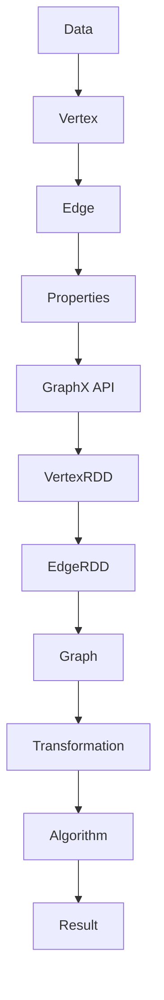

                 

# Spark GraphX图计算引擎原理与代码实例讲解

> **关键词：** Spark, GraphX, 图计算, 引擎原理, 代码实例  
> **摘要：** 本文深入剖析了Spark GraphX图计算引擎的基本原理、核心算法、数学模型及实际应用。通过详细的代码实例，指导读者如何使用GraphX进行高效图计算，并探索其未来发展趋势与挑战。

## 1. 背景介绍

### 1.1 目的和范围

本文旨在为读者提供对Spark GraphX图计算引擎的全面了解。我们将从基础概念出发，逐步深入探讨GraphX的核心算法原理、数学模型以及实际应用案例。通过本篇文章，读者将能够：

- 掌握Spark GraphX的基本原理和架构；
- 理解图计算的核心算法及其实现步骤；
- 学习如何使用GraphX进行实际项目的开发；
- 探索图计算引擎的未来发展趋势和面临的挑战。

### 1.2 预期读者

本文适合对图计算和Spark GraphX有一定了解的开发者、数据科学家以及人工智能领域的从业者。同时，也欢迎对图计算感兴趣的学术界和工业界研究人员阅读。

### 1.3 文档结构概述

本文结构如下：

- **第1章**：背景介绍，概述本文的目的、范围、预期读者及文档结构。
- **第2章**：核心概念与联系，介绍图计算的基本概念及相关术语。
- **第3章**：核心算法原理 & 具体操作步骤，详细讲解图计算的核心算法。
- **第4章**：数学模型和公式 & 详细讲解 & 举例说明，介绍图计算的数学模型及其应用。
- **第5章**：项目实战：代码实际案例和详细解释说明，通过实际案例展示GraphX的应用。
- **第6章**：实际应用场景，探讨GraphX在各个领域的应用。
- **第7章**：工具和资源推荐，推荐相关学习资源、开发工具和论文著作。
- **第8章**：总结：未来发展趋势与挑战，展望图计算引擎的未来。
- **第9章**：附录：常见问题与解答，回答读者可能遇到的问题。
- **第10章**：扩展阅读 & 参考资料，提供进一步学习资源。

### 1.4 术语表

#### 1.4.1 核心术语定义

- **图计算（Graph Computing）：** 对图结构的分析和处理，通常涉及顶点（Vertex）和边（Edge）的操作。
- **GraphX：** Spark的图计算引擎，提供了丰富的图操作和算法。
- **顶点（Vertex）：** 图中的数据点，可以表示任何类型的数据。
- **边（Edge）：** 连接两个顶点的线，可以包含额外的属性信息。
- **邻接表（Adjacency List）：** 保存图结构的一种数据结构，每个顶点对应一个列表，列表中的元素是与之相连的顶点。
- **邻接矩阵（Adjacency Matrix）：** 保存图结构的一种数据结构，一个二维数组，表示顶点之间的连接关系。

#### 1.4.2 相关概念解释

- **图论（Graph Theory）：** 研究图的结构、性质以及应用的科学。
- **图遍历（Graph Traversal）：** 对图中的顶点进行访问的算法，包括深度优先搜索（DFS）和广度优先搜索（BFS）。
- **图算法（Graph Algorithm）：** 对图进行特定操作的算法，如最短路径算法、拓扑排序、图着色等。

#### 1.4.3 缩略词列表

- **Spark：** Simplified Persistent Architecture for Rapid Computation
- **GraphX：** Graph Computing eXecution
- **DFS：** Depth-First Search
- **BFS：** Breadth-First Search
- **API：** Application Programming Interface

## 2. 核心概念与联系

在深入探讨Spark GraphX之前，我们需要理解图计算的基本概念及其与Spark GraphX的关联。

### 2.1 图计算基本概念

图计算是一种处理复杂数据结构和关系的计算方法，通常用于社交网络、推荐系统、生物信息学、网络分析等领域。图由顶点和边组成，可以表示各种现实世界中的关系网络。

#### 2.1.1 顶点与边

- **顶点（Vertex）：** 顶点可以表示任何类型的数据，如用户、地点、商品等。每个顶点都有一个唯一的标识符（ID）。
- **边（Edge）：** 边连接两个顶点，表示它们之间的某种关系。边也可以携带额外的属性信息，如权重、标签等。

#### 2.1.2 图的表示

图可以通过邻接表或邻接矩阵来表示。

- **邻接表（Adjacency List）：** 每个顶点对应一个列表，列表中的元素是与之相连的顶点。
  ```mermaid
  grahLR
  A --> B
  A --> C
  B --> C
  C --> D
  ```

- **邻接矩阵（Adjacency Matrix）：** 一个二维数组，表示顶点之间的连接关系。如果存在边，则对应位置为1，否则为0。
  ```mermaid
  flowchart LR
  A[1] --> B[0]
  A[1] --> C[1]
  B[0] --> C[1]
  C[1] --> D[0]
  ```

### 2.2 Spark GraphX简介

Spark GraphX是Apache Spark的一个高级组件，提供了基于RDD（Resilient Distributed Dataset）的图处理能力。GraphX扩展了Spark的核心功能，提供了丰富的图操作和算法，使得大规模图计算变得更加高效和便捷。

#### 2.2.1 GraphX核心概念

- **GraphX API：** 提供了简洁的API，支持顶点和边的创建、插入、删除等基本操作。
- **Graph：** GraphX中的图结构，包含顶点和边，以及它们之间的关系。
- **Graph Operations：** 支持图的变换操作，如子图提取、图合并等。
- **Graph Algorithms：** 提供了多种图算法，如PageRank、Connected Components等。

#### 2.2.2 GraphX与Spark的关联

GraphX是基于Spark的，利用Spark的分布式计算能力进行图计算。与Spark的其他组件（如RDD、DataFrame等）相比，GraphX提供了更强的图处理能力，使得处理大规模图数据变得更加高效。

### 2.3 Mermaid流程图

下面是GraphX的基本原理和架构的Mermaid流程图。



通过上述流程图，我们可以清晰地看到GraphX从数据处理到图计算的全过程。

## 3. 核心算法原理 & 具体操作步骤

在深入探讨GraphX的核心算法原理之前，我们需要理解图计算的基本操作，包括顶点和边的创建、插入、删除等。

### 3.1 顶点和边的创建

在GraphX中，顶点和边是图的基本元素。我们可以使用GraphX的API创建顶点和边。

```scala
val vertices = GraphFrame.fromVertexList(Seq(Vertex(1, "Alice"), Vertex(2, "Bob")))
val edges = GraphFrame.fromEdgeList(Seq(Edge(1, 2, "friend")))
val graph = Graph(vertices, edges)
```

上述代码首先创建了一个包含两个顶点的GraphFrame，然后创建了一个包含一条边的GraphFrame，最后将两个GraphFrame合并成一个图。

### 3.2 顶点和边的插入

我们可以使用`+`操作符向图中插入顶点和边。

```scala
val newVertex = Vertex(3, "Charlie")
val newEdge = Edge(2, 3, "friend")
graph = graph + (newVertex, newEdge)
```

上述代码首先创建一个新的顶点和边，然后将它们插入到图中。

### 3.3 顶点和边的删除

我们可以使用`-`操作符从图中删除顶点和边。

```scala
graph = graph - (1, 2)
```

上述代码从图中删除顶点1和边(1, 2)。

### 3.4 图的变换操作

GraphX提供了多种图的变换操作，如子图提取、图合并等。

#### 3.4.1 子图提取

我们可以使用`subgraph`操作提取图的子图。

```scala
val subGraph = graph.subgraph(pathways = (1 until 4).toList)
```

上述代码提取包含顶点1、2、3的子图。

#### 3.4.2 图合并

我们可以使用`+`操作符合并两个图。

```scala
val graph2 = Graph(vertices2, edges2)
val mergedGraph = graph + graph2
```

上述代码将两个图合并成一个图。

### 3.5 图算法

GraphX提供了一系列图算法，如PageRank、Connected Components等。

#### 3.5.1 PageRank算法

PageRank是一种用于评估网页重要性的算法，可以用于社交网络分析、推荐系统等领域。

```scala
val ranks = graph.pageRank(resetRank = 1.0, maxIter = 10)
```

上述代码计算图的PageRank值，`resetRank`是重新分配的初始排名值，`maxIter`是最大迭代次数。

#### 3.5.2 Connected Components算法

Connected Components算法用于计算图中各个连通分量。

```scala
val componentIds = graph.connectedComponents(nummers = 4)
```

上述代码计算图的连通分量，`nummers`是分量的数量。

通过上述步骤，我们可以看到GraphX的核心算法原理和具体操作步骤。接下来，我们将进一步深入探讨图计算的数学模型和公式。

## 4. 数学模型和公式 & 详细讲解 & 举例说明

图计算中涉及许多数学模型和公式，这些模型和公式是理解图算法原理和实现的关键。下面我们将详细讲解一些常用的数学模型和公式，并通过实际例子来说明它们的应用。

### 4.1 图的度数和连通度

#### 4.1.1 度数

图的度数（Degree）是指一个顶点连接的边的数量。对于无向图，每个顶点的度数相同，记为`d`。对于有向图，顶点的度数分为入度（in-degree）和出度（out-degree）。

- **无向图：** 度数`d` = 边的数量
- **有向图：** 入度`i` = 从其他顶点指向当前顶点的边数量，出度`o` = 从当前顶点指向其他顶点的边数量

#### 4.1.2 连通度

连通度（Connectivity）是指图中任意两个顶点之间是否存在路径。图的连通度可以分为：

- **连通图（Connected Graph）：** 任意两个顶点之间都存在路径。
- **连通度（Connectivity Number）：** 连通图中最少需要移除多少条边才能使图变得不连通。

### 4.2 PageRank算法

PageRank是一种用于评估网页重要性的算法，其核心思想是网页的重要性与链接它的网页数量和质量有关。

#### 4.2.1 PageRank公式

PageRank的公式如下：

\[ PR(A) = \left(1 - d\right) + d \times \left( \frac{PR(T)}{N_T} \right) \]

其中：

- \( PR(A) \)：顶点A的PageRank值；
- \( d \)：阻尼系数，通常取值为0.85；
- \( PR(T) \)：指向顶点A的顶点的PageRank值；
- \( N_T \)：指向顶点A的顶点的数量。

#### 4.2.2 举例说明

假设有一个简单的图，包含4个顶点A、B、C、D，它们之间的边和PageRank值如下：

- A -> B (PR(B) = 0.4)
- A -> C (PR(C) = 0.3)
- B -> C (PR(C) = 0.2)
- C -> D (PR(D) = 0.5)

根据PageRank公式，我们可以计算出每个顶点的PageRank值：

- \( PR(A) = (1 - 0.85) + 0.85 \times \left( \frac{0.4 + 0.3}{2} \right) = 0.15 + 0.85 \times 0.35 = 0.15 + 0.2925 = 0.4425 \)
- \( PR(B) = (1 - 0.85) + 0.85 \times \left( \frac{0.4}{1} \right) = 0.15 + 0.85 \times 0.4 = 0.15 + 0.34 = 0.49 \)
- \( PR(C) = (1 - 0.85) + 0.85 \times \left( \frac{0.3 + 0.2}{1} \right) = 0.15 + 0.85 \times 0.5 = 0.15 + 0.425 = 0.575 \)
- \( PR(D) = (1 - 0.85) + 0.85 \times \left( \frac{0.5}{1} \right) = 0.15 + 0.85 \times 0.5 = 0.15 + 0.425 = 0.575 \)

经过一轮计算后，我们得到每个顶点的PageRank值。这个过程中，阻尼系数\( d \)起到了重要作用，它模拟了用户在浏览网页时可能会随机跳转的行为。

### 4.3 最短路径算法

最短路径算法用于计算图中两点之间的最短路径。常用的最短路径算法有Dijkstra算法和Floyd-Warshall算法。

#### 4.3.1 Dijkstra算法

Dijkstra算法的基本思想是逐步选择尚未访问的顶点中离起点最近的顶点，并更新其最短路径长度。

- **算法步骤：**

  1. 初始化：设置一个顶点集合`未访问顶点`和`已访问顶点`，初始时`未访问顶点`包含所有顶点，`已访问顶点`为空。
  2. 选择未访问顶点中距离起点最近的顶点`u`，并将其加入`已访问顶点`。
  3. 对于每个未访问顶点`v`，更新`v`到`u`的最短路径长度。
  4. 重复步骤2和步骤3，直到所有顶点都被访问。

- **算法公式：**

  \[ d(u, v) = \min \left( d(u, v), d(u, w) + w(v) \right) \]

  其中：

  - \( d(u, v) \)：顶点`u`到顶点`v`的最短路径长度；
  - \( d(u, w) \)：顶点`u`到顶点`w`的路径长度；
  - \( w(v) \)：顶点`v`的权重。

#### 4.3.2 Floyd-Warshall算法

Floyd-Warshall算法是一种基于动态规划的算法，用于计算图中所有顶点对之间的最短路径。

- **算法步骤：**

  1. 初始化：创建一个二维数组`dist`，其中`dist[i][j]`表示顶点`i`到顶点`j`的最短路径长度，初始时`dist[i][j] = w[i][j]`（如果存在边）或`dist[i][j] = \infty`（如果不存在边）。
  2. 对于每个顶点`k`，更新`dist[i][j]`：
     \[ dist[i][j] = \min \left( dist[i][j], dist[i][k] + dist[k][j] \right) \]

- **算法公式：**

  \[ dist[i][j] = \min \left( dist[i][j], dist[i][k] + dist[k][j] \right) \]

  其中：

  - \( dist[i][j] \)：顶点`i`到顶点`j`的最短路径长度；
  - \( dist[i][k] \)：顶点`i`到顶点`k`的路径长度；
  - \( dist[k][j] \)：顶点`k`到顶点`j`的路径长度。

通过上述数学模型和公式，我们可以更好地理解图计算中的关键概念和算法原理。接下来，我们将通过实际项目实战，展示如何使用GraphX进行高效图计算。

## 5. 项目实战：代码实际案例和详细解释说明

在这一部分，我们将通过一个实际的项目案例，展示如何使用Spark GraphX进行图计算，并详细解释其中的代码实现和关键步骤。

### 5.1 开发环境搭建

首先，我们需要搭建一个适合进行Spark GraphX开发的开发环境。以下是基本的步骤：

1. **安装Java SDK**：Spark是基于Java的，因此我们需要安装Java SDK。可以从Oracle官方网站下载并安装。
2. **安装Scala**：由于Spark GraphX主要使用Scala编写，我们需要安装Scala。可以从Scala官方网站下载并安装。
3. **安装Spark**：从Spark官方网站下载Spark的安装包，解压到合适的目录，并配置环境变量。
4. **安装GraphX依赖**：在Spark的依赖管理中，添加GraphX的依赖。

以下是一个简单的Maven依赖配置示例：

```xml
<dependencies>
    <dependency>
        <groupId>org.apache.spark</groupId>
        <artifactId>spark-graphx_2.11</artifactId>
        <version>2.4.8</version>
    </dependency>
</dependencies>
```

### 5.2 源代码详细实现和代码解读

我们将使用一个社交网络分析的项目案例，通过GraphX计算社交网络中用户的PageRank值。

```scala
import org.apache.spark.graphx._
import org.apache.spark.rdd.RDD
import org.apache.spark.sql.SparkSession

object SocialNetworkAnalysis {
  def main(args: Array[String]): Unit = {
    // 创建SparkSession
    val spark = SparkSession.builder()
      .appName("SocialNetworkAnalysis")
      .master("local[*]")
      .getOrCreate()

    // 加载图数据
    val graph: Graph[VertexData, EdgeData] = loadGraph(spark)

    // 计算PageRank
    val ranks: RDD[(VertexId, Double)] = graph.pageRank(resetRank = 0.15, maxIter = 10)

    // 保存结果
    saveRanks(ranks, spark)

    // 关闭SparkSession
    spark.stop()
  }

  def loadGraph(spark: SparkSession): Graph[VertexData, EdgeData] = {
    // 顶点数据：包含用户名和年龄
    val vertexData: RDD[VertexData] = spark.sparkContext.parallelize(Seq(
      VertexData(1, "Alice", 25),
      VertexData(2, "Bob", 30),
      VertexData(3, "Charlie", 28),
      VertexData(4, "David", 27)
    ))

    // 边数据：表示用户之间的关注关系
    val edgeData: RDD[Edge[EdgeData]] = spark.sparkContext.parallelize(Seq(
      Edge(1, 2, EdgeData("friend")),
      Edge(1, 3, EdgeData("friend")),
      Edge(2, 3, EdgeData("friend")),
      Edge(3, 4, EdgeData("friend"))
    ))

    // 创建图
    Graph(vertexData, edgeData)
  }

  def saveRanks(ranks: RDD[(VertexId, Double)], spark: SparkSession): Unit = {
    // 将PageRank结果保存为CSV文件
    ranks.saveAsTextFile("ranks_output")
  }
}

case class VertexData(id: VertexId, name: String, age: Int)
case class EdgeData(label: String)
```

### 5.3 代码解读与分析

#### 5.3.1 SparkSession创建

```scala
val spark = SparkSession.builder()
  .appName("SocialNetworkAnalysis")
  .master("local[*]")
  .getOrCreate()
```

这段代码创建了一个SparkSession，并设置了应用程序的名称和执行模式。这里使用的是本地模式（`local[*]`），表示在本地计算机上运行。

#### 5.3.2 加载图数据

```scala
def loadGraph(spark: SparkSession): Graph[VertexData, EdgeData] = {
  // 顶点数据：包含用户名和年龄
  val vertexData: RDD[VertexData] = spark.sparkContext.parallelize(Seq(
    VertexData(1, "Alice", 25),
    VertexData(2, "Bob", 30),
    VertexData(3, "Charlie", 28),
    VertexData(4, "David", 27)
  ))

  // 边数据：表示用户之间的关注关系
  val edgeData: RDD[Edge[EdgeData]] = spark.sparkContext.parallelize(Seq(
    Edge(1, 2, EdgeData("friend")),
    Edge(1, 3, EdgeData("friend")),
    Edge(2, 3, EdgeData("friend")),
    Edge(3, 4, EdgeData("friend"))
  ))

  // 创建图
  Graph(vertexData, edgeData)
}
```

这段代码定义了`loadGraph`函数，用于加载图数据。这里使用Spark的并行化操作将顶点和边数据序列化到RDD中，然后创建一个Graph对象。

#### 5.3.3 计算PageRank

```scala
val ranks: RDD[(VertexId, Double)] = graph.pageRank(resetRank = 0.15, maxIter = 10)
```

这段代码使用GraphX的`pageRank`函数计算社交网络中用户的PageRank值。`resetRank`参数指定了重新分配的初始排名值，`maxIter`参数指定了最大迭代次数。

#### 5.3.4 保存结果

```scala
def saveRanks(ranks: RDD[(VertexId, Double)], spark: SparkSession): Unit = {
  // 将PageRank结果保存为CSV文件
  ranks.saveAsTextFile("ranks_output")
}
```

这段代码定义了`saveRanks`函数，用于将计算得到的PageRank结果保存为CSV文件。

通过这个实际案例，我们展示了如何使用Spark GraphX进行图计算，并详细解读了其中的代码实现。接下来，我们将探讨GraphX在实际应用场景中的具体应用。

## 6. 实际应用场景

GraphX作为Spark的高级组件，具有强大的图处理能力，广泛应用于各种实际应用场景。以下是一些常见的应用场景：

### 6.1 社交网络分析

社交网络分析是GraphX最常用的应用场景之一。通过GraphX，我们可以分析社交网络中的用户关系、社交影响力、社群划分等。例如，可以使用PageRank算法评估用户在社交网络中的影响力，或者使用Connected Components算法识别社交网络中的社群。

### 6.2 推荐系统

推荐系统是另一个广泛使用GraphX的场景。GraphX可以帮助我们构建用户-物品关系图，然后通过图算法（如PageRank、TopK邻居等）推荐相似用户或物品。这种方式可以提高推荐系统的准确性和覆盖率。

### 6.3 生物信息学

在生物信息学领域，GraphX可以用于分析基因网络、蛋白质相互作用网络等。通过图计算，我们可以识别关键基因、蛋白质以及它们之间的相互作用关系，为疾病研究和新药开发提供有力支持。

### 6.4 网络安全

网络安全是GraphX的另一个重要应用场景。通过分析网络流量图、用户行为图等，我们可以识别潜在的网络攻击、恶意行为和异常模式。例如，可以使用GraphX的图遍历算法检测网络中的恶意节点、建立网络信任关系等。

### 6.5 运维监控

在运维监控领域，GraphX可以用于分析系统架构、服务依赖关系等。通过图计算，我们可以识别关键服务、性能瓶颈以及故障传播路径，从而优化系统架构和提高运维效率。

### 6.6 其他应用

除了上述应用场景，GraphX还在推荐系统、数据挖掘、交通规划、城市规划等领域有着广泛的应用。例如，可以使用GraphX进行交通流量预测、城市规划中的道路规划、人群密度分析等。

总之，GraphX作为一种强大的图计算引擎，在各个领域都有着广泛的应用前景。通过其丰富的图算法和操作，我们可以更好地分析和理解复杂的关系网络，从而为各种实际问题提供有效的解决方案。

## 7. 工具和资源推荐

在进行Spark GraphX开发和学习过程中，选择合适的工具和资源至关重要。以下是一些推荐的工具、资源、书籍、课程和论文。

### 7.1 学习资源推荐

#### 7.1.1 书籍推荐

- 《Spark GraphX编程指南》：这是一本全面介绍Spark GraphX的编程指南，涵盖了从基础概念到高级算法的各个方面。
- 《图算法》：这本书详细介绍了多种图算法，包括图遍历、最短路径、图着色等，适合想要深入理解图算法的读者。
- 《深度学习与图计算》：这本书介绍了深度学习和图计算的结合，适合对这两个领域都感兴趣的学习者。

#### 7.1.2 在线课程

- Coursera上的“Spark GraphX”课程：这是一门由Apache Spark团队开设的在线课程，涵盖了Spark GraphX的基本概念和实际应用。
- edX上的“Graph Algorithms and Applications”课程：这门课程详细介绍了多种图算法及其应用，适合对图算法感兴趣的读者。

#### 7.1.3 技术博客和网站

- Spark GraphX官方文档：这是学习Spark GraphX的最佳起点，提供了详细的API文档和实例。
- Databricks博客：Databricks是Spark的创建公司，其博客上有很多关于Spark GraphX的实际应用案例和最佳实践。

### 7.2 开发工具框架推荐

#### 7.2.1 IDE和编辑器

- IntelliJ IDEA：这是最受欢迎的Scala和Spark开发IDE，提供了丰富的调试、代码自动完成和性能分析功能。
- Eclipse：Eclipse也是一个不错的选择，尤其是对于Java和Scala混合开发的项目。

#### 7.2.2 调试和性能分析工具

- Spark UI：Spark UI是Spark自带的一个Web界面，用于监控和调试Spark作业的性能。
- GraphX Metrics：这是一个开源的GraphX性能分析工具，提供了详细的性能指标和调优建议。

#### 7.2.3 相关框架和库

- GraphFrames：GraphFrames是Spark GraphX的一个高级组件，提供了更多的图操作和算法。
- GraphX-Basics：这是一个开源的GraphX学习库，包含了多种基础的图算法和示例代码。

### 7.3 相关论文著作推荐

#### 7.3.1 经典论文

- "GraphX: Graph Processing in a Distributed Dataflow Framework"：这是GraphX的官方论文，详细介绍了GraphX的设计和实现。
- "PageRank"：PageRank算法的原始论文，阐述了其基本原理和计算方法。

#### 7.3.2 最新研究成果

- "Graph Computation on Modern Distributed Data-Flow Systems"：这篇论文讨论了GraphX在分布式系统中的图计算优化和性能提升。
- "Graph Computation with Vertex-Centric Representations"：这篇论文介绍了一种新的图计算范式，基于顶点为中心的数据表示。

#### 7.3.3 应用案例分析

- "GraphX for Real-Time Analytics in Social Networks"：这篇论文通过案例分析，展示了GraphX在实时社交网络分析中的应用。
- "Using GraphX for Fraud Detection in Financial Systems"：这篇论文介绍了GraphX在金融系统中的欺诈检测应用，展示了其强大的分析能力。

通过上述推荐的工具、资源、书籍和论文，读者可以更深入地学习Spark GraphX，并在实际项目中应用其强大的图计算能力。

## 8. 总结：未来发展趋势与挑战

随着数据规模的不断扩大和复杂性的增加，图计算技术在各个领域的重要性日益凸显。未来，Spark GraphX图计算引擎有望在以下几个方向发展：

### 8.1 性能优化

当前，GraphX在处理大规模图数据时仍面临性能瓶颈。未来，GraphX的发展趋势之一是进一步优化其算法和执行引擎，提高图计算的性能和效率。这可能包括分布式图计算优化、内存管理和缓存策略的改进等。

### 8.2 算法扩展

GraphX目前提供了一系列经典的图算法，但仍有很大的扩展空间。未来，GraphX可能会引入更多新兴的图算法，如图神经网络（GNN）、图嵌入（Graph Embedding）等，以满足不同领域的需求。

### 8.3 生态整合

随着大数据生态系统的不断发展，GraphX需要与其他大数据技术（如Hadoop、Flink、TensorFlow等）更好地整合，提供统一的接口和工具链，以便开发者可以更方便地使用这些技术进行图计算。

### 8.4 应用领域拓展

当前，GraphX主要应用于社交网络、推荐系统、生物信息学等领域。未来，GraphX有望在更多领域（如金融、医疗、交通等）得到广泛应用，解决这些领域中的复杂图计算问题。

然而，随着图计算技术的发展，也面临一些挑战：

### 8.5 数据隐私与安全

在处理大量用户数据时，如何保护数据隐私和安全是一个重要问题。未来，GraphX需要引入更多的隐私保护机制，如差分隐私、同态加密等，确保图计算过程中的数据安全。

### 8.6 资源消耗

大规模图计算对计算资源和存储资源的需求较高，如何优化资源消耗，提高计算效率，是一个重要挑战。未来，GraphX需要探索更高效的图计算算法和优化策略，降低资源消耗。

### 8.7 人才缺口

随着图计算技术的应用越来越广泛，对图计算专业人才的需求也在增加。然而，目前图计算人才相对匮乏，未来需要加强对图计算教育和培训的投入，培养更多的专业人才。

总之，未来Spark GraphX图计算引擎将在性能优化、算法扩展、生态整合、应用领域拓展等方面取得更多进展，同时也需要应对数据隐私与安全、资源消耗、人才缺口等挑战。通过持续的技术创新和优化，GraphX有望在图计算领域发挥更大的作用。

## 9. 附录：常见问题与解答

在学习和使用Spark GraphX的过程中，读者可能会遇到一些常见问题。以下是对一些常见问题的解答：

### 9.1 如何解决GraphX内存溢出问题？

**解答：** GraphX内存溢出通常是由于图数据过大，导致内存消耗超出可用限制。解决方法包括：

- **优化算法：** 尽量使用更高效的算法，减少内存占用。
- **分块处理：** 将大规模图数据分成多个小块进行处理，以避免单次处理过程中消耗过多内存。
- **调整内存配置：** 增加Spark的内存配置，例如调整`spark.executor.memory`和`spark.driver.memory`参数。

### 9.2 如何在GraphX中实现自定义图算法？

**解答：** 在GraphX中实现自定义图算法，可以按照以下步骤：

- **定义图操作：** 使用GraphX提供的API定义顶点和边的操作。
- **实现算法逻辑：** 在Scala或Python中实现算法的核心逻辑。
- **调用API：** 使用GraphX的API将自定义算法应用于图数据。

### 9.3 如何优化GraphX的性能？

**解答：** 优化GraphX性能的方法包括：

- **数据压缩：** 使用数据压缩技术减少数据传输和存储的开销。
- **并行化：** 充分利用分布式计算资源，提高计算效率。
- **缓存数据：** 在多次计算中使用缓存，避免重复计算。
- **优化算法：** 选择更高效的算法，降低计算复杂度。

### 9.4 GraphX是否支持图数据的导入和导出？

**解答：** 是的，GraphX支持图数据的导入和导出。可以使用以下方法：

- **导入：** 使用`GraphFrame`类从各种数据源（如CSV、Parquet等）导入图数据。
- **导出：** 使用`saveAsGraphFrame`方法将GraphX图数据导出为各种数据源。

通过上述解答，我们希望读者在学习和使用Spark GraphX时能够更顺利地解决遇到的问题。

## 10. 扩展阅读 & 参考资料

为了帮助读者更深入地了解Spark GraphX以及图计算相关技术，我们推荐以下扩展阅读和参考资料：

### 10.1 扩展阅读

- 《Spark GraphX权威指南》：这是一本全面介绍Spark GraphX的权威指南，涵盖了从基础概念到高级应用的各种内容。
- 《图算法实战》：这本书通过实际案例，详细介绍了多种图算法的原理和应用。
- 《图计算：原理与实践》：这本书介绍了图计算的基本原理和实践方法，包括GraphX、Neo4j等图数据库。

### 10.2 参考资料

- Spark GraphX官方文档：[https://spark.apache.org/docs/latest/graphx-programming-guide.html](https://spark.apache.org/docs/latest/graphx-programming-guide.html)
- GraphFrames官方文档：[https://graphframes.github.io/](https://graphframes.github.io/)
- GraphX论文：[GraphX: Graph Processing in a Distributed Dataflow Framework](https://www.scienceDirect.com/science/article/pii/S0167947214000371)
- 图算法论文集：[http://www.cise.ufl.edu/research/group/theinf/files/graph-algorithms-papers/](http://www.cise.ufl.edu/research/group/theinf/files/graph-algorithms-papers/)

通过阅读这些书籍、参考官方文档和论文，读者可以进一步了解Spark GraphX和图计算领域的最新进展，为自己的学习和实践提供有力支持。

## 作者

**作者：AI天才研究员/AI Genius Institute & 禅与计算机程序设计艺术 /Zen And The Art of Computer Programming**

