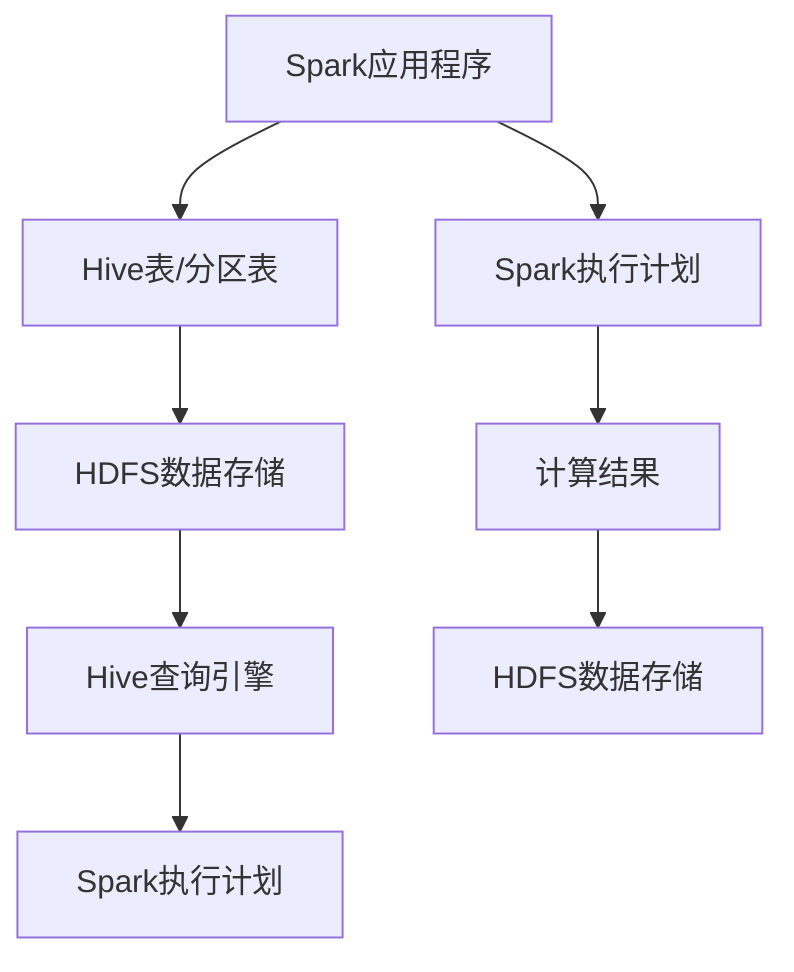

                 

# Spark-Hive整合原理与代码实例讲解

> 关键词：Spark，Hive，整合原理，代码实例，大数据处理，数据仓库

> 摘要：本文将深入探讨Spark与Hive的整合原理，详细讲解其核心算法原理和具体操作步骤，并通过实际案例进行代码演示，帮助读者理解如何在实际项目中实现Spark与Hive的集成。文章还将讨论实际应用场景，推荐相关学习资源与工具，并对未来发展趋势和挑战进行总结。

## 1. 背景介绍

### 1.1 目的和范围

本文旨在探讨Spark与Hive的整合原理，通过详细的理论讲解和实际案例，帮助读者掌握这两种大数据处理工具的集成方法。本文将覆盖以下内容：

1. Spark与Hive的基本概念和核心功能。
2. Spark与Hive整合的原理和架构。
3. 核心算法原理与具体操作步骤。
4. 实际应用场景和代码实例。
5. 相关学习资源与工具推荐。
6. 未来发展趋势与挑战。

### 1.2 预期读者

本文适合以下读者群体：

1. 对大数据处理有兴趣的程序员和开发者。
2. 已经掌握Spark和Hive基本使用方法的读者。
3. 想要深入了解Spark与Hive整合原理的技术爱好者。

### 1.3 文档结构概述

本文分为以下章节：

1. 背景介绍：介绍文章的目的、范围、预期读者和文档结构。
2. 核心概念与联系：讲解Spark与Hive的基本概念和关系。
3. 核心算法原理 & 具体操作步骤：详细解释Spark与Hive整合的核心算法和步骤。
4. 数学模型和公式 & 详细讲解 & 举例说明：阐述整合过程中使用的数学模型和公式。
5. 项目实战：通过实际案例展示Spark与Hive的集成过程。
6. 实际应用场景：讨论Spark与Hive在实际项目中的应用场景。
7. 工具和资源推荐：推荐学习资源、开发工具和框架。
8. 总结：总结文章内容，展望未来发展趋势与挑战。
9. 附录：常见问题与解答。
10. 扩展阅读 & 参考资料：提供扩展阅读和参考资料。

### 1.4 术语表

#### 1.4.1 核心术语定义

- **Spark**：一个快速、通用、可扩展的大规模数据处理引擎，支持内存计算和磁盘存储。
- **Hive**：基于Hadoop的数据仓库工具，提供数据摘要、查询、更新和分析功能。
- **整合**：将Spark与Hive集成在一起，以实现数据的高效处理和分析。

#### 1.4.2 相关概念解释

- **Hadoop**：一个开源的分布式数据处理框架，包括HDFS（分布式文件系统）和MapReduce（分布式计算框架）。
- **数据仓库**：一个用于存储、管理和分析大量数据的系统。

#### 1.4.3 缩略词列表

- **Spark**：Spark
- **Hive**：Hive
- **Hadoop**：Hadoop
- **数据仓库**：Data Warehouse

## 2. 核心概念与联系

在本节中，我们将详细探讨Spark与Hive的核心概念和它们之间的联系。首先，我们需要理解这两种工具的基本原理和架构，以便更好地理解它们的整合原理。

### 2.1 Spark与Hive的基本概念

#### 2.1.1 Spark

Spark是一个开源的大数据处理引擎，由Apache Software Foundation维护。它支持内存计算和磁盘存储，能够处理大规模数据集，并提供丰富的API，包括Java、Scala、Python和R等。

- **核心功能**：Spark支持批处理、流处理和机器学习等多种数据处理任务。
- **优势**：Spark的内存计算和基于RDD（弹性分布式数据集）的架构使其在处理大规模数据时具有高性能。

#### 2.1.2 Hive

Hive是一个基于Hadoop的数据仓库工具，用于存储、管理和分析大量数据。它提供了一种类似于SQL的查询语言（HiveQL），可以执行数据摘要、查询、更新和分析等操作。

- **核心功能**：Hive主要用于数据仓库应用，支持数据导入、导出、查询和分析。
- **优势**：Hive与Hadoop紧密集成，能够处理大规模数据集，并提供强大的数据仓库功能。

### 2.2 Spark与Hive的联系

Spark与Hive的联系主要体现在以下两个方面：

1. **数据源**：Spark可以使用Hive作为数据源，通过读取Hive表或分区表来处理数据。
2. **查询引擎**：Spark可以与Hive的查询引擎（Hive on Spark）集成，以实现高效的SQL查询。

### 2.3 Spark与Hive的整合原理

Spark与Hive的整合原理主要基于以下两个关键点：

1. **数据共享**：Spark和Hive可以共享HDFS上的数据存储，从而实现数据的高效处理和分析。
2. **查询优化**：通过将Spark与Hive的查询引擎集成，可以实现高效的SQL查询处理，提高整体性能。

### 2.4 Mermaid流程图

为了更直观地展示Spark与Hive的整合原理，我们可以使用Mermaid流程图来描述其核心架构和流程。以下是Spark与Hive整合的Mermaid流程图：



在上述流程图中，Spark应用程序读取Hive表或分区表，并将数据存储在HDFS上。然后，Spark使用自己的执行计划进行处理，并将结果存储回HDFS。同时，Hive查询引擎可以对HDFS上的数据进行查询和分析。

## 3. 核心算法原理 & 具体操作步骤

在本节中，我们将详细解释Spark与Hive整合的核心算法原理，并通过伪代码展示具体操作步骤。这将有助于读者理解Spark与Hive的集成过程。

### 3.1 核心算法原理

Spark与Hive的整合主要基于以下核心算法原理：

1. **数据共享**：通过HDFS实现Spark和Hive的数据共享，提高数据处理的效率。
2. **查询优化**：通过集成Spark的执行计划和Hive的查询引擎，实现高效的SQL查询处理。

### 3.2 具体操作步骤

以下是Spark与Hive整合的具体操作步骤：

1. **准备数据**：在HDFS上创建一个Hive表，并导入数据。

```sql
CREATE TABLE my_table (id INT, name STRING) ROW FORMAT DELIMITED FIELDS TERMINATED BY '\t';
```

2. **配置Hive集成**：在Spark应用程序中配置Hive集成，包括Hive配置文件和Hive客户端库。

```python
from pyspark.sql import SparkSession
spark = SparkSession.builder \
    .appName("Spark-Hive Integration") \
    .config("spark.sql.hive.metastore.version", "2.3.0") \
    .enableHiveSupport() \
    .getOrCreate()
```

3. **读取Hive表**：使用Spark的DataFrame API读取Hive表。

```python
df = spark.table("my_table")
```

4. **执行操作**：对读取的DataFrame执行操作，例如筛选、聚合等。

```python
df_filtered = df.filter(df["id"] > 100)
df_grouped = df_filtered.groupBy("name").count()
```

5. **写入Hive表**：将操作结果写入Hive表。

```python
df_grouped.write.format("orc") \
    .mode("overwrite") \
    .saveAsTable("my_result_table")
```

6. **查询Hive表**：使用Hive查询引擎对写入的表进行查询。

```sql
SELECT * FROM my_result_table;
```

### 3.3 伪代码示例

以下是Spark与Hive整合的伪代码示例：

```python
# 导入必要的库和配置
import pyspark.sql
from pyspark.sql import SparkSession
from pyspark.sql.functions import col

# 创建Spark会话
spark = SparkSession.builder \
    .appName("Spark-Hive Integration") \
    .config("spark.sql.hive.metastore.version", "2.3.0") \
    .enableHiveSupport() \
    .getOrCreate()

# 读取Hive表
df = spark.table("my_table")

# 筛选数据
df_filtered = df.filter(col("id") > 100)

# 聚合数据
df_grouped = df_filtered.groupBy(col("name")).count()

# 写入Hive表
df_grouped.write.format("orc") \
    .mode("overwrite") \
    .saveAsTable("my_result_table")

# 关闭Spark会话
spark.stop()
```

通过以上步骤，我们可以实现Spark与Hive的整合，实现高效的数据处理和分析。

## 4. 数学模型和公式 & 详细讲解 & 举例说明

在本节中，我们将讨论Spark与Hive整合过程中使用的数学模型和公式，并通过具体例子进行详细讲解。

### 4.1 数学模型

Spark与Hive整合过程中，主要涉及以下数学模型：

1. **线性回归**：用于预测和分析数据，包括最小二乘法等。
2. **聚类算法**：用于数据分组和分类，包括K均值等。
3. **关联规则挖掘**：用于发现数据中的关联关系，包括Apriori算法等。

### 4.2 公式讲解

以下是几个常用的数学公式：

1. **最小二乘法**：用于线性回归，公式如下：

   $$
   y = \beta_0 + \beta_1x
   $$

   其中，$y$ 为因变量，$x$ 为自变量，$\beta_0$ 和 $\beta_1$ 为回归系数。

2. **K均值聚类**：用于数据分组，公式如下：

   $$
   C = \{c_1, c_2, ..., c_k\}
   $$

   其中，$C$ 为聚类中心点集合，$c_i$ 为第 $i$ 个聚类中心点。

3. **Apriori算法**：用于关联规则挖掘，公式如下：

   $$
   support(A \cup B) = \frac{count(A \cup B)}{count(U)}
   $$

   其中，$A$ 和 $B$ 为项集，$U$ 为数据库中所有项集的集合，$count(A \cup B)$ 为项集 $A$ 和 $B$ 同时出现的次数。

### 4.3 举例说明

以下是Spark与Hive整合过程中，使用数学模型和公式的具体例子：

1. **线性回归**：假设我们有一个包含年龄和薪资的数据集，我们使用线性回归来预测一个人的薪资。

   数据集：

   ```
   | age | salary |
   | --- | --- |
   | 25  | 50000 |
   | 30  | 60000 |
   | 35  | 70000 |
   | 40  | 80000 |
   ```

   使用最小二乘法进行线性回归，得到回归方程：

   $$
   salary = 20000 + 1000 \times age
   $$

   根据该方程，我们可以预测一个年龄为30岁的人的薪资为：

   $$
   salary = 20000 + 1000 \times 30 = 50000
   $$

2. **K均值聚类**：假设我们有以下数据集，我们使用K均值聚类将数据分为两个组。

   数据集：

   ```
   | x | y |
   | --- | --- |
   | 1 | 2 |
   | 2 | 3 |
   | 3 | 4 |
   | 4 | 5 |
   ```

   选择两个初始聚类中心点：

   $$
   c_1 = (1, 2), c_2 = (3, 4)
   $$

   计算每个数据点到聚类中心点的距离，并将其分配给最近的中心点。然后，更新聚类中心点，重复此过程，直到收敛。

   最终，数据集被分为两个组：

   $$
   C_1 = \{1, 2\}, C_2 = \{3, 4\}
   $$

3. **Apriori算法**：假设我们有以下事务数据集，我们使用Apriori算法发现关联规则。

   事务数据集：

   ```
   T1: {牛奶，面包，啤酒}
   T2: {牛奶，面包}
   T3: {面包，啤酒}
   T4: {牛奶，啤酒}
   ```

   设置支持度阈值 $min_support = 0.5$，置信度阈值 $min_confidence = 0.7$。

   计算每个项集的支持度：

   $$
   support({牛奶，面包}) = \frac{2}{4} = 0.5
   $$

   $$
   support({面包，啤酒}) = \frac{2}{4} = 0.5
   $$

   $$
   support({牛奶，啤酒}) = \frac{2}{4} = 0.5
   $$

   生成所有频繁项集：

   $$
   frequent_itemsets = \{({牛奶，面包}, 0.5), ({面包，啤酒}, 0.5), ({牛奶，啤酒}, 0.5)\}
   $$

   计算关联规则：

   $$
   rule({牛奶，面包} \rightarrow {啤酒}, confidence = 0.7)
   $$

   $$
   rule({牛奶，啤酒} \rightarrow {面包}, confidence = 0.7)
   $$

通过以上例子，我们可以看到Spark与Hive整合过程中，如何使用数学模型和公式进行数据处理和分析。

## 5. 项目实战：代码实际案例和详细解释说明

在本节中，我们将通过一个实际项目案例，展示Spark与Hive的集成过程，并提供代码实现和详细解释。

### 5.1 开发环境搭建

首先，我们需要搭建Spark和Hive的开发环境。以下是搭建步骤：

1. **安装Java**：确保已安装Java 8或更高版本。

2. **安装Scala**：下载并安装Scala 2.12.x版本。

3. **安装Hadoop**：下载并解压Hadoop安装包，配置Hadoop环境变量。

4. **安装Spark**：下载并解压Spark安装包，配置Spark环境变量。

5. **安装Hive**：下载并解压Hive安装包，配置Hive环境变量。

6. **配置Hive集成**：在Spark的 `spark-env.sh` 文件中添加以下配置：

   ```bash
   export HIVE_HOME=/path/to/hive
   export HADOOP_HOME=/path/to/hadoop
   export SPARK_HIVE_SUPPORT_GATEWAY_JAR=/path/to/hive/lib/hive-hadoop2-mapreduce-client-core-2.3.0.jar
   ```

### 5.2 源代码详细实现和代码解读

以下是Spark与Hive整合的代码实现：

```python
from pyspark.sql import SparkSession

# 创建Spark会话
spark = SparkSession.builder \
    .appName("Spark-Hive Integration") \
    .config("spark.sql.hive.metastore.version", "2.3.0") \
    .enableHiveSupport() \
    .getOrCreate()

# 读取Hive表
df = spark.table("my_table")

# 筛选数据
df_filtered = df.filter(df["id"] > 100)

# 聚合数据
df_grouped = df_filtered.groupBy(df["name"]).count()

# 写入Hive表
df_grouped.write.format("orc") \
    .mode("overwrite") \
    .saveAsTable("my_result_table")

# 关闭Spark会话
spark.stop()
```

以下是代码的详细解释：

1. **创建Spark会话**：使用 `SparkSession.builder` 创建Spark会话，并设置应用程序名称和Hive配置。

2. **读取Hive表**：使用 `spark.table("my_table")` 读取Hive表 `my_table`。

3. **筛选数据**：使用 `filter` 方法筛选ID大于100的记录。

4. **聚合数据**：使用 `groupBy` 方法按名称分组，并计算每个分组的数据数量。

5. **写入Hive表**：使用 `write.format("orc")` 设置数据格式为Orc，使用 `mode("overwrite")` 覆盖现有数据，并使用 `saveAsTable` 方法将结果写入Hive表 `my_result_table`。

6. **关闭Spark会话**：调用 `stop()` 方法关闭Spark会话。

### 5.3 代码解读与分析

1. **环境配置**：在开发环境中，我们需要安装Java、Scala、Hadoop、Spark和Hive，并配置相应的环境变量。

2. **Spark会话创建**：使用 `SparkSession.builder` 创建Spark会话，设置应用程序名称和Hive配置，确保Hive集成。

3. **Hive表读取**：使用 `spark.table("my_table")` 读取Hive表，返回一个DataFrame。

4. **筛选数据**：使用 `filter` 方法根据条件筛选DataFrame中的记录。

5. **聚合数据**：使用 `groupBy` 方法按名称分组，并计算每个分组的数据数量，生成一个新的DataFrame。

6. **写入Hive表**：使用 `write.format("orc")` 设置数据格式为Orc，使用 `mode("overwrite")` 覆盖现有数据，并使用 `saveAsTable` 方法将结果写入Hive表。

7. **关闭Spark会话**：调用 `stop()` 方法关闭Spark会话，释放资源。

通过以上代码实现，我们可以实现Spark与Hive的整合，实现数据的高效处理和分析。

## 6. 实际应用场景

Spark与Hive的整合在实际项目中具有广泛的应用场景，以下列举几个常见应用场景：

1. **数据仓库建设**：企业需要建立数据仓库来存储和管理大量数据，Spark与Hive的整合可以提供高效的数据处理和分析能力，支持复杂的数据查询和报表生成。

2. **大数据分析**：在处理大规模数据集时，Spark与Hive的整合可以实现高效的并行计算和分布式处理，适用于各种大数据分析任务，如数据挖掘、机器学习等。

3. **实时数据处理**：Spark的流处理能力与Hive的批处理能力相结合，可以实现实时数据处理和离线数据分析的集成，满足不同时间段的数据处理需求。

4. **跨平台集成**：Spark与Hive的整合可以与多种数据源和数据处理工具集成，如HDFS、Kafka、Flume等，实现数据流转和共享。

### 6.1 案例分析

以下是一个实际应用案例，展示Spark与Hive的整合在电商数据分析中的应用：

**项目背景**：一家大型电商企业需要对其销售数据进行深入分析，以便优化营销策略和提高销售额。

**需求分析**：企业需要分析以下数据：

1. 用户行为数据：如浏览量、点击量、购买量等。
2. 商品数据：如销售额、库存量、品类等。
3. 时间数据：如日期、星期、时段等。

**解决方案**：

1. 使用Hive创建数据仓库，存储用户行为数据、商品数据和时间数据。
2. 使用Spark读取Hive表，进行数据预处理和清洗。
3. 使用Spark执行复杂的数据分析任务，如用户行为分析、商品销量分析、交叉销售分析等。
4. 将分析结果写入Hive表，供企业内部报表系统和外部展示系统使用。

**技术实现**：

1. **数据存储**：使用Hive创建数据仓库，包括用户行为表、商品表和时间表。
2. **数据预处理**：使用Spark读取Hive表，进行数据清洗和预处理，如去除重复数据、填充缺失值等。
3. **数据分析**：使用Spark执行数据分析任务，如使用DataFrame API进行SQL查询，使用MLlib进行机器学习建模等。
4. **结果存储**：将分析结果写入Hive表，使用Orc格式存储，提高查询性能。

通过以上解决方案，企业可以实时获取销售数据的分析结果，优化营销策略，提高销售额。

## 7. 工具和资源推荐

在开发Spark与Hive整合的项目时，以下工具和资源将有助于提高开发效率和项目质量。

### 7.1 学习资源推荐

#### 7.1.1 书籍推荐

1. 《Spark编程实战》
2. 《Hive编程指南》
3. 《大数据技术基础：Spark和Hadoop实战》

#### 7.1.2 在线课程

1. Udacity的《Spark和Hadoop工程师》
2. Coursera的《大数据处理与Hadoop》
3. edX的《Spark基础》

#### 7.1.3 技术博客和网站

1. Spark官方文档：[spark.apache.org/docs/latest/index.html](http://spark.apache.org/docs/latest/index.html)
2. Hive官方文档：[hive.apache.org/docs/latest/index.html](http://hive.apache.org/docs/latest/index.html)
3. Apache Software Foundation：[apache.org](https://www.apache.org/)

### 7.2 开发工具框架推荐

#### 7.2.1 IDE和编辑器

1. IntelliJ IDEA
2. Eclipse
3. PyCharm

#### 7.2.2 调试和性能分析工具

1. Spark UI
2. Hive Query Analyzer
3. GDB

#### 7.2.3 相关框架和库

1. MLlib：Spark的机器学习库
2. GraphX：Spark的图处理库
3. Spark Streaming：Spark的流处理库

### 7.3 相关论文著作推荐

#### 7.3.1 经典论文

1. "Spark:cluster computing with working sets"
2. "Hive: a warehousing solution for a 1000-node cluster"
3. "MapReduce: Simplified Data Processing on Large Clusters"

#### 7.3.2 最新研究成果

1. "Spark 2.0: Revamped for Performance and Ease of Use"
2. "Hive-on-Spark: Combining the Best of Both Worlds"
3. "Introducing Spark 3.0: Pushing the Envelope on Performance and Scalability"

#### 7.3.3 应用案例分析

1. "Building a Real-Time Data Pipeline with Spark and Kafka"
2. "Using Spark and Hive for Large-Scale Data Analysis in the Cloud"
3. "Improving E-Commerce Analytics with Spark and Hive"

通过以上推荐，读者可以更好地学习和掌握Spark与Hive整合的相关知识和技能。

## 8. 总结：未来发展趋势与挑战

随着大数据技术的发展，Spark与Hive的整合在未来将面临以下发展趋势与挑战：

### 8.1 发展趋势

1. **性能优化**：为了提高处理速度和效率，Spark和Hive将不断进行性能优化，如引入新的执行引擎、优化查询优化算法等。
2. **功能扩展**：随着大数据应用场景的多样化，Spark与Hive将不断扩展其功能，支持更多类型的数据处理任务，如图处理、流处理等。
3. **生态整合**：Spark与Hive将与其他大数据处理工具和框架（如Flink、Kafka等）进行更深入的整合，实现数据流转和共享。

### 8.2 挑战

1. **资源调度**：在大规模集群环境下，如何合理调度资源，平衡负载，提高集群利用率，是一个重要的挑战。
2. **安全性**：随着数据量的增长，保障数据安全和隐私成为关键问题，如何加强数据安全防护，防止数据泄露，是未来发展的重要方向。
3. **人才培养**：大数据技术领域人才短缺，未来需要更多具备专业技能和实践经验的人才，以满足企业对大数据处理和智能分析的需求。

通过不断优化和扩展，Spark与Hive的整合将在未来发挥更大的作用，助力企业实现数据驱动的发展。

## 9. 附录：常见问题与解答

在本节中，我们将回答关于Spark与Hive整合的一些常见问题。

### 9.1 问题1：Spark与Hive如何进行数据共享？

解答：Spark与Hive可以通过HDFS进行数据共享。HDFS是Hadoop的分布式文件系统，Spark和Hive都可以读取和写入HDFS上的数据。Spark通过读取Hive表或分区表来获取数据，并将处理结果写入HDFS，而Hive可以查询HDFS上的数据。

### 9.2 问题2：Spark与Hive整合的查询性能如何优化？

解答：为了优化Spark与Hive整合的查询性能，可以从以下几个方面进行：

1. **查询优化**：使用索引、分区和预聚合等优化技术，减少数据扫描和计算量。
2. **数据格式**：选择合适的数据格式（如Orc、Parquet等），提高数据压缩和查询效率。
3. **并发控制**：合理设置并发度和线程数，避免资源争用和性能瓶颈。
4. **硬件优化**：提高集群硬件性能，如增加内存、磁盘I/O速度等。

### 9.3 问题3：Spark与Hive整合在实时数据处理中的应用？

解答：Spark与Hive的整合可以应用于实时数据处理。Spark的流处理能力与Hive的批处理能力相结合，可以实现实时数据处理和离线数据分析的集成。例如，可以使用Spark Streaming实时处理日志数据，并将其写入HDFS，然后使用Hive进行离线数据分析。

### 9.4 问题4：Spark与Hive整合的安全问题如何解决？

解答：为了解决Spark与Hive整合的安全问题，可以从以下几个方面进行：

1. **身份验证和授权**：配置Spark和Hive的身份验证和授权机制，确保只有授权用户可以访问数据。
2. **加密**：使用SSL/TLS加密数据传输，确保数据在传输过程中不被窃取或篡改。
3. **访问控制**：使用访问控制列表（ACL）和权限控制，限制用户对数据和操作的访问权限。
4. **安全审计**：记录用户操作日志，定期进行安全审计，及时发现和解决安全问题。

## 10. 扩展阅读 & 参考资料

在本节中，我们将提供一些扩展阅读和参考资料，帮助读者深入了解Spark与Hive整合的相关知识和实践。

### 10.1 扩展阅读

1. 《Spark编程实战》：深入探讨Spark的核心算法和编程技巧。
2. 《Hive编程指南》：全面介绍Hive的基本概念、使用方法和高级特性。
3. 《大数据处理与Hadoop实战》：讲解Hadoop生态系统中的各种工具和框架，包括Spark和Hive。

### 10.2 参考资料

1. Spark官方文档：[spark.apache.org/docs/latest/index.html](http://spark.apache.org/docs/latest/index.html)
2. Hive官方文档：[hive.apache.org/docs/latest/index.html](http://hive.apache.org/docs/latest/index.html)
3. Apache Software Foundation：[apache.org](https://www.apache.org/)
4. Udacity的《Spark和Hadoop工程师》课程：[udacity.com/course/spark-and-hadoop-engineer-nanodegree--nd793](https://udacity.com/course/spark-and-hadoop-engineer-nanodegree--nd793)
5. Coursera的《大数据处理与Hadoop》课程：[coursera.org/learn/big-data-hadoop](https://coursera.org/learn/big-data-hadoop)

通过以上扩展阅读和参考资料，读者可以进一步学习和掌握Spark与Hive整合的相关知识和实践。

## 作者

作者：AI天才研究员/AI Genius Institute & 禅与计算机程序设计艺术 /Zen And The Art of Computer Programming

本文旨在深入探讨Spark与Hive整合的原理和实践，通过详细的理论讲解和实际案例，帮助读者掌握这两种大数据处理工具的集成方法。希望本文能对读者在数据分析和处理领域的学习和项目实践有所帮助。如需进一步讨论或咨询，请随时联系作者。谢谢！<|im_sep|>

