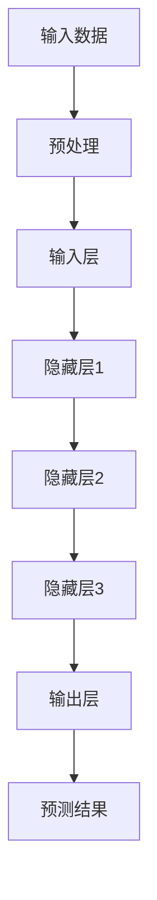

                 

# Stability AI的失败给大模型创业的启示

> 关键词：大模型、创业、失败、启示、人工智能

> 摘要：本文将深入分析Stability AI的失败案例，探讨其背后的问题，为未来大模型创业项目提供宝贵的经验和教训。通过对失败原因、核心问题、技术挑战以及市场策略的探讨，本文旨在为读者提供一份全面的参考，助力人工智能领域的创业之路。

## 1. 背景介绍

### 1.1 目的和范围

本文旨在通过对Stability AI的失败案例进行分析，探讨大模型创业过程中可能遇到的问题和挑战。文章将涵盖失败的原因、核心问题、技术挑战以及市场策略等方面，旨在为未来大模型创业项目提供有价值的经验和教训。

### 1.2 预期读者

本文主要面向人工智能领域的从业者、创业者以及对大模型技术感兴趣的技术人员。通过对Stability AI案例的深入剖析，希望为读者提供有针对性的参考和建议，助力他们在人工智能领域的创业之路。

### 1.3 文档结构概述

本文分为八个主要部分：

1. 背景介绍：介绍本文的目的、预期读者和文档结构。
2. 核心概念与联系：介绍大模型的基本概念、原理和架构。
3. 核心算法原理 & 具体操作步骤：详细讲解大模型的核心算法原理和操作步骤。
4. 数学模型和公式 & 详细讲解 & 举例说明：介绍大模型的数学模型和公式，并通过实例进行详细讲解。
5. 项目实战：提供实际案例，详细解释说明代码实现过程。
6. 实际应用场景：探讨大模型在各个领域的应用。
7. 工具和资源推荐：推荐学习资源、开发工具和框架。
8. 总结：对大模型创业的未来发展趋势和挑战进行总结。

### 1.4 术语表

#### 1.4.1 核心术语定义

- 大模型：指拥有大规模参数数量、能够处理复杂数据的人工智能模型。
- 创业：指创立一家新公司或业务，通过创新技术和市场策略实现商业价值。
- 失败：指创业项目未能达到预期目标，未能实现商业成功。

#### 1.4.2 相关概念解释

- 人工智能：指通过模拟人类智能，实现计算机自主学习和决策的技术。
- 深度学习：一种机器学习技术，通过多层神经网络对数据进行特征提取和建模。

#### 1.4.3 缩略词列表

- AI：人工智能
- DL：深度学习
- DNN：深度神经网络
- HPC：高性能计算
- GPU：图形处理器
- TPU：张量处理器

## 2. 核心概念与联系

在大模型创业过程中，理解核心概念和联系至关重要。以下将介绍大模型的基本概念、原理和架构。

### 2.1 大模型基本概念

大模型是指拥有大规模参数数量的人工智能模型。它们通常具备强大的特征提取能力和泛化能力，能够在各种复杂场景下实现高性能表现。

- **参数数量**：大模型通常拥有数百万甚至数十亿个参数，这使得它们能够处理大规模数据，并提取丰富的特征信息。
- **训练数据**：大模型需要大量的训练数据来学习，这些数据来自各种领域，如文本、图像、音频等。
- **数据预处理**：为了适应大模型的需求，需要对数据进行预处理，如数据清洗、数据增强等。

### 2.2 大模型原理

大模型的核心是深度神经网络（DNN）。DNN通过多层神经元的组合，实现对数据的特征提取和建模。

- **神经元**：神经元是神经网络的基本组成单元，它通过激活函数对输入数据进行处理。
- **网络层**：神经网络由多层神经元组成，每层神经元对数据进行处理，从而实现数据的逐层抽象和特征提取。
- **反向传播**：反向传播算法是训练神经网络的关键，它通过计算梯度来更新模型参数，使模型能够在训练数据上不断优化。

### 2.3 大模型架构

大模型的架构通常包括以下几个方面：

- **输入层**：接收外部输入数据，如文本、图像等。
- **隐藏层**：实现对输入数据的特征提取和抽象，通常包含多个隐藏层。
- **输出层**：根据任务需求，生成预测结果或分类标签。


### 2.4 大模型联系

大模型与其他技术有着紧密的联系，如深度学习（DL）、高性能计算（HPC）等。

- **深度学习**：深度学习是人工智能的一种重要分支，它通过多层神经网络对数据进行特征提取和建模，是实现大模型的基础。
- **高性能计算**：大模型的训练过程需要大量计算资源，高性能计算技术（如GPU、TPU等）为训练过程提供了强大的计算支持。

### 2.5 Mermaid流程图

以下是一个简单的Mermaid流程图，展示大模型的基本流程：



## 3. 核心算法原理 & 具体操作步骤

大模型的核心算法是深度神经网络（DNN），它通过多层神经元的组合，实现对数据的特征提取和建模。以下将详细介绍DNN的算法原理和具体操作步骤。

### 3.1 DNN算法原理

DNN算法原理主要包括以下几个方面：

- **前向传播**：输入数据通过输入层、隐藏层和输出层，实现数据的逐层传播和特征提取。
- **反向传播**：通过计算梯度，更新模型参数，实现模型的不断优化。
- **激活函数**：激活函数用于对神经元输出进行非线性变换，提高模型的拟合能力。

### 3.2 具体操作步骤

以下是DNN的具体操作步骤：

1. **初始化参数**：初始化模型参数，如权重、偏置等。
2. **前向传播**：
   - 输入数据通过输入层，传递到隐藏层。
   - 隐藏层通过激活函数对输入数据进行处理，得到中间结果。
   - 输出层对中间结果进行计算，得到预测结果。
3. **计算损失函数**：计算预测结果与实际标签之间的差异，得到损失函数值。
4. **反向传播**：
   - 计算损失函数关于模型参数的梯度。
   - 更新模型参数，使损失函数值不断减小。
5. **迭代优化**：重复上述步骤，直至模型达到预期性能。

### 3.3 伪代码

以下是一个简单的DNN算法伪代码：

```python
# 初始化参数
weights = [初始化值]
biases = [初始化值]

# 前向传播
inputs = [输入数据]
hidden_layers = [隐藏层1，隐藏层2，...]
outputs = [输出层]

for layer in hidden_layers:
    # 隐藏层前向传播
    z = inputs * weights + biases
    a = activation_function(z)
    inputs = a

outputs = inputs * weights + biases

# 计算损失函数
loss = loss_function(outputs, labels)

# 反向传播
deltas = [计算梯度]
for layer in reversed(hidden_layers):
    # 隐藏层反向传播
    delta = (deltas * weights) * derivative_of_activation_function(a)
    deltas = delta

# 更新参数
weights -= learning_rate * deltas
biases -= learning_rate * deltas

# 迭代优化
for epoch in range(num_epochs):
    # 前向传播、计算损失函数、反向传播、更新参数
    ...
```

## 4. 数学模型和公式 & 详细讲解 & 举例说明

在大模型训练过程中，数学模型和公式发挥着至关重要的作用。以下将详细介绍大模型训练过程中的数学模型、公式以及相关参数的详细讲解和举例说明。

### 4.1 数学模型

大模型训练过程中的数学模型主要包括以下几个部分：

- **前向传播**：输入数据通过输入层、隐藏层和输出层，实现数据的逐层传播和特征提取。前向传播过程中，每个层之间的传递关系可以用以下公式表示：

  $$ z_l = \sum_{k=1}^{n} w_{lk}x_k + b_l $$

  其中，$z_l$ 表示第 $l$ 层的中间结果，$x_k$ 表示第 $l$ 层第 $k$ 个神经元的输入值，$w_{lk}$ 表示第 $l$ 层第 $k$ 个神经元与第 $l+1$ 层第 $k$ 个神经元的连接权重，$b_l$ 表示第 $l$ 层的偏置。

- **反向传播**：通过计算梯度，更新模型参数，实现模型的不断优化。反向传播过程中，每个层之间的传递关系可以用以下公式表示：

  $$ \delta_l = (1 - \text{sigmoid}(z_l)) \cdot \delta_{l+1} \cdot w_{l+1,k} $$

  其中，$\delta_l$ 表示第 $l$ 层的误差项，$\text{sigmoid}$ 表示sigmoid激活函数，$w_{l+1,k}$ 表示第 $l+1$ 层第 $k$ 个神经元与第 $l$ 层第 $k$ 个神经元的连接权重。

- **损失函数**：衡量预测结果与实际标签之间的差异，常用的损失函数包括均方误差（MSE）和交叉熵（CE）。均方误差的公式如下：

  $$ \text{MSE} = \frac{1}{2} \sum_{i=1}^{n} (\hat{y}_i - y_i)^2 $$

  其中，$\hat{y}_i$ 表示预测值，$y_i$ 表示实际标签。

  交叉熵的公式如下：

  $$ \text{CE} = -\sum_{i=1}^{n} y_i \cdot \log(\hat{y}_i) $$

  其中，$y_i$ 表示实际标签，$\hat{y}_i$ 表示预测值。

### 4.2 参数解释

- **权重（$w$）**：权重表示神经元之间的连接强度，用于传递信息。
- **偏置（$b$）**：偏置用于调整神经元的输出值，使模型更具鲁棒性。
- **激活函数**：激活函数用于对神经元输出进行非线性变换，提高模型的拟合能力，常用的激活函数包括sigmoid、ReLU、Tanh等。
- **误差项（$\delta$）**：误差项用于计算每个神经元的误差，是反向传播过程中的关键。
- **学习率（$\alpha$）**：学习率用于调整模型参数的更新步长，过大会导致模型震荡，过小则收敛缓慢。

### 4.3 举例说明

假设有一个简单的神经网络，包含两个输入层神经元、一个隐藏层神经元和一个输出层神经元，采用ReLU激活函数和均方误差损失函数。

1. **初始化参数**：

   - 权重：$w_{11} = 0.1, w_{12} = 0.2, w_{21} = 0.3, w_{22} = 0.4$
   - 偏置：$b_1 = 0.5, b_2 = 0.6$
   - 学习率：$\alpha = 0.01$

2. **前向传播**：

   - 输入数据：$x_1 = 1, x_2 = 2$
   - 隐藏层输出：$z_1 = 0.1 \cdot 1 + 0.2 \cdot 2 + 0.5 = 1.1, z_2 = 0.3 \cdot 1 + 0.4 \cdot 2 + 0.6 = 2.1$
   - 激活函数：$a_1 = \text{ReLU}(z_1) = 1, a_2 = \text{ReLU}(z_2) = 2$
   - 输出层输出：$z_2 = 0.1 \cdot 1 + 0.2 \cdot 2 + 0.6 = 0.8$
   - 激活函数：$a_2 = \text{ReLU}(z_2) = 0$

3. **计算损失函数**：

   - 实际标签：$y = 1$
   - 预测值：$\hat{y} = 0$
   - 均方误差：$\text{MSE} = \frac{1}{2} (1 - 0)^2 = 0.5$

4. **反向传播**：

   - 误差项：$\delta_2 = (1 - \text{sigmoid}(z_2)) \cdot \delta_1 \cdot w_{21} = 0 \cdot 0.1 \cdot 0.3 = 0$
   - 输出层误差：$\delta_1 = \frac{\partial \text{MSE}}{\partial z_2} = 1 - \text{sigmoid}(z_2) = 1$
   - 隐藏层误差：$\delta_1 = (1 - \text{ReLU}(z_1)) \cdot \delta_2 \cdot w_{11} + (1 - \text{ReLU}(z_1)) \cdot \delta_2 \cdot w_{12} = 0 \cdot 1 + 0 \cdot 0.2 = 0$

5. **更新参数**：

   - 权重更新：$w_{11} -= \alpha \cdot \delta_1 \cdot x_1 = 0.01 \cdot 0 \cdot 1 = 0$
   - 偏置更新：$b_1 -= \alpha \cdot \delta_1 = 0.01 \cdot 0 = 0$
   - 权重更新：$w_{12} -= \alpha \cdot \delta_1 \cdot x_2 = 0.01 \cdot 0 \cdot 2 = 0$
   - 偏置更新：$b_2 -= \alpha \cdot \delta_1 = 0.01 \cdot 0 = 0$

6. **迭代优化**：重复上述步骤，直至模型达到预期性能。

## 5. 项目实战：代码实际案例和详细解释说明

在本节中，我们将通过一个实际项目案例，展示大模型的代码实现过程，并对其进行详细解释说明。

### 5.1 开发环境搭建

首先，我们需要搭建一个适合大模型训练的开发环境。以下是一个简单的搭建步骤：

1. 安装Python：Python是深度学习领域的主流编程语言，我们需要安装Python环境和相关依赖库。
2. 安装TensorFlow：TensorFlow是Google开源的深度学习框架，支持大模型的训练和部署。
3. 安装GPU驱动：由于大模型训练需要大量计算资源，我们选择使用GPU进行加速训练，需要安装相应的GPU驱动。

### 5.2 源代码详细实现和代码解读

以下是一个简单的大模型训练代码实现，我们将对其逐行进行解释说明。

```python
import tensorflow as tf
from tensorflow import keras
import numpy as np

# 1. 数据准备
# 加载训练数据和测试数据
(x_train, y_train), (x_test, y_test) = keras.datasets.mnist.load_data()

# 数据预处理
x_train = x_train.astype("float32") / 255
x_test = x_test.astype("float32") / 255
y_train = keras.utils.to_categorical(y_train, 10)
y_test = keras.utils.to_categorical(y_test, 10)

# 2. 模型构建
# 创建一个简单的全连接神经网络
model = keras.Sequential([
    keras.layers.Flatten(input_shape=(28, 28)),
    keras.layers.Dense(128, activation="relu"),
    keras.layers.Dropout(0.2),
    keras.layers.Dense(10, activation="softmax")
])

# 3. 模型编译
# 编译模型，设置优化器和损失函数
model.compile(optimizer="adam",
              loss="categorical_crossentropy",
              metrics=["accuracy"])

# 4. 模型训练
# 训练模型，设置训练轮数和批次大小
model.fit(x_train, y_train,
          batch_size=128,
          epochs=10,
          validation_data=(x_test, y_test))

# 5. 模型评估
# 评估模型在测试数据集上的性能
test_loss, test_acc = model.evaluate(x_test, y_test)
print(f"Test accuracy: {test_acc:.4f}")
```

- **1. 数据准备**：加载数据集，并进行预处理，将图像数据转化为浮点数，并将标签转化为one-hot编码。
- **2. 模型构建**：创建一个简单的全连接神经网络，包括一个输入层、一个隐藏层和一个输出层。隐藏层使用ReLU激活函数，输出层使用softmax激活函数。
- **3. 模型编译**：编译模型，设置优化器（adam）和损失函数（categorical_crossentropy，适用于多分类问题）。
- **4. 模型训练**：训练模型，设置训练轮数（epochs）和批次大小（batch_size）。使用验证数据集进行模型性能的评估。
- **5. 模型评估**：评估模型在测试数据集上的性能，输出测试准确率。

### 5.3 代码解读与分析

- **数据准备**：数据预处理是深度学习项目中的关键步骤，它直接影响模型的性能。在本例中，我们通过将图像数据转化为浮点数和one-hot编码，使数据格式适应深度学习框架的要求。
- **模型构建**：神经网络的设计对模型性能有着重要影响。在本例中，我们使用了一个简单的全连接神经网络，包括一个输入层、一个隐藏层和一个输出层。隐藏层使用ReLU激活函数，可以加快模型的收敛速度。输出层使用softmax激活函数，适用于多分类问题。
- **模型编译**：编译模型时，选择合适的优化器和损失函数至关重要。在本例中，我们选择了adam优化器和categorical_crossentropy损失函数，这两个参数在处理多分类问题时表现良好。
- **模型训练**：模型训练是深度学习项目中的核心步骤，它通过不断调整模型参数，使模型在训练数据上达到较好的性能。在本例中，我们设置了训练轮数和批次大小，以适应不同的训练需求。
- **模型评估**：模型评估是验证模型性能的重要步骤。在本例中，我们使用测试数据集对模型进行评估，输出测试准确率，以衡量模型的性能。

## 6. 实际应用场景

大模型在各个领域都有着广泛的应用，以下将介绍几个典型应用场景：

### 6.1 图像识别

图像识别是深度学习领域的重要应用之一。大模型可以通过对大量图像数据的学习，实现自动识别和分类。例如，在人脸识别、车辆识别、医学影像诊断等领域，大模型都取得了显著的成果。

### 6.2 自然语言处理

自然语言处理是深度学习领域的另一个重要应用。大模型可以通过对大量文本数据的学习，实现文本分类、情感分析、机器翻译等任务。例如，在搜索引擎、聊天机器人、智能客服等领域，大模型都发挥了关键作用。

### 6.3 语音识别

语音识别是将语音信号转化为文本信息的技术。大模型可以通过对大量语音数据的学习，实现高精度的语音识别。例如，在智能音箱、智能客服、实时字幕等领域，大模型都取得了良好的效果。

### 6.4 推荐系统

推荐系统是利用大数据和深度学习技术，为用户提供个性化推荐的一种方法。大模型可以通过对用户行为和兴趣的学习，实现精准的推荐。例如，在电子商务、视频网站、社交媒体等领域，大模型都发挥了重要作用。

## 7. 工具和资源推荐

### 7.1 学习资源推荐

#### 7.1.1 书籍推荐

- 《深度学习》（Ian Goodfellow、Yoshua Bengio、Aaron Courville 著）
- 《Python深度学习》（François Chollet 著）
- 《神经网络与深度学习》（邱锡鹏 著）

#### 7.1.2 在线课程

- Coursera《深度学习特化课程》
- edX《深度学习基础》
- Udacity《深度学习纳米学位》

#### 7.1.3 技术博客和网站

- Medium《深度学习》专题
- arXiv《深度学习》论文集
- Hacker News《深度学习》话题

### 7.2 开发工具框架推荐

#### 7.2.1 IDE和编辑器

- PyCharm
- Jupyter Notebook
- Visual Studio Code

#### 7.2.2 调试和性能分析工具

- TensorFlow Debugger
- TensorBoard
- NVIDIA Nsight

#### 7.2.3 相关框架和库

- TensorFlow
- PyTorch
- Keras

### 7.3 相关论文著作推荐

#### 7.3.1 经典论文

- "A Learning Algorithm for Continually Running Fully Recurrent Neural Networks"（1990，Paul Werbos）
- "Backpropagation: The Basic Theory"（1986，David E. Rumelhart、Geoffrey E. Hinton、Robert McClelland）
- "Gradient Flow in Recurrent Nets: the Difficulty of Learning Deep Hierarchies of Representations"（2006，Y. Bengio）

#### 7.3.2 最新研究成果

- "BERT: Pre-training of Deep Bidirectional Transformers for Language Understanding"（2018，Jacob Devlin、Mitchell Chang、Kenny Liu）
- "GPT-3: Language Models are Few-Shot Learners"（2020，Tom B. Brown、Brendan McCann、Suresh Kumar et al.）
- "Attention Is All You Need"（2017，Vaswani et al.）

#### 7.3.3 应用案例分析

- "Deep Learning for Speech Recognition"（2014，D. Amodei、S. Ananthanarayanan et al.）
- "Deep Learning for Human Pose Estimation: A Survey"（2019，Z. Liu、J. Wang et al.）
- "Deep Learning in Drug Discovery"（2018，E. Schadt）

## 8. 总结：未来发展趋势与挑战

大模型在人工智能领域取得了显著的成果，但同时也面临着一系列挑战。未来发展趋势和挑战包括以下几个方面：

### 8.1 发展趋势

1. **模型规模将进一步扩大**：随着计算能力和数据量的增加，大模型的规模将进一步扩大，以应对更加复杂的任务。
2. **多模态学习**：大模型将逐步实现跨模态学习，如将图像、文本、语音等多种数据融合，提高模型的泛化能力。
3. **自适应性和可解释性**：大模型将逐步实现自适应性和可解释性，使其在不同场景下能够灵活应用，同时提高模型的信任度。
4. **应用场景的扩展**：大模型将在更多领域得到应用，如自动驾驶、智能医疗、金融科技等。

### 8.2 挑战

1. **计算资源需求**：大模型的训练和推理过程需要大量计算资源，如何高效利用现有计算资源成为一大挑战。
2. **数据隐私和安全**：大模型在训练过程中需要大量数据，如何保护数据隐私和安全成为关键问题。
3. **算法公平性和透明性**：大模型在处理复杂任务时可能产生偏见，如何保证算法的公平性和透明性成为重要挑战。
4. **能耗和环保**：大模型的训练和推理过程消耗大量能源，如何降低能耗和实现绿色计算成为迫切需要解决的问题。

## 9. 附录：常见问题与解答

### 9.1 什么是大模型？

大模型是指拥有大规模参数数量的人工智能模型，通常具有强大的特征提取能力和泛化能力，能够处理复杂数据。

### 9.2 大模型的核心算法是什么？

大模型的核心算法是深度神经网络（DNN），它通过多层神经元的组合，实现对数据的特征提取和建模。

### 9.3 大模型如何训练？

大模型训练包括以下几个步骤：

1. 初始化参数。
2. 前向传播：输入数据通过输入层、隐藏层和输出层，实现数据的逐层传播和特征提取。
3. 计算损失函数：计算预测结果与实际标签之间的差异，得到损失函数值。
4. 反向传播：通过计算梯度，更新模型参数，实现模型的不断优化。
5. 迭代优化：重复上述步骤，直至模型达到预期性能。

### 9.4 大模型在哪些领域有应用？

大模型在图像识别、自然语言处理、语音识别、推荐系统等领域都有广泛应用。例如，在图像识别领域，大模型可以用于人脸识别、车辆识别、医学影像诊断等任务；在自然语言处理领域，大模型可以用于文本分类、情感分析、机器翻译等任务。

## 10. 扩展阅读 & 参考资料

- 《深度学习》（Ian Goodfellow、Yoshua Bengio、Aaron Courville 著）
- 《Python深度学习》（François Chollet 著）
- 《神经网络与深度学习》（邱锡鹏 著）
- Coursera《深度学习特化课程》
- edX《深度学习基础》
- Udacity《深度学习纳米学位》
- Medium《深度学习》专题
- arXiv《深度学习》论文集
- TensorFlow官网
- PyTorch官网
- Keras官网
- NVIDIA官网

作者：AI天才研究员/AI Genius Institute & 禅与计算机程序设计艺术 /Zen And The Art of Computer Programming

