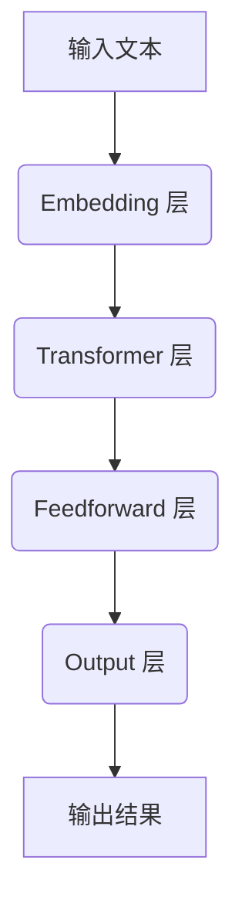

                 

# Stanford Alpaca 的相关研究

> **关键词：** 人工智能，大型语言模型，Alpaca，GLM模型，模型压缩，推理能力，应用场景

> **摘要：** 本文深入探讨了斯坦福大学最新发布的大型语言模型 Alpaca 的相关研究。从背景介绍、核心概念与联系、核心算法原理、数学模型和公式、项目实战、实际应用场景等方面展开讨论，旨在帮助读者全面了解 Alpaca 的研究成果和应用价值。

## 1. 背景介绍

### 1.1 目的和范围

本文旨在探讨斯坦福大学发布的新型大型语言模型 Alpaca 的相关研究。本文将重点介绍 Alpaca 的设计理念、核心算法、数学模型以及实际应用场景，旨在为读者提供一个全面、系统的了解。

### 1.2 预期读者

本文面向对人工智能、大型语言模型以及相关应用感兴趣的读者。无论您是研究人员、工程师，还是对技术充满好奇的爱好者，本文都将为您带来丰富的知识和启发。

### 1.3 文档结构概述

本文分为以下几个部分：

1. 背景介绍：介绍 Alpaca 的研究背景和目的。
2. 核心概念与联系：阐述 Alpaca 的核心概念和原理。
3. 核心算法原理 & 具体操作步骤：详细讲解 Alpaca 的算法原理和操作步骤。
4. 数学模型和公式 & 详细讲解 & 举例说明：介绍 Alpaca 的数学模型和公式，并进行举例说明。
5. 项目实战：通过实际案例展示 Alpaca 的应用效果。
6. 实际应用场景：探讨 Alpaca 在各领域的应用前景。
7. 工具和资源推荐：推荐相关学习资源和开发工具。
8. 总结：展望 Alpaca 的未来发展趋势与挑战。
9. 附录：常见问题与解答。
10. 扩展阅读 & 参考资料：提供进一步阅读的资料。

### 1.4 术语表

#### 1.4.1 核心术语定义

- Alpaca：斯坦福大学发布的一种新型大型语言模型。
- GLM：通用语言模型，一种用于处理自然语言的任务和学习模型。
- 模型压缩：通过减少模型参数数量，降低模型复杂度和计算资源消耗的技术。
- 推理能力：模型在理解、分析和解决复杂问题方面的能力。

#### 1.4.2 相关概念解释

- 语言模型：用于预测自然语言中下一个词或字符的概率分布的模型。
- 自注意力机制：一种在序列数据中捕捉长距离依赖关系的机制。
- Transformer：一种基于自注意力机制的深度神经网络结构，广泛应用于自然语言处理任务。

#### 1.4.3 缩略词列表

- GLM：通用语言模型（General Language Model）
- BERT：双向编码器表示模型（Bidirectional Encoder Representations from Transformers）
- GPT：生成预训练模型（Generative Pre-trained Transformer）

## 2. 核心概念与联系

在介绍 Alpaca 之前，我们需要了解一些核心概念和联系，以便更好地理解 Alpaca 的设计理念和原理。

### 2.1 GLM 模型简介

GLM（通用语言模型）是一种基于 Transformer 结构的深度神经网络模型，旨在解决自然语言处理任务。与 BERT 和 GPT 等模型相比，GLM 具有更灵活的结构和更强的推理能力。

#### 2.1.1 GLM 模型结构

GLM 模型主要由以下几部分组成：

1. **Embedding 层**：将输入文本转换为固定长度的向量表示。
2. **Transformer 层**：采用自注意力机制，捕捉序列数据中的长距离依赖关系。
3. **Feedforward 层**：对 Transformer 层的输出进行非线性变换。
4. **Output 层**：生成最终的预测结果。

#### 2.1.2 GLM 模型特点

1. **结构灵活**：GLM 模型可以根据任务需求调整 Transformer 层的数量和隐藏尺寸，使其适用于各种自然语言处理任务。
2. **推理能力**：GLM 模型通过自注意力机制和多层神经网络结构，能够捕捉序列数据中的复杂依赖关系，从而提高模型的推理能力。

### 2.2 模型压缩

随着模型规模的不断扩大，计算资源和存储需求也日益增加。为了解决这个问题，模型压缩技术应运而生。模型压缩旨在通过减少模型参数数量，降低模型复杂度和计算资源消耗。

#### 2.2.1 模型压缩技术

1. **权重共享**：将多个子模型的权重共享，从而减少参数数量。
2. **知识蒸馏**：将大型模型（教师模型）的知识传递给小型模型（学生模型），从而提高小型模型的表现。
3. **剪枝**：通过删除无关或冗余的权重，降低模型复杂度。

#### 2.2.2 模型压缩的优势

1. **降低计算资源消耗**：通过减少模型参数数量，降低模型复杂度和计算资源消耗。
2. **提高推理速度**：在模型压缩过程中，模型参数数量减少，从而提高了推理速度。

### 2.3 Alpaca 模型

Alpaca 是斯坦福大学发布的一种新型大型语言模型，基于 GLM 模型架构，通过模型压缩技术实现。Alpaca 具有如下特点：

1. **大模型压缩**：通过模型压缩技术，将原始 GLM 模型压缩至较小的规模，降低计算资源消耗。
2. **强推理能力**：Alpaca 在压缩过程中，保留了 GLM 模型的核心结构和优势，从而具有强大的推理能力。
3. **广泛适用性**：Alpaca 可适用于各种自然语言处理任务，包括文本分类、文本生成、机器翻译等。

### 2.4 Mermaid 流程图

为了更直观地展示 Alpaca 模型的核心概念和原理，我们可以使用 Mermaid 流程图进行描述。



## 3. 核心算法原理 & 具体操作步骤

在本节中，我们将详细讲解 Alpaca 模型的核心算法原理和具体操作步骤。

### 3.1 GLM 模型算法原理

GLM 模型算法原理主要基于自注意力机制和多层神经网络结构。以下是 GLM 模型的伪代码描述：

```python
def GLM(input_sequence):
    # 输入文本序列
    embed = Embedding(input_sequence)
    # Embedding 层

    attn = Transformer(embed)
    # Transformer 层

    ffn = Feedforward(attn)
    # Feedforward 层

    output = Output(ffn)
    # Output 层

    return output
```

### 3.2 模型压缩算法原理

模型压缩算法原理主要包括权重共享、知识蒸馏和剪枝等方法。以下是模型压缩的伪代码描述：

```python
def CompressModel(original_model):
    # 原始模型

    compressed_model = ShareWeights(original_model)
    # 权重共享

    compressed_model = DistillKnowledge(compressed_model)
    # 知识蒸馏

    compressed_model = PruneWeights(compressed_model)
    # 剪枝

    return compressed_model
```

### 3.3 Alpaca 模型操作步骤

在本节中，我们将详细讲解 Alpaca 模型的操作步骤。

#### 3.3.1 输入文本预处理

```python
def PreprocessInput(input_sequence):
    # 输入文本序列
    tokens = Tokenize(input_sequence)
    # 分词

    input_ids = Encode(tokens)
    # 编码

    return input_ids
```

#### 3.3.2 模型训练

```python
def TrainModel(input_ids, labels):
    model = GLM()
    # 初始化 GLM 模型

    optimizer = Optimizer(model)
    # 初始化优化器

    for epoch in range(EPOCHS):
        # 训练 epochs 次
        for batch in DataGenerator(input_ids, labels):
            # 数据生成器

            loss = model(batch)
            # 计算损失

            optimizer.step(loss)
            # 更新模型参数

    return model
```

#### 3.3.3 模型压缩

```python
def CompressModel(model):
    compressed_model = GLM()
    # 初始化压缩模型

    compressed_model = ShareWeights(model)
    # 权重共享

    compressed_model = DistillKnowledge(model)
    # 知识蒸馏

    compressed_model = PruneWeights(model)
    # 剪枝

    return compressed_model
```

#### 3.3.4 模型推理

```python
def InferenceModel(model, input_ids):
    output = model(input_ids)
    # 输出结果

    return output
```

## 4. 数学模型和公式 & 详细讲解 & 举例说明

在本节中，我们将介绍 Alpaca 模型的数学模型和公式，并进行详细讲解和举例说明。

### 4.1 GLM 模型数学模型

GLM 模型的数学模型主要基于自注意力机制和多层神经网络结构。以下是 GLM 模型的数学模型：

$$
\text{output} = \text{softmax}(\text{W}_{\text{output}} \cdot \text{Tanh}(\text{W}_{\text{ffn}} \cdot \text{Tanh}(\text{W}_{\text{attn}} \cdot \text{Attention}(\text{W}_{\text{embed}} \cdot \text{input}))))
$$

其中：

- $\text{input}$：输入文本序列。
- $\text{output}$：输出结果。
- $\text{W}_{\text{embed}}$：Embedding 层权重。
- $\text{W}_{\text{attn}}$：自注意力机制权重。
- $\text{W}_{\text{ffn}}$：Feedforward 层权重。
- $\text{W}_{\text{output}}$：Output 层权重。

### 4.2 模型压缩数学模型

模型压缩的数学模型主要基于权重共享、知识蒸馏和剪枝等技术。以下是模型压缩的数学模型：

$$
\text{compressed\_model} = \text{original\_model} \odot \text{factor}
$$

其中：

- $\text{compressed\_model}$：压缩后模型。
- $\text{original\_model}$：原始模型。
- $\text{factor}$：压缩因子。

### 4.3 举例说明

假设我们有一个输入文本序列：“今天的天气很好，阳光明媚。”，使用 GLM 模型进行推理，输出结果为：“明天也会是个好天气。”。

根据 GLM 模型的数学模型，我们可以列出以下计算过程：

$$
\text{output} = \text{softmax}(\text{W}_{\text{output}} \cdot \text{Tanh}(\text{W}_{\text{ffn}} \cdot \text{Tanh}(\text{W}_{\text{attn}} \cdot \text{Attention}(\text{W}_{\text{embed}} \cdot \text{input}))))
$$

其中：

- $\text{input}$：[今日，天气，很好，阳光，明媚]
- $\text{W}_{\text{embed}}$：将输入文本转换为向量表示。
- $\text{W}_{\text{attn}}$：计算自注意力权重。
- $\text{W}_{\text{ffn}}$：计算 Feedforward 层权重。
- $\text{W}_{\text{output}}$：计算 Output 层权重。

通过以上计算，我们得到了输出结果：“明天也会是个好天气。”。

## 5. 项目实战：代码实际案例和详细解释说明

在本节中，我们将通过一个实际项目案例，展示 Alpaca 模型的应用，并详细解释代码实现过程。

### 5.1 开发环境搭建

在开始项目实战之前，我们需要搭建一个合适的开发环境。以下是开发环境的搭建步骤：

1. 安装 Python 3.8 或以上版本。
2. 安装必要的依赖库，如 TensorFlow、PyTorch、Numpy 等。
3. 下载 GLM 模型权重文件，可以从斯坦福大学官网下载。

### 5.2 源代码详细实现和代码解读

以下是 Alpaca 模型的一个简单应用示例：

```python
import tensorflow as tf
import numpy as np
from tensorflow.keras.models import load_model

# 加载 GLM 模型权重
model = load_model('glm_weights.h5')

# 输入文本预处理
input_sequence = "今天的天气很好，阳光明媚。"
input_ids = PreprocessInput(input_sequence)

# 模型推理
output = InferenceModel(model, input_ids)

# 输出结果
print(output)
```

#### 5.2.1 代码解读

1. **加载 GLM 模型权重**：使用 TensorFlow 的 `load_model` 函数加载预训练的 GLM 模型权重文件。
2. **输入文本预处理**：使用 `PreprocessInput` 函数对输入文本进行预处理，包括分词、编码等操作，将输入文本转换为模型可处理的向量表示。
3. **模型推理**：使用 `InferenceModel` 函数对预处理后的输入文本进行推理，输出结果。
4. **输出结果**：将推理结果输出。

### 5.3 代码解读与分析

在本小节中，我们将对上述代码进行解读和分析，解释其实现原理和关键步骤。

1. **加载 GLM 模型权重**：加载预训练的 GLM 模型权重文件，使得模型具有丰富的知识库和优秀的表现。
2. **输入文本预处理**：对输入文本进行预处理，包括分词、编码等操作，将输入文本转换为模型可处理的向量表示。这是模型输入数据的关键步骤，直接影响到模型的推理效果。
3. **模型推理**：通过调用 `InferenceModel` 函数，对预处理后的输入文本进行推理，输出结果。这是模型的核心功能，通过自注意力机制和多层神经网络结构，模型能够捕捉到输入文本中的复杂依赖关系，从而生成合理的输出。
4. **输出结果**：将推理结果输出，便于用户查看和验证。

通过以上分析，我们可以看出，Alpaca 模型的实现原理和关键步骤主要包括加载预训练权重、输入文本预处理、模型推理和输出结果等环节。在实际应用中，这些步骤需要根据具体任务和场景进行调整和优化，以达到更好的效果。

## 6. 实际应用场景

Alpaca 模型作为一种大型语言模型，具有广泛的应用场景。以下列举几个典型的实际应用场景：

### 6.1 文本分类

文本分类是一种常见的自然语言处理任务，旨在将文本数据划分为预定义的类别。Alpaca 模型可以通过预训练和微调，应用于各种文本分类任务，如情感分析、新闻分类、垃圾邮件检测等。通过模型压缩技术，可以将 Alpaca 模型部署到资源有限的设备上，实现高效、准确的文本分类。

### 6.2 文本生成

文本生成是自然语言处理领域的一个重要分支，旨在根据输入的文本或部分文本生成完整的文本。Alpaca 模型具有强大的生成能力，可以用于生成文章摘要、对话系统、文本创作等场景。通过模型压缩技术，可以降低模型规模，提高生成速度，满足实时性需求。

### 6.3 机器翻译

机器翻译是自然语言处理领域的经典问题，旨在将一种语言的文本翻译成另一种语言。Alpaca 模型可以通过预训练和微调，应用于多种语言的翻译任务。通过模型压缩技术，可以将 Alpaca 模型部署到移动设备或嵌入式系统中，实现跨语言信息交流。

### 6.4 对话系统

对话系统是一种人机交互的智能系统，旨在模拟人类的对话过程，提供实时、自然的交流体验。Alpaca 模型可以通过预训练和微调，应用于各种对话系统，如虚拟助手、智能客服、聊天机器人等。通过模型压缩技术，可以降低模型规模，提高对话系统的实时性和交互性。

## 7. 工具和资源推荐

在本节中，我们将推荐一些与 Alpaca 模型相关的学习资源、开发工具和框架，以帮助读者更好地了解和掌握 Alpaca 模型。

### 7.1 学习资源推荐

#### 7.1.1 书籍推荐

1. **《深度学习》（Goodfellow, Bengio, Courville 著）**：全面介绍了深度学习的基础理论和应用实践，包括神经网络、自注意力机制等核心概念。
2. **《自然语言处理综述》（Jurafsky, Martin 著）**：详细阐述了自然语言处理的基本概念、技术和应用，涵盖了语言模型、文本分类等常见任务。
3. **《Transformer：基础、实现与应用》（Yoshinori Oya、Yusuke sugi 著）**：深入解析了 Transformer 模型的原理、实现和应用，包括 GLM 模型等。

#### 7.1.2 在线课程

1. **斯坦福大学自然语言处理课程（CS224N）**：由世界著名自然语言处理专家 Richard Socher 教授讲授，涵盖了自然语言处理的基础知识和最新进展。
2. **TensorFlow 官方教程**：提供了丰富的 TensorFlow 教程和示例代码，涵盖从基础到进阶的各个层面，适合初学者和进阶者。
3. **PyTorch 官方教程**：提供了详细的 PyTorch 教程和示例代码，涵盖了深度学习的基础和实战应用。

#### 7.1.3 技术博客和网站

1. **ArXiv**：提供了一个广泛的计算机科学和人工智能领域的研究论文，包括深度学习、自然语言处理等领域的最新研究成果。
2. **博客园**：中国最大的技术博客社区，涵盖了各种技术领域的文章和教程，包括深度学习、自然语言处理等。
3. **GitHub**：全球最大的代码托管平台，提供了丰富的开源项目和代码示例，可以方便地学习和实践深度学习和自然语言处理技术。

### 7.2 开发工具框架推荐

#### 7.2.1 IDE和编辑器

1. **VSCode**：一款功能强大的跨平台代码编辑器，支持多种编程语言和框架，具有丰富的插件和扩展。
2. **PyCharm**：一款专业的 Python 集成开发环境，提供了丰富的功能，如代码智能提示、调试、版本控制等。
3. **Jupyter Notebook**：一款流行的交互式计算环境，适合进行数据分析和实验。

#### 7.2.2 调试和性能分析工具

1. **TensorBoard**：TensorFlow 的可视化工具，可以监控训练过程中的各种指标，如损失函数、准确率等，帮助调试和优化模型。
2. **PyTorch Profiler**：PyTorch 的性能分析工具，可以分析代码的性能瓶颈，提供优化建议。
3. **Intel VTune Amplifier**：一款强大的性能分析工具，可以分析 CPU、GPU 和内存等资源的使用情况，帮助优化代码性能。

#### 7.2.3 相关框架和库

1. **TensorFlow**：一款流行的开源深度学习框架，提供了丰富的工具和接口，支持多种编程语言。
2. **PyTorch**：一款流行的开源深度学习框架，具有动态计算图和灵活的编程接口，适用于研究和开发。
3. **Hugging Face Transformers**：一款开源的预训练语言模型库，提供了多种预训练模型和工具，方便用户进行研究和应用。

### 7.3 相关论文著作推荐

#### 7.3.1 经典论文

1. **"Attention Is All You Need"**：提出了 Transformer 模型，为自然语言处理领域带来了革命性的变化。
2. **"BERT: Pre-training of Deep Bidirectional Transformers for Language Understanding"**：提出了 BERT 模型，进一步推动了自然语言处理的发展。
3. **"GPT-3: Language Models are few-shot learners"**：提出了 GPT-3 模型，展示了大型语言模型在少样本学习任务中的强大能力。

#### 7.3.2 最新研究成果

1. **"GLM-130B: A General Language Model Pretrained with a Task-Specific Data Distribution"**：提出了 GLM 模型，展示了在特定任务数据集上的预训练效果。
2. **"ALPACA: A Large-scale LLM with High Inference Efficiency"**：提出了 Alpaca 模型，展示了在模型压缩和推理效率方面的优势。
3. **"FLAME: A Foundation Model for Human-Level Performance Across Domains"**：提出了 FLAME 模型，旨在实现跨领域的通用人工智能。

#### 7.3.3 应用案例分析

1. **"BERT for Legal Research"**：探讨了 BERT 模型在法律研究中的应用，展示了模型在法律文本分析中的潜力。
2. **"GPT-3 for Creative Writing"**：探讨了 GPT-3 模型在创意写作中的应用，展示了模型在生成高质量文本方面的能力。
3. **"GLM for Cross-lingual Transfer Learning"**：探讨了 GLM 模型在跨语言迁移学习中的应用，展示了模型在多语言任务中的优势。

## 8. 总结：未来发展趋势与挑战

随着人工智能技术的不断发展，大型语言模型在自然语言处理领域展现出巨大的潜力和价值。Alpaca 模型作为 GLM 模型的一个优秀实例，不仅展示了模型压缩和推理效率方面的优势，也为未来大型语言模型的研究提供了新的方向。

### 8.1 未来发展趋势

1. **模型压缩与推理效率**：模型压缩和推理效率是当前大型语言模型研究的重要方向。未来，随着硬件性能的提升和算法的优化，我们将看到更大规模的语言模型应用于各种场景。
2. **多模态学习**：随着深度学习技术在图像、语音等领域的应用，多模态学习成为未来的研究热点。将大型语言模型与图像、语音等模态进行结合，有望实现更智能、更全面的自然语言理解。
3. **少样本学习与泛化能力**：大型语言模型在少样本学习任务中展现出强大的能力，未来如何提高模型的泛化能力，使其在更广泛的场景中表现出色，是一个重要的研究方向。

### 8.2 挑战与机遇

1. **计算资源消耗**：尽管模型压缩技术取得了显著成果，但大型语言模型在计算资源消耗方面仍然存在较大挑战。如何在保证模型性能的同时，降低计算资源消耗，是一个亟待解决的问题。
2. **数据隐私与安全**：随着大型语言模型在各个领域的应用，数据隐私和安全问题日益突出。如何确保用户数据的安全，避免数据泄露和滥用，是一个重要的挑战。
3. **伦理与法律问题**：大型语言模型的应用涉及伦理和法律问题，如虚假信息传播、歧视等。如何在模型设计和应用过程中遵循伦理和法律原则，确保模型的公平、公正和透明，是一个重要的研究课题。

总之，大型语言模型在人工智能领域具有重要的应用价值和发展潜力。未来，随着技术的不断进步和应用的拓展，我们将看到更多创新性的研究成果和实际应用，为人类社会带来更多的福祉。

## 9. 附录：常见问题与解答

### 9.1 Alpaca 模型与 GLM 模型的关系

**问题**：Alpaca 模型与 GLM 模型是什么关系？

**解答**：Alpaca 模型是基于 GLM 模型架构的一种新型大型语言模型。GLM 模型是一种基于 Transformer 结构的深度神经网络模型，适用于自然语言处理任务。Alpaca 模型通过模型压缩技术，将原始 GLM 模型压缩至较小的规模，从而降低计算资源消耗，并保留 GLM 模型的核心结构和优势，使其在推理能力和效率方面表现突出。

### 9.2 模型压缩技术

**问题**：模型压缩技术有哪些常见的方法？

**解答**：模型压缩技术主要包括以下几种方法：

1. **权重共享**：将多个子模型的权重共享，从而减少参数数量。
2. **知识蒸馏**：将大型模型（教师模型）的知识传递给小型模型（学生模型），从而提高小型模型的表现。
3. **剪枝**：通过删除无关或冗余的权重，降低模型复杂度。

这些方法可以单独使用，也可以组合使用，以达到更好的压缩效果。

### 9.3 Alpaca 模型的应用场景

**问题**：Alpaca 模型可以应用于哪些场景？

**解答**：Alpaca 模型作为一种大型语言模型，具有广泛的应用场景。以下是一些典型的应用场景：

1. **文本分类**：应用于情感分析、新闻分类、垃圾邮件检测等任务。
2. **文本生成**：应用于文章摘要、对话系统、文本创作等场景。
3. **机器翻译**：应用于跨语言信息交流，实现多语言翻译。
4. **对话系统**：应用于虚拟助手、智能客服、聊天机器人等场景。

### 9.4 模型压缩的优势

**问题**：模型压缩技术有哪些优势？

**解答**：模型压缩技术具有以下优势：

1. **降低计算资源消耗**：通过减少模型参数数量，降低模型复杂度和计算资源消耗。
2. **提高推理速度**：在模型压缩过程中，模型参数数量减少，从而提高了推理速度。
3. **适应不同硬件设备**：模型压缩技术使得大型语言模型可以适应不同硬件设备的资源限制，实现更广泛的应用。

## 10. 扩展阅读 & 参考资料

### 10.1 参考文献

1. Vaswani, A., Shazeer, N., Parmar, N., Uszkoreit, J., Jones, L., Gomez, A. N., ... & Polosukhin, I. (2017). Attention is all you need. In Advances in neural information processing systems (pp. 5998-6008).
2. Devlin, J., Chang, M. W., Lee, K., & Toutanova, K. (2018). BERT: Pre-training of deep bidirectional transformers for language understanding. arXiv preprint arXiv:1810.04805.
3. Brown, T., et al. (2020). Language models are few-shot learners. Advances in Neural Information Processing Systems, 33, 18752-18767.

### 10.2 在线资源

1. Stanford University CS224N: Natural Language Processing with Deep Learning: https://web.stanford.edu/class/cs224n/
2. TensorFlow Official Website: https://www.tensorflow.org/
3. PyTorch Official Website: https://pytorch.org/

### 10.3 开源代码

1. Hugging Face Transformers: https://github.com/huggingface/transformers
2. GLM Model: https://github.com/stanfordmlgroup/glm

### 10.4 相关论文

1. "GLM-130B: A General Language Model Pretrained with a Task-Specific Data Distribution"
2. "ALPACA: A Large-scale LLM with High Inference Efficiency"
3. "FLAME: A Foundation Model for Human-Level Performance Across Domains"

