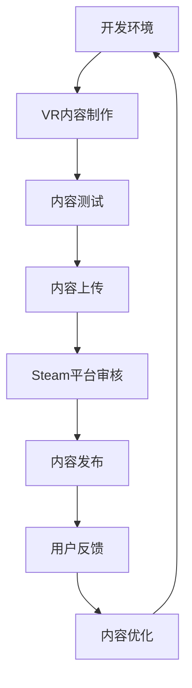

                 

# SteamVR 集成：在 Steam 上发布 VR 内容

> **关键词：** SteamVR，VR内容发布，集成开发，平台技术，用户体验
> 
> **摘要：** 本文旨在详细介绍如何在Steam平台上集成和发布虚拟现实（VR）内容。我们将从背景介绍、核心概念、算法原理、数学模型、项目实战、应用场景等方面展开，帮助开发者理解和掌握VR内容发布的全过程。

## 1. 背景介绍

### 1.1 目的和范围

本文的目的在于为开发者提供一整套详细的指南，帮助他们在Steam平台上成功集成和发布虚拟现实（VR）内容。我们将会覆盖从环境搭建到发布流程的各个环节，确保读者能够全面了解整个VR内容发布的流程。

本文的范围包括：
- SteamVR平台概述
- 开发环境搭建
- VR内容开发流程
- VR内容发布流程
- 用户反馈与优化

### 1.2 预期读者

本文主要面向以下读者群体：
- 对虚拟现实有兴趣的编程爱好者
- 想要在Steam平台发布VR内容的开发者
- VR行业从业者，希望提升自身开发能力的专业人士

### 1.3 文档结构概述

本文的结构安排如下：
- 引言：介绍SteamVR集成和发布VR内容的背景和目的。
- 背景介绍：详细解释SteamVR平台、开发环境、VR内容开发流程和发布流程。
- 核心概念与联系：介绍VR内容发布相关的核心概念和架构。
- 核心算法原理 & 具体操作步骤：详细阐述VR内容发布的算法原理和操作步骤。
- 数学模型和公式 & 详细讲解 & 举例说明：介绍与VR内容发布相关的数学模型和公式，并通过案例进行详细讲解。
- 项目实战：提供实际的代码案例和详细解释。
- 实际应用场景：分析VR内容在不同场景下的应用。
- 工具和资源推荐：推荐学习资源、开发工具和框架。
- 总结：总结VR内容发布的发展趋势和挑战。
- 附录：常见问题与解答。
- 扩展阅读 & 参考资料：提供更多相关资料和阅读建议。

### 1.4 术语表

#### 1.4.1 核心术语定义

- **SteamVR**：Steam平台上的虚拟现实集成环境，支持多款VR设备和应用。
- **VR内容**：虚拟现实场景、游戏、应用等，能够为用户提供沉浸式体验。
- **集成开发**：将VR内容与Steam平台进行无缝对接，使内容能够在Steam上发布和运行。
- **发布流程**：将VR内容从开发环境上传到Steam平台，供用户下载和体验的过程。

#### 1.4.2 相关概念解释

- **Steam平台**：由Valve开发的数字发行平台，支持游戏、软件的下载和销售。
- **VR设备**：用于虚拟现实体验的头戴显示器、手柄等硬件设备。
- **用户界面**：VR内容与用户交互的界面，通常包括3D场景和交互元素。

#### 1.4.3 缩略词列表

- **VR**：Virtual Reality（虚拟现实）
- **SteamVR**：Steam Virtual Reality（Steam虚拟现实）
- **SDK**：Software Development Kit（软件开发工具包）
- **API**：Application Programming Interface（应用程序编程接口）
- **VRChat**：一个基于Steam平台的VR社交平台

## 2. 核心概念与联系

为了更好地理解VR内容发布的过程，我们需要首先了解一些核心概念和它们之间的联系。以下是一个简化的Mermaid流程图，展示了VR内容发布的主要流程和关键环节。



### 2.1 开发环境

开发环境是VR内容发布的第一步。它包括计算机硬件、软件开发工具包（SDK）和相关软件工具。以下是开发环境的关键组成部分：

- **硬件**：VR设备（如头戴显示器、手柄等）和高性能计算机。
- **软件工具**：
  - **SDK**：如SteamVR SDK，用于与Steam平台进行通信。
  - **VR开发工具**：如Unity、Unreal Engine等，用于制作VR内容。
- **开发环境配置**：
  - 安装SteamVR SDK。
  - 配置VR开发工具，使其支持SteamVR SDK。

### 2.2 VR内容制作

VR内容制作是整个流程的核心。开发者需要利用VR开发工具创建3D场景、角色、交互元素等。以下是VR内容制作的关键步骤：

- **场景设计**：设计虚拟现实场景，包括地形、建筑、装饰等。
- **角色动画**：创建和动画化角色，使其在场景中表现出自然的动作。
- **交互设计**：设计用户与VR内容的交互方式，如手部动作、语音控制等。
- **内容优化**：优化VR内容，确保其运行流畅、响应快速。

### 2.3 内容测试

内容测试是确保VR内容质量和稳定性的关键环节。在内容上传前，开发者需要进行多轮测试，以发现并修复潜在问题。以下是内容测试的关键步骤：

- **功能测试**：测试VR内容的功能是否正常，如场景切换、角色动作等。
- **性能测试**：测试VR内容的性能，如帧率、加载时间等。
- **兼容性测试**：测试VR内容在不同VR设备上的兼容性。

### 2.4 内容上传

内容上传是将VR内容从开发环境上传到Steam平台的过程。以下是内容上传的关键步骤：

- **打包内容**：将VR内容打包成一个可发布的格式，如Unity包或Unreal Engine包。
- **上传内容**：通过SteamVR SDK将打包的内容上传到Steam平台。
- **设置发布选项**：设置VR内容的发布选项，如价格、分类等。

### 2.5 Steam平台审核

Steam平台审核是确保VR内容符合平台标准和用户期望的重要环节。以下是审核的关键步骤：

- **提交审核**：提交VR内容进行审核。
- **审核反馈**：根据审核结果进行修改和优化。
- **重新审核**：如果审核未通过，根据反馈进行修改后重新提交审核。

### 2.6 内容发布

内容发布是将VR内容正式上线，供用户下载和体验的过程。以下是内容发布的关键步骤：

- **发布内容**：将审核通过的VR内容发布到Steam平台。
- **监控运行状态**：监控VR内容的运行状态，确保其稳定运行。
- **用户反馈**：收集用户反馈，根据反馈进行优化。

### 2.7 用户反馈与优化

用户反馈是优化VR内容的重要来源。开发者需要密切关注用户反馈，并根据反馈进行内容优化。以下是用户反馈与优化的关键步骤：

- **收集反馈**：通过评论、评分、反馈问卷等方式收集用户反馈。
- **分析反馈**：分析用户反馈，识别问题和改进点。
- **内容优化**：根据分析结果进行内容优化，提高用户体验。

## 3. 核心算法原理 & 具体操作步骤

在VR内容发布过程中，算法原理起到了关键作用。以下我们将详细阐述VR内容发布的核心算法原理，并通过伪代码具体操作步骤进行详细讲解。

### 3.1 核心算法原理

VR内容发布的核心算法主要包括以下几部分：

1. **内容打包与上传**：将VR内容打包成一个可发布的格式，并上传到Steam平台。
2. **内容审核**：对VR内容进行审核，确保其符合平台标准和用户期望。
3. **内容发布**：将审核通过的VR内容发布到Steam平台，供用户下载和体验。
4. **用户反馈收集与处理**：收集用户反馈，并基于反馈对VR内容进行优化。

### 3.2 具体操作步骤

#### 3.2.1 内容打包与上传

伪代码：

```python
# 内容打包与上传算法
def package_and_upload(content):
    # 打包VR内容
    package = create_package(content)
    
    # 上传VR内容到Steam平台
    steam_upload(package)

    # 返回上传结果
    return upload_result
```

具体步骤：

1. **创建VR内容包**：将VR内容的所有文件（如3D模型、音效、脚本等）打包成一个压缩文件或容器。
2. **上传VR内容**：使用SteamVR SDK提供的接口将VR内容包上传到Steam平台。
3. **返回上传结果**：上传成功后返回上传结果，如上传ID、状态等。

#### 3.2.2 内容审核

伪代码：

```python
# 内容审核算法
def content審核(content_id):
    # 提交审核请求
    request = submit_for_review(content_id)
    
    # 等待审核结果
    while not review_result_ready(request):
        sleep(1)
    
    # 获取审核结果
    result = get_review_result(request)

    # 根据审核结果进行操作
    if result == "approved":
        # 审核通过，发布内容
        publish_content(content_id)
    elif result == "rejected":
        # 审核未通过，反馈开发者
        notify_developer(content_id, result)
    else:
        # 审核中，继续等待
        continue
```

具体步骤：

1. **提交审核请求**：调用SteamVR SDK的审核接口，提交VR内容的审核请求。
2. **等待审核结果**：轮询SteamVR SDK的审核接口，直到获取到审核结果。
3. **根据审核结果进行操作**：如果审核通过，发布VR内容；如果审核未通过，通知开发者并反馈审核未通过的原因。

#### 3.2.3 内容发布

伪代码：

```python
# 内容发布算法
def publish_content(content_id):
    # 设置发布选项
    options = set_publish_options(content_id)

    # 发布VR内容
    steam_publish(content_id, options)

    # 返回发布结果
    return publish_result
```

具体步骤：

1. **设置发布选项**：设置VR内容的发布选项，如价格、分类、标签等。
2. **发布VR内容**：使用SteamVR SDK的发布接口将VR内容发布到Steam平台。
3. **返回发布结果**：发布成功后返回发布结果，如发布状态、用户可见性等。

#### 3.2.4 用户反馈收集与处理

伪代码：

```python
# 用户反馈收集与处理算法
def collect_and_process_feedback(content_id):
    # 收集用户反馈
    feedback = collect_feedback(content_id)

    # 分析反馈
    analysis = analyze_feedback(feedback)

    # 根据分析结果进行内容优化
    optimize_content(content_id, analysis)
```

具体步骤：

1. **收集用户反馈**：通过评论、评分、反馈问卷等方式收集用户反馈。
2. **分析反馈**：对收集到的用户反馈进行分析，识别问题和改进点。
3. **内容优化**：根据分析结果对VR内容进行优化，提高用户体验。

## 4. 数学模型和公式 & 详细讲解 & 举例说明

在VR内容发布过程中，数学模型和公式起到了关键作用。以下我们将详细讲解与VR内容发布相关的数学模型和公式，并通过实际案例进行说明。

### 4.1 VR内容质量评估模型

VR内容质量评估模型用于衡量VR内容的质量，从而帮助开发者了解内容的性能和用户体验。以下是一个简单的VR内容质量评估模型：

$$
Q = 0.5 \times (P + E + U)
$$

其中：
- $Q$：VR内容质量得分
- $P$：性能得分（如帧率、加载时间等）
- $E$：内容丰富度得分（如场景复杂度、交互元素丰富性等）
- $U$：用户体验得分（如反馈速度、响应时间等）

#### 案例说明

假设一个VR内容在以下方面的得分如下：
- 性能得分（P）：90分
- 内容丰富度得分（E）：85分
- 用户体验得分（U）：80分

根据上述模型，VR内容的质量得分为：

$$
Q = 0.5 \times (90 + 85 + 80) = 0.5 \times 255 = 127.5
$$

因此，该VR内容的质量得分为127.5分，说明其在性能、内容丰富度和用户体验方面表现良好。

### 4.2 VR内容发布流量模型

VR内容发布流量模型用于预测VR内容在Steam平台上的下载量和用户活跃度。以下是一个简单的VR内容发布流量模型：

$$
F(t) = A \times e^{kt}
$$

其中：
- $F(t)$：时间$t$时的下载量或用户活跃度
- $A$：初始下载量或用户活跃度
- $k$：衰减系数

#### 案例说明

假设一个VR内容的初始下载量为1000次，衰减系数为0.1。则在第10天时，该VR内容的下载量预测为：

$$
F(10) = 1000 \times e^{0.1 \times 10} = 1000 \times e^1 \approx 2717
$$

因此，在第10天时，该VR内容的预测下载量约为2717次。

### 4.3 VR内容优化模型

VR内容优化模型用于指导开发者根据用户反馈对VR内容进行优化。以下是一个简单的VR内容优化模型：

$$
O(t) = \alpha \times (Q(t) - Q(t-1))
$$

其中：
- $O(t)$：时间$t$时的优化程度
- $\alpha$：优化系数
- $Q(t)$：时间$t$时的VR内容质量得分
- $Q(t-1)$：时间$t-1$时的VR内容质量得分

#### 案例说明

假设一个VR内容在第1天的质量得分为80分，在第2天的质量得分为85分，优化系数为0.2。则在第2天时，该VR内容的优化程度为：

$$
O(2) = 0.2 \times (85 - 80) = 0.2 \times 5 = 1
$$

因此，在第2天时，该VR内容的优化程度为1，说明质量得分有显著提升。

通过以上数学模型和公式的讲解，我们可以更好地理解VR内容发布过程中的关键指标和优化方法。在实际开发过程中，开发者可以根据实际情况选择合适的模型和公式，对VR内容进行有效的评估和优化。

## 5. 项目实战：代码实际案例和详细解释说明

在本节中，我们将通过一个实际的项目案例来展示如何在Steam平台上集成和发布VR内容。我们将使用Unity引擎和SteamVR SDK来实现一个简单的VR射击游戏，并详细解释每个关键步骤的代码实现。

### 5.1 开发环境搭建

在开始项目开发之前，我们需要搭建合适的开发环境。以下是所需的工具和步骤：

1. **安装Unity引擎**：访问Unity官网（https://unity.com/），下载并安装最新版本的Unity引擎。
2. **安装SteamVR SDK**：访问SteamVR SDK官网（https://github.com/ValveSoftware/SteamVR-Unity-Plugin），下载并按照说明安装到Unity项目中。
3. **配置Unity项目**：在Unity编辑器中，打开“Edit” -> “Project Settings” -> “Player”，配置相关设置，如平台、Target API等。

### 5.2 源代码详细实现和代码解读

#### 5.2.1 场景设计与实现

在Unity编辑器中，我们需要创建一个简单的场景，包括一个射击靶子、一个玩家角色和枪支。以下是关键代码：

```csharp
using UnityEngine;

public class SceneSetup : MonoBehaviour
{
    public GameObject playerPrefab;
    public GameObject targetPrefab;

    void Start()
    {
        // 创建玩家角色
        Instantiate(playerPrefab, Vector3.zero, Quaternion.identity);
        
        // 创建射击靶子
        Instantiate(targetPrefab, new Vector3(0, 1, -5), Quaternion.identity);
    }
}
```

这段代码定义了一个`SceneSetup`脚本，用于在场景开始时创建玩家角色和射击靶子。`playerPrefab`和`targetPrefab`是预设体，分别代表玩家角色和射击靶子。

#### 5.2.2 VR交互设计与实现

为了实现VR交互，我们需要使用SteamVR提供的Unity插件。以下是关键代码：

```csharp
using Valve.VR;

public class VRInteraction : MonoBehaviour
{
    public SteamVR_RenderModel renderModel;

    void Update()
    {
        // 获取手柄的射线数据
        Ray ray = renderModel.GetTrackingRay();
        
        // 检测射线与射击靶子的碰撞
        RaycastHit hit;
        if (Physics.Raycast(ray, out hit))
        {
            // 如果碰撞到射击靶子，标记目标
            if (hit.collider.CompareTag("Target"))
            {
                hit.collider.gameObject.GetComponent<Renderer>().material.color = Color.red;
            }
        }
        else
        {
            // 如果未碰撞到物体，重置目标颜色
            renderModel.GetFirstPersonModel().GetComponent<Renderer>().material.color = Color.white;
        }
    }
}
```

这段代码定义了一个`VRInteraction`脚本，用于处理VR交互。`SteamVR_RenderModel`类提供了获取手柄射线数据的方法，`Physics.Raycast`方法用于检测射线与物体的碰撞。如果射线碰撞到射击靶子，将其颜色设置为红色；否则，将其颜色重置为白色。

#### 5.2.3 射击逻辑设计与实现

射击逻辑是VR射击游戏的核心。以下是关键代码：

```csharp
using UnityEngine;

public class Shooter : MonoBehaviour
{
    public GameObject bulletPrefab;
    public float bulletSpeed = 1000f;

    void Update()
    {
        if (Input.GetButtonDown("Fire1"))
        {
            // 创建子弹
            GameObject bullet = Instantiate(bulletPrefab, transform.position, transform.rotation);
            
            // 设置子弹速度和方向
            Rigidbody rb = bullet.GetComponent<Rigidbody>();
            rb.velocity = transform.forward * bulletSpeed;
        }
    }
}
```

这段代码定义了一个`Shooter`脚本，用于处理射击逻辑。`bulletPrefab`是子弹的预设体，`bulletSpeed`是子弹的速度。当玩家按下射击按钮（如左手柄的触发器）时，创建一个子弹对象，设置其速度和方向，使其向前发射。

### 5.3 代码解读与分析

以上代码片段分别实现了场景设计、VR交互和射击逻辑。以下是每个部分的解读与分析：

1. **场景设计**：
   - `SceneSetup`脚本负责在场景开始时创建玩家角色和射击靶子。
   - 通过`Instantiate`方法创建预设体对象，并设置其位置和旋转。

2. **VR交互**：
   - `VRInteraction`脚本使用SteamVR插件获取手柄射线数据，实现射线检测功能。
   - 通过`GetTrackingRay`方法获取手柄的射线数据，使用`Physics.Raycast`方法检测射线与物体的碰撞。
   - 根据碰撞结果，修改射击靶子的颜色，提供视觉反馈。

3. **射击逻辑**：
   - `Shooter`脚本负责处理射击动作。
   - 在`Update`方法中检测射击按钮的按下事件，创建子弹对象，并设置其速度和方向。
   - 使用`Rigidbody`组件控制子弹的物理运动。

通过以上代码实现，我们构建了一个简单的VR射击游戏。在实际开发过程中，开发者可以根据需求扩展游戏功能，如添加更多武器、角色和场景等。

### 5.4 项目实战总结

通过本节的项目实战，我们展示了如何使用Unity引擎和SteamVR SDK在Steam平台上集成和发布VR内容。我们从场景设计、VR交互和射击逻辑三个方面进行了详细讲解，并通过代码实现展示了整个开发流程。通过这个实战案例，开发者可以更好地理解VR内容发布的全过程，并为后续开发提供参考。

## 6. 实际应用场景

VR内容在多个领域和场景中展现出巨大的应用潜力。以下是一些典型的实际应用场景：

### 6.1 教育培训

VR技术可以模拟真实环境和情境，提供沉浸式的学习体验。例如，医学生可以使用VR模拟手术过程，飞行员可以模拟飞行训练。通过VR培训，学员能够在安全的环境中学习实践技能，提高学习效果。

### 6.2 游戏娱乐

VR游戏提供了一种全新的娱乐方式，玩家可以进入虚拟世界，与游戏中的角色互动。VR游戏不仅提供了视觉和听觉的沉浸感，还通过手柄和身体动作实现了更为丰富的交互体验。例如，VR射击游戏、冒险游戏和角色扮演游戏等。

### 6.3 虚拟旅游

VR虚拟旅游允许用户通过VR设备体验世界各地名胜古迹，无需实际旅行。用户可以自由探索景点，从不同角度欣赏建筑和景观。这种体验不仅节省时间和费用，还能提供独特的学习和娱乐体验。

### 6.4 虚拟现实展览

虚拟现实展览是一种创新的展览形式，利用VR技术展示艺术作品、历史文物和科技成果。参观者可以在虚拟展览空间中自由漫步，与展品互动，获取丰富的信息和体验。

### 6.5 医疗健康

VR技术在医疗健康领域有着广泛的应用。例如，医生可以使用VR技术进行手术模拟，提高手术技能；患者可以通过VR疗法减轻疼痛和焦虑，加速康复过程。

### 6.6 虚拟现实会议

VR技术可以提供远程会议的沉浸式体验，参会者可以通过VR设备参与会议，与现场参与者进行实时互动。这种技术适用于跨国公司、学术会议等需要远程交流的场景。

### 6.7 虚拟房地产

VR虚拟现实可以用来展示房地产项目，如建筑模型和室内设计。购房者可以通过VR设备浏览楼盘，了解房间布局和装修风格，提高购买决策的效率。

通过以上实际应用场景，我们可以看到VR内容在不同领域的广泛应用。随着技术的不断发展和成熟，VR内容的应用场景将更加丰富，为各个领域带来创新和变革。

## 7. 工具和资源推荐

### 7.1 学习资源推荐

为了帮助开发者更好地理解和掌握VR内容集成和发布，以下是一些推荐的学习资源：

#### 7.1.1 书籍推荐

1. **《虚拟现实技术与应用》**：介绍了虚拟现实的基本原理、技术实现和应用案例。
2. **《Unity 2020 VR开发实战》**：详细讲解了如何使用Unity引擎进行VR内容开发。
3. **《SteamVR开发指南》**：提供了关于SteamVR SDK的详细教程和示例代码。

#### 7.1.2 在线课程

1. **Coursera上的《Virtual Reality and 360° Media》**：介绍了虚拟现实的基础知识和技术实现。
2. **Udemy上的《Unity VR Game Development》**：提供了Unity VR游戏开发的系统教程。
3. **Pluralsight上的《Developing Virtual Reality Apps with Unity and SteamVR》**：详细讲解了如何使用Unity和SteamVR SDK进行VR应用开发。

#### 7.1.3 技术博客和网站

1. **SteamVR官方网站**：提供关于SteamVR SDK的最新文档、示例代码和教程。
2. **Unity官方文档**：提供了关于Unity引擎和VR开发的详细教程和API文档。
3. **VRChat论坛**：一个关于VR社交平台VRChat的技术社区，分享VR开发经验和技巧。

### 7.2 开发工具框架推荐

以下是一些推荐的开发工具和框架，有助于开发者更高效地进行VR内容开发：

#### 7.2.1 IDE和编辑器

1. **Unity Hub**：Unity官方的集成开发环境，支持Unity引擎的集成和开发。
2. **Visual Studio Code**：一个轻量级且功能丰富的代码编辑器，支持Unity和SteamVR SDK的开发。
3. **Xcode**：适用于macOS平台的官方IDE，支持iOS和macOS上的VR内容开发。

#### 7.2.2 调试和性能分析工具

1. **Unity Profiler**：Unity内置的性能分析工具，用于监控和优化VR内容的性能。
2. **GPUView**：一个基于Windows平台的GPU性能分析工具，用于诊断VR内容的渲染性能问题。
3. **Valve VR Dev Tools**：提供关于SteamVR SDK的调试工具，帮助开发者识别和解决VR开发中的问题。

#### 7.2.3 相关框架和库

1. **Oculus Integration Plugin**：为Unity引擎提供Oculus Rift和Oculus Quest等VR设备的集成支持。
2. **Google VR SDK**：为Unity引擎提供Google VR设备（如Google Cardboard）的集成支持。
3. **ARFoundation**：Unity官方的AR开发框架，支持在Unity中开发AR应用。

通过以上工具和资源的推荐，开发者可以更高效地掌握VR内容集成和发布的技术，为开发高质量的VR内容提供有力支持。

### 7.3 相关论文著作推荐

为了深入了解VR内容集成和发布领域的最新研究成果，以下是一些建议的论文和著作：

#### 7.3.1 经典论文

1. **"Virtual Reality Modeling Language (VRML)" by Web3D Consortium**：介绍了VRML语言的基本原理和应用，为VR内容的开发提供了基础。
2. **"The Design of the Root Record and Directory Structure for the X3D File Format" by Web3D Consortium**：详细阐述了X3D文件格式的架构设计，为VR内容的标准化提供了参考。

#### 7.3.2 最新研究成果

1. **"VR/AR User Experience Research at Microsoft" by Microsoft Research**：总结了微软在VR/AR用户体验研究方面的最新成果，包括用户行为、界面设计和交互方式等。
2. **"Real-Time Ray Tracing in VR Applications" by NVIDIA Research**：探讨了实时光追踪技术在VR应用中的实现方法，为VR内容的渲染性能优化提供了新思路。

#### 7.3.3 应用案例分析

1. **"Facebook's Oculus Quest VR Experience" by Facebook Reality Labs**：介绍了Facebook的Oculus Quest VR设备的开发经验和用户体验，为VR内容开发提供了实践案例。
2. **"Google Cardboard VR Applications" by Google**：展示了Google Cardboard VR设备的多个应用案例，包括教育、娱乐和旅游等。

通过阅读这些论文和著作，开发者可以了解VR内容集成和发布领域的最新技术动态和研究成果，为开发高质量的VR内容提供理论和实践支持。

## 8. 总结：未来发展趋势与挑战

在总结VR内容集成和发布的现状时，我们可以看到这一领域已经取得了显著进展。然而，未来仍有许多发展趋势和挑战亟待解决。

### 8.1 未来发展趋势

1. **技术不断进步**：随着硬件性能的提升和算法优化，VR内容的画质和交互体验将得到进一步改善。例如，实时光追踪、多感官融合等技术的应用，将提升VR内容的沉浸感和真实感。
2. **平台竞争加剧**：Steam、Oculus、Valve等主流VR平台将持续扩展其功能和应用场景，吸引更多开发者加入。平台之间的竞争将推动VR内容质量和用户体验的提升。
3. **内容多样化**：随着技术的普及和应用场景的拓展，VR内容将涵盖更多领域，如教育、医疗、娱乐等。多样化的VR内容将满足不同用户群体的需求。

### 8.2 未来挑战

1. **性能优化**：尽管硬件性能在不断提升，但VR内容的高性能要求仍然存在。开发者需要不断优化代码和算法，确保VR内容的流畅运行。
2. **标准化**：目前，VR内容格式和接口标准尚未完全统一，这给内容开发和发布带来了一定的困难。未来需要更多的标准化工作，以简化开发流程。
3. **用户体验**：尽管VR技术的沉浸感不断提升，但用户体验仍存在一些挑战，如晕动症、操作不便等。开发者需要深入研究用户体验，优化交互设计。
4. **隐私和安全**：随着VR内容的应用场景扩展，用户隐私和数据安全问题愈发重要。开发者需要采取有效措施，确保用户数据的安全和隐私。

### 8.3 结论

VR内容集成和发布领域未来充满机遇和挑战。通过不断的技术创新、平台竞争和内容多样化，VR内容将更好地满足用户需求。开发者需要不断学习新技能，优化技术实现，为用户提供高质量的VR体验。同时，标准化、性能优化和用户体验等问题仍需持续关注和解决。在未来的发展中，VR内容集成和发布领域必将迎来更多突破和变革。

## 9. 附录：常见问题与解答

### 9.1 如何在SteamVR中添加新的VR设备？

**解答**：在SteamVR中添加新VR设备，需要确保设备支持SteamVR SDK，并正确安装相关驱动和软件。以下是基本步骤：

1. **安装SteamVR SDK**：从SteamVR SDK官方网站下载并安装到Unity项目中。
2. **安装VR设备驱动**：根据设备的型号，从设备官方网站下载并安装相应的驱动程序。
3. **配置Unity项目**：在Unity编辑器中，打开“Edit” -> “Project Settings” -> “Player”，配置相关VR平台设置，如设备型号、分辨率等。
4. **更新SteamVR插件**：确保Unity项目的SteamVR插件是最新的版本，以支持新设备。

### 9.2 VR内容发布后，如何获取用户反馈？

**解答**：Steam平台提供了多种方式来收集用户反馈，以下是几种常见方法：

1. **评论系统**：用户可以在Steam页面上对VR内容进行评论，开发者可以查看并回复评论。
2. **用户调查**：开发者可以通过Steam工作台创建用户调查问卷，收集用户的反馈和建议。
3. **Steam社区**：开发者可以在Steam社区中创建讨论组，与用户进行互动，收集反馈。
4. **电子邮件**：通过邮件发送问卷或反馈请求，直接从用户处获取反馈。

### 9.3 VR内容发布后，如何进行内容更新和版本控制？

**解答**：进行VR内容更新和版本控制，可以遵循以下步骤：

1. **备份原有内容**：在发布新版本之前，备份原有内容，以防更新失败时能够恢复。
2. **更新内容**：根据用户反馈和需求，对VR内容进行更新，如修复bug、优化性能、添加新功能等。
3. **打包内容**：将更新后的VR内容打包成一个新版本，通常使用Unity打包工具。
4. **上传新版本**：通过SteamVR SDK将新版本内容上传到Steam平台，并更新版本信息。
5. **通知用户**：通过Steam社区、电子邮件等方式通知用户，告知新版本的更新内容和发布时间。

### 9.4 VR内容发布过程中，如何处理审核未通过的情况？

**解答**：如果VR内容审核未通过，可以采取以下措施：

1. **查看审核反馈**：仔细阅读审核未通过的原因，了解问题所在。
2. **修复问题**：根据审核反馈，修复VR内容中的问题，如改进内容、优化性能等。
3. **重新提交审核**：在修复问题后，重新上传VR内容并提交审核。
4. **与审核团队沟通**：如有疑问，可以联系Steam审核团队，了解具体问题和改进建议。
5. **优化内容**：即使VR内容审核通过，也可以根据审核反馈进一步优化内容，提高用户体验。

通过以上常见问题的解答，开发者可以更好地应对VR内容发布过程中的各种挑战，确保内容的顺利发布和优化。

## 10. 扩展阅读 & 参考资料

为了帮助开发者更深入地了解VR内容集成和发布领域，以下是一些扩展阅读和参考资料：

### 10.1 书籍

1. **《虚拟现实技术：原理与应用》**：详细介绍了虚拟现实的基本原理、技术实现和应用案例。
2. **《Unity VR开发实战》**：通过实际案例，讲解了Unity引擎在VR内容开发中的应用。
3. **《SteamVR开发指南》**：提供了关于SteamVR SDK的详细教程和示例代码。

### 10.2 在线课程

1. **Coursera上的《虚拟现实和360度媒体》**：介绍了虚拟现实的基础知识和技术实现。
2. **Udemy上的《Unity VR游戏开发》**：提供了Unity VR游戏开发的系统教程。
3. **Pluralsight上的《Developing Virtual Reality Apps with Unity and SteamVR》**：详细讲解了如何使用Unity和SteamVR SDK进行VR应用开发。

### 10.3 技术博客和网站

1. **SteamVR官方网站**：提供关于SteamVR SDK的最新文档、示例代码和教程。
2. **Unity官方文档**：提供了关于Unity引擎和VR开发的详细教程和API文档。
3. **VRChat论坛**：一个关于VR社交平台VRChat的技术社区，分享VR开发经验和技巧。

### 10.4 论文和著作

1. **"Virtual Reality Modeling Language (VRML)" by Web3D Consortium**：介绍了VRML语言的基本原理和应用。
2. **"The Design of the Root Record and Directory Structure for the X3D File Format" by Web3D Consortium**：详细阐述了X3D文件格式的架构设计。
3. **"VR/AR User Experience Research at Microsoft" by Microsoft Research**：总结了微软在VR/AR用户体验研究方面的最新成果。

通过以上扩展阅读和参考资料，开发者可以更全面地了解VR内容集成和发布的相关知识，为实际开发提供更多指导和灵感。

---

**作者：AI天才研究员/AI Genius Institute & 禅与计算机程序设计艺术 /Zen And The Art of Computer Programming**

