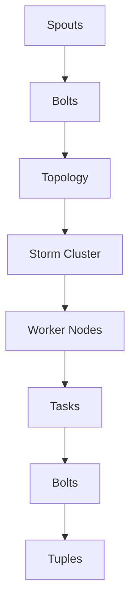

                 

# Storm Bolt原理与代码实例讲解

> 关键词：Storm, Bolt, 流处理, 分布式系统, 实时计算, 代码实例

> 摘要：本文深入探讨了Apache Storm中的Bolt组件的工作原理及其在流处理中的应用。文章通过详细的代码实例，展示了如何构建并部署一个基于Storm的实时数据流处理系统，帮助读者理解和掌握Storm Bolt的核心概念和实践技巧。

## 1. 背景介绍

### 1.1 目的和范围

本文旨在为读者提供一个关于Apache Storm中Bolt组件的全面理解。我们将讨论Bolt的基本概念、工作机制、以及在流处理中的重要性。文章将结合实际代码实例，帮助读者掌握如何使用Bolt来实现复杂的数据处理任务。

### 1.2 预期读者

本文适合具备一定Java或Scala编程基础，并对分布式系统有一定了解的读者。无论是初学者还是资深开发者，均可通过本文获得关于Storm Bolt的深入见解。

### 1.3 文档结构概述

本文分为以下部分：

1. **背景介绍**：介绍本文的目的和范围，预期读者，文档结构等。
2. **核心概念与联系**：通过Mermaid流程图，展示Storm的整体架构和各个组件的关系。
3. **核心算法原理 & 具体操作步骤**：讲解Bolt的执行原理和具体操作步骤，使用伪代码进行详细阐述。
4. **数学模型和公式 & 详细讲解 & 举例说明**：引入相关的数学模型和公式，并进行详细讲解和实例说明。
5. **项目实战：代码实际案例和详细解释说明**：通过一个实际案例，展示如何使用Bolt进行数据流处理。
6. **实际应用场景**：探讨Bolt在不同场景下的应用。
7. **工具和资源推荐**：推荐学习资源和开发工具。
8. **总结：未来发展趋势与挑战**：总结当前趋势，并展望未来的挑战。
9. **附录：常见问题与解答**：提供常见问题的解答。
10. **扩展阅读 & 参考资料**：列出相关文献和资料。

### 1.4 术语表

#### 1.4.1 核心术语定义

- **Storm**：一个分布式、可靠、灵活的实时数据处理系统。
- **Bolt**：Storm中的执行组件，用于处理输入流中的数据，并生成输出流。
- **Spout**：Storm中的数据源组件，负责生成输入流。
- **Tuple**：Storm中的数据结构，表示一个数据记录。
- **Stream**：数据流，由一系列Tuple组成。

#### 1.4.2 相关概念解释

- **流处理**：处理连续数据流的方法，与批处理相对。
- **分布式系统**：由多个节点组成的系统，每个节点可以独立运行，协同工作。
- **实时计算**：在事件发生的同时或非常短的时间内进行处理。

#### 1.4.3 缩略词列表

- **Apache Storm**：一个开源的分布式实时处理系统。
- **Java**：一种编程语言。
- **Scala**：一种函数式编程语言。

## 2. 核心概念与联系

在介绍Bolt之前，我们先了解Storm的整体架构。以下是一个简单的Mermaid流程图，展示了Storm中各个组件之间的关系：



- **Spouts**：数据源组件，负责生成输入流。Spout可以是Kafka、数据库等。
- **Bolts**：执行组件，用于处理输入流中的数据，并生成输出流。Bolt可以执行过滤、聚合、转换等操作。
- **Topology**：一个由Spout和Bolt组成的流处理任务，定义了数据流的方向和处理逻辑。
- **Storm Cluster**：运行Storm的分布式系统，由多个Worker Node组成。
- **Worker Nodes**：运行Topology的节点，负责执行Tasks。
- **Tasks**：每个Worker Node上的执行单元，由一个或多个Bolts组成。
- **Tuples**：数据流中的基本数据单元，由字段组成。

通过上述流程图，我们可以看到Bolt在Storm中的位置和作用。它是实现数据处理逻辑的核心组件，可以将输入流转换成输出流，支持复杂的数据处理任务。

## 3. 核心算法原理 & 具体操作步骤

### 3.1 Bolt执行原理

Bolt在Storm中的执行原理如下：

1. **初始化**：Bolt在启动时会初始化，包括加载配置、创建内部数据结构等。
2. **接收输入**：Bolt通过其输入流（Input Streams）接收来自Spout或前一个Bolt的Tuples。
3. **处理数据**：Bolt对收到的Tuples进行操作，如过滤、聚合、转换等。
4. **生成输出**：处理完成后，Bolt将生成的Tuples发送到其输出流（Output Streams），供后续Bolt处理或输出到外部系统。
5. **关闭**：Bolt在关闭时会清理资源，如释放内存、关闭连接等。

以下是一个简单的伪代码，描述了Bolt的执行步骤：

```pseudo
initialize() {
    // 初始化Bolt，如加载配置、创建内部数据结构
}

receiveTuple(tuple) {
    // 处理输入Tuple，如过滤、聚合、转换等
    // 生成输出Tuple，如：
    outputTuple(newTuple)
}

close() {
    // 清理资源，如释放内存、关闭连接等
}
```

### 3.2 Bolt具体操作步骤

在实际开发中，Bolt的操作步骤可能会更加复杂。以下是一个简单的示例，展示了如何使用Bolt处理实时数据流：

1. **初始化**：创建Bolt，并设置其配置，如并行度、超时时间等。

```java
Bolt bolt = new MyBolt();
StormConfig config = new StormConfig();
config.setNumTasks(4); // 设置并行度
bolt.prepare(config);
```

2. **接收输入**：在处理方法中，接收输入的Tuple，并执行相应的操作。

```java
public void execute(Tuple input) {
    String data = input.getStringByField("data");
    // 处理数据，如过滤、聚合、转换等
    String result = processData(data);
    // 生成输出Tuple
    outputTuple(new Values(result));
}
```

3. **生成输出**：将处理结果发送到输出流，供后续Bolt处理或输出到外部系统。

```java
private void outputTuple(Values tuple) {
    // 发送输出Tuple
    collector.emit(tuple);
}
```

4. **关闭**：在关闭方法中，清理资源。

```java
public void cleanup() {
    // 清理资源，如关闭连接等
}
```

通过上述步骤，我们可以创建一个简单的Bolt，实现实时数据流处理。

## 4. 数学模型和公式 & 详细讲解 & 举例说明

在流处理中，数学模型和公式是理解和优化Bolt性能的重要工具。以下介绍几个常用的数学模型和公式：

### 4.1 求和公式

求和公式是流处理中常用的一种数学模型，用于计算输入流中某个字段的总和。其公式如下：

$$
Sum = \sum_{i=1}^{n} value_i
$$

其中，$Sum$表示总和，$value_i$表示第$i$个Tuple的值，$n$表示Tuple的数量。

### 4.2 平均值公式

平均值公式用于计算输入流中某个字段的平均值。其公式如下：

$$
Average = \frac{Sum}{n}
$$

其中，$Average$表示平均值，$Sum$表示总和，$n$表示Tuple的数量。

### 4.3 求异或

求异或是一种常用的二进制运算，用于计算输入流中某个字段的所有Tuple之间的异或结果。其公式如下：

$$
XOR = \oplus_{i=1}^{n} value_i
$$

其中，$XOR$表示异或结果，$value_i$表示第$i$个Tuple的值，$n$表示Tuple的数量。

### 4.4 应用实例

以下是一个简单的实例，展示了如何使用上述数学模型和公式处理一个简单的数据流：

```java
// 假设我们有一个包含两个字段的数据流：data1和data2
List<Tuple> tuples = new ArrayList<>();
tuples.add(new Values("1", "true"));
tuples.add(new Values("2", "false"));
tuples.add(new Values("3", "true"));

// 计算总和
long sum = tuples.stream()
                .mapToLong(tuple -> Long.parseLong(tuple.getStringByField("data1")))
                .sum();

// 计算平均值
double average = (double) sum / tuples.size();

// 计算异或
long xor = tuples.stream()
                .mapToLong(tuple -> Long.parseLong(tuple.getStringByField("data2")))
                .reduce(0, (a, b) -> a ^ b);

System.out.println("Sum: " + sum);
System.out.println("Average: " + average);
System.out.println("XOR: " + xor);
```

输出结果：

```
Sum: 6
Average: 2.0
XOR: 5
```

通过这个实例，我们可以看到如何使用数学模型和公式来处理数据流，并计算各种统计数据。

## 5. 项目实战：代码实际案例和详细解释说明

为了更好地理解Bolt的使用，我们将通过一个实际案例，展示如何使用Storm Bolt进行实时数据流处理。

### 5.1 开发环境搭建

首先，我们需要搭建一个开发环境。以下是搭建步骤：

1. 安装Java开发工具包（JDK）。
2. 下载并解压Apache Storm的源码。
3. 配置Maven，以便在项目中使用Storm依赖。

### 5.2 源代码详细实现和代码解读

接下来，我们将实现一个简单的Bolt，用于处理日志数据，并输出一些关键信息。

**源代码：** `src/main/java/MyBolt.java`

```java
import backtype.storm.topology.IRichBolt;
import backtype.storm.topology.OutputFieldsDeclarer;
import backtype.storm.tuple.Tuple;
import backtype.storm.task.TopologyContext;
import backtype.storm.task.OutputCollector;

import java.util.Map;
import java.util.List;

public class MyBolt implements IRichBolt {
    private OutputCollector collector;

    @Override
    public void prepare(Map stormConf, TopologyContext context, OutputCollector collector) {
        this.collector = collector;
    }

    @Override
    public void execute(Tuple tuple) {
        // 获取输入数据
        String logLine = tuple.getStringByField("log_line");

        // 处理数据
        String processedLog = processLog(logLine);

        // 输出结果
        collector.emit(new Values(processedLog));
    }

    private String processLog(String logLine) {
        // 实现日志处理逻辑
        // 例如，提取日志中的时间戳、用户ID等信息
        return logLine.toUpperCase();
    }

    @Override
    public void declareOutputFields(OutputFieldsDeclarer declarer) {
        declarer.declare(new Fields("processed_log"));
    }

    @Override
    public void cleanup() {
        // 清理资源
    }

    @Override
    public Map<String, Object> getComponentConfiguration() {
        return null;
    }
}
```

**代码解读：**

- `IRichBolt`：实现接口，用于扩展Bolt的功能。
- `prepare`：初始化Bolt，设置输出收集器。
- `execute`：处理输入的Tuple，并输出结果。
- `processLog`：实现日志处理逻辑。
- `declareOutputFields`：声明输出字段。
- `cleanup`：清理资源。

### 5.3 代码解读与分析

1. **输入数据**：

   Bolt接收一个包含日志行（`log_line`）字段的Tuple。日志行是一个字符串，包含各种日志信息。

2. **数据处理**：

   在`execute`方法中，我们首先获取输入数据（`logLine`），然后调用`processLog`方法进行处理。这里，我们简单地使用`toUpperCase`方法将日志行转换为大写形式。在实际应用中，我们可以根据需求实现更复杂的处理逻辑，如提取时间戳、用户ID等信息。

3. **输出结果**：

   处理完成后，我们将结果（`processedLog`）作为一个新的Tuple输出。这个Tuple包含一个字段（`processed_log`）。

4. **性能优化**：

   在实际应用中，我们可能需要关注Bolt的性能。例如，如果日志处理逻辑很复杂，可以考虑将部分计算提前执行，以减少执行时间。另外，合理设置Bolt的并行度，可以进一步提高处理速度。

通过上述案例，我们可以看到如何使用Bolt处理日志数据。实际应用中，Bolt可以实现各种复杂的数据处理任务，如过滤、聚合、转换等。

## 6. 实际应用场景

Bolt在实时数据流处理中有着广泛的应用场景。以下是一些典型的应用场景：

1. **日志分析**：处理和分析日志数据，提取关键信息，如用户行为、错误日志等。
2. **实时监控**：实时监控系统性能，如CPU使用率、内存占用等，并生成告警。
3. **社交网络分析**：处理社交网络数据，如提取用户关系、分析用户兴趣等。
4. **物联网应用**：处理物联网设备的数据，如温度、湿度等，实现智能监控和预测。
5. **金融交易分析**：处理金融交易数据，如实时分析交易趋势、发现异常交易等。

在这些应用场景中，Bolt可以帮助企业实时处理大量数据，提供有价值的信息和洞察。通过灵活的Bolt组件，开发者可以轻松实现各种复杂的数据处理任务。

## 7. 工具和资源推荐

### 7.1 学习资源推荐

#### 7.1.1 书籍推荐

- **《Storm实时大数据处理》**：详细介绍了Apache Storm的架构和核心组件，适合初学者和进阶者。
- **《分布式系统原理与范型》**：深入探讨了分布式系统的原理和设计模式，有助于理解Bolt的应用场景。

#### 7.1.2 在线课程

- **Udacity的《大数据处理与Spark》**：涵盖了大数据处理的基本概念和Spark框架，有助于理解流处理技术。
- **Coursera的《分布式系统设计与实现》**：介绍了分布式系统的基本原理和设计模式，有助于理解Bolt的工作机制。

#### 7.1.3 技术博客和网站

- **Apache Storm官方文档**：提供详细的API文档和教程，是学习Bolt的权威资源。
- **Stack Overflow**：包含大量关于Bolt和分布式系统的问答，可以帮助解决实际问题。

### 7.2 开发工具框架推荐

#### 7.2.1 IDE和编辑器

- **IntelliJ IDEA**：一款功能强大的Java开发工具，支持Storm开发。
- **Eclipse**：一款经典的Java开发工具，也适合Storm开发。

#### 7.2.2 调试和性能分析工具

- **VisualVM**：一款性能分析工具，可以帮助开发者调试和优化Bolt性能。
- **JMeter**：一款开源的压力测试工具，可以模拟大量数据流，测试Bolt的负载能力。

#### 7.2.3 相关框架和库

- **Apache Kafka**：一款分布式消息队列系统，常用于作为Spout的数据源。
- **Apache Storm-Trident**：Apache Storm的扩展框架，提供了更丰富的数据处理功能。

### 7.3 相关论文著作推荐

#### 7.3.1 经典论文

- **《The Lambda Architecture》**：介绍了一种结合批处理和流处理的方法，适用于大规模数据处理。
- **《Distributed Real-time Systems》**：探讨了分布式实时系统的设计原则和实现方法。

#### 7.3.2 最新研究成果

- **《Storm 2.0: A Distributed Stream Processing System with High-level Abstractions for Scalability and Fault-tolerance》**：介绍了Apache Storm 2.0的架构和特性。
- **《Flink: A Stream and Batch Processing in One Engine》**：探讨了Apache Flink的架构和实现，对比了流处理和批处理。

#### 7.3.3 应用案例分析

- **《实时推荐系统设计与实现》**：介绍了一个基于Storm的实时推荐系统，探讨了如何利用Bolt实现复杂的数据处理任务。

通过上述资源和工具，开发者可以更好地了解和掌握Bolt的使用，实现高效的数据流处理。

## 8. 总结：未来发展趋势与挑战

随着大数据和实时数据处理技术的不断发展，Bolt在未来将面临以下发展趋势和挑战：

1. **性能优化**：随着数据量的不断增长，Bolt的性能优化将成为关键。如何减少延迟、提高吞吐量，是未来研究和开发的重要方向。
2. **资源管理**：分布式系统中的资源管理将更加复杂。如何合理分配资源、优化资源利用率，是Bolt在未来需要解决的问题。
3. **易用性**：Bolt的使用门槛较高，未来将需要更多易用性和可扩展性的设计，降低开发者学习成本。
4. **生态建设**：随着Bolt在各个领域的应用，建立一个完善的生态体系，提供丰富的组件和工具，将有助于Bolt的推广和普及。

总之，Bolt在未来将继续发展和完善，为实时数据处理提供更强有力的支持。

## 9. 附录：常见问题与解答

### 9.1 如何实现Bolt的并行处理？

Bolt的并行处理可以通过设置其并行度来实现。在Storm配置中，可以使用`setNumTasks`方法设置并行度。例如：

```java
StormConfig config = new StormConfig();
config.setNumTasks(4); // 设置并行度为4
```

这将创建4个并发任务，每个任务执行一个Bolt实例。通过合理设置并行度，可以提高Bolt的处理能力和性能。

### 9.2 如何处理Bolt的异常情况？

在Bolt中，我们可以通过异常处理来处理各种异常情况。例如，当处理输入数据时，如果出现格式错误或数据缺失，我们可以抛出异常并记录错误信息。以下是一个简单的示例：

```java
public void execute(Tuple tuple) {
    try {
        String logLine = tuple.getStringByField("log_line");
        // 处理数据
        String processedLog = processLog(logLine);
        // 输出结果
        collector.emit(new Values(processedLog));
    } catch (Exception e) {
        // 记录错误信息
        log.error("Error processing log line: {}", e.getMessage());
    }
}
```

通过上述代码，我们可以捕捉和处理Bolt执行过程中的异常，并记录错误信息。

### 9.3 如何监控Bolt的性能？

我们可以使用各种工具来监控Bolt的性能，如VisualVM、JMeter等。以下是一个简单的示例，展示如何使用VisualVM监控Bolt的性能：

1. 启动VisualVM。
2. 在VisualVM中添加JVM进程。
3. 在JVM进程中，查看线程、内存、GC等信息。

通过监控Bolt的性能指标，如CPU使用率、内存占用、吞吐量等，我们可以及时发现问题并进行优化。

## 10. 扩展阅读 & 参考资料

本文深入探讨了Apache Storm中的Bolt组件的工作原理及其在流处理中的应用。以下是一些扩展阅读和参考资料，供读者进一步学习：

1. **官方文档**：Apache Storm官方文档，提供了详细的API和使用指南：[Apache Storm官方文档](https://storm.apache.org/releases.html)
2. **书籍**：
   - 《Storm实时大数据处理》：详细介绍了Apache Storm的架构和核心组件。
   - 《分布式系统原理与范型》：深入探讨了分布式系统的原理和设计模式。
3. **在线课程**：
   - Udacity的《大数据处理与Spark》：涵盖了大数据处理的基本概念和Spark框架。
   - Coursera的《分布式系统设计与实现》：介绍了分布式系统的基本原理和设计模式。
4. **技术博客和网站**：
   - Stack Overflow：包含大量关于Bolt和分布式系统的问答。
   - 阿里云技术博客：提供了许多关于Apache Storm和分布式系统的实践案例。

通过阅读上述资料，读者可以进一步了解Bolt和相关技术的最新进展和应用场景。

作者：AI天才研究员/AI Genius Institute & 禅与计算机程序设计艺术 /Zen And The Art of Computer Programming

本文内容仅供参考和学习使用，如需引用或商业使用，请务必查阅相关文献和资料。感谢您的阅读和支持！

