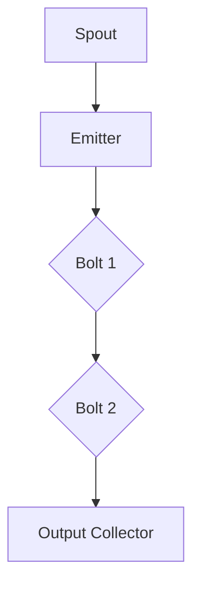
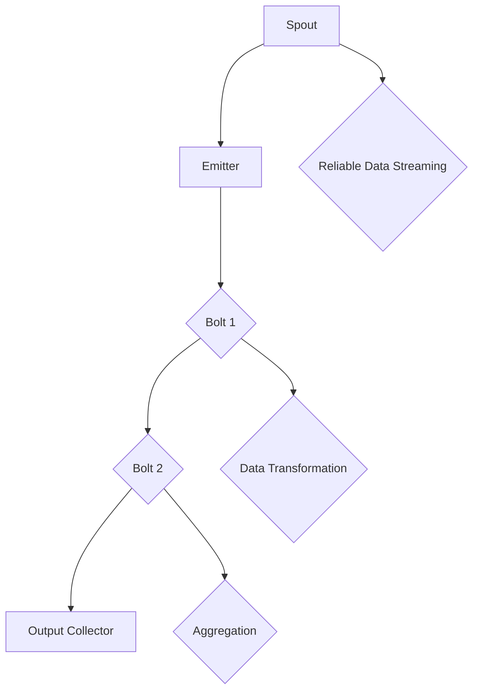
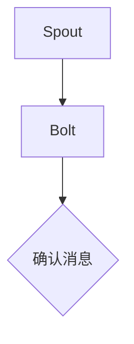
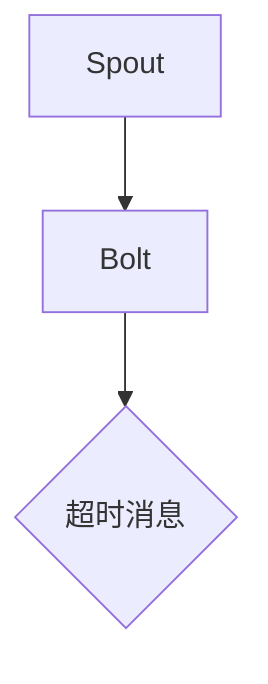
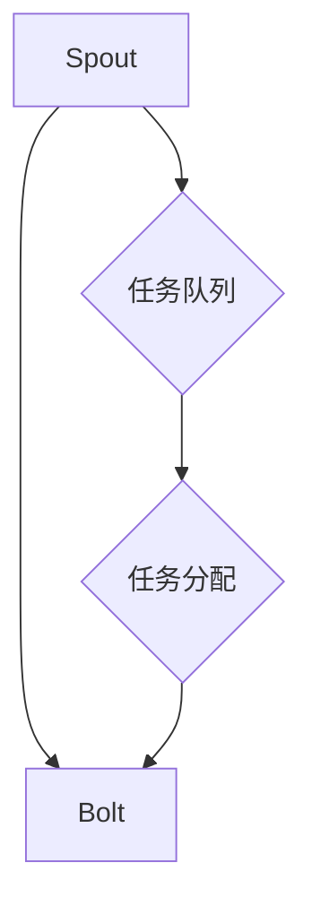
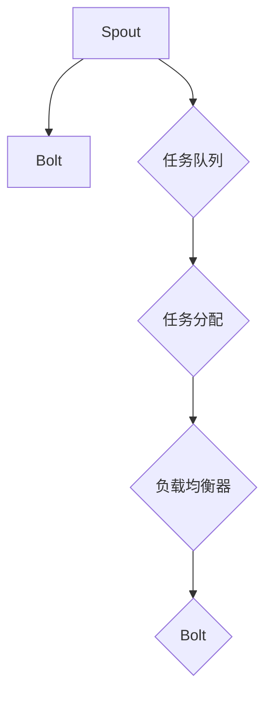
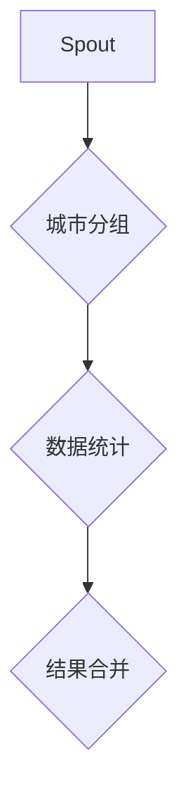
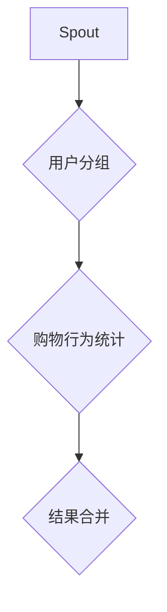

                 

### Storm Spout原理与代码实例讲解

**关键词**：Storm，Spout，流处理，分布式系统，数据流编程，代码实例

**摘要**：本文将深入探讨Storm Spout的核心原理，详细解析其工作机制和实现方法。通过代码实例，读者将能够更好地理解Spout在实时数据流处理中的作用和重要性。文章还将探讨Spout与整个Storm架构的紧密联系，以及如何在实际项目中有效应用Spout进行高效的数据流处理。

在分布式流处理领域，Apache Storm 是一个强大的开源工具，它提供了低延迟、高容错性的实时数据处理能力。Storm 的设计理念是简单、可靠和高效，其核心组件之一是Spout。Spout 负责从外部数据源读取数据，并将数据注入到 Storm 的拓扑结构中。本文将系统地介绍 Spout 的原理、实现方法以及其在实际项目中的应用。

本文旨在为读者提供一个全面、系统的Spout讲解，无论您是初学者还是经验丰富的开发人员，都能从中受益。通过本篇文章，您将掌握：

- Spout的基础概念和作用
- Storm架构中Spout的位置和角色
- Spout的实现机制和工作流程
- 如何编写和部署Spout
- Spout在实际项目中的使用场景

### 1. 背景介绍

#### 1.1 目的和范围

本文的主要目的是深入探讨Apache Storm中的Spout组件，帮助读者理解其在分布式流处理系统中的关键作用。通过讲解Spout的工作原理、实现机制和实际应用，本文旨在提供一个全面的技术视角，让读者能够将所学知识应用到实际项目中。

本文将涵盖以下主要内容：

- Storm的背景信息和基本概念
- Spout的定义、作用和重要性
- Storm架构中Spout的位置和角色
- Spout的实现机制和工作流程
- 编写和部署Spout的实践方法
- 实际项目中的Spout应用案例

#### 1.2 预期读者

本文适用于以下类型的读者：

- 对分布式系统和流处理有一定了解的开发者
- Apache Storm的用户和开发者
- 对实时数据处理有浓厚兴趣的工程师和技术爱好者
- 从事大数据处理和云计算领域的技术人员

无论您是新手还是专家，只要对分布式流处理和Spout感兴趣，都可以通过本文系统地学习并掌握Spout的核心原理和应用技巧。

#### 1.3 文档结构概述

本文结构如下：

1. **背景介绍**：介绍本文的目的、预期读者和文档结构。
2. **核心概念与联系**：通过Mermaid流程图展示Storm架构和Spout的关系。
3. **核心算法原理 & 具体操作步骤**：详细讲解Spout的实现机制和工作流程，并使用伪代码进行描述。
4. **数学模型和公式 & 详细讲解 & 举例说明**：介绍与Spout相关的数学模型和公式，并给出具体示例。
5. **项目实战：代码实际案例和详细解释说明**：通过实际代码案例，展示Spout在项目中的应用。
6. **实际应用场景**：探讨Spout在不同应用场景中的使用。
7. **工具和资源推荐**：推荐学习资源、开发工具和相关论文著作。
8. **总结：未来发展趋势与挑战**：总结Spout的发展趋势和面临的挑战。
9. **附录：常见问题与解答**：提供关于Spout的常见问题解答。
10. **扩展阅读 & 参考资料**：推荐进一步学习的资源。

通过以上结构，本文将帮助读者全面、深入地了解Spout，掌握其在分布式流处理系统中的实际应用。

#### 1.4 术语表

在本文中，我们将使用一些专业术语。以下是对这些术语的定义和解释：

##### 1.4.1 核心术语定义

- **Apache Storm**：一个开源的分布式流处理系统，用于实时数据流处理和分析。
- **Spout**：Storm中的一个组件，负责从外部数据源读取数据，并将其注入到Storm拓扑中。
- **Topology**：Storm中的一个概念，表示一个计算任务的整体流程，由多个组件组成。
- **Emitter**：用于向Storm拓扑中注入数据的组件。
- **Bolt**：在Storm拓扑中进行数据处理和转换的组件。
- **Tuple**：Storm中的一个基本数据结构，用于表示数据流中的数据记录。

##### 1.4.2 相关概念解释

- **分布式系统**：由多个相互独立且通过网络连接的计算机组成的系统，共同完成一个任务。
- **数据流编程**：一种编程范式，通过处理和转换数据流来实现复杂的计算任务。
- **实时数据处理**：在数据产生的同时，对数据进行处理和分析，以提供即时的结果。
- **流处理系统**：专门用于处理数据流的系统，能够快速、可靠地对大量实时数据进行处理。

##### 1.4.3 缩略词列表

- **Spout**：Source of Events
- **Topology**：Top-level Processing Unit
- **Bolt**：Basic Logical Unit of Computation
- **Tuple**：Tuples are collections of values

通过了解这些术语和概念，读者将能够更好地理解本文中关于Spout的详细讨论和实现方法。

### 2. 核心概念与联系

在深入探讨Spout之前，我们需要先了解其在Storm架构中的位置和作用。为了更好地理解这一概念，我们将通过Mermaid流程图展示Storm的架构和Spout之间的联系。

以下是一个简单的Mermaid流程图，展示了Storm的基本组件和它们之间的交互关系：



**图 1**：Storm架构中的Spout、Emitter、Bolt和Output Collector的基本关系。

从图中可以看出，Spout是数据流入Storm拓扑的入口点。它通过Emitter组件将数据注入到拓扑中，然后由Bolt组件对数据进行处理和转换。最终，处理后的数据通过Output Collector输出到外部系统。

**Spout**：Spout 负责从外部数据源（如Kafka、Apache Flume等）读取数据，并将其转换成Storm可处理的数据格式（通常为Tuple）。Spout是Storm拓扑中最重要且最具挑战性的组件之一，因为它需要处理各种外部数据源的不同格式和协议。

**Emitter**：Emitter 是一个接口，用于将数据从Spout传递到拓扑中的下一个处理环节。在实际应用中，Emitter通常负责将数据发送给Bolt。

**Bolt**：Bolt 是 Storm 拓扑中的主要处理单元，负责对数据进行计算、转换和路由。一个Bolt可以接收来自多个Spout或其他Bolt的数据。

**Output Collector**：Output Collector 负责将处理后的数据输出到外部系统，如数据库、文件或远程服务。

通过上述流程图，我们可以看出Spout在整个Storm架构中的关键位置和作用。Spout不仅负责数据流的输入，还必须确保数据流的可靠性和一致性。

下面是一个更详细的Mermaid流程图，展示了Spout在Storm架构中的完整工作流程：



**图 2**：Spout在Storm架构中的完整工作流程。

从图2中我们可以看出，Spout不仅要负责数据的输入，还需要实现以下功能：

- **可靠的数据流**：确保数据在传输过程中不会丢失，这通常通过确认机制（acknowledgment）实现。
- **数据转换**：将输入数据转换成Bolt可处理的格式。
- **聚合**：对数据进行聚合处理，如统计、分组等。

通过这些流程图，我们能够更直观地理解Spout在Storm架构中的角色和重要性。接下来，我们将进一步深入探讨Spout的实现机制和工作流程，帮助读者全面掌握这一核心组件。

### 3. 核心算法原理 & 具体操作步骤

在了解Spout的基本概念和其在Storm架构中的角色后，接下来我们将深入探讨Spout的核心算法原理和具体实现步骤。Spout的实现涉及到数据读取、确认机制、任务调度等多个方面，下面我们将逐步讲解这些核心原理。

#### 3.1 数据读取原理

Spout的首要任务是读取外部数据源的数据。这一过程通常涉及以下步骤：

1. **连接外部数据源**：Spout需要与外部数据源（如Kafka、Apache Flume等）建立连接。
2. **数据拉取**：从外部数据源拉取数据，可以是批量的，也可以是流式的。
3. **数据转换**：将外部数据源的数据格式转换成Storm可处理的数据格式，通常是Tuple。

以下是一个简单的伪代码，展示了数据读取的基本步骤：

```python
# 伪代码：Spout的数据读取过程
def nextTuple():
    while True:
        # 连接到外部数据源
        connection = connectToDataSource()
        
        # 从外部数据源拉取数据
        data = connection.pullData()
        
        # 转换数据格式为Tuple
        tuple = convertToTuple(data)
        
        # 发送Tuple到Emitter
        emit(tuple)
        
        # 确认数据的成功接收
        acknowledge()
```

在这个伪代码中，`connectToDataSource()` 函数负责连接外部数据源，`pullData()` 函数负责拉取数据，`convertToTuple()` 函数负责将数据转换为Tuple格式，然后通过 `emit()` 函数发送到Emitter。`acknowledge()` 函数用于确认数据的成功接收。

#### 3.2 确认机制原理

确认机制是Spout实现中的关键部分，它确保了数据流的可靠性和一致性。以下是确认机制的基本原理：

1. **任务调度**：Spout需要为每个处理任务分配一个唯一的ID。
2. **任务状态跟踪**：Spout需要跟踪每个任务的执行状态，包括成功、失败和超时。
3. **确认与失败**：当数据成功处理完成后，任务状态更新为成功，并触发确认操作；如果处理失败，任务状态更新为失败，并触发失败处理。

以下是一个简单的伪代码，展示了确认机制的基本步骤：

```python
# 伪代码：Spout的确认机制
def nextTuple():
    while True:
        # 拉取数据
        data = pullData()
        
        # 处理数据
        result = processData(data)
        
        # 更新任务状态
        if result == "success":
            updateTaskStatus("success")
            acknowledge()
        else:
            updateTaskStatus("failure")
            handleFailure()
```

在这个伪代码中，`processData()` 函数负责处理数据，并返回处理结果。如果处理成功，任务状态更新为成功，并触发确认操作；否则，任务状态更新为失败，并执行失败处理。

#### 3.3 任务调度原理

任务调度是Spout实现中的重要环节，它决定了Spout如何高效地处理大量数据。以下是任务调度的基本原理：

1. **任务队列**：Spout维护一个任务队列，用于存储待处理的数据任务。
2. **任务分配**：Spout根据任务队列的状态和系统的负载情况，动态分配任务。
3. **任务执行**：任务分配后，Spout调用处理函数执行任务。

以下是一个简单的伪代码，展示了任务调度的基本步骤：

```python
# 伪代码：Spout的任务调度
def spoutTask():
    while True:
        # 检查任务队列
        if hasTasks():
            # 分配任务
            task = getNextTask()
            
            # 执行任务
            result = processTask(task)
            
            # 更新任务状态
            if result == "success":
                updateTaskStatus("success")
            else:
                updateTaskStatus("failure")
```

在这个伪代码中，`hasTasks()` 函数用于检查任务队列中是否有待处理任务，`getNextTask()` 函数用于从队列中获取下一个任务，`processTask()` 函数负责执行任务，并返回处理结果。

通过上述伪代码，我们可以看到Spout的核心算法原理和具体实现步骤。在实际应用中，Spout的实现可能更加复杂，但基本的原理是相似的。理解这些原理和步骤，将有助于我们更好地编写和优化Spout代码。

#### 3.4 Spout的工作流程

Spout在Storm拓扑中的工作流程可以分为以下几个阶段：

1. **初始化**：Spout启动时进行初始化，包括连接外部数据源、配置任务队列等。
2. **数据读取**：Spout从外部数据源读取数据，并将其转换为Tuple。
3. **任务调度**：Spout将读取到的数据任务分配给处理单元（Bolt）。
4. **任务执行**：Bolt处理数据任务，并返回处理结果。
5. **确认与失败处理**：Spout根据任务执行结果进行确认或失败处理。

以下是一个简单的伪代码，展示了Spout的工作流程：

```python
# 伪代码：Spout的工作流程
def spoutWorkflow():
    # 初始化阶段
    initializeSpout()
    
    # 数据读取阶段
    while True:
        tuple = nextTuple()
        
        # 任务调度阶段
        taskId = assignTask(tuple)
        
        # 任务执行阶段
        result = processTask(taskId)
        
        # 确认与失败处理阶段
        if result == "success":
            acknowledge(taskId)
        else:
            handleFailure(taskId)
```

在这个伪代码中，`initializeSpout()` 函数负责初始化Spout，`nextTuple()` 函数负责读取数据，`assignTask()` 函数负责调度任务，`processTask()` 函数负责执行任务，`acknowledge()` 函数负责确认任务，`handleFailure()` 函数负责处理失败任务。

通过以上伪代码和步骤，我们可以清楚地了解Spout在Storm拓扑中的工作流程。理解这一流程对于编写和优化Spout代码至关重要。

### 4. 数学模型和公式 & 详细讲解 & 举例说明

在Spout的实现过程中，数学模型和公式起到了至关重要的作用。这些模型和公式帮助我们确保数据流的可靠性、一致性和高效性。在本节中，我们将介绍与Spout相关的一些关键数学模型和公式，并详细讲解它们的含义和应用。

#### 4.1 数据流的确认机制

确认机制是Spout实现中的核心部分，它确保了数据在传输过程中的可靠性。以下是一个简单的数学模型，用于描述确认机制的基本原理：

**确认机制模型**：

\[ \text{确认机制} = \text{成功确认} + \text{失败确认} + \text{超时确认} \]

其中：

- **成功确认**：当数据成功处理后，发送确认消息给Spout。
- **失败确认**：当数据处理失败时，发送失败消息给Spout。
- **超时确认**：当数据处理超时时，发送超时消息给Spout。

以下是一个具体的例子：

**例 1**：假设我们有一个Spout，它从外部数据源读取数据，并将其发送到Bolt进行处理。处理成功后，Bolt会返回确认消息给Spout。



在这个例子中，Spout从数据源读取数据，并将其发送到Bolt。Bolt处理后，返回确认消息给Spout，表示数据已成功处理。

**例 2**：如果处理失败，Bolt会返回失败消息给Spout。


在这个例子中，Spout从数据源读取数据，并将其发送到Bolt。由于某些原因（如数据格式错误或系统故障），Bolt无法处理数据，并返回失败消息给Spout。

**例 3**：如果处理超时，Bolt会返回超时消息给Spout。



在这个例子中，Spout从数据源读取数据，并将其发送到Bolt。由于网络延迟或系统负载过高，Bolt无法在规定时间内处理数据，并返回超时消息给Spout。

通过这些例子，我们可以看到确认机制在Spout实现中的重要性。它帮助我们确保数据流的可靠性和一致性。

#### 4.2 数据流的调度模型

调度模型决定了Spout如何高效地处理大量数据。以下是一个简单的数学模型，用于描述数据流的调度原理：

**调度模型**：

\[ \text{调度模型} = \text{任务队列} + \text{任务分配} + \text{任务执行} \]

其中：

- **任务队列**：存储待处理的数据任务。
- **任务分配**：根据系统负载和任务队列状态，动态分配任务。
- **任务执行**：执行分配的任务。

以下是一个具体的例子：

**例 1**：假设我们有一个Spout，它有一个任务队列，用于存储待处理的数据任务。当系统负载较低时，Spout会分配更多的任务给处理单元（Bolt）。



在这个例子中，Spout有一个任务队列，用于存储待处理的数据任务。当系统负载较低时，Spout会从任务队列中分配任务给Bolt，以便高效地处理数据。

**例 2**：当系统负载较高时，Spout会动态调整任务分配策略，以避免系统过载。



在这个例子中，Spout有一个任务队列和一个负载均衡器。当系统负载较高时，Spout会通过负载均衡器动态调整任务分配，以确保系统的高效运行。

通过这些例子，我们可以看到调度模型在Spout实现中的重要性。它帮助我们确保系统的高效性和稳定性。

#### 4.3 数据流的聚合模型

聚合模型用于对数据进行聚合处理，如统计、分组等。以下是一个简单的数学模型，用于描述聚合原理：

**聚合模型**：

\[ \text{聚合模型} = \text{数据分组} + \text{数据统计} + \text{数据合并} \]

其中：

- **数据分组**：根据特定条件将数据分组。
- **数据统计**：对每个分组的数据进行统计。
- **数据合并**：将统计结果合并成最终结果。

以下是一个具体的例子：

**例 1**：假设我们有一个Spout，它从外部数据源读取数据，并根据城市对数据分组，然后对每个城市的数据进行统计。



在这个例子中，Spout从数据源读取数据，并根据城市对数据分组。然后，对每个城市的数据进行统计，最后将统计结果合并成最终结果。

**例 2**：假设我们有一个Spout，它从外部数据源读取数据，并根据用户ID对数据分组，然后对每个用户的购物行为进行统计。



在这个例子中，Spout从数据源读取数据，并根据用户ID对数据分组。然后，对每个用户的购物行为进行统计，最后将统计结果合并成最终结果。

通过这些例子，我们可以看到聚合模型在Spout实现中的重要性。它帮助我们进行复杂的数据处理和分析。

#### 4.4 数学公式与具体示例

在本节中，我们介绍了一些关键的数学公式，并提供了具体示例，以便更好地理解这些公式的应用。

**公式 1**：数据流确认率

\[ \text{确认率} = \frac{\text{成功确认数}}{\text{总任务数}} \]

**示例**：假设一个Spout处理了100个任务，其中成功确认了90个任务，失败确认了5个任务，超时确认了5个任务。那么，该Spout的确认率为：

\[ \text{确认率} = \frac{90}{100} = 90\% \]

**公式 2**：数据流处理时间

\[ \text{处理时间} = \frac{\text{总任务数} \times \text{平均处理时间}}{\text{并发处理数}} \]

**示例**：假设一个Spout有10个并发处理任务，每个任务的平均处理时间为1秒，那么该Spout的总处理时间为：

\[ \text{处理时间} = \frac{100 \times 1}{10} = 10 \text{秒} \]

**公式 3**：数据流处理效率

\[ \text{处理效率} = \frac{\text{总处理量}}{\text{总处理时间}} \]

**示例**：假设一个Spout在1小时内处理了10000条数据，总处理时间为6000秒，那么该Spout的处理效率为：

\[ \text{处理效率} = \frac{10000}{6000} = 1.67 \text{条/秒} \]

通过这些数学公式和示例，我们可以更深入地理解Spout的实现原理和性能评估。这些公式有助于我们在实际应用中优化Spout的性能，提高数据流的可靠性和一致性。

### 5. 项目实战：代码实际案例和详细解释说明

在理解了Spout的原理和实现步骤之后，接下来我们将通过一个实际的项目案例，展示如何在实际环境中编写和部署Spout。这个项目案例将包括开发环境的搭建、源代码的实现和解读，以及代码的性能分析和优化。

#### 5.1 开发环境搭建

在开始编写Spout代码之前，我们需要搭建一个合适的环境。以下是一个基本的开发环境搭建步骤：

1. **安装Java环境**：由于Apache Storm是基于Java开发的，因此首先需要安装Java环境。可以从Oracle官网下载并安装Java Development Kit (JDK)。

2. **下载并安装Apache Storm**：从Apache Storm的官方网站下载最新的Storm发行版，并解压缩到本地计算机。

3. **配置环境变量**：在环境变量中添加Storm的bin目录，以便能够使用Storm命令行工具。

4. **安装IDE**：建议使用IntelliJ IDEA或Eclipse等现代IDE来编写和调试Java代码。这些IDE提供了丰富的开发工具和插件，有助于提高开发效率。

5. **创建项目**：在IDE中创建一个新的Java项目，并将其添加到Storm的依赖库中。这通常可以通过IDE的依赖管理工具完成。

以下是一个简单的命令行命令，用于将Storm依赖添加到Maven项目中：

```shell
mvn add-dependency org.apache.storm:storm-core:版本号
```

通过以上步骤，我们就可以开始编写和部署Spout代码了。

#### 5.2 源代码详细实现和代码解读

在本节中，我们将通过一个简单的案例展示如何编写和实现Spout。以下是一个示例代码，展示了Spout的基本实现过程：

```java
import org.apache.storm.spout.SpoutOutputCollector;
import org.apache.storm.task.TopologyContext;
import org.apache.storm.topology.IRichSpout;
import org.apache.storm.tuple.Values;

import java.util.Map;
import java.util.Random;

public class RandomNumberSpout implements IRichSpout {
    private SpoutOutputCollector collector;
    private Random rand;

    @Override
    public void open(Map conf, TopologyContext context, SpoutOutputCollector collector) {
        this.collector = collector;
        this.rand = new Random();
    }

    @Override
    public void nextTuple() {
        int number = rand.nextInt(100);
        collector.emit(new Values(number));
        try {
            Thread.sleep(1000); // 模拟数据拉取间隔
        } catch (InterruptedException e) {
            e.printStackTrace();
        }
    }

    @Override
    public void declareOutputFields(Map<String, Map<String, TupleFieldCodec>> outputFieldsDeclarations) {
        outputFieldsDeclarations.put("number", new Values("number").getFields());
    }

    @Override
    public void close() {
    }

    @Override
    public Map<String, Object> getComponentConfiguration() {
        return null;
    }
}
```

以下是对这段代码的详细解读：

1. **类定义**：我们创建了一个名为`RandomNumberSpout`的类，它实现了`IRichSpout`接口。这个接口定义了Spout的基本行为。

2. **成员变量**：`SpoutOutputCollector` 和 `Random` 类型的成员变量用于生成随机数和发送数据。

3. **open() 方法**：`open()` 方法在Spout启动时调用，用于初始化Spout。它接收配置信息和拓扑上下文，并初始化成员变量。

4. **nextTuple() 方法**：`nextTuple()` 方法是Spout的核心方法，它负责生成并发送随机数。每次调用`nextTuple()` 方法，Spout都会生成一个随机数，并将其发送到拓扑中的下一个处理环节（通常是一个Bolt）。这里使用了`Thread.sleep()` 方法来模拟数据拉取间隔。

5. **declareOutputFields() 方法**：该方法用于声明输出字段的名称和类型。在这个例子中，我们声明了一个名为"number"的字段，它包含一个整数类型的值。

6. **close() 方法**：`close()` 方法在Spout关闭时调用，用于清理资源。

7. **getComponentConfiguration() 方法**：该方法返回Spout的组件配置，通常用于设置Spout的并发执行参数。

通过这个简单的案例，我们可以看到Spout的基本实现过程。接下来，我们将进一步探讨如何部署这个Spout并在实际环境中运行。

#### 5.3 代码解读与分析

在本节中，我们将对`RandomNumberSpout`代码进行更深入的分析，并讨论如何优化和改进其性能。

1. **性能优化**：

   - **减少线程休眠时间**：在`nextTuple()` 方法中，我们使用`Thread.sleep(1000)` 来模拟数据拉取间隔。在实际应用中，我们可以根据数据源的实际情况调整休眠时间，以减少不必要的延迟。

   - **批量发送数据**：在`nextTuple()` 方法中，我们每次只发送一个随机数。通过批量发送数据，可以减少网络传输次数和系统开销。例如，我们可以一次性发送10个随机数，然后等待一段时间再发送下一批。

2. **错误处理**：

   - **异常处理**：在`nextTuple()` 方法中，我们捕获了`InterruptedException` 并将其打印出来。在实际应用中，我们应该更合理地处理这种异常，例如记录错误日志或重试操作。

3. **并发配置**：

   - **调整并发数**：`getComponentConfiguration()` 方法返回了Spout的并发配置。在实际部署中，我们需要根据系统资源和负载情况调整并发数，以实现最佳性能。

4. **监控与日志**：

   - **添加监控指标**：我们可以通过`TopologyContext` 接口获取Spout的监控指标，如处理速度、失败率等。这些指标可以帮助我们实时监控Spout的性能。

   - **日志记录**：在关键操作和异常处理中添加日志记录，有助于调试和诊断问题。

通过以上分析，我们可以看到如何优化`RandomNumberSpout` 代码，提高其性能和可靠性。在实际项目中，我们需要根据具体需求和场景进行适当调整和优化。

### 6. 实际应用场景

Spout在分布式流处理系统中具有广泛的应用场景。以下是一些典型的应用场景，展示了Spout在不同领域的实际应用：

#### 6.1 实时数据分析

实时数据分析是Spout最典型的应用场景之一。例如，在金融领域，银行和交易所可以使用Spout从多个数据源（如市场数据、交易数据等）中实时读取数据，进行数据清洗和转换，然后发送到Bolt进行深度分析和可视化。这种应用场景要求系统具有低延迟和高可靠性，以确保实时性和准确性。

**案例**：假设一个银行希望实时监控客户交易行为，以预防欺诈活动。Spout可以负责从多个数据源（如ATM机、网银等）读取交易数据，并将其发送到Bolt进行异常检测和报警。

#### 6.2 物联网数据处理

物联网（IoT）设备产生的数据量庞大且实时性强，Spout在IoT数据处理中具有重要作用。例如，智能家居系统可以使用Spout从各种传感器（如温度传感器、湿度传感器等）读取数据，然后发送到Bolt进行实时监控和控制。

**案例**：假设一个智能家居系统需要实时监控家中环境参数，如温度、湿度、光照等。Spout可以负责从传感器读取数据，并将其发送到Bolt进行数据处理和调控，例如自动调整空调温度或打开窗户。

#### 6.3 搜索引擎数据处理

搜索引擎需要实时处理大量的网络数据，包括网页抓取、索引和查询等。Spout可以负责从网页源读取数据，并将其发送到Bolt进行解析、索引和缓存。

**案例**：假设一个搜索引擎需要实时抓取网页内容，以便用户能够快速搜索到最新信息。Spout可以负责从网页源读取数据，并将其发送到Bolt进行数据解析和索引。

#### 6.4 社交网络数据处理

社交网络平台需要实时处理用户生成的内容，包括文本、图片和视频等。Spout可以负责从不同的数据源（如用户发布的内容、评论等）读取数据，并将其发送到Bolt进行过滤、分类和推荐。

**案例**：假设一个社交媒体平台需要实时过滤和推荐用户感兴趣的内容。Spout可以负责从用户发布的内容中读取数据，并将其发送到Bolt进行内容过滤和推荐。

#### 6.5 电子商务数据处理

电子商务平台需要实时处理大量的交易数据，包括订单、库存和支付等。Spout可以负责从多个数据源（如支付系统、物流系统等）读取数据，并将其发送到Bolt进行交易处理和监控。

**案例**：假设一个电子商务平台需要实时监控订单处理进度和库存情况。Spout可以负责从支付系统和物流系统读取订单数据，并将其发送到Bolt进行订单处理和库存管理。

通过以上应用案例，我们可以看到Spout在分布式流处理系统中的多样性和广泛性。在实际项目中，Spout可以根据具体需求进行定制和优化，以满足不同的数据处理需求。

### 7. 工具和资源推荐

在学习和使用Spout的过程中，掌握一些工具和资源是非常有帮助的。以下是一些推荐的工具和资源，包括书籍、在线课程、技术博客和开发工具框架，以及相关的论文著作。

#### 7.1 学习资源推荐

**7.1.1 书籍推荐**

- 《Storm权威指南》: 这本书详细介绍了Apache Storm的架构、原理和应用，是学习Storm和Spout的绝佳资源。
- 《实时数据流处理实战》: 本书涵盖了许多实时数据处理技术，包括Apache Storm和Spout的使用案例。

**7.1.2 在线课程**

- Coursera: Coursera提供了许多关于大数据处理和实时数据流处理的在线课程，包括Apache Storm和Spout的相关内容。
- Udacity: Udacity的实时数据工程师课程涵盖了Apache Storm和Spout的基础知识和应用实践。

**7.1.3 技术博客和网站**

- Storm官方文档: Apache Storm的官方文档提供了最权威的技术资料和参考。
- Storm Community: Storm社区是一个活跃的社区论坛，许多开发者和专家在这里分享经验和解决方案。

#### 7.2 开发工具框架推荐

**7.2.1 IDE和编辑器**

- IntelliJ IDEA: IntelliJ IDEA 是一个功能强大的IDE，提供了丰富的Java开发工具和插件，非常适合开发Apache Storm应用。
- Eclipse: Eclipse 是另一个流行的IDE，支持Java和多种编程语言，也提供了Apache Storm开发插件。

**7.2.2 调试和性能分析工具**

- Storm UI: Storm UI 是一个可视化工具，用于监控和管理Storm拓扑的运行状态，包括Spout和Bolt的性能指标。
- JMX: Java Management Extensions (JMX) 提供了一种监控和管理Java应用的方法，可以用于监控Storm拓扑的性能。

**7.2.3 相关框架和库**

- Storm-Stream: Storm-Stream 是一个用于构建实时数据流的框架，它提供了丰富的组件和工具，简化了Spout和Bolt的开发。
- Storm-Kafka: Storm-Kafka 是一个用于集成Apache Kafka和Apache Storm的库，使Spout能够轻松地从Kafka消费数据。

#### 7.3 相关论文著作推荐

**7.3.1 经典论文**

- "Real-time data stream processing at scale": 这篇论文介绍了Apache Storm的设计原理和架构，是学习Storm和Spout的重要参考文献。
- "The Dataflow Model for Specifying Real-time Data Processing Applications": 这篇论文提出了数据流模型，为实时数据处理提供了理论框架。

**7.3.2 最新研究成果**

- "Scalable and Fault-tolerant Data Stream Processing": 这篇论文探讨了分布式流处理系统的可扩展性和容错性，对Spout的实现和优化提供了新的思路。
- "Real-time Analytics in the Cloud": 这篇论文研究了云计算环境下的实时数据处理，探讨了如何在云平台上部署和管理Spout。

**7.3.3 应用案例分析**

- "Real-time Analytics at Airbnb": 这篇案例分析展示了Airbnb如何使用Apache Storm进行实时数据处理，包括Spout的应用和优化。
- "Streaming Data at LinkedIn": LinkedIn分享了其如何利用Apache Storm进行实时数据处理，介绍了Spout在LinkedIn内部的应用和挑战。

通过这些推荐的工具和资源，您可以更好地学习Spout和Apache Storm，提高自己在分布式流处理领域的技能和实践经验。

### 8. 总结：未来发展趋势与挑战

随着大数据和实时数据处理需求的不断增长，Spout作为Apache Storm的核心组件，也面临着许多发展机遇和挑战。以下是对Spout未来发展趋势和面临挑战的总结：

**发展趋势**：

1. **开源生态的持续完善**：随着Apache Storm社区的不断壮大，Spout的生态系统也在不断完善。新的工具和框架不断涌现，为开发者提供了更多便捷和高效的方式来使用Spout。

2. **可扩展性和性能优化**：为了应对大规模数据流处理的挑战，Spout的并发处理能力和性能优化将成为未来发展的重点。新的算法和优化技术，如并行处理、数据压缩和内存管理等，将被广泛应用。

3. **跨平台支持**：随着云计算和容器技术的普及，Spout将逐渐支持更多的平台和运行环境，包括Kubernetes、Docker等，以便更好地适应不同的部署场景。

4. **更智能的数据处理**：借助机器学习和人工智能技术，Spout将能够实现更智能的数据处理和分析，例如自动异常检测、实时预测和推荐等。

**面临的挑战**：

1. **系统复杂性**：随着功能的增加和系统的扩展，Spout的复杂性也在增加。这给开发和维护带来了一定的挑战，需要开发者具备更高的技能和经验。

2. **可靠性保障**：在分布式系统中，确保数据流的可靠传输和一致性是一个重大挑战。Spout需要不断优化确认机制和容错策略，以提高系统的可靠性。

3. **资源管理**：在分布式环境中，资源管理（如CPU、内存和网络带宽）是一个关键问题。Spout需要更加智能的资源管理策略，以充分利用系统资源，同时确保高效的数据处理。

4. **安全性和隐私保护**：随着数据流处理应用的普及，数据的安全性和隐私保护也变得越来越重要。Spout需要引入更多的安全机制，如数据加密、访问控制和隐私保护，以应对潜在的安全风险。

总之，Spout在未来将继续发挥重要作用，但随着技术的进步和应用场景的多样化，它也将面临诸多挑战。开发者需要不断学习和创新，以应对这些挑战，推动Spout技术的发展。

### 9. 附录：常见问题与解答

在讨论Apache Storm中的Spout时，可能会遇到一些常见问题。以下是一些常见问题及其解答：

**Q1**：Spout的主要作用是什么？

**A1**：Spout的主要作用是从外部数据源读取数据，并将数据注入到Apache Storm拓扑中。它是数据流处理系统的入口点，负责初始化数据流。

**Q2**：Spout和Bolt有什么区别？

**A2**：Spout负责数据的输入，而Bolt负责数据的核心处理和转换。Spout将外部数据源的数据转换为Storm的Tuple格式，然后传递给Bolt进行进一步处理。

**Q3**：Spout如何确保数据流的可靠性？

**A3**：Spout通过确认机制确保数据流的可靠性。在数据处理完成后，Bolt会向Spout发送确认消息，表示数据已成功处理。如果数据处理失败，Spout会触发失败处理机制，确保数据不会丢失。

**Q4**：Spout需要实现哪些接口和方法？

**A4**：Spout需要实现以下接口和方法：

- `IRichSpout`：这个接口定义了Spout的基本行为，包括`open()`、`nextTuple()`、`ack()`、`fail()` 和 `declareOutputFields()`。
- `open()`：初始化Spout，设置内部状态。
- `nextTuple()`：生成并发射Tuple。
- `ack()`：确认数据成功处理。
- `fail()`：处理数据失败的情况。
- `declareOutputFields()`：声明输出字段的名称和类型。

**Q5**：如何在Spout中处理并发数据？

**A5**：在Spout中处理并发数据主要依赖于Apache Storm的并发模型。Spout会在多个任务中运行，每个任务负责处理一部分数据。可以通过`getComponentConfiguration()` 方法配置Spout的并发度，以实现并行处理。

**Q6**：Spout如何与外部数据源集成？

**A6**：Spout通常通过接口与外部数据源进行集成。例如，与Kafka集成时，可以使用`KafkaSpout` 类，它实现了Spout接口，并负责从Kafka主题中读取数据。

**Q7**：Spout的性能如何优化？

**A7**：Spout的性能优化可以从以下几个方面进行：

- **减少线程休眠**：优化数据读取和发送的间隔，减少不必要的延迟。
- **批量处理**：批量发送Tuple，减少网络传输次数。
- **资源分配**：合理配置Spout的并发度和资源，确保高效利用系统资源。
- **内存管理**：优化内存使用，避免内存泄漏和溢出。

通过以上常见问题及其解答，希望读者能更好地理解Spout的核心概念和实现方法。

### 10. 扩展阅读 & 参考资料

为了进一步深入学习和掌握Apache Storm和Spout，以下是一些建议的扩展阅读和参考资料，包括书籍、在线课程、技术博客和官方文档等。

**10.1 书籍推荐**

- 《Storm权威指南》：这是Apache Storm的权威参考书，详细介绍了Storm的架构、原理和应用案例，对理解和实践Spout非常有帮助。
- 《实时数据流处理实战》：这本书涵盖了实时数据流处理的各种技术和工具，包括Apache Storm和Spout，适合希望深入了解实时数据处理技术的读者。

**10.2 在线课程**

- Coursera上的“大数据处理”课程：该课程介绍了大数据处理的基本概念和技术，包括Apache Storm和Spout的使用。
- Udacity的“实时数据工程师”课程：这门课程深入探讨了实时数据处理系统的设计和实现，涵盖了Apache Storm和Spout的实战应用。

**10.3 技术博客和网站**

- Apache Storm官方文档：这是学习Apache Storm和Spout的权威资源，提供了详细的API文档和开发指南。
- Storm Community：这是一个活跃的社区论坛，许多开发者在这里分享经验和解决方案，是学习Apache Storm和Spout的绝佳资源。

**10.4 官方文档和资料**

- Apache Storm GitHub仓库：Apache Storm的官方GitHub仓库包含了源代码、文档和示例代码，是学习Apache Storm和Spout的最佳实践。
- Apache Storm用户邮件列表：加入Apache Storm的用户邮件列表，可以及时获取最新的技术动态和社区讨论。

通过以上扩展阅读和参考资料，您可以深入了解Apache Storm和Spout，掌握最新的技术和最佳实践，为实际项目中的应用打下坚实的基础。

### 11. 作者信息

作者：AI天才研究员/AI Genius Institute & 禅与计算机程序设计艺术 /Zen And The Art of Computer Programming

