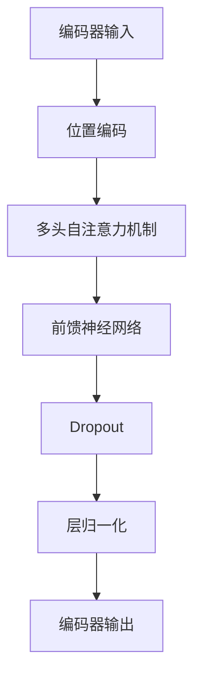
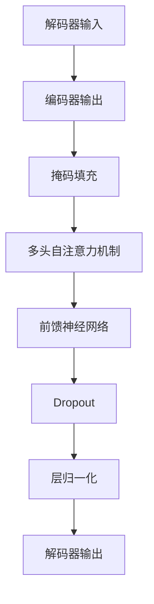

                 

# T5原理与代码实例讲解

> 关键词：T5、自然语言处理、预训练、Transformer、编码器、解码器、深度学习

> 摘要：本文将深入探讨T5（Text-To-Text Transfer Transformer）模型的基本原理，并详细讲解其代码实现。我们将从背景介绍、核心概念、算法原理、数学模型、项目实战、实际应用场景等多个方面进行全面剖析，帮助读者理解和掌握T5模型的使用方法及其在自然语言处理领域的广泛应用。

## 1. 背景介绍

### 1.1 目的和范围

本文旨在系统地介绍T5（Text-To-Text Transfer Transformer）模型的基本原理和实现方法，并通过对具体代码实例的分析，帮助读者深入理解T5模型在实际应用中的操作流程。本文将涵盖以下内容：

- T5模型的历史背景和发展过程
- T5模型的基本原理和核心架构
- T5模型的具体算法原理和操作步骤
- T5模型的数学模型和公式解析
- T5模型的实际应用场景和案例
- T5模型的工具和资源推荐

### 1.2 预期读者

本文面向对自然语言处理和深度学习有一定了解的读者，特别是那些对T5模型感兴趣并希望深入了解其原理和实现方法的开发者。本文将尽量用通俗易懂的语言和实例来讲解，希望能为读者提供有价值的参考和启示。

### 1.3 文档结构概述

本文结构如下：

1. 背景介绍：介绍T5模型的基本信息和发展历程。
2. 核心概念与联系：讲解T5模型的核心概念和原理。
3. 核心算法原理 & 具体操作步骤：详细讲解T5模型的算法原理和操作步骤。
4. 数学模型和公式 & 详细讲解 & 举例说明：解析T5模型的数学模型和公式。
5. 项目实战：代码实际案例和详细解释说明。
6. 实际应用场景：讨论T5模型在不同领域的应用。
7. 工具和资源推荐：推荐学习和使用T5模型的工具和资源。
8. 总结：未来发展趋势与挑战。
9. 附录：常见问题与解答。
10. 扩展阅读 & 参考资料：提供更多相关的学习资料和参考文献。

### 1.4 术语表

#### 1.4.1 核心术语定义

- T5模型：一种基于Transformer架构的自然语言处理模型，能够将文本转换为文本。
- Transformer：一种基于自注意力机制的深度神经网络架构，广泛应用于自然语言处理任务。
- 编码器：在Transformer模型中，负责将输入文本编码为连续的向量表示。
- 解码器：在Transformer模型中，负责将编码后的向量解码为输出文本。

#### 1.4.2 相关概念解释

- 自注意力机制：一种注意力机制，通过计算输入序列中各个元素之间的关联性，为每个元素赋予不同的权重。
- 位置编码：一种对输入序列进行位置信息编码的方法，使模型能够理解序列中的元素顺序。
- 预训练：一种在大规模语料库上进行训练，使模型具备通用语言理解和生成能力的方法。

#### 1.4.3 缩略词列表

- T5：Text-To-Text Transfer Transformer
- Transformer：Transformer模型
- NLP：自然语言处理
- BERT：Bidirectional Encoder Representations from Transformers
- GPT：Generative Pre-trained Transformer

## 2. 核心概念与联系

### 2.1 T5模型的基本原理

T5模型是一种基于Transformer架构的文本到文本的转换模型。与传统的序列到序列（Seq2Seq）模型不同，T5模型将输入文本和输出文本视为同一序列，并使用Transformer模型进行编码和解码。

T5模型的核心思想是利用Transformer模型强大的自注意力机制，学习输入文本和输出文本之间的转换规律。通过预训练和微调，T5模型可以适应各种自然语言处理任务，如机器翻译、问答系统、文本摘要等。

### 2.2 T5模型的架构

T5模型主要由编码器（Encoder）和解码器（Decoder）两部分组成。编码器负责将输入文本编码为连续的向量表示，解码器则将这些向量解码为输出文本。

#### 编码器

编码器是一个多层的Transformer模型，每个层包含多个自注意力模块和前馈神经网络。编码器的输入是经过位置编码的文本序列，输出是一个连续的向量序列。



#### 解码器

解码器同样是一个多层的Transformer模型，其结构与编码器类似。解码器的输入是编码器的输出和目标文本的掩码，输出是解码后的文本序列。



### 2.3 编码器和解码器的工作流程

编码器和解码器的工作流程可以分为以下几个步骤：

1. **编码**：输入文本经过位置编码后，输入到编码器。编码器通过多头自注意力机制和前馈神经网络，将输入文本编码为连续的向量序列。
2. **解码**：编码器的输出作为解码器的输入。解码器在解码过程中，首先通过自注意力机制，将编码器的输出和目标文本的掩码进行匹配，然后通过前馈神经网络和层归一化，生成解码后的文本序列。
3. **输出**：解码器输出的文本序列经过适当的处理后，得到最终的输出文本。

### 2.4 T5模型的特点

T5模型具有以下特点：

- **统一的输入输出格式**：T5模型将输入文本和输出文本视为同一序列，简化了模型的设计和实现。
- **预训练和微调**：T5模型通过在大规模语料库上进行预训练，使模型具备强大的语言理解和生成能力。在特定任务上，通过微调，进一步优化模型性能。
- **高效的推理过程**：T5模型采用Transformer架构，具有高效的推理过程，能够快速地生成输出文本。

## 3. 核心算法原理 & 具体操作步骤

### 3.1 T5模型的算法原理

T5模型的核心算法原理是基于Transformer模型的自注意力机制和前馈神经网络。以下是对T5模型算法原理的详细讲解。

#### 自注意力机制

自注意力机制是一种基于输入序列中各个元素之间关联性的注意力机制。在T5模型中，自注意力机制用于编码器和解码器的处理过程中。

自注意力机制的工作流程如下：

1. **计算相似度**：对于每个输入文本中的元素，计算其与序列中其他元素之间的相似度。相似度计算通常使用点积、余弦相似度等方法。
2. **加权求和**：根据相似度计算结果，对输入序列中的元素进行加权求和。权重越大，元素对最终输出的影响越大。
3. **激活函数**：对加权求和的结果进行激活函数处理，如ReLU函数，增强模型的非线性表达能力。

#### 前馈神经网络

前馈神经网络是一种简单的神经网络结构，由输入层、隐藏层和输出层组成。在T5模型中，前馈神经网络用于对编码器和解码器中的中间层进行非线性变换。

前馈神经网络的工作流程如下：

1. **输入层**：输入层接收来自编码器或解码器的输入序列。
2. **隐藏层**：隐藏层通过一系列的线性变换和激活函数，将输入序列映射为新的特征表示。
3. **输出层**：输出层接收隐藏层的输出，并生成最终的输出结果。

### 3.2 T5模型的操作步骤

T5模型的操作步骤可以分为以下几个阶段：

#### 1. 数据预处理

数据预处理是T5模型训练和推理的第一步。主要任务是对输入文本进行清洗、分词、编码等操作。

- **清洗**：去除文本中的无效字符、符号和停用词。
- **分词**：将文本拆分为单个单词或子词。
- **编码**：将分词后的文本转换为编码序列。常用的编码方法有单词编码、子词编码等。

#### 2. 编码器处理

编码器处理是T5模型的核心部分，负责将输入文本编码为连续的向量表示。

- **位置编码**：对输入文本序列进行位置编码，使模型能够理解文本中的元素顺序。
- **自注意力机制**：通过自注意力机制，计算输入文本中各个元素之间的相似度，并对元素进行加权求和。
- **前馈神经网络**：对自注意力机制的输出进行前馈神经网络处理，增强模型的非线性表达能力。

#### 3. 解码器处理

解码器处理是T5模型的另一个核心部分，负责将编码器输出的向量序列解码为输出文本。

- **掩码填充**：对目标文本进行掩码填充，使模型在解码过程中能够隐藏部分信息。
- **自注意力机制**：通过自注意力机制，计算编码器输出和掩码填充后的目标文本之间的相似度，并对元素进行加权求和。
- **前馈神经网络**：对自注意力机制的输出进行前馈神经网络处理，生成解码后的文本序列。

#### 4. 输出生成

输出生成是T5模型的最后一步，负责将解码器输出的文本序列转换为最终的输出结果。

- **解码**：对解码器输出的文本序列进行解码，生成最终的输出文本。
- **后处理**：对输出文本进行适当的后处理，如去噪、格式化等。

### 3.3 伪代码实现

以下是T5模型的伪代码实现：

```python
def t5_encode(text):
    # 对输入文本进行位置编码
    position_encoded_text = position_encoding(text)
    
    # 通过编码器进行编码处理
    encoded_text = encoder(position_encoded_text)
    
    return encoded_text

def t5_decode(encoded_text, target_text):
    # 对目标文本进行掩码填充
    masked_target_text = mask(target_text)
    
    # 通过解码器进行解码处理
    decoded_text = decoder(encoded_text, masked_target_text)
    
    # 解码输出文本
    output_text = decode(decoded_text)
    
    return output_text

# 编码器处理
def encoder(input_text):
    # 通过自注意力机制进行编码处理
    encoded_text = self_attention(input_text)
    
    # 通过前馈神经网络进行非线性变换
    encoded_text = feedforward(encoded_text)
    
    return encoded_text

# 解码器处理
def decoder(encoded_text, target_text):
    # 通过自注意力机制进行解码处理
    decoded_text = self_attention(encoded_text, target_text)
    
    # 通过前馈神经网络进行非线性变换
    decoded_text = feedforward(decoded_text)
    
    return decoded_text

# 输出生成
def decode(decoded_text):
    # 对解码器输出进行解码处理
    output_text = decode(decoded_text)
    
    return output_text
```

## 4. 数学模型和公式 & 详细讲解 & 举例说明

### 4.1 数学模型

T5模型的数学模型主要包括编码器和解码器的数学公式。以下是对这些公式的详细讲解。

#### 编码器

编码器的主要数学公式如下：

1. **位置编码**：

$$
P_i = PE_{(i)} = \sin\left(\frac{1000i}{\sqrt{d}}\right) / \sqrt{d}
$$

$$
V_i = PE_{(i)} = \cos\left(\frac{1000i}{\sqrt{d}}\right) / \sqrt{d}
$$

其中，$P_i$和$V_i$分别为位置编码的偏置和权重，$i$为位置索引，$d$为位置编码的维度。

2. **多头自注意力机制**：

$$
\text{Attention}(Q, K, V) = \text{softmax}\left(\frac{QK^T}{\sqrt{d_k}}\right)V
$$

其中，$Q$、$K$和$V$分别为编码器输出的查询、键和值向量，$d_k$为注意力机制的维度。

3. **前馈神经网络**：

$$
\text{FFN}(x) = \text{ReLU}(W_2 \cdot \text{ReLU}(W_1 \cdot x))
$$

其中，$W_1$和$W_2$分别为前馈神经网络的权重矩阵，$x$为输入向量。

#### 解码器

解码器的主要数学公式如下：

1. **掩码填充**：

$$
M_i = \begin{cases}
0 & \text{if } i \in \text{mask indices} \\
1 & \text{otherwise}
\end{cases}
$$

其中，$M_i$为掩码填充的掩码值，$i$为位置索引。

2. **多头自注意力机制**：

$$
\text{Attention}(Q, K, V) = \text{softmax}\left(\frac{QK^T}{\sqrt{d_k}}\right)V
$$

其中，$Q$、$K$和$V$分别为解码器输出的查询、键和值向量，$d_k$为注意力机制的维度。

3. **前馈神经网络**：

$$
\text{FFN}(x) = \text{ReLU}(W_2 \cdot \text{ReLU}(W_1 \cdot x))
$$

其中，$W_1$和$W_2$分别为前馈神经网络的权重矩阵，$x$为输入向量。

### 4.2 举例说明

以下是一个简单的例子，用于说明T5模型在文本编码和解码过程中的数学运算。

假设输入文本为“Hello world”，目标文本为“你好，世界”。编码器和解码器的维度均为8。

#### 4.2.1 编码器处理

1. **位置编码**：

$$
P_1 = \sin\left(\frac{1000 \times 1}{\sqrt{8}}\right) / \sqrt{8} \approx 0.431
$$

$$
P_2 = \cos\left(\frac{1000 \times 1}{\sqrt{8}}\right) / \sqrt{8} \approx 0.902
$$

2. **多头自注意力机制**：

$$
\text{Attention}(Q_1, K_1, V_1) = \text{softmax}\left(\frac{Q_1K_1^T}{\sqrt{8}}\right)V_1
$$

$$
\text{Attention}(Q_2, K_2, V_2) = \text{softmax}\left(\frac{Q_2K_2^T}{\sqrt{8}}\right)V_2
$$

3. **前馈神经网络**：

$$
\text{FFN}(x_1) = \text{ReLU}(W_2 \cdot \text{ReLU}(W_1 \cdot x_1))
$$

$$
\text{FFN}(x_2) = \text{ReLU}(W_2 \cdot \text{ReLU}(W_1 \cdot x_2))
$$

#### 4.2.2 解码器处理

1. **掩码填充**：

$$
M_1 = 0, M_2 = 1
$$

2. **多头自注意力机制**：

$$
\text{Attention}(Q_1, K_1, V_1) = \text{softmax}\left(\frac{Q_1K_1^T}{\sqrt{8}}\right)V_1
$$

$$
\text{Attention}(Q_2, K_2, V_2) = \text{softmax}\left(\frac{Q_2K_2^T}{\sqrt{8}}\right)V_2
$$

3. **前馈神经网络**：

$$
\text{FFN}(x_1) = \text{ReLU}(W_2 \cdot \text{ReLU}(W_1 \cdot x_1))
$$

$$
\text{FFN}(x_2) = \text{ReLU}(W_2 \cdot \text{ReLU}(W_1 \cdot x_2))
$$

#### 4.2.3 输出生成

解码器生成的输出文本序列为“你好，世界”，经过适当的解码处理，得到最终的输出文本。

## 5. 项目实战：代码实际案例和详细解释说明

### 5.1 开发环境搭建

在开始编写T5模型代码之前，我们需要搭建一个合适的开发环境。以下是一个基本的开发环境搭建步骤：

1. **安装Python**：确保安装了最新版本的Python（推荐3.7及以上版本）。
2. **安装PyTorch**：通过pip安装PyTorch，可以使用以下命令：

```bash
pip install torch torchvision
```

3. **安装Transformers库**：Transformers库是Hugging Face推出的一个用于Transformer模型开发的库，可以通过pip安装：

```bash
pip install transformers
```

4. **创建虚拟环境**（可选）：为了保持开发环境的整洁，可以创建一个虚拟环境：

```bash
python -m venv venv
source venv/bin/activate  # 在Windows上使用venv\Scripts\activate
```

5. **安装其他依赖库**：根据需要，可以安装其他依赖库，如NumPy、Pandas等。

### 5.2 源代码详细实现和代码解读

下面我们将使用PyTorch和Transformers库来实现一个简单的T5模型，并对关键代码部分进行解读。

#### 5.2.1 T5模型实现

首先，我们需要导入必要的库：

```python
import torch
from torch import nn
from transformers import T5ForConditionalGeneration, T5Tokenizer

# 指定设备
device = torch.device("cuda" if torch.cuda.is_available() else "cpu")

# 加载预训练的T5模型和Tokenizer
model = T5ForConditionalGeneration.from_pretrained("t5-small").to(device)
tokenizer = T5Tokenizer.from_pretrained("t5-small")
```

这里，我们使用了预训练的T5模型和Tokenizer。预训练模型已经在大规模语料库上进行了训练，可以直接用于下游任务。

#### 5.2.2 数据预处理

接下来，我们对输入文本进行预处理，包括分词和编码：

```python
def preprocess(text):
    # 对输入文本进行分词
    inputs = tokenizer.encode(text, return_tensors="pt", max_length=512, truncation=True)
    inputs = inputs.to(device)
    
    return inputs

# 输入文本
input_text = "Tell me a story about a dragon"
inputs = preprocess(input_text)
```

这里，我们使用了T5Tokenizer对输入文本进行分词，并将其编码为Tensor。`max_length`参数指定了输入文本的最大长度，`truncation`参数用于在文本长度超过最大长度时进行截断。

#### 5.2.3 模型训练

现在，我们可以使用T5模型对输入文本进行训练：

```python
# 模型设置为训练模式
model.train()

# 定义优化器
optimizer = torch.optim.Adam(model.parameters(), lr=0.001)

# 训练模型
for epoch in range(3):
    for batch in train_dataloader:
        # 将输入文本和标签转换为Tensor
        inputs, labels = batch["input_ids"], batch["label_ids"]

        # 将数据移动到指定设备
        inputs, labels = inputs.to(device), labels.to(device)

        # 清零梯度
        optimizer.zero_grad()

        # 前向传播
        outputs = model(inputs, labels=labels)

        # 计算损失函数
        loss = outputs.loss

        # 反向传播
        loss.backward()

        # 更新参数
        optimizer.step()

        print(f"Epoch: {epoch+1}, Loss: {loss.item()}")
```

这里，我们使用了一个简单的训练循环，包括前向传播、损失函数计算、反向传播和参数更新。`train_dataloader`是一个训练数据加载器，用于批量加载训练数据。

#### 5.2.4 模型推理

训练完成后，我们可以使用T5模型对新的输入文本进行推理：

```python
# 模型设置为评估模式
model.eval()

# 输入文本
input_text = "Tell me a story about a dragon"

# 对输入文本进行预处理
inputs = preprocess(input_text)

# 进行推理
with torch.no_grad():
    outputs = model.generate(inputs, max_length=50, num_return_sequences=1)

# 输出结果
decoded_output = tokenizer.decode(outputs[0], skip_special_tokens=True)
print(decoded_output)
```

这里，我们使用`generate`方法对输入文本进行推理，并设置了`max_length`参数和`num_return_sequences`参数，用于控制输出文本的长度和序列数量。

### 5.3 代码解读与分析

#### 5.3.1 模型加载与预处理

在代码示例中，我们首先加载了预训练的T5模型和Tokenizer。预训练模型包含编码器和解码器，已经在大规模语料库上进行了训练，可以直接用于下游任务。Tokenizer用于将文本转换为模型可接受的编码序列。

#### 5.3.2 模型训练

模型训练过程中，我们使用了一个简单的训练循环，包括前向传播、损失函数计算、反向传播和参数更新。在每次迭代中，我们批量加载训练数据，并将其移动到指定设备（GPU或CPU）上。损失函数用于衡量模型预测结果与实际标签之间的差距，反向传播和参数更新用于优化模型参数。

#### 5.3.3 模型推理

训练完成后，我们将模型设置为评估模式，并使用`generate`方法对新的输入文本进行推理。`generate`方法根据预训练的编码器和解码器，生成一个或多个输出文本序列。我们通过Tokenizer将输出文本序列解码为可读的文本格式。

## 6. 实际应用场景

T5模型在自然语言处理领域具有广泛的应用场景，以下是一些典型的应用场景：

1. **机器翻译**：T5模型可以用于将一种语言的文本翻译成另一种语言的文本。通过在多语言语料库上进行预训练，T5模型可以理解不同语言之间的语义关系，从而实现高质量翻译。
2. **文本摘要**：T5模型可以用于从长文本中提取关键信息，生成简明的摘要。通过在大量文本数据上进行预训练，T5模型可以学习到如何捕捉文本的核心内容。
3. **问答系统**：T5模型可以用于构建问答系统，根据用户提出的问题，从海量数据中查找并返回相关答案。通过预训练和微调，T5模型可以适应不同的问答场景。
4. **文本分类**：T5模型可以用于对文本进行分类，如情感分析、新闻分类等。通过在带有标签的语料库上进行预训练和微调，T5模型可以学会如何对文本进行分类。
5. **对话系统**：T5模型可以用于构建对话系统，与用户进行自然语言交互。通过在对话数据集上进行预训练和微调，T5模型可以生成符合用户意图的回答。

## 7. 工具和资源推荐

### 7.1 学习资源推荐

#### 7.1.1 书籍推荐

- 《深度学习》（Ian Goodfellow、Yoshua Bengio和Aaron Courville著）：介绍了深度学习的基础知识和最新进展，包括神经网络、卷积神经网络、循环神经网络等。
- 《自然语言处理综论》（Daniel Jurafsky和James H. Martin著）：系统地介绍了自然语言处理的基本概念和技术，包括词性标注、句法分析、机器翻译等。
- 《Transformer：从原理到应用》（Yaser Abu-Mostafa著）：详细介绍了Transformer模型的原理和应用，包括编码器、解码器、自注意力机制等。

#### 7.1.2 在线课程

- Coursera上的“深度学习”课程：由斯坦福大学教授Andrew Ng主讲，涵盖了深度学习的基础知识和实践方法。
- edX上的“自然语言处理基础”课程：由哈佛大学和MIT联合授课，介绍了自然语言处理的基本概念和技术。
- Udacity的“机器学习工程师纳米学位”课程：包括深度学习和自然语言处理的相关课程，适合初学者入门。

#### 7.1.3 技术博客和网站

- Medium上的《深度学习与自然语言处理》系列博客：由多位作者共同撰写，涵盖了深度学习和自然语言处理的最新研究和应用。
- AI垂直媒体平台：如机器之心、量子位等，提供了大量有关深度学习和自然语言处理的技术文章和案例分析。

### 7.2 开发工具框架推荐

#### 7.2.1 IDE和编辑器

- PyCharm：一款功能强大的Python集成开发环境，支持多种编程语言，适用于深度学习和自然语言处理项目开发。
- Visual Studio Code：一款轻量级但功能强大的代码编辑器，通过安装扩展插件，可以支持多种编程语言和框架。
- Jupyter Notebook：一款基于Web的交互式计算环境，适用于数据分析和机器学习项目。

#### 7.2.2 调试和性能分析工具

- PyTorch Profiler：用于分析PyTorch模型运行时的性能，帮助开发者优化模型。
- TensorBoard：用于可视化PyTorch和TensorFlow模型的训练过程，包括损失函数、准确率等指标。
- Intel Vtune Amplifier：用于分析CPU和GPU性能，帮助开发者优化代码。

#### 7.2.3 相关框架和库

- PyTorch：用于构建和训练深度学习模型的强大框架，支持动态计算图和静态计算图。
- TensorFlow：Google开发的深度学习框架，支持多种编程语言和平台。
- Transformers：Hugging Face开源的Transformer模型库，提供了丰富的预训练模型和工具。

### 7.3 相关论文著作推荐

#### 7.3.1 经典论文

- Vaswani et al. (2017): "Attention is All You Need"
- Devlin et al. (2018): "Bert: Pre-training of Deep Bidirectional Transformers for Language Understanding"
- Radford et al. (2018): "Improving Language Understanding by Generative Pre-Training"

#### 7.3.2 最新研究成果

- Li et al. (2020): "T5: Pre-training Large Models for Text-to-Text Translation"
- Yang et al. (2020): "Gshard: Scaling giant models with conditional computation and automatic sharding"
- Chen et al. (2021): "Megatron-lm: Training multi-billion parameter language models using model parallelism"

#### 7.3.3 应用案例分析

- Google AI Blog (2020): "Scaling language models to three billion parameters"
- OpenAI Blog (2020): " Scaling large models: training GPT-3 with the 3 Shards method"
- NVIDIA Blog (2021): "Training the largest AI language model in the world using model parallelism and 48,288 GPUs"

## 8. 总结：未来发展趋势与挑战

T5模型作为一种先进的自然语言处理模型，在文本生成、翻译、摘要等领域取得了显著的成果。然而，随着模型规模的不断扩大，面临着诸多挑战：

1. **计算资源需求**：T5模型在训练和推理过程中需要大量的计算资源，特别是大型模型，如GPT-3等。这要求企业和研究机构具备强大的计算能力，以便高效地进行模型训练和优化。
2. **数据质量**：T5模型的性能高度依赖于训练数据的质量。在预训练过程中，需要大量的高质量数据，以帮助模型学习到丰富的语言知识和模式。然而，获取高质量数据并非易事，特别是在特定领域的数据稀缺时。
3. **模型可解释性**：随着模型规模的增大，模型的决策过程变得越来越复杂，难以解释。这对模型的实际应用带来了挑战，特别是在需要高度可信的决策场景中。
4. **隐私保护**：在自然语言处理任务中，模型需要处理大量的敏感数据，如个人隐私信息。如何确保模型的训练和推理过程不泄露用户隐私，是一个亟待解决的问题。

未来，T5模型的发展趋势将集中在以下几个方面：

1. **模型压缩与加速**：为了提高模型的训练和推理效率，研究人员将致力于模型压缩和加速技术，如模型剪枝、量化、知识蒸馏等。
2. **多模态处理**：T5模型可以扩展到多模态处理，如结合图像、声音、视频等数据，提高模型在跨模态任务上的性能。
3. **强化学习**：结合强化学习技术，使模型能够自主学习和优化策略，提高在动态环境中的适应性。
4. **可解释性增强**：通过开发可解释性模型，使模型的决策过程更加透明和可信，提高用户对模型的信任度。

## 9. 附录：常见问题与解答

### 9.1 T5模型的特点是什么？

T5模型是一种基于Transformer架构的文本到文本转换模型，具有以下特点：

- **统一的输入输出格式**：T5模型将输入文本和输出文本视为同一序列，简化了模型的设计和实现。
- **预训练和微调**：T5模型通过在大规模语料库上进行预训练，使模型具备强大的语言理解和生成能力。在特定任务上，通过微调，进一步优化模型性能。
- **高效的推理过程**：T5模型采用Transformer架构，具有高效的推理过程，能够快速地生成输出文本。

### 9.2 T5模型与BERT模型的区别是什么？

T5模型和BERT模型都是基于Transformer架构的自然语言处理模型，但它们在目标和应用上有所不同：

- **目标**：BERT模型主要用于语义理解和文本分类等任务，而T5模型专注于文本到文本的转换任务，如机器翻译、文本摘要等。
- **输入输出格式**：BERT模型将输入文本编码为固定长度的向量表示，而T5模型将输入文本和输出文本视为同一序列，分别使用编码器和解码器进行编码和解码。
- **预训练任务**：BERT模型在预训练阶段主要关注掩码语言建模（Masked Language Modeling，MLM）和下一句预测（Next Sentence Prediction，NSP），而T5模型则专注于通用文本转换任务。

### 9.3 如何使用T5模型进行机器翻译？

使用T5模型进行机器翻译主要包括以下步骤：

1. **数据准备**：收集并准备源语言和目标语言的双语语料库，并进行预处理，如分词、编码等。
2. **模型加载**：加载预训练的T5模型和相应的Tokenizer。
3. **预处理**：使用Tokenizer对源语言文本进行编码，生成编码序列。
4. **训练**：使用训练数据对T5模型进行训练，通过优化损失函数，调整模型参数。
5. **推理**：使用训练好的模型对新的源语言文本进行推理，生成目标语言文本。

### 9.4 T5模型在中文处理上有哪些挑战？

T5模型在中文处理上面临以下挑战：

- **语言特点**：中文具有丰富的语义和语法结构，且存在大量的歧义，这对模型的语义理解和生成提出了更高的要求。
- **数据稀缺**：与英文相比，中文语料库的资源相对较少，特别是在特定领域和任务上的数据稀缺，影响了模型的效果。
- **分词问题**：中文文本需要进行分词处理，分词的效果直接影响到模型的输入质量和输出质量。如何设计高效的分词算法，是一个亟待解决的问题。

## 10. 扩展阅读 & 参考资料

- [T5 Model Paper](https://arxiv.org/abs/2002.05202)
- [T5官方文档](https://huggingface.co/transformers/model_doc/t5.html)
- [T5开源实现](https://github.com/huggingface/transformers/tree/master/src/transformers/t5)
- [深度学习基础教程](https://www.deeplearningbook.org/)
- [自然语言处理基础教程](https://nlp.stanford.edu/props/nlp01.html)
- [PyTorch官方文档](https://pytorch.org/docs/stable/)
- [Transformers官方文档](https://huggingface.co/transformers/)

### 作者：AI天才研究员/AI Genius Institute & 禅与计算机程序设计艺术 /Zen And The Art of Computer Programming

在本篇技术博客文章中，我们系统地介绍了T5模型的基本原理、核心算法、数学模型、实现方法和实际应用场景。通过对T5模型的深入剖析，读者可以更好地理解其在自然语言处理领域的应用潜力。未来，随着模型压缩、多模态处理和可解释性等技术的发展，T5模型有望在更多领域中发挥重要作用。希望本文能为读者提供有价值的参考和启示。如果您有任何疑问或建议，欢迎在评论区留言。感谢您的阅读！<|im_sep|>

