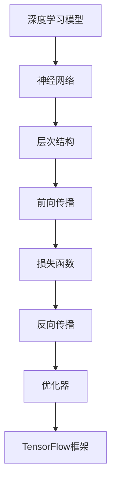

                 

# TensorFlow深度学习框架：从入门到精通

> 关键词：TensorFlow，深度学习，神经网络，编程，实践，算法，框架，模型训练，性能优化

> 摘要：本文旨在为初学者和中级开发者提供一份详细且实用的指南，帮助大家从基础开始逐步掌握TensorFlow深度学习框架。文章涵盖了TensorFlow的核心概念、算法原理、数学模型、项目实战、应用场景和未来发展趋势等内容，旨在引导读者深入了解深度学习框架的工作机制，掌握关键技术和实践方法。

## 1. 背景介绍

### 1.1 目的和范围

本文的目标是帮助读者深入了解TensorFlow深度学习框架，通过一步步的分析和推理，掌握从基础到高级的各个关键知识点。本文适用于初学者和中级开发者，尤其是那些希望将深度学习技术应用于实际问题的开发者。

文章的范围包括以下几个方面：

1. TensorFlow核心概念和架构
2. 深度学习算法原理与操作步骤
3. 数学模型和公式的详细讲解
4. 实际项目实战案例
5. 实际应用场景分析
6. 工具和资源推荐
7. 未来发展趋势与挑战

### 1.2 预期读者

本文预期读者为：

1. 对深度学习和机器学习有基本了解，但尚未使用TensorFlow框架的开发者
2. 希望在现有技能基础上进一步提高的初级开发者
3. 在深度学习项目中遇到具体问题的中级开发者

### 1.3 文档结构概述

本文将分为以下几个部分：

1. 背景介绍：介绍本文的目的、范围和预期读者
2. 核心概念与联系：详细解释TensorFlow的核心概念和架构
3. 核心算法原理 & 具体操作步骤：讲解深度学习算法的基本原理和操作步骤
4. 数学模型和公式 & 详细讲解 & 举例说明：介绍深度学习中的数学模型和公式，并给出实际应用案例
5. 项目实战：提供实际项目案例，详细解释代码实现和解读
6. 实际应用场景：分析TensorFlow在不同领域的应用场景
7. 工具和资源推荐：推荐学习资源、开发工具和框架
8. 总结：展望TensorFlow未来的发展趋势和挑战
9. 附录：常见问题与解答
10. 扩展阅读 & 参考资料：提供进一步的阅读资源和参考资料

### 1.4 术语表

#### 1.4.1 核心术语定义

- **深度学习（Deep Learning）**：一种机器学习技术，通过多层神经网络模型，对数据进行特征提取和学习。
- **TensorFlow**：一种开源深度学习框架，由Google开发，广泛应用于机器学习和深度学习项目。
- **神经网络（Neural Network）**：一种由大量神经元（节点）组成的计算模型，能够模拟人脑的神经网络结构。
- **前向传播（Forward Propagation）**：将输入数据通过神经网络传递到输出层的过程。
- **反向传播（Back Propagation）**：根据输出层的误差，反向传播误差到输入层的过程。
- **优化器（Optimizer）**：用于调整神经网络权重和偏置的算法，以最小化损失函数。

#### 1.4.2 相关概念解释

- **激活函数（Activation Function）**：神经网络中的非线性函数，用于引入非线性特性，增加模型的灵活性。
- **损失函数（Loss Function）**：用于衡量预测值与真实值之间的差异，是优化过程中需要最小化的目标。
- **梯度下降（Gradient Descent）**：一种优化算法，通过不断调整模型参数，使损失函数逐渐减小。

#### 1.4.3 缩略词列表

- **ML**：Machine Learning，机器学习
- **DL**：Deep Learning，深度学习
- **GPU**：Graphics Processing Unit，图形处理单元
- **CPU**：Central Processing Unit，中央处理单元
- **CUDA**：Compute Unified Device Architecture，计算统一设备架构

## 2. 核心概念与联系

深度学习框架如TensorFlow的核心在于其能够高效地处理复杂的神经网络模型。为了理解TensorFlow的工作原理，我们需要首先了解深度学习的一些核心概念和它们之间的关系。

以下是一个用于说明TensorFlow核心概念和架构的Mermaid流程图：



### 2.1 深度学习模型

深度学习模型是构建在神经网络基础上的。神经网络由大量相互连接的神经元组成，每个神经元接收输入信号，通过加权求和和激活函数处理后产生输出信号。深度学习模型通过多层神经网络，实现对复杂数据特征的自动提取和学习。

### 2.2 神经网络

神经网络是深度学习的基础。它模拟人脑神经网络的结构和工作原理，通过多层节点（神经元）的交互，实现输入到输出的映射。神经网络中的每个节点都是一个简单的计算单元，通过加权求和和激活函数处理输入信号，产生输出信号。

### 2.3 层次结构

神经网络具有层次结构，通常分为输入层、隐藏层和输出层。输入层接收外部数据，隐藏层对数据进行特征提取和变换，输出层生成最终结果。层次结构使得神经网络能够处理不同类型的数据，并且能够自动提取具有代表性的特征。

### 2.4 前向传播

前向传播是神经网络工作过程中的一个关键步骤。在训练阶段，输入数据通过输入层传递到隐藏层，再逐层传递到输出层。每一层节点都通过加权求和和激活函数进行处理，最终得到输出结果。

### 2.5 损失函数

损失函数是用于衡量模型预测结果与真实结果之间差异的函数。在训练过程中，通过计算损失函数的值，可以判断模型的好坏。常用的损失函数包括均方误差（MSE）和交叉熵（Cross-Entropy）。

### 2.6 反向传播

反向传播是深度学习训练过程中的另一个关键步骤。通过计算损失函数的梯度，反向传播误差到神经网络的前一层，从而调整网络权重和偏置。反向传播使得神经网络能够通过学习不断优化自身，提高预测准确性。

### 2.7 优化器

优化器是用于调整神经网络权重的算法，以最小化损失函数。常用的优化器包括梯度下降（GD）、随机梯度下降（SGD）和Adam等。优化器通过调整学习率和其他参数，平衡模型训练的效率和收敛速度。

### 2.8 TensorFlow框架

TensorFlow是一个开源的深度学习框架，提供了丰富的API和工具，用于构建、训练和部署深度学习模型。TensorFlow的核心功能包括数据流图（DataFlow Graph）、会话（Session）和运算（Operation）。通过数据流图，TensorFlow将计算过程表示为图结构，方便模型构建和优化。

## 3. 核心算法原理 & 具体操作步骤

深度学习中的核心算法原理主要包括神经网络的前向传播和反向传播。以下是对这些算法原理的详细讲解和具体操作步骤。

### 3.1 前向传播

前向传播是神经网络中的计算过程，通过多层神经元的相互连接和激活函数的处理，将输入数据映射到输出结果。以下是前向传播的具体操作步骤：

#### 3.1.1 初始化权重和偏置

在训练开始之前，需要初始化神经网络的权重（weights）和偏置（biases）。权重和偏置通常使用随机值初始化，以避免模型过拟合。

```python
# 伪代码：初始化权重和偏置
weights = random_initialization(size)
biases = random_initialization(size)
```

#### 3.1.2 输入层到隐藏层

输入数据通过输入层传递到隐藏层。每个隐藏层节点都通过加权求和和激活函数进行处理，得到新的输出值。

```python
# 伪代码：输入层到隐藏层
z = weights * x + biases
a = activation_function(z)
```

#### 3.1.3 隐藏层到输出层

隐藏层输出通过加权求和和激活函数处理后，传递到输出层。输出层节点计算预测结果，并与真实值进行比较，计算损失函数。

```python
# 伪代码：隐藏层到输出层
z_output = weights_output * a + biases_output
y_pred = activation_function_output(z_output)
loss = loss_function(y_pred, y_true)
```

#### 3.1.4 梯度下降优化

根据损失函数的梯度，使用优化器调整权重和偏置，以最小化损失函数。以下是使用梯度下降进行优化的伪代码：

```python
# 伪代码：梯度下降优化
for epoch in range(num_epochs):
    for x, y_true in dataset:
        # 前向传播
        z = weights * x + biases
        a = activation_function(z)
        z_output = weights_output * a + biases_output
        y_pred = activation_function_output(z_output)
        loss = loss_function(y_pred, y_true)
        
        # 反向传播
        dloss_dz_output = loss_function_derivative(y_pred, y_true)
        da_dz_output = activation_function_derivative(z_output)
        dz_output_dweights_output = a
        dz_output_dbiases_output = 1
        
        dloss_da = dloss_dz_output * da_dz_output
        dloss_dz = dloss_da * activation_function_derivative(z)
        dz_dweights = x
        dz_dbiases = 1
        
        # 更新权重和偏置
        weights -= learning_rate * dz_dweights
        biases -= learning_rate * dz_dbiases
        weights_output -= learning_rate * dz_output_dweights_output
        biases_output -= learning_rate * dz_output_dbiases_output
```

### 3.2 反向传播

反向传播是深度学习训练过程中的关键步骤，通过计算损失函数的梯度，反向传播误差到神经网络的前一层，调整权重和偏置。以下是反向传播的具体操作步骤：

#### 3.2.1 计算输出层的误差

输出层误差（dloss_dz_output）是损失函数对输出层预测值的梯度。以下是一个示例损失函数的误差计算：

```python
# 伪代码：计算输出层误差
dloss_dz_output = loss_function_derivative(y_pred, y_true)
```

#### 3.2.2 计算隐藏层误差

隐藏层误差（dloss_da）是输出层误差对隐藏层输出的梯度。以下是一个示例激活函数的误差计算：

```python
# 伪代码：计算隐藏层误差
da_dz_output = activation_function_derivative(z_output)
dloss_da = dloss_dz_output * da_dz_output
```

#### 3.2.3 计算输入层误差

输入层误差（dloss_dz）是隐藏层误差对输入层输入的梯度。以下是一个示例加权求和的误差计算：

```python
# 伪代码：计算输入层误差
dz_dweights = x
dz_dbiases = 1
dloss_dz = dloss_da * activation_function_derivative(z)
```

#### 3.2.4 反向传播误差

通过反向传播误差，调整权重和偏置，以最小化损失函数。以下是一个示例梯度下降的权重和偏置更新：

```python
# 伪代码：反向传播误差
weights -= learning_rate * dz_dweights
biases -= learning_rate * dz_dbiases
```

## 4. 数学模型和公式 & 详细讲解 & 举例说明

在深度学习框架如TensorFlow中，数学模型和公式是构建和优化神经网络的基础。本节将详细讲解深度学习中常用的数学模型和公式，并通过具体示例来说明它们的应用。

### 4.1 激活函数

激活函数是深度学习神经网络中引入非线性特性的关键。以下是一些常见的激活函数及其公式：

#### 4.1.1 Sigmoid函数

Sigmoid函数是一种常用的激活函数，其公式如下：

$$
\sigma(x) = \frac{1}{1 + e^{-x}}
$$

Sigmoid函数的输出范围在0到1之间，可以将输入值映射到概率值。

#### 示例：

假设输入值x为2，计算Sigmoid函数的输出：

$$
\sigma(2) = \frac{1}{1 + e^{-2}} \approx 0.869
$$

#### 4.1.2ReLU函数

ReLU（Rectified Linear Unit）函数是一种线性激活函数，其公式如下：

$$
\sigma(x) = \max(0, x)
$$

ReLU函数在x小于0时输出0，在x大于0时输出x，有助于加速神经网络训练。

#### 示例：

假设输入值x为-3，计算ReLU函数的输出：

$$
\sigma(-3) = \max(0, -3) = 0
$$

假设输入值x为3，计算ReLU函数的输出：

$$
\sigma(3) = \max(0, 3) = 3
$$

#### 4.1.3 Tanh函数

Tanh函数是一种双曲正切激活函数，其公式如下：

$$
\sigma(x) = \frac{e^x - e^{-x}}{e^x + e^{-x}}
$$

Tanh函数的输出范围在-1到1之间，有助于避免梯度消失问题。

#### 示例：

假设输入值x为2，计算Tanh函数的输出：

$$
\sigma(2) = \frac{e^2 - e^{-2}}{e^2 + e^{-2}} \approx 0.96
$$

### 4.2 损失函数

损失函数是用于衡量模型预测结果与真实结果之间差异的函数。以下是一些常见的损失函数及其公式：

#### 4.2.1 均方误差（MSE）

均方误差（MSE）是最常用的损失函数之一，其公式如下：

$$
MSE = \frac{1}{2} \sum_{i=1}^{n} (y_i - \hat{y}_i)^2
$$

其中，\(y_i\)是真实值，\(\hat{y}_i\)是预测值，\(n\)是样本数量。

#### 示例：

假设有一个包含两个样本的数据集，真实值和预测值如下：

$$
\begin{align*}
y_1 &= 2 \\
\hat{y}_1 &= 1.8 \\
y_2 &= 4 \\
\hat{y}_2 &= 3.9 \\
\end{align*}
$$

计算MSE：

$$
MSE = \frac{1}{2} \left[ (2 - 1.8)^2 + (4 - 3.9)^2 \right] = \frac{1}{2} \left[ 0.04 + 0.01 \right] = 0.025
$$

#### 4.2.2 交叉熵（Cross-Entropy）

交叉熵是用于分类问题的常用损失函数，其公式如下：

$$
CE = -\sum_{i=1}^{n} y_i \log(\hat{y}_i)
$$

其中，\(y_i\)是真实标签的one-hot编码，\(\hat{y}_i\)是预测概率。

#### 示例：

假设有一个包含两个样本的数据集，真实标签和预测概率如下：

$$
\begin{align*}
y_1 &= \begin{bmatrix} 1 \\ 0 \\ 0 \end{bmatrix} \\
\hat{y}_1 &= \begin{bmatrix} 0.9 \\ 0.05 \\ 0.05 \end{bmatrix} \\
y_2 &= \begin{bmatrix} 0 \\ 1 \\ 0 \end{bmatrix} \\
\hat{y}_2 &= \begin{bmatrix} 0.1 \\ 0.9 \\ 0.1 \end{bmatrix} \\
\end{align*}
$$

计算交叉熵：

$$
CE = -\left( y_1 \log(\hat{y}_1) + y_2 \log(\hat{y}_2) \right) = -\left( 1 \cdot \log(0.9) + 0 \cdot \log(0.05) + 0 \cdot \log(0.05) \right) - \left( 0 \cdot \log(0.1) + 1 \cdot \log(0.9) + 0 \cdot \log(0.1) \right)
$$

$$
CE = -\left( \log(0.9) + \log(0.9) \right) = -2 \log(0.9) \approx 0.386
$$

### 4.3 梯度下降优化

梯度下降优化是一种常用的优化算法，用于调整神经网络权重和偏置，以最小化损失函数。其基本公式如下：

$$
w_{new} = w_{old} - \alpha \cdot \frac{\partial J}{\partial w}
$$

其中，\(w\)是权重，\(\alpha\)是学习率，\(J\)是损失函数。

#### 示例：

假设有一个简单的线性模型，损失函数为MSE，权重\(w\)为2，学习率\(\alpha\)为0.1，输入值\(x\)为3，真实值\(y\)为4。

计算MSE：

$$
J = \frac{1}{2} \left( y - (wx + b) \right)^2 = \frac{1}{2} \left( 4 - (2 \cdot 3 + b) \right)^2
$$

计算梯度：

$$
\frac{\partial J}{\partial w} = \frac{\partial}{\partial w} \left[ \frac{1}{2} \left( 4 - (2 \cdot 3 + b) \right)^2 \right] = -2 \left( 4 - (2 \cdot 3 + b) \right) \cdot x
$$

更新权重：

$$
w_{new} = w_{old} - \alpha \cdot \frac{\partial J}{\partial w} = 2 - 0.1 \cdot (-2 \cdot (4 - (2 \cdot 3 + b)) \cdot 3) = 2 + 0.6 \cdot (4 - 6 - b)
$$

$$
w_{new} = 2 + 0.6 \cdot (-2 - b) = 2 - 1.2 - 0.6b = 0.8 - 0.6b
$$

## 5. 项目实战：代码实际案例和详细解释说明

在了解TensorFlow的核心概念和算法原理后，通过实际项目实战可以更好地巩固和应用所学知识。本节将提供一个简单的线性回归项目，详细解释代码实现和解读。

### 5.1 开发环境搭建

在开始项目之前，确保已安装Python和TensorFlow。可以使用以下命令进行环境搭建：

```bash
# 安装Python（假设已安装Python3）
pip install tensorflow
```

### 5.2 源代码详细实现和代码解读

以下是一个简单的线性回归项目示例，使用TensorFlow实现：

```python
import tensorflow as tf
import numpy as np

# 设置随机种子以保证结果可重复
tf.random.set_seed(42)

# 准备数据
x_train = np.array([[1], [2], [3], [4], [5]])
y_train = np.array([[0], [1], [2], [3], [4]])

# 模型参数
w = tf.Variable(0.0, name='weight')
b = tf.Variable(0.0, name='bias')

# 损失函数
loss_fn = tf.reduce_mean(tf.square(y_train - (w * x_train + b)))

# 优化器
optimizer = tf.optimizers.SGD(learning_rate=0.1)

# 模型训练
for epoch in range(100):
    with tf.GradientTape() as tape:
        predictions = w * x_train + b
        loss = loss_fn(predictions, y_train)
    gradients = tape.gradient(loss, [w, b])
    optimizer.apply_gradients(zip(gradients, [w, b]))
    
    if epoch % 10 == 0:
        print(f"Epoch {epoch}: Loss = {loss.numpy()}")

# 模型评估
test_x = np.array([[6]])
test_y = np.array([[5]])

test_predictions = w * test_x + b
print(f"Test Prediction: {test_predictions.numpy()}")
```

### 5.3 代码解读与分析

1. **导入库**：首先导入TensorFlow和Numpy库，用于实现线性回归模型。
2. **设置随机种子**：为了保证结果可重复，设置随机种子。
3. **准备数据**：生成训练数据\(x_train\)和\(y_train\)，用于训练模型。
4. **定义模型参数**：使用TensorFlow的Variable创建权重\(w\)和偏置\(b\)。
5. **定义损失函数**：使用TensorFlow的`tf.reduce_mean`和`tf.square`计算均方误差（MSE）。
6. **定义优化器**：使用TensorFlow的`tf.optimizers.SGD`创建随机梯度下降（SGD）优化器。
7. **模型训练**：使用`tf.GradientTape`记录梯度信息，并使用`optimizer.apply_gradients`更新模型参数。
8. **模型评估**：使用测试数据计算模型预测，并与真实值进行比较。

### 5.4 项目总结

通过这个简单的线性回归项目，我们可以看到TensorFlow在实现深度学习模型时的便捷性和灵活性。在实际项目中，可以根据需求调整模型结构、损失函数和优化器等参数，以达到更好的训练效果。

## 6. 实际应用场景

TensorFlow深度学习框架在各种实际应用场景中具有广泛的应用，以下是一些典型的应用场景：

### 6.1 图像识别

图像识别是TensorFlow的常见应用之一。通过使用预训练的模型或自定义模型，TensorFlow可以在各种图像识别任务中发挥作用，如人脸识别、物体检测和图像分类等。

### 6.2 自然语言处理

自然语言处理（NLP）是深度学习领域的一个重要分支。TensorFlow在NLP任务中具有强大的功能，如文本分类、情感分析、机器翻译和问答系统等。

### 6.3 语音识别

语音识别是将语音信号转换为文本的过程。TensorFlow通过使用卷积神经网络（CNN）和循环神经网络（RNN）等模型，可以实现高效的语音识别。

### 6.4 强化学习

强化学习是一种通过试错和反馈优化行为的方法。TensorFlow在强化学习应用中具有强大的功能，如游戏AI、机器人控制和自动驾驶等。

### 6.5 生成对抗网络（GAN）

生成对抗网络（GAN）是一种通过对抗训练生成数据的方法。TensorFlow在GAN应用中可以生成高质量的图像、音频和文本等数据。

### 6.6 医疗诊断

医疗诊断是深度学习在医学领域的应用之一。TensorFlow可以用于医疗图像分析、疾病诊断和药物研发等任务。

### 6.7 机器人控制

机器人控制是深度学习在自动化领域的应用之一。TensorFlow可以帮助机器人实现自主决策和行动，如自主导航、对象抓取和社交交互等。

## 7. 工具和资源推荐

为了更好地学习TensorFlow深度学习框架，以下是一些建议的学习资源、开发工具和框架。

### 7.1 学习资源推荐

#### 7.1.1 书籍推荐

- 《深度学习》（Deep Learning） - Goodfellow, Bengio, Courville
- 《TensorFlow实战》 - Tijanic
- 《深度学习与TensorFlow》 - 高博

#### 7.1.2 在线课程

- Coursera：深度学习课程 - Andrew Ng
- edX：TensorFlow for Artificial Intelligence - Andrew Ng
- Udacity：深度学习纳米学位 - Andrew Ng

#### 7.1.3 技术博客和网站

- TensorFlow官方文档：[TensorFlow文档](https://www.tensorflow.org/)
- Medium：深度学习相关博客：[Deep Learning on Medium](https://medium.com/topic/deep-learning)
- 知乎：深度学习和TensorFlow相关话题：[知乎深度学习话题](https://www.zhihu.com/topic/19858423/questions)

### 7.2 开发工具框架推荐

#### 7.2.1 IDE和编辑器

- PyCharm：强大的Python集成开发环境
- Visual Studio Code：轻量级且功能丰富的代码编辑器
- Jupyter Notebook：交互式计算和数据分析环境

#### 7.2.2 调试和性能分析工具

- TensorFlow Debugger（TFDB）：用于调试TensorFlow模型
- TensorBoard：用于可视化TensorFlow训练过程
- Nsight Compute：用于分析GPU性能

#### 7.2.3 相关框架和库

- Keras：基于TensorFlow的高级神经网络API
- PyTorch：另一个流行的开源深度学习框架
- MXNet：Apache基金会的一个深度学习框架

### 7.3 相关论文著作推荐

#### 7.3.1 经典论文

- "A Fast Learning Algorithm for Deep Belief Nets" - Hinton et al., 2006
- "Deep Learning" - Goodfellow, Bengio, Courville, 2015
- "Rectified Linear Units Improve Restricted Boltzmann Machines" - Hinton et al., 2012

#### 7.3.2 最新研究成果

- "Bert: Pre-training of Deep Bidirectional Transformers for Language Understanding" - Devlin et al., 2018
- "GPT-3: Language Models are Few-Shot Learners" - Brown et al., 2020
- "Transformers: State-of-the-Art Natural Language Processing" - Vaswani et al., 2017

#### 7.3.3 应用案例分析

- "Deep Learning for Computer Vision: A Comprehensive Overview" - Simonyan and Zisserman, 2014
- "Natural Language Processing with Deep Learning" - Yang and Liu, 2017
- "Deep Learning in Robotics: A Review" - Finn et al., 2017

## 8. 总结：未来发展趋势与挑战

随着深度学习技术的不断发展和应用，TensorFlow作为开源深度学习框架，也在不断更新和优化。未来，TensorFlow将面临以下发展趋势和挑战：

### 8.1 发展趋势

1. **模型规模和计算资源的需求增长**：随着模型复杂度的增加，对计算资源的需求也在不断增长。TensorFlow将继续优化GPU和CPU计算性能，以满足大规模模型的训练需求。
2. **端到端解决方案的普及**：TensorFlow将提供更多的端到端解决方案，如自动化模型生成、迁移学习等，以简化模型开发过程。
3. **生态系统的完善**：TensorFlow将继续扩大其生态系统，包括更多的高级API、工具和库，以支持不同领域的应用需求。

### 8.2 挑战

1. **模型解释性和可解释性**：深度学习模型往往缺乏可解释性，这对于实际应用中的模型验证和调试带来挑战。TensorFlow需要进一步研究如何提高模型的可解释性。
2. **安全性和隐私保护**：随着深度学习在关键领域（如医疗、金融等）的应用，模型的安全性和隐私保护成为重要问题。TensorFlow需要加强模型的安全性和隐私保护机制。
3. **算法公平性和透明性**：深度学习模型在训练和预测过程中可能存在偏见和歧视问题。TensorFlow需要关注算法的公平性和透明性，确保模型的公正性和可信赖性。

## 9. 附录：常见问题与解答

### 9.1 TensorFlow安装问题

**Q：如何安装TensorFlow？**

A：可以使用pip命令安装TensorFlow，命令如下：

```bash
pip install tensorflow
```

确保安装的是最新版本。

### 9.2 模型训练问题

**Q：如何调整模型参数以获得更好的训练效果？**

A：可以尝试以下方法：

1. 调整学习率：学习率对模型训练效果有很大影响，可以尝试不同的学习率值。
2. 调整优化器：不同的优化器对模型训练效果也有所不同，如SGD、Adam等。
3. 增加训练时间：模型可能需要更长的训练时间以达到更好的效果。
4. 使用批量归一化：批量归一化可以加速模型训练并提高模型性能。
5. 使用预训练模型：使用预训练模型可以减少训练时间，并提高模型性能。

### 9.3 模型部署问题

**Q：如何将TensorFlow模型部署到生产环境？**

A：可以将TensorFlow模型部署到以下平台：

1. **本地服务器**：将训练好的模型保存为`.h5`或`.pb`文件，然后在服务器上加载模型并进行预测。
2. **TensorFlow Serving**：TensorFlow Serving是一个高性能的服务器，用于部署TensorFlow模型。
3. **TensorFlow Lite**：TensorFlow Lite是一个轻量级的TensorFlow部署解决方案，适用于移动设备和嵌入式系统。
4. **TensorFlow.js**：TensorFlow.js是一个JavaScript库，可以将TensorFlow模型部署到Web浏览器中。

## 10. 扩展阅读 & 参考资料

为了进一步深入了解TensorFlow深度学习框架，以下是一些建议的扩展阅读和参考资料：

### 10.1 扩展阅读

- 《深度学习》（Goodfellow, Bengio, Courville）
- 《TensorFlow实战》（Tijanic）
- 《深度学习与TensorFlow》（高博）
- 《TensorFlow官方文档》（https://www.tensorflow.org/）

### 10.2 参考资料

- 《A Fast Learning Algorithm for Deep Belief Nets》（Hinton et al., 2006）
- 《Deep Learning》（Goodfellow, Bengio, Courville, 2015）
- 《Bert: Pre-training of Deep Bidirectional Transformers for Language Understanding》（Devlin et al., 2018）
- 《GPT-3: Language Models are Few-Shot Learners》（Brown et al., 2020）

### 10.3 技术博客和网站

- TensorFlow官方文档：[TensorFlow文档](https://www.tensorflow.org/)
- Medium：深度学习相关博客：[Deep Learning on Medium](https://medium.com/topic/deep-learning)
- 知乎：深度学习和TensorFlow相关话题：[知乎深度学习话题](https://www.zhihu.com/topic/19858423/questions)

### 10.4 开发工具和框架

- PyCharm：[PyCharm官网](https://www.jetbrains.com/pycharm/)
- Visual Studio Code：[Visual Studio Code官网](https://code.visualstudio.com/)
- Jupyter Notebook：[Jupyter Notebook官网](https://jupyter.org/)
- TensorFlow Debugger（TFDB）：[TensorFlow Debugger文档](https://www.tensorflow.org/tfx/serving/tensorboard)
- TensorBoard：[TensorBoard官方文档](https://www.tensorflow.org/tensorboard/)
- Nsight Compute：[Nsight Compute官方文档](https://developer.nvidia.com/nvidia-nsight-compute)
- Keras：[Keras官方文档](https://keras.io/)
- PyTorch：[PyTorch官方文档](https://pytorch.org/)
- MXNet：[MXNet官方文档](https://mxnet.incubator.apache.org/)

### 10.5 应用案例分析

- 《Deep Learning for Computer Vision: A Comprehensive Overview》（Simonyan and Zisserman, 2014）
- 《Natural Language Processing with Deep Learning》（Yang and Liu, 2017）
- 《Deep Learning in Robotics: A Review》（Finn et al., 2017）

