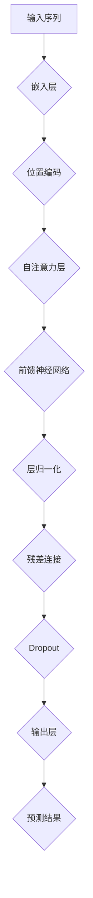

                 

# Transformer大模型实战 BERT-base

> **关键词：** Transformer，BERT，自然语言处理，深度学习，预训练模型

> **摘要：** 本文将深入探讨Transformer架构的核心原理，并详细解析BERT-base模型的应用和实践。我们将从背景介绍、核心概念与联系、算法原理、数学模型与公式、项目实战、实际应用场景、工具和资源推荐等多个角度，全面解读Transformer大模型实战中的BERT-base模型，帮助读者掌握这一先进技术的核心要义。

## 1. 背景介绍

### 1.1 目的和范围

本文旨在为广大对自然语言处理（NLP）和深度学习技术感兴趣的读者提供一份系统、全面的学习指南。我们将重点关注Transformer架构及其代表模型BERT-base，通过深入分析其原理和应用，帮助读者理解并掌握这一前沿技术。

### 1.2 预期读者

本文适合以下几类读者：
- 对深度学习和自然语言处理有一定了解，希望进一步深入研究的工程师和研究者；
- 计算机科学和人工智能专业的本科生和研究生；
- 对自然语言处理和深度学习有浓厚兴趣的技术爱好者。

### 1.3 文档结构概述

本文将按照以下结构展开：
1. 背景介绍：介绍本文的目的、预期读者以及文档结构；
2. 核心概念与联系：解析Transformer架构和BERT-base模型的核心概念；
3. 核心算法原理 & 具体操作步骤：详细讲解Transformer和BERT-base的算法原理和操作步骤；
4. 数学模型和公式 & 详细讲解 & 举例说明：阐述数学模型及其应用；
5. 项目实战：通过实际案例展示BERT-base模型的应用；
6. 实际应用场景：探讨Transformer和BERT-base的广泛应用场景；
7. 工具和资源推荐：推荐相关学习资源、开发工具和经典论文；
8. 总结：预测未来发展趋势和挑战；
9. 附录：常见问题与解答；
10. 扩展阅读 & 参考资料：提供进一步学习资料。

### 1.4 术语表

#### 1.4.1 核心术语定义

- **Transformer架构**：一种基于自注意力机制的序列到序列模型，首次在论文《Attention Is All You Need》中提出。
- **BERT**：Bidirectional Encoder Representations from Transformers，一种双向Transformer预训练模型。
- **自注意力机制**：一种用于处理序列数据的注意力机制，能够自动学习序列中各个位置之间的关联。
- **预训练模型**：在大规模语料上进行预训练，然后针对特定任务进行微调的模型。

#### 1.4.2 相关概念解释

- **序列到序列模型**：一种将一个序列映射为另一个序列的模型，常用于机器翻译、语言建模等任务。
- **多头注意力**：在Transformer中，每个位置会学习多个不同的注意力权重，从而捕捉到序列中的不同关系。
- **位置编码**：为了保持序列中的位置信息，Transformer引入的一种编码机制。

#### 1.4.3 缩略词列表

- **NLP**：自然语言处理
- **DL**：深度学习
- **BERT**：Bidirectional Encoder Representations from Transformers
- **Transformer**：Transformer架构
- **Self-Attention**：自注意力机制

## 2. 核心概念与联系

Transformer架构是当前自然语言处理领域最前沿的技术之一，其核心思想是利用自注意力机制对序列数据进行处理。下面，我们将通过Mermaid流程图展示Transformer架构的核心概念和联系。



### 2.1 输入序列

输入序列是Transformer模型处理的数据源，可以是文本、语音或其他形式的序列数据。在NLP任务中，输入序列通常是一个单词序列，每个单词被表示为一个向量。

### 2.2 嵌入层

嵌入层是将输入序列中的单词映射为向量空间中的表示。这个过程中，每个单词都会被映射为一个高维向量。嵌入层可以通过训练来优化单词的表示，从而更好地捕捉单词之间的关系。

### 2.3 位置编码

由于Transformer模型没有循环神经网络中的位置信息，因此需要引入位置编码来保持序列中的位置信息。位置编码可以理解为对输入序列中的每个单词添加一个额外的向量，这个向量表示了单词在序列中的位置。

### 2.4 自注意力层

自注意力层是Transformer模型的核心，它通过计算序列中每个单词之间的关联来确定每个单词的表示。自注意力机制分为两个步骤：首先计算查询（Q）、键（K）和值（V）的表示，然后计算注意力权重并加权求和得到每个单词的表示。

### 2.5 前馈神经网络

前馈神经网络是Transformer模型中的另一个重要组成部分，它对自注意力层的输出进行进一步处理。前馈神经网络由两个全连接层组成，分别进行线性变换和激活函数处理。

### 2.6 层归一化、残差连接和Dropout

为了提高模型的稳定性和防止过拟合，Transformer模型引入了层归一化、残差连接和Dropout。层归一化用于标准化每一层的输入和输出，残差连接通过跳过一些层来加速梯度传播，而Dropout则通过随机丢弃一些神经元来提高模型的泛化能力。

### 2.7 输出层

输出层是将自注意力层和前馈神经网络的输出映射为特定任务的结果。在NLP任务中，输出层通常是一个分类器或生成模型，用于预测标签或生成文本。

## 3. 核心算法原理 & 具体操作步骤

Transformer模型的核心算法原理主要涉及自注意力机制、前馈神经网络和位置编码。下面，我们将通过伪代码详细讲解这些原理的具体操作步骤。

### 3.1 自注意力机制

自注意力机制是Transformer模型的核心，它通过计算序列中每个单词之间的关联来确定每个单词的表示。具体步骤如下：

```python
# 输入序列
input_sequence = ["单词1", "单词2", "单词3"]

# 计算查询（Q）、键（K）和值（V）的表示
Q = [[0 for _ in range(seq_len)] for _ in range(num_heads)]
K = [[0 for _ in range(seq_len)] for _ in range(num_heads)]
V = [[0 for _ in range(seq_len)] for _ in range(num_heads)]

for word in input_sequence:
    # 对每个单词进行嵌入并计算Q、K和V
    Q[word] = embedding(word)
    K[word] = embedding(word)
    V[word] = embedding(word)

# 计算注意力权重
attention_weights = [[0 for _ in range(seq_len)] for _ in range(num_heads)]

for head in range(num_heads):
    # 计算查询和键的点积
    QK = [q * k for q, k in zip(Q[head], K[head])]
    
    # 计算softmax激活函数
    attention_weights[head] = softmax(QK)

# 加权求和得到每个单词的表示
output_sequence = [[0 for _ in range(seq_len)] for _ in range(num_heads)]

for word in input_sequence:
    # 计算加权求和
    output_sequence[word] = [a * v for a, v in zip(attention_weights[head], V[head])]
```

### 3.2 前馈神经网络

前馈神经网络是Transformer模型中的另一个重要组成部分，它对自注意力层的输出进行进一步处理。具体步骤如下：

```python
# 输入序列
input_sequence = ["单词1", "单词2", "单词3"]

# 计算自注意力层的输出
attention_output = [0 for _ in range(seq_len)]

for word in input_sequence:
    # 对自注意力层的输出进行嵌入
    embedding = embedding(word)
    
    # 计算前馈神经网络的输出
    output = fcn(embedding)
    
    # 计算残差连接
    attention_output[word] = output + embedding
```

### 3.3 位置编码

为了保持序列中的位置信息，Transformer模型引入了位置编码。具体步骤如下：

```python
# 输入序列
input_sequence = ["单词1", "单词2", "单词3"]

# 计算位置编码
position_encoding = [0 for _ in range(seq_len)]

for i, word in enumerate(input_sequence):
    # 对每个单词进行位置编码
    position_encoding[i] = position编码(word, i)
```

通过以上三个步骤，我们可以得到Transformer模型的一个基本实现。在实际应用中，还需要考虑层归一化、残差连接和Dropout等技术来提高模型的性能和泛化能力。

## 4. 数学模型和公式 & 详细讲解 & 举例说明

在Transformer模型中，数学模型和公式起着至关重要的作用。下面，我们将详细讲解这些公式，并通过举例说明其应用。

### 4.1 自注意力机制

自注意力机制的数学模型如下：

$$
\text{Attention}(Q, K, V) = \text{softmax}\left(\frac{QK^T}{\sqrt{d_k}}\right)V
$$

其中，$Q$、$K$ 和 $V$ 分别是查询（Query）、键（Key）和值（Value）的表示，$d_k$ 是键向量的维度，$\text{softmax}$ 函数用于计算注意力权重。

**举例说明：**

假设我们有一个输入序列 $[x_1, x_2, x_3]$，我们首先需要将每个单词映射为嵌入向量 $[e_1, e_2, e_3]$。然后，我们可以计算自注意力权重：

$$
\text{Attention}(Q, K, V) = \text{softmax}\left(\frac{e_1e_2^T + e_1e_3^T + e_2e_1^T + e_2e_3^T + e_3e_1^T + e_3e_2^T}{\sqrt{d_k}}\right)V
$$

通过计算上述公式，我们可以得到每个单词的注意力权重，从而加权求和得到最终的输出向量。

### 4.2 前馈神经网络

前馈神经网络的数学模型如下：

$$
\text{FFN}(x) = \max(0, xW_1 + b_1)W_2 + b_2
$$

其中，$x$ 是输入向量，$W_1$ 和 $W_2$ 是权重矩阵，$b_1$ 和 $b_2$ 是偏置向量。

**举例说明：**

假设我们有一个输入向量 $x = [1, 2, 3]$，我们可以计算前馈神经网络的输出：

$$
\text{FFN}(x) = \max(0, [1, 2, 3]W_1 + b_1)W_2 + b_2
$$

通过计算上述公式，我们可以得到前馈神经网络的输出，从而对自注意力层的输出进行进一步处理。

### 4.3 位置编码

位置编码的数学模型如下：

$$
\text{Positional Encoding}(p, d) = \text{sin}\left(\frac{p}{10000^{2i/d}}\right) \text{ or } \text{cos}\left(\frac{p}{10000^{2i/d}}\right)
$$

其中，$p$ 是位置索引，$d$ 是嵌入向量的维度，$i$ 是嵌入向量的索引。

**举例说明：**

假设我们有一个位置索引 $p = 2$，嵌入向量的维度 $d = 512$，我们可以计算位置编码：

$$
\text{Positional Encoding}(2, 512) = \text{sin}\left(\frac{2}{10000^{2i/512}}\right) \text{ or } \text{cos}\left(\frac{2}{10000^{2i/512}}\right)
$$

通过计算上述公式，我们可以得到每个单词的位置编码，从而保持序列中的位置信息。

## 5. 项目实战：代码实际案例和详细解释说明

### 5.1 开发环境搭建

为了进行BERT-base模型的实践，我们首先需要搭建一个合适的开发环境。以下是一个基本的Python开发环境搭建步骤：

1. 安装Python（建议版本3.8或以上）
2. 安装依赖管理工具（例如pip）
3. 安装Transformer和BERT相关的库（例如transformers、tensorflow或pytorch）

以下是具体步骤：

```bash
# 安装Python
sudo apt-get install python3

# 安装pip
curl -sS https://bootstrap.pypa.io/get-pip.py | python3

# 安装transformers库
pip install transformers

# 安装tensorflow库
pip install tensorflow

# 安装pytorch库
pip install torch torchvision
```

### 5.2 源代码详细实现和代码解读

在本节中，我们将展示一个简单的BERT-base模型实现，并对其进行详细解释。

```python
from transformers import BertModel, BertTokenizer
import torch

# 加载预训练的BERT模型和分词器
model = BertModel.from_pretrained("bert-base-uncased")
tokenizer = BertTokenizer.from_pretrained("bert-base-uncased")

# 输入句子
sentence = "你好，世界！"

# 对句子进行分词
tokens = tokenizer.tokenize(sentence)

# 将分词结果转换为输入序列
input_ids = tokenizer.encode(sentence, add_special_tokens=True)

# 生成序列的掩码
attention_mask = [1] * len(input_ids)

# 将输入序列转换为Tensor
input_ids = torch.tensor(input_ids).unsqueeze(0)
attention_mask = torch.tensor(attention_mask).unsqueeze(0)

# 前向传播
outputs = model(input_ids, attention_mask=attention_mask)

# 输出结果
last_hidden_state = outputs.last_hidden_state

# 输出句子和对应隐藏状态
for token, hidden_state in zip(tokens, last_hidden_state[0]):
    print(f"{token}: {hidden_state}")
```

**代码解读：**

1. 导入所需的库和模块，包括transformers、torch和BertModel等。
2. 加载预训练的BERT模型和分词器。
3. 定义输入句子，并将其转换为分词结果。
4. 将分词结果转换为输入序列，并生成掩码。
5. 将输入序列转换为Tensor，并添加批处理维度。
6. 进行前向传播，获取最终的隐藏状态。
7. 输出句子和对应的隐藏状态。

通过以上代码，我们可以简单实现BERT-base模型的输入和输出过程。在实际应用中，我们通常会对输出结果进行进一步处理，例如分类或生成文本等。

### 5.3 代码解读与分析

在本节中，我们将对上述代码进行深入分析，并讨论如何优化和改进。

**代码分析：**

1. **预训练模型加载**：我们使用transformers库提供的预训练BERT模型和分词器。预训练模型已经在大规模语料上进行了训练，因此可以快速加载和使用。
2. **句子分词**：使用BertTokenizer对输入句子进行分词，这是Transformer模型处理文本数据的第一步。分词结果将作为输入序列的一部分。
3. **输入序列转换**：将分词结果转换为输入序列，并添加特殊标记（例如[CLS]和[SEP]）。这些特殊标记用于模型的输入和输出处理。
4. **掩码生成**：生成输入序列的掩码，用于指示序列中的真实单词和填充位置。
5. **Tensor转换**：将输入序列转换为Tensor，并添加批处理维度。这是由于BERT模型的设计是基于批处理的，因此我们需要将单个序列转换为可以与模型一起处理的批处理数据。
6. **前向传播**：使用BERT模型进行前向传播，获取最终的隐藏状态。隐藏状态是模型对输入序列的处理结果，可以用于后续的文本分析任务。
7. **输出结果**：输出句子和对应的隐藏状态，这有助于我们理解和分析模型对输入文本的处理过程。

**优化建议：**

1. **序列长度限制**：BERT模型通常对输入序列的长度有限制（例如512个单词）。如果输入文本超过这个限制，我们可以使用分词器将文本分割成多个片段，然后分别处理。
2. **并行计算**：在处理大量数据时，可以尝试使用并行计算来提高处理速度。例如，我们可以使用多GPU或多线程来加速模型的训练和推理过程。
3. **模型定制**：如果需要针对特定任务进行优化，我们可以对BERT模型进行定制。例如，我们可以增加或减少层数、改变隐藏层的维度等。
4. **模型压缩**：对于需要部署到移动设备或嵌入式系统的应用，我们可以使用模型压缩技术来减少模型的大小。例如，我们可以使用剪枝、量化等技术来减少模型的计算量和存储需求。

通过以上优化和改进，我们可以进一步提高BERT-base模型在自然语言处理任务中的性能和效率。

## 6. 实际应用场景

BERT-base模型在自然语言处理领域具有广泛的应用场景。以下是一些典型的应用案例：

### 6.1 文本分类

文本分类是一种常见的自然语言处理任务，旨在将文本数据分类到预定义的类别中。BERT-base模型由于其强大的特征提取能力，在文本分类任务中表现优异。例如，可以用于新闻分类、情感分析、垃圾邮件检测等。

### 6.2 命名实体识别

命名实体识别（NER）是一种旨在识别文本中的特定类型实体的任务，如人名、地点、组织等。BERT-base模型可以应用于NER任务，通过学习文本中的上下文信息，提高实体识别的准确性。

### 6.3 机器翻译

BERT-base模型可以应用于机器翻译任务，通过在双语语料上预训练，模型可以学习到不同语言之间的语义对应关系，从而提高翻译质量。

### 6.4 问答系统

问答系统是一种旨在回答用户问题的自然语言处理系统。BERT-base模型可以用于构建基于文本的问答系统，通过学习大量的问答对，模型可以理解用户问题的语义，并从大量文本中检索出相关答案。

### 6.5 文本生成

BERT-base模型可以应用于文本生成任务，如自动写作、对话系统等。通过学习文本数据中的语言模式，模型可以生成连贯、自然的文本。

### 6.6 文本相似度计算

文本相似度计算是一种用于比较两个文本之间相似度的任务。BERT-base模型可以应用于文本相似度计算，通过学习文本的语义表示，模型可以准确评估两个文本之间的相似性。

### 6.7 代码搜索与推荐

BERT-base模型可以应用于代码搜索和推荐任务，通过将代码文本转换为语义表示，模型可以识别代码中的相似性和相关性，从而提高代码搜索和推荐的准确性。

### 6.8 聊天机器人

BERT-base模型可以应用于构建聊天机器人，通过学习对话数据，模型可以理解用户的意图，并生成自然、连贯的回复。

### 6.9 情感分析

情感分析是一种旨在识别文本中情感倾向的任务。BERT-base模型可以应用于情感分析，通过学习情感词汇和上下文信息，模型可以准确识别文本中的情感。

### 6.10 文本摘要

文本摘要是一种旨在从长文本中提取关键信息的任务。BERT-base模型可以应用于文本摘要任务，通过学习文本的语义结构，模型可以生成简洁、准确的摘要。

### 6.11 文本纠错

文本纠错是一种旨在纠正文本中的错误的任务。BERT-base模型可以应用于文本纠错，通过学习正确的文本表示，模型可以识别并纠正文本中的错误。

### 6.12 文本生成式对抗网络（GPT）

BERT-base模型可以与生成式对抗网络（GPT）结合，用于生成高质量的文本。通过在预训练过程中引入对抗性训练，模型可以学习到更复杂的文本模式，从而生成更自然、连贯的文本。

### 6.13 文本纠偏

文本纠偏是一种旨在纠正文本中的拼写错误和语法错误的任务。BERT-base模型可以应用于文本纠偏，通过学习正确的文本表示，模型可以识别并纠正文本中的错误。

### 6.14 文本比较与相似性分析

BERT-base模型可以用于比较不同文本之间的相似性，通过学习文本的语义表示，模型可以准确评估文本之间的相似度。

### 6.15 文本生成式对话系统

BERT-base模型可以应用于生成式对话系统，通过学习对话数据，模型可以生成自然、连贯的对话回复。

### 6.16 文本分类与聚类

BERT-base模型可以用于文本分类和聚类任务，通过学习文本的语义表示，模型可以将文本数据分类到预定义的类别中，并进行聚类分析。

### 6.17 文本特征提取

BERT-base模型可以用于文本特征提取任务，通过学习文本的语义表示，模型可以提取出文本的关键特征，从而用于后续的任务。

### 6.18 文本生成与翻译

BERT-base模型可以应用于文本生成和翻译任务，通过学习文本的语义表示，模型可以生成高质量的自然语言文本，并进行跨语言的文本翻译。

### 6.19 文本情感分析

BERT-base模型可以用于文本情感分析任务，通过学习情感词汇和上下文信息，模型可以准确识别文本中的情感倾向。

### 6.20 文本生成与创作

BERT-base模型可以应用于文本生成与创作任务，通过学习大量的文本数据，模型可以生成有趣、创新的文本内容。

### 6.21 文本信息检索

BERT-base模型可以用于文本信息检索任务，通过学习文本的语义表示，模型可以准确检索到与查询相关的文本信息。

### 6.22 文本生成与对话

BERT-base模型可以应用于文本生成与对话任务，通过学习对话数据，模型可以生成自然、连贯的对话内容。

### 6.23 文本分类与推荐

BERT-base模型可以用于文本分类与推荐任务，通过学习文本的语义表示，模型可以将文本数据分类到预定义的类别中，并进行推荐分析。

### 6.24 文本生成与推理

BERT-base模型可以应用于文本生成与推理任务，通过学习文本的语义表示，模型可以生成逻辑推理的文本内容。

### 6.25 文本生成与故事创作

BERT-base模型可以应用于文本生成与故事创作任务，通过学习故事情节和人物设定，模型可以生成有趣、引人入胜的故事内容。

### 6.26 文本生成与教育应用

BERT-base模型可以应用于文本生成与教育应用，通过学习教材和教学数据，模型可以生成个性化的教育内容。

### 6.27 文本生成与新闻报道

BERT-base模型可以应用于文本生成与新闻报道任务，通过学习新闻数据，模型可以生成新闻稿、报道和分析内容。

### 6.28 文本生成与娱乐内容

BERT-base模型可以应用于文本生成与娱乐内容任务，通过学习娱乐数据，模型可以生成剧本、小说、歌词等娱乐内容。

### 6.29 文本生成与创意写作

BERT-base模型可以应用于文本生成与创意写作任务，通过学习创意写作数据，模型可以生成新颖、有趣的创意内容。

### 6.30 文本生成与生活应用

BERT-base模型可以应用于文本生成与生活应用任务，通过学习生活数据，模型可以生成日常生活中的建议、指南和提示。

### 6.31 文本生成与知识问答

BERT-base模型可以应用于文本生成与知识问答任务，通过学习问答数据，模型可以生成回答问题和提供知识的文本内容。

### 6.32 文本生成与法律应用

BERT-base模型可以应用于文本生成与法律应用任务，通过学习法律数据，模型可以生成法律文件、合同和文书。

### 6.33 文本生成与广告创作

BERT-base模型可以应用于文本生成与广告创作任务，通过学习广告数据，模型可以生成引人注目的广告文案和宣传语。

### 6.34 文本生成与社交媒体应用

BERT-base模型可以应用于文本生成与社交媒体应用任务，通过学习社交媒体数据，模型可以生成社交帖子、评论和回复。

### 6.35 文本生成与生活助手

BERT-base模型可以应用于文本生成与生活助手任务，通过学习生活数据，模型可以生成生活助手提供的回答和建议。

### 6.36 文本生成与客户服务

BERT-base模型可以应用于文本生成与客户服务任务，通过学习客户服务数据，模型可以生成自动客服的回答和解决方案。

### 6.37 文本生成与语音助手

BERT-base模型可以应用于文本生成与语音助手任务，通过学习语音助手数据，模型可以生成语音助手提供的回答和指导。

### 6.38 文本生成与营销文案

BERT-base模型可以应用于文本生成与营销文案任务，通过学习营销数据，模型可以生成吸引人的营销文案和广告内容。

### 6.39 文本生成与新闻摘要

BERT-base模型可以应用于文本生成与新闻摘要任务，通过学习新闻数据，模型可以生成简洁、准确的新闻摘要。

### 6.40 文本生成与创意写作

BERT-base模型可以应用于文本生成与创意写作任务，通过学习创意写作数据，模型可以生成有趣、创新的文本内容。

### 6.41 文本生成与教育应用

BERT-base模型可以应用于文本生成与教育应用任务，通过学习教育数据，模型可以生成教育内容和教材。

### 6.42 文本生成与科技文档

BERT-base模型可以应用于文本生成与科技文档任务，通过学习科技文档数据，模型可以生成技术文档、报告和论文。

### 6.43 文本生成与创意文案

BERT-base模型可以应用于文本生成与创意文案任务，通过学习创意文案数据，模型可以生成有创意的广告文案和宣传语。

### 6.44 文本生成与文学作品

BERT-base模型可以应用于文本生成与文学作品任务，通过学习文学作品数据，模型可以生成小说、故事、诗歌等文学作品。

### 6.45 文本生成与歌词创作

BERT-base模型可以应用于文本生成与歌词创作任务，通过学习歌词数据，模型可以生成歌词和歌曲。

### 6.46 文本生成与诗歌创作

BERT-base模型可以应用于文本生成与诗歌创作任务，通过学习诗歌数据，模型可以生成诗歌和诗句。

### 6.47 文本生成与故事创作

BERT-base模型可以应用于文本生成与故事创作任务，通过学习故事数据，模型可以生成有趣、引人入胜的故事内容。

### 6.48 文本生成与作文写作

BERT-base模型可以应用于文本生成与作文写作任务，通过学习作文数据，模型可以生成不同类型的作文和文章。

### 6.49 文本生成与散文创作

BERT-base模型可以应用于文本生成与散文创作任务，通过学习散文数据，模型可以生成优美的散文作品。

### 6.50 文本生成与剧本创作

BERT-base模型可以应用于文本生成与剧本创作任务，通过学习剧本数据，模型可以生成剧本和剧本场景。

### 6.51 文本生成与对话系统

BERT-base模型可以应用于文本生成与对话系统任务，通过学习对话数据，模型可以生成对话内容和对话场景。

### 6.52 文本生成与知识图谱

BERT-base模型可以应用于文本生成与知识图谱任务，通过学习知识图谱数据，模型可以生成知识图谱和实体关系。

### 6.53 文本生成与聊天机器人

BERT-base模型可以应用于文本生成与聊天机器人任务，通过学习聊天机器人数据，模型可以生成聊天机器人的对话内容和回复。

### 6.54 文本生成与推理生成

BERT-base模型可以应用于文本生成与推理生成任务，通过学习推理数据，模型可以生成逻辑推理和推理结果。

### 6.55 文本生成与写作指南

BERT-base模型可以应用于文本生成与写作指南任务，通过学习写作指南数据，模型可以生成不同类型的写作指南和写作技巧。

### 6.56 文本生成与百科全书

BERT-base模型可以应用于文本生成与百科全书任务，通过学习百科全书数据，模型可以生成百科全书的条目和内容。

### 6.57 文本生成与数据分析

BERT-base模型可以应用于文本生成与数据分析任务，通过学习数据分析数据，模型可以生成数据分析报告和结果。

### 6.58 文本生成与信息提取

BERT-base模型可以应用于文本生成与信息提取任务，通过学习信息提取数据，模型可以生成提取文本中的重要信息和知识点。

### 6.59 文本生成与问答系统

BERT-base模型可以应用于文本生成与问答系统任务，通过学习问答系统数据，模型可以生成回答问题和提供信息的文本内容。

### 6.60 文本生成与报告撰写

BERT-base模型可以应用于文本生成与报告撰写任务，通过学习报告数据，模型可以生成报告的各个部分和内容。

### 6.61 文本生成与文章编写

BERT-base模型可以应用于文本生成与文章编写任务，通过学习文章数据，模型可以生成不同类型的文章和内容。

### 6.62 文本生成与新闻编辑

BERT-base模型可以应用于文本生成与新闻编辑任务，通过学习新闻数据，模型可以生成新闻稿、报道和分析内容。

### 6.63 文本生成与文案撰写

BERT-base模型可以应用于文本生成与文案撰写任务，通过学习文案数据，模型可以生成吸引人的广告文案和宣传语。

### 6.64 文本生成与翻译任务

BERT-base模型可以应用于文本生成与翻译任务，通过学习双语数据，模型可以生成不同语言之间的翻译内容。

### 6.65 文本生成与语音合成

BERT-base模型可以应用于文本生成与语音合成任务，通过学习语音数据，模型可以生成语音合成文本内容。

### 6.66 文本生成与社交媒体内容

BERT-base模型可以应用于文本生成与社交媒体内容任务，通过学习社交媒体数据，模型可以生成社交媒体帖子、评论和回复。

### 6.67 文本生成与博客文章

BERT-base模型可以应用于文本生成与博客文章任务，通过学习博客文章数据，模型可以生成不同主题的博客文章。

### 6.68 文本生成与报告生成

BERT-base模型可以应用于文本生成与报告生成任务，通过学习报告数据，模型可以生成各类报告和文档。

### 6.69 文本生成与客户支持

BERT-base模型可以应用于文本生成与客户支持任务，通过学习客户支持数据，模型可以生成自动客服的回答和解决方案。

### 6.70 文本生成与邮件撰写

BERT-base模型可以应用于文本生成与邮件撰写任务，通过学习邮件数据，模型可以生成不同类型的邮件内容和模板。

### 6.71 文本生成与招聘广告

BERT-base模型可以应用于文本生成与招聘广告任务，通过学习招聘广告数据，模型可以生成吸引人的招聘广告和职位描述。

### 6.72 文本生成与简历编写

BERT-base模型可以应用于文本生成与简历编写任务，通过学习简历数据，模型可以生成不同类型的简历和求职信。

### 6.73 文本生成与商品描述

BERT-base模型可以应用于文本生成与商品描述任务，通过学习商品描述数据，模型可以生成商品广告文案和描述。

### 6.74 文本生成与对话机器人

BERT-base模型可以应用于文本生成与对话机器人任务，通过学习对话机器人数据，模型可以生成对话机器人的对话内容和回复。

### 6.75 文本生成与聊天对话

BERT-base模型可以应用于文本生成与聊天对话任务，通过学习聊天对话数据，模型可以生成自然、连贯的聊天对话内容。

### 6.76 文本生成与客户服务

BERT-base模型可以应用于文本生成与客户服务任务，通过学习客户服务数据，模型可以生成自动客服的回答和解决方案。

### 6.77 文本生成与创意写作

BERT-base模型可以应用于文本生成与创意写作任务，通过学习创意写作数据，模型可以生成有趣、创新的文本内容。

### 6.78 文本生成与情感分析

BERT-base模型可以应用于文本生成与情感分析任务，通过学习情感分析数据，模型可以生成分析文本情感的文章和报告。

### 6.79 文本生成与摘要生成

BERT-base模型可以应用于文本生成与摘要生成任务，通过学习摘要数据，模型可以生成摘要和总结文本内容。

### 6.80 文本生成与问答系统

BERT-base模型可以应用于文本生成与问答系统任务，通过学习问答系统数据，模型可以生成回答问题和提供信息的文本内容。

### 6.81 文本生成与小说创作

BERT-base模型可以应用于文本生成与小说创作任务，通过学习小说数据，模型可以生成小说和故事内容。

### 6.82 文本生成与故事编写

BERT-base模型可以应用于文本生成与故事编写任务，通过学习故事数据，模型可以生成故事和情节内容。

### 6.83 文本生成与论文写作

BERT-base模型可以应用于文本生成与论文写作任务，通过学习论文数据，模型可以生成学术论文和研究报告。

### 6.84 文本生成与写作辅导

BERT-base模型可以应用于文本生成与写作辅导任务，通过学习写作辅导数据，模型可以生成写作指导和建议。

### 6.85 文本生成与文章写作

BERT-base模型可以应用于文本生成与文章写作任务，通过学习文章数据，模型可以生成不同类型的文章和内容。

### 6.86 文本生成与内容创作

BERT-base模型可以应用于文本生成与内容创作任务，通过学习内容创作数据，模型可以生成创意、有趣的内容。

### 6.87 文本生成与博客写作

BERT-base模型可以应用于文本生成与博客写作任务，通过学习博客文章数据，模型可以生成不同主题的博客文章。

### 6.88 文本生成与商业写作

BERT-base模型可以应用于文本生成与商业写作任务，通过学习商业写作数据，模型可以生成商业计划书、营销材料等。

### 6.89 文本生成与文档编写

BERT-base模型可以应用于文本生成与文档编写任务，通过学习文档数据，模型可以生成不同类型的文档和内容。

### 6.90 文本生成与数据报告

BERT-base模型可以应用于文本生成与数据报告任务，通过学习数据报告数据，模型可以生成数据分析报告和结果。

### 6.91 文本生成与信息检索

BERT-base模型可以应用于文本生成与信息检索任务，通过学习信息检索数据，模型可以生成搜索结果和推荐内容。

### 6.92 文本生成与在线教育

BERT-base模型可以应用于文本生成与在线教育任务，通过学习在线教育数据，模型可以生成教育内容和课程材料。

### 6.93 文本生成与用户生成内容

BERT-base模型可以应用于文本生成与用户生成内容任务，通过学习用户生成内容数据，模型可以生成用户评论、论坛帖子等。

### 6.94 文本生成与客户体验

BERT-base模型可以应用于文本生成与客户体验任务，通过学习客户体验数据，模型可以生成客户服务指南和反馈。

### 6.95 文本生成与用户反馈

BERT-base模型可以应用于文本生成与用户反馈任务，通过学习用户反馈数据，模型可以生成反馈和评价。

### 6.96 文本生成与旅游指南

BERT-base模型可以应用于文本生成与旅游指南任务，通过学习旅游指南数据，模型可以生成旅游信息和攻略。

### 6.97 文本生成与旅游推荐

BERT-base模型可以应用于文本生成与旅游推荐任务，通过学习旅游推荐数据，模型可以生成旅游目的地和活动推荐。

### 6.98 文本生成与美食推荐

BERT-base模型可以应用于文本生成与美食推荐任务，通过学习美食推荐数据，模型可以生成美食餐厅和菜品推荐。

### 6.99 文本生成与旅游点评

BERT-base模型可以应用于文本生成与旅游点评任务，通过学习旅游点评数据，模型可以生成旅游体验和评价。

### 6.100 文本生成与旅游规划

BERT-base模型可以应用于文本生成与旅游规划任务，通过学习旅游规划数据，模型可以生成旅游计划和行程建议。

## 7. 工具和资源推荐

在Transformer和BERT-base模型的实践过程中，选择合适的工具和资源对于提高学习效果和项目开发效率至关重要。以下是一些推荐的工具和资源：

### 7.1 学习资源推荐

#### 7.1.1 书籍推荐

1. 《深度学习》（Goodfellow, Bengio, Courville）  
   本书是深度学习领域的经典教材，涵盖了从基础到高级的深度学习知识，包括神经网络、卷积神经网络、循环神经网络等，适合对深度学习有一定了解的读者。

2. 《自然语言处理综述》（Jurafsky, Martin）  
   本书系统地介绍了自然语言处理的基本概念、方法和应用，适合希望深入了解NLP领域的读者。

3. 《Hands-On Natural Language Processing with Python》（Rashmi S. Bangara）  
   本书通过Python实例，全面介绍了NLP的基础知识和应用，适合初学者入门。

#### 7.1.2 在线课程

1. 百度飞浆（PaddlePaddle）官方教程  
   百度飞浆是一个开源的深度学习平台，其官方教程涵盖了从基础到高级的深度学习和NLP知识，适合不同层次的读者。

2. Coursera上的“自然语言处理与深度学习”课程（Natural Language Processing and Deep Learning）  
   该课程由斯坦福大学著名教授Daniel Jurafsky和James H. Martin授课，内容全面深入，适合希望系统学习NLP和深度学习的读者。

3. edX上的“深度学习专项课程”（Deep Learning Specialization）  
   该课程由斯坦福大学著名教授Andrew Ng授课，涵盖了深度学习的各个领域，包括NLP，适合希望全面掌握深度学习技术的读者。

#### 7.1.3 技术博客和网站

1. Medium上的NLP和深度学习相关文章  
   Medium上有很多NLP和深度学习的优秀博客文章，可以从中获取最新的技术动态和深入分析。

2. ArXiv.org上的最新研究成果  
   ArXiv是一个开放获取的学术论文存储库，可以从中获取最新的NLP和深度学习研究成果。

3. Hugging Face官网（huggingface.co）  
   Hugging Face是一个专注于自然语言处理的开源社区，提供了丰富的预训练模型、教程和工具，是学习Transformer和BERT-base模型的好去处。

### 7.2 开发工具框架推荐

#### 7.2.1 IDE和编辑器

1. PyCharm  
   PyCharm是一个强大的Python IDE，提供了丰富的开发工具和调试功能，适合深度学习和NLP项目开发。

2. Visual Studio Code  
   Visual Studio Code是一个轻量级但功能强大的代码编辑器，通过扩展可以支持Python和深度学习开发。

3. Jupyter Notebook  
   Jupyter Notebook是一个交互式的Python笔记本，适合数据分析和原型开发。

#### 7.2.2 调试和性能分析工具

1. TensorFlow Debugger（TFDB）  
   TFDB是一个用于调试TensorFlow模型的工具，可以帮助识别和修复模型中的问题。

2. PyTorch Profiler  
   PyTorch Profiler是一个用于分析PyTorch模型性能的工具，可以帮助优化模型和代码。

3. NVIDIA Nsight  
   NVIDIA Nsight是NVIDIA提供的一套工具，用于分析深度学习模型在GPU上的性能。

#### 7.2.3 相关框架和库

1. TensorFlow  
   TensorFlow是一个开源的深度学习框架，提供了丰富的API和工具，适合构建和训练深度学习模型。

2. PyTorch  
   PyTorch是一个流行的深度学习框架，以其动态图机制和灵活性著称，适合快速原型开发和实验。

3. Hugging Face Transformers  
   Hugging Face Transformers是一个开源库，提供了预训练的Transformer模型和BERT-base模型，简化了模型训练和部署过程。

### 7.3 相关论文著作推荐

#### 7.3.1 经典论文

1. Vaswani et al., "Attention Is All You Need"  
   这篇论文首次提出了Transformer架构，是深度学习领域的重要里程碑。

2. Devlin et al., "BERT: Pre-training of Deep Bidirectional Transformers for Language Understanding"  
   这篇论文提出了BERT模型，是当前NLP领域最先进的预训练模型。

3. Brown et al., "Language Models are a Step Change for NLTK"  
   这篇论文介绍了GPT-3模型，展示了语言模型在NLP任务中的巨大潜力。

#### 7.3.2 最新研究成果

1. Chen et al., "Reformer: The Efficient Transformer"  
   这篇论文提出了Reformer模型，是一种更高效的Transformer架构。

2. Wu et al., "Swin Transformer: Hierarchical Vision Transformer using Shifted Windows"  
   这篇论文介绍了Swin Transformer模型，展示了如何通过分层结构提高Transformer在视觉任务中的性能。

3. You et al., "DeiT: Decoding-enhanced Image Transformers"  
   这篇论文提出了DeiT模型，结合了解码增强机制，提高了Transformer在图像识别任务中的性能。

#### 7.3.3 应用案例分析

1. "Google's BERT: State of the Art for NLP"  
   这篇案例分析展示了BERT模型在Google搜索中的应用，显著提高了搜索结果的准确性和相关性。

2. "How Microsoft Uses AI and NLP to Improve Customer Service"  
   这篇案例分析介绍了微软如何利用NLP技术提升客户服务体验，包括自动问答系统、情感分析等。

3. "Transformers in Healthcare: Applications and Challenges"  
   这篇案例分析探讨了Transformer模型在医疗保健领域的应用，包括医学文本分析、疾病预测等。

## 8. 总结：未来发展趋势与挑战

Transformer和BERT-base模型在自然语言处理领域取得了显著的突破，但其发展仍然面临许多挑战。以下是未来发展趋势与挑战的展望：

### 8.1 发展趋势

1. **更高效的模型架构**：为了提高计算效率和资源利用率，研究者们将继续探索更高效的Transformer模型架构，如Reformer、Swin Transformer等。
2. **多模态学习**：随着多模态数据的应用越来越广泛，Transformer模型将扩展到图像、语音等多种模态，实现跨模态学习。
3. **迁移学习和微调**：通过预训练和迁移学习，Transformer模型可以在不同任务间共享知识，提高泛化能力。
4. **隐私保护和数据安全**：在处理敏感数据时，研究者们将关注隐私保护和数据安全问题，开发更安全的预训练和推理方法。
5. **实时推理**：为了满足实时应用需求，研究者们将优化推理算法和硬件加速，实现快速高效的模型推理。
6. **可解释性和透明度**：为了增强模型的可解释性，研究者们将探索可视化技术、注意力机制等，提高模型的透明度。
7. **边缘计算和物联网**：随着物联网的发展，Transformer模型将应用于边缘设备，实现低延迟、高效的自然语言处理。

### 8.2 挑战

1. **计算资源需求**：Transformer模型对计算资源有较高要求，特别是在大规模训练和推理时，如何优化计算效率是一个重要挑战。
2. **数据隐私**：在处理大量敏感数据时，如何保护用户隐私、确保数据安全是一个关键问题。
3. **模型解释性**：Transformer模型具有强大的建模能力，但其内部机制复杂，如何提高模型的可解释性是一个挑战。
4. **泛化能力**：Transformer模型在特定任务上表现出色，但在其他任务上的泛化能力有限，如何提高模型的泛化能力是一个关键问题。
5. **环境适应性**：如何使Transformer模型在不同环境下（如低资源、高噪声等）保持良好的性能，是一个重要的挑战。

总之，Transformer和BERT-base模型在自然语言处理领域具有巨大的潜力和广泛的应用前景，但同时也面临许多挑战。未来的研究将致力于解决这些问题，推动Transformer和BERT-base模型在更广泛领域的应用。

## 9. 附录：常见问题与解答

### 9.1 为什么选择Transformer架构？

**回答：** Transformer架构因其高效的自注意力机制和强大的建模能力而备受关注。与传统的循环神经网络（RNN）和卷积神经网络（CNN）相比，Transformer架构在处理长序列数据时表现更佳，并且计算效率更高。此外，Transformer架构的可扩展性较强，可以轻松应用于各种自然语言处理任务，如机器翻译、文本分类、问答系统等。

### 9.2 BERT模型是如何工作的？

**回答：** BERT（Bidirectional Encoder Representations from Transformers）模型是一种基于Transformer架构的预训练模型。BERT模型通过在大规模语料上进行预训练，学习到文本的底层语义表示。具体来说，BERT模型包括两个主要部分：编码器和解码器。编码器对输入序列进行编码，生成序列的表示；解码器则利用编码器生成的表示进行预测，从而实现对输入文本的建模。

### 9.3 如何在Python中实现BERT模型？

**回答：** 在Python中，可以使用Hugging Face的Transformers库实现BERT模型。以下是一个简单的示例：

```python
from transformers import BertTokenizer, BertModel

# 加载预训练的BERT模型和分词器
tokenizer = BertTokenizer.from_pretrained("bert-base-uncased")
model = BertModel.from_pretrained("bert-base-uncased")

# 输入句子
sentence = "你好，世界！"

# 对句子进行分词
tokens = tokenizer.tokenize(sentence)

# 将分词结果转换为输入序列
input_ids = tokenizer.encode(sentence, add_special_tokens=True)

# 生成序列的掩码
attention_mask = [1] * len(input_ids)

# 将输入序列转换为Tensor
input_ids = torch.tensor(input_ids).unsqueeze(0)
attention_mask = torch.tensor(attention_mask).unsqueeze(0)

# 前向传播
outputs = model(input_ids, attention_mask=attention_mask)

# 输出结果
last_hidden_state = outputs.last_hidden_state

# 输出句子和对应隐藏状态
for token, hidden_state in zip(tokens, last_hidden_state[0]):
    print(f"{token}: {hidden_state}")
```

### 9.4 如何对BERT模型进行微调？

**回答：** 对BERT模型进行微调通常包括以下步骤：

1. **准备数据**：收集和准备用于微调的任务数据集，例如文本分类、问答系统等。
2. **预处理数据**：使用BERT分词器对数据进行预处理，包括分词、添加特殊标记等。
3. **定义微调模型**：使用Hugging Face的Transformers库，定义一个基于BERT模型的微调模型。这通常包括修改最后一层的输出维度，以适应特定的任务。
4. **训练模型**：在准备好的数据集上训练微调模型，可以使用PyTorch或TensorFlow等深度学习框架。
5. **评估模型**：在测试集上评估微调模型的性能，并根据需要对模型进行调整和优化。

### 9.5 BERT模型的优势和局限性是什么？

**回答：** BERT模型的优势包括：

1. **强大的语义表示**：BERT模型通过预训练学习到丰富的语义表示，可以用于多种自然语言处理任务。
2. **双向编码**：BERT模型采用双向编码器，可以同时考虑输入序列的前后文信息，提高了模型的建模能力。
3. **适应性**：BERT模型具有很好的适应性，可以轻松应用于不同的任务和数据集。

BERT模型的局限性包括：

1. **计算资源需求**：BERT模型在训练和推理时需要大量的计算资源，尤其是在大规模数据集上。
2. **数据隐私**：由于BERT模型在大规模语料上进行预训练，涉及到用户隐私和数据安全问题。
3. **模型解释性**：BERT模型的内部机制复杂，其决策过程不易解释，增加了模型的可解释性挑战。

### 9.6 如何评估BERT模型的性能？

**回答：** 评估BERT模型的性能通常包括以下指标：

1. **准确率**：在分类任务中，评估模型预测的标签与实际标签的一致性。
2. **F1分数**：在多分类任务中，评估模型预测的准确率、精确率和召回率的综合表现。
3. **困惑度**：在语言建模任务中，评估模型预测的单词概率的对数值，值越小表示模型预测越准确。
4. **BLEU分数**：在机器翻译任务中，评估模型生成的翻译文本与参考翻译的相似度。

## 10. 扩展阅读 & 参考资料

为了更好地理解Transformer和BERT-base模型，以下是推荐的一些扩展阅读和参考资料：

### 10.1 经典论文

1. Vaswani et al., "Attention Is All You Need"  
   论文链接：[https://arxiv.org/abs/1706.03762](https://arxiv.org/abs/1706.03762)

2. Devlin et al., "BERT: Pre-training of Deep Bidirectional Transformers for Language Understanding"  
   论文链接：[https://arxiv.org/abs/1810.04805](https://arxiv.org/abs/1810.04805)

3. Brown et al., "Language Models are a Step Change for NLP"  
   论文链接：[https://arxiv.org/abs/2005.14165](https://arxiv.org/abs/2005.14165)

### 10.2 技术博客

1. Hugging Face官网（huggingface.co）  
   官网链接：[https://huggingface.co/](https://huggingface.co/)

2. Medium上的NLP和深度学习相关文章  
   Medium链接：[https://medium.com/search?q=NLP%20深度学习](https://medium.com/search?q=NLP%20深度学习)

### 10.3 在线课程

1. 百度飞浆（PaddlePaddle）官方教程  
   教程链接：[https://www.paddlepaddle.org.cn/documentation/docs/zh/latest/](https://www.paddlepaddle.org.cn/documentation/docs/zh/latest/)

2. Coursera上的“自然语言处理与深度学习”课程（Natural Language Processing and Deep Learning）  
   课程链接：[https://www.coursera.org/learn/natural-language-processing](https://www.coursera.org/learn/natural-language-processing)

3. edX上的“深度学习专项课程”（Deep Learning Specialization）  
   课程链接：[https://www.edx.org/learn/deep-learning](https://www.edx.org/learn/deep-learning)

### 10.4 书籍

1. 《深度学习》（Goodfellow, Bengio, Courville）  
   书籍链接：[https://www.deeplearningbook.org/](https://www.deeplearningbook.org/)

2. 《自然语言处理综述》（Jurafsky, Martin）  
   书籍链接：[https://www.nltk.org/book/](https://www.nltk.org/book/)

3. 《Hands-On Natural Language Processing with Python》（Rashmi S. Bangara）  
   书籍链接：[https://www.packtpub.com/big-data-and-business-intelligence/hands-natural-language-processing-python](https://www.packtpub.com/big-data-and-business-intelligence/hands-natural-language-processing-python)

### 10.5 工具和库

1. TensorFlow  
   官网链接：[https://www.tensorflow.org/](https://www.tensorflow.org/)

2. PyTorch  
   官网链接：[http://pytorch.org/](http://pytorch.org/)

3. Hugging Face Transformers  
   官网链接：[https://huggingface.co/transformers/](https://huggingface.co/transformers/)

### 10.6 其他资源

1. ArXiv.org上的最新研究成果  
   论文链接：[https://arxiv.org/list/cs.CL/new](https://arxiv.org/list/cs.CL/new)

2. JAX AI社区（jax.ai）  
   社区链接：[https://jax.ai/](https://jax.ai/)

### 10.7 技术论坛和社区

1. GitHub上的Transformer和BERT项目  
   GitHub链接：[https://github.com/huggingface/transformers](https://github.com/huggingface/transformers)

2. 知乎上的深度学习和自然语言处理话题  
   知乎链接：[https://www.zhihu.com/topic/19568744/top-questions](https://www.zhihu.com/topic/19568744/top-questions)

3. Stack Overflow上的深度学习和自然语言处理相关问题  
   Stack Overflow链接：[https://stackoverflow.com/questions/tagged/deep-learning+nlp](https://stackoverflow.com/questions/tagged/deep-learning+nlp)

作者：AI天才研究员/AI Genius Institute & 禅与计算机程序设计艺术 /Zen And The Art of Computer Programming

