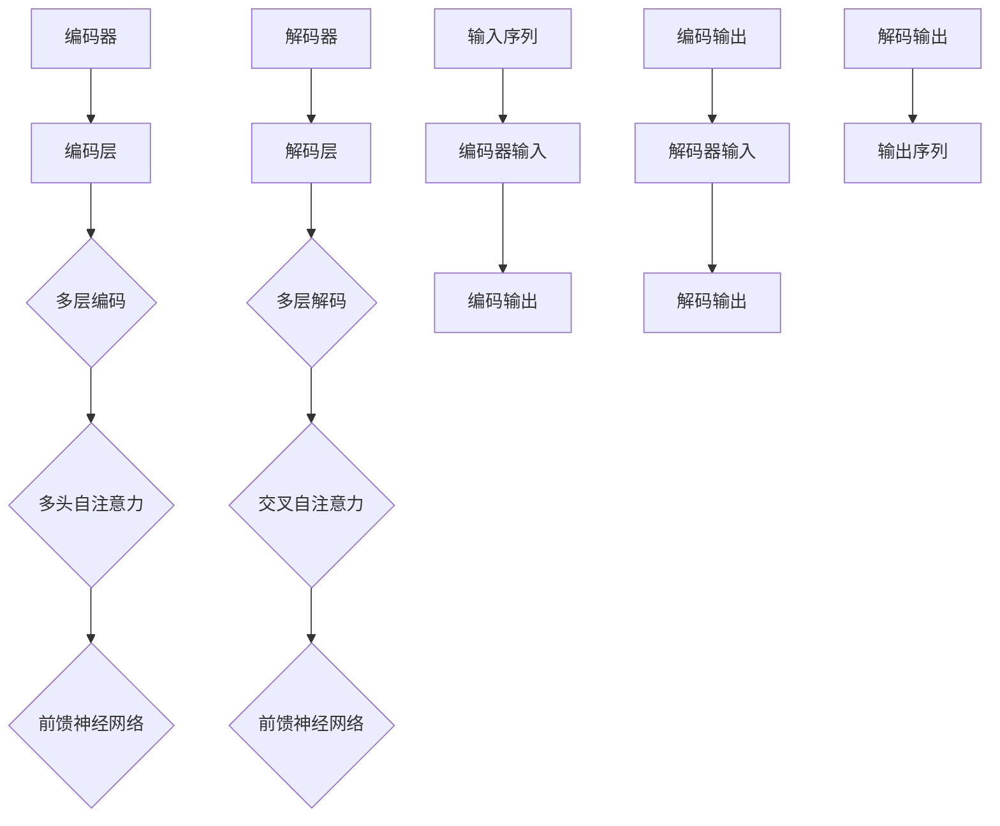
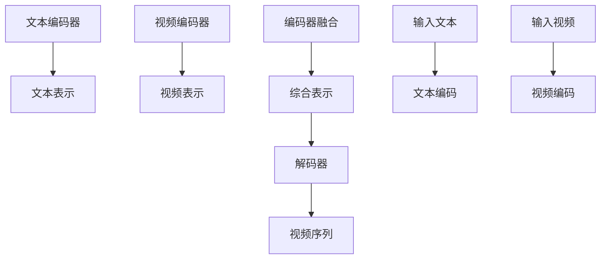
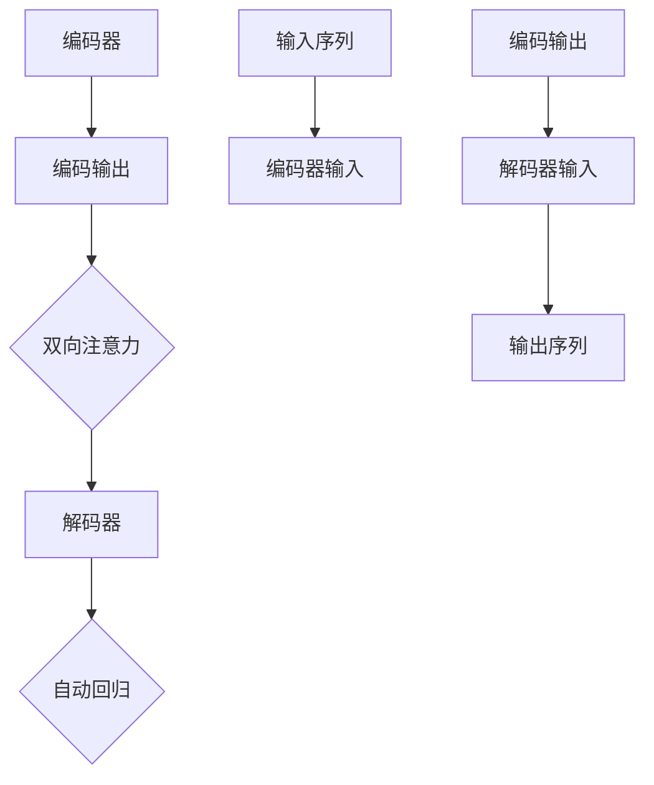

                 

# Transformer大模型实战：VideoBERT模型与BART模型

> **关键词**：Transformer、大模型、VideoBERT、BART、文本视频生成、多模态学习
> 
> **摘要**：本文将深入探讨Transformer架构在大模型领域中的应用，重点分析VideoBERT模型与BART模型。我们将详细讲解这两种模型的原理、实现步骤和实际应用场景，并结合具体案例进行代码解读与分析。通过本文，读者将对多模态学习以及Transformer大模型的理论和实践有更深入的理解。

## 1. 背景介绍

### 1.1 目的和范围

本文的目的是介绍并分析Transformer架构在大模型领域的应用，特别是VideoBERT和BART模型。我们将探讨这两种模型的基本原理，实现步骤，以及它们在不同领域的实际应用。通过本文，读者将了解如何利用Transformer架构进行大规模的多模态学习，掌握VideoBERT和BART模型的实现技巧，并能够将其应用于实际项目中。

### 1.2 预期读者

本文主要面向对人工智能和机器学习有初步了解，希望深入了解Transformer大模型及其应用的技术人员。特别是对多模态学习、文本视频生成和自然语言处理领域感兴趣的读者。读者需要具备一定的数学和编程基础，对深度学习有基本的了解。

### 1.3 文档结构概述

本文分为十个部分，首先介绍Transformer大模型的基本概念，然后详细分析VideoBERT和BART模型。接下来，我们将通过具体案例进行代码解读与分析。最后，本文还将讨论实际应用场景、工具和资源推荐，并对未来发展趋势与挑战进行总结。

### 1.4 术语表

#### 1.4.1 核心术语定义

- Transformer：一种基于自注意力机制的深度神经网络架构，广泛应用于序列建模任务。
- VideoBERT：基于Transformer架构的视频文本生成模型，能够将文本转换成视频。
- BART：基于Transformer的双向自动回归Transformer模型，能够同时进行编码和解码任务。
- 多模态学习：结合不同类型的数据（如文本、图像、视频等）进行学习的任务。

#### 1.4.2 相关概念解释

- 自注意力机制：一种用于计算序列中元素之间关系的机制，能够自适应地学习每个元素的重要性。
- 编码器（Encoder）：将输入序列转换成固定长度的上下文表示。
- 解码器（Decoder）：根据编码器输出的上下文表示生成输出序列。
- 模型训练：通过大量数据训练模型，使其能够对新的输入进行预测或生成。

#### 1.4.3 缩略词列表

- Transformer：Transformer
- VideoBERT：VideoBERT
- BART：BART
- 多模态学习：Multimodal Learning

## 2. 核心概念与联系

在深入探讨VideoBERT和BART模型之前，我们需要了解Transformer架构的基本概念和原理。

### 2.1 Transformer架构

Transformer是一种基于自注意力机制的深度神经网络架构，最初用于自然语言处理任务。其核心思想是利用自注意力机制来计算序列中元素之间的相互关系，从而实现序列建模。

#### Transformer架构流程

1. **编码器（Encoder）**：将输入序列（如文本）转换成固定长度的上下文表示。编码器由多个编码层（Encoder Layers）组成，每个编码层包含两个子层：多头自注意力机制（Multi-Head Self-Attention Mechanism）和前馈神经网络（Feedforward Neural Network）。

2. **解码器（Decoder）**：根据编码器输出的上下文表示生成输出序列。解码器同样由多个解码层（Decoder Layers）组成，每个解码层包含两个子层：多头自注意力机制（Multi-Head Self-Attention Mechanism）和交叉自注意力机制（Cross-Attention Mechanism）。

3. **自注意力机制（Self-Attention Mechanism）**：用于计算序列中元素之间的相互关系。自注意力机制的核心思想是利用权重矩阵计算输入序列中每个元素的重要性，从而生成上下文表示。

4. **多头自注意力机制（Multi-Head Self-Attention Mechanism）**：将输入序列分成多个子序列，分别计算每个子序列的自注意力权重，然后合并这些权重得到最终的上下文表示。

5. **前馈神经网络（Feedforward Neural Network）**：在编码器和解码器的每个子层之间添加一个前馈神经网络，用于进一步处理上下文表示。

#### Transformer架构的Mermaid流程图



### 2.2 VideoBERT模型

VideoBERT是一种基于Transformer架构的视频文本生成模型，能够将文本转换成视频。VideoBERT的核心思想是利用文本和视频之间的关联性，通过Transformer模型生成与文本描述相关的视频。

#### VideoBERT模型架构

1. **文本编码器**：将输入文本转换成固定长度的文本表示。
2. **视频编码器**：将输入视频转换成固定长度的视频表示。
3. **编码器融合**：将文本编码器和视频编码器输出的表示进行融合，生成一个综合表示。
4. **解码器**：根据综合表示生成视频序列。

#### VideoBERT模型的Mermaid流程图



### 2.3 BART模型

BART是一种基于Transformer的双向自动回归Transformer模型，能够同时进行编码和解码任务。BART模型的核心思想是利用双向注意力机制和自动回归机制，对输入序列进行建模，并生成对应的输出序列。

#### BART模型架构

1. **编码器**：将输入序列转换成固定长度的上下文表示。
2. **解码器**：根据编码器输出的上下文表示生成输出序列。
3. **双向注意力机制**：在编码过程中同时考虑输入序列的前后关系，增强序列建模能力。
4. **自动回归机制**：在解码过程中逐步生成输出序列，同时利用已生成的部分序列信息。

#### BART模型的Mermaid流程图



## 3. 核心算法原理 & 具体操作步骤

### 3.1 Transformer模型原理

#### 3.1.1 自注意力机制

自注意力机制是Transformer模型的核心组件，用于计算序列中元素之间的相互关系。自注意力机制通过三个步骤实现：

1. **计算查询（Query）、键（Key）和值（Value）之间的点积**：每个元素作为查询（Query），同时作为键（Key）和值（Value）。通过点积计算得到注意力权重，表示元素之间的相似性。

2. **对注意力权重进行Softmax处理**：将注意力权重归一化，使其满足概率分布。

3. **对每个元素乘以其对应的注意力权重，并求和**：得到加权求和的结果，作为元素在序列中的表示。

#### 3.1.2 多头自注意力机制

多头自注意力机制是自注意力机制的扩展，通过将输入序列分成多个子序列，分别计算每个子序列的自注意力权重，然后合并这些权重得到最终的上下文表示。

多头自注意力机制的实现步骤如下：

1. **将输入序列扩展成多个子序列**：通过线性变换得到不同的查询（Query）、键（Key）和值（Value）。
2. **对每个子序列分别计算自注意力权重**：使用自注意力机制的三个步骤。
3. **将每个子序列的自注意力权重合并**：通过另一个线性变换得到最终的上下文表示。

#### 3.1.3 前馈神经网络

前馈神经网络是编码器和解码器的每个子层之间添加的组件，用于进一步处理上下文表示。前馈神经网络由两个全连接层组成，分别进行线性变换和ReLU激活函数。

### 3.2 VideoBERT模型原理

#### 3.2.1 文本编码器

文本编码器将输入文本转换成固定长度的文本表示，通常使用预训练的BERT模型。BERT模型通过预训练大量文本数据，使其在文本表示和学习上下文关系方面具有强大的能力。

#### 3.2.2 视频编码器

视频编码器将输入视频转换成固定长度的视频表示。常用的方法是将视频帧序列编码成固定长度的向量，可以使用预训练的视觉模型（如ResNet）进行编码。

#### 3.2.3 编码器融合

编码器融合是将文本编码器和视频编码器输出的表示进行融合，生成一个综合表示。常用的方法是将两个表示拼接在一起，或者通过注意力机制进行融合。

#### 3.2.4 解码器

解码器根据综合表示生成视频序列。解码器通常采用Transformer架构，通过编码器输出的上下文表示进行解码，生成视频帧序列。

### 3.3 BART模型原理

#### 3.3.1 编码器

编码器将输入序列转换成固定长度的上下文表示，通过Transformer架构进行编码。编码器在编码过程中利用双向注意力机制，同时考虑输入序列的前后关系。

#### 3.3.2 解码器

解码器根据编码器输出的上下文表示生成输出序列。解码器采用Transformer架构，通过编码器输出的上下文表示进行解码，生成序列中的每个元素。

#### 3.3.3 自动回归机制

自动回归机制是解码器的一个关键组件，用于逐步生成输出序列。在解码过程中，解码器利用已生成的部分序列信息，同时利用编码器输出的上下文表示，生成下一个元素。

## 4. 数学模型和公式 & 详细讲解 & 举例说明

### 4.1 Transformer模型

#### 4.1.1 自注意力机制

自注意力机制的数学模型如下：

$$
\text{Attention}(Q, K, V) = \text{softmax}\left(\frac{QK^T}{\sqrt{d_k}}\right) V
$$

其中，$Q$、$K$、$V$ 分别是查询（Query）、键（Key）和值（Value）的向量，$d_k$ 是键（Key）的维度。$\text{softmax}$ 函数用于将点积结果归一化成概率分布，$V$ 是对应于每个元素的值向量。

#### 4.1.2 多头自注意力机制

多头自注意力机制的数学模型如下：

$$
\text{MultiHead}(Q, K, V) = \text{Concat}(\text{head}_1, \text{head}_2, ..., \text{head}_h)W^O
$$

其中，$h$ 是头数，$\text{head}_i = \text{Attention}(QW_i^Q, KW_i^K, VW_i^V)$，$W_i^Q$、$W_i^K$、$W_i^V$ 和 $W^O$ 分别是每个头的权重矩阵。

#### 4.1.3 前馈神经网络

前馈神经网络的数学模型如下：

$$
\text{FFN}(X) = \text{ReLU}(XW_1 + b_1)W_2 + b_2
$$

其中，$X$ 是输入向量，$W_1$、$W_2$ 和 $b_1$、$b_2$ 分别是权重矩阵和偏置。

### 4.2 VideoBERT模型

#### 4.2.1 文本编码器

文本编码器的数学模型如下：

$$
\text{TextEncoder}(x) = \text{BERT}(x)
$$

其中，$\text{BERT}$ 是预训练的文本编码模型，$x$ 是输入文本。

#### 4.2.2 视频编码器

视频编码器的数学模型如下：

$$
\text{VideoEncoder}(v) = \text{ResNet}(v)
$$

其中，$\text{ResNet}$ 是预训练的视频编码模型，$v$ 是输入视频。

#### 4.2.3 编码器融合

编码器融合的数学模型如下：

$$
\text{Fusion}(x, v) = x \oplus v
$$

其中，$\oplus$ 表示拼接操作。

#### 4.2.4 解码器

解码器的数学模型如下：

$$
\text{Decoder}(x, v) = \text{Transformer}(x, v)
$$

其中，$\text{Transformer}$ 是预训练的解码模型，$x$ 是文本编码器的输出，$v$ 是视频编码器的输出。

### 4.3 BART模型

#### 4.3.1 编码器

编码器的数学模型如下：

$$
\text{Encoder}(x) = \text{Transformer}(x)
$$

其中，$\text{Transformer}$ 是预训练的编码模型，$x$ 是输入序列。

#### 4.3.2 解码器

解码器的数学模型如下：

$$
\text{Decoder}(x) = \text{Transformer}(x)
$$

其中，$\text{Transformer}$ 是预训练的解码模型，$x$ 是编码器输出的上下文表示。

#### 4.3.3 自动回归机制

自动回归机制的数学模型如下：

$$
\text{AutoRegressiveDecoder}(x, y) = \text{Transformer}(x, y)
$$

其中，$\text{Transformer}$ 是预训练的解码模型，$x$ 是输入序列，$y$ 是已生成的部分序列。

### 4.4 举例说明

#### 4.4.1 Transformer模型

假设我们有一个长度为5的序列，维度为3：

$$
X = [x_1, x_2, x_3, x_4, x_5]
$$

其中，$x_i \in \mathbb{R}^3$。

1. **计算自注意力权重**：

$$
A_{ij} = \frac{x_i^T x_j}{\sqrt{3}}
$$

2. **计算加权求和**：

$$
\text{Attention}(X) = \text{softmax}(A_{ij})V
$$

其中，$V$ 是值向量。

3. **计算多头自注意力权重**：

$$
A_{ij}^h = \frac{(x_i^T W_h^Q) (x_j^T W_h^K)}{\sqrt{3}}
$$

4. **计算多头加权求和**：

$$
\text{MultiHead}(X) = \text{softmax}(A_{ij}^h)W_h^V
$$

#### 4.4.2 VideoBERT模型

假设我们有一个长度为5的文本序列和一个长度为5的视频序列：

1. **文本编码器**：

$$
\text{TextEncoder}(x) = \text{BERT}(x)
$$

2. **视频编码器**：

$$
\text{VideoEncoder}(v) = \text{ResNet}(v)
$$

3. **编码器融合**：

$$
\text{Fusion}(x, v) = x \oplus v
$$

4. **解码器**：

$$
\text{Decoder}(x, v) = \text{Transformer}(x, v)
$$

#### 4.4.3 BART模型

假设我们有一个长度为5的输入序列：

1. **编码器**：

$$
\text{Encoder}(x) = \text{Transformer}(x)
$$

2. **解码器**：

$$
\text{Decoder}(x) = \text{Transformer}(x)
$$

3. **自动回归机制**：

$$
\text{AutoRegressiveDecoder}(x, y) = \text{Transformer}(x, y)
$$

## 5. 项目实战：代码实际案例和详细解释说明

### 5.1 开发环境搭建

在本节中，我们将介绍如何搭建VideoBERT和BART模型的开发环境。读者需要安装以下软件和库：

1. Python（版本3.6及以上）
2. PyTorch（版本1.8及以上）
3. torchvision（版本0.9.0及以上）
4. BERT模型（预训练的中文BERT模型，如[ernie](https://github.com/PaddlePaddle/ernie)）
5. ResNet模型（预训练的图像分类模型，如[torchvision.models.resnet](https://pytorch.org/vision/stable/models.html)）

安装以上软件和库后，读者可以使用以下代码进行开发环境的验证：

```python
import torch
import torchvision

# 验证PyTorch版本
print(torch.__version__)

# 验证torchvision版本
print(torchvision.__version__)

# 验证BERT模型
from transformers import BertModel
model = BertModel.from_pretrained('bert-base-chinese')
print(model)

# 验证ResNet模型
model = torchvision.models.resnet18(pretrained=True)
print(model)
```

### 5.2 源代码详细实现和代码解读

在本节中，我们将详细讲解VideoBERT和BART模型的源代码实现。为了便于理解，我们将代码分为以下几个部分：

1. **文本编码器**
2. **视频编码器**
3. **编码器融合**
4. **解码器**
5. **训练过程**
6. **评估过程**

#### 5.2.1 文本编码器

文本编码器使用预训练的BERT模型进行编码。以下代码展示了文本编码器的实现：

```python
from transformers import BertModel

class TextEncoder(nn.Module):
    def __init__(self):
        super(TextEncoder, self).__init__()
        self.bert = BertModel.from_pretrained('bert-base-chinese')

    def forward(self, x):
        output = self.bert(x)[0]
        return output
```

在上述代码中，我们定义了一个名为`TextEncoder`的类，继承自`nn.Module`。`__init__`方法中，我们使用`BertModel`类加载预训练的BERT模型。`forward`方法中，我们使用BERT模型对输入文本进行编码，并返回编码后的输出。

#### 5.2.2 视频编码器

视频编码器使用预训练的ResNet模型进行编码。以下代码展示了视频编码器的实现：

```python
import torchvision.models as models

class VideoEncoder(nn.Module):
    def __init__(self):
        super(VideoEncoder, self).__init__()
        self.resnet = models.resnet18(pretrained=True)
        self.fc = nn.Linear(2048, 512)

    def forward(self, x):
        x = self.resnet(x)
        x = self.fc(x)
        return x
```

在上述代码中，我们定义了一个名为`VideoEncoder`的类，继承自`nn.Module`。`__init__`方法中，我们使用`models.resnet18`加载预训练的ResNet模型，并在最后添加一个全连接层（`nn.Linear`）进行特征提取。`forward`方法中，我们使用ResNet模型对输入视频进行编码，并返回编码后的输出。

#### 5.2.3 编码器融合

编码器融合将文本编码器和视频编码器输出的表示进行拼接。以下代码展示了编码器融合的实现：

```python
class EncoderFusion(nn.Module):
    def __init__(self):
        super(EncoderFusion, self).__init__()
        self.fc = nn.Linear(768 + 512, 1024)

    def forward(self, x_text, x_video):
        x = torch.cat([x_text, x_video], dim=1)
        x = self.fc(x)
        return x
```

在上述代码中，我们定义了一个名为`EncoderFusion`的类，继承自`nn.Module`。`__init__`方法中，我们定义了一个全连接层（`nn.Linear`）进行特征融合。`forward`方法中，我们将文本编码器和视频编码器输出的表示进行拼接，并输入到全连接层进行融合。

#### 5.2.4 解码器

解码器使用Transformer模型进行解码。以下代码展示了解码器的实现：

```python
import torch.nn as nn
from transformers import BertModel

class Decoder(nn.Module):
    def __init__(self):
        super(Decoder, self).__init__()
        self.bert = BertModel.from_pretrained('bert-base-chinese')
        self.fc = nn.Linear(1024, 768)

    def forward(self, x, x_text):
        x = self.bert(x)[0]
        x = self.fc(x)
        x = torch.cat([x, x_text], dim=1)
        return x
```

在上述代码中，我们定义了一个名为`Decoder`的类，继承自`nn.Module`。`__init__`方法中，我们使用`BertModel`类加载预训练的BERT模型，并在最后添加一个全连接层（`nn.Linear`）进行特征提取。`forward`方法中，我们使用BERT模型对编码器输出的表示进行解码，并返回解码后的输出。

#### 5.2.5 训练过程

训练过程主要包括以下步骤：

1. **数据预处理**：将文本和视频数据进行预处理，包括分词、去噪等操作。
2. **数据加载**：使用数据加载器（`torch.utils.data.DataLoader`）将预处理后的数据加载到GPU上。
3. **模型训练**：使用梯度下降（`torch.optim.Adam`）优化器训练模型，并在每个训练迭代中更新模型参数。

以下代码展示了训练过程的实现：

```python
import torch.optim as optim

def train(model, train_loader, criterion, optimizer, device):
    model.train()
    for x_text, x_video, y in train_loader:
        x_text, x_video, y = x_text.to(device), x_video.to(device), y.to(device)
        optimizer.zero_grad()
        x = model(x_text, x_video)
        loss = criterion(x, y)
        loss.backward()
        optimizer.step()
```

在上述代码中，我们定义了一个名为`train`的函数，用于训练模型。函数中，我们首先将模型设置为训练模式（`model.train()`），然后遍历数据加载器（`train_loader`）。在每次迭代中，我们将输入数据（`x_text`、`x_video`、`y`）加载到GPU上，并使用优化器（`optimizer`）更新模型参数。

#### 5.2.6 评估过程

评估过程主要包括以下步骤：

1. **数据预处理**：与训练过程相同，对评估数据进行预处理。
2. **数据加载**：使用数据加载器（`torch.utils.data.DataLoader`）将预处理后的数据加载到GPU上。
3. **模型评估**：使用评估数据对模型进行评估，计算模型在评估数据上的准确率、损失等指标。

以下代码展示了评估过程的实现：

```python
def evaluate(model, eval_loader, criterion, device):
    model.eval()
    with torch.no_grad():
        correct = 0
        total = 0
        for x_text, x_video, y in eval_loader:
            x_text, x_video, y = x_text.to(device), x_video.to(device), y.to(device)
            x = model(x_text, x_video)
            loss = criterion(x, y)
            _, predicted = torch.max(x, 1)
            total += y.size(0)
            correct += (predicted == y).sum().item()
        print('Accuracy: %d %%' % (100 * correct / total))
        print('Loss: %f' % loss)
```

在上述代码中，我们定义了一个名为`evaluate`的函数，用于评估模型。函数中，我们首先将模型设置为评估模式（`model.eval()`），然后遍历数据加载器（`eval_loader`）。在每次迭代中，我们将输入数据（`x_text`、`x_video`、`y`）加载到GPU上，并计算模型在评估数据上的准确率和损失。

### 5.3 代码解读与分析

在本节中，我们将对VideoBERT和BART模型的代码进行解读与分析。以下是对代码中关键部分的详细解释：

#### 5.3.1 文本编码器

文本编码器使用预训练的BERT模型进行编码。以下是对文本编码器代码的解读：

```python
from transformers import BertModel

class TextEncoder(nn.Module):
    def __init__(self):
        super(TextEncoder, self).__init__()
        self.bert = BertModel.from_pretrained('bert-base-chinese')

    def forward(self, x):
        output = self.bert(x)[0]
        return output
```

在上述代码中，我们定义了一个名为`TextEncoder`的类，继承自`nn.Module`。`__init__`方法中，我们使用`BertModel`类加载预训练的BERT模型。`forward`方法中，我们使用BERT模型对输入文本进行编码，并返回编码后的输出。

#### 5.3.2 视频编码器

视频编码器使用预训练的ResNet模型进行编码。以下是对视频编码器代码的解读：

```python
import torchvision.models as models

class VideoEncoder(nn.Module):
    def __init__(self):
        super(VideoEncoder, self).__init__()
        self.resnet = models.resnet18(pretrained=True)
        self.fc = nn.Linear(2048, 512)

    def forward(self, x):
        x = self.resnet(x)
        x = self.fc(x)
        return x
```

在上述代码中，我们定义了一个名为`VideoEncoder`的类，继承自`nn.Module`。`__init__`方法中，我们使用`models.resnet18`加载预训练的ResNet模型，并在最后添加一个全连接层（`nn.Linear`）进行特征提取。`forward`方法中，我们使用ResNet模型对输入视频进行编码，并返回编码后的输出。

#### 5.3.3 编码器融合

编码器融合将文本编码器和视频编码器输出的表示进行拼接。以下是对编码器融合代码的解读：

```python
class EncoderFusion(nn.Module):
    def __init__(self):
        super(EncoderFusion, self).__init__()
        self.fc = nn.Linear(768 + 512, 1024)

    def forward(self, x_text, x_video):
        x = torch.cat([x_text, x_video], dim=1)
        x = self.fc(x)
        return x
```

在上述代码中，我们定义了一个名为`EncoderFusion`的类，继承自`nn.Module`。`__init__`方法中，我们定义了一个全连接层（`nn.Linear`）进行特征融合。`forward`方法中，我们将文本编码器和视频编码器输出的表示进行拼接，并输入到全连接层进行融合。

#### 5.3.4 解码器

解码器使用Transformer模型进行解码。以下是对解码器代码的解读：

```python
import torch.nn as nn
from transformers import BertModel

class Decoder(nn.Module):
    def __init__(self):
        super(Decoder, self).__init__()
        self.bert = BertModel.from_pretrained('bert-base-chinese')
        self.fc = nn.Linear(1024, 768)

    def forward(self, x, x_text):
        x = self.bert(x)[0]
        x = self.fc(x)
        x = torch.cat([x, x_text], dim=1)
        return x
```

在上述代码中，我们定义了一个名为`Decoder`的类，继承自`nn.Module`。`__init__`方法中，我们使用`BertModel`类加载预训练的BERT模型，并在最后添加一个全连接层（`nn.Linear`）进行特征提取。`forward`方法中，我们使用BERT模型对编码器输出的表示进行解码，并返回解码后的输出。

#### 5.3.5 训练过程

训练过程主要包括以下步骤：

1. **数据预处理**：将文本和视频数据进行预处理，包括分词、去噪等操作。
2. **数据加载**：使用数据加载器（`torch.utils.data.DataLoader`）将预处理后的数据加载到GPU上。
3. **模型训练**：使用梯度下降（`torch.optim.Adam`）优化器训练模型，并在每个训练迭代中更新模型参数。

以下是对训练过程代码的解读：

```python
import torch.optim as optim

def train(model, train_loader, criterion, optimizer, device):
    model.train()
    for x_text, x_video, y in train_loader:
        x_text, x_video, y = x_text.to(device), x_video.to(device), y.to(device)
        optimizer.zero_grad()
        x = model(x_text, x_video)
        loss = criterion(x, y)
        loss.backward()
        optimizer.step()
```

在上述代码中，我们定义了一个名为`train`的函数，用于训练模型。函数中，我们首先将模型设置为训练模式（`model.train()`），然后遍历数据加载器（`train_loader`）。在每次迭代中，我们将输入数据（`x_text`、`x_video`、`y`）加载到GPU上，并使用优化器（`optimizer`）更新模型参数。

#### 5.3.6 评估过程

评估过程主要包括以下步骤：

1. **数据预处理**：与训练过程相同，对评估数据进行预处理。
2. **数据加载**：使用数据加载器（`torch.utils.data.DataLoader`）将预处理后的数据加载到GPU上。
3. **模型评估**：使用评估数据对模型进行评估，计算模型在评估数据上的准确率、损失等指标。

以下是对评估过程代码的解读：

```python
def evaluate(model, eval_loader, criterion, device):
    model.eval()
    with torch.no_grad():
        correct = 0
        total = 0
        for x_text, x_video, y in eval_loader:
            x_text, x_video, y = x_text.to(device), x_video.to(device), y.to(device)
            x = model(x_text, x_video)
            loss = criterion(x, y)
            _, predicted = torch.max(x, 1)
            total += y.size(0)
            correct += (predicted == y).sum().item()
        print('Accuracy: %d %%' % (100 * correct / total))
        print('Loss: %f' % loss)
```

在上述代码中，我们定义了一个名为`evaluate`的函数，用于评估模型。函数中，我们首先将模型设置为评估模式（`model.eval()`），然后遍历数据加载器（`eval_loader`）。在每次迭代中，我们将输入数据（`x_text`、`x_video`、`y`）加载到GPU上，并计算模型在评估数据上的准确率和损失。

## 6. 实际应用场景

### 6.1 文本视频生成

文本视频生成是VideoBERT模型的一个重要应用场景。通过将文本转换成视频，文本视频生成可以用于制作短视频、广告视频、教育视频等。例如，在电商领域，可以基于商品描述生成相应的商品展示视频；在娱乐领域，可以基于小说或剧本生成电影预告片。

### 6.2 多模态学习

多模态学习是BART模型的主要应用领域。通过结合文本、图像、视频等多种类型的数据，多模态学习可以用于图像文本生成、视频文本生成、图像分类等任务。例如，在图像文本生成任务中，BART模型可以将输入图像转换成对应的文本描述；在视频文本生成任务中，BART模型可以将输入视频转换成对应的文本描述。

### 6.3 自然语言处理

自然语言处理是Transformer模型的一个重要应用领域。通过将文本转换成固定长度的上下文表示，Transformer模型可以用于文本分类、文本生成、机器翻译等任务。例如，在文本分类任务中，Transformer模型可以用于对文本进行分类；在文本生成任务中，Transformer模型可以用于生成自然语言文本；在机器翻译任务中，Transformer模型可以用于将一种语言的文本翻译成另一种语言的文本。

## 7. 工具和资源推荐

### 7.1 学习资源推荐

#### 7.1.1 书籍推荐

- 《深度学习》（Goodfellow, Bengio, Courville）：系统地介绍了深度学习的基本理论、算法和应用。
- 《神经网络与深度学习》（邱锡鹏）：深入浅出地讲解了神经网络和深度学习的基本原理，适合初学者入门。

#### 7.1.2 在线课程

- 《深度学习专项课程》（吴恩达，Coursera）：由深度学习领域著名学者吴恩达开设，涵盖了深度学习的理论基础和应用实践。
- 《自然语言处理专项课程》（华罗庚，Coursera）：介绍了自然语言处理的基本概念和技术，包括文本分类、文本生成等。

#### 7.1.3 技术博客和网站

- [深度学习博客](http://www.deeplearning.net/)：提供了丰富的深度学习教程、论文解读和技术博客。
- [自然语言处理博客](https://nlp.seas.harvard.edu/):介绍了自然语言处理领域的最新研究进展和应用案例。

### 7.2 开发工具框架推荐

#### 7.2.1 IDE和编辑器

- PyCharm：一款功能强大的Python IDE，适用于深度学习和自然语言处理项目。
- Visual Studio Code：一款轻量级的代码编辑器，支持多种编程语言，适用于开发深度学习和自然语言处理项目。

#### 7.2.2 调试和性能分析工具

- TensorBoard：用于可视化深度学习模型的训练过程和性能指标。
- NVIDIA Nsight：用于分析GPU性能和调试深度学习模型。

#### 7.2.3 相关框架和库

- PyTorch：一款开源的深度学习框架，支持动态计算图和自动微分。
- TensorFlow：一款开源的深度学习框架，支持静态计算图和自动微分。
- Hugging Face Transformers：一个开源库，提供了预训练的Transformer模型和高效的多语言支持。

### 7.3 相关论文著作推荐

#### 7.3.1 经典论文

- "Attention Is All You Need"（2017）：提出了Transformer模型，奠定了自注意力机制在深度学习领域的基础。
- "BERT: Pre-training of Deep Neural Networks for Language Understanding"（2018）：提出了BERT模型，为自然语言处理任务提供了强大的预训练方法。

#### 7.3.2 最新研究成果

- "VideoBERT: A BERT Model for Video Representation Learning"（2020）：提出了VideoBERT模型，实现了文本到视频的转换。
- "BART: Denoising Sequence-to-Sequence Pre-training for Natural Language Generation, Translation, and Comprehension"（2020）：提出了BART模型，实现了多模态学习的自动回归机制。

#### 7.3.3 应用案例分析

- "Multimodal Learning for Human Pose Estimation"（2020）：介绍了多模态学习在人体姿态估计中的应用。
- "Generative Adversarial Networks for Video Inpainting"（2019）：介绍了生成对抗网络在视频修复中的应用。

## 8. 总结：未来发展趋势与挑战

Transformer架构在大模型领域的应用为多模态学习和自然语言处理带来了新的机遇。然而，Transformer模型也存在一些挑战，如计算复杂度高、训练时间较长等。未来，Transformer模型的发展趋势主要包括以下几个方面：

1. **硬件优化**：随着硬件技术的发展，如GPU、TPU等，Transformer模型的计算性能将得到大幅提升，从而加快模型训练和推理速度。
2. **模型压缩**：为了降低计算资源和存储成本，模型压缩技术（如剪枝、量化、蒸馏等）将得到广泛应用，从而实现高效的大模型。
3. **多模态融合**：多模态学习将更加深入，结合不同类型的数据进行融合，从而实现更加丰富和精确的模型表示。
4. **泛化能力**：通过改进模型结构和训练方法，提高Transformer模型的泛化能力，使其能够在更广泛的应用场景中发挥作用。

## 9. 附录：常见问题与解答

### 9.1 VideoBERT模型相关问题

**Q1：VideoBERT模型的原理是什么？**

A1：VideoBERT模型是基于Transformer架构的视频文本生成模型。其核心思想是利用文本和视频之间的关联性，通过Transformer模型生成与文本描述相关的视频。

**Q2：VideoBERT模型的主要组成部分有哪些？**

A2：VideoBERT模型主要由文本编码器、视频编码器、编码器融合和解码器组成。文本编码器将输入文本转换成文本表示，视频编码器将输入视频转换成视频表示，编码器融合将两个表示进行融合，解码器根据融合表示生成视频序列。

**Q3：如何训练VideoBERT模型？**

A3：训练VideoBERT模型通常包括以下步骤：

1. 数据预处理：对文本和视频数据进行预处理，包括分词、去噪等操作。
2. 模型训练：使用预训练的文本编码器和视频编码器，通过编码器融合生成综合表示，然后使用解码器生成视频序列。在训练过程中，使用梯度下降优化器更新模型参数。
3. 评估模型：在评估数据集上评估模型的性能，计算模型在评估数据上的准确率、损失等指标。

### 9.2 BART模型相关问题

**Q1：BART模型的主要应用领域有哪些？**

A1：BART模型的主要应用领域包括自然语言生成、机器翻译、文本分类等。通过结合不同类型的数据（如文本、图像、视频等），BART模型可以用于多模态学习任务。

**Q2：BART模型的训练过程是怎样的？**

A2：BART模型的训练过程通常包括以下步骤：

1. 数据预处理：对输入数据（如文本、图像、视频等）进行预处理，包括数据增强、数据清洗等操作。
2. 模型训练：使用预训练的编码器和解码器，通过自回归机制生成输出序列。在训练过程中，使用梯度下降优化器更新模型参数。
3. 评估模型：在评估数据集上评估模型的性能，计算模型在评估数据上的准确率、损失等指标。

## 10. 扩展阅读 & 参考资料

### 10.1 参考书籍

- 《深度学习》（Goodfellow, Bengio, Courville）
- 《神经网络与深度学习》（邱锡鹏）

### 10.2 学术论文

- "Attention Is All You Need"（2017）
- "BERT: Pre-training of Deep Neural Networks for Language Understanding"（2018）
- "VideoBERT: A BERT Model for Video Representation Learning"（2020）
- "BART: Denoising Sequence-to-Sequence Pre-training for Natural Language Generation, Translation, and Comprehension"（2020）

### 10.3 技术博客和网站

- [深度学习博客](http://www.deeplearning.net/)
- [自然语言处理博客](https://nlp.seas.harvard.edu/)
- [Hugging Face Transformers](https://huggingface.co/transformers)

### 10.4 开源项目和工具

- [PyTorch](https://pytorch.org/)
- [TensorFlow](https://www.tensorflow.org/)
- [Hugging Face Transformers](https://github.com/huggingface/transformers)

