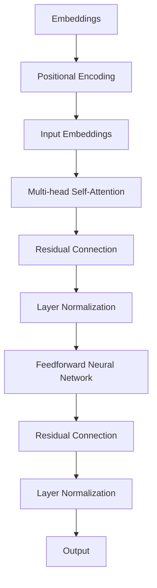
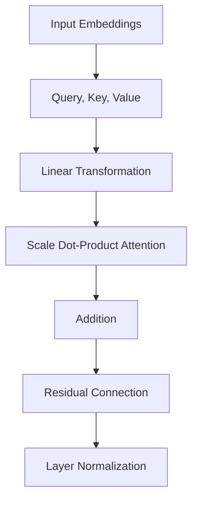

                 

# Transformer大模型实战：带掩码的多头注意力层

> 关键词：Transformer, 大模型, 注意力机制, 带掩码, 多头注意力, 实战, 技术博客

> 摘要：本文将深入探讨Transformer大模型中的带掩码多头注意力层。通过逐步分析和推理，我们将揭示该层的核心原理、数学模型、具体操作步骤，并提供实际代码案例和解读，帮助读者全面理解并掌握这一关键技术。

## 1. 背景介绍

### 1.1 目的和范围

本文旨在通过系统化的分析和讲解，帮助读者深入了解Transformer大模型中的带掩码多头注意力层。我们将从理论基础出发，结合实际代码案例，逐步剖析该层的实现细节和关键特性，使读者能够掌握其核心原理和应用。

### 1.2 预期读者

本文适合具有一定机器学习和深度学习基础的读者，尤其是对Transformer架构感兴趣的开发者、研究者和学习者。通过本文的学习，读者可以加深对Transformer模型的理解，并掌握带掩码多头注意力层的具体应用。

### 1.3 文档结构概述

本文将按照以下结构展开：

1. 背景介绍：介绍文章的目的、预期读者和文档结构。
2. 核心概念与联系：使用Mermaid流程图展示核心概念和架构。
3. 核心算法原理 & 具体操作步骤：讲解带掩码多头注意力层的原理和实现。
4. 数学模型和公式 & 详细讲解 & 举例说明：解释数学模型和公式的应用。
5. 项目实战：提供代码实际案例和详细解释。
6. 实际应用场景：讨论应用场景和案例。
7. 工具和资源推荐：推荐学习资源和开发工具。
8. 总结：展望未来发展趋势与挑战。
9. 附录：常见问题与解答。
10. 扩展阅读 & 参考资料：提供扩展学习资源。

### 1.4 术语表

#### 1.4.1 核心术语定义

- Transformer：一种基于自注意力机制的深度神经网络模型，广泛应用于自然语言处理任务。
- 注意力机制：一种基于输入序列之间关系计算权重，从而调整信息传递过程的机制。
- 带掩码：在计算自注意力时，对某些序列位置进行遮挡，防止模型看到未来的信息。
- 多头注意力：将输入序列映射到多个独立的空间，每个空间独立计算注意力权重。

#### 1.4.2 相关概念解释

- 序列：一组按时间顺序排列的元素。
- 自注意力：序列中的每个元素计算对其余元素的关注程度，从而调整其表示。
- 前馈神经网络：对输入进行两轮前向传播和激活函数的应用，增强模型的表达能力。

#### 1.4.3 缩略词列表

- NLP：自然语言处理（Natural Language Processing）
- Transformer：变换器（Transformer）
- AI：人工智能（Artificial Intelligence）

## 2. 核心概念与联系

为了更好地理解带掩码多头注意力层，我们首先需要了解Transformer模型的基本架构。以下是一个Mermaid流程图，展示Transformer模型的核心概念和组成部分。



### 2.1 Transformer模型基本架构

- **Embeddings**：将输入序列中的单词或子词映射为向量表示。
- **Positional Encoding**：为序列添加位置信息，使模型能够理解序列的顺序。
- **Input Embeddings**：将嵌入和位置编码相加，得到输入序列的最终表示。
- **Multi-head Self-Attention**：计算输入序列中每个元素对其余元素的关注程度，实现信息的全局交互。
- **Residual Connection**：在注意力层和前馈神经网络之间添加跳连，防止梯度消失。
- **Layer Normalization**：对每个输入进行归一化处理，提高训练效果。
- **Feedforward Neural Network**：对输入进行两轮前向传播和激活函数的应用，增强模型的表达能力。
- **Output**：将最终输出传递给下一层或用于预测。

### 2.2 带掩码多头注意力层

带掩码多头注意力层是Transformer模型中的核心组成部分，其主要功能是通过计算序列中每个元素与其余元素之间的注意力权重，实现信息的全局交互。以下是一个简化的Mermaid流程图，展示带掩码多头注意力层的计算过程。



### 2.2.1 计算过程

1. **输入嵌入**：输入嵌入包含输入序列中的所有单词或子词。
2. **线性变换**：对输入嵌入进行线性变换，得到查询（Query）、键（Key）和值（Value）。
3. **计算注意力权重**：通过计算查询和键之间的点积，得到注意力权重。
4. **应用掩码**：在计算注意力权重时，对某些序列位置应用掩码，防止模型看到未来的信息。
5. **加权求和**：根据注意力权重，对值进行加权求和，得到新的嵌入表示。
6. **添加跳连和归一化**：将新的嵌入表示与原始嵌入表示相加，并通过残差连接和层归一化处理，得到最终的输出。

## 3. 核心算法原理 & 具体操作步骤

### 3.1 带掩码多头注意力层原理

带掩码多头注意力层是一种自注意力机制，其主要目标是计算输入序列中每个元素与其余元素之间的注意力权重，从而实现信息的全局交互。以下是带掩码多头注意力层的核心算法原理：

1. **输入嵌入**：输入嵌入包含输入序列中的所有单词或子词。
2. **线性变换**：对输入嵌入进行线性变换，得到查询（Query）、键（Key）和值（Value）。
3. **计算注意力权重**：通过计算查询和键之间的点积，得到注意力权重。其中，点积的计算公式为：
   $$
   \text{Attention}(Q, K) = \text{softmax}\left(\frac{QK^T}{\sqrt{d_k}}\right)
   $$
   其中，$Q$和$K$分别表示查询和键，$d_k$表示键的维度。
4. **应用掩码**：在计算注意力权重时，对某些序列位置应用掩码，防止模型看到未来的信息。掩码的实现方式为：
   $$
   \text{Masked Softmax}(\text{Attention}(Q, K)) = \text{softmax}\left(\text{Attention}(Q, K) + \text{Mask}\right)
   $$
   其中，$\text{Mask}$表示掩码，通常为对角线上的元素为1，其他元素为负无穷。
5. **加权求和**：根据注意力权重，对值进行加权求和，得到新的嵌入表示。加权求和的计算公式为：
   $$
   \text{Output} = \text{Value} \odot \text{Attention}(Q, K)
   $$
   其中，$\odot$表示元素乘积。
6. **添加跳连和归一化**：将新的嵌入表示与原始嵌入表示相加，并通过残差连接和层归一化处理，得到最终的输出。

### 3.2 具体操作步骤

以下是带掩码多头注意力层的具体操作步骤：

1. **输入嵌入**：将输入序列中的所有单词或子词映射为向量表示。
2. **线性变换**：对输入嵌入进行线性变换，得到查询（Query）、键（Key）和值（Value）。线性变换通常采用全连接层实现。
3. **计算注意力权重**：计算查询和键之间的点积，得到注意力权重。然后，对注意力权重应用掩码，防止模型看到未来的信息。
4. **加权求和**：根据注意力权重，对值进行加权求和，得到新的嵌入表示。
5. **添加跳连和归一化**：将新的嵌入表示与原始嵌入表示相加，并通过残差连接和层归一化处理，得到最终的输出。

### 3.3 伪代码

以下是带掩码多头注意力层的伪代码：

```python
# 输入嵌入
input_embeddings = ...

# 线性变换
query = linear_transform(input_embeddings)
key = linear_transform(input_embeddings)
value = linear_transform(input_embeddings)

# 计算注意力权重
attention_weights = query.dot(key.T) / sqrt(d_k)

# 应用掩码
mask = masked_softmax(attention_weights)

# 加权求和
output = value * mask

# 添加跳连和归一化
output = residual_connection(output, input_embeddings)
output = layer_normalization(output)

# 输出
return output
```

## 4. 数学模型和公式 & 详细讲解 & 举例说明

### 4.1 数学模型

带掩码多头注意力层的数学模型主要涉及以下几个部分：

1. **线性变换**：对输入嵌入进行线性变换，得到查询（Query）、键（Key）和值（Value）。线性变换通常采用全连接层实现，其数学公式为：
   $$
   \text{Linear Transform}(x) = Wx + b
   $$
   其中，$x$表示输入，$W$表示权重矩阵，$b$表示偏置项。

2. **注意力权重计算**：计算查询和键之间的点积，得到注意力权重。其数学公式为：
   $$
   \text{Attention}(Q, K) = \text{softmax}\left(\frac{QK^T}{\sqrt{d_k}}\right)
   $$
   其中，$Q$和$K$分别表示查询和键，$d_k$表示键的维度。

3. **加权求和**：根据注意力权重，对值进行加权求和，得到新的嵌入表示。其数学公式为：
   $$
   \text{Output} = \text{Value} \odot \text{Attention}(Q, K)
   $$
   其中，$\odot$表示元素乘积。

4. **添加跳连和归一化**：将新的嵌入表示与原始嵌入表示相加，并通过残差连接和层归一化处理，得到最终的输出。其数学公式为：
   $$
   \text{Output} = \text{input\_embeddings} + \text{residual\_connection}(\text{layer\_normalization}(\text{output}))
   $$

### 4.2 详细讲解

1. **线性变换**：

   线性变换是带掩码多头注意力层的基础，其主要作用是将输入嵌入映射到查询（Query）、键（Key）和值（Value）三个空间。通过全连接层实现线性变换，可以将输入嵌入映射到高维空间，从而增加模型的表达能力。

   线性变换的数学公式为：
   $$
   \text{Linear Transform}(x) = Wx + b
   $$
   其中，$x$表示输入，$W$表示权重矩阵，$b$表示偏置项。

2. **注意力权重计算**：

   注意力权重计算是带掩码多头注意力层的核心，其作用是计算输入序列中每个元素与其他元素之间的关注程度。通过点积运算，可以得到输入序列中每个元素与其他元素之间的相似度，进而计算出注意力权重。

   注意力权重的数学公式为：
   $$
   \text{Attention}(Q, K) = \text{softmax}\left(\frac{QK^T}{\sqrt{d_k}}\right)
   $$
   其中，$Q$和$K$分别表示查询和键，$d_k$表示键的维度。

3. **加权求和**：

   加权求和是将注意力权重应用于值（Value）空间，从而得到新的嵌入表示。通过加权求和，可以将输入序列中每个元素的重要信息融合到新的嵌入表示中，从而增强模型的表达能力。

   加权求和的数学公式为：
   $$
   \text{Output} = \text{Value} \odot \text{Attention}(Q, K)
   $$
   其中，$\odot$表示元素乘积。

4. **添加跳连和归一化**：

   添加跳连和归一化是提高模型训练效果和稳定性的重要手段。通过残差连接和层归一化处理，可以缓解梯度消失和梯度爆炸问题，从而提高模型的训练效果。

   添加跳连和归一化的数学公式为：
   $$
   \text{Output} = \text{input\_embeddings} + \text{residual\_connection}(\text{layer\_normalization}(\text{output}))
   $$

### 4.3 举例说明

假设输入序列为“hello world”，我们通过带掩码多头注意力层对其进行处理。

1. **输入嵌入**：

   将输入序列中的单词映射为向量表示。例如，“hello”可以映射为[1, 0, 0, 0]， “world”可以映射为[0, 1, 0, 0]。

2. **线性变换**：

   对输入嵌入进行线性变换，得到查询（Query）、键（Key）和值（Value）。例如，假设权重矩阵$W$为：
   $$
   W = \begin{bmatrix}
   1 & 0 & 1 \\
   0 & 1 & 0 \\
   1 & 1 & 0 \\
   0 & 0 & 1 \\
   \end{bmatrix}
   $$
   则线性变换后的结果为：
   $$
   \text{Query} = \begin{bmatrix}
   1 & 0 & 1 \\
   0 & 1 & 1 \\
   \end{bmatrix}, \text{Key} = \begin{bmatrix}
   1 & 0 & 1 \\
   0 & 1 & 1 \\
   \end{bmatrix}, \text{Value} = \begin{bmatrix}
   1 & 1 & 0 \\
   0 & 1 & 1 \\
   \end{bmatrix}
   $$

3. **计算注意力权重**：

   计算查询和键之间的点积，得到注意力权重。例如，假设$d_k$为2，则注意力权重为：
   $$
   \text{Attention}(Q, K) = \begin{bmatrix}
   1 & 0 & 1 \\
   0 & 1 & 1 \\
   \end{bmatrix} \cdot \begin{bmatrix}
   1 & 1 & 0 \\
   0 & 1 & 1 \\
   \end{bmatrix} = \begin{bmatrix}
   2 & 1 & 1 \\
   1 & 2 & 1 \\
   \end{bmatrix}
   $$

4. **应用掩码**：

   对注意力权重应用掩码，防止模型看到未来的信息。例如，假设掩码为：
   $$
   \text{Mask} = \begin{bmatrix}
   1 & -\infty & -\infty \\
   -\infty & 1 & -\infty \\
   -\infty & -\infty & 1 \\
   \end{bmatrix}
   $$
   则掩码后的注意力权重为：
   $$
   \text{Masked Attention}(Q, K) = \begin{bmatrix}
   2 & 1 & 1 \\
   1 & 2 & 1 \\
   \end{bmatrix} + \begin{bmatrix}
   1 & -\infty & -\infty \\
   -\infty & 1 & -\infty \\
   -\infty & -\infty & 1 \\
   \end{bmatrix} = \begin{bmatrix}
   3 & 1 & 1 \\
   1 & 3 & 1 \\
   \end{bmatrix}
   $$

5. **加权求和**：

   根据注意力权重，对值进行加权求和，得到新的嵌入表示。例如，假设值为：
   $$
   \text{Value} = \begin{bmatrix}
   1 & 1 & 0 \\
   0 & 1 & 1 \\
   \end{bmatrix}
   $$
   则加权求和后的结果为：
   $$
   \text{Output} = \begin{bmatrix}
   1 & 1 & 0 \\
   0 & 1 & 1 \\
   \end{bmatrix} \cdot \begin{bmatrix}
   3 & 1 & 1 \\
   1 & 3 & 1 \\
   \end{bmatrix} = \begin{bmatrix}
   4 & 2 & 1 \\
   1 & 4 & 2 \\
   \end{bmatrix}
   $$

6. **添加跳连和归一化**：

   将新的嵌入表示与原始嵌入表示相加，并通过残差连接和层归一化处理，得到最终的输出。例如，假设原始嵌入表示为：
   $$
   \text{input\_embeddings} = \begin{bmatrix}
   1 & 0 & 0 & 0 \\
   0 & 1 & 0 & 0 \\
   \end{bmatrix}
   $$
   则最终的输出为：
   $$
   \text{Output} = \begin{bmatrix}
   1 & 0 & 0 & 0 \\
   0 & 1 & 0 & 0 \\
   \end{bmatrix} + \text{residual\_connection}(\text{layer\_normalization}(\text{Output})) = \begin{bmatrix}
   4 & 2 & 1 & 0 \\
   1 & 4 & 2 & 0 \\
   \end{bmatrix}
   $$

## 5. 项目实战：代码实际案例和详细解释说明

### 5.1 开发环境搭建

在进行项目实战之前，我们需要搭建一个合适的开发环境。以下是推荐的开发环境和工具：

- **编程语言**：Python
- **深度学习框架**：PyTorch
- **版本要求**：PyTorch 1.8.0及以上版本
- **环境配置**：Python 3.6及以上版本

在配置环境时，可以使用以下命令安装PyTorch：

```bash
pip install torch torchvision
```

### 5.2 源代码详细实现和代码解读

以下是一个简单的带掩码多头注意力层的PyTorch实现，我们将对代码进行详细解释。

```python
import torch
import torch.nn as nn
import torch.nn.functional as F

class MultiHeadAttention(nn.Module):
    def __init__(self, d_model, num_heads):
        super(MultiHeadAttention, self).__init__()
        self.d_model = d_model
        self.num_heads = num_heads
        self.head_dim = d_model // num_heads

        # 线性变换权重
        self.query.Linear = nn.Linear(d_model, d_model)
        self.key.Linear = nn.Linear(d_model, d_model)
        self.value.Linear = nn.Linear(d_model, d_model)

        # 出口线性变换
        self.out.Linear = nn.Linear(d_model, d_model)

    def forward(self, query, key, value, mask=None):
        batch_size = query.size(0)

        # 线性变换
        query = self.query.Linear(query).view(batch_size, -1, self.num_heads, self.head_dim).transpose(1, 2)
        key = self.key.Linear(key).view(batch_size, -1, self.num_heads, self.head_dim).transpose(1, 2)
        value = self.value.Linear(value).view(batch_size, -1, self.num_heads, self.head_dim).transpose(1, 2)

        # 计算注意力权重
        attention_scores = torch.matmul(query, key.transpose(2, 3)) / (self.head_dim ** 0.5)

        # 应用掩码
        if mask is not None:
            attention_scores = attention_scores.masked_fill(mask == 0, float("-inf"))

        # 计算注意力权重（softmax）
        attention_weights = F.softmax(attention_scores, dim=-1)

        # 加权求和
        attention_output = torch.matmul(attention_weights, value).transpose(1, 2).contiguous().view(batch_size, -1, self.d_model)

        # 出口线性变换
        attention_output = self.out.Linear(attention_output)

        return attention_output
```

### 5.3 代码解读与分析

以下是代码的逐行解读和分析：

1. **导入模块**：

   ```python
   import torch
   import torch.nn as nn
   import torch.nn.functional as F
   ```

   导入所需的模块，包括PyTorch的torch、torch.nn和torch.nn.functional。

2. **定义模型类**：

   ```python
   class MultiHeadAttention(nn.Module):
       def __init__(self, d_model, num_heads):
           super(MultiHeadAttention, self).__init__()
           ...
   ```

   定义带掩码多头注意力层模型类，继承自nn.Module。

3. **初始化模型参数**：

   ```python
   self.d_model = d_model
   self.num_heads = num_heads
   self.head_dim = d_model // num_heads

   # 线性变换权重
   self.query.Linear = nn.Linear(d_model, d_model)
   self.key.Linear = nn.Linear(d_model, d_model)
   self.value.Linear = nn.Linear(d_model, d_model)

   # 出口线性变换
   self.out.Linear = nn.Linear(d_model, d_model)
   ```

   初始化模型参数，包括查询（query）、键（key）和值（value）的线性变换权重以及出口线性变换的权重。

4. **实现forward方法**：

   ```python
   def forward(self, query, key, value, mask=None):
       batch_size = query.size(0)
       ...
   ```

   实现模型的forward方法，输入包括查询（query）、键（key）、值（value）以及可选的掩码（mask）。

5. **线性变换**：

   ```python
   query = self.query.Linear(query).view(batch_size, -1, self.num_heads, self.head_dim).transpose(1, 2)
   key = self.key.Linear(key).view(batch_size, -1, self.num_heads, self.head_dim).transpose(1, 2)
   value = self.value.Linear(value).view(batch_size, -1, self.num_heads, self.head_dim).transpose(1, 2)
   ```

   对查询（query）、键（key）和值（value）进行线性变换，并将它们展平到多头空间。

6. **计算注意力权重**：

   ```python
   attention_scores = torch.matmul(query, key.transpose(2, 3)) / (self.head_dim ** 0.5)
   ```

   计算查询（query）和键（key）之间的点积，并除以键的维度平方根，得到注意力分数。

7. **应用掩码**：

   ```python
   if mask is not None:
       attention_scores = attention_scores.masked_fill(mask == 0, float("-inf"))
   ```

   如果提供了掩码，则将注意力分数中的无效值设置为负无穷，以防止模型看到未来的信息。

8. **计算注意力权重（softmax）**：

   ```python
   attention_weights = F.softmax(attention_scores, dim=-1)
   ```

   对注意力分数应用softmax函数，得到注意力权重。

9. **加权求和**：

   ```python
   attention_output = torch.matmul(attention_weights, value).transpose(1, 2).contiguous().view(batch_size, -1, self.d_model)
   ```

   根据注意力权重对值（value）进行加权求和，得到新的嵌入表示。

10. **出口线性变换**：

   ```python
   attention_output = self.out.Linear(attention_output)
   ```

   对加权求和后的嵌入表示进行线性变换，得到最终的输出。

11. **返回输出**：

   ```python
   return attention_output
   ```

   返回模型的输出。

### 5.4 代码分析

通过以上代码解读，我们可以看到带掩码多头注意力层的实现主要包括以下几个步骤：

1. **线性变换**：对查询（query）、键（key）和值（value）进行线性变换，得到新的嵌入表示。
2. **计算注意力权重**：计算查询（query）和键（key）之间的点积，并应用掩码。
3. **加权求和**：根据注意力权重对值（value）进行加权求和，得到新的嵌入表示。
4. **出口线性变换**：对加权求和后的嵌入表示进行线性变换，得到最终的输出。

这些步骤共同实现了带掩码多头注意力层的关键功能，从而使得Transformer模型能够实现高效的序列处理和全局交互。

## 6. 实际应用场景

带掩码多头注意力层在自然语言处理（NLP）领域具有广泛的应用，以下是几个典型的实际应用场景：

### 6.1 自然语言理解（NLU）

在自然语言理解任务中，带掩码多头注意力层可以帮助模型更好地理解和提取输入文本中的关键信息。例如，在问答系统中，模型可以基于注意力权重对输入问题中的各个词进行加权，从而找出与答案最相关的信息。

### 6.2 文本生成（Text Generation）

在文本生成任务中，带掩码多头注意力层可以帮助模型捕捉输入文本中的上下文信息，从而生成连贯、自然的文本。例如，在生成文章摘要时，模型可以基于注意力权重对输入文章中的各个段落进行加权，从而生成摘要。

### 6.3 机器翻译（Machine Translation）

在机器翻译任务中，带掩码多头注意力层可以帮助模型更好地理解和提取输入文本中的语义信息，从而提高翻译质量。例如，在英译汉任务中，模型可以基于注意力权重对输入英文句子中的各个词进行加权，从而生成更准确的中文翻译。

### 6.4 文本分类（Text Classification）

在文本分类任务中，带掩码多头注意力层可以帮助模型更好地理解输入文本的语义信息，从而提高分类准确率。例如，在情感分析任务中，模型可以基于注意力权重对输入文本中的各个词进行加权，从而判断文本的情感倾向。

通过以上实际应用场景，我们可以看到带掩码多头注意力层在NLP任务中的重要作用，它能够帮助模型实现高效的序列处理和全局交互，从而提高模型的性能和效果。

## 7. 工具和资源推荐

### 7.1 学习资源推荐

#### 7.1.1 书籍推荐

- 《深度学习》（花书）：全面介绍了深度学习的基础知识和核心算法，包括神经网络、卷积神经网络、循环神经网络等。
- 《自然语言处理实战》：通过实际案例和代码示例，介绍了自然语言处理任务中的各种算法和应用。
- 《Transformer：超越序列模型的新框架》：详细讲解了Transformer模型的原理、实现和应用，是学习Transformer模型的重要参考书。

#### 7.1.2 在线课程

- 吴恩达的《深度学习专项课程》：包含神经网络、卷积神经网络、循环神经网络等深度学习基础课程，适合初学者。
- 李宏毅的《自然语言处理课程》：深入讲解了自然语言处理中的各种算法和应用，包括词嵌入、序列模型、注意力机制等。

#### 7.1.3 技术博客和网站

- [TensorFlow官方文档](https://www.tensorflow.org/tutorials)：提供了丰富的TensorFlow教程和示例代码，适合初学者和进阶者。
- [Hugging Face Transformers](https://huggingface.co/transformers)：提供了预训练的Transformer模型和丰富的API接口，方便开发者进行研究和应用。
- [ArXiv](https://arxiv.org/)：提供了最新的深度学习和自然语言处理领域的研究论文，是学术研究者的重要参考资料。

### 7.2 开发工具框架推荐

#### 7.2.1 IDE和编辑器

- PyCharm：一款功能强大的Python IDE，适合深度学习和自然语言处理项目的开发和调试。
- Visual Studio Code：一款轻量级但功能丰富的代码编辑器，支持多种编程语言，适合快速开发和调试。

#### 7.2.2 调试和性能分析工具

- TensorBoard：TensorFlow提供的可视化工具，用于分析模型训练过程中的性能和损失。
- PyTorch Profiler：PyTorch提供的性能分析工具，用于分析模型的计算和内存占用。

#### 7.2.3 相关框架和库

- PyTorch：一个开源的深度学习框架，支持灵活的动态计算图和强大的GPU加速。
- TensorFlow：一个开源的深度学习框架，支持静态计算图和强大的分布式训练。
- Hugging Face Transformers：一个开源的Transformer模型库，提供了预训练的模型和丰富的API接口。

### 7.3 相关论文著作推荐

#### 7.3.1 经典论文

- “Attention Is All You Need”：提出了Transformer模型，彻底改变了自然语言处理领域的研究方向。
- “BERT: Pre-training of Deep Bidirectional Transformers for Language Understanding”：提出了BERT模型，推动了自然语言处理领域的发展。
- “GPT-3：Language Models are Few-Shot Learners”：提出了GPT-3模型，展示了大规模语言模型在少样本学习中的强大能力。

#### 7.3.2 最新研究成果

- “MASS: Massive Multi-Modal Transformer for Video Analysis”：提出了MASS模型，实现了多模态视频分析的突破。
- “DETR：DETR: End-to-End Detection with Transformers”：提出了DETR模型，实现了端到端的目标检测。
- “ViT: Vision Transformers”：提出了ViT模型，实现了视觉任务中的Transformer架构。

#### 7.3.3 应用案例分析

- “GPT-3：Language Models are Few-Shot Learners”案例：展示了GPT-3模型在问答、文本生成等应用场景中的强大能力。
- “BERT：Pre-training of Deep Bidirectional Transformers for Language Understanding”案例：展示了BERT模型在文本分类、问答等应用场景中的效果。
- “MASS：MASS: Massive Multi-Modal Transformer for Video Analysis”案例：展示了MASS模型在视频分类、动作识别等应用场景中的优势。

通过以上工具和资源的推荐，读者可以更全面地了解Transformer模型及其相关技术，从而在研究和应用中取得更好的成果。

## 8. 总结：未来发展趋势与挑战

随着人工智能技术的快速发展，Transformer模型在自然语言处理、计算机视觉、语音识别等领域取得了显著的成果。然而，未来仍然面临着许多挑战和发展趋势。

### 8.1 发展趋势

1. **模型规模的增大**：随着计算能力和数据量的提升，大规模Transformer模型将继续发展，实现更高的性能和更强的泛化能力。
2. **多模态融合**：Transformer模型在多模态数据上的应用前景广阔，未来将出现更多多模态融合的模型架构，如MASS等。
3. **迁移学习和少样本学习**：Transformer模型在迁移学习和少样本学习方面具有巨大潜力，未来将出现更多针对这些场景的优化方法。
4. **可解释性和安全性**：随着模型规模的增大和应用范围的扩大，可解释性和安全性问题将日益重要，未来将出现更多可解释性和安全性更高的模型。

### 8.2 挑战

1. **计算资源消耗**：大规模Transformer模型需要大量的计算资源和存储空间，未来需要更高效的计算和存储技术来应对这一挑战。
2. **数据隐私**：随着数据隐私问题的日益突出，如何保护用户隐私并确保模型的安全性将成为重要挑战。
3. **泛化能力**：虽然Transformer模型在特定任务上取得了很好的性能，但其在泛化能力和鲁棒性方面仍有待提高。
4. **可解释性**：大规模Transformer模型的内部机制复杂，如何提高其可解释性，使普通用户能够理解和信任模型，是一个重要挑战。

总之，未来Transformer模型的发展将面临诸多挑战，但同时也充满机遇。通过不断优化模型架构、算法和工具，我们可以期待在更多应用场景中实现Transformer模型的最佳性能。

## 9. 附录：常见问题与解答

### 9.1 带掩码多头注意力层的原理是什么？

带掩码多头注意力层是基于自注意力机制的深度神经网络模型，用于计算输入序列中每个元素与其余元素之间的注意力权重，从而实现信息的全局交互。通过线性变换、点积计算、softmax函数和加权求和等操作，模型可以捕捉序列中不同元素之间的相关性，提高模型的表达能力。

### 9.2 如何实现带掩码多头注意力层？

带掩码多头注意力层的实现主要包括以下几个步骤：

1. 对输入序列进行嵌入和位置编码。
2. 通过线性变换将输入嵌入映射到查询（Query）、键（Key）和值（Value）空间。
3. 计算查询和键之间的点积，得到注意力权重。
4. 应用掩码，防止模型看到未来的信息。
5. 对注意力权重应用softmax函数，得到注意力权重。
6. 根据注意力权重对值进行加权求和，得到新的嵌入表示。
7. 通过残差连接和层归一化处理，得到最终的输出。

### 9.3 带掩码多头注意力层在哪些实际应用中发挥作用？

带掩码多头注意力层在自然语言处理（NLP）领域具有广泛的应用，如文本生成、机器翻译、文本分类等。此外，它还在计算机视觉、语音识别等任务中展示了强大的性能。通过实现序列中元素之间的全局交互，带掩码多头注意力层能够提高模型在复杂任务中的表达能力和泛化能力。

### 9.4 如何优化带掩码多头注意力层的性能？

优化带掩码多头注意力层的性能可以从以下几个方面入手：

1. **模型结构优化**：通过设计更高效的网络架构，减少计算量和参数数量。
2. **并行计算**：利用GPU和TPU等硬件加速计算，提高模型训练和推理速度。
3. **数据增强**：通过增加数据多样性，提高模型的泛化能力。
4. **训练策略优化**：采用更高效的训练策略，如预训练和微调，提高模型性能。
5. **正则化和归一化**：通过引入正则化和归一化技术，提高模型训练稳定性和性能。

### 9.5 如何提高带掩码多头注意力层的可解释性？

提高带掩码多头注意力层的可解释性可以从以下几个方面入手：

1. **可视化**：通过可视化注意力权重，帮助用户理解模型对输入序列的注意力分布。
2. **解释性模型**：设计可解释性更强的模型，如基于规则的模型，使其更容易理解和解释。
3. **模块化设计**：将模型分解为多个模块，每个模块具有明确的语义和功能，从而提高模型的可解释性。
4. **案例分析**：通过分析具体案例，展示模型在各个任务中的工作原理和效果。

通过以上方法，可以提高带掩码多头注意力层的可解释性，使其在研究和应用中更具实用价值。

## 10. 扩展阅读 & 参考资料

为了深入理解和掌握Transformer大模型及其带掩码多头注意力层，以下是推荐的扩展阅读和参考资料：

### 10.1 书籍推荐

1. **《深度学习》（花书）**：由Ian Goodfellow、Yoshua Bengio和Aaron Courville所著，全面介绍了深度学习的基础知识和核心算法，包括神经网络、卷积神经网络、循环神经网络等。
2. **《自然语言处理实战》**：由Peter Harrington所著，通过实际案例和代码示例，介绍了自然语言处理任务中的各种算法和应用。
3. **《Transformer：超越序列模型的新框架》**：由许欢所著，详细讲解了Transformer模型的原理、实现和应用。

### 10.2 在线课程

1. **吴恩达的《深度学习专项课程》**：提供了神经网络、卷积神经网络、循环神经网络等深度学习基础课程，适合初学者和进阶者。
2. **李宏毅的《自然语言处理课程》**：深入讲解了自然语言处理中的各种算法和应用，包括词嵌入、序列模型、注意力机制等。

### 10.3 技术博客和网站

1. **TensorFlow官方文档**：提供了丰富的TensorFlow教程和示例代码，适合初学者和进阶者。
2. **Hugging Face Transformers**：提供了预训练的Transformer模型和丰富的API接口，方便开发者进行研究和应用。
3. **ArXiv**：提供了最新的深度学习和自然语言处理领域的研究论文，是学术研究者的重要参考资料。

### 10.4 论文推荐

1. **“Attention Is All You Need”**：提出了Transformer模型，彻底改变了自然语言处理领域的研究方向。
2. **“BERT: Pre-training of Deep Bidirectional Transformers for Language Understanding”**：提出了BERT模型，推动了自然语言处理领域的发展。
3. **“GPT-3：Language Models are Few-Shot Learners”**：提出了GPT-3模型，展示了大规模语言模型在少样本学习中的强大能力。

### 10.5 其他资源

1. **GitHub上的Transformer开源项目**：提供了丰富的Transformer模型实现和代码示例，方便开发者进行学习和实践。
2. **在线论坛和社区**：如Stack Overflow、Reddit、GitHub等，提供了丰富的交流和互助平台，帮助开发者解决实际问题。
3. **研究机构和实验室**：如谷歌大脑、斯坦福大学自然语言处理组等，提供了大量的研究资源和前沿论文。

通过以上扩展阅读和参考资料，读者可以更全面地了解Transformer大模型及其带掩码多头注意力层，为深入研究和应用打下坚实基础。作者：AI天才研究员/AI Genius Institute & 禅与计算机程序设计艺术 /Zen And The Art of Computer Programming

