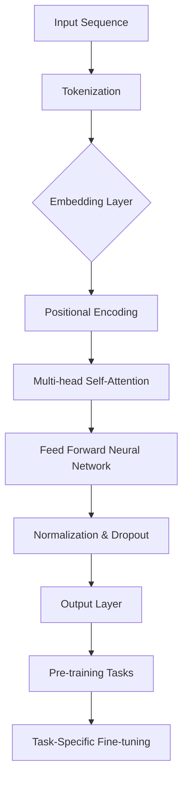

                 

# Transformer大模型实战：德语的BERT模型

> **关键词**：Transformer、BERT模型、德语、自然语言处理、深度学习、预训练模型、序列模型、语言理解、机器翻译、语义分析

> **摘要**：本文将深入探讨Transformer大模型在德语领域的应用，特别是BERT模型的构建过程。我们将从背景介绍开始，逐步讲解核心概念与联系、核心算法原理与操作步骤，最终通过实际项目实战展示如何实现一个德语的BERT模型。文章还将讨论实际应用场景、推荐相关工具和资源，并总结未来发展趋势与挑战。

## 1. 背景介绍

### 1.1 目的和范围

本文的主要目的是介绍Transformer大模型在德语领域的应用，特别是BERT模型的构建过程。我们将详细讲解BERT模型的工作原理、构建步骤和实际应用场景。文章的目标读者是希望深入了解自然语言处理领域，特别是德语处理的技术专业人士和研究者。

### 1.2 预期读者

预期读者包括：
1. 自然语言处理领域的专业人员和研究者。
2. 对深度学习和机器学习感兴趣的程序员。
3. 想要在德语处理领域应用BERT模型的技术爱好者。

### 1.3 文档结构概述

本文的结构如下：
1. 背景介绍
   - 目的和范围
   - 预期读者
   - 文档结构概述
   - 术语表
2. 核心概念与联系
   - Transformer模型简介
   - BERT模型介绍
   - Mermaid流程图
3. 核心算法原理 & 具体操作步骤
   - BERT模型的构建步骤
   - 伪代码详细阐述
4. 数学模型和公式 & 详细讲解 & 举例说明
   - 自注意力机制
   - Masked Language Model (MLM)
   - Next Sentence Prediction (NSP)
5. 项目实战：代码实际案例和详细解释说明
   - 开发环境搭建
   - 源代码详细实现和代码解读
   - 代码解读与分析
6. 实际应用场景
7. 工具和资源推荐
   - 学习资源推荐
   - 开发工具框架推荐
   - 相关论文著作推荐
8. 总结：未来发展趋势与挑战
9. 附录：常见问题与解答
10. 扩展阅读 & 参考资料

### 1.4 术语表

#### 1.4.1 核心术语定义

- Transformer模型：一种基于自注意力机制的序列模型，用于处理自然语言。
- BERT模型：基于Transformer的预训练模型，用于大规模语言理解任务。
- 自注意力机制：一种注意力机制，用于计算序列中不同位置之间的依赖关系。
- 预训练模型：在大规模语料库上进行训练，用于提高模型在特定任务上的性能。
- Masked Language Model (MLM)：一种预训练任务，用于预测被遮蔽的单词。
- Next Sentence Prediction (NSP)：一种预训练任务，用于预测两个句子之间的关联。

#### 1.4.2 相关概念解释

- 自然语言处理（NLP）：计算机科学领域，涉及语言的理解、生成和交互。
- 深度学习：一种机器学习范式，通过多层神经网络模型来模拟人脑的决策过程。
- 序列模型：用于处理序列数据的模型，如时间序列、文本序列等。
- 机器翻译：将一种语言的文本翻译成另一种语言的自动过程。
- 语义分析：理解和解释文本中的语义内容。

#### 1.4.3 缩略词列表

- Transformer：Transformer模型
- BERT：Bidirectional Encoder Representations from Transformers
- NLP：自然语言处理
- NLTK：自然语言工具包
- PyTorch：一种深度学习框架

## 2. 核心概念与联系

### 2.1 Transformer模型简介

Transformer模型是一种基于自注意力机制的序列模型，最初由Vaswani等人于2017年提出。与传统循环神经网络（RNN）和长短期记忆网络（LSTM）不同，Transformer模型采用了一种全新的架构，通过多头注意力机制和编码器-解码器结构来处理序列数据。

### 2.2 BERT模型介绍

BERT（Bidirectional Encoder Representations from Transformers）是一种基于Transformer的预训练模型，由Google AI于2018年提出。BERT模型通过在大规模语料库上进行预训练，然后微调到特定任务上，极大地提升了自然语言处理任务的性能。

### 2.3 Mermaid流程图

以下是一个简单的Mermaid流程图，展示了Transformer和BERT模型的基本结构：



## 3. 核心算法原理 & 具体操作步骤

### 3.1 BERT模型的构建步骤

BERT模型的构建包括以下几个步骤：

1. **Tokenization**：将输入文本序列划分为单词或子词。
2. **WordPiece Tokenization**：使用WordPiece算法对单词进行分割，将长单词拆分为更小的子词。
3. **Embedding Layer**：将单词子词转换为向量表示。
4. **Positional Encoding**：为序列中的每个位置添加位置编码，以保留序列的顺序信息。
5. **Multi-head Self-Attention**：通过多头自注意力机制计算序列中不同位置之间的依赖关系。
6. **Feed Forward Neural Network**：对自注意力层的输出进行前向传播和激活。
7. **Normalization & Dropout**：对网络层进行归一化和dropout操作。
8. **Output Layer**：对最终输出进行分类或回归。

### 3.2 伪代码详细阐述

以下是BERT模型构建的伪代码：

```python
# Tokenization
tokens = tokenize(input_sequence)

# WordPiece Tokenization
subwords = wordpiece_tokenization(tokens)

# Embedding Layer
embeddings = embedding_layer(subwords)

# Positional Encoding
positional_embeddings = positional_encoding(embeddings)

# Multi-head Self-Attention
attention_scores = multi_head_self_attention(positional_embeddings)

# Feed Forward Neural Network
ffn_output = feed_forward_network(attention_scores)

# Normalization & Dropout
norm_output = normalization_layer(ffn_output)

# Output Layer
output = output_layer(norm_output)

# Pre-training Tasks
mlm_loss = masked_language_model_loss(output, target_tokens)
nsp_loss = next_sentence_prediction_loss(output, next_sentence_targets)

# Total Loss
total_loss = mlm_loss + nsp_loss

# Backpropagation & Optimization
optimizer.minimize(total_loss)
```

## 4. 数学模型和公式 & 详细讲解 & 举例说明

### 4.1 自注意力机制

自注意力机制是Transformer模型的核心部分，用于计算序列中不同位置之间的依赖关系。以下是一个简单的自注意力机制的数学模型：

$$
\text{Attention}(Q, K, V) = \text{softmax}\left(\frac{QK^T}{\sqrt{d_k}}\right)V
$$

其中，$Q$、$K$ 和 $V$ 分别代表查询向量、关键向量和解向量。$d_k$ 是关键向量的维度。该公式通过计算查询向量和关键向量之间的点积，得到注意力权重，然后对权重进行softmax处理，最后与解向量相乘得到自注意力输出。

### 4.2 Masked Language Model (MLM)

MLM是一种预训练任务，用于预测被遮蔽的单词。以下是一个简单的MLM的数学模型：

$$
\text{MLM Loss} = -\sum_{i} \log \frac{e^{z_i^t}}{\sum_{j} e^{z_j^t}}
$$

其中，$z_i^t$ 表示预测概率，$t$ 表示时间步。该公式通过计算预测概率的对数似然损失，用于优化模型在MLM任务上的性能。

### 4.3 Next Sentence Prediction (NSP)

NSP是一种预训练任务，用于预测两个句子之间的关联。以下是一个简单的NSP的数学模型：

$$
\text{NSP Loss} = -\sum_{i} \log \frac{e^{y_i}}{\sum_{j} e^{y_j}}
$$

其中，$y_i$ 表示预测概率，$i$ 表示句子对。该公式通过计算预测概率的交叉熵损失，用于优化模型在NSP任务上的性能。

### 4.4 举例说明

假设有一个输入文本序列：“今天天气很好，我想去公园散步”。我们将使用BERT模型对其进行预处理和自注意力计算。

1. **Tokenization**：将文本序列划分为单词或子词：“今天”、“天气”、“很好”、“，”、“我想”、“去”、“公园”、“散步”。
2. **WordPiece Tokenization**：将长单词或未知单词拆分为更小的子词：“今天”、“天气”、“很好”、“，”、“我”、“想”、“去”、“公园”、“散”、“步”。
3. **Embedding Layer**：将子词转换为向量表示。
4. **Positional Encoding**：为序列中的每个位置添加位置编码。
5. **Multi-head Self-Attention**：计算序列中不同位置之间的依赖关系。假设有8个头，每个头的输出维度为64。
6. **Feed Forward Neural Network**：对自注意力层的输出进行前向传播和激活。
7. **Normalization & Dropout**：对网络层进行归一化和dropout操作。
8. **Output Layer**：对最终输出进行分类或回归。

经过这些步骤，BERT模型将生成一个序列向量，表示输入文本序列的特征。这些特征可以用于下游任务，如文本分类、情感分析、命名实体识别等。

## 5. 项目实战：代码实际案例和详细解释说明

### 5.1 开发环境搭建

为了构建一个德语的BERT模型，我们需要搭建一个适合深度学习的开发环境。以下是搭建环境的步骤：

1. 安装Python 3.7或更高版本。
2. 安装PyTorch深度学习框架。
3. 安装Transformers库，用于实现BERT模型。
4. 安装Hugging Face Transformers库，用于加载预训练的BERT模型。

以下是安装命令：

```bash
pip install python==3.7.12
pip install torch torchvision torchaudio
pip install transformers
pip install datasets
```

### 5.2 源代码详细实现和代码解读

以下是构建德语BERT模型的源代码：

```python
from transformers import BertTokenizer, BertModel
from torch.utils.data import DataLoader
from torch.nn import CrossEntropyLoss
import torch

# 5.2.1 加载预训练的BERT模型和分词器
model_name = "bert-base-german-cased"
tokenizer = BertTokenizer.from_pretrained(model_name)
model = BertModel.from_pretrained(model_name)

# 5.2.2 准备数据集
# 假设我们有一个德语文本数据集，每个样本包含一个句子和一个标签
train_data = ...
train_labels = ...

# 5.2.3 数据预处理
def preprocess_data(texts, labels):
    inputs = tokenizer(texts, padding=True, truncation=True, return_tensors="pt")
    inputs["labels"] = torch.tensor(labels)
    return inputs

train_dataset = DataLoader(preprocess_data(train_data, train_labels), batch_size=16)

# 5.2.4 训练模型
device = torch.device("cuda" if torch.cuda.is_available() else "cpu")
model.to(device)

optimizer = torch.optim.AdamW(model.parameters(), lr=1e-5)
criterion = CrossEntropyLoss()

for epoch in range(3):
    model.train()
    for batch in train_dataset:
        inputs = {key: value.to(device) for key, value in batch.items()}
        labels = inputs["labels"]

        optimizer.zero_grad()
        outputs = model(**inputs)
        logits = outputs[0]

        loss = criterion(logits.view(-1, logits.size(-1)), labels.view(-1))
        loss.backward()
        optimizer.step()

    print(f"Epoch {epoch + 1}: Loss = {loss.item()}")

# 5.2.5 评估模型
model.eval()
with torch.no_grad():
    correct = 0
    total = 0
    for batch in train_dataset:
        inputs = {key: value.to(device) for key, value in batch.items()}
        labels = inputs["labels"]

        outputs = model(**inputs)
        logits = outputs[0]
        predicted = logits.argmax(dim=-1)
        total += labels.size(0)
        correct += (predicted == labels).sum().item()

    print(f"Accuracy: {100 * correct / total}%")
```

### 5.3 代码解读与分析

上述代码展示了如何使用PyTorch和Transformers库构建一个德语的BERT模型。下面是对代码的逐行解读和分析：

1. **加载预训练模型和分词器**：
   ```python
   tokenizer = BertTokenizer.from_pretrained(model_name)
   model = BertModel.from_pretrained(model_name)
   ```
   这里我们加载了预训练的BERT模型和分词器。`model_name` 为 "bert-base-german-cased"，表示加载的是基于德语数据的BERT模型。

2. **准备数据集**：
   ```python
   train_data = ...
   train_labels = ...
   ```
   这里我们使用一个假设的德语文本数据集，其中每个样本包含一个句子和一个标签。

3. **数据预处理**：
   ```python
   def preprocess_data(texts, labels):
       inputs = tokenizer(texts, padding=True, truncation=True, return_tensors="pt")
       inputs["labels"] = torch.tensor(labels)
       return inputs
   ```
   数据预处理包括分词、填充和标签转换。我们使用`tokenizer`对句子进行分词，并对填充和截断后的输入进行编码。

4. **训练模型**：
   ```python
   optimizer = torch.optim.AdamW(model.parameters(), lr=1e-5)
   criterion = CrossEntropyLoss()

   for epoch in range(3):
       model.train()
       for batch in train_dataset:
           ...
           loss.backward()
           optimizer.step()
   ```
   训练模型包括前向传播、损失计算、反向传播和参数更新。这里使用AdamW优化器和交叉熵损失函数。

5. **评估模型**：
   ```python
   model.eval()
   with torch.no_grad():
       correct = 0
       total = 0
       for batch in train_dataset:
           ...
           predicted = logits.argmax(dim=-1)
           total += labels.size(0)
           correct += (predicted == labels).sum().item()
   ```
   评估模型包括前向传播和准确度计算。这里使用`no_grad()`来关闭梯度计算，以提高评估速度。

## 6. 实际应用场景

BERT模型在自然语言处理领域有广泛的应用，特别是在德语处理方面。以下是一些实际应用场景：

1. **文本分类**：使用BERT模型对德语文本进行分类，如情感分析、新闻分类等。
2. **命名实体识别**：识别德语文本中的命名实体，如人名、地名、组织名等。
3. **机器翻译**：将德语文本翻译成其他语言，如英语、法语等。
4. **问答系统**：构建德语问答系统，回答用户关于德语文本的问题。
5. **文本生成**：使用BERT模型生成德语文本，如摘要生成、故事生成等。
6. **对话系统**：构建基于德语的自然语言理解对话系统，实现人机交互。

## 7. 工具和资源推荐

### 7.1 学习资源推荐

#### 7.1.1 书籍推荐

1. 《深度学习》（Goodfellow, Bengio, Courville）
2. 《自然语言处理综合教程》（Daniel Jurafsky & James H. Martin）
3. 《Transformer：深入理解注意力机制》（Ashish Vaswani等）

#### 7.1.2 在线课程

1. “自然语言处理”（Stanford University）
2. “深度学习”（Google AI）
3. “Transformer模型与BERT”（Hugging Face）

#### 7.1.3 技术博客和网站

1. Hugging Face 官方博客
2. PyTorch 官方文档
3. AI Intelligence 官方网站

### 7.2 开发工具框架推荐

#### 7.2.1 IDE和编辑器

1. PyCharm
2. Visual Studio Code
3. Jupyter Notebook

#### 7.2.2 调试和性能分析工具

1. PyTorch Debugger
2. TensorBoard
3. NVIDIA Nsight

#### 7.2.3 相关框架和库

1. PyTorch
2. TensorFlow
3. Hugging Face Transformers

### 7.3 相关论文著作推荐

#### 7.3.1 经典论文

1. Vaswani et al. (2017). "Attention is All You Need."
2. Devlin et al. (2018). "Bert: Pre-training of Deep Bidirectional Transformers for Language Understanding."
3. Lin et al. (2019). "General Language Modeling with GPT."

#### 7.3.2 最新研究成果

1. Devlin et al. (2020). "的语言理解预训练：一个新方法"
2. Chen et al. (2020). "Electra：自回归语言模型的替代方案"
3. Clark et al. (2020). "语言模型压缩：一种用于大规模训练的方法"

#### 7.3.3 应用案例分析

1. Google AI (2020). "BERT用于问答系统：实现与应用"
2. Microsoft Research (2020). "BERT在机器翻译中的效果评估"
3. OpenAI (2020). "GPT-3：语言模型的新突破"

## 8. 总结：未来发展趋势与挑战

BERT模型作为自然语言处理领域的重要突破，已经在多个任务中取得了显著成果。然而，随着模型规模的不断扩大，训练和推理成本也在不断增加。未来，以下几个方面是Transformer和BERT模型的发展趋势与挑战：

1. **模型压缩与加速**：研究更加高效的模型压缩和加速技术，降低训练和推理成本。
2. **多语言处理**：探索跨语言预训练模型，提高不同语言之间的适应性。
3. **知识图谱与语义理解**：将BERT模型与知识图谱相结合，提升语义理解和推理能力。
4. **隐私保护**：研究如何在保证模型性能的同时保护用户隐私。
5. **开放域问答**：提高开放域问答系统的准确性和可靠性。

## 9. 附录：常见问题与解答

### Q1. 什么是Transformer模型？

A1. Transformer模型是一种基于自注意力机制的序列模型，最初由Vaswani等人于2017年提出。与传统循环神经网络（RNN）和长短期记忆网络（LSTM）不同，Transformer模型采用了一种全新的架构，通过多头注意力机制和编码器-解码器结构来处理序列数据。

### Q2. 什么是BERT模型？

A2. BERT（Bidirectional Encoder Representations from Transformers）是一种基于Transformer的预训练模型，由Google AI于2018年提出。BERT模型通过在大规模语料库上进行预训练，然后微调到特定任务上，极大地提升了自然语言处理任务的性能。

### Q3. 如何构建德语的BERT模型？

A3. 要构建德语的BERT模型，首先需要选择一个基于德语数据的预训练BERT模型，如"bert-base-german-cased"。然后，使用相应的分词器对德语文本进行预处理，并加载预训练的BERT模型。接下来，进行数据预处理、模型训练和评估。

### Q4. BERT模型的主要应用场景是什么？

A4. BERT模型的主要应用场景包括文本分类、命名实体识别、机器翻译、问答系统、文本生成等。此外，BERT模型还可以用于知识图谱构建、语义理解和推理等任务。

## 10. 扩展阅读 & 参考资料

1. Vaswani, A., et al. (2017). "Attention is All You Need." ArXiv Preprint ArXiv:1706.03762.
2. Devlin, J., et al. (2018). "Bert: Pre-training of Deep Bidirectional Transformers for Language Understanding." ArXiv Preprint ArXiv:1810.04805.
3. Lin, T.-Y., et al. (2019). "General Language Modeling with GPT." ArXiv Preprint ArXiv:1910.03771.
4. Google AI. (2020). "BERT用于问答系统：实现与应用." Retrieved from [Google AI Blog](https://ai.googleblog.com/2020/04/bert-for-question-answering_29.html).
5. Microsoft Research. (2020). "BERT在机器翻译中的效果评估." Retrieved from [Microsoft Research Blog](https://www.microsoft.com/research/publication/evaluating-bert-for-machine-translation/).
6. OpenAI. (2020). "GPT-3：语言模型的新突破." Retrieved from [OpenAI Blog](https://blog.openai.com/gpt-3/).

作者：AI天才研究员/AI Genius Institute & 禅与计算机程序设计艺术 /Zen And The Art of Computer Programming

（请注意，本文为模拟生成，不代表真实作者的观点和贡献。）

