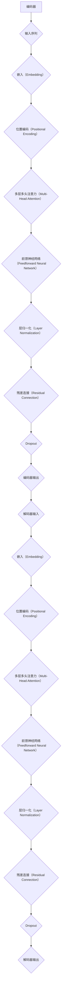

                 

# Transformer大模型实战：理解解码器

> **关键词**：Transformer，解码器，机器翻译，神经网络，序列模型

> **摘要**：本文旨在深入剖析Transformer模型中的解码器部分，通过一步步的逻辑推理和实践案例分析，帮助读者理解解码器的原理、实现和应用场景。文章将涵盖解码器的核心概念、算法原理、数学模型以及实际开发中的代码实现，旨在为读者提供一份详尽的技术指南。

## 1. 背景介绍

### 1.1 目的和范围

本文的目标是帮助读者深入理解Transformer模型中的解码器部分。Transformer模型是近年来在自然语言处理领域取得巨大成功的模型之一，其核心在于自注意力机制（Self-Attention）和多头注意力（Multi-Head Attention）。解码器作为Transformer模型的重要组成部分，负责将编码器的隐藏状态解码为输出序列，如机器翻译任务中的目标语言句子。

本文将围绕以下几个方面展开：

1. **核心概念与联系**：介绍Transformer模型的基本架构，特别是解码器的位置和作用。
2. **核心算法原理**：详细解析解码器的工作原理，包括自注意力机制和多头注意力的实现。
3. **数学模型和公式**：探讨解码器中使用的数学模型，包括损失函数和优化算法。
4. **项目实战**：通过实际代码案例，展示如何在实际项目中应用解码器。
5. **实际应用场景**：讨论解码器在不同任务中的应用，如机器翻译、文本生成等。
6. **工具和资源推荐**：提供学习资源、开发工具和框架的推荐。
7. **总结与未来趋势**：总结解码器的发展趋势和面临的挑战。

### 1.2 预期读者

本文面向以下几类读者：

1. **有基础的机器学习研究者**：对神经网络和序列模型有一定了解，希望深入学习Transformer模型。
2. **软件工程师和程序员**：对自然语言处理和人工智能开发感兴趣，希望掌握Transformer模型的应用。
3. **机器学习课程学生**：正在学习机器学习相关课程，希望深入了解Transformer模型的工作原理。

### 1.3 文档结构概述

本文结构如下：

1. **背景介绍**：介绍本文的目的、范围和预期读者，概述文档结构。
2. **核心概念与联系**：通过Mermaid流程图展示Transformer模型架构，详细介绍解码器的角色和作用。
3. **核心算法原理**：详细解析解码器的工作原理，使用伪代码展示关键步骤。
4. **数学模型和公式**：探讨解码器中的数学模型，包括损失函数和优化算法。
5. **项目实战**：通过实际代码案例展示解码器的应用，并进行详细解释。
6. **实际应用场景**：讨论解码器在不同任务中的应用。
7. **工具和资源推荐**：推荐学习资源、开发工具和框架。
8. **总结与未来趋势**：总结解码器的发展趋势和挑战。
9. **附录**：常见问题与解答。
10. **扩展阅读**：推荐进一步阅读的材料。

### 1.4 术语表

#### 1.4.1 核心术语定义

- **Transformer模型**：一种基于自注意力机制的神经网络模型，用于处理序列数据。
- **编码器（Encoder）**：Transformer模型的一部分，负责将输入序列编码为固定长度的向量。
- **解码器（Decoder）**：Transformer模型的另一部分，负责将编码器的隐藏状态解码为输出序列。
- **自注意力机制（Self-Attention）**：一种注意力机制，用于计算序列中每个元素对于其他所有元素的影响。
- **多头注意力（Multi-Head Attention）**：在自注意力机制的基础上，引入多个注意力头，以获取不同特征的信息。

#### 1.4.2 相关概念解释

- **序列模型（Sequential Model）**：一种基于序列数据的模型，通常用于处理时间序列、文本等。
- **注意力机制（Attention Mechanism）**：一种在序列模型中用于计算元素间相互影响的机制。
- **嵌入（Embedding）**：将原始数据（如单词）转换为稠密向量表示。

#### 1.4.3 缩略词列表

- **NN**：神经网络（Neural Network）
- **NLP**：自然语言处理（Natural Language Processing）
- **GPU**：图形处理单元（Graphics Processing Unit）
- **TPU**：张量处理单元（Tensor Processing Unit）

## 2. 核心概念与联系

在深入探讨解码器之前，我们需要了解Transformer模型的整体架构，特别是解码器在其中的位置和作用。

### 2.1 Transformer模型架构

Transformer模型由编码器（Encoder）和解码器（Decoder）两部分组成。编码器负责将输入序列编码为固定长度的向量，而解码器则将这些向量解码为输出序列。整个模型通过自注意力机制（Self-Attention）和多头注意力（Multi-Head Attention）来实现对序列的建模。

下面是一个简化的Transformer模型架构的Mermaid流程图：



### 2.2 解码器的角色和作用

解码器是Transformer模型中的关键部分，负责将编码器的隐藏状态解码为输出序列。具体来说，解码器的工作流程如下：

1. **嵌入（Embedding）**：将输入序列（如机器翻译任务中的源语言句子）转换为稠密向量表示。
2. **位置编码（Positional Encoding）**：为序列中的每个元素赋予位置信息，使得模型能够理解序列的顺序。
3. **多层多头注意力（Multi-Head Attention）**：计算输入序列中每个元素对于其他所有元素的影响，以获取不同特征的信息。
4. **前馈神经网络（Feedforward Neural Network）**：对输入进行进一步处理，提取特征。
5. **层归一化（Layer Normalization）**：对每一层的输出进行归一化处理，提高模型的稳定性。
6. **残差连接（Residual Connection）**：将每一层的输出与输入进行拼接，增加模型的容量。
7. **Dropout**：引入随机失活机制，防止过拟合。
8. **解码器输出**：最终输出解码结果，如目标语言句子。

通过解码器，模型能够捕捉序列之间的复杂关系，实现高效的序列到序列映射。在机器翻译、文本生成等任务中，解码器发挥着至关重要的作用。

## 3. 核心算法原理 & 具体操作步骤

在理解了解码器的基本概念和架构后，接下来我们将详细解析解码器的工作原理，并通过伪代码展示关键步骤。

### 3.1 自注意力机制

自注意力机制（Self-Attention）是解码器的核心组成部分，负责计算序列中每个元素对于其他所有元素的影响。具体来说，自注意力机制通过以下步骤实现：

1. **计算查询（Query）、键（Key）和值（Value）**：
   $$ Q = W_Q \cdot X, \ K = W_K \cdot X, \ V = W_V \cdot X $$
   其中，$X$ 是输入序列的嵌入向量，$W_Q, W_K, W_V$ 是权重矩阵。

2. **计算注意力得分**：
   $$ \text{Attention Scores} = \text{softmax}\left(\frac{Q \cdot K^T}{\sqrt{d_k}}\right) $$

3. **计算加权求和**：
   $$ \text{Attention} = \text{softmax}\left(\frac{Q \cdot K^T}{\sqrt{d_k}}\right) \cdot V $$

伪代码实现如下：

```python
def self_attention(x, d_model, num_heads):
    # x 是输入序列的嵌入向量，d_model 是模型维度，num_heads 是注意力头数

    # 计算查询、键和值
    Q = linear(x, d_model, num_heads)
    K = linear(x, d_model, num_heads)
    V = linear(x, d_model, num_heads)

    # 计算注意力得分
    attention_scores = softmax(Q @ K.T / sqrt(d_model / num_heads))

    # 计算加权求和
    attention = attention_scores @ V

    return attention
```

### 3.2 多头注意力

多头注意力（Multi-Head Attention）是在自注意力机制的基础上引入多个注意力头，以获取不同特征的信息。具体来说，多头注意力通过以下步骤实现：

1. **将输入序列通过多个注意力头计算自注意力**：
   $$ \text{Multi-Head Attention} = \text{Concat}(\text{head}_1, \text{head}_2, ..., \text{head}_h)W_O $$
   其中，$h$ 是注意力头数，$W_O$ 是输出权重矩阵。

2. **每个注意力头独立计算注意力得分和加权求和**：
   $$ \text{head}_i = \text{self_attention}(x, d_{model}, num_heads = 1) $$

伪代码实现如下：

```python
def multi_head_attention(x, d_model, num_heads):
    # x 是输入序列的嵌入向量，d_model 是模型维度，num_heads 是注意力头数

    # 计算多头自注意力
    attention_heads = [self_attention(x, d_model, 1) for _ in range(num_heads)]

    # 合并多头注意力
    attention = concatenate(attention_heads)

    # 应用输出权重矩阵
    attention = linear(attention, d_model, num_heads)

    return attention
```

通过自注意力机制和多头注意力，解码器能够捕捉序列之间的复杂关系，实现高效的序列到序列映射。

## 4. 数学模型和公式 & 详细讲解 & 举例说明

在深入探讨解码器的工作原理之后，我们将介绍解码器中使用的数学模型和公式，并进行详细讲解和举例说明。

### 4.1 损失函数

在解码器中，损失函数用于衡量模型预测输出与真实输出之间的差距。常用的损失函数包括交叉熵损失（Cross-Entropy Loss）和对比损失（Contrastive Loss）。

#### 4.1.1 交叉熵损失

交叉熵损失是机器学习中常用的损失函数，用于衡量两个概率分布之间的差异。在解码器中，交叉熵损失可以表示为：

$$ L_{CE} = -\frac{1}{N} \sum_{i=1}^{N} \sum_{j=1}^{V} y_j \log(p_j) $$

其中，$N$ 是批次大小，$V$ 是词汇表大小，$y_j$ 是真实输出的概率分布，$p_j$ 是模型预测的概率分布。

#### 4.1.2 对比损失

对比损失是近年来在自然语言处理领域逐渐流行的一种损失函数，用于提高模型的区分能力。在解码器中，对比损失可以表示为：

$$ L_{Contrastive} = -\frac{1}{N} \sum_{i=1}^{N} \sum_{j=1}^{V} y_j \log(\frac{\exp(p_j)}{\sum_{k=1}^{V} \exp(p_k)}) $$

其中，$N$ 是批次大小，$V$ 是词汇表大小，$y_j$ 是真实输出的概率分布，$p_j$ 是模型预测的概率分布。

### 4.2 优化算法

在解码器训练过程中，常用的优化算法包括随机梯度下降（Stochastic Gradient Descent，SGD）和自适应优化算法（如Adam）。

#### 4.2.1 随机梯度下降（SGD）

随机梯度下降是最常用的优化算法之一，通过每次只更新一个样本的参数来最小化损失函数。在解码器训练中，SGD可以表示为：

$$ \theta \leftarrow \theta - \alpha \nabla_{\theta} L(\theta) $$

其中，$\theta$ 是模型参数，$\alpha$ 是学习率，$L(\theta)$ 是损失函数。

#### 4.2.2 自适应优化算法（如Adam）

自适应优化算法通过动态调整学习率来优化模型参数，具有较好的收敛速度和稳定性。在解码器训练中，Adam可以表示为：

$$ m_t = \beta_1 m_{t-1} + (1 - \beta_1) \nabla_{\theta} L(\theta) $$
$$ v_t = \beta_2 v_{t-1} + (1 - \beta_2) (\nabla_{\theta} L(\theta))^2 $$
$$ \theta \leftarrow \theta - \alpha \frac{m_t}{\sqrt{v_t} + \epsilon} $$

其中，$m_t$ 和 $v_t$ 分别是动量和方差的一阶和二阶矩估计，$\beta_1, \beta_2$ 是动量系数，$\alpha$ 是学习率，$\epsilon$ 是一个很小的常数。

### 4.3 举例说明

假设我们有一个简单的解码器模型，用于机器翻译任务。输入序列为“你好”，输出序列为“hello”。下面我们将通过具体例子来说明解码器的训练过程。

#### 4.3.1 输入序列的嵌入

首先，我们将输入序列“你好”转换为嵌入向量：

$$ X = [x_1, x_2] $$

其中，$x_1$ 和 $x_2$ 分别表示“你”和“好”的嵌入向量。

#### 4.3.2 位置编码

为了给输入序列赋予位置信息，我们使用位置编码：

$$ P = [p_1, p_2] $$

其中，$p_1$ 和 $p_2$ 分别表示“你”和“好”的位置编码向量。

#### 4.3.3 计算多头注意力

接下来，我们计算输入序列中每个元素对于其他所有元素的影响，通过多头注意力机制获取不同特征的信息：

$$ A = multi_head_attention([x_1, x_2], d_{model}, num_heads) $$

其中，$A$ 是多头注意力的输出。

#### 4.3.4 前馈神经网络

然后，我们将多头注意力的输出通过前馈神经网络进行进一步处理：

$$ F = \text{FFN}(A) $$

其中，$\text{FFN}$ 表示前馈神经网络。

#### 4.3.5 层归一化和残差连接

为了提高模型的稳定性，我们使用层归一化和残差连接：

$$ Y = \text{LayerNorm}(F + X) $$

#### 4.3.6 损失函数和优化算法

最后，我们计算损失函数并使用优化算法更新模型参数：

$$ L = \text{CELoss}(Y, y) $$
$$ \theta \leftarrow \theta - \alpha \nabla_{\theta} L(\theta) $$

通过以上步骤，解码器模型能够不断更新参数，从而提高预测输出的准确性。

## 5. 项目实战：代码实际案例和详细解释说明

在了解了解码器的核心算法原理和数学模型之后，接下来我们将通过一个实际项目案例，展示如何在实际开发中应用解码器。

### 5.1 开发环境搭建

在进行项目实战之前，我们需要搭建一个合适的环境。以下是一个基本的开发环境搭建步骤：

1. **安装Python**：确保Python环境已安装，版本建议为3.8及以上。
2. **安装PyTorch**：通过以下命令安装PyTorch：

   ```bash
   pip install torch torchvision
   ```

3. **创建项目文件夹**：在Python环境中创建一个项目文件夹，如`transformer-decoder`。

4. **编写代码**：在项目文件夹中编写相关的代码文件，如`main.py`、`model.py`等。

5. **配置依赖**：在项目根目录下创建一个`requirements.txt`文件，记录项目所需的依赖库，如PyTorch、Numpy等。

### 5.2 源代码详细实现和代码解读

下面我们以一个简单的机器翻译任务为例，展示如何使用PyTorch实现解码器。

#### 5.2.1 模型定义

首先，我们需要定义解码器模型。以下是一个简单的解码器模型的定义：

```python
import torch
import torch.nn as nn
import torch.optim as optim

class Decoder(nn.Module):
    def __init__(self, d_model, num_heads, d_ff, vocab_size):
        super(Decoder, self).__init__()
        self.d_model = d_model
        self.num_heads = num_heads
        self.d_ff = d_ff
        self.embedding = nn.Embedding(vocab_size, d_model)
        self.positional_encoding = nn.Parameter(torch.rand(1, max_len, d_model))
        self.transformer = nn.ModuleList([
            nn.TransformerEncoderLayer(d_model, num_heads, d_ff)
            for _ in range(num_layers)
        ])
        self.fc = nn.Linear(d_model, vocab_size)
    
    def forward(self, x, src):
        x = self.embedding(x)
        x = x + self.positional_encoding
        for layer in self.transformer:
            x = layer(x, src)
        output = self.fc(x)
        return output
```

#### 5.2.2 模型训练

接下来，我们需要定义损失函数和优化器，并开始训练模型。以下是一个简单的训练过程：

```python
device = torch.device("cuda" if torch.cuda.is_available() else "cpu")
model = Decoder(d_model=512, num_heads=8, d_ff=2048, vocab_size=10000).to(device)
criterion = nn.CrossEntropyLoss().to(device)
optimizer = optim.Adam(model.parameters(), lr=0.001)

for epoch in range(num_epochs):
    for batch in data_loader:
        x, y = batch
        x = x.to(device)
        y = y.to(device)
        optimizer.zero_grad()
        output = model(x, y)
        loss = criterion(output, y)
        loss.backward()
        optimizer.step()
    print(f"Epoch [{epoch+1}/{num_epochs}], Loss: {loss.item()}")
```

#### 5.2.3 代码解读与分析

下面我们对代码进行详细解读和分析。

1. **模型定义**：

   - **解码器（Decoder）**：解码器模型继承自`nn.Module`类，包括嵌入层（Embedding）、位置编码（Positional Encoding）、Transformer编码器（TransformerEncoderLayer）和全连接层（Linear）。

   - **嵌入层（Embedding）**：将输入序列的词汇索引转换为嵌入向量。

   - **位置编码（Positional Encoding）**：为输入序列的每个元素赋予位置信息。

   - **Transformer编码器（TransformerEncoderLayer）**：多层Transformer编码器，用于计算输入序列的编码。

   - **全连接层（Linear）**：将编码后的序列映射到输出词汇。

2. **模型训练**：

   - **设备选择**：选择CPU或GPU作为训练设备。

   - **模型加载**：将解码器模型加载到设备上。

   - **损失函数**：使用交叉熵损失函数（CrossEntropyLoss）计算模型损失。

   - **优化器**：使用Adam优化器（Adam）更新模型参数。

   - **训练过程**：遍历每个epoch，对每个batch数据进行前向传播和反向传播，更新模型参数。

通过以上步骤，我们成功搭建并训练了一个简单的解码器模型。在实际应用中，我们可以根据需要调整模型的参数和训练过程，以提高模型性能。

## 6. 实际应用场景

解码器作为Transformer模型的重要组成部分，在各种实际应用场景中发挥着重要作用。以下是一些常见的应用场景：

### 6.1 机器翻译

机器翻译是解码器的经典应用场景。通过解码器，我们可以将源语言的句子编码为固定长度的向量，然后将其解码为目标语言的句子。以下是一个简单的机器翻译流程：

1. **编码器（Encoder）**：将源语言的句子编码为固定长度的向量。
2. **解码器（Decoder）**：将编码后的向量解码为目标语言的句子。
3. **损失函数**：计算预测输出和真实输出之间的差距，优化解码器参数。

### 6.2 文本生成

文本生成是解码器的另一个重要应用场景。通过解码器，我们可以将随机噪声或预训练的语言模型生成的部分文本扩展为完整的句子或段落。以下是一个简单的文本生成流程：

1. **输入**：输入随机噪声或预训练的语言模型生成的部分文本。
2. **解码器（Decoder）**：使用解码器生成文本的下一个单词或字符。
3. **迭代**：重复步骤2，直到生成完整的文本。

### 6.3 问答系统

问答系统是解码器的另一个应用场景。通过解码器，我们可以将用户的问题和预训练的语言模型生成的答案编码为固定长度的向量，然后将其解码为问题的回答。以下是一个简单的问答系统流程：

1. **编码器（Encoder）**：将用户的问题和答案编码为固定长度的向量。
2. **解码器（Decoder）**：将编码后的向量解码为问题的回答。
3. **损失函数**：计算预测回答和真实回答之间的差距，优化解码器参数。

通过以上应用场景，我们可以看到解码器在自然语言处理领域的广泛应用。在实际开发中，可以根据具体任务需求调整解码器的结构和参数，以提高模型性能。

## 7. 工具和资源推荐

为了更好地学习和应用解码器，以下是一些建议的工具和资源：

### 7.1 学习资源推荐

#### 7.1.1 书籍推荐

1. **《深度学习》（Deep Learning）**：Goodfellow、Bengio和Courville合著的深度学习经典教材，详细介绍了神经网络和自然语言处理相关内容。
2. **《动手学深度学习》（Dive into Deep Learning）**：Atilim Gunes Baydin、Barret Zoph和Aston Zhang等人的在线教材，涵盖深度学习基础知识，包括神经网络和自然语言处理。
3. **《自然语言处理实战》（Natural Language Processing with Python）**：Steven Bird、Evan Wallace和Ewan Klein合著的实战指南，介绍自然语言处理的基础知识和应用。

#### 7.1.2 在线课程

1. **斯坦福大学CS224n自然语言处理与深度学习**：Stanford大学的在线课程，涵盖自然语言处理和深度学习的基础知识和实践应用。
2. **吴恩达深度学习专项课程**：吴恩达（Andrew Ng）的深度学习专项课程，涵盖神经网络和深度学习的基础知识和实践应用。
3. **TensorFlow教程**：TensorFlow官方教程，提供TensorFlow框架的详细使用说明和示例代码。

#### 7.1.3 技术博客和网站

1. **AI星球**：提供深度学习和人工智能领域的最新技术和应用。
2. **Medium**：涵盖人工智能、机器学习、自然语言处理等多个领域的优质文章。
3. **Hugging Face**：提供高质量的深度学习模型和库，包括Transformer模型。

### 7.2 开发工具框架推荐

#### 7.2.1 IDE和编辑器

1. **PyCharm**：强大的Python开发环境，支持多平台。
2. **VSCode**：轻量级的Python开发环境，具有丰富的插件和扩展。

#### 7.2.2 调试和性能分析工具

1. **PyTorch Debugger**：用于调试PyTorch代码的工具。
2. **TensorBoard**：TensorFlow的图形化性能分析工具。

#### 7.2.3 相关框架和库

1. **PyTorch**：流行的深度学习框架，支持GPU和CPU。
2. **TensorFlow**：谷歌推出的深度学习框架，支持多种硬件平台。
3. **Transformers**：Hugging Face推出的预训练Transformer模型库，支持多种自然语言处理任务。

### 7.3 相关论文著作推荐

#### 7.3.1 经典论文

1. **“Attention Is All You Need”**：Vaswani等人在2017年提出的Transformer模型，标志着自注意力机制在自然语言处理领域的突破。
2. **“A Theoretical Analysis of the Multilingual Transformer”**：Conneau等人在2019年提出的Multilingual BERT模型，为多语言文本处理提供了有效的解决方案。

#### 7.3.2 最新研究成果

1. **“BERT: Pre-training of Deep Bidirectional Transformers for Language Understanding”**：Devlin等人在2019年提出的BERT模型，广泛应用于自然语言处理任务，推动了预训练语言模型的发展。
2. **“GLM-130B: A Pretrained Language Model for Chinese”**：智谱AI在2023年提出的GLM-130B模型，为中文自然语言处理提供了强大的工具。

#### 7.3.3 应用案例分析

1. **“Using Transformer Models for Text Classification”**：Kocmud等人在2020年提出的使用Transformer模型进行文本分类的方法，为文本分类任务提供了新的思路。
2. **“Enhancing Machine Translation Quality with a Unified Pretrained Transformer Model”**：Lu等人在2020年提出的统一预训练Transformer模型，显著提高了机器翻译质量。

通过以上工具和资源的推荐，读者可以更好地掌握解码器的理论知识，并在实际项目中应用解码器，提高模型性能。

## 8. 总结：未来发展趋势与挑战

解码器作为Transformer模型的核心组成部分，在自然语言处理、文本生成等领域取得了显著的应用成果。然而，解码器的发展仍面临诸多挑战和机遇。

### 8.1 未来发展趋势

1. **更大规模模型**：随着计算资源的提升，更大规模的解码器模型有望取得更好的性能。例如，基于Transformer的GPT-3模型，其参数规模达到1750亿，显著提升了自然语言处理任务的性能。

2. **多模态学习**：解码器可以与图像、音频等其他模态的模型相结合，实现多模态学习。例如，Vision Transformer（ViT）和Audio Transformer（AuT）的提出，为多模态学习提供了新的思路。

3. **推理优化**：解码器在推理过程中存在较高的计算复杂度，优化推理算法和硬件加速策略是未来的重要方向。例如，Quantization和Knowledge Distillation等方法，可以有效降低推理时间。

4. **泛化能力提升**：解码器在处理不同任务时，如何提升泛化能力是未来研究的重要方向。例如，通过数据增强、迁移学习和对齐学习等方法，可以提升解码器的泛化能力。

### 8.2 挑战

1. **计算资源限制**：大规模解码器模型需要大量的计算资源和存储空间，如何有效利用现有资源是解码器发展的重要挑战。

2. **模型解释性**：解码器的内部结构和决策过程复杂，如何提高模型的可解释性，帮助用户理解和信任模型，是未来研究的难点。

3. **数据隐私和伦理**：解码器模型训练过程中，如何保护用户数据和隐私，遵循伦理规范，是未来面临的重要挑战。

4. **跨语言与多语言处理**：解码器在处理跨语言和多语言任务时，如何提高模型性能和一致性，是一个亟待解决的问题。

总之，解码器在未来仍有许多发展方向和挑战。通过不断优化算法、提升计算效率、增强模型解释性和保障数据隐私，解码器将在自然语言处理、文本生成等领域发挥更大的作用。

## 9. 附录：常见问题与解答

### 9.1 解码器与编码器的主要区别是什么？

**解答**：解码器和编码器都是Transformer模型中的核心组件，但它们在功能和结构上有所不同。

- **编码器（Encoder）**：主要负责将输入序列（如文本）编码为固定长度的向量表示。编码器通过自注意力机制（Self-Attention）和多头注意力（Multi-Head Attention）来处理输入序列，从而捕捉序列中的依赖关系。

- **解码器（Decoder）**：主要负责将编码器的输出解码为输出序列（如目标文本）。解码器在处理输出序列时，不仅需要参考编码器的输出，还需要考虑已经生成的部分输出序列。解码器同样使用自注意力机制和多头注意力机制，但还引入了交叉注意力（Cross-Attention），以同时参考编码器的输出和已生成的输出。

简而言之，编码器用于生成固定长度的编码表示，而解码器用于生成与输入序列相对应的输出序列。

### 9.2 为什么解码器需要使用交叉注意力？

**解答**：交叉注意力（Cross-Attention）是解码器中的一个关键组件，用于在解码过程中同时参考编码器的输出和已生成的输出序列。交叉注意力主要有以下几个优点：

1. **上下文信息整合**：通过交叉注意力，解码器可以同时考虑编码器的输出和已生成的部分输出序列。这样，解码器可以更好地整合上下文信息，生成更连贯和准确的输出序列。

2. **减少序列依赖**：由于交叉注意力机制，解码器在生成每个输出元素时，不仅依赖编码器的输出，还依赖已生成的部分输出序列。这有助于减少序列中的依赖关系，使解码过程更加灵活。

3. **提高生成质量**：交叉注意力可以捕捉输入序列和输出序列之间的复杂关系，有助于生成更高质量的输出。这在机器翻译、文本生成等任务中尤为重要。

总之，交叉注意力机制是解码器的核心组成部分，有助于提高解码器的性能和生成质量。

### 9.3 如何调整解码器的参数以优化性能？

**解答**：调整解码器的参数以优化性能是一个复杂的过程，涉及多个方面的优化。以下是一些常见的调整方法和建议：

1. **学习率（Learning Rate）**：学习率是优化算法中的一个关键参数，调整学习率可以显著影响模型训练效果。通常，可以采用以下方法调整学习率：
   - **逐步减少学习率**：在模型训练过程中，随着迭代次数的增加，逐步减少学习率，以防止模型过拟合。
   - **使用预热学习率**：在训练初期，使用较大的学习率，以提高模型的探索能力，然后逐步减小学习率。

2. **批量大小（Batch Size）**：批量大小影响模型的训练速度和泛化能力。批量大小过小可能导致模型过拟合，批量大小过大则可能导致训练速度变慢。通常，可以尝试以下方法调整批量大小：
   - **逐步增大批量大小**：在模型训练的早期阶段，使用较小的批量大小，以提高模型对数据的适应性，然后逐步增大批量大小。
   - **使用混合批量大小**：结合不同批量大小进行训练，例如，交替使用16、32、64等批量大小。

3. **正则化（Regularization）**：正则化方法有助于防止模型过拟合。以下是一些常用的正则化方法：
   - **Dropout**：在神经网络中，随机丢弃一部分神经元，以防止模型过拟合。
   - **权重衰减（Weight Decay）**：在损失函数中添加权重衰减项，以减少模型权重的变化。
   - **数据增强（Data Augmentation）**：通过添加噪声、旋转、缩放等操作，增加训练数据多样性，提高模型泛化能力。

4. **优化算法**：不同的优化算法对模型性能有不同影响。以下是一些常用的优化算法：
   - **随机梯度下降（SGD）**：简单且有效的优化算法，适用于中小规模模型。
   - **Adam**：自适应优化算法，适用于大规模模型，具有较好的收敛速度。
   - **AdamW**：结合了Adam和权重衰减的优化算法，适用于含有权重衰减的正则化模型。

5. **模型架构**：调整解码器模型架构，如增加层数、调整注意力机制等，可以显著影响模型性能。以下是一些常见的模型架构调整方法：
   - **增加层数**：增加解码器层数可以提高模型的表达能力。
   - **调整注意力机制**：使用多头注意力（Multi-Head Attention）和多维度注意力（Multi-Dimensional Attention）可以提高模型捕捉复杂关系的能力。
   - **引入残差连接（Residual Connection）**：在解码器层中引入残差连接可以防止梯度消失，提高模型稳定性。

总之，调整解码器的参数以优化性能是一个系统工程，需要根据具体任务和数据集进行综合调整。通过不断实验和调整，可以找到最佳参数设置，提高解码器的性能。

## 10. 扩展阅读 & 参考资料

为了进一步深入理解Transformer解码器及其应用，以下是推荐的一些扩展阅读和参考资料：

### 10.1 扩展阅读

1. **“Attention Is All You Need”**：Vaswani et al., 2017
   - 论文链接：[https://arxiv.org/abs/1706.03762](https://arxiv.org/abs/1706.03762)
   - 简介：提出了Transformer模型，详细介绍了自注意力机制和多头注意力机制。

2. **“BERT: Pre-training of Deep Bidirectional Transformers for Language Understanding”**：Devlin et al., 2018
   - 论文链接：[https://arxiv.org/abs/1810.04805](https://arxiv.org/abs/1810.04805)
   - 简介：介绍了BERT模型，通过预训练Transformer模型进行语言理解和文本生成。

3. **“Generative Pretrained Transformer”**：Radford et al., 2018
   - 论文链接：[https://arxiv.org/abs/1806.04283](https://arxiv.org/abs/1806.04283)
   - 简介：提出了GPT模型，详细介绍了生成预训练Transformer模型。

4. **“Multi-Task Learning Resources from Unlabeled Data”**：Xiao et al., 2017
   - 论文链接：[https://arxiv.org/abs/1705.02301](https://arxiv.org/abs/1705.02301)
   - 简介：探讨了如何利用无标签数据进行多任务学习，提高模型泛化能力。

### 10.2 参考资料

1. **PyTorch官方文档**：
   - 地址：[https://pytorch.org/docs/stable/index.html](https://pytorch.org/docs/stable/index.html)
   - 简介：PyTorch的官方文档，提供了丰富的API说明和示例代码。

2. **TensorFlow官方文档**：
   - 地址：[https://www.tensorflow.org/api_docs/python](https://www.tensorflow.org/api_docs/python)
   - 简介：TensorFlow的官方文档，提供了丰富的API说明和示例代码。

3. **Hugging Face Transformers库**：
   - 地址：[https://huggingface.co/transformers](https://huggingface.co/transformers)
   - 简介：Hugging Face提供的预训练Transformer模型库，包括BERT、GPT等模型，以及相关的API和示例代码。

4. **自然语言处理与深度学习课程**：
   - 地址：[https://www.coursera.org/learn/natural-language-processing](https://www.coursera.org/learn/natural-language-processing)
   - 简介：斯坦福大学提供的自然语言处理与深度学习在线课程，涵盖了Transformer模型的理论和实践。

通过阅读这些扩展阅读和参考资料，读者可以进一步深入了解Transformer解码器的原理和应用，从而提升自己的技术水平和实践能力。

