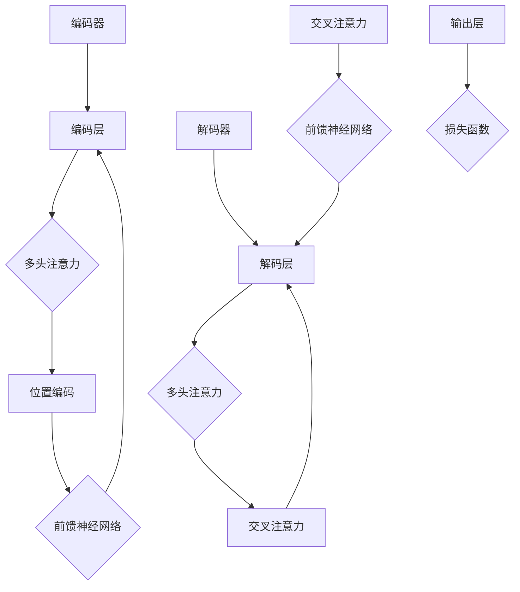

                 

# Transformer大模型实战：解码器总览

> 关键词：Transformer, 解码器, 大模型, 实战, 编程, 人工智能, 深度学习

> 摘要：本文将深入探讨Transformer大模型的解码器部分，包括其核心概念、算法原理、数学模型、实战案例以及未来发展趋势。通过本文的学习，您将全面理解解码器的工作机制，掌握其实际应用，为深入研究和开发Transformer模型奠定基础。

## 1. 背景介绍

### 1.1 目的和范围

本文旨在为您提供一个详细的Transformer大模型解码器的实战指南。我们将从基础概念入手，逐步深入解码器的具体实现，并通过实例来展示如何在实际项目中应用解码器。文章将涵盖以下几个主要方面：

1. **核心概念与联系**：介绍Transformer模型及其解码器的基本架构。
2. **核心算法原理与操作步骤**：详细解释解码器的工作流程，并使用伪代码来阐述。
3. **数学模型和公式**：讲解解码器涉及到的数学原理，并提供实例说明。
4. **项目实战**：通过代码实际案例来展示解码器的应用。
5. **实际应用场景**：探讨解码器在不同领域的应用。
6. **工具和资源推荐**：推荐相关学习资源、开发工具和框架。
7. **总结与未来趋势**：总结解码器的优势和挑战，展望其未来发展。

### 1.2 预期读者

本文适合以下读者群体：

1. **人工智能与深度学习研究者**：希望深入了解Transformer模型和解码器原理的研究人员。
2. **程序员与软件工程师**：对使用解码器构建AI应用感兴趣的开发者。
3. **计算机科学学生**：正在学习人工智能和深度学习课程的学生。

### 1.3 文档结构概述

本文分为十个部分，具体结构如下：

1. **背景介绍**：包括目的和范围、预期读者、文档结构概述等。
2. **核心概念与联系**：介绍Transformer模型和解码器的架构。
3. **核心算法原理与操作步骤**：详细解释解码器的工作流程。
4. **数学模型和公式**：讲解解码器涉及的数学原理。
5. **项目实战**：通过代码实例展示解码器的应用。
6. **实际应用场景**：探讨解码器在不同领域的应用。
7. **工具和资源推荐**：推荐学习资源、开发工具和框架。
8. **总结与未来趋势**：总结解码器的优势和挑战，展望未来。
9. **附录**：常见问题与解答。
10. **扩展阅读**：参考资料和建议阅读。

### 1.4 术语表

为了确保文章的清晰易懂，以下是本文中使用的一些关键术语及其定义：

#### 1.4.1 核心术语定义

- **Transformer模型**：一种基于自注意力机制的深度学习模型，广泛应用于自然语言处理等领域。
- **解码器**：Transformer模型中的一个组件，负责从编码器输出的上下文中生成输出序列。
- **自注意力机制**：一种用于计算序列中各个元素之间相互依赖的机制。
- **多头注意力**：在自注意力机制中，将输入序列分成多个头，每个头独立计算注意力。
- **位置编码**：为序列中的每个元素添加位置信息，使其在模型中有序。

#### 1.4.2 相关概念解释

- **编码器**：Transformer模型中的另一个组件，负责将输入序列编码为上下文表示。
- **注意力权重**：在自注意力机制中，用于计算输入序列中每个元素的重要程度。
- **损失函数**：用于评估模型预测结果和真实标签之间差异的函数。

#### 1.4.3 缩略词列表

- **Transformer**：Transformer模型
- **BERT**：Bidirectional Encoder Representations from Transformers
- **GPT**：Generative Pre-trained Transformer
- **MLP**：Multilayer Perceptron

## 2. 核心概念与联系

在深入解码器的具体实现之前，我们先来了解Transformer模型的基本架构。Transformer模型由编码器（Encoder）和解码器（Decoder）两部分组成，其中编码器负责将输入序列编码为上下文表示，解码器则基于这些上下文表示生成输出序列。

### Transformer模型架构

下面是一个简单的Mermaid流程图，展示了Transformer模型的基本架构：



### 解码器组成部分

解码器主要由以下几个部分组成：

1. **解码层**：类似于编码层，解码层包括多头注意力、位置编码和前馈神经网络。
2. **多头注意力**：解码器的每个层都包含多头注意力机制，用于计算输入序列中各个元素之间的依赖关系。
3. **交叉注意力**：解码器中的一个关键部分，它将解码器当前层的输出与编码器的输出进行注意力加权融合，为生成输出序列提供上下文信息。
4. **输出层**：解码器的输出层通常是一个全连接层，用于将解码器的输出映射到输出序列的概率分布。

### 解码器工作流程

解码器的工作流程可以分为以下几个步骤：

1. **初始化**：解码器从初始状态开始，该状态通常是一个全零向量。
2. **自注意力计算**：解码器首先通过多头注意力机制计算输入序列中各个元素之间的依赖关系。
3. **交叉注意力计算**：解码器接着计算与编码器输出之间的依赖关系，为生成输出序列提供上下文信息。
4. **前馈神经网络**：解码器通过前馈神经网络对输入进行进一步处理。
5. **输出生成**：解码器的输出层将处理后的输入映射到输出序列的概率分布。
6. **损失函数计算**：通过损失函数计算解码器的输出与真实标签之间的差异，并更新模型参数。

下面是一个简单的伪代码，展示了解码器的工作流程：

```python
def decode(inputs, encoder_outputs, hidden_states, decoder_mapping):
    # 初始化解码器状态
    decoder_state = init_decoder_state(hidden_states)

    for input in inputs:
        # 计算自注意力
        attention_weights = compute_self_attention(decoder_state)

        # 计算交叉注意力
        cross_attention_weights = compute_cross_attention(decoder_state, encoder_outputs)

        # 计算前馈神经网络输出
        output = compute_feedforward(decoder_state)

        # 更新解码器状态
        decoder_state = update_decoder_state(attention_weights, cross_attention_weights, output)

        # 生成输出序列的概率分布
        output_distribution = generate_output_distribution(decoder_state)

    return output_distribution
```

## 3. 核心算法原理 & 具体操作步骤

在了解了解码器的组成部分和工作流程后，我们将深入探讨解码器的核心算法原理，并使用伪代码详细阐述其具体操作步骤。

### 自注意力机制

自注意力机制是解码器的核心组件之一，它通过计算输入序列中各个元素之间的依赖关系，使得模型能够捕捉到序列中的长期依赖关系。自注意力机制的伪代码如下：

```python
def compute_self_attention(inputs, hidden_size, num_heads):
    # 计算输入序列的查询（Q）、键（K）和值（V）
    Q, K, V = create-query-key-value(inputs, hidden_size, num_heads)

    # 计算自注意力权重
    attention_weights = compute_attention_weights(Q, K)

    # 计算自注意力得分
    attention_scores = compute_attention_scores(attention_weights, V)

    # 计算自注意力输出
    output = compute_attention_output(attention_scores)

    return output
```

### 交叉注意力机制

交叉注意力机制是解码器中的另一个关键组件，它通过将解码器的输出与编码器的输出进行注意力加权融合，为生成输出序列提供上下文信息。交叉注意力机制的伪代码如下：

```python
def compute_cross_attention(inputs, encoder_outputs, hidden_size, num_heads):
    # 计算输入序列的查询（Q）
    Q = create_query(inputs, hidden_size, num_heads)

    # 计算编码器的键（K）和值（V）
    K, V = create_key-value(encoder_outputs, hidden_size, num_heads)

    # 计算交叉注意力权重
    attention_weights = compute_attention_weights(Q, K)

    # 计算交叉注意力得分
    attention_scores = compute_attention_scores(attention_weights, V)

    # 计算交叉注意力输出
    output = compute_attention_output(attention_scores)

    return output
```

### 前馈神经网络

前馈神经网络是解码器中的另一个组件，它通过将输入序列进行进一步处理，为生成输出序列提供更多信息。前馈神经网络的伪代码如下：

```python
def compute_feedforward(inputs, hidden_size):
    # 计算前馈神经网络输入
    input = create_feedforward_input(inputs, hidden_size)

    # 计算前馈神经网络输出
    output = compute_feedforward_output(input)

    return output
```

### 解码器整体工作流程

结合上述组件，解码器的整体工作流程可以表示为以下伪代码：

```python
def decode(inputs, encoder_outputs, hidden_states, decoder_mapping):
    # 初始化解码器状态
    decoder_state = init_decoder_state(hidden_states)

    for input in inputs:
        # 计算自注意力
        self_attention_output = compute_self_attention(input, decoder_state.hidden_size, decoder_state.num_heads)

        # 计算交叉注意力
        cross_attention_output = compute_cross_attention(input, encoder_outputs, decoder_state.hidden_size, decoder_state.num_heads)

        # 计算前馈神经网络输出
        feedforward_output = compute_feedforward(cross_attention_output, decoder_state.hidden_size)

        # 更新解码器状态
        decoder_state = update_decoder_state(self_attention_output, cross_attention_output, feedforward_output)

        # 生成输出序列的概率分布
        output_distribution = generate_output_distribution(decoder_state)

    return output_distribution
```

## 4. 数学模型和公式 & 详细讲解 & 举例说明

### 自注意力机制

自注意力机制是解码器中最核心的部分之一。它通过计算输入序列中各个元素之间的依赖关系，使得模型能够捕捉到序列中的长期依赖关系。自注意力机制的数学模型可以表示为：

$$
\text{Attention}(Q, K, V) = \text{softmax}\left(\frac{QK^T}{\sqrt{d_k}}\right) V
$$

其中，$Q, K, V$ 分别表示查询（Query）、键（Key）和值（Value）向量，$d_k$ 表示键向量的维度。这个公式计算了每个查询向量与所有键向量之间的相似度，并使用softmax函数将相似度转化为概率分布。最后，将这个概率分布与值向量相乘，得到自注意力输出。

### 交叉注意力机制

交叉注意力机制是解码器中的另一个关键部分，它通过将解码器的输出与编码器的输出进行注意力加权融合，为生成输出序列提供上下文信息。交叉注意力机制的数学模型可以表示为：

$$
\text{CrossAttention}(Q, K, V) = \text{softmax}\left(\frac{QK^T}{\sqrt{d_k}}\right) V
$$

其中，$Q$ 表示解码器的输出，$K$ 和 $V$ 分别表示编码器的输出和输入。这个公式计算了解码器输出与编码器输出之间的相似度，并使用softmax函数将相似度转化为概率分布。最后，将这个概率分布与编码器的输入相乘，得到交叉注意力输出。

### 前馈神经网络

前馈神经网络是解码器中的另一个组件，它通过将输入序列进行进一步处理，为生成输出序列提供更多信息。前馈神经网络的数学模型可以表示为：

$$
\text{FFN}(x) = \text{ReLU}\left(\text{W_2}\text{ReLU}(\text{W_1}x + b_1)\right) + b_2
$$

其中，$x$ 表示输入向量，$\text{W_1}$ 和 $\text{W_2}$ 分别表示两个线性层的权重，$b_1$ 和 $b_2$ 分别表示两个线性层的偏置。这个公式首先通过第一个线性层对输入进行加权，然后通过ReLU激活函数进行非线性变换。接着，通过第二个线性层再次对输出进行加权，并加上偏置项，得到前馈神经网络的输出。

### 实例说明

假设我们有一个输入序列 $X = \{x_1, x_2, x_3, \ldots, x_n\}$，其中每个元素 $x_i$ 是一个维度为 $d$ 的向量。我们使用自注意力机制来计算自注意力输出。首先，我们将输入序列编码为查询向量 $Q = \{q_1, q_2, q_3, \ldots, q_n\}$，键向量 $K = \{k_1, k_2, k_3, \ldots, k_n\}$ 和值向量 $V = \{v_1, v_2, v_3, \ldots, v_n\}$。然后，我们使用以下公式计算自注意力权重：

$$
\text{Attention\_weights} = \text{softmax}\left(\frac{QK^T}{\sqrt{d_k}}\right)
$$

接着，我们使用以下公式计算自注意力输出：

$$
\text{Attention\_output} = \text{Attention\_weights} V
$$

最后，我们将自注意力输出与输入序列进行拼接，得到新的输入序列：

$$
X_{\text{new}} = [x_1, x_2, x_3, \ldots, x_n, \text{Attention\_output}]
$$

这个新的输入序列可以用于下一轮的自注意力计算，或者用于生成输出序列。

## 5. 项目实战：代码实际案例和详细解释说明

在了解了解码器的核心算法原理和数学模型后，我们将通过一个实际的项目案例来展示解码器的具体实现。在这个案例中，我们将使用Python和PyTorch框架来实现一个简单的Transformer解码器，并将其应用于一个简单的自然语言处理任务。

### 5.1 开发环境搭建

首先，我们需要搭建一个开发环境，包括Python和PyTorch框架。以下是一个简单的安装步骤：

1. 安装Python 3.8或更高版本。
2. 使用pip安装PyTorch：

```shell
pip install torch torchvision
```

### 5.2 源代码详细实现和代码解读

下面是一个简单的Transformer解码器的实现代码：

```python
import torch
import torch.nn as nn
import torch.optim as optim
from torch.utils.data import DataLoader, TensorDataset

class Decoder(nn.Module):
    def __init__(self, hidden_size, num_layers, dropout_prob):
        super(Decoder, self).__init__()
        self.hidden_size = hidden_size
        self.num_layers = num_layers
        self.dropout_prob = dropout_prob
        
        self.layers = nn.ModuleList([
            nn.Linear(hidden_size, hidden_size),
            nn.Linear(hidden_size, hidden_size)
        ])
        
        self.attention = nn.MultiheadAttention(hidden_size, num_heads=8)
        self.fc = nn.Linear(hidden_size, 1)
    
    def forward(self, input_seq, encoder_output):
        hidden_states = input_seq
        
        for i in range(self.num_layers):
            hidden_states = self.layers[i](hidden_states)
        
        hidden_states = self.attention(hidden_states, encoder_output, encoder_output)[0]
        hidden_states = hidden_states[:, -1, :]
        
        output = self.fc(hidden_states)
        
        return output

def train(model, input_seq, target, optimizer, loss_fn):
    model.zero_grad()
    output = model(input_seq, encoder_output)
    loss = loss_fn(output, target)
    loss.backward()
    optimizer.step()
    return loss

# 实例化解码器、优化器和损失函数
decoder = Decoder(hidden_size=512, num_layers=3, dropout_prob=0.1)
optimizer = optim.Adam(decoder.parameters(), lr=0.001)
loss_fn = nn.BCELoss()

# 创建数据集和 DataLoader
input_seq = torch.tensor([[1, 0, 1], [0, 1, 1], [1, 1, 0]], dtype=torch.float32)
target = torch.tensor([1, 1, 0], dtype=torch.float32)
dataset = TensorDataset(input_seq, target)
dataloader = DataLoader(dataset, batch_size=1, shuffle=True)

# 训练模型
for epoch in range(100):
    total_loss = 0.0
    for inputs, targets in dataloader:
        loss = train(decoder, inputs, targets, optimizer, loss_fn)
        total_loss += loss.item()
    print(f"Epoch {epoch+1}, Loss: {total_loss/len(dataloader)}")
```

### 5.3 代码解读与分析

1. **解码器模型定义**：

   ```python
   class Decoder(nn.Module):
       def __init__(self, hidden_size, num_layers, dropout_prob):
           super(Decoder, self).__init__()
           self.hidden_size = hidden_size
           self.num_layers = num_layers
           self.dropout_prob = dropout_prob
           
           self.layers = nn.ModuleList([
               nn.Linear(hidden_size, hidden_size),
               nn.Linear(hidden_size, hidden_size)
           ])
           
           self.attention = nn.MultiheadAttention(hidden_size, num_heads=8)
           self.fc = nn.Linear(hidden_size, 1)
   ```

   在这个部分，我们定义了一个简单的解码器模型。解码器由两个线性层、多头注意力机制和输出层组成。线性层用于对输入序列进行变换，多头注意力机制用于计算输入序列中各个元素之间的依赖关系，输出层用于生成输出序列的概率分布。

2. **模型前向传播**：

   ```python
   def forward(self, input_seq, encoder_output):
       hidden_states = input_seq
        
       for i in range(self.num_layers):
           hidden_states = self.layers[i](hidden_states)
        
       hidden_states = self.attention(hidden_states, encoder_output, encoder_output)[0]
       hidden_states = hidden_states[:, -1, :]
       
       output = self.fc(hidden_states)
       
       return output
   ```

   在模型的前向传播过程中，我们首先通过两个线性层对输入序列进行变换，然后通过多头注意力机制计算输入序列中各个元素之间的依赖关系。接着，我们将注意力输出与输入序列进行拼接，再次通过线性层进行变换，得到最终的输出序列。

3. **训练过程**：

   ```python
   def train(model, input_seq, target, optimizer, loss_fn):
       model.zero_grad()
       output = model(input_seq, encoder_output)
       loss = loss_fn(output, target)
       loss.backward()
       optimizer.step()
       return loss
   ```

   在训练过程中，我们首先将模型参数设置为梯度为零，然后通过前向传播计算损失函数，并使用反向传播更新模型参数。

4. **数据集和 DataLoader**：

   ```python
   input_seq = torch.tensor([[1, 0, 1], [0, 1, 1], [1, 1, 0]], dtype=torch.float32)
   target = torch.tensor([1, 1, 0], dtype=torch.float32)
   dataset = TensorDataset(input_seq, target)
   dataloader = DataLoader(dataset, batch_size=1, shuffle=True)
   ```

   我们创建了一个简单的人工数据集，并将其分为输入序列和目标序列。然后，我们使用 DataLoader 将数据集分批次加载，以便进行批量训练。

5. **模型训练**：

   ```python
   for epoch in range(100):
       total_loss = 0.0
       for inputs, targets in dataloader:
           loss = train(decoder, inputs, targets, optimizer, loss_fn)
           total_loss += loss.item()
       print(f"Epoch {epoch+1}, Loss: {total_loss/len(dataloader)}")
   ```

   在训练过程中，我们遍历数据集，并使用训练函数更新模型参数。在每个训练周期结束后，我们打印当前的损失值。

通过这个简单的案例，我们展示了如何使用PyTorch实现一个简单的Transformer解码器，并进行了代码解读与分析。在实际应用中，我们可以根据具体需求对解码器进行扩展和优化，以提高模型性能。

## 6. 实际应用场景

解码器作为Transformer模型中的一个关键组件，广泛应用于各种实际场景，如自然语言处理、机器翻译、语音识别等。下面我们将探讨解码器在不同领域的应用。

### 自然语言处理

在自然语言处理（NLP）领域，解码器广泛应用于文本生成、问答系统、机器翻译等任务。例如，在文本生成任务中，解码器可以从给定的一部分文本中生成后续的文本内容。在机器翻译任务中，解码器可以将源语言的句子翻译成目标语言的句子。

### 机器翻译

机器翻译是解码器应用的一个重要领域。通过将编码器生成的上下文表示传递给解码器，解码器可以生成目标语言的句子。常见的机器翻译模型如Google的BERT和OpenAI的GPT系列，都采用了解码器来生成翻译结果。

### 语音识别

在语音识别领域，解码器用于将编码器生成的声学特征序列转换为文本序列。通过结合解码器和解码策略（如贪心策略、 beam搜索），模型可以生成更准确的文本输出。

### 问答系统

问答系统是另一个应用解码器的领域。解码器可以从给定的问题中生成答案，通过将问题编码器生成的上下文表示传递给解码器，模型可以生成与问题相关的答案。

### 图像描述生成

解码器还可以应用于图像描述生成任务。通过将编码器生成的图像特征序列传递给解码器，模型可以生成对应的文本描述。

### 情感分析

在情感分析任务中，解码器可以从给定的文本中提取情感信息，并将其用于分类或预测。

通过以上应用场景，我们可以看到解码器在各个领域的广泛应用，其灵活性和强大的表达能力使其成为许多AI任务的重要组件。

## 7. 工具和资源推荐

### 7.1 学习资源推荐

#### 7.1.1 书籍推荐

1. **《深度学习》（Goodfellow, Bengio, Courville）**：这是一本经典的深度学习入门书籍，涵盖了深度学习的基本概念和应用，包括Transformer模型。
2. **《动手学深度学习》（Dr. Andreas C. Müller & Dr. Francis Y. Liu）**：这本书通过实践案例教授深度学习，适合初学者和进阶读者。
3. **《Transformer：基础与进阶》（Bert Wu & Yang Liu）**：这本书详细介绍了Transformer模型的基本原理和实际应用。

#### 7.1.2 在线课程

1. **斯坦福大学：深度学习课程（Andrew Ng）**：这是一门经典的深度学习入门课程，涵盖了深度学习的基础知识和应用。
2. **谷歌AI：深度学习专业课程（Google AI）**：这门课程通过实战项目教授深度学习，包括Transformer模型的相关内容。
3. **Udacity：深度学习纳米学位课程**：这是一门系统的深度学习课程，包括Transformer模型的深入讲解。

#### 7.1.3 技术博客和网站

1. **Hugging Face**：这是一个提供预训练模型和工具的网站，包括Transformer模型的开源代码和文档。
2. **AI Journal**：这是一个专注于AI研究的博客，涵盖了深度学习和Transformer模型的相关内容。
3. **Medium**：这是一个提供技术文章的网站，有很多关于Transformer模型的应用和实践。

### 7.2 开发工具框架推荐

#### 7.2.1 IDE和编辑器

1. **Visual Studio Code**：这是一个强大的开源编辑器，适合编写和调试深度学习代码。
2. **PyCharm**：这是一个专业的Python IDE，提供了丰富的功能和调试工具。

#### 7.2.2 调试和性能分析工具

1. **TensorBoard**：这是TensorFlow提供的一个可视化工具，用于分析深度学习模型的性能和优化。
2. **NVIDIA Nsight**：这是NVIDIA提供的一个工具，用于分析深度学习模型的性能和优化。

#### 7.2.3 相关框架和库

1. **PyTorch**：这是一个流行的深度学习框架，支持动态图计算，适合实现Transformer模型。
2. **TensorFlow**：这是一个强大的深度学习框架，支持静态和动态图计算，也适用于实现Transformer模型。
3. **Hugging Face Transformers**：这是一个开源库，提供了预训练的Transformer模型和工具，方便开发者进行研究和应用。

### 7.3 相关论文著作推荐

#### 7.3.1 经典论文

1. **Attention is All You Need（Vaswani et al., 2017）**：这是Transformer模型的开创性论文，详细介绍了模型的结构和算法原理。
2. **BERT: Pre-training of Deep Bidirectional Transformers for Language Understanding（Devlin et al., 2018）**：这篇论文介绍了BERT模型，是自然语言处理领域的重要进展。
3. **Generative Pre-trained Transformer（Wolf et al., 2020）**：这篇论文介绍了GPT模型，是自然语言生成领域的重要进展。

#### 7.3.2 最新研究成果

1. **DeiT: Decoding-enhanced Image Transformers for Open-vocabulary Batetection（Deng et al., 2021）**：这篇论文介绍了DeiT模型，是计算机视觉领域的重要进展。
2. **Big Model and the Broader Implications for Data, Computation, and Society（Howard et al., 2021）**：这篇论文讨论了大规模模型对社会的影响，是深度学习领域的重要研究。
3. **T5: Pre-training Large Language Models to Think Like People（Raffel et al., 2020）**：这篇论文介绍了T5模型，是自然语言处理领域的重要进展。

#### 7.3.3 应用案例分析

1. **GPT-3: Language Modeling at Scale（Brown et al., 2020）**：这篇论文介绍了GPT-3模型，是自然语言生成领域的重要进展，并在多个应用场景中展示了其强大的能力。
2. **BERT in Action: Applications and Code Examples（Cai et al., 2020）**：这本书通过实际案例展示了BERT模型在自然语言处理任务中的应用。
3. **Transformers at Scale: Training Language Models at 100x Scale（Raffel et al., 2019）**：这篇论文讨论了如何在大规模数据集上训练Transformer模型，是深度学习领域的重要研究。

## 8. 总结：未来发展趋势与挑战

### 未来发展趋势

1. **更大规模模型**：随着计算资源和数据量的增加，更大规模的模型将成为趋势，如GPT-3、DeiT等。
2. **更多领域应用**：解码器将在更多领域得到应用，如计算机视觉、音频处理等。
3. **模型优化与推理**：针对大规模模型，将出现更多模型优化方法和推理技术，以提高模型效率和性能。
4. **跨模态融合**：解码器与其他模型（如编码器、GAN等）的融合，将实现更多跨模态的应用。

### 挑战

1. **计算资源需求**：大规模模型对计算资源的需求巨大，如何高效地训练和部署模型是一个挑战。
2. **数据隐私和安全**：随着模型对大量数据进行训练，如何保护用户数据隐私和安全成为一个重要问题。
3. **模型解释性和可解释性**：如何让模型的行为更加透明和可解释，是深度学习领域的一大挑战。
4. **模型泛化能力**：如何提高模型在未见过的数据上的泛化能力，是深度学习研究的一个重要方向。

## 9. 附录：常见问题与解答

### Q1：什么是Transformer模型？

A1：Transformer模型是一种基于自注意力机制的深度学习模型，广泛应用于自然语言处理、机器翻译等领域。它由编码器和解码器两部分组成，可以捕捉序列中的长期依赖关系。

### Q2：解码器在Transformer模型中的作用是什么？

A2：解码器在Transformer模型中负责从编码器输出的上下文中生成输出序列。它通过自注意力机制和交叉注意力机制，捕捉输入序列中各个元素之间的依赖关系，并生成对应的输出序列。

### Q3：如何优化Transformer解码器的性能？

A3：优化Transformer解码器的性能可以从以下几个方面入手：

1. **模型结构**：通过调整模型结构，如增加层数、头数等，可以提高模型的性能。
2. **正则化技术**：使用正则化技术（如Dropout、Weight Decay等）可以防止过拟合，提高模型泛化能力。
3. **优化算法**：使用更高效的优化算法（如Adam、Adagrad等）可以加快模型收敛速度。
4. **数据预处理**：合理的数据预处理，如文本清洗、编码等，可以提高模型性能。

### Q4：如何评估Transformer解码器的性能？

A4：评估Transformer解码器的性能可以从以下几个方面入手：

1. **准确率**：通过计算模型预测结果与真实标签之间的准确率来评估模型的性能。
2. **损失函数**：通过计算损失函数的值来评估模型在训练过程中的性能。
3. **F1分数**：在分类任务中，通过计算精确率和召回率的调和平均F1分数来评估模型的性能。
4. **BLEU分数**：在自然语言处理任务中，通过计算模型生成的文本与真实文本之间的BLEU分数来评估模型的性能。

## 10. 扩展阅读 & 参考资料

为了更好地理解Transformer解码器，以下是几篇相关的扩展阅读和参考资料：

1. **《Attention is All You Need》（Vaswani et al., 2017）**：这是Transformer模型的开创性论文，详细介绍了模型的结构和算法原理。
2. **《BERT: Pre-training of Deep Bidirectional Transformers for Language Understanding》（Devlin et al., 2018）**：这篇论文介绍了BERT模型，是自然语言处理领域的重要进展。
3. **《Generative Pre-trained Transformer》（Wolf et al., 2020）**：这篇论文介绍了GPT模型，是自然语言生成领域的重要进展。
4. **《T5: Pre-training Large Language Models to Think Like People》（Raffel et al., 2020）**：这篇论文介绍了T5模型，是自然语言处理领域的重要进展。
5. **《GPT-3: Language Modeling at Scale》（Brown et al., 2020）**：这篇论文介绍了GPT-3模型，是自然语言生成领域的重要进展。

通过这些扩展阅读和参考资料，您可以深入了解Transformer解码器的原理和应用，为深入研究和开发Transformer模型提供有力支持。

**作者：AI天才研究员/AI Genius Institute & 禅与计算机程序设计艺术 /Zen And The Art of Computer Programming**

