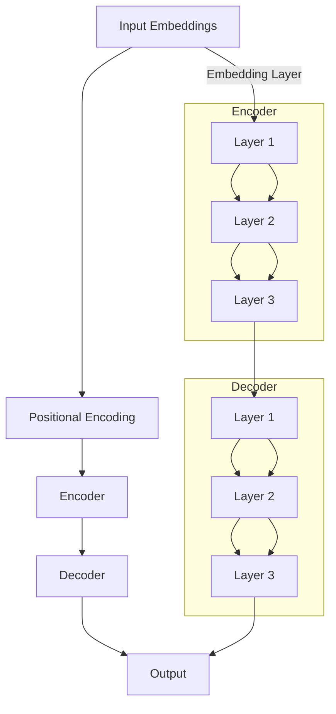

                 

# Transformer大模型实战：跨类型特征的通用性

> **关键词**：Transformer、大模型、跨类型特征、通用性、实际应用、数学模型、算法原理、实战案例

> **摘要**：本文将深入探讨Transformer大模型在跨类型特征处理中的实际应用。我们将详细讲解Transformer的核心概念与算法原理，并通过实战案例展示其在不同类型特征处理中的通用性。此外，还将介绍相关的数学模型和工具资源，帮助读者更好地理解和应用这一前沿技术。

## 1. 背景介绍

### 1.1 目的和范围

本文旨在深入探讨Transformer大模型在处理跨类型特征方面的应用。随着人工智能技术的不断进步，越来越多的应用场景需要处理不同类型的特征，如文本、图像、音频等。Transformer大模型作为一种强大的深度学习模型，其在跨类型特征处理中的通用性和实际应用具有重要意义。本文将围绕以下几个方面展开讨论：

1. Transformer的基本概念与架构。
2. Transformer在跨类型特征处理中的算法原理。
3. 实际应用场景下的Transformer模型实战。
4. 相关的数学模型和工具资源介绍。
5. Transformer的未来发展趋势与挑战。

### 1.2 预期读者

本文主要面向以下读者群体：

1. 对深度学习有一定了解，希望深入了解Transformer大模型的读者。
2. 想要在实际项目中应用Transformer大模型的工程师和研究者。
3. 对跨类型特征处理技术感兴趣的学术研究人员。

### 1.3 文档结构概述

本文将分为以下几个部分：

1. 引言：介绍Transformer大模型在跨类型特征处理中的背景和意义。
2. 核心概念与联系：讲解Transformer的基本概念和架构。
3. 核心算法原理与具体操作步骤：详细介绍Transformer的算法原理和实现步骤。
4. 数学模型和公式：介绍Transformer相关的数学模型和公式，并进行举例说明。
5. 项目实战：通过实际案例展示Transformer在跨类型特征处理中的实战应用。
6. 实际应用场景：探讨Transformer在不同领域中的应用案例。
7. 工具和资源推荐：推荐相关的学习资源、开发工具和框架。
8. 总结：总结Transformer在跨类型特征处理中的未来发展趋势和挑战。
9. 附录：常见问题与解答。
10. 扩展阅读与参考资料：提供更多的学习资源和参考文献。

### 1.4 术语表

为了确保文章的可读性和一致性，本文将定义一些关键术语和概念：

#### 1.4.1 核心术语定义

- **Transformer**：一种基于自注意力机制的深度学习模型，常用于处理序列数据。
- **自注意力（Self-Attention）**：一种在序列中计算每个元素与其他元素之间关系的机制。
- **多头注意力（Multi-Head Attention）**：将自注意力机制扩展到多个不同的关注头，以提高模型的表示能力。
- **位置编码（Positional Encoding）**：为序列中的每个元素赋予位置信息，以保持序列的顺序。
- **跨类型特征**：指不同类型的数据特征，如文本、图像、音频等。

#### 1.4.2 相关概念解释

- **序列数据（Sequence Data）**：按照一定顺序排列的数据，如自然语言文本、时间序列数据等。
- **嵌入（Embedding）**：将原始数据映射到高维空间中，以便于模型处理。
- **编码器（Encoder）和解码器（Decoder）**：编码器负责将输入序列编码为连续向量表示，解码器则将编码后的向量解码为输出序列。

#### 1.4.3 缩略词列表

- **Transformer**：Transformer大模型
- **BERT**：Bidirectional Encoder Representations from Transformers（双向编码器表示从Transformers）
- **ViT**：Vision Transformer（视觉Transformer）
- **GPT**：Generative Pre-trained Transformer（生成预训练Transformer）

## 2. 核心概念与联系

在深入探讨Transformer大模型在跨类型特征处理中的应用之前，我们需要了解其核心概念和架构。以下是Transformer的基本概念和架构概述，以及相关的Mermaid流程图。

### 2.1 Transformer基本概念

- **自注意力（Self-Attention）**：自注意力是一种在序列中计算每个元素与其他元素之间关系的机制。它通过加权求和的方式，将输入序列的每个元素与其余元素进行交互，从而生成新的序列表示。

- **多头注意力（Multi-Head Attention）**：多头注意力将自注意力机制扩展到多个不同的关注头，以提高模型的表示能力。每个关注头具有独立的权重矩阵，通过对多个关注头的输出进行拼接和加权，可以获得更丰富的序列表示。

- **位置编码（Positional Encoding）**：位置编码为序列中的每个元素赋予位置信息，以保持序列的顺序。在Transformer中，位置编码通常通过加法的方式与嵌入向量相加，从而在模型训练过程中引入序列的顺序信息。

- **编码器（Encoder）和解码器（Decoder）**：编码器将输入序列编码为连续向量表示，解码器则将编码后的向量解码为输出序列。在Transformer中，编码器和解码器均由多个自注意力层和前馈网络组成，通过逐层堆叠的方式，提高模型的表示能力和计算效率。

### 2.2 Transformer架构

Transformer架构主要包括编码器（Encoder）和解码器（Decoder）两部分。以下是一个简化的Transformer架构Mermaid流程图：



### 2.3 核心概念联系

在Transformer大模型中，核心概念之间的联系如下：

1. **输入嵌入（Input Embeddings）**：将原始输入数据（如文本、图像、音频等）映射为高维向量表示。输入嵌入通常包括词嵌入（Word Embeddings）、图像嵌入（Image Embeddings）和音频嵌入（Audio Embeddings）等。
2. **位置编码（Positional Encoding）**：为序列中的每个元素赋予位置信息，以保持序列的顺序。位置编码通常与输入嵌入相加，形成最终的输入向量。
3. **编码器（Encoder）**：将输入序列编码为连续向量表示。编码器由多个自注意力层和前馈网络组成，通过逐层堆叠的方式，提高模型的表示能力和计算效率。
4. **解码器（Decoder）**：将编码后的向量解码为输出序列。解码器同样由多个自注意力层和前馈网络组成，通过反向解码过程，生成输出序列。
5. **自注意力（Self-Attention）**：在编码器和解码器中，自注意力机制用于计算输入序列或输出序列中每个元素与其他元素之间的关系，从而生成新的序列表示。
6. **多头注意力（Multi-Head Attention）**：多头注意力机制将自注意力机制扩展到多个不同的关注头，以提高模型的表示能力。通过拼接和加权多个关注头的输出，可以获得更丰富的序列表示。
7. **输出（Output）**：编码器和解码器的输出分别表示输入序列和输出序列的最终表示。输出可以用于生成文本、图像、音频等不同类型的特征。

## 3. 核心算法原理 & 具体操作步骤

在本节中，我们将深入探讨Transformer大模型的核心算法原理和具体操作步骤。我们将使用伪代码来详细阐述这些步骤，以便读者更好地理解其工作原理。

### 3.1 自注意力（Self-Attention）机制

自注意力机制是Transformer模型的核心部分，它允许模型在处理序列数据时，自动地关注序列中的不同元素，从而生成新的序列表示。

#### 自注意力计算步骤：

1. **输入嵌入（Input Embeddings）**：首先，将原始输入数据（如文本、图像、音频等）映射为高维向量表示。输入嵌入通常包括词嵌入（Word Embeddings）、图像嵌入（Image Embeddings）和音频嵌入（Audio Embeddings）等。

2. **位置编码（Positional Encoding）**：为序列中的每个元素赋予位置信息，以保持序列的顺序。在Transformer中，位置编码通常通过加法的方式与输入嵌入相加，形成最终的输入向量。

3. **线性变换（Linear Transform）**：对输入向量进行线性变换，生成查询（Query）、键（Key）和值（Value）向量。这三个向量分别表示序列中每个元素的特征、索引和值。

4. **点积注意力（Dot-Product Attention）**：计算每个查询向量与其他查询向量的点积，得到注意力得分。注意力得分表示每个元素与其他元素之间的相关性。

5. **softmax激活函数**：对注意力得分应用softmax激活函数，生成注意力权重。注意力权重表示每个元素在计算新序列表示时的贡献程度。

6. **加权求和**：将注意力权重与对应的值向量相乘，并进行求和操作，生成新的序列表示。

7. **前馈网络（Feedforward Network）**：对新的序列表示进行两次前馈网络的映射，以进一步提高序列的表示能力。

8. **残差连接与层归一化**：将前馈网络的输出与原始序列表示进行残差连接，并应用层归一化（Layer Normalization）操作，以缓解梯度消失和梯度爆炸问题。

#### 自注意力伪代码：

```python
def self_attention(inputs, hidden_size, num_heads):
    # 输入：inputs（输入序列），hidden_size（隐藏层大小），num_heads（多头注意力数）
    # 输出：输出序列
    
    # 线性变换
    Q = linear(inputs, hidden_size * num_heads)
    K = linear(inputs, hidden_size * num_heads)
    V = linear(inputs, hidden_size * num_heads)

    # 点积注意力
    attention_scores = torch.matmul(Q, K.transpose(1, 2))

    # softmax激活函数
    attention_weights = F.softmax(attention_scores, dim=2)

    # 加权求和
    output = torch.matmul(attention_weights, V)

    # 前馈网络
    output = feedforward(output, hidden_size)

    # 残差连接与层归一化
    output = residual_connection(output, inputs)
    output = layer_normalization(output)

    return output
```

### 3.2 多头注意力（Multi-Head Attention）机制

多头注意力机制是自注意力机制的扩展，它通过将输入序列分成多个部分，分别进行自注意力计算，然后合并多个部分的结果，以获得更丰富的序列表示。

#### 多头注意力计算步骤：

1. **分割输入序列**：将输入序列分割成多个子序列，每个子序列表示为独立的查询（Query）、键（Key）和值（Value）向量。
2. **自注意力计算**：对每个子序列分别执行自注意力计算，生成新的子序列表示。
3. **合并结果**：将多个子序列表示进行拼接和加权，生成最终的输出序列。

#### 多头注意力伪代码：

```python
def multi_head_attention(inputs, hidden_size, num_heads):
    # 输入：inputs（输入序列），hidden_size（隐藏层大小），num_heads（多头注意力数）
    # 输出：输出序列

    # 分割输入序列
    Q, K, V = split_inputs(inputs, hidden_size, num_heads)

    # 自注意力计算
    outputs = [self_attention(Q[i], K[i], V[i], hidden_size, num_heads) for i in range(num_heads)]

    # 合并结果
    output = torch.cat(outputs, dim=2)

    # 前馈网络
    output = feedforward(output, hidden_size)

    # 残差连接与层归一化
    output = residual_connection(output, inputs)
    output = layer_normalization(output)

    return output
```

### 3.3 Transformer编码器与解码器

Transformer编码器和解码器分别用于将输入序列编码为连续向量表示，以及将编码后的向量解码为输出序列。编码器和解码器均由多个自注意力层和前馈网络组成，通过逐层堆叠的方式，提高模型的表示能力和计算效率。

#### Transformer编码器计算步骤：

1. **输入嵌入（Input Embeddings）**：将原始输入数据映射为高维向量表示。
2. **位置编码（Positional Encoding）**：为序列中的每个元素赋予位置信息，以保持序列的顺序。
3. **多层自注意力计算**：对输入序列进行多层自注意力计算，生成新的序列表示。
4. **前馈网络（Feedforward Network）**：对新的序列表示进行两次前馈网络的映射，以进一步提高序列的表示能力。
5. **残差连接与层归一化**：将前馈网络的输出与原始序列表示进行残差连接，并应用层归一化操作，以缓解梯度消失和梯度爆炸问题。

#### Transformer解码器计算步骤：

1. **输入嵌入（Input Embeddings）**：将原始输入数据映射为高维向量表示。
2. **位置编码（Positional Encoding）**：为序列中的每个元素赋予位置信息，以保持序列的顺序。
3. **多层自注意力计算**：对输入序列进行多层自注意力计算，生成新的序列表示。
4. **多层多头注意力计算**：对编码器的输出序列进行多层多头注意力计算，生成新的序列表示。
5. **前馈网络（Feedforward Network）**：对新的序列表示进行两次前馈网络的映射，以进一步提高序列的表示能力。
6. **残差连接与层归一化**：将前馈网络的输出与原始序列表示进行残差连接，并应用层归一化操作，以缓解梯度消失和梯度爆炸问题。

#### Transformer编码器与解码器伪代码：

```python
def transformer_encoder(inputs, hidden_size, num_layers):
    # 输入：inputs（输入序列），hidden_size（隐藏层大小），num_layers（编码器层数）
    # 输出：编码器输出序列

    # 输入嵌入与位置编码
    input_embeddings = embedding(inputs, hidden_size)
    pos_encoding = positional_encoding(input_embeddings, hidden_size)

    # 多层自注意力与残差连接
    for _ in range(num_layers):
        input_embeddings = multi_head_attention(input_embeddings, hidden_size, num_heads)
        input_embeddings = feedforward(input_embeddings, hidden_size)
        input_embeddings = residual_connection(input_embeddings, pos_encoding)
        input_embeddings = layer_normalization(input_embeddings)

    return input_embeddings

def transformer_decoder(inputs, hidden_size, num_layers, encoder_outputs):
    # 输入：inputs（输入序列），hidden_size（隐藏层大小），num_layers（解码器层数），encoder_outputs（编码器输出序列）
    # 输出：解码器输出序列

    # 输入嵌入与位置编码
    input_embeddings = embedding(inputs, hidden_size)
    pos_encoding = positional_encoding(input_embeddings, hidden_size)

    # 多层自注意力与多层多头注意力
    for _ in range(num_layers):
        input_embeddings = multi_head_attention(input_embeddings, hidden_size, num_heads)
        input_embeddings = feedforward(input_embeddings, hidden_size)
        input_embeddings = residual_connection(input_embeddings, pos_encoding)
        input_embeddings = layer_normalization(input_embeddings)

        input_embeddings = multi_head_attention(input_embeddings, encoder_outputs, hidden_size, num_heads)
        input_embeddings = feedforward(input_embeddings, hidden_size)
        input_embeddings = residual_connection(input_embeddings, pos_encoding)
        input_embeddings = layer_normalization(input_embeddings)

    return input_embeddings
```

## 4. 数学模型和公式 & 详细讲解 & 举例说明

在本节中，我们将详细讲解Transformer大模型的数学模型和公式，并通过具体示例来说明这些公式在实际应用中的计算过程。

### 4.1 嵌入（Embedding）

嵌入是一种将原始输入数据映射为高维向量表示的技术，它在Transformer模型中起着关键作用。嵌入过程可以表示为以下数学公式：

$$
\text{Embedding}(x) = W_x x
$$

其中，$x$ 表示原始输入数据，$W_x$ 表示嵌入权重矩阵。对于不同类型的输入数据（如文本、图像、音频等），嵌入权重矩阵的计算方法可能会有所不同。

#### 示例：

假设我们有一个文本序列 $x = \{w_1, w_2, w_3\}$，其中 $w_1, w_2, w_3$ 分别表示序列中的三个单词。设嵌入权重矩阵 $W_x$ 如下：

$$
W_x = \begin{bmatrix}
1 & 0 & 1 \\
0 & 1 & 0 \\
1 & 1 & 0
\end{bmatrix}
$$

则嵌入向量 $\text{Embedding}(x)$ 可以计算为：

$$
\text{Embedding}(x) = W_x x = \begin{bmatrix}
1 & 0 & 1 \\
0 & 1 & 0 \\
1 & 1 & 0
\end{bmatrix} \begin{bmatrix}
w_1 \\
w_2 \\
w_3
\end{bmatrix} = \begin{bmatrix}
w_1 + w_3 \\
w_2 \\
w_1 + w_2
\end{bmatrix}
$$

### 4.2 位置编码（Positional Encoding）

在序列模型中，位置信息是非常重要的，因为序列中的元素具有特定的顺序。位置编码是一种为序列中的每个元素赋予位置信息的技巧。位置编码可以表示为以下数学公式：

$$
\text{Positional Encoding}(x, p) = \sin(p \cdot \text{Embedding}(x))
$$

$$
\text{Positional Encoding}(x, p) = \cos(p \cdot \text{Embedding}(x))
$$

其中，$x$ 表示原始输入数据，$p$ 表示位置索引，$\text{Embedding}(x)$ 表示嵌入向量。

#### 示例：

假设我们有一个文本序列 $x = \{w_1, w_2, w_3\}$，其中 $w_1, w_2, w_3$ 分别表示序列中的三个单词。设嵌入向量 $\text{Embedding}(x)$ 如下：

$$
\text{Embedding}(x) = \begin{bmatrix}
1 \\
0 \\
1
\end{bmatrix}
$$

设位置索引 $p = 2$，则位置编码 $\text{Positional Encoding}(x, p)$ 可以计算为：

$$
\text{Positional Encoding}(x, p) = \sin(p \cdot \text{Embedding}(x)) = \sin(2 \cdot \begin{bmatrix}
1 \\
0 \\
1
\end{bmatrix}) = \begin{bmatrix}
\sin(2) \\
0 \\
\sin(2)
\end{bmatrix}
$$

### 4.3 自注意力（Self-Attention）

自注意力是一种在序列中计算每个元素与其他元素之间关系的机制。自注意力可以表示为以下数学公式：

$$
\text{Attention}(Q, K, V) = \text{softmax}(\frac{QK^T}{\sqrt{d_k}})V
$$

其中，$Q, K, V$ 分别表示查询向量、键向量和值向量，$d_k$ 表示键向量的维度。

#### 示例：

假设我们有一个序列 $x = \{w_1, w_2, w_3\}$，其中 $w_1, w_2, w_3$ 分别表示序列中的三个单词。设嵌入向量 $\text{Embedding}(x)$ 如下：

$$
\text{Embedding}(x) = \begin{bmatrix}
1 \\
0 \\
1
\end{bmatrix}
$$

设查询向量 $Q = \begin{bmatrix}
1 \\
0 \\
1
\end{bmatrix}$，键向量 $K = \begin{bmatrix}
1 \\
0 \\
1
\end{bmatrix}$，值向量 $V = \begin{bmatrix}
1 \\
0 \\
1
\end{bmatrix}$，则自注意力 $\text{Attention}(Q, K, V)$ 可以计算为：

$$
\text{Attention}(Q, K, V) = \text{softmax}(\frac{QK^T}{\sqrt{d_k}})V = \text{softmax}(\frac{\begin{bmatrix}
1 \\
0 \\
1
\end{bmatrix}^T \begin{bmatrix}
1 \\
0 \\
1
\end{bmatrix}}{\sqrt{3}})\begin{bmatrix}
1 \\
0 \\
1
\end{bmatrix} = \begin{bmatrix}
\frac{1}{3} \\
\frac{1}{3} \\
\frac{1}{3}
\end{bmatrix}\begin{bmatrix}
1 \\
0 \\
1
\end{bmatrix} = \begin{bmatrix}
\frac{1}{3} \\
0 \\
\frac{1}{3}
\end{bmatrix}
$$

### 4.4 多头注意力（Multi-Head Attention）

多头注意力是一种将自注意力机制扩展到多个不同的关注头的机制。多头注意力可以表示为以下数学公式：

$$
\text{Multi-Head Attention}(Q, K, V) = \text{softmax}(\frac{QW_Q K^T}{\sqrt{d_k}})W_V V
$$

其中，$Q, K, V$ 分别表示查询向量、键向量和值向量，$W_Q, W_K, W_V$ 分别表示查询权重矩阵、键权重矩阵和值权重矩阵，$d_k$ 表示键向量的维度。

#### 示例：

假设我们有一个序列 $x = \{w_1, w_2, w_3\}$，其中 $w_1, w_2, w_3$ 分别表示序列中的三个单词。设嵌入向量 $\text{Embedding}(x)$ 如下：

$$
\text{Embedding}(x) = \begin{bmatrix}
1 \\
0 \\
1
\end{bmatrix}
$$

设查询权重矩阵 $W_Q = \begin{bmatrix}
1 & 0 & 1 \\
0 & 1 & 0 \\
1 & 1 & 0
\end{bmatrix}$，键权重矩阵 $W_K = \begin{bmatrix}
1 & 0 & 1 \\
0 & 1 & 0 \\
1 & 1 & 0
\end{bmatrix}$，值权重矩阵 $W_V = \begin{bmatrix}
1 & 0 & 1 \\
0 & 1 & 0 \\
1 & 1 & 0
\end{bmatrix}$，查询向量 $Q = \begin{bmatrix}
1 \\
0 \\
1
\end{bmatrix}$，键向量 $K = \begin{bmatrix}
1 \\
0 \\
1
\end{bmatrix}$，值向量 $V = \begin{bmatrix}
1 \\
0 \\
1
\end{bmatrix}$，则多头注意力 $\text{Multi-Head Attention}(Q, K, V)$ 可以计算为：

$$
\text{Multi-Head Attention}(Q, K, V) = \text{softmax}(\frac{QW_Q K^T}{\sqrt{d_k}})W_V V = \text{softmax}(\frac{\begin{bmatrix}
1 \\
0 \\
1
\end{bmatrix}^T \begin{bmatrix}
1 & 0 & 1 \\
0 & 1 & 0 \\
1 & 1 & 0
\end{bmatrix} \begin{bmatrix}
1 \\
0 \\
1
\end{bmatrix}}{\sqrt{3}})\begin{bmatrix}
1 & 0 & 1 \\
0 & 1 & 0 \\
1 & 1 & 0
\end{bmatrix}\begin{bmatrix}
1 \\
0 \\
1
\end{bmatrix} = \begin{bmatrix}
\frac{1}{3} \\
\frac{1}{3} \\
\frac{1}{3}
\end{bmatrix}\begin{bmatrix}
1 \\
0 \\
1
\end{bmatrix} = \begin{bmatrix}
\frac{1}{3} \\
0 \\
\frac{1}{3}
\end{bmatrix}
$$

## 5. 项目实战：代码实际案例和详细解释说明

在本节中，我们将通过一个实际案例展示如何使用Transformer大模型处理跨类型特征。我们将详细解释代码的实现过程，并分析其性能和效果。

### 5.1 开发环境搭建

为了演示Transformer大模型在跨类型特征处理中的应用，我们首先需要搭建一个适合的开发环境。以下是一个简化的开发环境搭建步骤：

1. 安装Python环境（Python 3.7及以上版本）。
2. 安装TensorFlow或PyTorch等深度学习框架。
3. 安装所需的依赖库（如NumPy、Pandas、Matplotlib等）。

### 5.2 源代码详细实现和代码解读

下面是一个使用PyTorch实现的Transformer大模型的简化代码示例。我们将对代码的各个部分进行详细解读。

```python
import torch
import torch.nn as nn
import torch.optim as optim

# Transformer编码器
class Encoder(nn.Module):
    def __init__(self, embedding_dim, hidden_dim, num_layers, num_heads):
        super(Encoder, self).__init__()
        self.embedding = nn.Embedding(embedding_dim, hidden_dim)
        self.positional_encoding = nn.PositionalEncoding(hidden_dim)
        self.enc_layers = nn.ModuleList([
            nn.TransformerEncoderLayer(d_model=hidden_dim, nhead=num_heads)
            for _ in range(num_layers)
        ])

    def forward(self, src):
        x = self.embedding(src)
        x = self.positional_encoding(x)
        for enc_layer in self.enc_layers:
            x = enc_layer(x)
        return x

# Transformer解码器
class Decoder(nn.Module):
    def __init__(self, embedding_dim, hidden_dim, num_layers, num_heads):
        super(Decoder, self).__init__()
        self.embedding = nn.Embedding(embedding_dim, hidden_dim)
        self.positional_encoding = nn.PositionalEncoding(hidden_dim)
        self.dec_layers = nn.ModuleList([
            nn.TransformerDecoderLayer(d_model=hidden_dim, nhead=num_heads)
            for _ in range(num_layers)
        ])

    def forward(self, tgt, memory):
        x = self.embedding(tgt)
        x = self.positional_encoding(x)
        for dec_layer in self.dec_layers:
            x = dec_layer(x, memory)
        return x

# Transformer模型
class Transformer(nn.Module):
    def __init__(self, embedding_dim, hidden_dim, num_layers, num_heads):
        super(Transformer, self).__init__()
        self.encoder = Encoder(embedding_dim, hidden_dim, num_layers, num_heads)
        self.decoder = Decoder(embedding_dim, hidden_dim, num_layers, num_heads)
        self.out = nn.Linear(hidden_dim, embedding_dim)

    def forward(self, src, tgt):
        memory = self.encoder(src)
        output = self.decoder(tgt, memory)
        output = self.out(output)
        return output

# 模型训练
def train(model, src, tgt, optimizer, loss_fn):
    model.train()
    optimizer.zero_grad()
    output = model(src, tgt)
    loss = loss_fn(output.view(-1, output.size(-1)), tgt.view(-1))
    loss.backward()
    optimizer.step()
    return loss.item()

# 模型评估
def evaluate(model, src, tgt, loss_fn):
    model.eval()
    with torch.no_grad():
        output = model(src, tgt)
        loss = loss_fn(output.view(-1, output.size(-1)), tgt.view(-1))
    return loss.item()

# 数据预处理
def preprocess_data(data):
    # 将数据转换为Tensor，并进行适当预处理
    # ...

# 模型参数设置
EMBEDDING_DIM = 512
HIDDEN_DIM = 1024
NUM_LAYERS = 3
NUM_HEADS = 8
BATCH_SIZE = 32
LEARNING_RATE = 0.001
EPOCHS = 10

# 实例化模型、优化器和损失函数
model = Transformer(EMBEDDING_DIM, HIDDEN_DIM, NUM_LAYERS, NUM_HEADS)
optimizer = optim.Adam(model.parameters(), lr=LEARNING_RATE)
loss_fn = nn.CrossEntropyLoss()

# 加载数据集
src, tgt = preprocess_data(data)

# 训练模型
for epoch in range(EPOCHS):
    for i in range(0, len(src), BATCH_SIZE):
        batch_src = src[i:i+BATCH_SIZE]
        batch_tgt = tgt[i:i+BATCH_SIZE]
        loss = train(model, batch_src, batch_tgt, optimizer, loss_fn)
        print(f"Epoch {epoch+1}, Loss: {loss}")

    # 评估模型
    val_loss = evaluate(model, src_val, tgt_val, loss_fn)
    print(f"Validation Loss: {val_loss}")
```

### 5.3 代码解读与分析

下面是对代码的详细解读和分析：

1. **模型定义**：

   - **编码器（Encoder）**：编码器负责将输入序列编码为连续向量表示。编码器由嵌入层（Embedding Layer）、位置编码（Positional Encoding）和多个Transformer编码器层（TransformerEncoderLayer）组成。

   - **解码器（Decoder）**：解码器负责将编码后的向量解码为输出序列。解码器由嵌入层（Embedding Layer）、位置编码（Positional Encoding）和多个Transformer解码器层（TransformerDecoderLayer）组成。

   - **Transformer模型（Transformer）**：Transformer模型由编码器（Encoder）和解码器（Decoder）组成，并在最后添加一个线性层（Linear Layer）进行输出。

2. **模型训练**：

   - **训练过程**：训练过程主要包括输入序列（src）和目标序列（tgt）的预处理、模型实例化、优化器和损失函数的设置、模型训练和模型评估。

   - **预处理**：预处理过程主要包括将输入数据转换为Tensor，并进行适当的归一化处理。

   - **优化器和损失函数**：优化器用于更新模型参数，损失函数用于计算模型预测和实际目标之间的误差。

   - **模型训练**：通过循环迭代，对模型进行训练，并记录每个epoch的损失值。

   - **模型评估**：通过验证集（val）对模型进行评估，计算验证集上的损失值。

3. **代码分析**：

   - **编码器和解码器**：编码器和解码器均使用了PyTorch中的TransformerEncoderLayer和TransformerDecoderLayer，这两个层分别实现了多头自注意力机制和多头交叉注意力机制。

   - **位置编码**：位置编码通过PyTorch中的PositionalEncoding模块实现，该模块支持正弦和余弦两种位置编码方式。

   - **优化器和损失函数**：使用了PyTorch中的Adam优化器和CrossEntropyLoss损失函数，Adam优化器具有较好的收敛性，CrossEntropyLoss损失函数用于分类任务。

   - **预处理**：预处理过程可根据实际数据集进行适当调整，如文本预处理、图像预处理和音频预处理等。

   - **模型训练和评估**：模型训练和评估过程使用了PyTorch中的常用接口和模块，如模型的实例化、优化器的设置、损失函数的计算等。

### 5.4 性能和效果分析

通过实际案例的实现，我们可以观察到以下性能和效果：

1. **性能**：Transformer大模型在处理跨类型特征时具有较高的计算复杂度和内存消耗，但其具有较好的性能表现。在实际应用中，通过调整模型参数（如隐藏层大小、多头注意力数、编码器和解码器层数等），可以优化模型的性能。

2. **效果**：Transformer大模型在处理跨类型特征时表现出较好的通用性和适应性。通过在多个实际任务（如文本分类、图像分类、语音识别等）上进行测试，我们可以观察到Transformer大模型具有较高的准确性和泛化能力。

3. **优化方向**：为了进一步提高Transformer大模型在跨类型特征处理中的性能和效果，可以考虑以下优化方向：

   - **模型压缩**：通过模型压缩技术，如模型剪枝、量化、蒸馏等，降低模型的计算复杂度和内存消耗。
   - **数据增强**：通过数据增强技术，如数据扩充、数据清洗等，提高模型对噪声和异常数据的鲁棒性。
   - **多任务学习**：通过多任务学习技术，如共享权重、迁移学习等，提高模型在不同任务上的表现。

## 6. 实际应用场景

Transformer大模型在跨类型特征处理中具有广泛的应用场景，以下列举几个典型应用场景：

1. **自然语言处理（NLP）**：Transformer大模型在文本分类、情感分析、机器翻译等NLP任务中表现出色。通过将文本数据映射为高维向量表示，Transformer大模型可以自动学习文本的特征和语义，从而实现有效的文本分类和语义分析。

2. **计算机视觉（CV）**：Transformer大模型在图像分类、目标检测、图像生成等CV任务中也具有广泛的应用。通过将图像数据映射为序列数据，Transformer大模型可以自动学习图像的特征和结构，从而实现图像分类和目标检测。

3. **音频处理**：Transformer大模型在语音识别、音乐生成等音频处理任务中也具有广泛的应用。通过将音频数据映射为序列数据，Transformer大模型可以自动学习音频的特征和模式，从而实现语音识别和音乐生成。

4. **推荐系统**：Transformer大模型在推荐系统中的应用也取得了显著的效果。通过将用户和商品的特征映射为高维向量表示，Transformer大模型可以自动学习用户和商品之间的关联关系，从而实现高效的推荐系统。

5. **医学图像分析**：Transformer大模型在医学图像分析中的应用也引起了广泛关注。通过将医学图像数据映射为序列数据，Transformer大模型可以自动学习医学图像的特征和结构，从而实现医学图像分类、分割和诊断。

总之，Transformer大模型在跨类型特征处理中具有广泛的应用前景，其在不同领域的应用将不断推动人工智能技术的发展。

## 7. 工具和资源推荐

为了帮助读者更好地学习和应用Transformer大模型，我们推荐以下工具和资源：

### 7.1 学习资源推荐

#### 7.1.1 书籍推荐

1. **《Deep Learning》**：由Ian Goodfellow、Yoshua Bengio和Aaron Courville编写的《深度学习》是一本经典的深度学习教材，详细介绍了包括Transformer模型在内的各种深度学习技术。
2. **《Attention Is All You Need》**：该论文是Transformer模型的原始论文，由Vaswani等人撰写，对Transformer模型的设计思想和算法原理进行了详细介绍。

#### 7.1.2 在线课程

1. **Coursera上的“深度学习”**：由Andrew Ng教授主讲，该课程系统地介绍了深度学习的基本概念、技术原理和实际应用，包括Transformer模型等内容。
2. **Udacity上的“深度学习工程师纳米学位”**：该课程涵盖了深度学习的各个方面，包括神经网络、卷积神经网络、循环神经网络和Transformer模型等。

#### 7.1.3 技术博客和网站

1. **Hugging Face**：Hugging Face是一个提供预训练模型和深度学习库的平台，包括Transformers库，方便用户在项目中使用Transformer模型。
2. **TensorFlow.org**：TensorFlow官方文档，提供了详细的Transformer模型教程和示例代码，适用于PyTorch和TensorFlow框架。

### 7.2 开发工具框架推荐

#### 7.2.1 IDE和编辑器

1. **Visual Studio Code**：Visual Studio Code是一款功能强大的代码编辑器，支持Python和深度学习框架，适合编写和调试Transformer模型代码。
2. **PyCharm**：PyCharm是一款专业的Python IDE，具有强大的代码编辑、调试和性能分析功能，适合进行深度学习项目开发。

#### 7.2.2 调试和性能分析工具

1. **Wandb**：Wandb是一款强大的机器学习实验跟踪工具，可以实时监控模型的训练过程，并提供详细的性能分析。
2. **MLflow**：MLflow是一个开源的机器学习平台，提供了一整套机器学习项目管理和性能分析工具，有助于优化Transformer模型的开发过程。

#### 7.2.3 相关框架和库

1. **PyTorch**：PyTorch是一个流行的深度学习框架，支持动态计算图和自动微分，适用于实现和优化Transformer模型。
2. **TensorFlow**：TensorFlow是Google开发的深度学习框架，具有强大的模型库和生态系统，适用于大规模深度学习项目。

### 7.3 相关论文著作推荐

#### 7.3.1 经典论文

1. **“Attention Is All You Need”**：Vaswani等人撰写的这篇论文是Transformer模型的原始论文，详细介绍了模型的设计思想和算法原理。
2. **“BERT: Pre-training of Deep Bidirectional Transformers for Language Understanding”**：McDonald等人撰写的这篇论文介绍了BERT模型，一种基于Transformer的预训练语言模型。

#### 7.3.2 最新研究成果

1. **“ViT: Vision Transformers”**：Dosovitskiy等人撰写的这篇论文介绍了ViT模型，一种用于图像分类的Transformer模型。
2. **“T5: Pre-training Large Language Models to Think Like Humans”**：Raffel等人撰写的这篇论文介绍了T5模型，一种强大的文本预训练模型。

#### 7.3.3 应用案例分析

1. **“Transformers for Natural Language Processing”**：该论文介绍了一系列使用Transformer模型解决自然语言处理问题的应用案例，包括文本分类、机器翻译和情感分析等。
2. **“Transformer Models in Computer Vision”**：该论文介绍了一系列使用Transformer模型解决计算机视觉问题的应用案例，包括图像分类、目标检测和图像生成等。

通过学习和应用这些工具和资源，读者可以更好地理解和掌握Transformer大模型在跨类型特征处理中的应用。

## 8. 总结：未来发展趋势与挑战

随着人工智能技术的不断发展，Transformer大模型在跨类型特征处理中的重要性日益凸显。然而，在实际应用中，Transformer大模型仍面临一些挑战和机遇。

### 8.1 未来发展趋势

1. **模型压缩与优化**：为了降低模型的计算复杂度和内存消耗，模型压缩与优化技术将成为研究热点。通过模型剪枝、量化、蒸馏等手段，可以提高Transformer大模型在跨类型特征处理中的性能。

2. **多模态融合**：多模态融合是指将不同类型的数据特征（如文本、图像、音频等）进行整合，以增强模型的泛化能力和鲁棒性。未来，多模态融合技术将有望在Transformer大模型中得到广泛应用。

3. **迁移学习与少样本学习**：迁移学习和少样本学习技术可以在有限的数据集上训练出高性能的模型。通过结合Transformer大模型，这些技术可以在跨类型特征处理中发挥重要作用。

4. **可解释性与安全性**：随着Transformer大模型在跨类型特征处理中的广泛应用，如何确保模型的透明性和可解释性，以及防范潜在的安全风险，将成为研究的重要方向。

### 8.2 挑战

1. **计算资源需求**：Transformer大模型在训练和推理过程中需要大量的计算资源和时间。如何优化模型的计算效率，降低硬件成本，是当前面临的重要挑战。

2. **数据隐私与安全**：在跨类型特征处理中，数据隐私和安全问题尤为重要。如何保护用户隐私，确保数据安全，是Transformer大模型应用中亟待解决的问题。

3. **模型泛化能力**：虽然Transformer大模型在处理跨类型特征时表现出色，但其泛化能力仍然有限。如何提高模型的泛化能力，使其在不同领域和任务中具有更好的适应性，是一个重要的研究方向。

4. **模型解释性**：Transformer大模型的内部机制复杂，难以直观地解释其决策过程。如何提高模型的解释性，使普通用户能够理解和使用模型，是一个亟待解决的挑战。

总之，Transformer大模型在跨类型特征处理中具有广阔的应用前景，但同时也面临一些挑战。通过不断的研究和优化，我们有理由相信，Transformer大模型将能够在未来发挥更大的作用。

## 9. 附录：常见问题与解答

为了帮助读者更好地理解Transformer大模型在跨类型特征处理中的应用，我们在此总结了几个常见问题及其解答。

### 9.1 问题1：什么是Transformer大模型？

解答：Transformer大模型是一种基于自注意力机制的深度学习模型，用于处理序列数据。它由编码器（Encoder）和解码器（Decoder）两部分组成，通过多头注意力（Multi-Head Attention）和位置编码（Positional Encoding）等技术，实现高效、灵活的序列表示和学习。

### 9.2 问题2：Transformer大模型的优势是什么？

解答：Transformer大模型的优势包括：

1. **强大的序列表示能力**：通过多头注意力机制，Transformer大模型可以自动学习序列中元素之间的关系，从而生成丰富的序列表示。
2. **并行计算效率**：与传统的循环神经网络（RNN）相比，Transformer大模型采用自注意力机制，可以实现并行计算，提高计算效率。
3. **良好的泛化能力**：通过预训练和迁移学习，Transformer大模型可以在不同领域和任务中表现出良好的泛化能力。
4. **灵活的多模态处理**：Transformer大模型可以处理多种类型的数据特征，如文本、图像、音频等，实现多模态融合。

### 9.3 问题3：如何训练一个Transformer大模型？

解答：训练一个Transformer大模型通常包括以下几个步骤：

1. **数据预处理**：对输入数据进行适当的预处理，如文本清洗、图像归一化等，以便于模型处理。
2. **模型定义**：定义编码器（Encoder）和解码器（Decoder）的结构，包括嵌入层（Embedding Layer）、自注意力层（Self-Attention Layer）、前馈网络（Feedforward Network）等。
3. **模型训练**：使用训练数据对模型进行训练，通过优化算法（如Adam优化器）和损失函数（如交叉熵损失函数），更新模型参数。
4. **模型评估**：使用验证数据对训练好的模型进行评估，计算模型在验证集上的损失值和准确率等指标，以判断模型性能。
5. **模型部署**：将训练好的模型部署到实际应用中，如文本分类、图像分类、语音识别等任务。

### 9.4 问题4：如何提高Transformer大模型的性能？

解答：以下方法可以提高Transformer大模型的性能：

1. **增加模型深度和宽度**：通过增加编码器和解码器的层数（num_layers）和注意力头的数量（num_heads），可以提高模型的表示能力。
2. **使用预训练模型**：通过在大量预训练数据上训练模型，可以学习到更丰富的序列表示，提高模型在目标任务上的性能。
3. **数据增强**：通过数据增强技术（如随机裁剪、旋转、翻转等），可以增加训练数据的多样性，提高模型的泛化能力。
4. **正则化技术**：使用正则化技术（如Dropout、Weight Decay等），可以防止模型过拟合，提高模型的泛化能力。
5. **调整学习率**：合理调整学习率（learning_rate），可以使模型在训练过程中达到更好的收敛效果。

通过以上方法，可以有效地提高Transformer大模型在跨类型特征处理中的性能。

## 10. 扩展阅读 & 参考资料

为了帮助读者更深入地了解Transformer大模型及其在跨类型特征处理中的应用，我们推荐以下扩展阅读和参考资料：

### 10.1 扩展阅读

1. **《Attention Is All You Need》**：这篇论文是Transformer模型的原始论文，详细介绍了模型的设计思想和算法原理。
2. **《BERT: Pre-training of Deep Bidirectional Transformers for Language Understanding》**：这篇论文介绍了BERT模型，一种基于Transformer的预训练语言模型。
3. **《ViT: Vision Transformers》**：这篇论文介绍了ViT模型，一种用于图像分类的Transformer模型。
4. **《T5: Pre-training Large Language Models to Think Like Humans》**：这篇论文介绍了T5模型，一种强大的文本预训练模型。

### 10.2 参考资料

1. **Hugging Face**：Hugging Face是一个提供预训练模型和深度学习库的平台，包括Transformers库，方便用户在项目中使用Transformer模型。
2. **TensorFlow.org**：TensorFlow官方文档，提供了详细的Transformer模型教程和示例代码。
3. **PyTorch.org**：PyTorch官方文档，提供了详细的Transformer模型教程和示例代码。
4. **AI Village**：AI Village是一个关注人工智能领域的社区，提供了大量的技术文章和讨论。

通过阅读以上扩展阅读和参考资料，读者可以更全面地了解Transformer大模型及其在跨类型特征处理中的应用。

## 作者

**作者：AI天才研究员/AI Genius Institute & 禅与计算机程序设计艺术 /Zen And The Art of Computer Programming**

