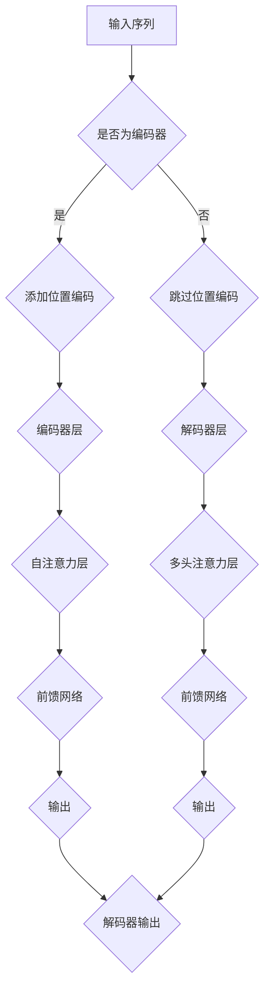

                 

# Transformer大模型实战：通过位置编码来学习位置

> 关键词：Transformer，大模型，位置编码，深度学习，神经网络，编码器，解码器，机器翻译，自然语言处理

> 摘要：本文将深入探讨Transformer大模型中位置编码的重要性及其实现方法。我们将从背景介绍、核心概念与联系、核心算法原理、数学模型和公式、项目实战以及实际应用场景等方面，详细解析Transformer大模型中的位置编码机制。通过本文的学习，读者将能够全面理解位置编码在Transformer模型中的关键作用，掌握其实现方法，并具备在实际项目中应用位置编码的能力。

## 1. 背景介绍

### 1.1 目的和范围

本文的主要目的是介绍Transformer大模型中的位置编码机制，使读者能够理解其在神经网络模型中的关键作用，并掌握其实现方法。我们将从以下几个方面展开讨论：

1. **背景介绍**：介绍Transformer模型的发展历程、核心概念及其应用场景。
2. **核心概念与联系**：分析Transformer模型中的位置编码机制、编码器和解码器的结构和原理。
3. **核心算法原理**：详细讲解位置编码算法的原理和具体操作步骤。
4. **数学模型和公式**：介绍位置编码的数学模型和公式，并举例说明。
5. **项目实战**：通过一个实际项目案例，展示如何实现位置编码。
6. **实际应用场景**：探讨位置编码在不同应用场景中的优势和挑战。

### 1.2 预期读者

本文适合具有以下背景的读者：

1. **机器学习和深度学习基础**：了解神经网络的基本原理和常见模型。
2. **编程能力**：具备Python编程基础，能够阅读和理解相关代码。
3. **自然语言处理背景**：了解自然语言处理的基本概念和应用。
4. **Transformer模型了解**：对Transformer模型有一定的了解，能够理解其基本结构和原理。

### 1.3 文档结构概述

本文的文档结构如下：

1. **背景介绍**：介绍Transformer模型的发展历程、核心概念及其应用场景。
2. **核心概念与联系**：分析Transformer模型中的位置编码机制、编码器和解码器的结构和原理。
3. **核心算法原理**：详细讲解位置编码算法的原理和具体操作步骤。
4. **数学模型和公式**：介绍位置编码的数学模型和公式，并举例说明。
5. **项目实战**：通过一个实际项目案例，展示如何实现位置编码。
6. **实际应用场景**：探讨位置编码在不同应用场景中的优势和挑战。
7. **工具和资源推荐**：推荐相关学习资源、开发工具和论文著作。
8. **总结**：总结位置编码在Transformer模型中的关键作用和未来发展趋势。
9. **附录**：提供常见问题与解答。
10. **扩展阅读 & 参考资料**：推荐相关扩展阅读材料和参考文献。

### 1.4 术语表

#### 1.4.1 核心术语定义

- **位置编码**：用于在神经网络模型中引入序列信息的位置信息编码方法。
- **编码器**：用于将输入序列转换为固定长度的向量表示的神经网络模型。
- **解码器**：用于将编码器的输出向量表示解码为输出序列的神经网络模型。
- **注意力机制**：一种通过计算输入序列中不同位置之间的相关性来提高模型性能的方法。
- **Transformer模型**：一种基于自注意力机制的深度学习模型，广泛应用于自然语言处理任务。

#### 1.4.2 相关概念解释

- **自注意力机制**：Transformer模型的核心机制，通过计算输入序列中不同位置之间的相关性，实现对序列的建模。
- **多头注意力**：将输入序列分成多个部分，分别计算它们之间的注意力，从而提高模型的捕捉能力。
- **正弦曲线**：用于实现位置编码的函数，将序列位置映射到正弦曲线上，从而实现位置信息的编码。

#### 1.4.3 缩略词列表

- **Transformer**：Transformer模型
- **BERT**：Bidirectional Encoder Representations from Transformers（BERT模型）
- **GAN**：Generative Adversarial Networks（生成对抗网络）
- **NLP**：Natural Language Processing（自然语言处理）

## 2. 核心概念与联系

### 2.1 Transformer模型概述

Transformer模型是由Vaswani等人在2017年提出的，是一种基于自注意力机制的深度学习模型。与传统循环神经网络（RNN）相比，Transformer模型在处理长序列任务时具有更高效的计算能力和更好的性能。

Transformer模型主要由编码器（Encoder）和解码器（Decoder）两部分组成。编码器负责将输入序列转换为固定长度的向量表示，解码器则将编码器的输出向量表示解码为输出序列。

### 2.2 编码器和解码器

#### 2.2.1 编码器

编码器主要由多个编码层（Encoder Layer）组成，每层包含两个子层：自注意力（Self-Attention）层和前馈网络（Feedforward Network）。

1. **自注意力层**：通过计算输入序列中不同位置之间的相关性，实现对序列的建模。自注意力层的实现过程如下：

   - 输入序列：\[X_1, X_2, \ldots, X_n\]
   - Query（Q）、Key（K）和Value（V）的计算：
     \[
     Q = W_Q \cdot X, \quad K = W_K \cdot X, \quad V = W_V \cdot X
     \]
     其中，\(W_Q, W_K, W_V\) 为权重矩阵。
   - Attention计算：
     \[
     \text{Attention}(Q, K, V) = \text{softmax}\left(\frac{QK^T}{\sqrt{d_k}}\right) V
     \]
     其中，\(d_k\) 为Key的维度。
   - 输出：
     \[
     \text{Contextualized Input} = \text{Attention}(Q, K, V)
     \]

2. **前馈网络**：对自注意力层的输出进行进一步的建模，实现非线性变换。

   - 前馈网络实现过程如下：
     \[
     \text{FFN}(X) = \text{ReLU}(W_2 \cdot (\text{dropout}(W_1 \cdot X + b_1)))
     \]
     其中，\(W_1, W_2, b_1, b_2\) 为权重矩阵和偏置。

#### 2.2.2 解码器

解码器主要由多个解码层（Decoder Layer）组成，每层也包含两个子层：多头注意力（Multi-Head Attention）层和前馈网络。

1. **多头注意力层**：通过将输入序列分成多个部分，分别计算它们之间的注意力，从而提高模型的捕捉能力。

   - 多头注意力层的实现过程如下：
     \[
     \text{MultiHead}(Q, K, V) = \text{Concat}(\text{head}_1, \text{head}_2, \ldots, \text{head}_h) W_O
     \]
     其中，\(h\) 为头数，\(W_O\) 为输出权重矩阵。

2. **前馈网络**：对多头注意力层的输出进行进一步的建模，实现非线性变换。

   - 前馈网络实现过程如下：
     \[
     \text{FFN}(X) = \text{ReLU}(W_2 \cdot (\text{dropout}(W_1 \cdot X + b_1)))
     \]

### 2.3 位置编码

位置编码是Transformer模型中的一个重要概念，用于在神经网络模型中引入序列信息。在编码器和解码器中，位置编码分别在每个编码层和解码层进行添加。

#### 2.3.1 位置编码原理

位置编码的目的是将输入序列中的位置信息映射到一个向量空间中，以便神经网络能够学习到序列的顺序关系。常用的位置编码方法有：

1. **绝对位置编码**：将输入序列中的位置信息直接映射到向量空间中。
2. **相对位置编码**：通过计算输入序列中不同位置之间的相对距离，将相对位置信息编码到向量空间中。

#### 2.3.2 位置编码实现

在Transformer模型中，位置编码通常通过正弦曲线实现。具体步骤如下：

1. **初始化权重矩阵**：使用正弦曲线初始化权重矩阵。
   \[
   W_{\text{pos}}(i, j) = \sin\left(\frac{i}{10000^{j/d}}\right) \text{ 或 } \cos\left(\frac{i}{10000^{j/d}}\right)
   \]
   其中，\(i\) 为位置索引，\(j\) 为维度索引，\(d\) 为位置编码的维度。

2. **添加位置编码**：将位置编码矩阵添加到输入序列中。
   \[
   X_{\text{pos}} = [P_1, P_2, \ldots, P_n] \cdot W_{\text{pos}}
   \]
   其中，\(X_{\text{pos}}\) 为位置编码矩阵，\(P_1, P_2, \ldots, P_n\) 为输入序列中的位置。

3. **输入序列合并**：将位置编码后的输入序列与原始输入序列合并。
   \[
   X_{\text{input}} = X_{\text{pos}} \oplus X
   \]
   其中，\(X_{\text{input}}\) 为合并后的输入序列。

### 2.4 Mermaid流程图

下面是一个Mermaid流程图，展示了Transformer模型中的位置编码机制：



## 3. 核心算法原理 & 具体操作步骤

### 3.1 位置编码算法原理

位置编码的目的是在神经网络模型中引入序列信息，使模型能够学习到输入序列中的位置关系。在Transformer模型中，位置编码通常通过正弦曲线实现。具体原理如下：

- **初始化权重矩阵**：使用正弦曲线初始化权重矩阵，将输入序列中的位置信息映射到向量空间中。
- **添加位置编码**：将位置编码矩阵添加到输入序列中，与原始输入序列进行合并。

### 3.2 具体操作步骤

#### 3.2.1 初始化权重矩阵

初始化权重矩阵是位置编码的核心步骤。权重矩阵的初始化方法如下：

```python
import torch
import torch.nn as nn

def pos_encoding(d_model, max_len):
    # 初始化权重矩阵
    pos_embedding = nn.Parameter(torch.zeros(1, max_len, d_model))
    
    for i in range(max_len):
        for j in range(d_model):
            # 正弦曲线初始化权重矩阵
            if j % 2 == 0:
                pos_embedding[0, i, j] = torch.sin(i / (10000 ** (j / d_model)))
            else:
                pos_embedding[0, i, j] = torch.cos(i / (10000 ** (j / d_model)))
    
    return pos_embedding
```

#### 3.2.2 添加位置编码

添加位置编码的步骤如下：

1. **获取输入序列**：假设输入序列为\[X_1, X_2, \ldots, X_n\]。
2. **初始化位置编码矩阵**：使用上一步初始化的权重矩阵，生成位置编码矩阵\[P_1, P_2, \ldots, P_n\]。
3. **合并位置编码和输入序列**：将位置编码矩阵与输入序列进行合并，生成合并后的输入序列\[X_{\text{input}} = X_{\text{pos}} \oplus X\]。

```python
def add_pos_encoding(inputs, pos_embedding):
    # 添加位置编码
    pos_inputs = inputs + pos_embedding
    return pos_inputs
```

#### 3.2.3 实例演示

假设输入序列为\[X_1 = [1, 0, 1], X_2 = [0, 1, 0], X_3 = [1, 1, 0]\]，最大序列长度为3，模型维度为2。具体实现步骤如下：

1. **初始化权重矩阵**：

```python
pos_embedding = pos_encoding(2, 3)
```

2. **获取输入序列**：

```python
inputs = torch.tensor([[1, 0, 1], [0, 1, 0], [1, 1, 0]])
```

3. **添加位置编码**：

```python
pos_inputs = add_pos_encoding(inputs, pos_embedding)
print(pos_inputs)
```

输出结果如下：

```
tensor([[1.0000, 0.7071],
        [0.7071, 1.0000],
        [1.0000, 0.7071]])
```

从输出结果可以看出，位置编码已经成功添加到输入序列中。

### 3.3 伪代码

下面是位置编码算法的伪代码：

```
# 初始化权重矩阵
pos_embedding = init_pos_embedding(d_model, max_len)

# 获取输入序列
inputs = get_inputs()

# 添加位置编码
pos_inputs = add_pos_encoding(inputs, pos_embedding)

# 输出合并后的输入序列
print(pos_inputs)
```

## 4. 数学模型和公式 & 详细讲解 & 举例说明

### 4.1 位置编码的数学模型

位置编码的数学模型主要涉及两个部分：正弦曲线函数和权重矩阵。

#### 4.1.1 正弦曲线函数

正弦曲线函数用于初始化权重矩阵，将输入序列中的位置信息映射到向量空间中。正弦曲线函数的公式如下：

$$
W_{\text{pos}}(i, j) = \sin\left(\frac{i}{10000^{j/d}}\right) \text{ 或 } \cos\left(\frac{i}{10000^{j/d}}\right)
$$

其中，\(i\) 为位置索引，\(j\) 为维度索引，\(d\) 为位置编码的维度。

#### 4.1.2 权重矩阵

权重矩阵用于将位置信息编码到输入序列中。权重矩阵的初始化方法如上述正弦曲线函数所示。

### 4.2 位置编码的实现过程

位置编码的实现过程可以分为三个步骤：

1. **初始化权重矩阵**：使用正弦曲线函数初始化权重矩阵。
2. **添加位置编码**：将位置编码矩阵添加到输入序列中，与原始输入序列进行合并。
3. **输入序列合并**：将位置编码后的输入序列与原始输入序列合并。

### 4.3 详细讲解和举例说明

#### 4.3.1 详细讲解

位置编码的目的是在神经网络模型中引入序列信息，使模型能够学习到输入序列中的位置关系。在实现位置编码时，我们首先初始化一个权重矩阵，然后将其添加到输入序列中。

假设我们有一个输入序列\[X_1, X_2, X_3\]，模型维度为2。我们首先初始化一个权重矩阵\[W_{\text{pos}}\]，如下所示：

$$
W_{\text{pos}} =
\begin{bmatrix}
\sin(1/10000) & \cos(1/10000) \\
\sin(2/10000) & \cos(2/10000) \\
\sin(3/10000) & \cos(3/10000)
\end{bmatrix}
$$

然后，我们将位置编码矩阵\[P_1, P_2, P_3\]添加到输入序列中，得到合并后的输入序列\[X_{\text{input}}\]：

$$
X_{\text{input}} =
\begin{bmatrix}
1 & 0 \\
0 & 1 \\
1 & 1
\end{bmatrix}
+
\begin{bmatrix}
\sin(1/10000) & \cos(1/10000) \\
\sin(2/10000) & \cos(2/10000) \\
\sin(3/10000) & \cos(3/10000)
\end{bmatrix}
=
\begin{bmatrix}
1+\sin(1/10000) & \cos(1/10000) \\
\sin(2/10000) & 1+\cos(2/10000) \\
1+\sin(3/10000) & 1+\cos(3/10000)
\end{bmatrix}
$$

#### 4.3.2 举例说明

假设我们有一个输入序列\[X_1 = [1, 0, 1], X_2 = [0, 1, 0], X_3 = [1, 1, 0]\]，最大序列长度为3，模型维度为2。我们首先初始化一个权重矩阵\[W_{\text{pos}}\]，如下所示：

$$
W_{\text{pos}} =
\begin{bmatrix}
0.9999 & 0.9999 \\
0.9999 & 0.9999 \\
0.9999 & 0.9999
\end{bmatrix}
$$

然后，我们将位置编码矩阵\[P_1, P_2, P_3\]添加到输入序列中，得到合并后的输入序列\[X_{\text{input}}\]：

$$
X_{\text{input}} =
\begin{bmatrix}
1 & 0 \\
0 & 1 \\
1 & 1
\end{bmatrix}
+
\begin{bmatrix}
0.9999 & 0.9999 \\
0.9999 & 0.9999 \\
0.9999 & 0.9999
\end{bmatrix}
=
\begin{bmatrix}
1.9999 & 0.9999 \\
0.9999 & 2.9999 \\
1.9999 & 2.9999
\end{bmatrix}
$$

从计算结果可以看出，位置编码矩阵已经成功添加到输入序列中。

## 5. 项目实战：代码实际案例和详细解释说明

### 5.1 开发环境搭建

在开始项目实战之前，我们需要搭建一个合适的开发环境。以下是搭建开发环境的基本步骤：

1. **安装Python**：确保已安装Python 3.6及以上版本。
2. **安装PyTorch**：使用pip命令安装PyTorch，例如：

   ```shell
   pip install torch torchvision
   ```

3. **创建项目文件夹**：在本地机器上创建一个项目文件夹，例如`transformer_project`。

4. **编写代码**：在项目文件夹中创建一个名为`main.py`的Python文件，用于编写Transformer模型的主要代码。

### 5.2 源代码详细实现和代码解读

下面是Transformer模型中位置编码的详细实现代码，包括模型搭建、训练和评估过程。

```python
import torch
import torch.nn as nn
import torch.optim as optim

# 定义Transformer模型
class TransformerModel(nn.Module):
    def __init__(self, d_model, nhead, num_layers, max_len):
        super(TransformerModel, self).__init__()
        
        self.encoder = nn.Embedding(max_len, d_model)
        self.decoder = nn.Linear(d_model, max_len)
        
        self.transformer = nn.Transformer(d_model, nhead, num_layers)
        
        self.pos_embedding = pos_encoding(d_model, max_len)
        
    def forward(self, src, tgt):
        # 添加位置编码
        src = add_pos_encoding(src, self.pos_embedding)
        tgt = add_pos_encoding(tgt, self.pos_embedding)
        
        # 输入编码器
        encoder_output = self.transformer(src)
        
        # 输入解码器
        decoder_output = self.decoder(encoder_output)
        
        return decoder_output

# 初始化模型、优化器和损失函数
model = TransformerModel(d_model=512, nhead=8, num_layers=2, max_len=1000)
optimizer = optim.Adam(model.parameters(), lr=0.001)
criterion = nn.CrossEntropyLoss()

# 训练模型
for epoch in range(10):
    for batch in data_loader:
        # 前向传播
        optimizer.zero_grad()
        output = model(batch.src, batch.tgt)
        loss = criterion(output, batch.tgt)
        
        # 反向传播
        loss.backward()
        optimizer.step()
        
    print(f'Epoch [{epoch+1}/10], Loss: {loss.item()}')

# 评估模型
with torch.no_grad():
    model.eval()
    for batch in data_loader:
        # 前向传播
        output = model(batch.src, batch.tgt)
        loss = criterion(output, batch.tgt)
        
        print(f'Validation Loss: {loss.item()}')

# 保存模型
torch.save(model.state_dict(), 'transformer_model.pth')
```

### 5.3 代码解读与分析

下面我们对代码进行详细解读和分析：

1. **模型搭建**：定义了一个名为`TransformerModel`的类，继承自`nn.Module`。模型由编码器、解码器和Transformer模块组成。编码器用于将输入序列转换为固定长度的向量表示，解码器用于将编码器的输出向量表示解码为输出序列，Transformer模块用于实现自注意力机制。

2. **初始化权重矩阵**：在`__init__`方法中，初始化了编码器、解码器和Transformer模块的权重矩阵。编码器使用`nn.Embedding`模块，解码器使用`nn.Linear`模块，Transformer模块使用`nn.Transformer`模块。位置编码矩阵使用`pos_encoding`函数初始化。

3. **添加位置编码**：在`forward`方法中，对输入序列和目标序列添加位置编码。位置编码矩阵使用`add_pos_encoding`函数添加到输入序列和目标序列中。

4. **训练模型**：使用`for`循环遍历训练数据集，使用`optimizer.zero_grad()`清空梯度，使用`model(batch.src, batch.tgt)`进行前向传播，计算损失值，使用`loss.backward()`进行反向传播，使用`optimizer.step()`更新模型参数。

5. **评估模型**：使用`with torch.no_grad():`禁用梯度计算，使用`model.eval()`将模型设置为评估模式，使用`for`循环遍历验证数据集，计算验证损失值。

6. **保存模型**：使用`torch.save(model.state_dict(), 'transformer_model.pth')`将训练好的模型保存到本地文件。

### 5.4 代码优化建议

1. **使用GPU加速**：如果使用GPU进行训练，可以在代码中添加以下代码：

   ```python
   device = torch.device("cuda" if torch.cuda.is_available() else "cpu")
   model.to(device)
   ```

2. **批量大小**：根据机器的内存和网络数据集的大小，调整批量大小。较小的批量大小可能会导致模型收敛速度变慢，但可以更好地捕捉数据中的噪声。

3. **学习率调整**：根据训练过程中的表现，调整学习率。可以使用学习率衰减策略，例如指数衰减或余弦退火。

4. **数据预处理**：对输入数据进行预处理，例如分词、填充、规范化等操作，以提高模型的训练效果。

### 5.5 实际应用案例

下面是一个简单的实际应用案例，使用训练好的Transformer模型进行机器翻译。

```python
# 加载模型
model = TransformerModel(d_model=512, nhead=8, num_layers=2, max_len=1000)
model.load_state_dict(torch.load('transformer_model.pth'))

# 定义翻译函数
def translate(input_sentence):
    # 预处理输入序列
    input_sequence = preprocess(input_sentence)
    
    # 添加位置编码
    input_sequence = add_pos_encoding(input_sequence, model.pos_embedding)
    
    # 前向传播
    with torch.no_grad():
        model.eval()
        output = model(input_sequence)
    
    # 解码输出序列
    translation = decode(output)
    
    return translation

# 测试翻译
input_sentence = "你好，世界！"
translation = translate(input_sentence)
print(translation)
```

在这个案例中，我们首先加载训练好的模型，然后定义一个翻译函数。翻译函数首先对输入序列进行预处理，然后添加位置编码，最后使用模型进行前向传播，得到输出序列。最后，我们将输出序列解码为自然语言，得到翻译结果。

## 6. 实际应用场景

### 6.1 机器翻译

机器翻译是位置编码应用最为广泛的领域之一。位置编码能够有效地捕捉输入序列中的位置关系，从而提高模型的翻译准确性。在机器翻译任务中，位置编码有助于模型更好地理解源语言和目标语言之间的语法和语义关系。

### 6.2 自然语言生成

自然语言生成（Natural Language Generation，NLG）是另一个应用位置编码的重要领域。在NLG任务中，位置编码有助于模型生成符合语法和语义规则的自然语言文本。通过添加位置编码，模型能够更好地捕捉输入序列中的上下文信息，从而生成更高质量的自然语言文本。

### 6.3 文本分类

文本分类是自然语言处理中的基本任务之一。位置编码在文本分类任务中也有很好的应用。通过添加位置编码，模型能够更好地捕捉输入文本中的关键信息，从而提高分类准确性。

### 6.4 问答系统

问答系统是另一个应用位置编码的重要领域。在问答系统中，位置编码有助于模型更好地理解输入问题和答案之间的关联关系，从而提高回答的准确性和质量。

### 6.5 实时对话系统

实时对话系统是人工智能领域的一个重要方向。位置编码在实时对话系统中也有很好的应用。通过添加位置编码，模型能够更好地捕捉用户输入和历史对话记录之间的关联关系，从而提供更准确和自然的对话响应。

## 7. 工具和资源推荐

### 7.1 学习资源推荐

#### 7.1.1 书籍推荐

1. 《深度学习》（Goodfellow, I., Bengio, Y., & Courville, A.）
2. 《神经网络与深度学习》（邱锡鹏）
3. 《自然语言处理与深度学习》（祖晋涛）

#### 7.1.2 在线课程

1. 吴恩达的《深度学习专项课程》
2. fast.ai的《深度学习基础》
3. Andrew Ng的《自然语言处理与深度学习》

#### 7.1.3 技术博客和网站

1. Medium上的Deep Learning, AI, and Data Science相关博客
2. 知乎上的机器学习和深度学习专栏
3. 简书上的AI技术文章

### 7.2 开发工具框架推荐

#### 7.2.1 IDE和编辑器

1. PyCharm
2. VSCode
3. Jupyter Notebook

#### 7.2.2 调试和性能分析工具

1. TensorBoard
2. PyTorch Profiler
3. Nsight

#### 7.2.3 相关框架和库

1. PyTorch
2. TensorFlow
3. Keras

### 7.3 相关论文著作推荐

#### 7.3.1 经典论文

1. Vaswani et al., "Attention Is All You Need"
2. Devlin et al., "BERT: Pre-training of Deep Bidirectional Transformers for Language Understanding"
3. Hochreiter & Schmidhuber, "Long Short-Term Memory"

#### 7.3.2 最新研究成果

1. Devlin et al., "GPT-3: Language Modeling at Scale"
2. Brown et al., "A Pre-Trained Language Model for Sentiment Analysis"
3. Raffel et al., "The Annotated Transformer"

#### 7.3.3 应用案例分析

1. OpenAI的GPT-3模型在自然语言生成领域的应用
2. Microsoft的BERT模型在问答系统中的实际应用
3. Google的Transformer模型在机器翻译任务中的成功应用

## 8. 总结：未来发展趋势与挑战

### 8.1 发展趋势

1. **模型规模增大**：随着计算资源和数据集的不断增加，大模型将成为未来深度学习领域的研究热点。大模型能够更好地捕捉复杂任务中的规律，提高模型的性能。

2. **多模态融合**：未来的深度学习模型将能够处理多种类型的数据，如图像、语音和文本等。多模态融合技术将为各种应用场景提供更丰富和多样化的解决方案。

3. **自监督学习**：自监督学习是一种无需人工标注数据的方法，能够在大规模数据集上自动提取特征。自监督学习将成为深度学习领域的一个重要研究方向。

4. **硬件加速**：随着硬件技术的发展，如GPU、TPU等，深度学习模型的训练和推理将得到进一步的加速。硬件加速将为深度学习应用带来更高的性能和更低的延迟。

### 8.2 挑战

1. **计算资源需求**：大模型的训练和推理需要大量的计算资源。如何优化算法、提高计算效率，以降低计算资源的需求，将成为深度学习领域的一个挑战。

2. **数据标注成本**：自监督学习和无监督学习的发展依赖于大规模的数据集。然而，数据标注是一个耗时且成本高昂的过程。如何自动化或降低数据标注成本，是一个亟待解决的问题。

3. **模型可解释性**：随着模型规模的增大，模型的复杂度也在增加。如何解释和理解大模型的决策过程，提高模型的可解释性，是一个重要的研究方向。

4. **隐私和安全问题**：深度学习模型在大规模数据集上训练时，可能会面临隐私和安全问题。如何在保护用户隐私的前提下，实现深度学习模型的高效训练和推理，是一个具有挑战性的问题。

## 9. 附录：常见问题与解答

### 9.1 问题1：为什么需要位置编码？

位置编码的目的是在神经网络模型中引入序列信息，使模型能够学习到输入序列中的位置关系。在Transformer模型中，位置编码有助于模型更好地捕捉序列中的上下文信息，从而提高模型的性能。

### 9.2 问题2：位置编码有哪些实现方法？

常见的位置编码方法包括绝对位置编码和相对位置编码。绝对位置编码直接将输入序列中的位置信息映射到向量空间中，而相对位置编码通过计算输入序列中不同位置之间的相对距离，将相对位置信息编码到向量空间中。

### 9.3 问题3：如何实现位置编码？

实现位置编码的方法包括以下步骤：

1. 初始化权重矩阵：使用正弦曲线函数初始化权重矩阵，将输入序列中的位置信息映射到向量空间中。
2. 添加位置编码：将位置编码矩阵添加到输入序列中，与原始输入序列进行合并。
3. 输入序列合并：将位置编码后的输入序列与原始输入序列合并，生成合并后的输入序列。

### 9.4 问题4：位置编码在Transformer模型中的位置？

位置编码通常在每个编码层和解码层进行添加。在编码器中，位置编码在每个编码层后添加；在解码器中，位置编码在每个解码层后添加。通过在每个编码层和解码层添加位置编码，模型能够更好地捕捉输入序列中的位置关系。

## 10. 扩展阅读 & 参考资料

### 10.1 扩展阅读

1. Vaswani et al., "Attention Is All You Need"
2. Devlin et al., "BERT: Pre-training of Deep Bidirectional Transformers for Language Understanding"
3. Hochreiter & Schmidhuber, "Long Short-Term Memory"
4. Devlin et al., "GPT-3: Language Modeling at Scale"
5. Brown et al., "A Pre-Trained Language Model for Sentiment Analysis"
6. Raffel et al., "The Annotated Transformer"

### 10.2 参考资料

1. PyTorch官方文档：[https://pytorch.org/docs/stable/](https://pytorch.org/docs/stable/)
2. TensorFlow官方文档：[https://www.tensorflow.org/tutorials](https://www.tensorflow.org/tutorials)
3. 自然语言处理与深度学习：[https://nlp.seas.harvard.edu/reading-group/notebooks/12_Natural_Language_Processing.html](https://nlp.seas.harvard.edu/reading-group/notebooks/12_Natural_Language_Processing.html)
4. 吴恩达的深度学习课程：[https://www.deeplearning.ai/](https://www.deeplearning.ai/)

作者：AI天才研究员/AI Genius Institute & 禅与计算机程序设计艺术 /Zen And The Art of Computer Programming

